# Sollu App - Point of Sale (SaaS)

Sollu POS adalah aplikasi Point of Sale berbasis SaaS yang dirancang khusus untuk bisnis dengan model multi-outlet. Setiap merchant dapat mengelola satu atau lebih outlet dengan sistem langganan (subscription) yang fleksibel.

## 🚀 Fitur Utama
- **Multi-Outlet Management:** Kelola beberapa cabang toko dalam satu akun merchant.
- **Sistem Langganan (SaaS):** Fleksibilitas paket berlangganan untuk merchant.
- **Role & Permission:** Hak akses sistem yang komprehensif untuk pemilik, manajer, dan kasir (menggunakan Spatie).
- **Payment Gateway Integration:** Mendukung pembayaran online terintegrasi (Midtrans).
- **Ekspor Dokumen:** Cetak struk dan laporan dalam format PDF.
- **Dashboard & Analitik:** Visualisasi data interaktif menggunakan Chart.js.

## 🛠️ Teknologi yang Digunakan

**Backend:**
- [Laravel 11](https://laravel.com/) (PHP ^8.3)
- [Spatie Permission](https://spatie.be/docs/laravel-permission/v6/introduction) (Manajemen role & permission)
- [Midtrans PHP](https://midtrans.com/) (Payment gateway)
- [DomPDF](https://github.com/barryvdh/laravel-dompdf) (Pembuatan dokumen PDF)
- Redis / Predis (Caching & Queue)

**Frontend:**
- [Vue 3](https://vuejs.org/) (Composition API)
- [Inertia.js](https://inertiajs.com/) (Penghubung backend dan frontend)
- [Tailwind CSS v4](https://tailwindcss.com/) (Styling framework)
- [Pinia](https://pinia.vuejs.org/) (State management)
- [Ziggy](https://github.com/tighten/ziggy) (Penggunaan route Laravel di Vue)
- **Modul Tambahan:** FontAwesome, Chart.js, Swiper, Quill Editor, Vue Draggable.

## 🏗️ High-Level Architecture

Aplikasi ini menggunakan arsitektur **Monolitik Modern** (Monolith with SPA Frontend) dengan Inertia.js sebagai penghubung antara frontend dan backend.

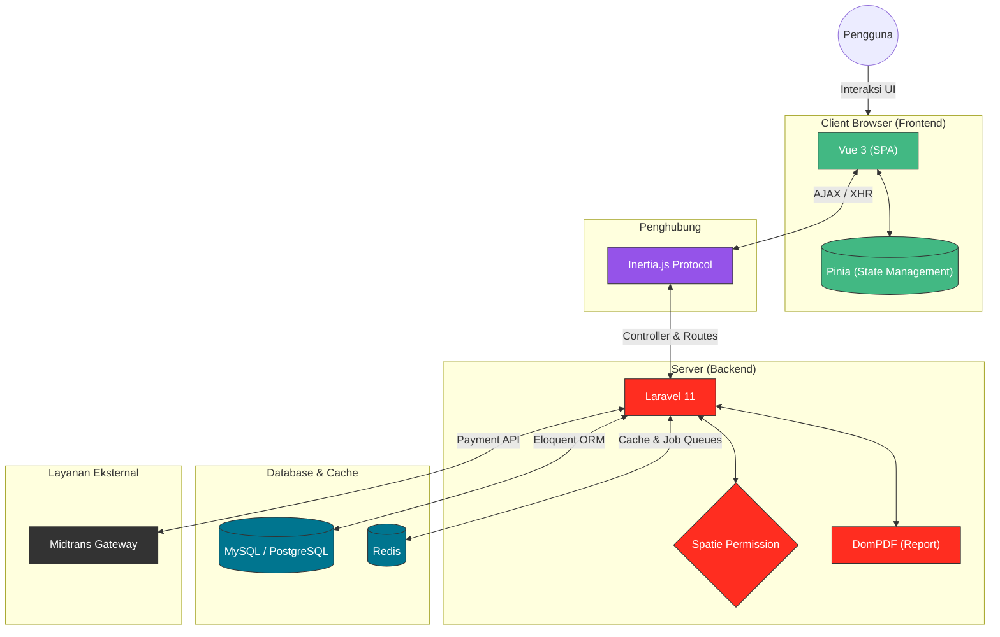

1. **Client Layer (Vue 3 SPA):**
   - Berjalan di browser pengguna, menangani interaktivitas UI secara langsung.
   - Menggunakan **Pinia** untuk local state management.
   - Meminta data atau navigasi halaman melalui request XHR/Fetch ke backend (via Inertia).
2. **Bridge Layer (Inertia.js):**
   - Menghilangkan kebutuhan untuk membuat REST/GraphQL API terpisah.
   - Mencegah *full page reload* (SPA experience) dengan me-render komponen Vue berdasarkan *props* data yang dikirim oleh controller Laravel.
3. **Backend & Business Logic Layer (Laravel 11):**
   - Menangani proses inti bisnis (transaksi POS, manajemen inventaris, langganan).
   - Validasi input, autentikasi sesi pengguna, dan otorisasi dengan **Spatie Permission**.
   - Integrasi eksternal seperti **Midtrans** untuk pembayaran dan pembuatan PDF (DomPDF).
4. **Data Layer (Database & Cache):**
   - **RDBMS (MySQL/PostgreSQL):** Menyimpan data persisten seperti user, merchant, produk, dan transaksi.
   - **Redis (Cache & Queue):** Digunakan untuk menyimpan cache sementara dan menangani background jobs asinkron, seperti pengiriman email notifikasi atau pembuatan laporan dalam skala besar.

### 🔄 Internal Service Communication

Backend aplikasi ini mengadopsi pola arsitektur **Pragmatis (Mixed Architecture)**. Untuk menghindari *over-engineering*, pola yang digunakan disesuaikan dengan tingkat kerumitan suatu fitur:

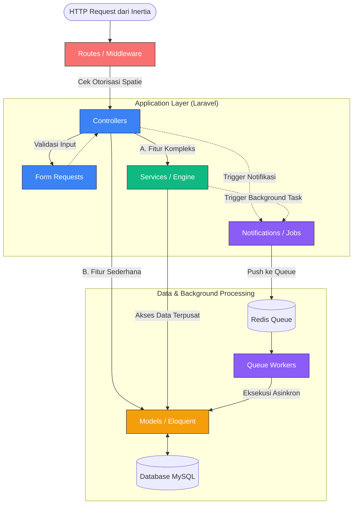

**Penjelasan Alur Kerja:**
- **Routes & Middleware:** Pintu masuk request yang bertugas memverifikasi autentikasi dan peran menggunakan Spatie Permission.
- **FormRequests:** Validasi input dipisahkan ke dalam FormRequest khusus (misal: `StoreUserRequest`) agar *controller* bersih dari aturan validasi.
- **Controllers & Models (CRUD Sederhana):** Untuk fitur CRUD dasar (seperti manajemen Karyawan/Master Data), Controller langsung berinteraksi dengan **Eloquent Models** yang dibungkus menggunakan `DB::transaction()`.
- **Services (Logika Kompleks):** Untuk fitur yang memuat aturan bisnis berbelit atau pemanggilan API pihak ketiga (seperti `BillingEngine`, `MidtransService`), Controller akan mendelegasikan pemrosesan ke *Service layer*.
- **Notifications & Jobs:** Proses pengiriman email (seperti `NewEmployee` notification), pembuatan laporan PDF massal, atau perhitungan langganan dijalankan di *background* lewat antrean (Redis Queue) untuk menjaga respon aplikasi tetap cepat.

### 📦 Struktur Layanan Utama (Service Layer)

Aplikasi ini menggunakan pola pelayanan (*Service Pattern*) untuk memusatkan *Business Logic*. Berikut adalah **Arsitektur Besar** (Global) yang memetakan relasi antar-modul secara makro, di mana fokus utamanya hanya pada `app/Services`:

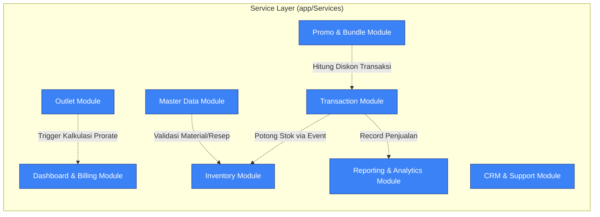

---

#### 1. Dashboard & Billing Module
Mengelola logika langganan, pembuatan tagihan, dan integrasi Midtrans.

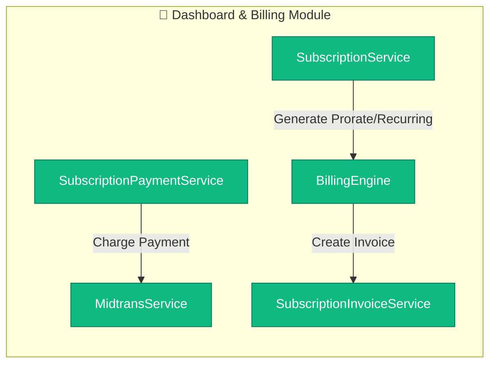

#### 2. Inventory Module
Menangani penyesuaian stok, mutasi gudang/outlet, dan Material Mentah.

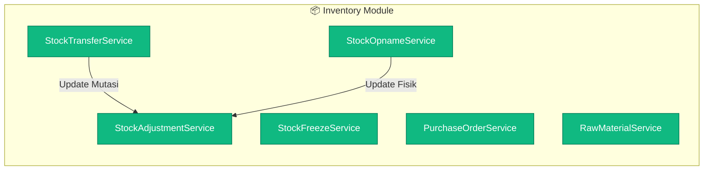

#### 3. Outlet Management
Mengatur pembuatan outlet baru, jam operasional, dan pengelolaan perangkat/kasir.

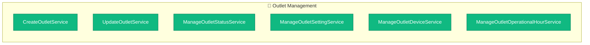

#### 4. Master Data
Menangani komponen data esensial operasional bisnis (*Master Data Management*).

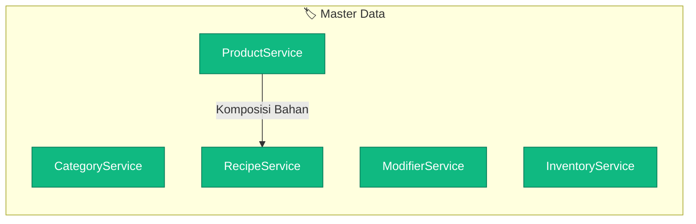

#### 5. Transaction Module (POS)
Mengelola inti proses checkout Kasir/POS, pencatatan transaksi, pembayaran (tunai/non-tunai), dan pembuatan struk/faktur. Modul ini secara asinkron akan memicu modul Inventori ketika produk terjual.

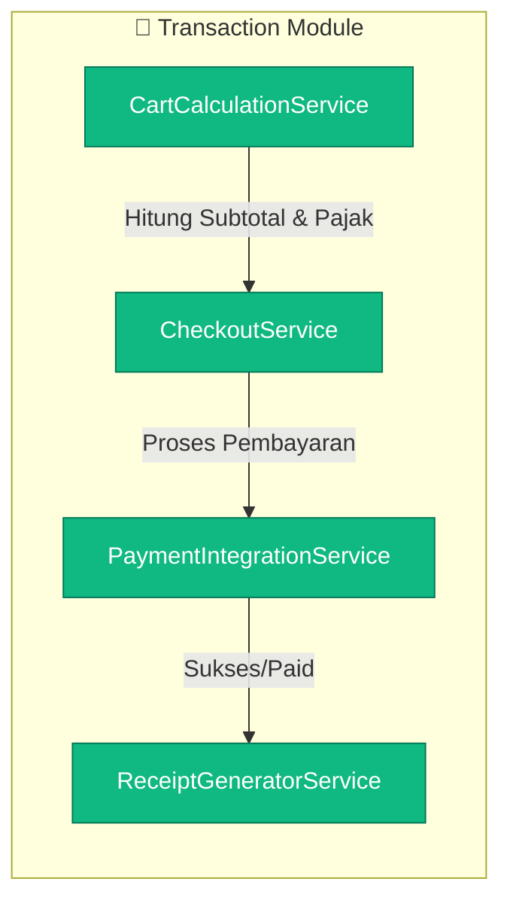

#### 6. Promo & Bundle Module
Memvalidasi kupon promosi, paket bundle dinamis, dan kalkulasi potongan harga berdasarkan syarat promo sebelum *checkout*.

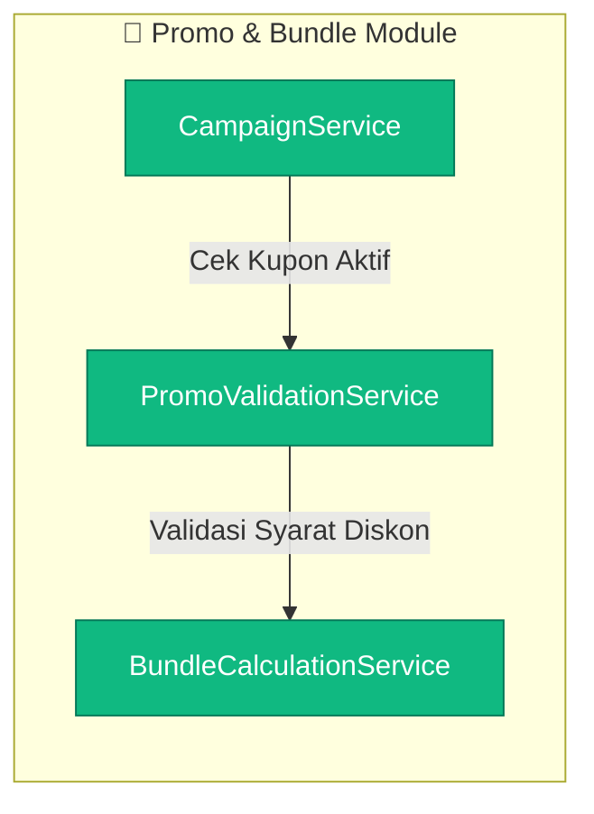

#### 7. Reporting & Analytics Module
Merangkum data penjualan operasional harian, laporan histori pergerakan stok, hingga performa *merchant churn rate* yang disajikan secara terpusat untuk Dashboard atau Cockpit Admin.

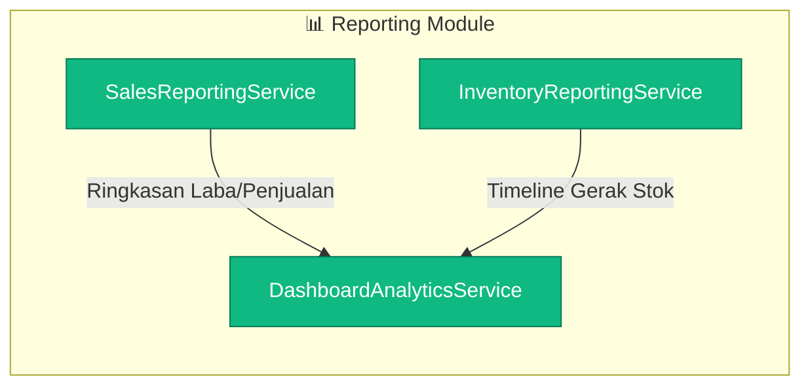

#### 8. CRM & Customer Support Module
Menyimpan rekam jejak pembeli, mengatur program poin loyalitas (Loyalty Points), serta menyediakan *Customer Support Console* (Ticketing) bagi merchant.

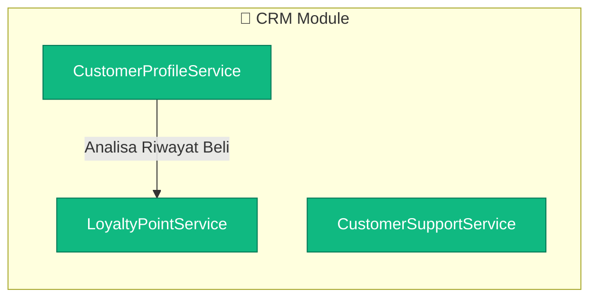

## ⚙️ Persyaratan Sistem

Pastikan sistem Anda memenuhi persyaratan berikut sebelum melakukan instalasi:
- **PHP** >= 8.3
- **Composer** (versi terbaru)
- **Node.js** (NPM V22 atau yang lebih baru)
- **Database** (MySQL / PostgreSQL / SQLite)
- **Redis** (Opsional, direkomendasikan untuk environment produksi)

## 📦 Instalasi & Setup

Ikuti langkah-langkah di bawah ini untuk menjalankan proyek di komputer lokal Anda:

1. **Kloning Repositori**
   ```bash
   git clone <url-repo-anda> sollu-app
   cd sollu-app
   ```

2. **Install Dependensi Backend (PHP)**
   ```bash
   composer install
   ```

3. **Install Dependensi Frontend (Node.js)**
   ```bash
   npm install
   ```

4. **Konfigurasi Environment**
   Copy file `.env.example` menjadi `.env` lalu sesuaikan konfigurasi database dan kredensial lainnya.
   ```bash
   cp .env.example .env
   ```
   *Jangan lupa generate application key:*
   ```bash
   php artisan key:generate
   ```

5. **Migrasi dan Seeding Database**
   Jalankan perintah berikut untuk membuat struktur tabel dan mengisi data awal yang dibutuhkan aplikasi:
   ```bash
   php artisan migrate
   php artisan db:seed --class=RolePermissionSeeder
   php artisan db:seed --class=MerchantTypeSeeder
   php artisan db:seed --class=SubscriptionPlanSeeder
   php artisan db:seed --class=UnitSeeder
   php artisan db:seed --class=DummySeeder
   ```

6. **Menjalankan Aplikasi (Development)**
   Buka 2 terminal terpisah dan jalankan perintah berikut:

   Terminal 1 (Menjalankan server Laravel):
   ```bash
   php artisan serve
   ```

   Terminal 2 (Menjalankan Vite asset bundler):
   ```bash
   npm run dev
   ```
   
   Aplikasi dapat diakses melalui `http://localhost:8000`.

## 📜 Lisensi
Aplikasi ini bersifat tertutup (Proprietary). Hak cipta dilindungi.
