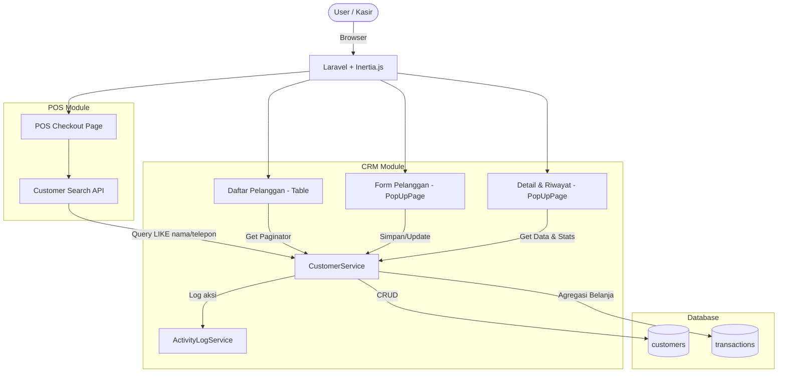
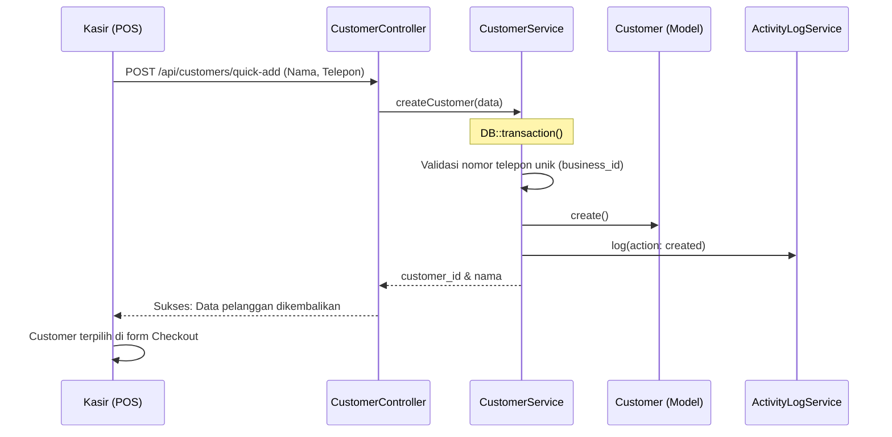
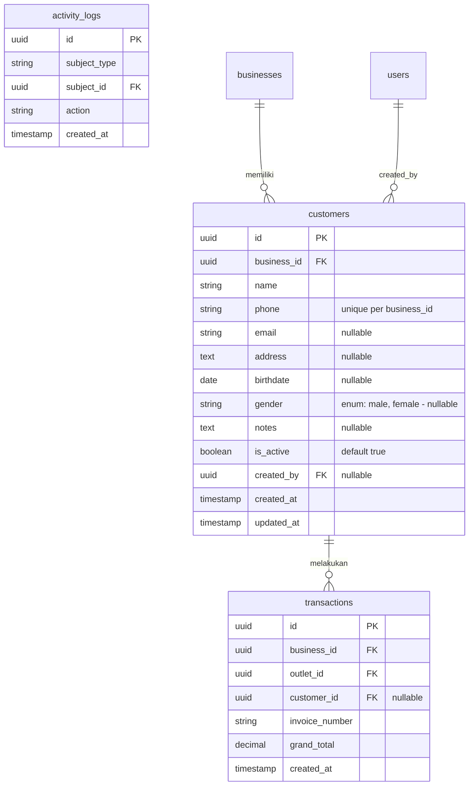

**Bold**# PRD — CRM (Manajemen Pelanggan) V1

## 1. Overview

Modul CRM (Customer Relationship Management) V1 bertanggung jawab untuk mengelola data pelanggan (customer) pada ekosistem Sollu POS. Modul ini memungkinkan bisnis untuk menyimpan database pelanggan secara terpusat, mengaitkan pelanggan dengan transaksi di kasir, serta memantau riwayat dan kebiasaan belanja setiap pelanggan. Pada fase pertama ini, fokus utama adalah pada operasional dasar CRUD pelanggan, pencarian cepat saat transaksi (checkout), dan kalkulasi ringkasan belanja (total transaksi, total pengeluaran, rata-rata belanja, dan transaksi terakhir). Fitur lanjutan seperti poin loyalitas dan segmentasi belum termasuk pada fase ini.

---

## 2. Requirements

- **Manajemen Data Pelanggan:** Sistem harus mendukung pembuatan (Create), pembacaan (Read), pengubahan (Update), dan penghapusan (Delete) data pelanggan.
- **Data Pelanggan (Customer Data):** Atribut wajib untuk pelanggan adalah Nama dan Nomor Telepon. Nomor telepon harus unik di dalam satu bisnis (`business_id`, `phone`). Atribut opsional meliputi Email, Alamat, Tanggal Lahir, Jenis Kelamin, dan Catatan.
- **Pencarian Cepat (Quick Search):** Harus tersedia komponen Select2/Searchable Select di antarmuka kasir (POS) untuk mencari pelanggan berdasarkan nama atau nomor telepon secara real-time.
- **Pengaitan Transaksi (Attach to Transaction):** Kasir dapat memilih pelanggan saat proses checkout. ID pelanggan (`customer_id`) akan disimpan pada data `transactions`.
- **Riwayat Transaksi Pelanggan:** Sistem dapat menampilkan daftar transaksi yang pernah dilakukan oleh pelanggan tertentu, diambil dari tabel `transactions` berdasarkan `customer_id`.
- **Ringkasan Belanja (Customer Summary):** Sistem dapat menghitung dan menampilkan metrik belanja pelanggan secara dinamis, meliputi:
    - **Total Transaksi:** Jumlah struk/transaksi pelanggan.
    - **Total Belanja:** Akumulasi nilai transaksi (grand total).
    - **Rata-rata Belanja:** Total belanja dibagi jumlah transaksi.
    - **Transaksi Terakhir:** Tanggal transaksi terakhir yang dilakukan pelanggan.
- **Status Aktif:** Pelanggan memiliki status `is_active` (boolean, default true). Pelanggan yang dihapus (soft delete atau di-set inaktif) tidak akan muncul di pencarian POS.
- **Import/Export:** Sistem menyediakan kemampuan untuk melakukan ekspor (Export) data pelanggan ke format CSV/Excel, serta mengimpor (Import) data pelanggan baru dari file CSV.
- **Activity Logging:** Setiap perubahan data pelanggan (Create, Update, Delete) dicatat oleh `ActivityLogService`.

---

## 3. Core Features

- **Daftar Pelanggan (Customer List):** Halaman tabel yang menampilkan seluruh data pelanggan dalam bisnis beserta filter (status aktif, dll) dan pencarian.
- **Detail Pelanggan (PopUpPage):** Tampilan detail yang memuat profil pelanggan, ringkasan metrik belanja, dan daftar riwayat transaksi terakhir.
- **Tambah / Edit Pelanggan (PopUpPage):** Form untuk menginput data profil pelanggan baru atau mengubah data yang sudah ada.
- **Pencarian POS (POS Search):** Integrasi di halaman Kasir (Checkout) untuk mencari pelanggan dan menempelkannya ke transaksi yang sedang berlangsung.
- **Impor & Ekspor Data:** Fitur untuk mengunduh template CSV, mengunggah data CSV untuk mass-insert, serta mengekspor data grid yang difilter.

---

## 4. User Flow

### **Menambah Pelanggan Baru (Backoffice)**

1. User (GM/Owner/Cashier) masuk ke menu **Pelanggan > Daftar Pelanggan**.
2. User klik tombol **Tambah Pelanggan**.
3. Sistem menampilkan form PopUpPage dengan field:
    - **Nama Lengkap** (wajib)
    - **Nomor Telepon** (wajib, hanya angka)
    - **Email** (opsional)
    - **Alamat** (opsional, Textarea)
    - **Tanggal Lahir** (opsional, Datepicker)
    - **Jenis Kelamin** (opsional, Radio/Dropdown: Laki-laki / Perempuan)
    - **Catatan** (opsional, Textarea)
4. User mengisi form lalu klik **Simpan**.
5. Sistem memvalidasi keunikan nomor telepon di bisnis yang sama.
6. Sistem menyimpan data ke tabel `customers` dan mencatat `activity_logs`.
7. PopUp ditutup, tabel pelanggan memuat ulang data dengan pesan sukses "Pelanggan berhasil ditambahkan."

### **Mengaitkan Pelanggan pada Transaksi (POS)**

1. Kasir berada di halaman Checkout aplikasi POS.
2. Pada bagian detail pesanan, terdapat field **Pelanggan (Opsional)** berupa Searchable Select.
3. Kasir mengetik nama atau nomor telepon (minimal 3 karakter).
4. Sistem memanggil API pencarian pelanggan aktif dan mengembalikan hasil secara instan.
5. Kasir memilih pelanggan dari daftar dropdown.
6. (Opsional) Jika pelanggan tidak ditemukan, kasir dapat menekan tombol **+ Pelanggan Baru** dari halaman kasir yang akan memunculkan form singkat (Nama, Nomor Telepon) untuk menambah secara cepat.
7. Saat transaksi diselesaikan (dibayar), `customer_id` disimpan ke tabel `transactions`.

### **Melihat Detail & Riwayat Pelanggan**

1. User masuk ke menu **Pelanggan > Daftar Pelanggan**.
2. User mengklik salah satu baris pelanggan di tabel.
3. Sistem membuka **PopUpPage Detail Pelanggan**.
4. Halaman menampilkan:
    - **Profil:** Nama, No. Telepon, Email, Umur (dihitung dari tanggal lahir), Alamat, Catatan.
    - **Ringkasan Belanja:** Total Transaksi, Total Belanja, Rata-rata, Transaksi Terakhir (dihitung agregasi on-the-fly atau di-cache dari tabel `transactions`).
    - **Riwayat Transaksi:** Tabel mini berisi max 10 transaksi terakhir (No. Invoice, Tanggal, Outlet, Total).
5. User dapat menekan tombol **Edit** untuk mengubah profil atau menutup PopUpPage.

---

## 5. Architecture

Modul CRM menggunakan pendekatan **Modular Monolith** dengan Controller → Service → Model. Data statistik (ringkasan) pelanggan dihitung dari relasi ke tabel `transactions`.

### Sequence Diagram — Tambah Pelanggan di Kasir

---

## 6. Database Schema

### Tabel yang Digunakan

**Tabel Baru:**

- `customers` (**NEW**) — Menyimpan master data pelanggan per bisnis.

**Tabel Existing yang Digunakan:**

- `transactions` — Sudah ada, ditambahkan/digunakan foreign key `customer_id` nullable yang merujuk ke tabel `customers`.
- `activity_logs` — Audit trail via `ActivityLogService`.

### Catatan Desain Penting

| Aspek                     | Detail                                                                                                                                                                                                                                 |
| ------------------------- | -------------------------------------------------------------------------------------------------------------------------------------------------------------------------------------------------------------------------------------- |
| **Unique Constraint**     | Kombinasi `(business_id, phone)` dipastikan unik baik di level database mapun validasi request                                                                                                                                         |
| **Relasi Transaksi**      | `transactions` memiliki `customer_id` (nullable). Jika bukan null, transaksi tersebut dihitung dalam riwayat dan statistik pelanggan                                                                                                   |
| **Perhitungan Statistik** | Saat ini statistik (Total Transaksi, Total Belanja) dihitung secara langsung menggunakan query agregasi relasi `transactions` demi keakuratan. Di fase mendatang jika data membesar, dapat diekstraksi ke _summary table_ atau _cache_ |
| **Soft Delete / Inaktif** | Penghapusan pelanggan mungkin tidak dibolehkan jika sudah memiliki transaksi. Gunakan `is_active = false` sebagai soft-delete agar integritas transaksi lama tetap terjaga, namun tidak muncul di pencarian POS                        |

---

## 7. Tech Stack

- **Frontend:** Vue 3 (Composition API `<script setup>`) + Tailwind CSS v4 + Inertia.js. Form dan detail menggunakan `PopUpPage`. Halaman daftar menggunakan `MainPage > MainPageHeader + Table + Pagination`. Form components meliputi `TextField`, `TextareaField`, `DropdownField`, dan pencarian menggunakan `Select2`/`SearchableSelect`.
- **Backend:** Laravel 11 (PHP 8.3). Controller → Service → Model.
- **Services:**
    - `CustomerService` — Logika inti:
        - `getPaginated()`: Mengambil daftar pelanggan.
        - `getSummaryStats(customerId)`: Menghitung total belanja, jumlah transaksi, transaksi terakhir.
        - `createCustomer()`: Membuat pelanggan baru.
        - `updateCustomer()`: Update data pelanggan.
        - `deleteCustomer()`: Cek apakah bisa dihapus, atau set inaktif.
        - `searchActiveCustomers()`: Digunakan oleh API Select2 di POS.
- **Request Validation:**
    - `StoreCustomerRequest` / `UpdateCustomerRequest`:
        - `name` (required, string, max:255)
        - `phone` (required, string, max:20, unique:customers,phone,NULL,id,business_id,X)
        - `email` (nullable, email)
        - `birthdate` (nullable, date)
        - `gender` (nullable, in:male,female)
- **Enums (PHP):**
    - `CustomerGender` — `Male = 'male'`, `Female = 'female'`. Method `label()`: Laki-laki, Perempuan.
- **Model:** `Customer` (NEW). Relasi `transactions()` HasMany.
- **Database:** PostgreSQL, UUID primary key.
- **Authorization:** Spatie Laravel Permission.
- **Routes:**
    - `GET /customers` — daftar pelanggan
    - `POST /customers` — tambah pelanggan
    - `PUT /customers/{id}` — edit pelanggan
    - `DELETE /customers/{id}` — hapus pelanggan
    - `GET /customers/{id}` — detail dan summary (PopUpPage)
    - `GET /api/customers/search` — pencarian POS (JSON format)
    - `POST /customers/import` — import CSV
    - `GET /customers/export` — export CSV

---

## 8. Hak Akses (Authorization)

Modul ini menggunakan permissions existing yang sudah didefinisikan:

| Permission        | General Manager | Outlet Manager | Kasir | Waiter |
| ----------------- | --------------- | -------------- | ----- | ------ |
| `customer.view`   | Ya              | Ya             | Ya    | Ya     |
| `customer.create` | Ya              | Tidak          | Ya    | Tidak  |
| `customer.update` | Ya              | Tidak          | Tidak | Tidak  |
| `customer.delete` | Ya              | Tidak          | Tidak | Tidak  |
| `report.customer` | Ya              | Tidak          | Tidak | Tidak  |

_Catatan: Role **Owner** memiliki semua permission di atas secara default._

---

## 9. Validasi & Error Handling

| Skenario              | Validasi                   | Pesan Error (Bahasa Indonesia)                                                                                   |
| --------------------- | -------------------------- | ---------------------------------------------------------------------------------------------------------------- |
| Nama Kosong           | `required`                 | "Nama pelanggan wajib diisi."                                                                                    |
| Telepon Kosong        | `required`                 | "Nomor telepon wajib diisi."                                                                                     |
| Telepon Tidak Unik    | `unique` per `business_id` | "Nomor telepon ini sudah terdaftar di bisnis Anda."                                                              |
| Format Email Salah    | `email`                    | "Format email tidak valid."                                                                                      |
| Hapus Pelanggan Aktif | Cek relasi                 | "Pelanggan tidak dapat dihapus karena sudah memiliki riwayat transaksi. Anda dapat menonaktifkan pelanggan ini." |
| Cari Pelanggan POS    | Term < 3 huruf             | (Pencarian baru tertrigger ketika > 3 karakter diketik)                                                          |

---

## 10. UI Components Reference

### Halaman Daftar Pelanggan

**Header:** "Pelanggan" dengan tombol **Tambah Pelanggan** (btn-main) dan **Ekspor** (btn-outline).

**Kolom Tabel:**

| Kolom           | Sumber Data           | Keterangan                                                         |
| --------------- | --------------------- | ------------------------------------------------------------------ |
| Nama            | `customers.name`      | Tampil tebal                                                       |
| No. Telepon     | `customers.phone`     | Format standar                                                     |
| Email           | `customers.email`     | Jika kosong tampil "-"                                             |
| Total Transaksi | `transactions_count`  | Jumlah kedatangan (opsional ditampilkan di tabel, wajib di detail) |
| Status          | `customers.is_active` | Badge: Aktif (Hijau), Tidak Aktif (Abu-abu)                        |
| Aksi            | -                     | Ikon Mata (Detail), Pensil (Edit), Trash (Hapus)                   |

**Filter:**

- Pencarian (Search Input): Mencari berdasarkan nama atau telepon.
- Status (Dropdown): Semua, Aktif, Tidak Aktif.

### Form Tambah/Edit (PopUpPage)

| Field          | Tipe Komponen      | Wajib | Keterangan              |
| -------------- | ------------------ | ----- | ----------------------- |
| Nama Lengkap   | `TextField`        | Ya    | -                       |
| Nomor Telepon  | `TextField`        | Ya    | Hanya angka             |
| Email          | `TextField`        | Tidak | Tipe email              |
| Tanggal Lahir  | `TextField` (Date) | Tidak | Pemilih tanggal         |
| Jenis Kelamin  | `DropdownField`    | Tidak | Laki-laki / Perempuan   |
| Alamat Lengkap | `TextareaField`    | Tidak | 2-3 baris               |
| Catatan Khusus | `TextareaField`    | Tidak | Alergi, preferensi, dll |

### Detail Pelanggan (PopUpPage)

**Header/Profil Section:**

- Foto placeholder inisial nama.
- Nama dan Nomor Telepon menonjol.
- Informasi detail (Email, Alamat, Umur/Tanggal Lahir, Catatan).

**Ringkasan Belanja (Cards):**

- **Total Kunjungan:** `12 kali`
- **Total Belanja:** `Rp 1.450.000`
- **Rata-rata Belanja:** `Rp 120.833`
- **Kunjungan Terakhir:** `12 Agu 2026`

**Tabel Riwayat Transaksi (Tab/Section di bawah ringkasan):**
Kolom: No. Struk (Invoice), Tanggal, Outlet (jika multi-outlet), Total Belanja.

**Footer Aksi:**
Tombol **Ubah Data** (btn-outline) dan **Tutup** (btn-flat).
