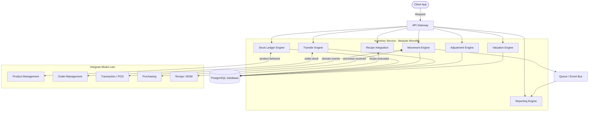
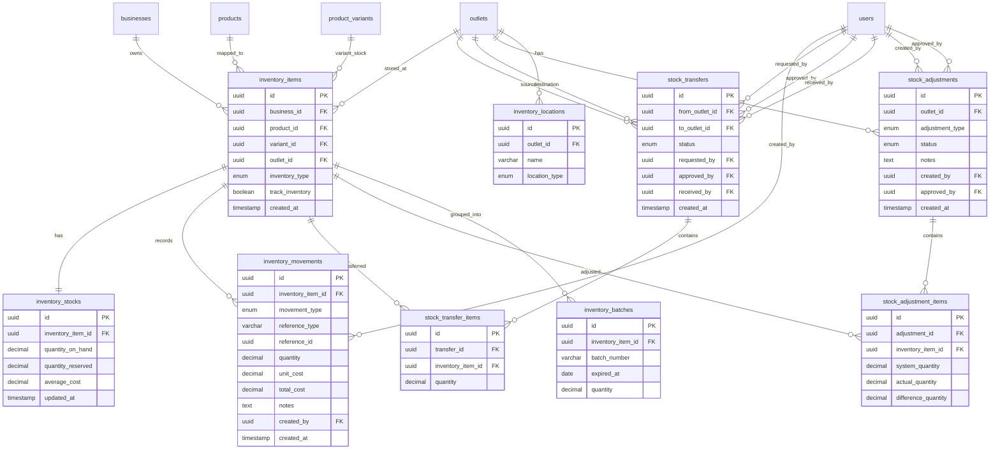

# PRD — Inventory Management

## 1. Overview
Modul Inventory Management bertujuan untuk mengelola seluruh pergerakan stok dan persediaan pada sistem POS secara flexible untuk berbagai jenis bisnis (F&B, Retail, Service, dan Hybrid). Modul ini harus terintegrasi penuh dengan Product Management, Outlet Management, Transaction/POS, Purchasing, dan Recipe/BOM. Sistem ini mendukung berbagai jenis stock movement, inventory valuation, ingredient management, variant stock, multi outlet stock, dan warehouse flow. Inventory architecture dirancang generic sebagai single source of truth untuk stok, mendukung real-time stock tracking, serta mendukung ingredient-based dan variant/SKU inventory. Modul ini **bukan** mencakup full ERP manufacturing, MRP complex planning, supply chain optimization, advanced accounting ledger, maupun IoT warehouse automation.

## 2. Requirements
- **Multi Business Type Support:** Mendukung berbagai model inventory — F&B (ingredient/raw material, stok berkurang via Recipe/BOM), Retail (variant/SKU, stok berkurang via direct sales), Service (optional/not required, tetap support consumable item & operational supplies), dan Hybrid.
- **Inventory Tracking:** System dapat track stock quantity, stock movement, stock valuation, stock per outlet, dan stock per warehouse/location.
- **Stock Movement Support:** Mendukung movement type: Stock In, Stock Out, Adjustment, Transfer (antar outlet), Production, Waste, Consumption, Return, dan Recipe Deduction. Extensible untuk menambah movement type baru.
- **Inventory Location:** Mendukung Outlet stock, Warehouse stock, Kitchen stock, dan Storage stock.
- **Stock Adjustment:** Merchant dapat melakukan manual adjustment, cycle count, stock opname, dan bulk adjustment.
- **Transfer Management:** Merchant dapat transfer antar outlet dan warehouse, approve/reject transfer, dan receive transfer.
- **Inventory Valuation:** Mendukung metode FIFO, Average Cost, dan Manual Cost.
- **Batch & Expiry Support (Future Ready):** Mendukung batch tracking, expiry tracking, dan serial number.
- **Scalability:** Support jutaan stock movements.
- **Reliability:** Stock accuracy tinggi.
- **Performance:** Stock lookup <300ms.
- **Auditability:** Semua movement tercatat.
- **Inventory Transaction Atomicity:** Inventory movement harus transactional, atomic, dan rollback safe.
- **Decimal Quantity Support:** Mendukung fractional usage (0.5 liter, 0.25 kg) menggunakan decimal quantity.
- **Security:** Prevent negative stock abuse, audit stock changes, approval workflow, dan inventory locking during opname.

## 3. Core Features
- **Stock Ledger Engine:** Menggunakan append-only inventory movement ledger sebagai sumber utama stock. Jangan update stock secara langsung tanpa history. Formula: `Current Stock = Σ Stock In - Σ Stock Out`. Available Stock = On Hand - Reserved Stock.
- **Inventory Movement Engine:** Mencatat semua pergerakan stok dengan kategori Incoming (Purchase, Transfer receive, Production result, Adjustment positive) dan Outgoing (Sales, Recipe deduction, Waste, Transfer send, Consumption). Dibuat melalui domain events (transaction.completed, purchase.received, recipe.executed) agar scalable, decoupled, dan audit friendly.
- **Recipe Inventory Integration (F&B Flow):** Saat customer membeli produk (misal Latte), sistem load recipe, deduct bahan baku (Coffee Bean, Milk, Sugar), lalu create inventory movement.
- **Variant Inventory (Retail Flow):** Saat menjual produk variant (misal T-Shirt Black M), sistem deduct variant stock dan save stock movement.
- **Transfer Engine:** Flow transfer: Outlet A send stock → Transfer Request → Approval → Transit → Outlet B receive stock → Stock Updated.
- **Stock Adjustment:** Fitur manual correction, cycle count, opname discrepancy, dan audit adjustment.
- **Multi Inventory Behavior:** Inventory behavior mengikuti product behavior (bukan industry hardcoded). Product type recipe → deduct ingredients, variant → deduct SKU stock, service → no stock, bundle → deduct child items.
- **Inventory Dashboard:** Menampilkan current stock, low stock alert, out of stock, recent movement, dan inventory valuation.
- **Stock Movement Timeline:** Chronological movement dengan filter by type, outlet, dan product.
- **Stock Opname UX:** Mobile friendly counting interface karena sering digunakan di lapangan.
- **Low Stock Alert:** Mendukung minimum stock, reorder point, dan daily alert.
- **Audit Logging:** Mencatat semua event: stock adjusted, stock transferred, recipe deduction, stock opname, cost changed, dan waste recorded.

## 4. User Flow
**Stock In Flow:**
1. User melakukan **Receive Inventory** untuk barang masuk.
2. User **Input Quantity** barang yang diterima.
3. Sistem melakukan **Validate Product** untuk memastikan produk valid.
4. Sistem **Create Stock Movement** sebagai record pergerakan stok.
5. Sistem **Update Current Stock** agar stok terkini terupdate.

**POS Transaction Flow:**
1. Transaksi selesai dan status **Transaction Paid**.
2. Sistem **Resolve Product Behavior** (recipe, variant, service, atau bundle).
3. Sistem **Generate Inventory Movements** sesuai behavior (deduct ingredient, variant stock, dll).
4. Sistem **Update Stock Ledger** dengan mencatat movement ke ledger.
5. Sistem **Save Inventory Snapshot** sebagai checkpoint stok terkini.

**Stock Opname Flow:**
1. User memulai proses **Start Stock Opname** pada outlet tertentu.
2. User **Input Physical Stock** berdasarkan hitungan fisik di lapangan.
3. Sistem **Compare System Stock** membandingkan stok fisik dengan stok sistem.
4. Sistem **Generate Adjustment** untuk selisih yang ditemukan.
5. Atasan melakukan **Approval** terhadap adjustment yang diajukan.
6. Sistem **Apply Adjustment** dan memperbarui stok sesuai hasil opname.

**Transfer Flow:**
1. Outlet A membuat **Transfer Request** untuk mengirim stok ke outlet lain.
2. Atasan melakukan **Approval** terhadap permintaan transfer.
3. Stok berpindah ke status **Transit** selama proses pengiriman.
4. Outlet B melakukan **Receive Stock** untuk konfirmasi penerimaan barang.
5. Sistem **Update Stock** pada kedua outlet (pengurangan di Outlet A, penambahan di Outlet B).

## 5. Architecture
Aplikasi ini menggunakan pendekatan **Modular Monolith** dengan arsitektur **Ledger-Based** dan **Event-Driven Inventory**. Inventory Service terdiri dari beberapa engine utama: Stock Ledger Engine, Movement Engine, Transfer Engine, Valuation Engine, Adjustment Engine, Recipe Integration, dan Reporting Engine. Inventory movement dibuat melalui domain events agar scalable, decoupled, dan audit friendly. Menggunakan append-only ledger sehingga tidak ada movement lama yang di-overwrite. Semua stock wajib memiliki `outlet_id` (Inventory Must Be Outlet Scoped). Di masa depan, arsitektur dapat di-split menjadi service terpisah: Inventory Core, Movement Service, Transfer Service, dan Valuation Service.

## 6. Database Schema
Untuk memfasilitasi kebutuhan inventory management yang flexible dan mendukung multi business type, skema database (menggunakan PostgreSQL) dirancang dengan pendekatan ledger-based dan outlet-scoped.

**Daftar Tabel:**
- `inventory_items`: Menyimpan data item inventory yang di-track, terhubung ke product, variant, dan outlet. Memiliki enum inventory_type dan flag track_inventory.
- `inventory_stocks`: Menyimpan snapshot stok terkini per inventory item (quantity on hand, quantity reserved, average cost).
- `inventory_movements`: Ledger append-only yang mencatat semua pergerakan stok (movement type, quantity, unit cost, reference). Sebagai single source of truth untuk kalkulasi stok.
- `stock_transfers`: Menyimpan data transfer stok antar outlet, termasuk status approval dan pihak yang terlibat (requested_by, approved_by, received_by).
- `stock_transfer_items`: Detail item yang ditransfer per transfer request.
- `stock_adjustments`: Menyimpan data adjustment stok (manual correction, cycle count, opname) beserta status approval.
- `stock_adjustment_items`: Detail item yang di-adjust, mencatat system quantity, actual quantity, dan difference.
- `inventory_locations`: Menyimpan lokasi inventory dalam outlet (warehouse, kitchen, storage).
- `inventory_batches`: Menyimpan data batch dan expiry tracking per inventory item (future ready).

## 7. Tech Stack
Berdasarkan kebutuhan skalabilitas, kemudahan maintenance, serta konsistensi dengan platform utama, teknologi yang digunakan adalah:

- **Frontend:** **Vue.js** (Framework JavaScript yang interaktif) + **Tailwind CSS** (Untuk styling yang cepat, modern, dan rapi). Komponen Vue akan menerima *props* dari backend untuk merender konten dinamis, termasuk inventory dashboard dan stock opname interface yang mobile friendly.
- **Penghubung (Bridge):** **Inertia.js** (Digunakan untuk merender Vue langsung dari Laravel tanpa perlu membuat API publik terpisah, memungkinkan passing data inventory langsung ke komponen UI).
- **Backend:** **Laravel** (Framework server-side berbasis PHP. Fitur Eloquent ORM digunakan untuk mengelola relasi inventory yang kompleks. Laravel Queue digunakan untuk async stock calculation, inventory reconciliation, dan event processing).
- **Database:** **PostgreSQL** (Database relasional berskala *enterprise*. Mendukung UUID sebagai primary key dan tipe data decimal untuk fractional quantity).
- **Queue / Event Bus:** **Laravel Queue** dengan Redis sebagai driver untuk memproses domain events secara asynchronous (transaction.completed, purchase.received, recipe.executed). Kafka atau RabbitMQ sebagai opsi future scaling.
- **Caching:** **Redis** untuk stock lookup caching agar memenuhi target response <300ms.
- **API Structure:**
  - `GET /inventory` — Daftar inventory items
  - `GET /inventory/stocks` — Daftar stok terkini
  - `GET /inventory/movements` — Daftar movement history
  - `POST /inventory/adjustments` — Buat adjustment baru
  - `POST /inventory/adjustments/:id/approve` — Approve adjustment
  - `POST /inventory/transfers` — Buat transfer baru
  - `POST /inventory/transfers/:id/approve` — Approve transfer
  - `POST /inventory/transfers/:id/receive` — Receive transfer
- **Permission Naming:** `inventory.read`, `inventory.adjust`, `inventory.transfer`, `inventory.opname`, `inventory.manage_cost`.
- **Development Priority:**
  - **Phase 1:** Stock ledger, Inventory movement, Variant stock, Recipe deduction.
  - **Phase 2:** Transfer, Stock opname, Adjustment workflow.
  - **Phase 3:** Batch tracking, Costing engine, Advanced warehouse.
- **Future Extensibility:** Multi warehouse, FEFO/FIFO picking, Procurement integration, Supplier management, Auto reorder, Barcode scanner, RFID support, Offline stock sync, Manufacturing flow, Production planning.
- **Success Metrics:**
  - Inventory Accuracy: >99%
  - Duplicate Movement: 0
  - Inventory Calculation Delay: <1 second
  - Stock Lookup Response: <300ms
  - Failed Inventory Transaction: <0.1%

## 8. UX Guidelines
- **Progressive Disclosure:** Jangan paksa merchant kecil menggunakan fitur batch, warehouse, atau costing jika tidak dibutuhkan. Gunakan feature progressive disclosure agar UI tetap sederhana.
- **Auto Inventory Behavior:** Behavior inventory otomatis mengikuti product type, recipe existence, dan variant existence tanpa konfigurasi manual.
- **Mobile Friendly Opname:** Interface stock opname harus mobile friendly karena sering digunakan di lapangan.
