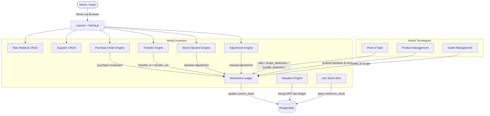

# PRD — Inventory - Bahan Baku

## 1. Overview

Inventory Management merupakan modul yang bertanggung jawab untuk mengelola persediaan barang pada setiap outlet bisnis. Modul ini memastikan jumlah stok selalu akurat berdasarkan aktivitas operasional seperti pembelian, penjualan, penyesuaian stok, dan transfer stok antar outlet. Pada fase MVP, fokus utama modul ini adalah menyediakan kontrol stok yang sederhana, akurat, dan mudah digunakan oleh bisnis retail, F&B, maupun service yang menjual produk fisik. Modul Inventory terintegrasi dengan Product Management, Purchasing, dan Point of Sale sehingga seluruh pergerakan stok dapat tercatat secara otomatis.

## 2. Requirements

- **Outlet-Scoped Inventory:** Seluruh data inventory wajib memiliki `outlet_id`. Setiap outlet memiliki stok independen sehingga perpindahan stok antar outlet harus melalui mekanisme transfer. Ini merupakan prinsip desain utama yang sejalan dengan PRD Outlet Management.
- **Multi Inventory Type:** Mendukung dua jenis inventory item — `raw_material` (bahan baku untuk F&B/recipe-based) dan `variant_sku` (varian produk untuk retail/direct sales). Keduanya dikelola dalam satu modul inventory terpusat.
- **Stock Ledger (Append-Only):** Semua pergerakan stok dicatat ke dalam `inventory_movements` sebagai ledger append-only. Tidak boleh ada overwrite movement lama. Current stock dihitung berdasarkan akumulasi movement.
- **Movement Type Support:** Mendukung movement type: `sale`, `purchase`, `adjustment`, `recipe_deduction`, `bundle_deduction`, `transfer_in`, `transfer_out`, `waste`, `opname`.
- **Supplier & Purchasing:** Merchant dapat mengelola data supplier, membuat purchase order (PO), dan melakukan penerimaan barang (receive) yang secara otomatis menambah stok.
- **Stock Transfer:** Mendukung transfer stok antar outlet dengan flow: Request → Approval → Transit → Receive. Stok outlet pengirim berkurang saat dikirim, stok outlet penerima bertambah saat diterima.
- **Stock Opname:** Merchant dapat melakukan stock opname (cycle count) untuk mencocokkan stok fisik dengan stok sistem, menghasilkan adjustment otomatis untuk selisih.
- **Stock Adjustment:** Merchant dapat melakukan koreksi stok manual dengan alasan yang tercatat (waste, damaged, correction, etc).
- **Inventory Valuation:** Mendukung metode FIFO dan Average Cost untuk perhitungan HPP (Harga Pokok Penjualan).
- **Low Stock Alert:** Mendukung pengaturan minimum stock per item per outlet. Dashboard menampilkan notifikasi untuk item yang stoknya mendekati atau di bawah batas minimum.
- **Decimal Quantity:** Mendukung fractional quantity (0.5 liter, 0.25 kg) menggunakan `decimal(15,4)` untuk semua kolom quantity.
- **Auditability:** Semua pergerakan stok (movement) tercatat dengan `created_by`, `reference_id`, `reference_type`, dan timestamp. Tidak ada perubahan stok tanpa history.
- **Atomicity:** Inventory movement harus transactional dan atomic. Dibungkus dalam `DB::transaction()` sesuai konvensi koding project.
- **Performance:** Stock lookup response < 300ms. Query stok menggunakan snapshot (`current_stock` pada `inventory_items`) yang diupdate setiap kali ada movement, bukan kalkulasi real-time dari ledger.
- **Integrasi Product Management:** Inventory behavior mengikuti product behavior (bukan industry hardcoded). Product dengan `has_recipe=true` → deduct ingredients. Product dengan `has_variant=true` → deduct variant SKU. Product type `service` → no stock. Product type `bundle` → deduct child items.

## 3. Core Features

- **Raw Material Management (CRUD):** Mengelola data bahan baku (raw material) yang belum ter-link ke produk manapun. Setiap raw material adalah `inventory_item` dengan `item_type=raw_material`. Mendukung input nama, SKU, barcode, satuan (UOM), dan flag `track_inventory`.
- **Supplier Management (CRUD):** Mengelola data supplier/pemasok. Informasi yang disimpan: nama, kontak (telepon, email), alamat, dan catatan. Satu supplier dapat memasok banyak jenis inventory item.
- **Purchase Order (PO):** Merchant membuat purchase order ke supplier dengan daftar item dan quantity yang dipesan. PO memiliki status: `draft` → `ordered` → `partial_received` → `received` → `cancelled`. Saat barang diterima (receive), sistem otomatis membuat movement `purchase` dan menambah stok.
    - **Receive Partial:** Mendukung penerimaan bertahap — satu PO bisa diterima dalam beberapa kali pengiriman.
    - **Purchase Price:** Setiap item yang diterima dicatat purchase price-nya untuk keperluan kalkulasi HPP (FIFO/Average Cost).
- **Inventory Movement Ledger:** Mencatat semua pergerakan stok secara append-only. Setiap movement menyimpan: `qty_change`, `stock_before`, `stock_after`, `movement_type`, `reference_id/type`, `purchase_price`, `description`, dan `created_by`.
- **Stock Transfer Antar Outlet:** Transfer stok dari satu outlet ke outlet lain. Flow: Request → Approval → Transit → Receive. Saat request diapprove dan dikirim, stok outlet asal berkurang (`transfer_out`). Saat outlet tujuan menerima, stok bertambah (`transfer_in`).
    - **Approval Workflow:** Transfer memerlukan approval dari user yang memiliki permission `inventory.transfer.approve`.
    - **Transfer Items:** Setiap transfer memiliki daftar item beserta quantity yang ditransfer.
- **Stock Opname (Stock Taking):** Proses pengecekan fisik stok. Merchant menginput quantity fisik per item, sistem membandingkan dengan stok sistem, lalu menghasilkan adjustment otomatis untuk selisih.
    - **Approval Workflow:** Hasil opname memerlukan approval sebelum adjustment diterapkan.
    - **Opname Period:** Saat opname berlangsung, stok item yang sedang diopname di-lock untuk mencegah movement lain yang bisa mengganggu akurasi penghitungan.
- **Stock Adjustment Manual:** Koreksi stok manual dengan wajib memilih alasan (`waste`, `damaged`, `expired`, `correction`, `other`). Setiap adjustment tercatat sebagai movement dengan deskripsi alasan.
- **Inventory Valuation (FIFO & Average Cost):** Menghitung HPP berdasarkan metode yang dipilih merchant per outlet. FIFO: barang yang masuk pertama dianggap keluar pertama. Average Cost: HPP dihitung dari rata-rata tertimbang seluruh purchase price.
- **Low Stock Alert & Dashboard:** Setiap inventory item dapat diatur `minimum_stock` per outlet. Dashboard menampilkan: daftar item dengan stok di bawah minimum, item out of stock, ringkasan total item tracked, dan total inventory value.
- **Inventory Report:** Laporan pergerakan stok per item, per outlet, per periode. Mendukung filter by movement type, date range, dan item. Menampilkan stock movement timeline secara kronologis.

## 4. User Flow

**Pengelolaan Bahan Baku:**

1. Admin masuk ke menu **Inventory > Bahan Baku** dan melihat daftar bahan baku yang sudah terdaftar.
2. Admin klik **Tambah Bahan Baku** dan mengisi informasi: nama, SKU (opsional), barcode (opsional), satuan (UOM), serta flag track inventory.
3. Sistem menyimpan data sebagai `inventory_item` dengan `item_type=raw_material` dan membuat record stok awal per outlet yang aktif.
4. Admin dapat **Edit** atau **Hapus** (soft delete) bahan baku dari daftar.

**Pengelolaan Supplier:**

1. Admin masuk ke menu **Inventory > Supplier** dan melihat daftar supplier.
2. Admin klik **Tambah Supplier** dan mengisi: nama supplier, telepon, email, alamat, dan catatan.
3. Sistem menyimpan data supplier. Admin dapat mengedit atau menghapus supplier.

**Pembelian / Purchase Order:**

1. Admin masuk ke menu **Inventory > Pembelian** dan klik **Buat PO Baru**.
2. Admin memilih **Supplier** dari daftar dan memilih **Outlet** tujuan penerimaan.
3. Admin menambahkan item-item yang dipesan beserta **quantity** dan **harga beli** per item.
4. Admin menyimpan PO dengan status `draft`. Admin dapat mengedit PO selama masih `draft`.
5. Admin mengubah status PO menjadi `ordered` (sudah dikirim ke supplier).
6. Saat barang datang, admin klik **Terima Barang** dan menginput quantity yang diterima per item.
7. Sistem membuat `inventory_movement` dengan type `purchase` untuk setiap item yang diterima, menambah stok di outlet tujuan, dan mencatat `purchase_price`.
8. Jika semua item diterima penuh, status PO berubah menjadi `received`. Jika sebagian, status berubah menjadi `partial_received`.

**Transfer Stok Antar Outlet:**

1. Admin pada Outlet A masuk ke menu **Inventory > Transfer** dan klik **Buat Transfer**.
2. Admin memilih **Outlet Tujuan**, lalu menambahkan item dan quantity yang akan ditransfer.
3. Admin submit transfer request. Sistem menyimpan dengan status `pending`.
4. User dengan permission approval melihat daftar transfer pending dan melakukan **Approve** atau **Reject**.
5. Setelah diapprove, status berubah menjadi `in_transit`. Sistem membuat movement `transfer_out` pada Outlet A (stok berkurang).
6. Admin pada Outlet B masuk ke menu **Inventory > Transfer** dan melihat transfer yang perlu diterima.
7. Admin klik **Terima Transfer** dan mengkonfirmasi quantity yang diterima.
8. Sistem membuat movement `transfer_in` pada Outlet B (stok bertambah). Status transfer berubah menjadi `completed`.

**Stock Opname:**

1. Admin masuk ke menu **Inventory > Stock Opname** dan klik **Mulai Opname**.
2. Admin memilih kategori item atau semua item untuk diopname di outlet aktif.
3. Sistem menampilkan daftar item beserta **stok sistem**. Admin menginput **stok fisik** untuk setiap item.
4. Sistem menghitung **selisih** (difference) antara stok fisik dan stok sistem.
5. Admin submit hasil opname. User dengan permission approval melakukan **Review & Approve**.
6. Setelah diapprove, sistem membuat movement `opname` untuk setiap item yang memiliki selisih, menyesuaikan stok sistem dengan stok fisik.

**Adjustment Stok Manual:**

1. Admin masuk ke menu **Inventory > Penyesuaian** dan klik **Buat Penyesuaian**.
2. Admin memilih item, menginput **quantity penyesuaian** (positif atau negatif), memilih **alasan** (waste/damaged/expired/correction/other), dan mengisi deskripsi.
3. Sistem membuat movement `adjustment` dan memperbarui stok item di outlet aktif.

**Dashboard & Alert:**

1. Admin masuk ke **Dashboard Inventory** dan melihat ringkasan: total item tracked, total inventory value, item low stock, dan item out of stock.
2. Item dengan stok di bawah `minimum_stock` ditampilkan dalam alert card berwarna kuning/merah.
3. Admin dapat klik item untuk melihat **Stock Movement Timeline** — riwayat kronologis semua pergerakan stok item tersebut.

## 5. Architecture

Modul Inventory mengikuti pendekatan **Modular Monolith** yang sudah menjadi arsitektur utama aplikasi. Backend Laravel bertindak sebagai pengelola logika bisnis inventory, sedangkan Frontend Vue.js merender interface melalui Inertia.js. Semua inventory data bersifat **outlet-scoped** — setiap query dan mutation harus memfilter berdasarkan `outlet_id` dari outlet aktif user (menggunakan trait `HasOutlet` dan `HasBusiness`). Pergerakan stok menggunakan prinsip **append-only ledger** — tidak ada movement yang di-overwrite, dan `current_stock` pada `inventory_items` berfungsi sebagai snapshot yang diupdate setiap kali ada movement baru.

## 6. Database Schema

Skema database dirancang untuk mendukung inventory outlet-scoped dengan append-only ledger. Tabel yang sudah ada (`inventory_items`, `inventory_movements`) akan dimodifikasi (penambahan `outlet_id`), dan tabel baru ditambahkan untuk supplier, purchasing, transfer, adjustment, dan opname.

**Daftar Tabel:**

- `inventory_items` (**MODIFY**): Menambahkan `outlet_id` agar stok bersifat outlet-scoped. Menambahkan `minimum_stock` untuk low stock alert, dan `uom_id` untuk satuan. Setiap kombinasi product/variant + outlet menghasilkan satu record.
- `inventory_movements` (**MODIFY**): Menambahkan movement type baru (`transfer_in`, `transfer_out`, `waste`, `opname`). Menambahkan `outlet_id` agar setiap movement tercatat per outlet.
- `suppliers` (**NEW**): Menyimpan data supplier/pemasok per business.
- `supplier_inventory_items` (**NEW**): Pivot table relasi many-to-many antara supplier dan inventory item (supplier mana yang memasok item mana).
- `purchase_orders` (**NEW**): Menyimpan data purchase order ke supplier. Memiliki status flow: `draft` → `ordered` → `partial_received` → `received` → `cancelled`.
- `purchase_order_items` (**NEW**): Detail item per PO beserta quantity ordered, quantity received, dan purchase price.
- `stock_transfers` (**NEW**): Menyimpan data transfer stok antar outlet. Memiliki status flow: `pending` → `approved` → `in_transit` → `completed` / `rejected`.
- `stock_transfer_items` (**NEW**): Detail item per transfer beserta quantity.
- `stock_opnames` (**NEW**): Menyimpan data sesi stock opname per outlet. Memiliki status: `in_progress` → `pending_approval` → `approved` / `rejected`.
- `stock_opname_items` (**NEW**): Detail item per opname: system quantity, actual quantity, dan difference.
- `inventory_cost_layers` (**NEW**): Menyimpan cost layer untuk kalkulasi FIFO. Setiap purchase menghasilkan satu layer dengan remaining quantity.

```mermaid
erDiagram
    inventory_items {
        uuid id PK
        uuid business_id FK
        uuid outlet_id FK "NEW - outlet scope"
        enum item_type "variant_sku / raw_material"
        uuid product_id FK "nullable"
        uuid raw_material_id FK "nullable"
        string sku "nullable"
        string barcode "nullable"
        uuid uom_id FK "nullable - NEW"
        boolean track_inventory
        decimal current_stock "decimal(15,4)"
        decimal minimum_stock "decimal(15,4) - NEW, default 0"
        timestamp created_at
        timestamp updated_at
    }

    inventory_movements {
        uuid id PK
        uuid business_id FK
        uuid outlet_id FK "NEW - outlet scope"
        uuid inventory_item_id FK
        enum movement_type "sale, purchase, adjustment, recipe_deduction, bundle_deduction, transfer_in, transfer_out, waste, opname"
        decimal qty_change "decimal(15,4)"
        decimal stock_before "decimal(15,4)"
        decimal stock_after "decimal(15,4)"
        decimal purchase_price "decimal(15,2) nullable"
        text description "nullable"
        uuid reference_id "nullable - polymorphic"
        string reference_type "nullable - polymorphic"
        uuid created_by FK "nullable"
        timestamp created_at
    }

    suppliers {
        uuid id PK
        uuid business_id FK
        string name
        string phone "nullable"
        string email "nullable"
        text address "nullable"
        text notes "nullable"
        boolean is_active "default true"
        timestamp created_at
        timestamp updated_at
        timestamp deleted_at "soft delete"
    }

    supplier_inventory_items {
        uuid supplier_id FK
        uuid inventory_item_id FK
        decimal last_purchase_price "decimal(15,2) nullable"
    }

    purchase_orders {
        uuid id PK
        uuid business_id FK
        uuid outlet_id FK
        uuid supplier_id FK
        string po_number "unique per business"
        enum status "draft, ordered, partial_received, received, cancelled"
        date order_date
        date expected_date "nullable"
        text notes "nullable"
        decimal total_amount "decimal(15,2)"
        uuid created_by FK
        uuid approved_by FK "nullable"
        timestamp created_at
        timestamp updated_at
    }

    purchase_order_items {
        uuid id PK
        uuid purchase_order_id FK
        uuid inventory_item_id FK
        decimal qty_ordered "decimal(15,4)"
        decimal qty_received "decimal(15,4) default 0"
        decimal purchase_price "decimal(15,2)"
        decimal subtotal "decimal(15,2)"
    }

    stock_transfers {
        uuid id PK
        uuid business_id FK
        uuid from_outlet_id FK
        uuid to_outlet_id FK
        string transfer_number "unique per business"
        enum status "pending, approved, in_transit, completed, rejected"
        text notes "nullable"
        uuid requested_by FK
        uuid approved_by FK "nullable"
        uuid received_by FK "nullable"
        timestamp created_at
        timestamp updated_at
    }

    stock_transfer_items {
        uuid id PK
        uuid stock_transfer_id FK
        uuid inventory_item_id FK
        decimal qty "decimal(15,4)"
        decimal qty_received "decimal(15,4) default 0"
    }

    stock_opnames {
        uuid id PK
        uuid business_id FK
        uuid outlet_id FK
        string opname_number "unique per business"
        enum status "in_progress, pending_approval, approved, rejected"
        text notes "nullable"
        uuid created_by FK
        uuid approved_by FK "nullable"
        timestamp created_at
        timestamp updated_at
    }

    stock_opname_items {
        uuid id PK
        uuid stock_opname_id FK
        uuid inventory_item_id FK
        decimal system_qty "decimal(15,4)"
        decimal actual_qty "decimal(15,4)"
        decimal difference_qty "decimal(15,4)"
    }

    inventory_cost_layers {
        uuid id PK
        uuid inventory_item_id FK
        uuid outlet_id FK
        decimal purchase_price "decimal(15,2)"
        decimal qty_purchased "decimal(15,4)"
        decimal qty_remaining "decimal(15,4)"
        uuid reference_id FK "nullable - PO item"
        timestamp created_at
    }

    businesses ||--o{ inventory_items : owns
    businesses ||--o{ suppliers : has
    outlets ||--o{ inventory_items : stores
    products ||--o{ inventory_items : mapped_to

    inventory_items ||--o{ inventory_movements : records
    inventory_items ||--o{ inventory_cost_layers : costed_by

    suppliers ||--o{ supplier_inventory_items : supplies
    inventory_items ||--o{ supplier_inventory_items : supplied_by

    suppliers ||--o{ purchase_orders : ordered_from
    outlets ||--o{ purchase_orders : receives_at
    purchase_orders ||--o{ purchase_order_items : contains
    inventory_items ||--o{ purchase_order_items : ordered

    outlets ||--o{ stock_transfers : sends
    outlets ||--o{ stock_transfers : receives
    stock_transfers ||--o{ stock_transfer_items : contains
    inventory_items ||--o{ stock_transfer_items : transferred

    outlets ||--o{ stock_opnames : opname_at
    stock_opnames ||--o{ stock_opname_items : contains
    inventory_items ||--o{ stock_opname_items : counted

    users ||--o{ inventory_movements : created_by
    users ||--o{ purchase_orders : created_by
    users ||--o{ stock_transfers : requested_by
    users ||--o{ stock_opnames : created_by
```

## 7. Tech Stack

Berdasarkan tech stack yang sudah digunakan pada project dan kebutuhan spesifik modul inventory:

- **Frontend:** **Vue 3** (Composition API dengan `<script setup>`) + **Tailwind CSS v4** (menggunakan custom color tokens yang sudah dikonfigurasi). Komponen mengikuti pola MainPage → MainPageHeader + Filter + Table + Pagination. Form menggunakan PopUpPage, konfirmasi menggunakan Modal.
- **Penghubung (Bridge):** **Inertia.js** (merender Vue langsung dari Laravel. Data inventory di-pass sebagai props ke komponen UI tanpa API terpisah).
- **Backend:** **Laravel 11** (PHP 8.3). Arsitektur Controller → Service → Model. Service class untuk logika kompleks (PurchaseOrderService, TransferService, OpnameService, InventoryMovementService). Semua mutation dibungkus `DB::transaction()` dengan audit logging.
- **State Management:** **Pinia** untuk state management di frontend (inventory cart, PO item list, transfer item list).
- **Database:** **PostgreSQL** dengan UUID sebagai primary key. Decimal(15,4) untuk quantity, Decimal(15,2) untuk harga. Polymorphic reference (`reference_id` + `reference_type`) pada `inventory_movements` untuk tracking sumber movement.
- **Authorization:** **Spatie Laravel Permission** untuk role-based access control. Permission yang digunakan: `inventory.raw-material.read`, `inventory.raw-material.create`, `inventory.raw-material.update`, `inventory.raw-material.delete`, `inventory.supplier.read`, `inventory.supplier.create`, `inventory.supplier.update`, `inventory.supplier.delete`, `inventory.purchase.read`, `inventory.purchase.create`, `inventory.purchase.receive`, `inventory.transfer.read`, `inventory.transfer.create`, `inventory.transfer.approve`, `inventory.transfer.receive`, `inventory.opname.read`, `inventory.opname.create`, `inventory.opname.approve`, `inventory.adjustment.read`, `inventory.adjustment.create`, `inventory.report.read`.
- **UOM:** Menggunakan tabel `uoms` yang dikelola secara global dari Cockpit (PCS, BOX, KG, G, L, ML, dll). Setiap inventory item memiliki relasi ke UOM.
- **Audit Trail:** Semua perubahan data inventory (CRUD, movement, approval) dicatat ke tabel `audit_logs` menggunakan `AuditLogService` yang sudah ada.
