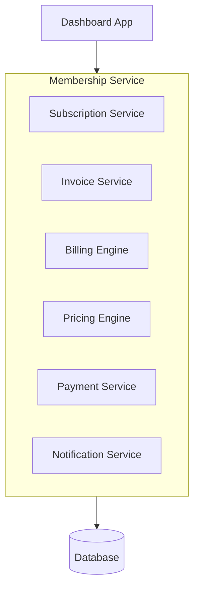
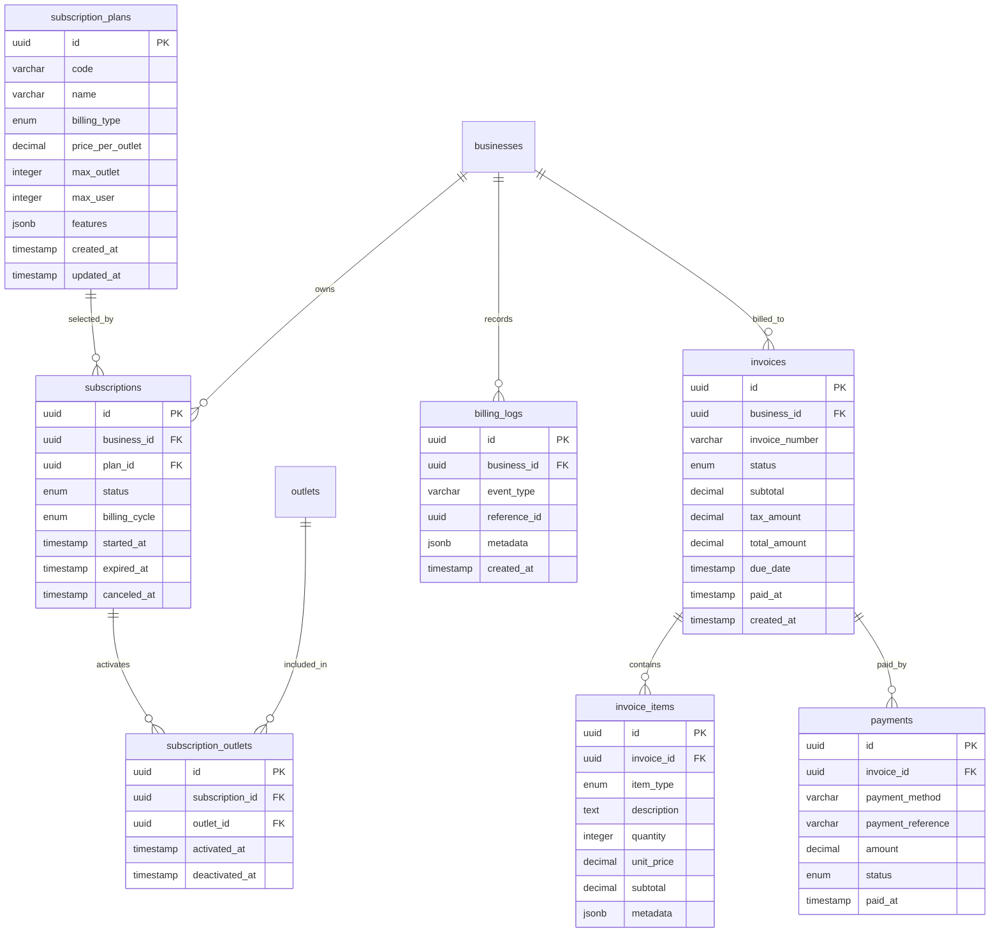

# Overview

## Objective

Modul Membership & Subscription bertujuan untuk mengelola sistem langganan merchant pada platform POS, termasuk:

- Subscription plan management
- Outlet-based billing
- Automatic invoice generation
- Payment tracking
- Subscription lifecycle
- Billing automation
  Karena pricing model berbasis jumlah outlet, maka setiap outlet baru yang dibuat akan otomatis menghasilkan billing adjustment atau invoice baru sesuai subscription plan merchant.

---

## Goals

- Mendukung sistem subscription berbasis outlet
- Otomatis generate invoice saat outlet dibuat
- Mendukung recurring billing
- Mendukung upgrade/downgrade plan
- Mendukung payment tracking
- Mendukung fleksibilitas pricing future
- mendukung manual payment via cockpit

---

## Non Goals

- Accounting system lengkap
- Tax management kompleks
- Marketplace billing
- Payroll billing
- Multi currency

---

# Requirements

## Functional Requirements

### Subscription Management

Merchant dapat:

- Subscribe plan
- Upgrade plan
- Downgrade plan
- Cancel subscription
- Reactivate subscription
- View billing history

---

### Plan Management

System mendukung:

- Multiple pricing plans
- Monthly billing
- Yearly billing
- Per outlet pricing
- Trial plan
- Discount pricing (future)
- Addon pricing (future)

---

### Outlet Based Billing

#### Rules

- Setiap outlet aktif dikenakan biaya
- Saat outlet baru dibuat:
    - System otomatis generate prorated invoice
- Saat outlet dihapus/nonaktif:
    - Billing adjustment dilakukan pada periode berikutnya

---

### Invoice Management

System dapat:

- Generate invoice otomatis
- Generate prorated invoice
- Generate recurring invoice
- Mark invoice paid/unpaid
- Void invoice
- Send invoice notification

---

### Payment Tracking

Track:

- Payment status
- Payment method
- Payment date
- Invoice aging
- Failed payment

---

### Subscription Limitation

System dapat membatasi fitur berdasarkan plan:

- Jumlah outlet
- Fitur Basic & Pro

---

# Non Functional Requirements

| Category      | Requirement                       |
| ------------- | --------------------------------- |
| Scalability   | Support ribuan merchant           |
| Reliability   | Invoice generation harus reliable |
| Auditability  | Semua billing tercatat            |
| Extensibility | Mudah tambah pricing model        |
| Accuracy      | Billing calculation harus akurat  |

---

# Core Feature

## 1. Subscription Plan Management

### Plans

| Plan     | Outlet Included | Price  |
| -------- | --------------- | ------ |
| Micro    | 5 outlet        | Rp99k  |
| Basic    | 10 outlet       | Rp199k |
| Pro      | Unlimited       | Rp399k |
| Ultimate | Unlimited       | Custom |

### Features

- Plan activation
- Plan switching
- Trial handling
- Plan expiration

---

## 2. Automatic Invoice Generation

### Trigger Sources

Invoice otomatis dibuat ketika:

- Merchant subscribe
- Billing renewal
- Outlet baru dibuat
- Plan upgrade
- Addon purchased

### Invoice Logic

#### Example

Merchant memiliki:

- 2 outlet aktif
- Plan Rp100k/outlet
  Maka:

```txt
2 × Rp100k = Rp200k/month
```

Saat merchant menambah outlet:

```txt
3 × Rp100k = Rp300k/month
```

System akan:

- Generate prorated invoice
- Atau update next recurring invoice

---

## 3. Prorated Billing

### Example

Billing date:

```txt
1 Mei
```

Outlet baru dibuat:

```txt
15 Mei
```

Maka invoice:

```txt
Biaya prorata 15 hari
```

---

## 4. Subscription Restriction Engine

### Features

- Block feature access
- Limit outlet creation

---

## 5. Invoice Lifecycle

### Status

| Status  | Description         |
| ------- | ------------------- |
| Draft   | Belum publish       |
| Open    | Menunggu pembayaran |
| Paid    | Sudah dibayar       |
| Overdue | Lewat jatuh tempo   |
| Void    | Dibatalkan          |

## 6. Payment Management

### Features

- Manual payment confirmation
- Payment gateway integration
- Payment history
- Retry failed payment
- Auto suspend subscription

---

# User Flow

## New Subscription Flow

```txt
Business/Merchant Select Plan
        ↓
Input Billing Information
        ↓
Generate First Invoice
        ↓
Payment
        ↓
Subscription Activated
```

## Upgrade Subscription Flow

```txt
Business/Merchant Select Plan
        ↓
Input/Choose Billing Information
        ↓
Generate Invoice
        ↓
Payment
        ↓
Upgraded Subscription Activated
```

## Outlet Creation Billing Flow

```txt
Business/Merchant Create Outlet
        ↓
Validate Subscription Rules
        ↓
Calculate Additional Cost
        ↓
Generate Prorated Invoice
        ↓
Invoice Sent
        ↓
Outlet Activated
```

## Recurring Billing Flow

```txt
Billing Scheduler Triggered
        ↓
Calculate Active Outlet
        ↓
Generate Recurring Invoice
        ↓
Send Invoice Notification
        ↓
Wait Payment
```

## Failed Payment Flow

```txt
Invoice Overdue
      ↓
Send Reminder
      ↓
Retry Payment
      ↓
Grace Period
      ↓
Suspend Subscription
```

---

# Architecture

## High Level Architecture



---

## Suggested Architecture Pattern

Modular Monolith

---

### Future Scalability

Future split:

- Billing Service
- Payment Service
- Subscription Service

---

## Important Business Logic

### Outlet-Based Pricing

#### Core Principle

Billing dihitung berdasarkan:

```txt
Jumlah outlet aktif
```

---

#### Example Formula

$\text{Total Billing} = \text{Active Outlets} \times \text{Price Per Outlet}$

#### Prorated Formula

$\text{Prorated Cost} = \frac{\text{Remaining Days}}{\text{Total Billing Days}} \times \text{Monthly Outlet Price}$

---

## DB Schema



# Technical Notes

### Tech Stack

- Laravel
- Inertia
- PostgreSQL
- Redis
- Vue.js

### Important Infrastructure

- Payment Gateway (Midtrans)

## Queue System

Digunakan untuk:

- Invoice generation
- Email sending
- Payment retry
- Billing recalculation

### Recommended

- Laravel Queue

---

## Recommended Scheduler

## Suggested Route Structure

### Example Subscription

```text
GET setting/subscriptions/index
POST setting/subscriptions/new
POST setting/subscriptions/change-plan
DELETE setting/subscriptions/cancel
```

### Example Invoice

```text
GET setting/subscription/invoices
GET setting/subscription/invoices/:id
POST setting/subscription/invoices/:id/pay
```

---

### Cron Jobs

#### Jobs

- Daily overdue check
- Monthly invoice generation
- Subscription expiration check
- Failed payment retry

## Security Considerations

### Required

- Invoice immutable after paid
- Prevent duplicate invoice
- Idempotent payment callback
- Secure payment webhook
- Audit billing changes

---

## Audit Logging

### Logged Events

- Plan subscribed
- Plan upgraded
- Outlet added
- Invoice generated
- Invoice paid
- Payment failed
- Subscription canceled

---

## Suggested UX

### Billing Dashboard

#### Show

- Current plan
- Active outlet count
- Next billing date
- Outstanding invoice
- Subscription status

---

### Invoice Detail

#### Show

- Billing period
- Outlet breakdown
- Prorated adjustment
- Tax
- Payment history

---

### Important UX Notes

#### 1. Transparent Billing

Merchant harus dapat melihat:

```txt
Outlet mana yang dikenakan biaya
```

---

#### 2. Real-Time Cost Preview

Saat merchant membuat outlet:

```txt
Tampilkan estimasi tambahan biaya sebelum submit
```

---

#### 3. Grace Period

Jangan langsung suspend merchant saat gagal bayar.
Recommended:

```txt
3–7 hari grace period
```

---

## Future Extensibility

### Planned Features

- Addon billing
- Usage-based billing
- API usage pricing
- Transaction-based pricing
- Promo/coupon system
- Multi currency
- Tax engine
- Auto debit
- Midtrans/Xendit integration
- Enterprise custom contract

---

## Suggested Development Priority

### Phase 1

- Subscription
- Invoice generation
- Outlet billing
- Manual payment via cockpit
- Payment gateway
- Prorated billing
- Overdue handling

### Phase 2

- Advanced billing engine
- Usage billing
- Addon pricing

---

## Success Metrics

| Metric                   | Target    |
| ------------------------ | --------- |
| Invoice Accuracy         | 100%      |
| Failed Billing Rate      | <1%       |
| Duplicate Invoice        | 0         |
| Payment Success Rate     | >95%      |
| Billing Generation Delay | <1 minute |
