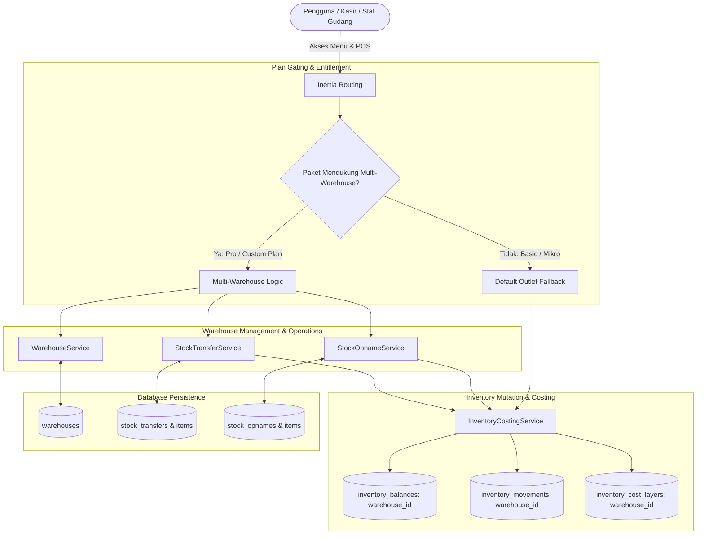
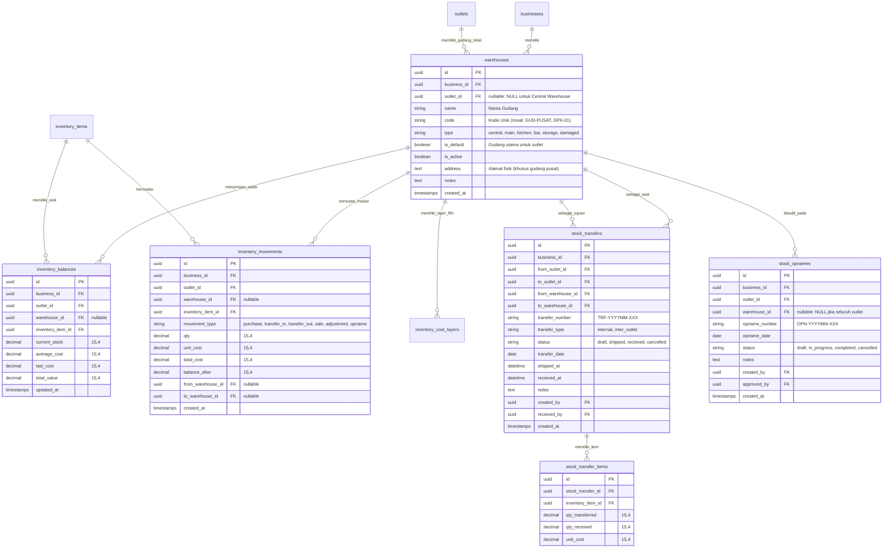

# PRD — Multi-Warehouse & Multi-Storage Location (Manajemen Multi Gudang Fleksibel)

## 1. Overview
Modul **Multi-Warehouse & Multi-Storage Location (Manajemen Multi Gudang)** di Sollu App adalah sistem manajemen lokasi penyimpanan persediaan tingkat lanjut yang dirancang untuk mendukung bisnis ritel bertingkat, rantai restoran/kafe F&B dengan banyak titik simpan (Dapur Utama, Bar Display, Cold Storage), serta jaringan distribusi dengan Gudang Pusat (*Central Warehouse*). 

Fitur ini dirancang dengan prinsip **High Flexibility & Plan-Gated Scalability**:
1. **Mode Nonaktif (Paket Mikro / Basic):** Sistem beroperasi dalam mode standar *Single-Location per Outlet* di mana setiap outlet bertindak sebagai satu-satunya titik penyimpanan persediaan (`outlet_id`). Seluruh antarmuka kasir dan stok tetap sederhana tanpa membingungkan pelaku usaha mikro dengan dropdown pemilihan gudang.
2. **Mode Aktif (Paket Pro / Enterprise / Custom Plan):** Sistem membuka kemampuan mengelola banyak gudang di dalam satu outlet (*Outlet-Level Warehouses*) maupun gudang konsolidasi di tingkat bisnis (*Business-Level / Central Warehouses*). Setiap gudang memiliki kartu stok independen, buku besar mutasi persediaan, pelapisan biaya FIFO, alur transfer internal, serta *stock opname* parsial per titik simpan.

---

## 2. Requirements
- **Arsitektur Fleksibel & Feature Plan Gating:**
  - Fitur dikendalikan secara dinamis melalui SaaS Entitlement: `FeatureEnum::WAREHOUSE_MANAGEMENT` (atau `multi_warehouse`).
  - Jika paket bisnis tidak memiliki fitur ini, seluruh transaksi persediaan berjalan secara transparan pada lokasi default outlet tanpa *overhead* konfigurasi gudang.
  - UI dilengkapi komponen `<FeatureLock :feature="$enums.FeatureEnum.WAREHOUSE_MANAGEMENT">` untuk memberikan promosi peningkatan paket (*upsell*) yang persuasif bagi tenant paket dasar.
- **Hierarki & Tipe Gudang (Warehouse Types):**
  - **Gudang Pusat / Sentral (Central Warehouse):** Gudang di tingkat bisnis (`outlet_id` bernilai `NULL` atau bertipe `central`) yang berfungsi menerima pasokan massal dari supplier dan mendistribusikannya ke cabang.
  - **Gudang Cabang / Operasional (Outlet Main Warehouse):** Titik simpan utama di dalam outlet untuk menampung stok operasional.
  - **Titik Simpan Sub-Lokasi (Sub-Storage / Departments):** Gudang khusus seperti *Dapur / Kitchen*, *Bar Display*, *Cold Storage / Freezer*, atau *Gudang Karantina / Barang Rusak*.
- **Isolasi Saldo & Mutasi per Gudang:**
  - Saldo persediaan (`inventory_balances`), kartu stok mutasi (`inventory_movements`), dan lapisan biaya FIFO (`inventory_cost_layers`) mencatat `warehouse_id`.
  - Kompatibilitas mundur (*backward compatibility*): Sistem mendukung `warehouse_id` bernilai *nullable* atau otomatis terisi dengan *Default Main Warehouse* dari outlet terkait.
- **Transfer Stok Antar Gudang (Inter-Warehouse Transfers):**
  - **Transfer Internal:** Pemindahan stok antar-gudang di dalam outlet yang sama (misal: dari Gudang Utama ke Dapur) secara instan tanpa alur pengiriman rumit.
  - **Transfer Eksternal / Lintas Cabang:** Pemindahan stok antar gudang di outlet berbeda atau dari Gudang Pusat ke Gudang Cabang dengan alur pengiriman (*Ship / In-Transit*) dan penerimaan (*Receive*).
- **Integrasi Kasir & Pemotongan Stok Penjualan (POS Sales Depletion):**
  - Setiap outlet memiliki konfigurasi *Default Sales Warehouse* (misal: "Bar Kasir" atau "Gudang Utama"). Transaksi kasir secara otomatis memotong stok dari gudang penjualan yang telah ditentukan.
- **Penerimaan Pembelian Tertuju (PO & Goods Receipt Routing):**
  - Dokumen *Purchase Order* dan *Goods Receipt* memungkinkan penentuan gudang tujuan penerimaan barang fisik secara spesifik.
- **Stock Opname Terisolasi per Gudang:**
  - Pengguna dapat melakukan audit fisik (*Stock Opname*) khusus pada satu gudang (misal: *Cold Storage*) tanpa membekukan atau mengganggu operasional gudang lainnya di outlet yang sama.
- **Dual-Layer Authorization:**
  - **RBAC:** Hak akses dikontrol via `PermissionEnum` (`warehouse.view`, `warehouse.create`, `warehouse.edit`, `warehouse.delete`, `warehouse.transfer`).
  - **SaaS Feature Plan:** Diproteksi via middleware `plan.feature:warehouse_management` pada rute web/API.

---

## 3. Core Features
- **Master Data Gudang & Lokasi Penyimpanan:**
  - Pembuatan, pembaruan, pengaktifan/penonaktifan data gudang.
  - Atribut: Nama Gudang, Kode Unik, Tipe (Central, Main, Kitchen, Bar, Storage, Damaged), Alamat/Lokasi, dan penanda *Default Warehouse*.
- **Kartu Stok & Saldo Inventori Multi-Gudang:**
  - Monitoring saldo persediaan *real-time* per item di masing-masing gudang.
  - Riwayat mutasi stok (*Stock Movement Ledger*) terfilter per gudang dengan rincian tipe mutasi (Pembelian, Penjualan, Transfer Masuk/Keluar, Penyesuaian, Opname).
- **Transfer Stok Antar Gudang (Stock Transfer Engine):**
  - Formulir pembuatan transfer stok dengan pemilihan *Asal Gudang* dan *Tujuan Gudang*.
  - Mode *Direct Transfer* (untuk pemindahan internal 1 outlet) dan Mode *Two-Step Transfer* (*Draft* $\rightarrow$ *Shipped / In-Transit* $\rightarrow$ *Received*) untuk pengiriman antar lokasi fisik/jarak jauh.
- **Stock Opname Parsial per Gudang:**
  - Pembuatan sesi opname yang dibatasi pada satu gudang spesifik.
  - Fitur pembekuan stok opsional hanya untuk gudang yang sedang dihitung (*Warehouse-Level Stock Freeze*).
- **Strategi Alokasi Pemotongan Stok Kasir (POS Depletion Mapping):**
  - Pemetaan gudang sumber bahan baku resep dan produk siap jual pada menu pengaturan outlet/POS.
- **Distribusi Pasokan Gudang Pusat (Central Supply Chain Distribution):**
  - Dasbor rekapitulasi permintaan stok dari cabang-cabang (*Stock Requisition*) untuk dipenuhi oleh Gudang Pusat melalui *Bulk Stock Transfer*.

---

## 4. User Flow

### Flow 1: Konfigurasi Master Gudang & Penetapan Default
1. Pemilik bisnis (Paket Pro) membuka menu **Inventori > Manajemen Gudang**.
2. Klik **+ Tambah Gudang**, mengisi Nama (misal: "Dapur Utama"), Kode ("DAP-01"), Tipe ("Kitchen / Production"), dan memilih Outlet terkait.
3. Menandai apakah gudang tersebut menjadi *Default Storage* untuk outlet tersebut.
4. Sistem menyimpan data gudang baru dan siap digunakan pada seluruh modul rantai pasok.

### Flow 2: Penerimaan Barang PO ke Gudang Spesifik
1. Staf pengadaan membuat pesanan pembelian (PO) dan memilih Gudang Tujuan (misal: "Cold Storage").
2. Saat barang tiba, staf gudang melakukan *Goods Receipt*.
3. Sistem secara otomatis mencatat mutasi stok masuk dan saldo persediaan khusus pada `warehouse_id` yang dipilih.

### Flow 3: Transfer Stok Internal (Antar Gudang dalam 1 Outlet)
1. Staf dapur membutuhkan tambahan bahan baku dari Gudang Utama outlet.
2. Membuka menu **Inventori > Transfer Stok**, memilih jenis **Transfer Internal**.
3. Memilih *Gudang Asal* ("Gudang Utama") dan *Gudang Tujuan* ("Dapur Utama"), lalu memasukkan daftar item dan kuantitas.
4. Klik **Kirim & Terima Langsung**.
5. Sistem seketika memotong stok di Gudang Utama dan menambah stok di Dapur Utama serta mencatat mutasi `transfer_out` dan `transfer_in` pada layer biaya persediaan yang sama.

### Flow 4: Transfer Stok Eksternal (Gudang Pusat ke Gudang Cabang)
1. Manajer Cabang membuat permintaan stok (*Transfer Order*) dari Gudang Pusat ke Gudang Cabang.
2. Staf Gudang Pusat menyiapkan barang dan klik **Kirim Barang (Ship)**. Status transfer menjadi `In-Transit`. Stok berkurang dari Gudang Pusat dan masuk ke status transit.
3. Setelah kiriman tiba di cabang, Staf Cabang memeriksa fisik barang dan klik **Terima Barang (Receive)**.
4. Saldo persediaan pada Gudang Cabang bertambah dan status transfer menjadi `Completed`.

### Flow 5: Penjualan Kasir & Pemotongan Stok Otomatis
1. Kasir melakukan transaksi penjualan di POS.
2. Saat pembayaran sukses, sistem mengecek pengaturan outlet:
   - Jika Multi-Warehouse aktif: Sistem memotong stok dari `default_sales_warehouse_id` outlet terkait.
   - Jika Multi-Warehouse nonaktif: Sistem memotong stok dari saldo default outlet (`outlet_id`).
3. Seluruh proses berjalan di latar belakang tanpa menambah beban kerja staf kasir.

---

## 5. Architecture
Modul **Multi-Warehouse** dirancang terintegrasi dengan inti inventori (*Inventory Core*) dan mematuhi batas modul (*Modular Monolith*).

---

## 6. Database Schema

### Tabel & Struktur Data
- `warehouses`: Master data gudang dan titik simpan persediaan.
- `inventory_balances`: Saldo stok diperkaya dengan kolom `warehouse_id` (opsional/nullable untuk kompatibilitas data lama).
- `inventory_movements`: Buku besar mutasi diperkaya dengan `warehouse_id`, `from_warehouse_id`, dan `to_warehouse_id`.
- `inventory_cost_layers`: Lapisan FIFO persediaan spesifik per lokasi gudang.
- `stock_transfers`: Dokumen transfer stok antar-gudang (baik internal maupun lintas outlet).
- `stock_transfer_items`: Rincian kuantitas item yang ditransfer.
- `stock_opnames`: Sesi audit fisik stok yang dapat di-scope per `warehouse_id`.

---

## 7. Tech Stack
- **Backend Framework:** **Laravel 11.x** (PHP 8.3) dengan isolasi modul rantai pasok dan query optimasi multi-tenant.
- **Frontend Framework:** **Vue 3** (`<script setup>`) terintegrasi via **Inertia.js 1.2**.
- **Entitlement & Gating Engine:** Composable `usePlanFeature()` dan komponen UI `<FeatureLock>` untuk manajemen hak akses paket SaaS.
- **UI & Layout:** **Tailwind CSS v4** dengan standarisasi komponen Sollu App (`ActionBar.vue`, `<Table>`, `<PopUpPage>`, `DropdownField`).
- **Database Engine:** **PostgreSQL** dengan indeks komposit teroptimasi (`[business_id, outlet_id, warehouse_id, inventory_item_id]`) dan presisi `DECIMAL(15,4)`.
- **Quality Assurance & Testing:** **PHPUnit** untuk pengujian transisi transfer stok, backward compatibility fallback saat fitur nonaktif, dan pemisahan kartu stok multi-gudang.
