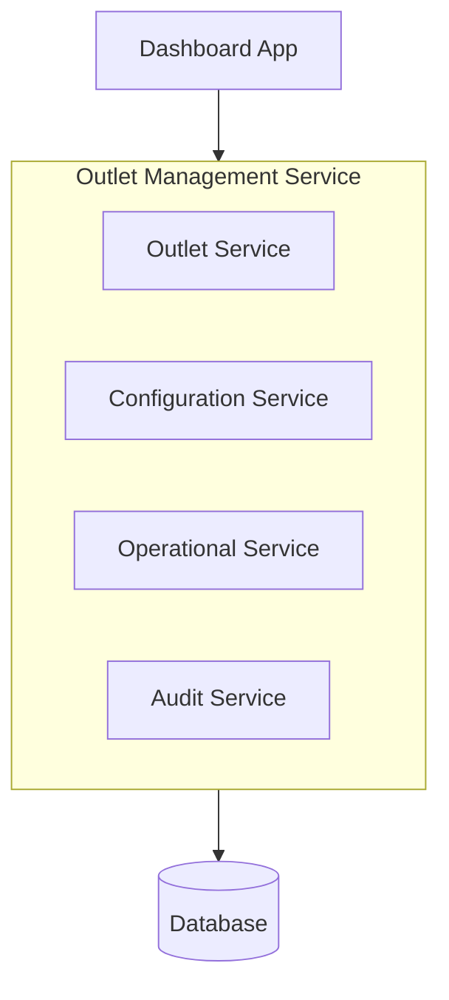
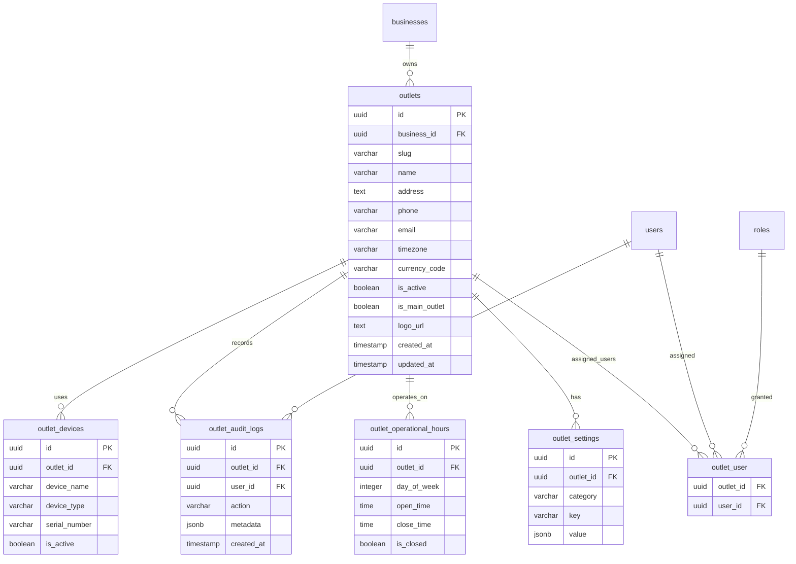

# Overview

## Objective

Modul Outlet Management bertujuan untuk mengelola seluruh outlet merchant pada sistem POS, termasuk:

- Outlet creation
- Outlet configuration
- Outlet operational settings
- Multi-outlet management
- Outlet lifecycle
- Outlet hierarchy & access
  Modul ini menjadi pusat pengelolaan cabang bisnis merchant.

---

## Goals

- Mempermudah bisnis mengelola banyak outlet
- Mendukung multi-outlet architecture
- Menyediakan outlet configuration yang flexible
- Mendukung outlet-specific settings
- Mendukung outlet operational management
- Menjadi foundation untuk inventory, transaction, dan reporting

---

## Non Goals

- Franchise management kompleks
- Warehouse management penuh
- Delivery management
- Regional management hierarchy enterprise

---

# Requirements

## Functional Requirements

### Outlet Management

Merchant dapat:

- Membuat outlet
- Edit outlet
- Nonaktifkan outlet
- Arsipkan outlet
- Restore outlet
- Set default outlet

---

### Outlet Information

Data outlet yang dapat disimpan:

- Outlet name
- Outlet code
- Address
- Phone number
- Email
- Timezone
- Currency
- Tax settings
- Logo
- Operational hours

---

### Multi Outlet Support

System mendukung:

- Banyak outlet dalam satu merchant
- Outlet-specific configuration
- Outlet-specific inventory
- Outlet-specific reporting

---

### Outlet Settings

Setiap outlet dapat memiliki:

- Tax configuration
- Receipt configuration
- Printer configuration
- Payment method configuration
- Inventory settings
- POS settings

---

### Outlet Lifecycle

#### Status

- Inactive
- Active
- Archived (from deleted_at)

---

### Outlet Access Control

Merchant dapat:

- Assign employee ke outlet
- Restrict outlet access
- Set outlet manager
- Set outlet permissions

---

### Outlet Operational Management

Merchant dapat mengatur:

- Opening hours
- Shift hours
- Business days
- Holiday schedules

---

## Non Functional Requirements

| Category      | Requirement                     |
| ------------- | ------------------------------- |
| Scalability   | Support ratusan outlet          |
| Reliability   | Outlet config harus konsisten   |
| Performance   | Outlet switch <300ms            |
| Security      | Outlet isolation                |
| Extensibility | Mudah tambah outlet config baru |

---

# Core Feature

## 1. Outlet CRUD Management

### Features

- Create outlet
- Update outlet
- Archive outlet
- Restore outlet
- Delete outlet (soft delete)

---

### Validation

- Outlet code unique
- Outlet name validation
- Billing validation before creation

---

## 2. Outlet Configuration

### Configuration Categories

#### Financial

- Tax
- Currency
- Service fee
- Payment method

#### POS

- Receipt format
- Auto print
- Kitchen display

#### Inventory

- Stock tracking
- Negative stock policy

#### Operational

- Business hours
- Shift settings

---

## 3. Outlet Switching

User dapat:

- Switch antar outlet
- Memiliki default outlet
- Menyimpan recent outlet

---

## 4. Outlet Assignment

Merchant dapat:

- Assign user ke outlet
- Remove user dari outlet
- Set outlet-specific role

---

## 5. Outlet Status Management

| Status   | Description                                        |
| -------- | -------------------------------------------------- |
| Draft    | Belum siap digunakan                               |
| Active   | Outlet aktif                                       |
| Inactive | outlet tidak aktif atau belum dilakukan pembayaran |
| Archived | Tidak aktif permanen                               |

---

## 6. Outlet Billing Integration

### Important Logic

Saat outlet dibuat:

```txt
Tampilkan informasi untuk melakukan pembayaran sebelum penambahan outlet.
Membership module akan otomatis generate billing adjustment/invoice.
jika maksimum outlet tercapai, tampilkan dialog untuk upgrade paket langganan.
```

---

### Important Logic

Saat outlet dibuat:

```txt
Tampilkan informasi untuk melakukan pembayaran sebelum penambahan outlet.
Membership module akan otomatis generate billing adjustment/invoice.
jika maksimum outlet tercapai, tampilkan dialog untuk upgrade paket langganan.
```

---

# User Flow

## Create Outlet Flow

```txt
Merchant Create Outlet
        ↓
Input Outlet Information
        ↓
Validate Subscription Limit
        ↓
Generate Billing Adjustment
        ↓
Create Outlet Configuration
        ↓
Outlet Activated
```

## Outlet Switching Flow

```txt
User Select Outlet
      ↓
Validate Outlet Access
      ↓
Load Outlet Context
      ↓
Load Outlet Permissions
      ↓
Enter Outlet Dashboard
```

## Archive Outlet Flow

```txt
Merchant Archive Outlet
        ↓
Check Active Transactions
        ↓
Disable Outlet Operations
        ↓
Restrict User Access
        ↓
Archive Outlet Data
```

---

# Architecture

## High Level Architecture



---

## Suggested Architecture Pattern

Modular Monolith

---

## Future Scalability

Future split:

- Outlet Service
- Configuration Service
- Operational Service

---

## Important System Design

### Outlet Isolation

#### Principle

Semua operational data harus memiliki:

```txt
outlet_id
bussiness_id
```

#### Example Modules

- transactions
- inventory
- orders
- reports
- employees

---

### Outlet Context Pattern

#### Request Context

```txt
User Request
    ↓
Resolve Active Outlet
    ↓
Validate Outlet Permission
    ↓
Inject Outlet Context
    ↓
Execute Request
```

## DB Schema Recommendation



---

# Technical Notes

## Tech Stack

- Laravel
- Inertia
- PostgreSQL
- Redis
- JWT
- Vue.js

---

## Recommended Route Structure

### Outlet

```text
GET settings/outlets
POST settings/outlets
GET settings/outlets/:id
PUT settings/outlets/:id
DELETE settings/outlets/:id
```

### Outlet Connfiguration

```text
GET settings/outlets/:id/config
GET settings/outlets/:id/config
```

### Suggested Permission Naming

```txt
outlet.*
outlet.view
outlet.create
outlet.update
outlet.delete
outlet.switch
outlet.manage_settings
```

## Important Technical Considerations

### 1. Outlet Context Injection

Setiap request harus memiliki:

```txt
outlet_id
```

Agar data isolation aman.

### 2. Configuration Extensibility

Gunakan:

```txt
key-value jsonb settings
```

Agar future settings mudah ditambahkan.

### 3. Soft Delete Recommended

Jangan hard delete outlet karena:

- Historical transaction
- Inventory history
- Financial reports
  Masih membutuhkan referensi outlet lama.

---

## Security Considerations

### Required

- Outlet & bussines access validation
- Outlet & busines isolation
- Audit configuration changes
- Restrict archived outlet access

---

## Audit Logging

### Logged Events

- Outlet created
- Outlet updated
- Outlet archived
- Outlet restored
- Main Outlet Switched
- Settings updated
- Operational hours changed

---

## Suggested UX

### Outlet List

#### Show

- Nama Outlet
- Alamat
- Status
- Karyawan Total
- (Dibuat) created at

### Outlet Detail Tabs

#### Suggested Tabs

- General
- Settings
- Employees
- Devices
- Operational Hours
- Billing
- Audit Logs

---

### Important UX Notes

#### 1. Outlet Setup Wizard

Saat create outlet:

```txt
Gunakan step-by-step wizard
```

Agar onboarding lebih mudah.

#### 2. Outlet Switcher

Harus mudah diakses pada:

- Navbar
- POS page
- Dashboard

#### 3. Status Visibility

Archived/suspended outlet harus terlihat jelas.

## Future Extensibility

### Planned Features

- Warehouse outlet
- Central kitchen
- Franchise hierarchy
- Regional grouping
- Outlet performance scoring
- Outlet analytics
- Device synchronization
- Offline outlet mode

---

### Suggested Development Priority

#### Phase 1

- Outlet CRUD
- Outlet switching
- Outlet assignment
- Outlet settings
- Operational hours
- Device management
- Audit logging

#### Phase 2

- Advanced configuration
- Regional hierarchy
- Advanced operational settings

## Success Metrics

| Metric                      | Target     |
| --------------------------- | ---------- |
| Outlet Creation Success     | >99%       |
| Outlet Switch Response      | <300ms     |
| Configuration Save Accuracy | 100%       |
| Unauthorized Outlet Access  | 0 Critical |
| Billing Trigger Accuracy    | 100%       |
