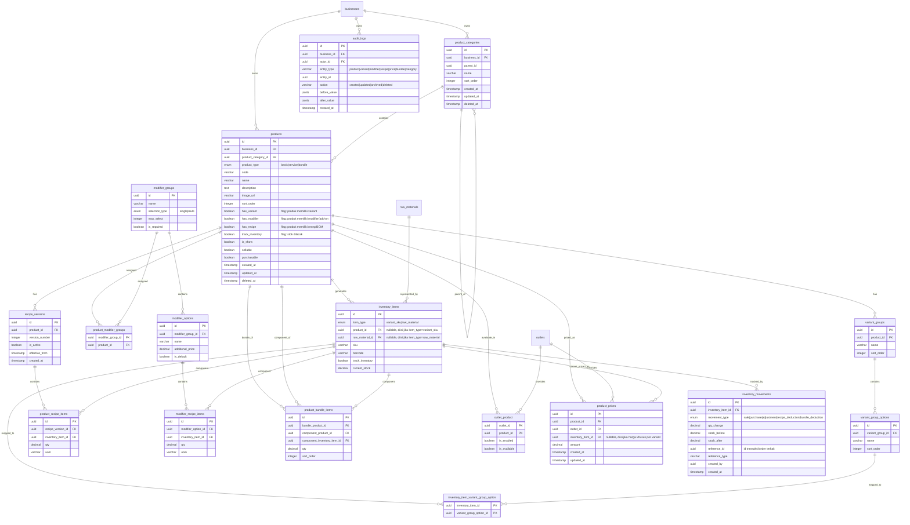

# PRD Product Management

## 1. Overview

### 1.1 Objective

Modul **Master Produk** bertujuan untuk mengelola seluruh produk, jasa, menu, dan item yang dijual merchant pada sistem POS secara flexible untuk berbagai jenis bisnis:

- F&B
- Retail
- Service
- Hybrid business

### 1.2 Navigation Menu

```txt
Master Produk
    ├── Kategori Produk       → Manajemen hierarki kategori produk
    ├── Produk Jual           → CRUD produk (basic, service, bundle)
    └── Opsi Tambahan         → Manajemen modifier group (reusable add-on)
```

### 1.3 Goals

- Menyediakan product architecture yang generic & scalable
- Mendukung berbagai model bisnis (F&B, Retail, Service, Hybrid)
- Mendukung inventory flexibility
- Mendukung variant & modifier complex
- Mendukung recipe/BOM dengan versioning untuk audit costing
- Menyediakan jejak audit (audit log & inventory movement) untuk akurasi transaksi
- Mudah digunakan merchant non-technical
- Menjadi foundation transaksi POS

### 1.4 Non Goals

- Full ERP manufacturing
- Advanced procurement
- Marketplace catalog sync
- AI recommendation engine
- Composite/nested bundle & dynamic bundle promo (lihat _Future Extensibility_)

---

## 2. Product Architecture

### 2.1 Core Principle

Gunakan **single flexible product entity**. Jangan pisahkan `product_fnb`, `product_retail`, `product_service` — sulit maintain. Behavior produk ditentukan oleh kombinasi `product_type` + boolean feature flags.

### 2.2 Product Type

| product_type | Description                              |
| ------------ | ---------------------------------------- |
| `basic`      | Produk standar, opsional track stok      |
| `service`    | Produk jasa / non-stok                   |
| `bundle`     | Paket fixed berisi beberapa produk tetap |

### 2.3 Feature Flags

Selain `product_type`, tabel `products` memiliki boolean flag untuk menandai fitur yang dimiliki produk. Flag ini menentukan tab/section mana yang aktif di form produk dan behavior saat transaksi.

| Flag              | Deskripsi                                                    | Berlaku untuk      |
| ----------------- | ------------------------------------------------------------ | ------------------ |
| `has_variant`     | Produk memiliki variant (Size, Color, dll)                   | `basic`            |
| `has_modifier`    | Produk memiliki modifier/add-on (Topping, Extra Cheese, dll) | `basic`, `service` |
| `has_recipe`      | Produk memiliki resep/BOM (bahan baku)                       | `basic`            |
| `track_inventory` | Stok produk dilacak (inventory tracking aktif)               | `basic`            |

### 2.4 Product Type + Flag Behavior

| product_type | Behavior                                   | Feature Flags yang Diperbolehkan                               |
| ------------ | ------------------------------------------ | -------------------------------------------------------------- |
| `basic`      | Produk standar, opsional track stok        | `has_variant`, `has_modifier`, `has_recipe`, `track_inventory` |
| `service`    | Non-stok, no inventory                     | `has_modifier`                                                 |
| `bundle`     | Composite item (fixed), stok dari komponen | — (tidak ada flag aktif)                                       |

> **Aturan Validasi:**
> - `service` → `track_inventory` selalu `false`, `has_variant` dan `has_recipe` selalu `false`
> - `bundle` → Semua flag selalu `false`. Bundle hanya berisi komponen produk saja. Stok di-deduct dari komponen.
> - Satu produk `basic` bisa sekaligus memiliki variant + modifier + recipe

### 2.5 Feature Flag Combinations (Contoh)

| Contoh Produk      | product_type | has_variant | has_modifier | has_recipe | track_inventory |
| ------------------ | ------------ | ----------- | ------------ | ---------- | --------------- |
| Kaos Polos         | `basic`      | ✗           | ✗            | ✗          | ✓               |
| Kaos Size+Warna    | `basic`      | ✓           | ✗            | ✗          | ✓               |
| Coffee Latte (F&B) | `basic`      | ✓           | ✓            | ✓          | ✗               |
| Burger (F&B)       | `basic`      | ✗           | ✓            | ✓          | ✗               |
| Potong Rambut      | `service`    | ✗           | ✓            | ✗          | ✗               |
| Konsultasi         | `service`    | ✗           | ✗            | ✗          | ✗               |
| Paket Hemat        | `bundle`     | ✗           | ✗            | ✗          | ✗               |

### 2.6 Variant vs Modifier vs Bundle

| Aspek                 | Variant                  | Modifier         | Bundle (simple)                        |
| --------------------- | ------------------------ | ---------------- | -------------------------------------- |
| SKU/barcode sendiri   | Ya                       | Tidak (opsional) | Tidak — mewarisi SKU item komponen     |
| Stock terpisah        | Ya                       | Opsional         | Tidak — deduct dari stok tiap komponen |
| Identity produk utama | Bagian dari produk utama | Addon terpisah   | Kombinasi beberapa produk utama        |
| Contoh                | T-Shirt Size M           | Extra Cheese     | Paket Hemat (Burger+Kentang+Teh)       |

### 2.7 Recommended Inventory Strategy

| Business Type | Inventory Location                                       |
| ------------- | -------------------------------------------------------- |
| F&B           | ingredient/raw material                                  |
| Retail        | variant/SKU                                              |
| Service       | not required                                             |
| Bundle        | mengikuti komponen (ingredient atau SKU tergantung item) |

---

## 3. Sub Menu: Kategori Produk

### 3.1 Overview

Halaman **Kategori Produk** digunakan merchant untuk mengelola hierarki kategori produk. Kategori digunakan untuk pengelompokan produk di POS dan filter di backoffice. Mendukung nested category (sub-kategori).

### 3.2 Fitur

| Fitur                  | Deskripsi                                                            |
| ---------------------- | -------------------------------------------------------------------- |
| List Kategori          | Tampilkan daftar kategori dalam bentuk tree/hierarki yang expandable |
| Search & Filter        | Cari kategori berdasarkan nama                                       |
| Sorting                | Atur urutan tampil kategori via drag & drop atau angka urutan        |
| Create Kategori        | Buat kategori baru (nama, parent opsional, urutan)                   |
| Edit Kategori          | Ubah nama, parent, atau urutan kategori                              |
| Delete/Archive         | Hapus atau arsipkan kategori (validasi: tidak boleh ada produk aktif)|
| Bulk Actions           | Archive beberapa kategori sekaligus                                  |

### 3.3 Functional Requirements

Merchant dapat:

- Melihat daftar kategori dalam hierarki (parent → child)
- Membuat kategori baru dengan nama dan opsional parent category
- Mengedit nama, parent, dan urutan tampil kategori
- Menghapus/mengarsipkan kategori (dengan validasi produk terkait)
- Mengatur urutan tampil kategori via drag & drop
- Mencari kategori berdasarkan nama

### 3.4 User Flow

#### 3.4.1 List & Navigasi Kategori

```txt
┌─────────────────────────────────────────────────┐
│        HALAMAN KATEGORI PRODUK                   │
└─────────────────────────┬───────────────────────┘
                          ↓
          ┌──────────────────────────┐
          │  Tampilkan Tree Kategori │  ← Hierarki parent → child
          │  + Search Bar            │     Expandable/collapsible
          └──────────┬───────────────┘
                     ↓
          ┌──────────────────────────┐
          │  Aksi per Kategori:      │  ← Edit | Hapus | Tambah Sub-Kategori
          │  [Edit] [Hapus] [+Sub]   │
          └──────────────────────────┘
                     ↓
          Tombol [+ Buat Kategori Baru] di header
```

#### 3.4.2 Buat Kategori Baru

```txt
┌─────────────────────────────────────────────────┐
│        BUAT KATEGORI BARU                        │
└─────────────────────────┬───────────────────────┘
                          ↓
          ┌──────────────────────────┐
          │  Isi Nama Kategori       │  ← Nama wajib diisi
          └──────────┬───────────────┘
                     ↓
          ┌──────────────────────────┐
          │  (Opsional) Pilih        │  ← Jika ini sub-kategori, pilih parent-nya
          │  Kategori Induk          │     Contoh: "Minuman" → sub: "Kopi", "Jus"
          └──────────┬───────────────┘
                     ↓
          ┌──────────────────────────┐
          │  Atur Urutan Tampil      │  ← Drag & drop atau isi angka urutan
          └──────────┬───────────────┘
                     ↓
          Simpan Kategori
          (langsung aktif di form produk)
```

#### 3.4.3 Edit Kategori

```txt
┌─────────────────────────────────────────────────┐
│        EDIT KATEGORI                             │
└─────────────────────────┬───────────────────────┘
                          ↓
          ┌──────────────────────────┐
          │  Load Data Kategori      │  ← Tampilkan data saat ini
          └──────────┬───────────────┘
                     ↓
          ┌──────────────────────────┐
          │  Edit Nama / Parent /    │  ← Ubah field yang diinginkan
          │  Urutan Tampil           │
          └──────────┬───────────────┘
                     ↓
          ┌──────────────────────────┐
          │  Simpan Perubahan        │  ← Validasi: nama wajib diisi
          └──────────────────────────┘
```

#### 3.4.4 Hapus Kategori

```txt
┌─────────────────────────────────────────────────┐
│        HAPUS KATEGORI                            │
└─────────────────────────┬───────────────────────┘
                          ↓
          ┌──────────────────────────┐
          │  Cek apakah ada produk   │  ← Validasi: kategori tidak boleh
          │  aktif di kategori ini?  │     dihapus jika masih ada produk aktif
          └──────────┬───────────────┘
                     ↓
             [Ada Produk?]
              Ya          Tidak
              ↓             ↓
    Tampilkan Error    Tampilkan Dialog
    "Pindahkan produk  Konfirmasi Hapus
     terlebih dahulu"        ↓
                       Kategori dihapus
                       (soft delete)
```

### 3.5 Schema Terkait

| Tabel                | Kolom Penting                                    | Deskripsi                                          |
| -------------------- | ------------------------------------------------ | -------------------------------------------------- |
| `product_categories` | `id`, `business_id`, `parent_id`, `name`, `sort_order` | Hierarki kategori, self-reference via `parent_id` |

### 3.6 UX Notes

- Tampilkan kategori dalam bentuk tree/hierarki yang bisa di-expand/collapse
- Gunakan drag & drop untuk mengatur urutan
- Tampilkan jumlah produk per kategori di samping nama
- Saat menghapus kategori yang punya sub-kategori, berikan opsi: hapus semua sub-kategori atau pindahkan ke parent

---

## 4. Sub Menu: Produk Jual

### 4.1 Overview

Halaman **Produk Jual** adalah halaman utama untuk mengelola semua produk yang dijual merchant. Semua tipe produk (`basic`, `service`, `bundle`) dikelola di satu halaman ini dengan filter tipe.

### 4.2 Fitur

| Fitur                  | Deskripsi                                                                   |
| ---------------------- | --------------------------------------------------------------------------- |
| List Produk            | Tampilkan daftar semua produk dengan informasi ringkas                      |
| Search                 | Cari berdasarkan nama produk, kode, atau SKU                               |
| Filter                 | Filter berdasarkan: tipe produk, kategori, status (aktif/arsip), outlet    |
| Sorting                | Urutkan berdasarkan nama, tanggal dibuat, harga, dll                       |
| Create Produk          | Buat produk baru (basic/service/bundle) via wizard form                    |
| Edit Produk            | Edit produk existing (semua field + feature flags)                          |
| Archive Produk         | Arsipkan produk (soft delete, tidak tampil di POS)                         |
| Duplicate Produk       | Salin produk beserta semua setting (variant, modifier, resep, harga)       |
| Bulk Actions           | Archive, ubah kategori, atau ubah outlet assignment untuk banyak produk    |
| Import/Export CSV      | Bulk import produk baru atau export data produk ke CSV                     |

### 4.3 Functional Requirements

#### 4.3.1 Product CRUD

Merchant dapat:

- Membuat produk baru (semua tipe: basic, service, bundle)
- Mengedit produk existing
- Mengarsipkan produk (soft delete)
- Menduplikasi produk (semua setting disalin)
- Mengatur outlet assignment per produk
- Mengatur pricing (base, outlet, variant)
- Mengatur stock behavior via feature flags

#### 4.3.2 Multi Business Type Support

**F&B**

- Menu, Modifier, Recipe, Combo/Bundle sederhana
- Kitchen routing (future)

**Retail**

- SKU, Barcode, Variant inventory
- Serial/lot support (future)

**Service**

- Non-stock item, Duration, Staff assignment

#### 4.3.3 Variant Support

```txt
Retail:
T-Shirt
- Size: S, M, L
- Color: Red, Blue

F&B:
Coffee
- Size: Small, Medium, Large
```

- Saat membuat variant, produk dapat memiliki setting harga per variant
- Variant menghasilkan inventory_items terpisah dengan SKU & barcode sendiri

#### 4.3.4 Recipe / BOM Support

```txt
1 Coffee Latte
- 20gr Coffee Bean
- 150ml Milk
- 10gr Sugar
```

- Saat transaksi, inventory bahan baku otomatis berkurang
- Setiap perubahan resep tercatat sebagai versi baru (lihat `recipe_versions`)

#### 4.3.5 Bundle Support

```txt
Paket Hemat
- 1x Burger
- 1x Kentang Goreng
- 1x Es Teh
= Harga Bundle: Rp 35.000
```

- Isi bundle bersifat fixed (ditentukan merchant saat setup)
- Saat transaksi, stok/ingredient dari masing-masing item bundle tetap terpotong sesuai resep/stok item tersebut

> **Klarifikasi scope Bundle**: Bundle yang dimaksud adalah _fixed bundle_ — kombinasi produk tetap dengan harga bundle tetap. Bundle dinamis/composite masuk ke **Future Extensibility**.

#### 4.3.6 Outlet Product Management

Merchant dapat:

- Enable/disable product per outlet
- Set outlet-specific pricing
- Set outlet-specific availability

#### 4.3.7 Pricing Management

Harga produk disimpan dengan 3 level:

1. **Harga Dasar** — harga default (global)
2. **Harga per Outlet** — override harga per outlet tertentu
3. **Harga per Variant** — override harga per kombinasi variant

**Logika Prioritas Harga:** Harga Variant Outlet > Harga Variant Global > Harga Outlet > Harga Dasar.

### 4.4 User Flow

#### 4.4.1 List Produk (Halaman Utama)

```txt
┌─────────────────────────────────────────────────┐
│        HALAMAN PRODUK JUAL                       │
└─────────────────────────┬───────────────────────┘
                          ↓
          ┌──────────────────────────┐
          │  Header:                 │
          │  [+ Buat Produk Baru]    │  ← Tombol CTA utama
          │  [Import CSV] [Export]   │  ← Bulk import/export
          └──────────┬───────────────┘
                     ↓
          ┌──────────────────────────┐
          │  Search Bar              │  ← Cari nama, kode, SKU
          │  + Filter:               │     Filter: Tipe | Kategori | Status | Outlet
          │    [Tipe] [Kategori]     │
          │    [Status] [Outlet]     │
          └──────────┬───────────────┘
                     ↓
          ┌──────────────────────────┐
          │  Tabel Produk:           │
          │  ┌──────────────────────┐│
          │  │ ☐ │ Nama  │ Tipe    ││  ← Checkbox untuk bulk actions
          │  │   │ Harga │ Kategori││
          │  │   │ Stok  │ Status  ││
          │  │   │       │ [Aksi]  ││  ← Edit | Duplikat | Arsipkan
          │  └──────────────────────┘│
          └──────────┬───────────────┘
                     ↓
          ┌──────────────────────────┐
          │  Bulk Actions Bar        │  ← Muncul saat checkbox dipilih
          │  [Arsipkan] [Ubah        │     Aksi massal
          │   Kategori] [Ubah Outlet]│
          └──────────┬───────────────┘
                     ↓
          Tab: [Semua] [Aktif] [Diarsipkan]
```

#### 4.4.2 Buat Produk Baru (Main Flow)

Flow utama pembuatan produk. Step tambahan muncul secara kondisional sesuai **product_type** dan **feature flags** yang dipilih — merchant tidak perlu melihat opsi yang tidak relevan.

```txt
┌─────────────────────────────────────────────────┐
│              MULAI: Buat Produk Baru             │
└─────────────────────────┬───────────────────────┘
                          ↓
              ┌─────────────────────┐
              │  1. Informasi Dasar │  ← Nama, Deskripsi, Gambar, Kategori, Kode Produk
              └──────────┬──────────┘
                         ↓
              ┌─────────────────────┐
              │  2. Pilih Tipe      │  ← Basic | Service | Bundle
              │     Produk          │
              └──────────┬──────────┘
                         ↓
              ┌─────────────────────┐
              │  3. Feature Flags   │  ← Toggle fitur produk (kondisional per tipe):
              │     (kondisional)   │     ☐ Memiliki Variant (has_variant) — hanya basic
              │                     │     ☐ Memiliki Add-on (has_modifier) — basic & service
              │                     │     ☐ Memiliki Resep (has_recipe) — hanya basic
              │                     │     ☐ Lacak Stok (track_inventory) — hanya basic
              └──────────┬──────────┘
                         ↓
         ┌───────────────┼───────────────────────┐
         │               │                       │
  [has_variant]    [has_recipe]            [bundle]
         ↓               ↓                       ↓
  Setup Variant    Setup Bahan Baku        Pilih Produk
  Group & Opsi     (Resep/BOM)             Komponen Bundle
  (→ Flow 4.4.3)   (→ Flow 4.4.5)         (→ Flow 4.4.6)
         │               │                       │
         └───────────────┼───────────────────────┘
                         ↓
              ┌─────────────────────┐
              │  4. Opsi Tambahan   │  ← Muncul jika has_modifier = true
              │     (Modifier)      │     Pilih Modifier Group dari daftar existing
              │                     │     (→ Flow 4.4.4)
              └──────────┬──────────┘
                         ↓
              ┌─────────────────────┐
              │  5. Pengaturan      │  ← Set harga base, harga per outlet, harga per variant
              │     Harga           │     (→ Flow 4.4.7)
              └──────────┬──────────┘
                         ↓
              ┌─────────────────────┐
              │  6. Pengaturan      │  ← Pilih outlet yang menjual produk ini
              │     Outlet          │     Enable/disable per outlet (→ Flow 4.4.8)
              └──────────┬──────────┘
                         ↓
              ┌─────────────────────┐
              │  7. Review &        │  ← Tampilkan ringkasan semua setting
              │     Simpan          │     Konfirmasi lalu Publish
              └─────────────────────┘
```

> **UX Note**: Gunakan Progressive Form (wizard step-by-step). Feature flags yang tidak relevan untuk product_type tertentu otomatis disembunyikan. Contoh: Service product hanya menampilkan toggle `has_modifier`, sedangkan `has_variant`, `has_recipe`, dan `track_inventory` otomatis hidden. Bundle langsung masuk ke step setup komponen.

#### 4.4.3 Setup Variant

Flow ini diakses saat merchant mengaktifkan flag **`has_variant = true`** pada step 3 (Feature Flags).

```txt
┌────────────────────────────────────────────────┐
│         SETUP VARIANT PRODUK                   │
└───────────────────────┬────────────────────────┘
                        ↓
         ┌──────────────────────────┐
         │  Tambah Variant Group    │  ← Contoh: "Ukuran", "Warna"
         │  (min. 1 group)          │     Nama group bebas diisi merchant
         └──────────┬───────────────┘
                    ↓
         ┌──────────────────────────┐
         │  Tambah Opsi per Group   │  ← Contoh: S, M, L / Merah, Biru
         │  (min. 1 opsi)           │     Klik "+ Tambah Opsi" untuk tiap nilai
         └──────────┬───────────────┘
                    ↓
         ┌──────────────────────────┐
         │  Sistem Generate         │  ← Sistem otomatis membuat kombinasi
         │  Kombinasi Variant       │     Contoh: S-Merah, S-Biru, M-Merah, M-Biru
         └──────────┬───────────────┘
                    ↓
         ┌──────────────────────────┐
         │  Set SKU & Barcode       │  ← Opsional per kombinasi, atau auto-generate
         │  per Kombinasi           │
         └──────────┬───────────────┘
                    ↓
         ┌──────────────────────────┐
         │  Set Stock per Kombinasi │  ← Jika track_inventory = true, isi stok awal
         └──────────────────────────┘
                    ↓
             Kembali ke Main Flow (Step 5: Harga)
```

> **UX Note**: Tampilkan preview tabel kombinasi secara real-time saat merchant menambahkan opsi. Merchant tidak perlu memahami konsep "inventory_item" — cukup isi nama & nilai variant. Input stok awal, harga beli stok awal, dan keterangan berita acara hanya diisi saat pembuatan produk baru (`!isEdit`).

#### 4.4.4 Lampirkan Modifier ke Produk

Flow ini diakses saat merchant mengaktifkan flag **`has_modifier = true`**. Merchant memilih Modifier Group yang sudah dibuat di sub menu **Opsi Tambahan**.

```txt
┌────────────────────────────────────────────────┐
│   LAMPIRKAN MODIFIER KE PRODUK                 │
└───────────────────────┬────────────────────────┘
                        ↓
         ┌──────────────────────────┐
         │  Tampilkan Daftar        │  ← List semua Modifier Group yang sudah ada
         │  Modifier Group          │     (dibuat di sub menu Opsi Tambahan)
         └──────────┬───────────────┘
                    ↓
         ┌──────────────────────────┐
         │  Pilih Group yang Ingin  │  ← Centang modifier group yang relevan
         │  Dilampirkan             │     Contoh: "Tingkat Manis", "Pilihan Topping"
         └──────────┬───────────────┘
                    ↓
         ┌──────────────────────────┐
         │  Preview Modifier yang   │  ← Tampilkan daftar modifier yang terpasang
         │  Terpasang ke Produk     │     beserta opsi-opsinya
         └──────────────────────────┘
                    ↓
             Kembali ke Main Flow
```

> **UX Note**: Modifier Group dibuat dan dikelola secara terpisah di sub menu **Opsi Tambahan**. Di form produk, merchant hanya memilih group mana yang ingin dilampirkan. Sediakan juga shortcut "Buat Modifier Group Baru" yang membuka modal/drawer tanpa meninggalkan form produk.

#### 4.4.5 Setup Recipe / BOM

Flow ini diakses saat merchant mengaktifkan flag **`has_recipe = true`** pada step 3 (Feature Flags).

```txt
┌────────────────────────────────────────────────┐
│         SETUP RESEP / BAHAN BAKU               │
└───────────────────────┬────────────────────────┘
                        ↓
         ┌──────────────────────────┐
         │  Cari & Pilih Bahan Baku │  ← Dari daftar raw material yang ada di inventory
         │  (satu per satu)         │     Ketik nama untuk cari cepat
         └──────────┬───────────────┘
                    ↓
         ┌──────────────────────────┐
         │  Isi Jumlah & Satuan     │  ← Contoh: 150 ml, 20 gr, 2 pcs
         │  per Bahan Baku          │     Satuan menyesuaikan satuan bahan baku
         └──────────┬───────────────┘
                    ↓
         ┌──────────────────────────┐
         │  Ulangi untuk setiap     │  ← Klik "+ Tambah Bahan" untuk bahan berikutnya
         │  bahan dalam resep       │
         └──────────┬───────────────┘
                    ↓
         ┌──────────────────────────┐
         │  Review Resep & Simpan   │  ← Tampilkan daftar bahan + estimasi HPP (opsional)
         └──────────────────────────┘
                    ↓
      Sistem menyimpan sebagai Versi Resep Baru
      (versi lama tetap tersimpan untuk audit costing)
```

> **UX Note**: Tampilkan ringkasan bahan baku saat ini secara jelas. Jika merchant mengubah resep yang sudah ada, tampilkan peringatan bahwa perubahan ini akan membuat versi resep baru dan tidak memengaruhi histori transaksi sebelumnya.

#### 4.4.6 Setup Bundle

Flow ini diakses saat merchant memilih `product_type = bundle`.

```txt
┌────────────────────────────────────────────────┐
│         SETUP BUNDLE / PAKET                   │
└───────────────────────┬────────────────────────┘
                        ↓
         ┌──────────────────────────┐
         │  Cari & Pilih Produk     │  ← Cari dari daftar produk yang sudah ada
         │  Komponen                │     Produk basic atau service bisa jadi komponen
         └──────────┬───────────────┘
                    ↓
         ┌──────────────────────────┐
         │  (Jika Variant) Pilih    │  ← Jika komponen adalah produk variant,
         │  Kombinasi Variant       │     tentukan kombinasi mana yang masuk bundle
         └──────────┬───────────────┘
                    ↓
         ┌──────────────────────────┐
         │  Set Jumlah (Qty)        │  ← Berapa unit komponen ini dalam 1 bundle?
         │  per Komponen            │     Contoh: 1x Burger, 1x Kentang, 1x Minuman
         └──────────┬───────────────┘
                    ↓
         ┌──────────────────────────┐
         │  Ulangi untuk semua      │  ← Klik "+ Tambah Produk" untuk komponen berikutnya
         │  komponen bundle         │
         └──────────┬───────────────┘
                    ↓
         ┌──────────────────────────┐
         │  Review Komposisi Bundle │  ← Tampilkan daftar komponen + total harga normal
         │  & Simpan                │     vs. harga bundle (agar merchant tahu selisih diskon)
         └──────────────────────────┘
                    ↓
             Kembali ke Main Flow (Step 5: Harga Bundle)
```

> **UX Note**: Tampilkan preview "Total Harga Normal" (jumlah harga satuan semua komponen) secara otomatis, agar merchant mudah menentukan harga bundle yang kompetitif.

#### 4.4.7 Setup Harga (Pricing)

```txt
┌────────────────────────────────────────────────┐
│         PENGATURAN HARGA                       │
└───────────────────────┬────────────────────────┘
                        ↓
         ┌──────────────────────────┐
         │  Set Harga Dasar (Base)  │  ← Harga default jika tidak ada override
         └──────────┬───────────────┘
                    ↓
              [has_variant = true?]
               Ya          Tidak
               ↓             ↓
       Set Harga per     Lanjut ke
       Kombinasi Variant  Harga Outlet
       (override harga
        dasar per SKU)
               │             │
               └──────┬──────┘
                      ↓
         ┌──────────────────────────┐
         │  (Opsional) Set Harga    │  ← Harga berbeda per outlet jika diperlukan
         │  per Outlet              │     Contoh: harga mall vs. harga non-mall
         └──────────────────────────┘
                      ↓
              Simpan semua harga
```

> **UX Note**: Gunakan tabel harga yang bisa diedit inline. Jika tidak diisi, harga outlet otomatis menggunakan harga dasar. Tampilkan indikator visual jika ada override harga di outlet tertentu.

#### 4.4.8 Setup Outlet Assignment

```txt
┌────────────────────────────────────────────────┐
│         PENGATURAN OUTLET PRODUK               │
└───────────────────────┬────────────────────────┘
                        ↓
         ┌──────────────────────────┐
         │  Tampilkan Daftar Semua  │  ← List semua outlet yang dimiliki bisnis
         │  Outlet                  │
         └──────────┬───────────────┘
                    ↓
         ┌──────────────────────────┐
         │  Toggle Enable/Disable   │  ← Centang outlet yang menjual produk ini
         │  per Outlet              │     Default: semua outlet enabled
         └──────────┬───────────────┘
                    ↓
         ┌──────────────────────────┐
         │  (Opsional) Set Status   │  ← Tandai jika produk sementara tidak tersedia
         │  Ketersediaan            │     di outlet tertentu (is_available = false)
         └──────────────────────────┘
                    ↓
              Simpan pengaturan outlet
```

> **UX Note**: Gunakan toggle switch yang jelas. Tampilkan ringkasan "Produk ini aktif di X dari Y outlet" di bagian atas untuk orientasi cepat.

#### 4.4.9 Archive & Duplicate Produk

```txt
ARCHIVE PRODUK
──────────────
Dari Product List → Pilih Produk → Klik "Arsipkan"
        ↓
  Konfirmasi: "Produk akan diarsipkan dan tidak tampil di POS"
        ↓
  Produk berpindah ke tab "Diarsipkan"
  (dapat dipulihkan kapan saja)


DUPLICATE PRODUK
────────────────
Dari Product List → Pilih Produk → Klik "Duplikat"
        ↓
  Sistem membuat salinan produk dengan nama "Salinan dari ..."
  (Semua setting disalin: Variant, Modifier, Resep, Harga)
        ↓
  Merchant diarahkan ke form edit produk duplikat
  (SKU baru di-generate otomatis)
```

> **UX Note**: Pastikan ada konfirmasi sebelum archive. Untuk duplikasi, langsung buka form edit agar merchant bisa segera menyesuaikan nama dan harga produk baru.

### 4.5 Schema Terkait

| Tabel                     | Deskripsi                                                              |
| ------------------------- | ---------------------------------------------------------------------- |
| `products`                | Entitas utama produk (semua tipe)                                      |
| `variant_groups`          | Definisi dimensi variant (Size, Color, dll)                            |
| `variant_group_options`   | Nilai opsi variant (S, M, L, dll)                                      |
| `product_modifier_groups` | Pivot: produk ↔ modifier group                                         |
| `recipe_versions`         | Riwayat versi resep produk                                             |
| `product_recipe_items`    | Detail bahan baku per versi resep                                      |
| `product_bundle_items`    | Komposisi komponen bundle                                              |
| `product_prices`          | Harga produk (base, outlet, variant)                                   |
| `outlet_product`          | Assignment & availability produk per outlet                            |
| `inventory_items`         | Unit stok (variant SKU / raw material)                                 |

### 4.6 UX Notes

1. **Simplify Variant UX** — gunakan Option Set Generator, jangan terlalu technical
2. **Bundle UX** — merchant memilih produk komponen dari daftar produk existing + set qty, sistem otomatis menghitung total stock impact
3. **Product Templates** — sediakan template F&B menu, Retail SKU, Service item
4. **Progressive Form** — wizard step-by-step, step yang tidak relevan otomatis hidden

---

## 5. Sub Menu: Opsi Tambahan (Modifier)

### 5.1 Overview

Halaman **Opsi Tambahan** digunakan merchant untuk mengelola **Modifier Group** secara terpusat. Modifier Group bersifat **reusable** — satu group bisa dipasang ke banyak produk. Halaman ini terpisah dari form produk agar modifier bisa dibuat dan dikelola secara mandiri.

### 5.2 Fitur

| Fitur                      | Deskripsi                                                                   |
| -------------------------- | --------------------------------------------------------------------------- |
| List Modifier Group        | Tampilkan daftar semua modifier group dengan info opsi & produk terpasang   |
| Search & Filter            | Cari modifier group berdasarkan nama                                        |
| Sorting                    | Urutkan berdasarkan nama atau tanggal dibuat                                |
| Create Modifier Group      | Buat group baru (nama, tipe seleksi, opsi, batas, kewajiban)               |
| Edit Modifier Group        | Ubah nama, tipe, opsi, atau pengaturan group                               |
| Delete Modifier Group      | Hapus group (validasi: tidak boleh terpasang ke produk aktif)               |
| Bulk Actions               | Archive beberapa modifier group sekaligus                                   |
| Lihat Produk Terpasang     | Lihat daftar produk yang menggunakan modifier group ini                     |

### 5.3 Functional Requirements

Merchant dapat:

- Melihat daftar semua Modifier Group yang sudah dibuat
- Membuat Modifier Group baru dengan:
  - Nama group (contoh: "Tingkat Manis", "Pilihan Topping")
  - Tipe seleksi: `single` (pilih 1) atau `multi` (pilih banyak)
  - Wajib/opsional (`is_required`)
  - Batas maksimum pilihan (`max_select`, untuk tipe `multi`)
  - Daftar opsi (nama + harga tambahan + default flag)
  - (Opsional) Sambungkan opsi ke bahan baku untuk auto stock deduction
- Mengedit Modifier Group existing
- Menghapus Modifier Group (dengan validasi produk terkait)
- Melihat daftar produk yang menggunakan modifier group tertentu

### 5.4 User Flow

#### 5.4.1 List Modifier Group (Halaman Utama)

```txt
┌─────────────────────────────────────────────────┐
│        HALAMAN OPSI TAMBAHAN (MODIFIER)          │
└─────────────────────────┬───────────────────────┘
                          ↓
          ┌──────────────────────────┐
          │  Header:                 │
          │  [+ Buat Opsi Tambahan]  │  ← Tombol CTA utama
          └──────────┬───────────────┘
                     ↓
          ┌──────────────────────────┐
          │  Search Bar              │  ← Cari berdasarkan nama modifier group
          └──────────┬───────────────┘
                     ↓
          ┌──────────────────────────┐
          │  Tabel Modifier Group:   │
          │  ┌──────────────────────┐│
          │  │ ☐ │ Nama Group       ││
          │  │   │ Tipe Seleksi     ││  ← Single / Multi
          │  │   │ Jumlah Opsi      ││  ← Berapa opsi dalam group ini
          │  │   │ Produk Terpasang ││  ← Jumlah produk yang menggunakan group ini
          │  │   │ Wajib/Opsional   ││
          │  │   │ [Aksi]           ││  ← Edit | Hapus | Lihat Produk
          │  └──────────────────────┘│
          └──────────────────────────┘
```

#### 5.4.2 Buat Modifier Group Baru

```txt
┌────────────────────────────────────────────────┐
│         BUAT OPSI TAMBAHAN BARU                │
└───────────────────────┬────────────────────────┘
                        ↓
         ┌──────────────────────────┐
         │  Isi Nama Group          │  ← Contoh: "Tingkat Manis", "Pilihan Topping"
         └──────────┬───────────────┘
                    ↓
         ┌──────────────────────────┐
         │  Pilih Tipe Seleksi      │  ← Single (pilih 1) atau Multi (pilih banyak)
         └──────────┬───────────────┘
                    ↓
         ┌──────────────────────────┐
         │  Atur Batas & Kewajiban  │  ← Wajib dipilih? Maks berapa pilihan?
         └──────────┬───────────────┘
                    ↓
         ┌──────────────────────────┐
         │  Tambahkan Opsi-Opsi     │  ← Nama opsi + harga tambahan (bisa Rp 0)
         │  dalam Group ini         │     Tandai opsi default jika ada
         └──────────┬───────────────┘
                    ↓
         ┌──────────────────────────┐
         │  (Opsional) Sambungkan   │  ← Untuk F&B: pilih bahan baku yang terpotong
         │  ke Bahan Baku           │     saat opsi ini dipilih di transaksi
         └──────────┬───────────────┘
                    ↓
         Simpan Modifier Group
         (langsung tersedia untuk dilampirkan ke produk)
```

#### 5.4.3 Edit Modifier Group

```txt
┌────────────────────────────────────────────────┐
│         EDIT OPSI TAMBAHAN                     │
└───────────────────────┬────────────────────────┘
                        ↓
         ┌──────────────────────────┐
         │  Load Data Group         │  ← Tampilkan data saat ini
         └──────────┬───────────────┘
                    ↓
         ┌──────────────────────────┐
         │  Edit Nama / Tipe /      │  ← Ubah field yang diinginkan
         │  Opsi / Batas / Wajib    │     Tambah/hapus opsi
         └──────────┬───────────────┘
                    ↓
         ┌──────────────────────────┐
         │  Preview Produk yang     │  ← Tampilkan peringatan jika modifier
         │  Terpengaruh             │     terpasang ke banyak produk
         └──────────┬───────────────┘
                    ↓
         Simpan Perubahan
         (perubahan berlaku untuk semua produk yang menggunakan group ini)
```

#### 5.4.4 Hapus Modifier Group

```txt
┌────────────────────────────────────────────────┐
│         HAPUS OPSI TAMBAHAN                    │
└───────────────────────┬────────────────────────┘
                        ↓
         ┌──────────────────────────┐
         │  Cek apakah ada produk   │  ← Validasi: modifier group tidak boleh
         │  yang menggunakan group? │     dihapus jika masih terpasang ke produk
         └──────────┬───────────────┘
                    ↓
             [Ada Produk Terpasang?]
              Ya              Tidak
              ↓                 ↓
    Tampilkan Error        Tampilkan Dialog
    "Lepaskan dari semua   Konfirmasi Hapus
     produk terlebih              ↓
     dahulu" + daftar      Modifier Group
     produk terkait        dihapus (soft delete)
```

### 5.5 Schema Terkait

| Tabel                     | Kolom Penting                                                           | Deskripsi                                         |
| ------------------------- | ----------------------------------------------------------------------- | ------------------------------------------------- |
| `modifier_groups`         | `id`, `name`, `selection_type`, `max_select`, `is_required`             | Definisi modifier group (reusable)                |
| `modifier_options`        | `id`, `modifier_group_id`, `name`, `additional_price`, `is_default`     | Opsi individual dalam modifier group              |
| `product_modifier_groups` | `modifier_group_id`, `product_id`                                       | Pivot: modifier group ↔ produk                    |
| `modifier_recipe_items`   | `id`, `modifier_option_id`, `inventory_item_id`, `qty`, `uom`           | Link opsi modifier ke bahan baku (auto deduction) |

### 5.6 UX Notes

1. **Modifier UX untuk F&B** — cepat, mobile friendly, POS friendly
2. **Reusability** — tekankan bahwa satu modifier group bisa dipakai banyak produk. Tampilkan badge "Dipakai oleh X produk"
3. **Inline Preview** — saat mengedit, tampilkan preview bagaimana modifier akan muncul di POS
4. **Quick Create** — dari form produk, sediakan shortcut untuk membuat modifier group baru tanpa meninggalkan halaman

---

## 6. Transaction Flows

_Flow ini berjalan otomatis di sisi sistem saat transaksi POS berlangsung. Bukan bagian dari menu Master Produk, tetapi didokumentasikan karena sangat terkait dengan konfigurasi produk._

### 6.1 Recipe Transaction Flow

```txt
Customer Beli Produk (has_recipe = true)
        ↓
Load Versi Resep Aktif (is_active = true)
        ↓
Hitung Pemakaian Bahan Baku
(qty pesanan × qty bahan per resep)
        ↓
Validasi Stok Mencukupi?
  Tidak → Tampilkan Peringatan Stok Habis
  Ya    → Kurangi Stok Bahan Baku
        ↓
Simpan ke Inventory Movement
(movement_type = recipe_deduction)
```

### 6.2 Bundle Transaction Flow

```txt
Customer Beli Bundle
        ↓
Load Daftar Komponen Bundle
        ↓
Untuk setiap komponen:
  └─ Load Aturan Stok/Resep Komponen
  └─ Kurangi Stok atau Bahan Baku
  └─ Simpan Inventory Movement
     (movement_type = bundle_deduction)
        ↓
Selesai — semua movement tersimpan
```

### 6.3 Variant + Modifier Selection Flow (POS)

```txt
Pilih Produk di POS
      ↓
[has_variant = true?]
  Ya → Tampilkan pilihan Variant → Customer pilih
  Tidak → Lanjut
      ↓
[has_modifier = true?]
  Ya → Tampilkan Modifier Group → Customer pilih opsi
  Tidak → Lanjut
      ↓
Hitung Harga Akhir:
  Harga Variant (atau harga dasar)
  + Total Harga Tambahan Modifier
      ↓
Masuk ke Keranjang / Transaksi
```

---

## 7. System Architecture

### 7.1 High Level Architecture

```txt
Client App
    ↓
API Gateway
    ↓
Product Service
    ├── Product Core Service
    ├── Category Service
    ├── Variant Engine
    ├── Modifier Engine
    ├── Recipe Engine (+ Versioning)
    ├── Bundle Engine
    ├── Pricing Engine
    ├── Inventory Integration (+ Ledger)
    └── Audit Logging Service
    ↓
Database
```

### 7.2 Suggested Architecture Pattern

Modular Monolith

### 7.3 Future Split Possibility

- Product Service
- Pricing Service
- Inventory Service
- Recipe Service
- Bundle/Promo Service

---

## 8. DB Schema

### 8.1 Entity Relationship Diagram



### 8.2 Schema per Domain

#### Domain 1: Product Core

| Tabel                | Tujuan                                                                                                                                                                                                                          |
| -------------------- | ------------------------------------------------------------------------------------------------------------------------------------------------------------------------------------------------------------------------------- |
| `products`           | Entitas utama produk. `product_type` (basic/service/bundle) menentukan behavior dasar. Boolean flags (`has_variant`, `has_modifier`, `has_recipe`, `track_inventory`) menentukan fitur tambahan yang aktif. |
| `product_categories` | Hierarki kategori produk. Mendukung nested category via `parent_id` self-reference.                                                                                                                                             |

**Kolom Kritis:**

- `products.product_type` — discriminator tipe utama (basic/service/bundle)
- `products.has_variant` — flag: produk memiliki variant. Hanya berlaku untuk `basic`
- `products.has_modifier` — flag: produk memiliki modifier/add-on. Berlaku untuk `basic` dan `service`
- `products.has_recipe` — flag: produk memiliki resep/BOM. Hanya berlaku untuk `basic`
- `products.track_inventory` — flag: stok produk dilacak. Hanya berlaku untuk `basic`
- `products.is_show` — kontrol visibilitas di POS tanpa harus archive
- `product_categories.parent_id` — memungkinkan sub-kategori (contoh: Minuman → Kopi, Jus)

---

#### Domain 2: Variant

| Tabel                                       | Tujuan                                                                                        |
| ------------------------------------------- | --------------------------------------------------------------------------------------------- |
| `variant_groups`                            | Dimensi/atribut variant. Contoh: "Ukuran", "Warna".                                          |
| `variant_group_options`                     | Nilai dari setiap variant group. Contoh: S, M, L.                                             |
| `inventory_items` (item_type = variant_sku) | Setiap kombinasi variant sebagai inventory unit terpisah. Menyimpan SKU, barcode, dan stok.   |
| `inventory_item_variant_group_option`       | Pivot yang memetakan kombinasi variant ke option-option yang membentuknya.                    |

**Kolom Kritis:**

- `inventory_items.item_type` — discriminator: `variant_sku` untuk stok varian, `raw_material` untuk bahan baku
- `inventory_items.track_inventory` — toggle apakah stok varian ini dipantau
- `inventory_items.current_stock` — stok aktual; diupdate melalui inventory movement

**Use Case:** Merchant membuat Kaos dengan variant Ukuran (S,M,L) × Warna (Merah, Biru). Sistem menghasilkan 6 kombinasi inventory_item, masing-masing dengan SKU & stok sendiri.

---

#### Domain 3: Modifier

| Tabel                     | Tujuan                                                                                  |
| ------------------------- | --------------------------------------------------------------------------------------- |
| `modifier_groups`         | Definisi modifier group (reusable). Contoh: "Tingkat Manis", "Pilihan Topping".         |
| `modifier_options`        | Opsi individual. Contoh: "Extra Sweet", "Less Sweet". Menyimpan `additional_price`.     |
| `product_modifier_groups` | Pivot: produk ↔ modifier group. Many-to-many relationship.                               |
| `modifier_recipe_items`   | Link opsi modifier ke bahan baku untuk auto stock deduction.                             |

**Kolom Kritis:**

- `modifier_groups.selection_type` — `single` (pilih 1) atau `multi` (boleh pilih banyak)
- `modifier_groups.is_required` — apakah customer wajib memilih opsi sebelum checkout
- `modifier_groups.max_select` — batas maksimum pilihan jika `selection_type = multi`
- `modifier_options.additional_price` — tambahan harga ke total transaksi; bisa Rp 0

**Use Case:** Produk Kopi memiliki modifier group "Suhu" (required, single: Hot/Iced) dan "Topping" (optional, multi, max 3: Keju/Krim/Coklat).

---

#### Domain 4: Recipe / BOM

| Tabel                  | Tujuan                                                                                            |
| ---------------------- | ------------------------------------------------------------------------------------------------- |
| `recipe_versions`      | Riwayat versi resep. Setiap perubahan membuat row baru. Hanya 1 versi `is_active = true`.        |
| `product_recipe_items` | Detail bahan baku per versi resep. Menyimpan `inventory_item_id`, `qty`, dan `uom`.              |

**Kolom Kritis:**

- `recipe_versions.is_active` — hanya versi aktif yang digunakan saat transaksi
- `recipe_versions.effective_from` — timestamp kapan versi ini mulai berlaku
- `product_recipe_items.uom` — satuan unit penggunaan bahan (gr, ml, pcs)

**Use Case:** Resep Coffee Latte diubah dari 20gr ke 25gr kopi. Sistem membuat `recipe_versions` baru (v2, active), sementara v1 tetap tersimpan untuk costing audit.

---

#### Domain 5: Bundle

| Tabel                  | Tujuan                                                                     |
| ---------------------- | -------------------------------------------------------------------------- |
| `product_bundle_items` | Komposisi fixed bundle. Setiap row: produk apa, variant mana, qty berapa.  |

**Kolom Kritis:**

- `bundle_product_id` — FK ke produk bundle (parent)
- `component_product_id` — FK ke produk komponen
- `component_inventory_item_id` — FK ke inventory_item spesifik (jika komponen variant)
- `qty` — jumlah unit komponen dalam 1 bundle

**Use Case:** Paket Hemat: 1x Burger, 1x Kentang Goreng, 1x Es Teh. Saat terjual, stok/bahan baku ketiga komponen berkurang otomatis.

---

#### Domain 6: Pricing

| Tabel            | Tujuan                                                                                           |
| ---------------- | ------------------------------------------------------------------------------------------------ |
| `product_prices` | Harga produk 3 level: (1) harga dasar, (2) harga per outlet, (3) harga per variant.            |

**Kolom Kritis:**

- `outlet_id` (nullable) — jika null = harga dasar/global
- `inventory_item_id` (nullable) — jika diisi = harga khusus variant
- `amount` — nilai harga

**Prioritas Harga:** Harga Variant Outlet > Harga Variant Global > Harga Outlet > Harga Dasar.

---

#### Domain 7: Outlet & Availability

| Tabel            | Tujuan                                                                    |
| ---------------- | ------------------------------------------------------------------------- |
| `outlet_product` | Kontrol enabled & available per outlet. Memisahkan konsep enabled vs available. |

**Kolom Kritis:**

- `is_enabled` — master switch: produk dijual di outlet ini atau tidak
- `is_available` — toggle operasional: produk sedang tersedia atau habis sementara

**Use Case:** Es Kopi Susu aktif di semua outlet (`is_enabled = true`), tapi sementara habis di outlet A (`is_available = false`).

---

#### Domain 8: Inventory Ledger

| Tabel                 | Tujuan                                                                        |
| --------------------- | ----------------------------------------------------------------------------- |
| `inventory_items`     | Unit stok: variant_sku atau raw_material.                                     |
| `inventory_movements` | Ledger pergerakan stok. Setiap perubahan stok menghasilkan satu row.         |

**Kolom Kritis di `inventory_movements`:**

- `movement_type` — `sale`, `purchase`, `adjustment`, `recipe_deduction`, `bundle_deduction`
- `qty_change` — negatif untuk pengurangan, positif untuk penambahan
- `stock_before` / `stock_after` — snapshot untuk rekonsiliasi
- `reference_id` + `reference_type` — traceability ke sumber transaksi

---

#### Domain 9: Audit Log

| Tabel        | Tujuan                                                                     |
| ------------ | -------------------------------------------------------------------------- |
| `audit_logs` | Catatan semua perubahan penting. Snapshot `before_value` & `after_value`.  |

**Kolom Kritis:**

- `entity_type` — `product`, `variant`, `modifier`, `recipe`, `price`, `bundle`, `category`
- `action` — `created`, `updated`, `archived`, `deleted`
- `before_value` / `after_value` — snapshot JSON
- `actor_id` — user yang melakukan perubahan

**Event yang Dicatat:** Produk dibuat/diubah/diarsipkan, perubahan harga, perubahan resep, perubahan komposisi bundle, perubahan modifier, perubahan kategori.

---

## 9. Non Functional Requirements

| Category      | Requirement                                                                  |
| ------------- | ---------------------------------------------------------------------------- |
| Scalability   | Support >100k products                                                       |
| Performance   | Product search <300ms                                                        |
| Flexibility   | Multi-business adaptable                                                     |
| Reliability   | Accurate inventory linkage, no race condition pada stock deduction concurrent |
| Extensibility | Mudah tambah product type                                                    |
| Auditability  | Semua perubahan produk/harga/resep tercatat & traceable                      |

---

## 10. Technical Notes

### 10.1 Recommended Stack

- Laravel, Inertia, Redis, Vue.js, Tailwind CSS, PostgreSQL

### 10.2 Important Technical Considerations

1. **Flexible Product Architecture** — Behavior-driven product model menggunakan 3 `product_type` (basic/service/bundle) + boolean feature flags (`has_variant`, `has_modifier`, `has_recipe`, `track_inventory`). Bukan hardcode per industry.
2. **Feature Flag Validation** — Backend harus memvalidasi kombinasi flag yang diperbolehkan per `product_type`. Contoh: `service` tidak boleh `has_variant = true`, `bundle` tidak boleh memiliki flag aktif apapun.
3. **Avoid Product Duplication** — Jangan duplicate product karena beda outlet/harga/availability; gunakan `outlet_product` & `product_prices`.
4. **Recipe Versioning** — Setiap perubahan resep membuat row baru di `recipe_versions`; transaksi lama tetap merujuk versi resep saat transaksi terjadi (immutable history untuk costing audit).
5. **Concurrency pada Stock Deduction** — Gunakan row-level locking atau optimistic locking pada `inventory_items.current_stock` untuk mencegah race condition pada transaksi POS bersamaan.
6. **Unit of Measure Conversion** — `product_recipe_items` dan `modifier_recipe_items` menyimpan `uom` eksplisit; perlu tabel/util konversi (mis. kg ↔ gr, liter ↔ ml).
7. **Product Search Optimization** — Fulltext search, SKU index, barcode index.

### 10.3 Security Considerations

- Outlet isolation
- **Business-level isolation** — query selalu di-scope by `business_id`
- Product audit logging → via tabel `audit_logs`
- Inventory transaction validation → via tabel `inventory_movements`
- Prevent negative stock manipulation → validasi di level service

### 10.4 Audit Logging

**Logged Events** (dicatat ke `audit_logs`)

- Product created/updated/archived
- Category created/updated/deleted
- Variant changed
- Modifier Group created/updated/deleted
- Recipe changed (memicu `recipe_versions` baru)
- Bundle composition changed
- Price changed (base/outlet/variant)

---

## 11. Future Extensibility

### Planned Features

- **Composite/dynamic bundle** (isi bundle dapat dipilih pelanggan, mis. "pilih 1 dari 3 minuman")
- **Bundle promo** (bundle otomatis terbentuk berdasarkan rule promo, bukan setup manual)
- Dynamic pricing
- AI menu recommendation
- Product image AI tagging
- Nutritional info
- Supplier integration
- Multi warehouse stock
- Batch/lot tracking
- Serial number tracking
- Kitchen routing (F&B)

---

## 12. Success Metrics

| Metric                              | Target                                |
| ----------------------------------- | ------------------------------------- |
| Product Creation Success            | >99%                                  |
| Product Search Response             | <300ms                                |
| Variant Accuracy                    | 100%                                  |
| Inventory Deduction Accuracy        | 100%                                  |
| POS Product Load Time               | <1 second                             |
| Audit Log Completeness              | 100% event tercatat                   |
| Inventory Movement Reconciliation   | 0 selisih stok tak terjelaskan / hari |
