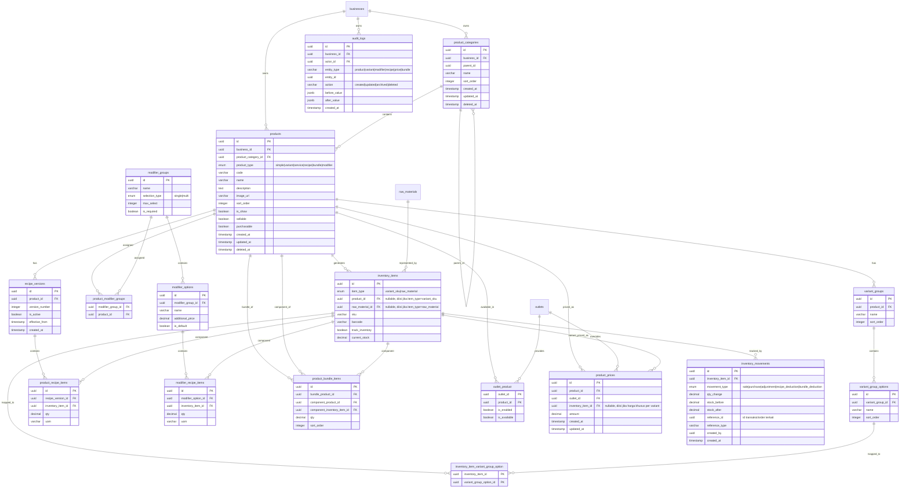

# PRD Product Management

## Overview

### Objective

Modul Product Management bertujuan untuk mengelola seluruh produk, jasa, menu, dan item yang dijual merchant pada sistem POS secara flexible untuk berbagai jenis bisnis:

- F&B
- Retail
- Service
- Hybrid business

Modul ini harus mendukung:

- Variant
- Modifier
- Recipe/BOM
- Bundle sederhana (fixed package)
- Inventory integration
- Pricing management (termasuk variant-level pricing)
- Category management
- Outlet-specific product

### Goals

- Menyediakan product architecture yang generic & scalable
- Mendukung berbagai model bisnis
- Mendukung inventory flexibility
- Mendukung variant & modifier complex
- Mendukung recipe/BOM dengan versioning untuk audit costing
- Menyediakan jejak audit (audit log & inventory movement) untuk akurasi transaksi
- Mudah digunakan merchant non-technical
- Menjadi foundation transaksi POS

### Non Goals

- Full ERP manufacturing
- Advanced procurement
- Marketplace catalog sync
- AI recommendation engine
- Composite/nested bundle & dynamic bundle promo (lihat _Future Extensibility_)

---

## Requirements

### Functional Requirements

#### Product Management

Merchant dapat:

- Membuat product
- Edit product
- Archive product
- Duplicate product
- Set outlet
- Manage pricing (base, outlet, variant)
- Manage stock behavior

#### Multi Business Type Support

**F&B**

- Menu, Modifier, Recipe, Combo/Bundle sederhana
- Kitchen routing (future)

**Retail**

- SKU, Barcode, Variant inventory
- Serial/lot support (future)

**Service**

- Non-stock item, Duration, Staff assignment

---

### Product Type Support

#### Supported Types (Current Scope)

| Product Type            | Description                                                          |
| ----------------------- | -------------------------------------------------------------------- |
| Simple Product          | Produk biasa                                                         |
| Variant Product         | Produk dengan variant                                                |
| Service Product         | Produk jasa                                                          |
| Recipe Product          | Produk berbahan baku                                                 |
| Bundle Product (Simple) | Paket fixed berisi beberapa produk tetap (harga & isi bundle statis) |

> **Klarifikasi scope Bundle**: Bundle yang dimaksud pada tabel di atas adalah _fixed bundle_ — kombinasi produk tetap dengan harga bundle tetap (mis. "Paket Hemat: 1 Burger + 1 Kentang + 1 Minuman"). Bundle dinamis/composite (isi bundle bisa dipilih pelanggan, bundle dengan pricing rule kompleks, atau bundle promo otomatis) masuk ke **Future Extensibility**, bukan current scope.

#### Variant Support

```txt
Retail:
T-Shirt
- Size: S, M, L
- Color: Red, Blue

F&B:
Coffee
- Size: Small, Medium, Large
```

Saat membuat variant, produk dapat memiliki setting harga per variant (lihat _Pricing Management_).

#### Modifier Support

```txt
Burger
+ Cheese
+ Egg
+ Extra Sauce
```

- Modifier dapat mengurangi stok bahan baku jika disambungkan dengan bahan baku tertentu
- Modifier dapat memiliki additional harga

#### Recipe / BOM Support

```txt
1 Coffee Latte
- 20gr Coffee Bean
- 150ml Milk
- 10gr Sugar
```

Saat transaksi, inventory bahan baku otomatis berkurang, dan setiap perubahan resep tercatat sebagai versi baru (lihat `recipe_versions`).

#### Bundle Support (Baru)

```txt
Paket Hemat
- 1x Burger
- 1x Kentang Goreng
- 1x Es Teh
= Harga Bundle: Rp 35.000
```

- Isi bundle bersifat fixed (ditentukan merchant saat setup)
- Saat transaksi, stok/ingredient dari masing-masing item bundle tetap terpotong sesuai resep/stok item tersebut

---

### Outlet Product Management

Merchant dapat:

- Enable/disable product per outlet
- Set outlet-specific pricing
- Set outlet-specific availability

### Inventory Integration

System mendukung:

- Stock tracked product
- Non-stock product
- Ingredient-based stock
- Variant-level stock
- Pencatatan pergerakan stok (inbound/outbound) melalui `inventory_movements`

---

## Non Functional Requirements

| Category      | Requirement                                                                   |
| ------------- | ----------------------------------------------------------------------------- |
| Scalability   | Support >100k products                                                        |
| Performance   | Product search <300ms                                                         |
| Flexibility   | Multi-business adaptable                                                      |
| Reliability   | Accurate inventory linkage, no race condition pada stock deduction concurrent |
| Extensibility | Mudah tambah product type                                                     |
| Auditability  | Semua perubahan produk/harga/resep tercatat & traceable                       |

---

## Core Feature

1. **Product CRUD** — Create, Update, Archive, Duplicate, Bulk import/export (CSV)
2. **Category Management** — Nested category, product grouping, outlet category visibility
3. **Variant Engine** — Product → Variant Group → Variant Option → Variant Combination (direpresentasikan sebagai `inventory_items` dengan `item_type = variant_sku`)
4. **Modifier Engine** — Single/multi select, required/optional, max selection, additional pricing
5. **Recipe/BOM Engine** — Ingredient usage, auto stock deduction, **recipe versioning**, waste tracking (future)
6. **Bundle Engine (Baru)** — Fixed bundle composition, bundle pricing, stock deduction per komponen bundle
7. **Pricing Management** — Base price, outlet-specific price, **variant-specific price**, modifier additional price, promo compatibility (future: promo/discount data model)
8. **Product Availability** — Outlet availability, schedule availability, temporary unavailable, seasonal menu
9. **Barcode & SKU Management** — SKU/barcode generation untuk produk & variant
10. **Inventory Ledger (Baru)** — Setiap penambahan/pengurangan stok tercatat di `inventory_movements` dengan referensi sumber transaksi
11. **Audit Logging (Baru)** — Semua event penting (create/update/archive produk, perubahan harga, perubahan resep) tercatat di `audit_logs`

---

## Product Architecture

### Core Principle

Gunakan **single flexible product entity**. Jangan pisahkan `product_fnb`, `product_retail`, `product_service` — sulit maintain.

### Product Type Driven Behavior

| product_type | Behavior               |
| ------------ | ---------------------- |
| basic        | Basic product          |
| service      | No inventory           |
| bundle       | Composite item (fixed) |

---

## User Flow

> **Catatan**: User Flow dibagi menjadi dua kategori:
>
> - **Merchant Setting Flow** — alur saat merchant mengatur/konfigurasi produk di backoffice/admin
> - **Transaction Flow** — alur saat transaksi POS berlangsung (dipicu oleh customer order)

---

### A. Merchant Setting Flows

#### A1. Main Product Creation Flow (dengan cabang kondisional)

Ini adalah flow utama pembuatan produk. Step tambahan muncul secara kondisional sesuai tipe produk yang dipilih — merchant tidak perlu melihat opsi yang tidak relevan.

```txt
┌─────────────────────────────────────────────────┐
│              MULAI: Buat Produk Baru             │
└─────────────────────────┬───────────────────────┘
                          ↓
              ┌─────────────────────┐
              │  1. Informasi Dasar │  ← Nama, Deskripsi, Gambar, Kategori, Kode Produk
              └──────────┬──────────┘
                         ↓
              ┌─────────────────────┐
              │  2. Pilih Tipe      │  ← Simple | Variant | Service | Recipe | Bundle | Modifier
              └──────────┬──────────┘
                         ↓
         ┌───────────────┼───────────────────────┐
         │               │                       │
    [Variant]       [Recipe / F&B]          [Bundle]
         ↓               ↓                       ↓
  Setup Variant    Setup Bahan Baku        Pilih Produk
  Group & Opsi     (Resep/BOM)             Komponen Bundle
  (→ Flow A2)      (→ Flow A4)             (→ Flow A5)
         │               │                       │
         └───────────────┼───────────────────────┘
                         ↓
              ┌─────────────────────┐
              │  3. Opsi Tambahan   │  ← Opsional: tambahkan Modifier Group ke produk ini
              │     (Modifier)      │     (→ Flow A3)
              └──────────┬──────────┘
                         ↓
              ┌─────────────────────┐
              │  4. Pengaturan      │  ← Set harga base, harga per outlet, harga per variant
              │     Harga           │     (→ Flow A6)
              └──────────┬──────────┘
                         ↓
              ┌─────────────────────┐
              │  5. Pengaturan      │  ← Pilih outlet yang menjual produk ini
              │     Outlet          │     Enable/disable per outlet (→ Flow A7)
              └──────────┬──────────┘
                         ↓
              ┌─────────────────────┐
              │  6. Review &        │  ← Tampilkan ringkasan semua setting
              │     Simpan          │     Konfirmasi lalu Publish
              └─────────────────────┘
```

> **UX Note**: Gunakan Progressive Form (wizard step-by-step). Step yang tidak relevan untuk tipe produk tertentu otomatis dilewati atau disembunyikan. Contoh: Service product tidak menampilkan step Setup Bahan Baku.

---

#### A2. Setup Variant Flow

Flow ini diakses saat merchant memilih tipe produk **Variant** pada step 2.

```txt
┌────────────────────────────────────────────────┐
│         SETUP VARIANT PRODUK                   │
└───────────────────────┬────────────────────────┘
                        ↓
         ┌──────────────────────────┐
         │  Tambah Variant Group    │  ← Contoh: "Ukuran", "Warna"
         │  (min. 1 group)          │     Nama group bebas diisi merchant
         └──────────┬───────────────┘
                    ↓
         ┌──────────────────────────┐
         │  Tambah Opsi per Group   │  ← Contoh: S, M, L / Merah, Biru
         │  (min. 1 opsi)           │     Klik "+ Tambah Opsi" untuk tiap nilai
         └──────────┬───────────────┘
                    ↓
         ┌──────────────────────────┐
         │  Sistem Generate         │  ← Sistem otomatis membuat kombinasi
         │  Kombinasi Variant        │     Contoh: S-Merah, S-Biru, M-Merah, M-Biru
         └──────────┬───────────────┘
                    ↓
         ┌──────────────────────────┐
         │  Set SKU & Barcode       │  ← Opsional per kombinasi, atau auto-generate
         │  per Kombinasi           │
         └──────────┬───────────────┘
                    ↓
         ┌──────────────────────────┐
         │  Set Stock per Kombinasi │  ← Apakah track inventory? Jika ya, isi stok awal
         └──────────────────────────┘
                    ↓
             Kembali ke Main Flow (Step 4: Harga)
```

> **UX Note**: Tampilkan preview tabel kombinasi secara real-time saat merchant menambahkan opsi. Merchant tidak perlu memahami konsep "inventory_item" — cukup isi nama & nilai variant.

---

#### A3. Setup Modifier Flow

Modifier adalah opsi tambahan (topping, add-on) yang dapat dilampirkan ke produk manapun. Modifier Group dapat dibuat sekali dan digunakan ulang di banyak produk.

```txt
┌────────────────────────────────────────────────┐
│         SETUP MODIFIER / OPSI TAMBAHAN         │
└───────────────────────┬────────────────────────┘
                        ↓
   [Pilih Modifier Group yang Sudah Ada]
              ATAU
   [Buat Modifier Group Baru]
         ┌──────────────────────────┐
         │  Isi Nama Group          │  ← Contoh: "Tingkat Manis", "Pilihan Topping"
         └──────────┬───────────────┘
                    ↓
         ┌──────────────────────────┐
         │  Pilih Tipe Seleksi      │  ← Single (pilih 1) atau Multi (pilih banyak)
         └──────────┬───────────────┘
                    ↓
         ┌──────────────────────────┐
         │  Atur Batas & Kewajiban  │  ← Wajib dipilih? Maks berapa pilihan?
         └──────────┬───────────────┘
                    ↓
         ┌──────────────────────────┐
         │  Tambahkan Opsi-Opsi     │  ← Nama opsi + harga tambahan (bisa Rp 0)
         │  dalam Group ini         │     Tandai opsi default jika ada
         └──────────┬───────────────┘
                    ↓
         ┌──────────────────────────┐
         │  (Opsional) Sambungkan   │  ← Untuk F&B: pilih bahan baku yang terpotong
         │  ke Bahan Baku           │     saat opsi ini dipilih di transaksi
         └──────────────────────────┘
                    ↓
             Lampirkan Group ini ke Produk
             (dari halaman produk, tab Opsi Tambahan)
```

> **UX Note**: Pisahkan halaman manajemen Modifier Group dari form produk agar modifier bisa dibuat dan dikelola secara mandiri, lalu dipasangkan ke banyak produk sekaligus.

---

#### A4. Setup Recipe / BOM Flow

Flow ini diakses saat merchant memilih tipe produk **Recipe** atau ingin menambahkan resep ke produk F&B.

```txt
┌────────────────────────────────────────────────┐
│         SETUP RESEP / BAHAN BAKU               │
└───────────────────────┬────────────────────────┘
                        ↓
         ┌──────────────────────────┐
         │  Cari & Pilih Bahan Baku │  ← Dari daftar raw material yang ada di inventory
         │  (satu per satu)         │     Ketik nama untuk cari cepat
         └──────────┬───────────────┘
                    ↓
         ┌──────────────────────────┐
         │  Isi Jumlah & Satuan     │  ← Contoh: 150 ml, 20 gr, 2 pcs
         │  per Bahan Baku          │     Satuan menyesuaikan satuan bahan baku
         └──────────┬───────────────┘
                    ↓
         ┌──────────────────────────┐
         │  Ulangi untuk setiap     │  ← Klik "+ Tambah Bahan" untuk bahan berikutnya
         │  bahan dalam resep       │
         └──────────┬───────────────┘
                    ↓
         ┌──────────────────────────┐
         │  Review Resep & Simpan   │  ← Tampilkan daftar bahan + estimasi HPP (opsional)
         └──────────────────────────┘
                    ↓
      Sistem menyimpan sebagai Versi Resep Baru
      (versi lama tetap tersimpan untuk audit costing)
```

> **UX Note**: Tampilkan ringkasan bahan baku saat ini secara jelas. Jika merchant mengubah resep yang sudah ada, tampilkan peringatan bahwa perubahan ini akan membuat versi resep baru dan tidak memengaruhi histori transaksi sebelumnya.

---

#### A5. Setup Bundle Flow

Flow ini diakses saat merchant memilih tipe produk **Bundle**.

```txt
┌────────────────────────────────────────────────┐
│         SETUP BUNDLE / PAKET                   │
└───────────────────────┬────────────────────────┘
                        ↓
         ┌──────────────────────────┐
         │  Cari & Pilih Produk     │  ← Cari dari daftar produk yang sudah ada
         │  Komponen                │     Produk simple, variant, atau recipe bisa jadi komponen
         └──────────┬───────────────┘
                    ↓
         ┌──────────────────────────┐
         │  (Jika Variant) Pilih    │  ← Jika komponen adalah produk variant,
         │  Kombinasi Variant       │     tentukan kombinasi mana yang masuk bundle
         └──────────┬───────────────┘
                    ↓
         ┌──────────────────────────┐
         │  Set Jumlah (Qty)        │  ← Berapa unit komponen ini dalam 1 bundle?
         │  per Komponen            │     Contoh: 1x Burger, 1x Kentang, 1x Minuman
         └──────────┬───────────────┘
                    ↓
         ┌──────────────────────────┐
         │  Ulangi untuk semua      │  ← Klik "+ Tambah Produk" untuk komponen berikutnya
         │  komponen bundle         │
         └──────────┬───────────────┘
                    ↓
         ┌──────────────────────────┐
         │  Review Komposisi Bundle │  ← Tampilkan daftar komponen + total harga normal
         │  & Simpan                │     vs. harga bundle (agar merchant tahu selisih diskon)
         └──────────────────────────┘
                    ↓
             Kembali ke Main Flow (Step 4: Harga Bundle)
```

> **UX Note**: Tampilkan preview "Total Harga Normal" (jumlah harga satuan semua komponen) secara otomatis, agar merchant mudah menentukan harga bundle yang kompetitif.

---

#### A6. Setup Harga (Pricing) Flow

```txt
┌────────────────────────────────────────────────┐
│         PENGATURAN HARGA                       │
└───────────────────────┬────────────────────────┘
                        ↓
         ┌──────────────────────────┐
         │  Set Harga Dasar (Base)  │  ← Harga default jika tidak ada override
         └──────────┬───────────────┘
                    ↓
              [Produk Variant?]
               Ya          Tidak
               ↓             ↓
       Set Harga per     Lanjut ke
       Kombinasi Variant  Harga Outlet
       (override harga
        dasar per SKU)
               │             │
               └──────┬──────┘
                      ↓
         ┌──────────────────────────┐
         │  (Opsional) Set Harga    │  ← Harga berbeda per outlet jika diperlukan
         │  per Outlet              │     Contoh: harga mall vs. harga non-mall
         └──────────────────────────┘
                      ↓
              Simpan semua harga
```

> **UX Note**: Gunakan tabel harga yang bisa diedit inline. Jika tidak diisi, harga outlet otomatis menggunakan harga dasar. Tampilkan indikator visual jika ada override harga di outlet tertentu.

---

#### A7. Setup Outlet Assignment Flow

```txt
┌────────────────────────────────────────────────┐
│         PENGATURAN OUTLET PRODUK               │
└───────────────────────┬────────────────────────┘
                        ↓
         ┌──────────────────────────┐
         │  Tampilkan Daftar Semua  │  ← List semua outlet yang dimiliki bisnis
         │  Outlet                  │
         └──────────┬───────────────┘
                    ↓
         ┌──────────────────────────┐
         │  Toggle Enable/Disable   │  ← Centang outlet yang menjual produk ini
         │  per Outlet              │     Default: semua outlet enabled
         └──────────┬───────────────┘
                    ↓
         ┌──────────────────────────┐
         │  (Opsional) Set Status   │  ← Tandai jika produk sementara tidak tersedia
         │  Ketersediaan            │     di outlet tertentu (is_available = false)
         └──────────────────────────┘
                    ↓
              Simpan pengaturan outlet
```

> **UX Note**: Gunakan toggle switch yang jelas. Tampilkan ringkasan "Produk ini aktif di X dari Y outlet" di bagian atas untuk orientasi cepat.

---

#### A8. Category Management Flow

```txt
┌────────────────────────────────────────────────┐
│         MANAJEMEN KATEGORI PRODUK              │
└───────────────────────┬────────────────────────┘
                        ↓
         ┌──────────────────────────┐
         │  Lihat Daftar Kategori   │  ← Tampilkan hierarki kategori (parent → child)
         │  yang Ada                │
         └──────────┬───────────────┘
                    ↓
      [Buat Baru] [Edit] [Hapus/Archive]
           ↓
  ┌─────────────────────────┐
  │  Isi Nama Kategori      │  ← Nama wajib diisi
  └──────────┬──────────────┘
             ↓
  ┌─────────────────────────┐
  │  (Opsional) Pilih       │  ← Jika ini sub-kategori, pilih parent-nya
  │  Kategori Induk         │     Contoh: "Minuman" → sub: "Kopi", "Jus"
  └──────────┬──────────────┘
             ↓
  ┌─────────────────────────┐
  │  Atur Urutan Tampil     │  ← Drag & drop atau isi angka urutan
  └──────────┬──────────────┘
             ↓
         Simpan Kategori
         (langsung aktif di form produk)
```

> **UX Note**: Tampilkan kategori dalam bentuk tree/hierarki yang bisa di-expand. Gunakan drag & drop untuk mengatur urutan.

---

#### A9. Archive & Duplicate Product Flow

```txt
┌────────────────────────────────────────────────────────┐
│  ARCHIVE PRODUK                                        │
└───────────────────────────┬────────────────────────────┘
                            ↓
  Dari Product List → Pilih Produk → Klik "Arsipkan"
                            ↓
          ┌─────────────────────────────────┐
          │  Konfirmasi: Produk diarsipkan  │  ← Peringatan: produk tidak akan
          │  dan tidak tampil di POS        │     muncul di POS setelah ini
          └────────────────┬────────────────┘
                           ↓
               Produk berpindah ke tab "Diarsipkan"
               (dapat dipulihkan kapan saja)


┌────────────────────────────────────────────────────────┐
│  DUPLICATE PRODUK                                      │
└───────────────────────────┬────────────────────────────┘
                            ↓
  Dari Product List → Pilih Produk → Klik "Duplikat"
                            ↓
          ┌─────────────────────────────────┐
          │  Sistem membuat salinan produk  │  ← Semua setting disalin:
          │  dengan nama "Salinan dari ..." │     Variant, Modifier, Resep, Harga
          └────────────────┬────────────────┘
                           ↓
               Merchant diarahkan ke form edit
               produk duplikat untuk penyesuaian
               (SKU baru di-generate otomatis)
```

> **UX Note**: Pastikan ada konfirmasi sebelum archive. Untuk duplikasi, langsung buka form edit agar merchant bisa segera menyesuaikan nama dan harga produk baru.

---

### B. Transaction Flows

_Flow ini berjalan otomatis di sisi sistem saat transaksi POS berlangsung._

#### B1. Recipe Transaction Flow

```txt
Customer Beli Produk Recipe
        ↓
Load Versi Resep Aktif (is_active = true)
        ↓
Hitung Pemakaian Bahan Baku
(qty pesanan × qty bahan per resep)
        ↓
Validasi Stok Mencukupi?
  Tidak → Tampilkan Peringatan Stok Habis
  Ya    → Kurangi Stok Bahan Baku
        ↓
Simpan ke Inventory Movement
(movement_type = recipe_deduction)
```

#### B2. Bundle Transaction Flow

```txt
Customer Beli Bundle
        ↓
Load Daftar Komponen Bundle
        ↓
Untuk setiap komponen:
  └─ Load Aturan Stok/Resep Komponen
  └─ Kurangi Stok atau Bahan Baku
  └─ Simpan Inventory Movement
     (movement_type = bundle_deduction)
        ↓
Selesai — semua movement tersimpan
```

#### B3. Variant + Modifier Selection Flow (POS)

```txt
Pilih Produk di POS
      ↓
[Produk punya Variant?]
  Ya → Tampilkan pilihan Variant → Customer pilih
  Tidak → Lanjut
      ↓
[Produk punya Modifier?]
  Ya → Tampilkan Modifier Group → Customer pilih opsi
  Tidak → Lanjut
      ↓
Hitung Harga Akhir:
  Harga Variant (atau harga dasar)
  + Total Harga Tambahan Modifier
      ↓
Masuk ke Keranjang / Transaksi
```

---

## Architecture

### High Level Architecture

```txt
Client App
    ↓
API Gateway
    ↓
Product Service
    ├── Product Core Service
    ├── Variant Engine
    ├── Modifier Engine
    ├── Recipe Engine (+ Versioning)
    ├── Bundle Engine
    ├── Pricing Engine
    ├── Inventory Integration (+ Ledger)
    ├── Category Service
    └── Audit Logging Service
    ↓
Database
```

### Suggested Architecture Pattern

Modular Monolith

### Future Split Possibility

- Product Service
- Pricing Service
- Inventory Service
- Recipe Service
- Bundle/Promo Service

---

## Important Design Decisions

### Variant vs Modifier vs Bundle

| Aspek                 | Variant                  | Modifier         | Bundle (simple)                        |
| --------------------- | ------------------------ | ---------------- | -------------------------------------- |
| SKU/barcode sendiri   | Ya                       | Tidak (opsional) | Tidak — mewarisi SKU item komponen     |
| Stock terpisah        | Ya                       | Opsional         | Tidak — deduct dari stok tiap komponen |
| Identity produk utama | Bagian dari produk utama | Addon terpisah   | Kombinasi beberapa produk utama        |
| Contoh                | T-Shirt Size M           | Extra Cheese     | Paket Hemat (Burger+Kentang+Teh)       |

### Recommended Inventory Strategy

| Business Type | Inventory Location                                       |
| ------------- | -------------------------------------------------------- |
| F&B           | ingredient/raw material                                  |
| Retail        | variant/SKU                                              |
| Service       | not required                                             |
| Bundle        | mengikuti komponen (ingredient atau SKU tergantung item) |

---

## DB Schema (Revised)



### Penjelasan Schema

Schema diorganisir per domain fungsional. Setiap tabel memiliki peran spesifik dalam ekosistem Product Management.

---

#### Domain 1: Product Core

| Tabel                | Tujuan                                                                                                                                                                                                                                                                                                    |
| -------------------- | --------------------------------------------------------------------------------------------------------------------------------------------------------------------------------------------------------------------------------------------------------------------------------------------------------- |
| `products`           | Entitas utama. Menyimpan semua jenis produk dalam satu tabel (single flexible entity). Kolom `product_type` menentukan behavior produk (simple, variant, service, recipe, bundle, modifier). Kolom `sellable` & `purchasable` membedakan apakah produk dijual ke customer atau dibeli sebagai bahan baku. |
| `product_categories` | Hierarki kategori produk. Mendukung nested category via `parent_id` self-reference. Digunakan untuk pengelompokan di POS dan filter di backoffice.                                                                                                                                                        |

**Kolom Kritis:**

- `products.product_type` — discriminator utama, menentukan tab/fitur apa yang aktif di form produk
- `products.is_show` — kontrol visibilitas di POS tanpa harus archive
- `product_categories.parent_id` — memungkinkan sub-kategori (contoh: Minuman → Kopi, Jus)

---

#### Domain 2: Variant

| Tabel                                       | Tujuan                                                                                                                                                                  |
| ------------------------------------------- | ----------------------------------------------------------------------------------------------------------------------------------------------------------------------- |
| `variant_groups`                            | Mendefinisikan dimensi/atribut variant. Contoh: "Ukuran", "Warna". Satu produk bisa punya banyak variant group.                                                         |
| `variant_group_options`                     | Nilai dari setiap variant group. Contoh: untuk group "Ukuran" → opsi: S, M, L.                                                                                          |
| `inventory_items` (item_type = variant_sku) | Merepresentasikan setiap kombinasi variant sebagai inventory unit terpisah. Menyimpan SKU, barcode, dan stok per kombinasi.                                             |
| `inventory_item_variant_group_option`       | Tabel pivot yang memetakan kombinasi variant (inventory_item) ke option-option yang membentuknya. Contoh: inventory_item SKU-S-Merah dipetakan ke opsi "S" dan "Merah". |

**Kolom Kritis:**

- `inventory_items.item_type` — discriminator: `variant_sku` untuk stok varian, `raw_material` untuk bahan baku
- `inventory_items.track_inventory` — toggle apakah stok varian ini dipantau atau tidak
- `inventory_items.current_stock` — stok aktual; diupdate melalui inventory movement, bukan langsung

**Use Case:** Merchant membuat produk Kaos dengan variant Ukuran (S,M,L) × Warna (Merah, Biru). Sistem menghasilkan 6 kombinasi inventory_item, masing-masing dengan SKU & stok sendiri.

---

#### Domain 3: Modifier

| Tabel                     | Tujuan                                                                                                                                               |
| ------------------------- | ---------------------------------------------------------------------------------------------------------------------------------------------------- |
| `modifier_groups`         | Mendefinisikan grup opsi tambahan. Contoh: "Tingkat Manis", "Pilihan Topping". Bersifat reusable — satu group bisa dipasang ke banyak produk.        |
| `modifier_options`        | Opsi individual dalam sebuah modifier group. Contoh: "Extra Sweet", "Less Sweet". Menyimpan `additional_price` dan `is_default`.                     |
| `product_modifier_groups` | Tabel pivot yang menghubungkan produk ke modifier group. Memungkinkan satu produk punya banyak modifier group, dan satu group dipakai banyak produk. |
| `modifier_recipe_items`   | Menyambungkan opsi modifier ke bahan baku. Jika customer memilih "Extra Cheese", stok keju otomatis berkurang sesuai qty yang didefinisikan di sini. |

**Kolom Kritis:**

- `modifier_groups.selection_type` — `single` (pilih 1) atau `multi` (boleh pilih banyak)
- `modifier_groups.is_required` — apakah customer wajib memilih opsi ini sebelum checkout
- `modifier_groups.max_select` — batas maksimum pilihan jika `selection_type = multi`
- `modifier_options.additional_price` — tambahan harga ke total transaksi; bisa Rp 0

**Use Case:** Produk Kopi memiliki modifier group "Suhu" (required, single: Hot/Iced) dan "Topping" (optional, multi, max 3: Keju/Krim/Coklat).

---

#### Domain 4: Recipe / BOM

| Tabel                  | Tujuan                                                                                                                                                              |
| ---------------------- | ------------------------------------------------------------------------------------------------------------------------------------------------------------------- |
| `recipe_versions`      | Menyimpan riwayat versi resep. Setiap perubahan resep membuat row baru dengan `version_number` incremental. Hanya 1 versi yang `is_active = true` pada suatu waktu. |
| `product_recipe_items` | Detail bahan baku dalam suatu versi resep. Menyimpan `inventory_item_id` (bahan baku), `qty`, dan `uom` (satuan, contoh: gr, ml).                                   |

**Kolom Kritis:**

- `recipe_versions.is_active` — hanya versi aktif yang digunakan saat transaksi
- `recipe_versions.effective_from` — timestamp kapan versi ini mulai berlaku
- `product_recipe_items.uom` — satuan unit penggunaan bahan; penting untuk konversi (contoh: resep pakai gr, stok disimpan dalam kg)

**Use Case:** Resep Coffee Latte diubah dari 20gr ke 25gr kopi. Sistem membuat `recipe_versions` baru (v2, active), sementara v1 tetap tersimpan. Transaksi lama yang sudah selesai tetap merujuk v1 untuk costing audit yang akurat.

---

#### Domain 5: Bundle

| Tabel                  | Tujuan                                                                                                                               |
| ---------------------- | ------------------------------------------------------------------------------------------------------------------------------------ |
| `product_bundle_items` | Mendefinisikan komposisi fixed bundle. Setiap row mewakili satu komponen: produk apa, variant mana (opsional), dan berapa jumlahnya. |

**Kolom Kritis:**

- `product_bundle_items.bundle_product_id` — FK ke produk bundle (parent)
- `product_bundle_items.component_product_id` — FK ke produk yang menjadi komponen
- `product_bundle_items.component_inventory_item_id` — FK ke inventory_item spesifik (jika komponen adalah produk variant, tentukan kombinasi mana)
- `product_bundle_items.qty` — jumlah unit komponen dalam 1 bundle

**Use Case:** Paket Hemat terdiri dari 1x Burger, 1x Kentang Goreng, 1x Es Teh. Saat terjual, stok/bahan baku ketiga komponen berkurang secara otomatis sesuai aturan masing-masing.

---

#### Domain 6: Pricing

| Tabel            | Tujuan                                                                                                                                                                                                 |
| ---------------- | ------------------------------------------------------------------------------------------------------------------------------------------------------------------------------------------------------ |
| `product_prices` | Menyimpan harga produk dengan 3 level: (1) harga dasar (`outlet_id = null` & `inventory_item_id = null`), (2) harga per outlet (`outlet_id` diisi), (3) harga per variant (`inventory_item_id` diisi). |

**Kolom Kritis:**

- `product_prices.outlet_id` (nullable) — jika null, berlaku sebagai harga dasar/global
- `product_prices.inventory_item_id` (nullable) — jika diisi, harga ini khusus untuk kombinasi variant tersebut
- `product_prices.amount` — nilai harga dalam mata uang bisnis

**Logika Prioritas Harga:** Saat transaksi, sistem mencari harga dengan urutan prioritas: Harga Variant Outlet > Harga Variant Global > Harga Outlet > Harga Dasar.

---

#### Domain 7: Outlet & Availability

| Tabel            | Tujuan                                                                                                                                                                                  |
| ---------------- | --------------------------------------------------------------------------------------------------------------------------------------------------------------------------------------- |
| `outlet_product` | Mengontrol apakah sebuah produk aktif dan tersedia di outlet tertentu. Memisahkan konsep "enabled" (produk dijual di outlet ini) vs. "available" (produk sedang bisa dipesan sekarang). |

**Kolom Kritis:**

- `outlet_product.is_enabled` — master switch: produk dijual di outlet ini atau tidak
- `outlet_product.is_available` — toggle operasional: produk sedang tersedia atau habis sementara

**Use Case:** Produk Es Kopi Susu aktif di semua outlet (`is_enabled = true`), tapi sementara tidak tersedia di outlet A karena bahan baku habis (`is_available = false`), tanpa perlu menonaktifkan produk secara permanen.

---

#### Domain 8: Inventory Ledger

| Tabel                 | Tujuan                                                                                                                                                                   |
| --------------------- | ------------------------------------------------------------------------------------------------------------------------------------------------------------------------ |
| `inventory_items`     | Unit stok yang dapat dilacak. Mewakili dua hal berbeda via `item_type`: stok varian produk (`variant_sku`) atau stok bahan baku (`raw_material`).                        |
| `inventory_movements` | Ledger/catatan setiap pergerakan stok. Setiap perubahan stok (baik masuk maupun keluar) menghasilkan satu row di sini. Tidak ada stok yang berubah tanpa jejak movement. |

**Kolom Kritis di `inventory_movements`:**

- `movement_type` — jenis pergerakan: `sale`, `purchase`, `adjustment`, `recipe_deduction`, `bundle_deduction`
- `qty_change` — jumlah perubahan (negatif untuk pengurangan, positif untuk penambahan)
- `stock_before` / `stock_after` — snapshot stok sebelum dan sesudah; memudahkan rekonsiliasi
- `reference_id` + `reference_type` — traceability ke sumber transaksi (order ID, purchase order ID, dll.)

**Use Case:** Saat transaksi Coffee Latte terjual, sistem membuat 3 inventory_movement: -20gr kopi, -150ml susu, -10gr gula. Jika ada selisih stok, manager bisa menelusuri setiap movement untuk menemukan penyebabnya.

---

#### Domain 9: Audit Log

| Tabel        | Tujuan                                                                                                                                                                  |
| ------------ | ----------------------------------------------------------------------------------------------------------------------------------------------------------------------- |
| `audit_logs` | Mencatat semua perubahan penting pada entitas produk. Menyimpan snapshot `before_value` dan `after_value` dalam format JSON untuk keperluan investigasi dan compliance. |

**Kolom Kritis:**

- `entity_type` — jenis entitas yang berubah: `product`, `variant`, `modifier`, `recipe`, `price`, `bundle`
- `action` — jenis aksi: `created`, `updated`, `archived`, `deleted`
- `before_value` / `after_value` — snapshot JSON state sebelum dan sesudah perubahan
- `actor_id` — user (staff/merchant) yang melakukan perubahan

**Event yang Dicatat:** Produk dibuat/diubah/diarsipkan, perubahan harga (base/outlet/variant), perubahan resep (memicu recipe version baru), perubahan komposisi bundle, perubahan modifier.

---

## Technical Notes

### Recommended Stack

- Laravel, Inertia, Redis, Vue.js, Tailwind CSS, PostgreSQL

### Important Technical Considerations

1. **Flexible Product Architecture** — Behavior-driven product model, bukan hardcode per industry.
2. **Avoid Product Duplication** — Jangan duplicate product karena beda outlet/harga/availability; gunakan `outlet_product` & `product_prices`.
3. **Recipe Versioning** — Setiap perubahan resep membuat row baru di `recipe_versions`; transaksi lama tetap merujuk versi resep saat transaksi terjadi (immutable history untuk costing audit).
4. **Concurrency pada Stock Deduction (Baru)** — Gunakan row-level locking atau optimistic locking (`version` column) pada `inventory_items.current_stock` saat proses deduction untuk mencegah race condition pada transaksi POS bersamaan.
5. **Unit of Measure Conversion (Baru)** — `product_recipe_items` dan `modifier_recipe_items` menyimpan `uom` eksplisit; perlu tabel/util konversi (mis. kg ↔ gr, liter ↔ ml) agar deduction terhadap stok bahan baku (yang mungkin disimpan dalam unit pembelian) akurat.
6. **Product Search Optimization** — Fulltext search, SKU index, barcode index.

### Security Considerations

**Required**

- Outlet isolation
- **Business-level isolation** (Baru — memastikan query selalu di-scope by `business_id`, tidak hanya `outlet_id`, mengingat banyak tabel memiliki `business_id` langsung)
- Product audit logging → direalisasikan via tabel `audit_logs`
- Inventory transaction validation → direalisasikan via tabel `inventory_movements`
- Prevent negative stock manipulation → validasi di level service sebelum insert ke `inventory_movements`

### Audit Logging

**Logged Events** (dicatat ke `audit_logs`)

- Product created/updated/archived
- Variant changed
- Modifier updated
- Recipe changed (memicu `recipe_versions` baru)
- Bundle composition changed
- Price changed (base/outlet/variant)

---

## Suggested UX

### Structure Navigation Menu

```txt
Master Produk
    ├── Kategori Produk
    ├── Produk
    ├── Opsi Tambahan
    ├── Produk Bundling
```

### Important UX Notes

1. **Simplify Variant UX** — gunakan Option Set Generator, jangan terlalu technical.
2. **Modifier UX untuk F&B** — cepat, mobile friendly, POS friendly.
3. **Bundle UX** — merchant memilih produk komponen dari daftar produk existing + set qty, sistem otomatis menghitung total stock impact.
4. **Product Templates** — sediakan template F&B menu, Retail SKU, Service item.

---

## Future Extensibility

### Planned Features

- **Composite/dynamic bundle** (isi bundle dapat dipilih pelanggan, mis. "pilih 1 dari 3 minuman")
- **Bundle promo** (bundle otomatis terbentuk berdasarkan rule promo, bukan setup manual)
- Dynamic pricing
- AI menu recommendation
- Product image AI tagging
- Nutritional info
- Supplier integration
- Multi warehouse stock
- Batch/lot tracking
- Serial number tracking
- Kitchen routing (F&B)

---

## Success Metrics

| Metric                                   | Target                                  |
| ---------------------------------------- | --------------------------------------- | -------- |
| Product Creation Success                 | >99%                                    |
| Product Search Response                  | <300ms                                  |
| Variant Accuracy                         | 100%                                    |
| Inventory Deduction Accuracy             | 100%                                    |
| POS Product Load Time                    | <1 second                               |
| Audit Log Completeness (Baru)            | 100% event tercatat                     |
| Inventory Movement Reconciliation (Baru) | 0 selisih stok tak terjelaskan per hari | \*\*\*\* |
