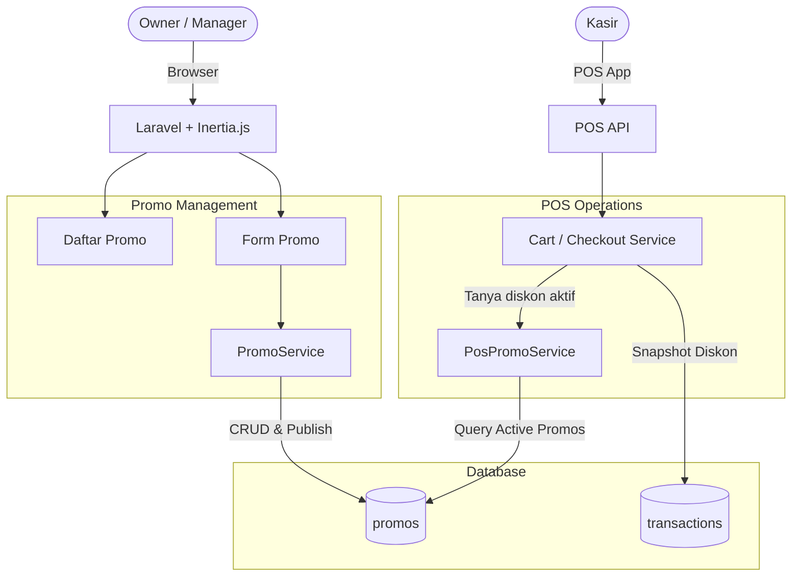
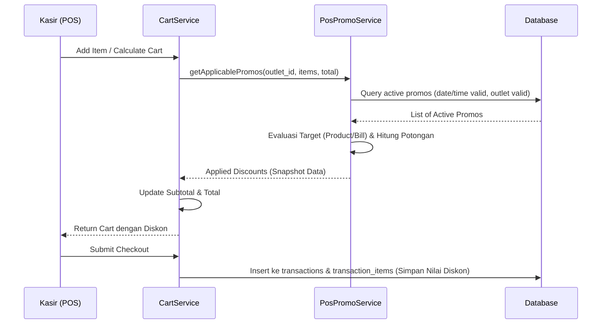
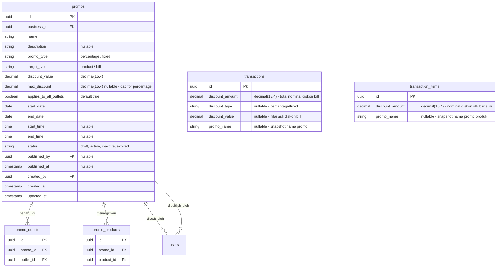

# PRD — Promo & Discount V1

## 1. Overview

Modul **Promo & Diskon (V1)** bertanggung jawab untuk mengelola seluruh skema pemotongan harga dalam operasional SaaS POS (Sollu POS). Modul ini memungkinkan bisnis untuk membuat, mengatur jadwal, dan mendistribusikan diskon secara otomatis ke seluruh atau sebagian outlet. Promo dapat dikonfigurasi dalam dua bentuk dasar: potongan persentase (%) atau potongan nominal (Rp), dan dapat ditargetkan spesifik pada produk tertentu (Per Produk) atau keseluruhan transaksi (Per Bill). Modul ini dilengkapi dengan kapabilitas penjadwalan (tanggal dan jam) serta sistem *Publishing* agar promo dapat disiapkan sebagai *Draf* sebelum diaktifkan. Saat kasir melakukan transaksi di POS, sistem akan secara otomatis mengevaluasi dan menerapkan promo yang memenuhi syarat ke dalam keranjang belanja. Untuk menjaga integritas data historis, setiap diskon yang diterapkan akan direkam sebagai *snapshot* permanen pada tingkat transaksi dan item, sehingga perubahan atau penghapusan promo di masa depan tidak akan memengaruhi laporan transaksi masa lalu.

---

## 2. Requirements

- **Promo Types (Tipe Diskon):** Sistem mendukung dua tipe diskon:
  1. **Diskon Persentase (`percentage`)** — Potongan berdasarkan persen dari harga.
  2. **Diskon Nominal (`fixed`)** — Potongan berupa nilai tetap (Rp).
- **Maximum Discount Cap:** Jika tipe promo adalah persentase, pengguna dapat mengatur `max_discount` (batas maksimal potongan dalam Rp).
- **Promo Target:**
  1. **Per Produk (`product`)** — Diskon hanya berlaku untuk produk tertentu yang dimasukkan ke keranjang. (Menggunakan tabel pivot `promo_products`).
  2. **Per Bill (`bill`)** — Diskon berlaku untuk total nominal transaksi sebelum pajak.
- **Promo Scope (Cakupan Outlet):** Promo dapat diatur agar berlaku untuk semua outlet (`applies_to_all_outlets = true`) atau hanya di outlet spesifik melalui pemilihan outlet (disimpan di `promo_outlets`).
- **Scheduling (Penjadwalan):** Setiap promo wajib memiliki `start_date` dan `end_date`. Sistem juga mendukung pengaturan jam operasional promo (`start_time` dan `end_time` opsional) yang berlaku setiap harinya dalam rentang tanggal tersebut (contoh: Happy Hour jam 14:00 - 17:00).
- **Publishing & Status:** Promo memiliki status: `Draf`, `Aktif`, `Nonaktif`, dan `Kedaluwarsa`. Promo baru dibuat sebagai Draf. Promo harus melalui proses *Publish* (membutuhkan permission khusus) untuk menjadi `Aktif`.
- **Auto-Apply di POS:** Saat item ditambahkan ke keranjang POS atau saat lanjut ke checkout, sistem (backend) akan otomatis memvalidasi promo yang aktif di outlet tersebut, mencocokkan tanggal, jam, dan target, lalu mengaplikasikan diskon terbesar/tervalid secara otomatis tanpa perlu input kode.
- **Snapshot Data (Integritas Transaksi):** Nilai diskon yang diaplikasikan ke transaksi bersifat final. Informasi diskon per item disimpan di `transaction_items.discount_amount`. Informasi diskon per bill disimpan di `transactions` (`discount_amount`, `discount_type`, `discount_value`). Tidak ada relasi *hard foreign key* dari transaksi kembali ke tabel `promos` untuk menghindari kerusakan data historis jika promo diubah.
- **Activity Logging:** Semua aktivitas (Buat, Edit, Hapus, Publish, Unpublish) dicatat melalui `ActivityLogService`.
- **Not In Scope (Phase 2):** Fitur berikut tidak termasuk dalam V1: Buy X Get Y, Minimum order amount, Voucher/Coupon code, Customer-specific promo, Combo/Bundle promo, Quantity-based discount.

---

## 3. Core Features

- **Manajemen Promo (CRUD):** Kemampuan untuk membuat, mengubah, melihat detail, dan menghapus promo berstatus *Draf*.
- **Konfigurasi Tipe & Target Promo:** Opsi pengaturan diskon persentase (dengan cap) atau nominal tetap, dengan target per item spesifik atau per total transaksi.
- **Penjadwalan & Cakupan Outlet:** Form untuk menentukan rentang tanggal, rentang waktu (opsional), serta pemilihan outlet (semua outlet atau outlet pilihan).
- **Publish & Unpublish:** Aksi untuk mengaktifkan promo (`Publish`) atau memberhentikan promo yang sedang berjalan (`Unpublish` mengubah status menjadi `Nonaktif`).
- **Daftar Promo:** Halaman tabel daftar promo dengan dukungan pencarian dan filter berdasarkan status, tipe diskon, tipe target, dan outlet.
- **Detail Promo (PopUpPage):** Tampilan komprehensif seluruh pengaturan sebuah promo termasuk daftar produk yang diikutkan (jika target per produk) dan outlet yang dituju.
- **POS Auto-Evaluation (Backend):** *Engine* yang berjalan saat kalkulasi keranjang POS untuk mendeteksi promo aktif dan otomatis memotong harga.

---

## 4. User Flow

### **Membuat Promo Baru (Draf)**
1. User masuk ke menu **Promo > Daftar Promo**.
2. Klik tombol **Buat Promo**.
3. Sistem menampilkan form PopUpPage dengan *step* atau *section*:
   - **Informasi Dasar:** Nama Promo, Deskripsi.
   - **Tipe & Target:** 
     - Target (Per Produk / Per Bill).
     - Tipe Diskon (Persentase / Nominal).
     - Nilai Diskon.
     - Batas Maksimum Diskon (Muncul jika tipe Persentase).
   - **Cakupan Produk:** (Hanya muncul jika Target = Per Produk) User memilih produk-produk apa saja yang mendapatkan diskon ini.
   - **Jadwal & Waktu:** Tanggal Mulai, Tanggal Berakhir, Jam Mulai (Opsional), Jam Selesai (Opsional).
   - **Cakupan Outlet:** Checkbox "Berlaku di Semua Outlet". Jika di-uncheck, muncul dropdown/list untuk memilih outlet tertentu.
4. User menyimpan form.
5. Sistem memvalidasi input, lalu menyimpan ke tabel `promos` (dan pivot tables) dengan status `Draf`. Menampilkan pesan sukses.

### **Mempublikasikan (Publish) Promo**
1. Di halaman daftar promo, user melihat promo berstatus `Draf`.
2. User mengklik tombol aksi **Publish**.
3. Sistem menampilkan dialog konfirmasi: "Apakah Anda yakin ingin mengaktifkan promo ini?"
4. Sistem memvalidasi (apakah tanggal berakhir belum terlewat).
5. Sistem mengupdate status promo menjadi `Aktif`, mencatat `published_by` dan `published_at`.
6. Promo kini dapat dievaluasi oleh sistem POS.

### **Menghentikan (Unpublish) Promo**
1. User mengklik aksi **Nonaktifkan** pada promo yang berstatus `Aktif`.
2. Sistem mengubah status menjadi `Nonaktif`. Promo tersebut seketika berhenti diterapkan di POS.

### **Auto-Apply Promo di POS (Background Process)**
1. Kasir di Outlet A menambahkan Produk X ke keranjang pada pukul 15:00.
2. Sistem melakukan request kalkulasi *cart*.
3. Backend memeriksa `promos` yang berstatus `Aktif`, yang cakupan outletnya mencakup Outlet A, tanggal dan jam saat ini masuk dalam rentang jadwal.
4. Jika ada promo per produk untuk Produk X, sistem menghitung `discount_amount` dan memasukkannya ke kalkulasi harga item tersebut.
5. Saat checkout, jika ada promo per bill, sistem mengevaluasi dan memotong grand total.
6. Kasir melihat harga sudah terpotong otomatis di layar POS dengan label diskon.

---

## 5. Architecture

Modul ini menggunakan pendekatan **Modular Monolith**. Proses manajemen promo terpisah dari logic operasional POS, namun backend POS (*Cart Calculator/Checkout Service*) akan bergantung pada `PosPromoService` untuk mengevaluasi promo aktif. Data promo disalin secara *snapshot* ke dalam transaksi.

### Sequence Diagram — Auto-Apply di POS

---

## 6. Database Schema

### Tabel yang Digunakan

**Tabel Baru:**
- `promos` — Tabel master data promo.
- `promo_outlets` — Tabel pivot untuk cakupan outlet.
- `promo_products` — Tabel pivot untuk target produk (jika promo spesifik per produk).

**Tabel Existing yang Dimodifikasi (Atau Dipastikan Keberadaannya):**
- `transactions` — Menyimpan rekam jejak promo level bill.
- `transaction_items` — Menyimpan rekam jejak promo level produk.

### Catatan Desain Penting

| Aspek | Detail |
|---|---|
| **Status Automation** | Status `expired` dapat diset via *cron job/scheduler* harian yang mengecek `end_date`, atau diturunkan secara on-the-fly pada logika aplikasi. Secara basis data, kita simpan status `active` namun validitas sebenarnya dievaluasi berdasarkan `start_date` dan `end_date`. |
| **Pemisahan Pivot** | Jika `target_type` = `bill`, maka tabel `promo_products` akan kosong. Jika `applies_to_all_outlets` = `true`, maka `promo_outlets` bisa diabaikan. |
| **Max Cap** | Hanya relevan jika `promo_type` = `percentage`. Jika ada, hasil hitungan persentase tidak boleh melebihi `max_discount`. |
| **Transaksi** | Menyimpan `promo_name` di transaksi untuk mempermudah laporan tanpa harus join ke tabel promo (karena promo bisa dihapus/diubah). |

---

## 7. Tech Stack

- **Frontend:** Vue 3 (Composition API `<script setup>`) + Tailwind CSS v4 + Inertia.js. Form dan Detail menggunakan `PopUpPage`. Halaman daftar dengan `Container > ContainerHeader + Table + Pagination`. Komponen form standar: `TextField`, `DropdownField`, `Select2/SearchableSelect` (untuk pilih produk/outlet).
- **Backend:** Laravel 11 (PHP 8.3).
- **Services:**
  - `PromoService` — Handle CRUD, validasi relasi, publish/unpublish logic.
  - `PosPromoService` — Handle evaluasi diskon di backend POS (Mencari promo aktif berdasarkan kombinasi waktu dan outlet, dan menghitung `discount_amount` yang dikembalikan ke Cart).
  - `ActivityLogService` — Logging standard.
- **Request Validation:**
  - `StorePromoRequest` / `UpdatePromoRequest`
    - `name`, `promo_type`, `target_type`, `discount_value`, `start_date`, `end_date` (required)
    - `max_discount` (required if `promo_type` = `percentage`)
    - `outlet_ids` (required if `applies_to_all_outlets` = `false`)
    - `product_ids` (required if `target_type` = `product`)
- **Enums (PHP):**
  - `PromoType`: `Percentage = 'percentage'`, `Fixed = 'fixed'`
  - `PromoTarget`: `Product = 'product'`, `Bill = 'bill'`
  - `PromoStatus`: `Draft = 'draft'`, `Active = 'active'`, `Inactive = 'inactive'`, `Expired = 'expired'`
- **Models:** `Promo`, `PromoOutlet`, `PromoProduct`
- **Database:** PostgreSQL. Primary Key UUID.
- **Routes:**
  - `GET /promos`
  - `POST /promos`
  - `GET /promos/{id}`
  - `PUT /promos/{id}`
  - `DELETE /promos/{id}`
  - `POST /promos/{id}/publish`
  - `POST /promos/{id}/unpublish`

---

## 8. Hak Akses (Authorization)

Menggunakan package *Spatie Laravel Permission*.

| Permission | Owner | Outlet Manager |
|---|---|---|
| `promo.*` | Ya | Tidak |
| `promo.view` | Ya | Ya |
| `promo.create` | Ya | Tidak |
| `promo.update` | Ya | Tidak |
| `promo.delete` | Ya | Tidak |
| `promo.publish` | Ya | Tidak |
| `transaction.discount` | Ya | Tidak |

**Penjelasan:**
- **Owner** memiliki kontrol penuh atas pembuatan, publikasi, dan penghapusan promo.
- **Outlet Manager** hanya dapat melihat (view) promo apa saja yang sedang aktif (terutama di outlet mereka) sebagai informasi.
- Hak untuk menerapkan diskon manual (di luar sistem promo ini) diatur oleh permission terpisah (`transaction.discount`), promo otomatis tidak terpengaruh oleh permission ini.

---

## 9. Validasi & Error Handling

| Skenario | Validasi | Pesan Error |
|---|---|---|
| Tipe diskon tidak valid | `in:percentage,fixed` | "Tipe diskon yang dipilih tidak valid." |
| Persentase > 100% | `max:100` (jika persentase) | "Diskon persentase tidak boleh lebih dari 100%." |
| Target produk tapi tidak ada produk | `required_if` | "Minimal satu produk harus dipilih untuk promo per produk." |
| Spesifik outlet tapi tidak ada outlet | `required_if` | "Minimal satu outlet harus dipilih jika tidak berlaku untuk semua." |
| Tanggal akhir sebelum tanggal mulai | `after_or_equal:start_date` | "Tanggal berakhir tidak boleh sebelum tanggal mulai." |
| Edit promo aktif | Logic Check di Controller | "Promo yang sudah aktif tidak dapat diubah. Nonaktifkan terlebih dahulu." |
| Hapus promo aktif | Logic Check di Controller | "Promo yang sudah aktif tidak dapat dihapus." |
| Waktu mulai / selesai parsial | `required_with` | "Jam mulai dan jam selesai harus diisi keduanya jika ingin menggunakan jadwal waktu." |

---

## 10. UI Components Reference

### Halaman Daftar Promo

**Header:** "Daftar Promo" dengan tombol **Buat Promo** (btn-main).

**Kolom Tabel:**

| Kolom | Sumber Data | Keterangan |
|---|---|---|
| Nama Promo | `promos.name` | Teks utama |
| Target | `promos.target_type` | Badge: Per Produk, Per Bill |
| Tipe & Nilai | `promo_type` & `discount_value` | Contoh: "10% (Max Rp 50.000)" atau "Rp 20.000" |
| Periode | `start_date` - `end_date` | Format: 01 Agu - 31 Agu 2026 |
| Status | `promos.status` | Badge: Draf (Abu), Aktif (Hijau), Nonaktif (Kuning), Kedaluwarsa (Merah) |
| Aksi | - | Kebab menu: Detail, Edit, Publish/Nonaktifkan, Hapus |

### Form Promo (PopUpPage)

**Field Form:**

| Field | Tipe Komponen | Wajib | Keterangan |
|---|---|---|---|
| Nama Promo | TextField | Ya | - |
| Deskripsi | TextareaField | Tidak | - |
| Target Diskon | DropdownField | Ya | Pilihan: Per Produk, Per Bill |
| Tipe Diskon | DropdownField | Ya | Pilihan: Persentase (%), Nominal Tetap (Rp) |
| Nilai Diskon | TextField (Number) | Ya | Nilai potongan |
| Batas Maks. Diskon | TextField (Number) | Ya* | Muncul jika Tipe Diskon = Persentase |
| Berlaku untuk Produk | Select2 (Multiple) | Ya* | Muncul jika Target = Per Produk |
| Tanggal Mulai | TextField (Date) | Ya | - |
| Tanggal Berakhir | TextField (Date) | Ya | - |
| Jam Operasional | Time Range Pick | Tidak | Input: Jam Mulai & Jam Selesai |
| Cakupan Outlet | Checkbox + Select | Ya | Checkbox: "Berlaku di semua outlet". Jika false, tampil Select Multiple Outlet |

### Detail Promo (PopUpPage)

Menampilkan data konfigurasi di atas dalam format read-only (tabel ringkasan). Terdapat tombol aksi di bagian bawah berdasarkan status saat ini:
- Jika `Draf`: **Edit**, **Publish** (btn-main)
- Jika `Aktif`: **Nonaktifkan** (btn-warning)
- Jika `Nonaktif`: **Publish** (btn-main)

### Mapping Label Bahasa Indonesia

**Target Tipe:**
- `product`: Per Produk
- `bill`: Per Bill

**Tipe Promo:**
- `percentage`: Persentase
- `fixed`: Nominal Tetap

**Status:**
- `draft`: Draf
- `active`: Aktif
- `inactive`: Nonaktif
- `expired`: Kedaluwarsa
