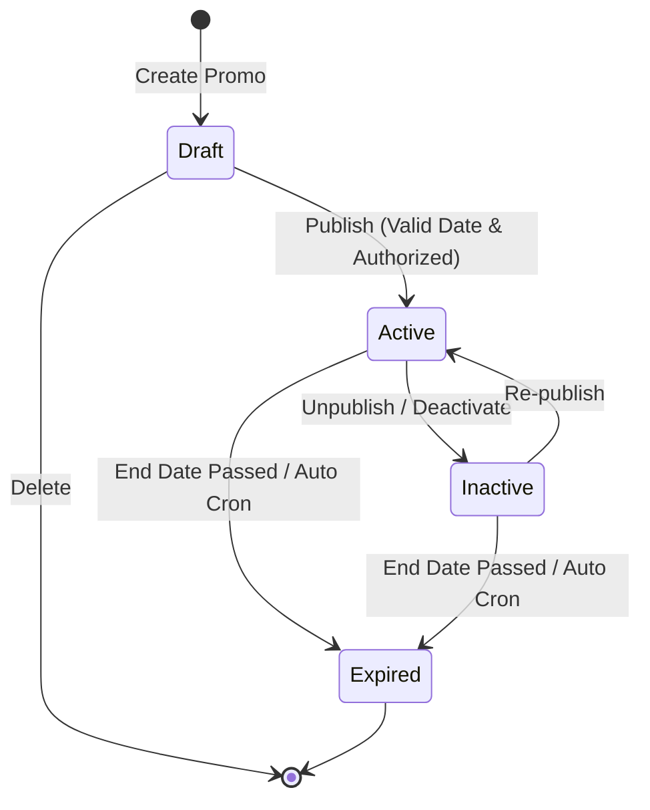
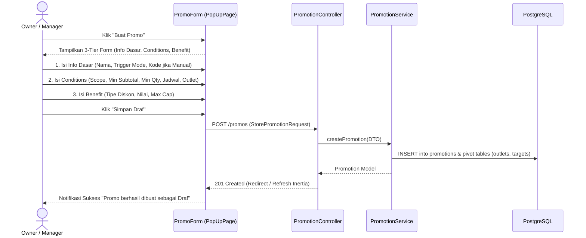
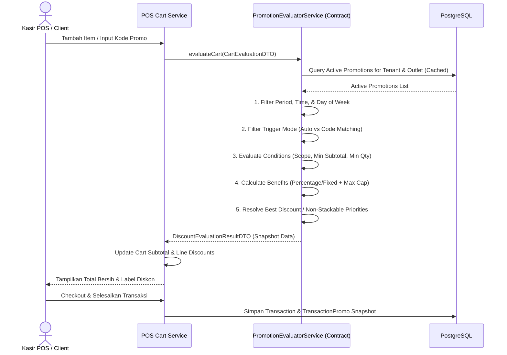
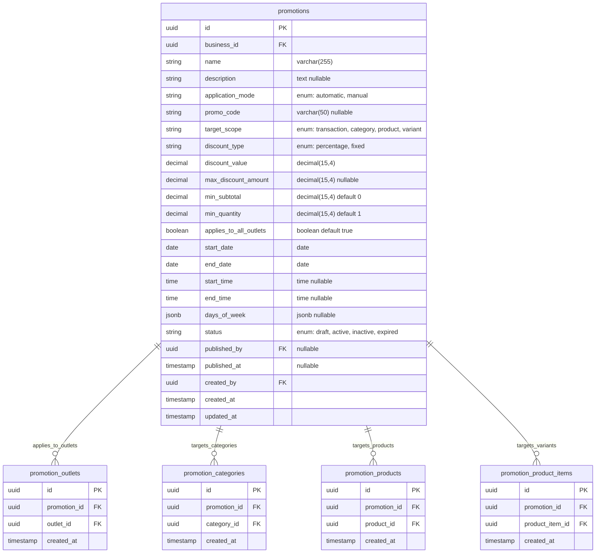

# PRD — Modul Promo & Diskon V1

## 1. Executive Summary & Bounded Context

Modul **Promo & Diskon (V1)** adalah _Bounded Context_ independen dalam ekosistem **Sollu App** yang bertanggung jawab untuk mendefinisikan, mengelola, dan mengevaluasi seluruh skema potongan harga secara fleksibel, terukur, dan aman. Modul ini dirancang agar dapat melayani berbagai saluran penjualan (_Point of Sale_, B2B Sales, hingga integrasi pihak ketiga) tanpa menciptakan keterikatan (_tight coupling_) langsung terhadap logika transaksi atau tabel operasional penjualan.

### Kapabilitas Utama V1:

1. **Arsitektur Promotion Rules (Conditions & Benefits)**: Pemisahan tegas antara kriteria kelayakan (_Conditions_) dan mekanisme imbalan (_Benefit_).
2. **Dual Mode Trigger**:
    - **Otomatis (`automatic`)**: Langsung terdeteksi dan teraplikasikan di keranjang belanja (_Cart_) saat seluruh kondisi terpenuhi.
    - **Manual (`manual`)**: Memerlukan input kode kupon/promo (`promo_code`) oleh kasir atau pelanggan.
3. **Cakupan Target Fleksibel**:
    - **Diskon Transaksi (Cart-level)**: Potongan untuk keseluruhan nilai transaksi (dengan opsi minimal belanja atau tanpa minimal belanja).
    - **Diskon Kategori**: Potongan untuk kelompok kategori produk tertentu.
    - **Diskon Produk**: Potongan untuk produk master spesifik.
    - **Diskon Varian (Product Item/SKU)**: Potongan spesifik pada level varian produk tertentu.
4. **Quantity Discount (Diskon Kuantitas / Grosir)**: Penentuan batas minimal kuantitas (_Minimum Quantity_) untuk memicu potongan harga.
5. **Penjadwalan Multidimensi**: Pengaturan tanggal mulai-selesai, jam operasional harian (_Happy Hour_), dan hari berlaku dalam seminggu.
6. **Multi-Outlet Scoping**: Berlaku universal ke seluruh outlet bisnis atau dibatasi pada outlet-outlet tertentu.
7. **Zero Cross-Module Mutation & Snapshot Integrity**: Nilai potongan promo dievaluasi secara murni (_pure calculation engine_) dan disimpan sebagai _snapshot_ permanen di modul transaksi tanpa relasi _hard foreign key_ yang merusak integritas data historis.

---

## 2. Promotion Rules Architecture

Pondasi modul Promo V1 mengadopsi struktur aturan berbasis **Conditions & Benefit**:

```
Promotion
│
├── Identity & Trigger
│   ├── Application Mode (Automatic vs Manual / Code)
│   ├── Promo Code (Wajib jika Manual)
│   └── Status (Draft, Active, Inactive, Expired)
│
├── Conditions (Kriteria Syarat Kelayakan)
│   ├── 1. Minimum Subtotal (Rp) ──── [Syarat min. nominal belanja (0 = Tanpa Minimum)]
│   ├── 2. Minimum Quantity (Qty) ─── [Syarat min. kuantitas barang (1 = Standar / >1 = Qty Discount)]
│   ├── 3. Target Scope ───────────── [Transaction, Category, Product, Variant]
│   ├── 4. Outlet Scope ───────────── [Semua Outlet vs Multi-Outlet Tertentu]
│   └── 5. Period & Time Scope ────── [Rentang Tanggal, Jam Operasional, Hari Berlaku]
│
└── Benefit (Imbalan Potongan Diskon)
    ├── Discount Type ─────────────── [Percentage (%) vs Fixed Amount (Rp)]
    ├── Discount Value ────────────── [Nilai persentase atau nominal rupiah]
    ├── Max Discount Cap ──────────── [Batas maksimal potongan Rp (opsional untuk %)]
    └── Allocation Level ──────────── [Transaction / Cart-Level vs Item / Line-Level]
```

### Aturan Evaluasi (Evaluation Rules Matrix):

- **AND Operator Antar-Kondisi**: Suatu promo dinyatakan **VALID** hanya jika **seluruh kriteria aktif terpenuhi sekaligus** (Outlet Cocok **AND** Periode/Waktu Cocok **AND** Target Cocok **AND** Min Subtotal Terpenuhi **AND** Min Quantity Terpenuhi).
- **OR Operator Antar-Item dalam Target**: Jika target berupa multi-produk atau multi-varian, pemenuhan salah satu produk yang terdaftar memenuhi kriteria target produk.

---

## 3. Core Features & Use Cases

### 3.1. Fitur Utama

| Fitur                         | Deskripsi                                                                                                                                     |
| :---------------------------- | :-------------------------------------------------------------------------------------------------------------------------------------------- |
| **Manajemen Promo (CRUD)**    | Pembuatan draf promo baru, perubahan konfigurasi, pratinjau detail, dan penghapusan promo berstatus draf.                                     |
| **Promotion Rules Builder**   | Antarmuka interaktif 3-Tier untuk merancang kombinasi _Conditions_ dan _Benefit_ secara deklaratif.                                           |
| **Dual Trigger Engine**       | Dukungan evaluasi otomatis pada keranjang belanja dan validasi kode promo manual (_Coupon Code_).                                             |
| **Lifecycle & Publishing**    | Sistem transisi status (`Draft` $\rightarrow$ `Active` $\rightarrow$ `Inactive` / `Expired`) dengan validasi kesiapan data dan hak otorisasi. |
| **Public Evaluation Service** | Service contract publik berkecepatan tinggi berbasis in-memory evaluation untuk melayani POS dan Sales module.                                |
| **Activity Logging**          | Pencatatan otomatis setiap aksi create, update, delete, publish, dan deactivate melalui `ActivityLogService`.                                 |

### 3.2. Skenario Bisnis V1 (Use Cases)

```
┌────────────────────────────────────────────────────────────────────────────────────────────────────────┐
│ Skenario Bisnis V1                                                                                     │
├──────────────────────────────┬──────────────────────────────┬──────────────────────────────────────────┤
│ Use Case                     │ Setup Conditions             │ Setup Benefit                            │
├──────────────────────────────┼──────────────────────────────┼──────────────────────────────────────────┤
│ 1. Diskon Belanja Tanpa Min. │ Target: Transaction          │ Type: Percentage (10%)                   │
│                              │ Min Subtotal: Rp 0           │ Max Cap: Rp 20.000                       │
│                              │ Min Qty: 1                   │ Mode: Automatic                          │
├──────────────────────────────┼──────────────────────────────┼──────────────────────────────────────────┤
│ 2. Diskon Belanja Min. Total │ Target: Transaction          │ Type: Fixed Amount (Rp 25.000)           │
│                              │ Min Subtotal: Rp 150.000     │ Mode: Automatic                          │
│                              │ Min Qty: 1                   │                                          │
├──────────────────────────────┼──────────────────────────────┼──────────────────────────────────────────┤
│ 3. Diskon Kategori Makanan   │ Target: Category (Food)      │ Type: Percentage (15%)                   │
│                              │ Min Subtotal: Rp 0           │ Max Cap: Unlimited                       │
│                              │ Min Qty: 1                   │ Mode: Automatic                          │
├──────────────────────────────┼──────────────────────────────┼──────────────────────────────────────────┤
│ 4. Diskon Product /          │ Target: Product / Variant    │ Type: Fixed Amount (Rp 5.000 / item)     │
│    Varian Tertentu           │ Min Subtotal: Rp 0           │ Mode: Automatic                          │
│                              │ Min Qty: 1                   │                                          │
├──────────────────────────────┼──────────────────────────────┼──────────────────────────────────────────┤
│ 5. Diskon Qty / Grosir       │ Target: Product / Variant    │ Type: Percentage (20%)                   │
│                              │ Min Qty: 5 pcs               │ Mode: Automatic                          │
│                              │ Min Subtotal: Rp 0           │                                          │
├──────────────────────────────┼──────────────────────────────┼──────────────────────────────────────────┤
│ 6. Voucher Promo Manual      │ Target: Transaction          │ Type: Fixed Amount (Rp 50.000)           │
│                              │ Min Subtotal: Rp 200.000     │ Mode: Manual (Code: "HEMAT50")           │
├──────────────────────────────┼──────────────────────────────┼──────────────────────────────────────────┤
│ 7. Happy Hour Siang          │ Target: All / Category       │ Type: Percentage (30%)                   │
│                              │ Time: 14:00 - 17:00          │ Mode: Automatic                          │
│                              │ Days: [Senin, Selasa, Rabu]  │                                          │
└──────────────────────────────┴──────────────────────────────┴──────────────────────────────────────────┘
```

---

## 4. User Flow & Status Lifecycle

### 4.1. Lifecycle Status Promo


```mermaid
stateDiagram-v2
    [*] --> Draft : Create Promo
    Draft --> Active : Publish (Valid Date & Authorized)
    Draft --> [*] : Delete
    Active --> Inactive : Unpublish / Deactivate
    Inactive --> Active : Re-publish
    Active --> Expired : End Date Passed / Auto Cron
    Inactive --> Expired : End Date Passed / Auto Cron
    Expired --> [*]
```

- **Draf (`draft`)**: Promo baru dibuat. Dapat diedit sepenuhnya dan dihapus. Tidak dievaluasi oleh engine POS.
- **Aktif (`active`)**: Promo telah dipublikasikan dan berada dalam rentang jadwal. Engine transaksi akan mengevaluasi promo ini.
- **Nonaktif (`inactive`)**: Promo diberhentikan sementara oleh pengelola. Engine transaksi mengabaikan promo ini.
- **Kedaluwarsa (`expired`)**: Tanggal akhir promo telah terlampaui. Status dapat di-update melalui scheduler harian atau terdeteksi dinamis saat evaluasi.

---

### 4.2. Alur Pembuatan Promo (PopUpPage 3-Tier Form)


```mermaid
sequenceDiagram
    actor Owner as Owner / Manager
    participant UI as PromoForm (PopUpPage)
    participant Ctrl as PromotionController
    participant Svc as PromotionService
    participant DB as PostgreSQL

    Owner->>UI: Klik "Buat Promo"
    UI-->>Owner: Tampilkan 3-Tier Form (Info Dasar, Conditions, Benefit)

    Owner->>UI: 1. Isi Info Dasar (Nama, Trigger Mode, Kode jika Manual)
    Owner->>UI: 2. Isi Conditions (Scope, Min Subtotal, Min Qty, Jadwal, Outlet)
    Owner->>UI: 3. Isi Benefit (Tipe Diskon, Nilai, Max Cap)
    Owner->>UI: Klik "Simpan Draf"

    UI->>Ctrl: POST /promos (StorePromotionRequest)
    Ctrl->>Svc: createPromotion(DTO)
    Svc->>DB: INSERT into promotions & pivot tables (outlets, targets)
    Svc-->>Ctrl: Promotion Model
    Ctrl-->>UI: 201 Created (Redirect / Refresh Inertia)
    UI-->>Owner: Notifikasi Sukses "Promo berhasil dibuat sebagai Draf"
```

---

### 4.3. Alur Evaluasi Promo di Keranjang Belanja (POS / Channel)


```mermaid
sequenceDiagram
    actor Cashier as Kasir POS / Client
    participant PosCart as POS Cart Service
    participant Engine as PromotionEvaluatorService (Contract)
    participant DB as PostgreSQL

    Cashier->>PosCart: Tambah Item / Input Kode Promo
    PosCart->>Engine: evaluateCart(CartEvaluationDTO)

    Engine->>DB: Query Active Promotions for Tenant & Outlet (Cached)
    DB-->>Engine: Active Promotions List

    Engine->>Engine: 1. Filter Period, Time, & Day of Week
    Engine->>Engine: 2. Filter Trigger Mode (Auto vs Code Matching)
    Engine->>Engine: 3. Evaluate Conditions (Scope, Min Subtotal, Min Qty)
    Engine->>Engine: 4. Calculate Benefits (Percentage/Fixed + Max Cap)
    Engine->>Engine: 5. Resolve Best Discount / Non-Stackable Priorities

    Engine-->>PosCart: DiscountEvaluationResultDTO (Snapshot Data)
    PosCart->>PosCart: Update Cart Subtotal & Line Discounts
    PosCart-->>Cashier: Tampilkan Total Bersih & Label Diskon

    Cashier->>PosCart: Checkout & Selesaikan Transaksi
    PosCart->>DB: Simpan Transaction & TransactionPromo Snapshot
```

---

## 5. Technical Architecture & Module Decoupling

Untuk menjaga modul Promo tetap independen (_Modular Monolith_), struktur folder dan dependensi diatur secara ketat.

```
app/
├── Http/
│   ├── Controllers/App/Promotion/
│   │   └── PromotionController.php
│   └── Requests/App/Promotion/
│       ├── StorePromotionRequest.php
│       ├── UpdatePromotionRequest.php
│       └── EvaluatePromotionRequest.php
├── Models/Promotion/
│   ├── Promotion.php
│   ├── PromotionOutlet.php
│   ├── PromotionCategory.php
│   ├── PromotionProduct.php
│   └── PromotionProductItem.php
├── Services/App/Promotion/
│   ├── PromotionService.php             # CRUD & Status Management
│   ├── PromotionEvaluatorService.php    # Pure Evaluation Engine
│   └── Contracts/
│       └── PromotionEvaluatorInterface.php
├── DTOs/Promotion/
│   ├── CartEvaluationDTO.php
│   ├── CartItemDTO.php
│   ├── AppliedPromotionDTO.php
│   └── DiscountEvaluationResultDTO.php
└── Enums/
    ├── PromotionStatus.php
    ├── PromotionApplicationMode.php
    ├── PromotionTargetScope.php
    └── PromotionDiscountType.php
```

### Public Service Contract (DTO Interface)

Modul Sales atau POS berkomunikasi secara murni melalui DTO primitif:

```php
namespace App\Services\App\Promotion\Contracts;

use App\DTOs\Promotion\CartEvaluationDTO;
use App\DTOs\Promotion\DiscountEvaluationResultDTO;

interface PromotionEvaluatorInterface
{
    /**
     * Mengevaluasi seluruh promo aktif terhadap keranjang belanja tanpa mutasi database.
     */
    public function evaluate(CartEvaluationDTO $cart): DiscountEvaluationResultDTO;
}
```

---

## 6. Database Schema & Data Integrity

### 6.1. Entity Relationship Diagram (PostgreSQL)


```mermaid
erDiagram
    promotions {
        uuid id PK
        uuid business_id FK
        string name "varchar(255)"
        string description "text nullable"
        string application_mode "enum: automatic, manual"
        string promo_code "varchar(50) nullable"
        string target_scope "enum: transaction, category, product, variant"
        string discount_type "enum: percentage, fixed"
        decimal discount_value "decimal(15,4)"
        decimal max_discount_amount "decimal(15,4) nullable"
        decimal min_subtotal "decimal(15,4) default 0"
        decimal min_quantity "decimal(15,4) default 1"
        boolean applies_to_all_outlets "boolean default true"
        date start_date "date"
        date end_date "date"
        time start_time "time nullable"
        time end_time "time nullable"
        jsonb days_of_week "jsonb nullable"
        string status "enum: draft, active, inactive, expired"
        uuid published_by FK "nullable"
        timestamp published_at "nullable"
        uuid created_by FK
        timestamp created_at
        timestamp updated_at
    }

    promotion_outlets {
        uuid id PK
        uuid promotion_id FK
        uuid outlet_id FK
        timestamp created_at
    }

    promotion_categories {
        uuid id PK
        uuid promotion_id FK
        uuid category_id FK
        timestamp created_at
    }

    promotion_products {
        uuid id PK
        uuid promotion_id FK
        uuid product_id FK
        timestamp created_at
    }

    promotion_product_items {
        uuid id PK
        uuid promotion_id FK
        uuid product_item_id FK
        timestamp created_at
    }

    promotions ||--o{ promotion_outlets : applies_to_outlets
    promotions ||--o{ promotion_categories : targets_categories
    promotions ||--o{ promotion_products : targets_products
    promotions ||--o{ promotion_product_items : targets_variants
```

---

### 6.2. Kamus Data (Data Dictionary)

#### Tabel `promotions`

| Nama Kolom               | Tipe Data     | Nullable | Default             | Keterangan                                               |
| :----------------------- | :------------ | :------- | :------------------ | :------------------------------------------------------- |
| `id`                     | UUID          | No       | `gen_random_uuid()` | Primary Key.                                             |
| `business_id`            | UUID          | No       | -                   | Foreign Key ke `businesses.id` (Tenant Scoping).         |
| `name`                   | VARCHAR(255)  | No       | -                   | Nama promo (contoh: "Diskon Kopi Merdeka 20%").          |
| `description`            | TEXT          | Yes      | `NULL`              | Deskripsi atau syarat & ketentuan promo.                 |
| `application_mode`       | VARCHAR(20)   | No       | `'automatic'`       | Enum: `automatic`, `manual`.                             |
| `promo_code`             | VARCHAR(50)   | Yes      | `NULL`              | Kode voucher unik per bisnis (wajib jika `manual`).      |
| `target_scope`           | VARCHAR(20)   | No       | `'transaction'`     | Enum: `transaction`, `category`, `product`, `variant`.   |
| `discount_type`          | VARCHAR(20)   | No       | `'percentage'`      | Enum: `percentage`, `fixed`.                             |
| `discount_value`         | DECIMAL(15,4) | No       | `0.0000`            | Nilai potongan (% atau Rp).                              |
| `max_discount_amount`    | DECIMAL(15,4) | Yes      | `NULL`              | Batas maksimum potongan Rp (jika tipe persentase).       |
| `min_subtotal`           | DECIMAL(15,4) | No       | `0.0000`            | Syarat min. subtotal keranjang/item yang cocok.          |
| `min_quantity`           | DECIMAL(15,4) | No       | `1.0000`            | Syarat min. kuantitas barang untuk Qty Discount.         |
| `applies_to_all_outlets` | BOOLEAN       | No       | `TRUE`              | `true` jika berlaku di semua outlet tenant.              |
| `start_date`             | DATE          | No       | -                   | Tanggal mulai berlaku promo.                             |
| `end_date`               | DATE          | No       | -                   | Tanggal akhir berlaku promo.                             |
| `start_time`             | TIME          | Yes      | `NULL`              | Jam mulai operasional harian (_Happy Hour_).             |
| `end_time`               | TIME          | Yes      | `NULL`              | Jam selesai operasional harian (_Happy Hour_).           |
| `days_of_week`           | JSONB         | Yes      | `NULL`              | Array integer hari berlaku (`[1,2,3,4,5,6,7]`, 1=Senin). |
| `status`                 | VARCHAR(20)   | No       | `'draft'`           | Enum: `draft`, `active`, `inactive`, `expired`.          |
| `published_by`           | UUID          | Yes      | `NULL`              | User ID yang melakukan publikasi.                        |
| `published_at`           | TIMESTAMP     | Yes      | `NULL`              | Waktu publikasi.                                         |
| `created_by`             | UUID          | No       | -                   | User ID pembuat promo.                                   |
| `created_at`             | TIMESTAMP     | No       | `now()`             | Waktu pembuatan baris.                                   |
| `updated_at`             | TIMESTAMP     | No       | `now()`             | Waktu modifikasi terakhir.                               |

#### Tabel Pivot Target & Scope

1. **`promotion_outlets`**: Relasi ke `outlets.id` saat `applies_to_all_outlets = false`.
2. **`promotion_categories`**: Relasi ke `product_categories.id` saat `target_scope = category`.
3. **`promotion_products`**: Relasi ke `products.id` saat `target_scope = product`.
4. **`promotion_product_items`**: Relasi ke `product_items.id` saat `target_scope = variant`.

---

### 6.3. Snapshot Data Strategy (Modul Transaksi)

Untuk memastikan riwayat penjualan tetap akurat saat promo diubah atau dihapus di masa mendatang:

- Modul penjualan mencatat hasil evaluasi promo ke tabel `transaction_promos` (`transaction_id`, `promo_id`, `promo_name`, `promo_code`, `discount_type`, `discount_value`, `discount_amount`).
- Diskon per baris item dicatat langsung pada `transaction_items.discount_amount` dan `transaction_items.promo_name`.
- Modul penjualan **tidak mengunci foreign key cascade delete** ke tabel `promotions`.

---

## 7. Single Source of Truth: PHP Enums

Seluruh status dan opsi tipe wajib terpusat pada PHP Enums (`app/Enums/`) dan dibagikan ke frontend Vue melalui Inertia `$enums`:

### 7.1. `PromotionStatus`

```php
namespace App\Enums;

enum PromotionStatus: string
{
    case Draft = 'draft';
    case Active = 'active';
    case Inactive = 'inactive';
    case Expired = 'expired';

    public function label(): string
    {
        return match ($this) {
            self::Draft => 'Draf',
            self::Active => 'Aktif',
            self::Inactive => 'Nonaktif',
            self::Expired => 'Kedaluwarsa',
        };
    }

    public function color(): string
    {
        return match ($this) {
            self::Draft => 'neutral',
            self::Active => 'success',
            self::Inactive => 'warning',
            self::Expired => 'danger',
        };
    }
}
```

### 7.2. `PromotionApplicationMode`

```php
namespace App\Enums;

enum PromotionApplicationMode: string
{
    case Automatic = 'automatic';
    case Manual = 'manual';

    public function label(): string
    {
        return match ($this) {
            self::Automatic => 'Otomatis',
            self::Manual => 'Kode Promo (Manual)',
        };
    }
}
```

### 7.3. `PromotionTargetScope`

```php
namespace App\Enums;

enum PromotionTargetScope: string
{
    case Transaction = 'transaction';
    case Category = 'category';
    case Product = 'product';
    case Variant = 'variant';

    public function label(): string
    {
        return match ($this) {
            self::Transaction => 'Seluruh Transaksi',
            self::Category => 'Kategori Produk',
            self::Product => 'Produk Spesifik',
            self::Variant => 'Varian Produk (SKU)',
        };
    }
}
```

### 7.4. `PromotionDiscountType`

```php
namespace App\Enums;

enum PromotionDiscountType: string
{
    case Percentage = 'percentage';
    case Fixed = 'fixed';

    public function label(): string
    {
        return match ($this) {
            self::Percentage => 'Persentase (%)',
            self::Fixed => 'Nominal Tetap (Rp)',
        };
    }
}
```

---

## 8. Dual-Layer Authorization & Permissions

Mengikuti **Rule 03**: Dual-Layer Authorization memisahkan kewenangan fitur paket langganan bisnis (_Tenant Plan_) dan hak akses pengguna (_User RBAC_).

```
┌────────────────────────────────────────────────────────────────────────┐
│ Dual-Layer Authorization                                               │
├─────────────────────┬───────────────────┬──────────────────────────────┤
│ Dimensi             │ User RBAC         │ Tenant SaaS Feature Plan     │
├─────────────────────┼───────────────────┼──────────────────────────────┤
│ Entitas             │ User / Employee   │ Business / Tenant            │
│ Source of Truth     │ PermissionEnum    │ FeatureEnum::PROMOTION       │
│ Logika Tampilan     │ Sembunyikan (Hide)│ FeatureLock Overlay / Upsell │
│ Directive Frontend  │ v-can             │ v-feature                    │
│ Middleware Backend  │ permission:...    │ plan.feature:promotion       │
└─────────────────────┴───────────────────┴──────────────────────────────┘
```

### Matriks Otorisasi RBAC

| Permission          | Owner | Outlet Manager | Kasir | Keterangan                                 |
| :------------------ | :---: | :------------: | :---: | :----------------------------------------- |
| `promotion.view`    |  Ya   |       Ya       | Tidak | Melihat daftar & detail konfigurasi promo. |
| `promotion.create`  |  Ya   |     Tidak      | Tidak | Membuat draf promo baru.                   |
| `promotion.update`  |  Ya   |     Tidak      | Tidak | Mengubah promo berstatus draf/nonaktif.    |
| `promotion.delete`  |  Ya   |     Tidak      | Tidak | Menghapus promo berstatus draf.            |
| `promotion.publish` |  Ya   |     Tidak      | Tidak | Mempublikasikan atau menonaktifkan promo.  |

---

## 9. Validasi & Error Handling

### 9.1. Aturan Validasi Request (`StorePromotionRequest` / `UpdatePromotionRequest`)

| Field                    | Aturan Validasi                           | Pesan Error Kustom                       |
| :----------------------- | :---------------------------------------- | :--------------------------------------- |
| `name`                   | `required                                 | string                                   | max:255`                              | "Nama promo wajib diisi."                                                                                |
| `application_mode`       | `required                                 | in:automatic,manual`                     | "Mode aplikasi promo tidak valid."    |
| `promo_code`             | `required_if:application_mode,manual      | nullable                                 | string                                | max:50                                                                                                   | alpha_dash`                            | "Kode promo wajib diisi jika mode manual dan hanya boleh huruf, angka, strip, dan underscore." |
| `target_scope`           | `required                                 | in:transaction,category,product,variant` | "Cakupan target promo tidak valid."   |
| `discount_type`          | `required                                 | in:percentage,fixed`                     | "Tipe diskon tidak valid."            |
| `discount_value`         | `required                                 | numeric                                  | min:0.01`+`max:100` (jika persentase) | "Nilai diskon persentase harus antara 0.01% hingga 100%." / "Nilai potongan nominal harus lebih dari 0." |
| `max_discount_amount`    | `nullable                                 | numeric                                  | min:1`                                | "Batas maksimum diskon harus berupa nominal positif."                                                    |
| `min_subtotal`           | `nullable                                 | numeric                                  | min:0`                                | "Minimal subtotal tidak boleh bernilai negatif."                                                         |
| `min_quantity`           | `nullable                                 | numeric                                  | min:1`                                | "Minimal kuantitas barang minimal 1."                                                                    |
| `applies_to_all_outlets` | `required                                 | boolean`                                 | "Cakupan outlet wajib ditentukan."    |
| `outlet_ids`             | `required_if:applies_to_all_outlets,false | array                                    | min:1`                                | "Pilih minimal satu outlet jika promo tidak berlaku di semua outlet."                                    |
| `category_ids`           | `required_if:target_scope,category        | array                                    | min:1`                                | "Pilih minimal satu kategori produk untuk target kategori."                                              |
| `product_ids`            | `required_if:target_scope,product         | array                                    | min:1`                                | "Pilih minimal satu produk untuk target produk spesifik."                                                |
| `product_item_ids`       | `required_if:target_scope,variant         | array                                    | min:1`                                | "Pilih minimal satu varian produk untuk target varian."                                                  |
| `start_date`             | `required                                 | date`                                    | "Tanggal mulai wajib diisi."          |
| `end_date`               | `required                                 | date                                     | after_or_equal:start_date`            | "Tanggal berakhir tidak boleh mendahului tanggal mulai."                                                 |
| `start_time`             | `nullable                                 | date_format:H:i                          | required_with:end_time`               | "Jam mulai wajib diisi jika jam selesai ditentukan."                                                     |
| `end_time`               | `nullable                                 | date_format:H:i                          | required_with:start_time              | after:start_time`                                                                                        | "Jam selesai harus setelah jam mulai." |
| `days_of_week`           | `nullable                                 | array`                                   | `days_of_week.* in:1,2,3,4,5,6,7`     | "Pilihan hari tidak valid."                                                                              |

### 9.2. Proteksi State Bisnis

1. **Promo Aktif Terproteksi**: Promo yang berstatus `active` dilarang diedit langsung untuk mencegah anomali kalkulasi transaksi yang sedang berjalan. User harus menonaktifkan (`unpublish`) terlebih dahulu sebelum mengedit.
2. **Penghapusan Terbatas**: Hanya promo berstatus `draft` yang diizinkan untuk di-delete permanen. Promo `active`, `inactive`, atau `expired` dapat diarsipkan.
3. **Pencegahan Duplikasi Kode Promo**: Kode promo manual (`promo_code`) harus unik per `business_id` (case-insensitive).

---

## 10. UI & Frontend Standards

Mengikuti **Rule 04** (_Frontend Standards_) dan **Rule 01** (_UX & Wording_):

### 10.1. Halaman Index (`resources/js/Pages/App/Promotion/Index.vue`)

- Menggunakan arsitektur layout 5-slot `MainPage`:
    - `#header`: Judul "Promo & Diskon", deskripsi ringkas, dan tombol aksi `Buat Promo` (`v-can="promotion.create"`).
    - `#action-bar`: Pencarian nama promo/kode, filter status, filter target scope, dan filter outlet (menggunakan `SelectedOutlet`).
    - `#table`: Tabel responsif dengan kolom:
        - **Nama & Kode Promo**: Nama promo + badge kode jika manual.
        - **Target & Syarat**: Badge Scope (Transaksi, Kategori, Produk, Varian) + info Min Subtotal / Min Qty.
        - **Benefit**: Nilai diskon (contoh: "20% (Maks Rp 25.000)" atau "Rp 15.000").
        - **Periode**: Rentang tanggal + indikator jam / hari.
        - **Status**: Badge status (`Draf`, `Aktif`, `Nonaktif`, `Kedaluwarsa`) dengan warna semantik.
        - **Aksi**: Dropdown aksi (Detail, Edit, Publish / Nonaktifkan, Hapus).
    - `#pagination`: Pagination server-side bersih.

### 10.2. PopUpPage Form Promo (`PromoForm.vue`)

- Menggunakan `PopUpPage` dengan ukuran form `sm` (30px field height standard).
- Dilengkapi `useFormDirtyGuard` untuk mencegah hilangnya data saat modal ditutup tanpa sengaja.
- **Struktur 3-Tier Section**:
    1. **Section 1: Informasi Dasar & Trigger**:
        - Nama Promo & Deskripsi.
        - Radio button / Dropdown Mode Aplikasi: `Otomatis` vs `Kode Promo (Manual)`.
        - Input Kode Promo (muncul dengan transisi halus jika mode Manual dipilih).
    2. **Section 2: Conditions (Syarat & Kriteria)**:
        - Target Scope (`Transaksi`, `Kategori`, `Produk`, `Varian`).
        - Multi-select Picker dinamis sesuai scope yang dipilih.
        - Input Syarat Min. Subtotal (Rp) & Min. Quantity (Qty).
        - Cakupan Outlet: Switch/Checkbox "Berlaku di Semua Outlet" + Outlet Picker jika `false`.
        - Rentang Tanggal Mulai - Selesai.
        - Pengaturan Opsional: Jam Operasional (_Time Range_) & Hari Berlaku (_Day Chips_).
    3. **Section 3: Benefit (Imbalan Potongan)**:
        - Tipe Diskon (`Persentase` vs `Nominal Tetap`).
        - Nilai Potongan Diskon.
        - Batas Maksimal Potongan Rp (_Max Cap_, muncul dinamis jika Tipe = Persentase).

### 10.3. PopUpPage Detail Promo (`PromoDetail.vue`)

- Menampilkan ringkasan menyeluruh konfigurasi promo dalam format _Card Grid_ terstruktur.
- Menampilkan daftar produk/varian/kategori dan outlet yang terikat.
- Action Bar footer kontekstual berdasarkan status saat ini (Tombol _Publish_, _Nonaktifkan_, _Edit_, _Hapus_).

---

## 11. Testing & Quality Assurance Strategy

Mengikuti **Rule 06** (_Pragmatic 5-Layer Testing Architecture_):

1. **Unit Tests (Enums & DTOs)**:
    - Verifikasi integritas seluruh PHP Enums (`PromotionStatus`, `PromotionApplicationMode`, `PromotionTargetScope`, `PromotionDiscountType`) terdaftar di `FrontendEnumProvider` dan memiliki `label()`.
    - Verifikasi deserialisasi DTO kalkulasi diskon.
2. **Feature Tests (Promotion Management CRUD & Lifecycle)**:
    - `test_user_can_create_draft_promotion_with_conditions_and_benefit()`
    - `test_user_cannot_publish_promotion_with_past_end_date()`
    - `test_manual_promotion_requires_unique_promo_code()`
    - `test_cannot_edit_active_promotion_directly()`
3. **Feature Tests (Evaluation Engine Calculations)**:
    - `test_automatic_transaction_promo_applies_when_min_subtotal_met()`
    - `test_automatic_transaction_promo_ignored_when_subtotal_below_minimum()`
    - `test_quantity_discount_applies_only_when_item_quantity_reaches_threshold()`
    - `test_percentage_discount_respects_max_discount_cap()`
    - `test_product_and_variant_scope_evaluates_only_matching_cart_items()`
    - `test_time_and_day_range_conditions_filter_out_of_schedule_requests()`
4. **Tenant Isolation Tests**:
    - Memastikan Business A tidak dapat melihat, memicu, atau menggunakan kode promo milik Business B.
    - Memastikan promo dengan outlet spesifik tidak diaplikasikan pada transaksi di outlet lain.
