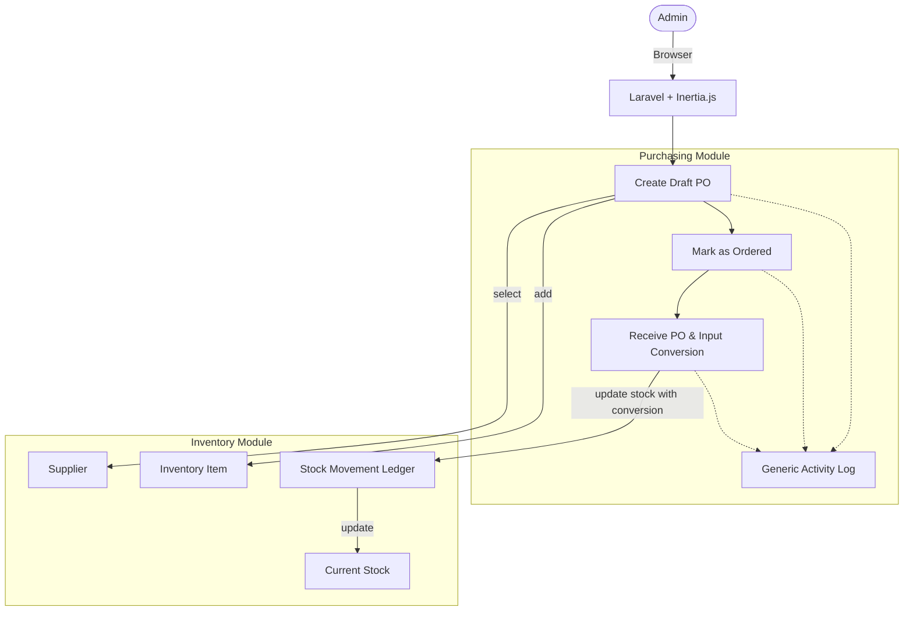
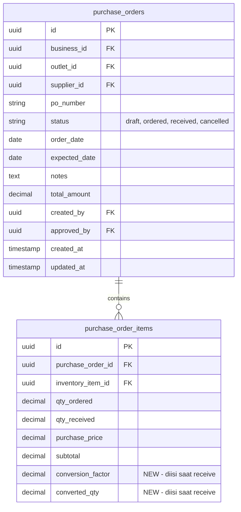

# PRD — Inventory - Purchase Order (Pembelian Stok)

## 1. Overview

Modul Pembelian Stok (Purchase Order/PO) bertanggung jawab untuk mengelola proses pembelian barang yang akan menjadi persediaan (inventory). Modul ini digunakan untuk mencatat setiap transaksi pemesanan ke pemasok (supplier) hingga penerimaan barang, sehingga jumlah persediaan dan riwayat pembelian dapat terdokumentasi dengan baik. Pada fase Minimum Viable Product (MVP), modul ini difokuskan pada penyediaan alur PO yang jelas: pembuatan draf pemesanan, pengiriman pesanan, hingga proses penerimaan barang. Desain modul dioptimalkan untuk memenuhi kebutuhan bisnis retail dan F&B skala kecil hingga menengah yang membutuhkan proses pembelian yang terstruktur.

---

## 2. Requirements

- **Purchase Order Transaction:** Sistem harus menyediakan fitur untuk mencatat transaksi Purchase Order (PO) ke supplier. Transaksi ini menjadi dasar penambahan stok saat barang diterima.
- **Outlet-Scoped PO:** Seluruh PO wajib memiliki `outlet_id`. Penerimaan stok hanya akan menambah persediaan pada outlet yang dipilih pada dokumen PO.
- **Supplier Reference:** Setiap PO wajib dikaitkan dengan supplier menggunakan `supplier_id`.
- **PO Number Generation:** Sistem harus menghasilkan nomor PO (`po_number`) secara otomatis, unik, dan mudah dilacak.
- **Order Date:** PO wajib memiliki tanggal pemesanan (`order_date`).
- **Multiple PO Items:** Satu PO dapat memiliki satu atau lebih item pesanan (`purchase_order_items`).
- **Inventory Item Validation:** Item yang dapat dipilih dalam PO berasal dari master inventory yang aktif, serta item yang didaftarkan ke data supplier.
- **Inventory Type Agnostic:** Modul pembelian harus mendukung seluruh tipe inventory yang relevan (misal `raw_material`), tanpa perbedaan alur pencatatan PO.
- **Order Quantity:** Setiap item pesanan wajib memiliki jumlah pesan (`qty_ordered`) yang lebih besar dari nol.
- **Purchase Price:** Setiap item pesanan wajib menyimpan harga beli per unit (`purchase_price`).
- **Total Calculation:** Sistem harus menghitung subtotal (`qty_ordered × purchase_price`) dan total keseluruhan secara otomatis.
- **PO Status Flow:** Sistem mendukung alur status: `Draft` → `Ordered` → `Received` (serta `Cancelled`). Hanya penerimaan pada status `Received` yang memengaruhi stok.
- **Draft Editing:** Selama status `Draft`, informasi PO (item, qty, harga, dll) masih dapat diubah.
- **Ordered Lock:** Setelah PO berstatus `Ordered`, data pesanan inti tidak dapat diubah (hanya menunggu penerimaan atau pembatalan).
- **Goods Receipt (Penerimaan) & Stock Conversion:** Saat mengubah PO menjadi `Received`, pengguna wajib memasukkan kuantitas yang diterima (`qty_received`) dan melakukan konversi stok secara manual/dinamis. Jika satuan pembelian berbeda dari inventory (contoh: pesan "Dus", stok "Botol"), pengguna wajib menginput nilai hasil konversi atau faktor konversinya tanpa bergantung pada data master UOM.
- **Stock Increase:** Penerimaan barang (`Received`) secara otomatis menambahkan jumlah stok pada inventory sesuai kuantitas hasil konversi.
- **Stock Mutation Record:** Penambahan stok dari penerimaan PO wajib menghasilkan catatan mutasi stok (`stock_movement`) bertipe `purchase`.
- **Soft Delete / Cancel:** PO tidak dihapus permanen. Draf dapat dihapus sementara PO `Ordered` dapat di-`Cancelled`. PO `Received` dapat di-`Void` (pembatalan penerimaan yang mengembalikan stok).
- **Generic Activity Log:** Sistem harus menggunakan service Activity Log yang generic untuk mencatat setiap perubahan status, pembuatan PO, dan penerimaan stok. Service ini dirancang untuk dapat dipakai ulang (reusable) oleh modul lain.

---

## 3. Core Features

- **Create PO Draft:** Pengguna dapat membuat dokumen PO baru dengan memilih outlet, supplier, tanggal pesanan, dan menginput daftar barang yang dibeli (harga dan jumlah pesanan).
- **Update to Ordered:** Pengguna menandai PO siap dan dikirim ke supplier (status berubah ke `Ordered`).
- **Receive Goods:** Pengguna mencatat penerimaan barang atas PO yang berstatus `Ordered`. Pengguna memasukkan `qty_received` dan nilai konversi stok untuk setiap item (Stock Conversion dinamis). Setelah dikonfirmasi, PO menjadi `Received` dan stok bertambah.
- **Cancel/Void PO:** Membatalkan PO yang belum diterima (`Cancelled`), atau membatalkan PO yang sudah diterima yang memicu jurnal balik/pengurangan stok.
- **PO History:** Daftar PO beserta status, tanggal, supplier, outlet, dan total nominal.
- **PO Detail View:** Menampilkan detail dokumen PO, riwayat penerimaan, perhitungan total, dan informasi stok masuk.
- **Search & Filter:** Mencari PO berdasarkan nomor, status, supplier, outlet, dan rentang waktu.
- **Activity Logging:** Mencatat semua aksi (Create, Order, Receive, Cancel) menggunakan `ActivityLogService` yang generic.

---

## 4. User Flow

### **Membuat Purchase Order (Draft)**
1. User masuk ke menu **Inventori > Pembelian (PO)**.
2. User klik **Buat PO Baru**.
3. Sistem membuat PO **Draft** dan otomatis menghasilkan `po_number`.
4. User memilih **Outlet**, **Supplier**, dan **Tanggal Pesanan**.
5. User menambahkan item barang.
6. User mengisi jumlah pesan (`qty_ordered`) dan harga beli (`purchase_price`).
7. User menyimpan PO sebagai **Draft**.

### **Mengubah menjadi Ordered**
1. User membuka PO **Draft**.
2. User klik tombol **Mark as Ordered** (Pesan Barang).
3. Status berubah menjadi **Ordered**. Data pesanan dikunci (readonly).

### **Penerimaan Barang (Receive & Convert)**
1. User membuka PO dengan status **Ordered**.
2. User klik tombol **Receive Items** (Terima Barang).
3. Sistem menampilkan form penerimaan. User menginput jumlah yang benar-benar diterima (`qty_received`).
4. **Stock Conversion:** User wajib mendefinisikan konversi stok jika satuan pembelian berbeda dengan satuan inventory (misal beli dalam Dus, masuk stok dalam Botol). User memasukkan angka konversi langsung di form penerimaan ini.
5. User mengonfirmasi penerimaan.
6. Sistem mengubah status PO menjadi **Received**.
7. Sistem mengkalkulasi stok berdasarkan konversi yang diinput dan memperbarui inventory (`current_stock`).
8. Sistem membuat mutasi stok tipe `purchase`.
9. `ActivityLogService` mencatat aktivitas penerimaan ini.

### **Pembatalan PO (Cancel/Void)**
- **Cancel PO:** Jika masih `Ordered`, user klik **Cancel PO**. Status menjadi `Cancelled`.
- **Void PO:** Jika sudah `Received`, user klik **Void Receipt**. Sistem melakukan reversal mutasi stok (mengurangi inventori sejumlah penerimaan) dan mengubah status PO.

---

## 5. Architecture

Modul **Purchasing** mempertahankan pendekatan **Modular Monolith** dengan Controller → Service → Model. Alur pembelian direpresentasikan dengan `PurchaseOrder` model.

---

## 6. Database Schema

Skema memanfaatkan tabel eksisting sesuai nama yang sudah ada di sistem. Tidak ada penggantian nama tabel `purchases`.

**Tabel Relevan (Eksisting/Diperbarui):**
- `purchase_orders`: Header dokumen PO (status: `draft`, `ordered`, `received`, `cancelled`).
- `purchase_order_items`: Detail item PO (`qty_ordered`, `qty_received`, `purchase_price`).
  *(Note: Akan ditambahkan kolom `conversion_factor` dan `converted_qty` pada tabel ini untuk mengakomodir input konversi saat penerimaan stok).*
- `inventory_movements`: Menyimpan mutasi stok (`purchase` dsb).
- `activity_logs` (**NEW / GENERIC**): Tabel generik untuk mencatat riwayat aktivitas dari modul manapun.

---

## 7. Tech Stack

- **Frontend:** Vue 3 + Tailwind CSS v4 + Inertia.js. UI Penerimaan (Receive) menyediakan input _dynamic conversion_ tanpa terikat pada tabel _master UOM_.
- **Backend:** Laravel 11.
- **Services:**
  - `PurchaseOrderService`: Mengurus logika `create`, `update`, `markAsOrdered`, `receive`, dan `cancel`.
  - `ActivityLogService` (**Baru, Generic**): Class service yang dapat di-*inject* dan digunakan di seluruh sistem untuk menyimpan _audit trail_.
  - `InventoryMovementService`: Mencatat perubahan mutasi stok.
- **Authorization:** `inventory.purchase.read`, `create`, `update`, `receive`, `cancel`.
