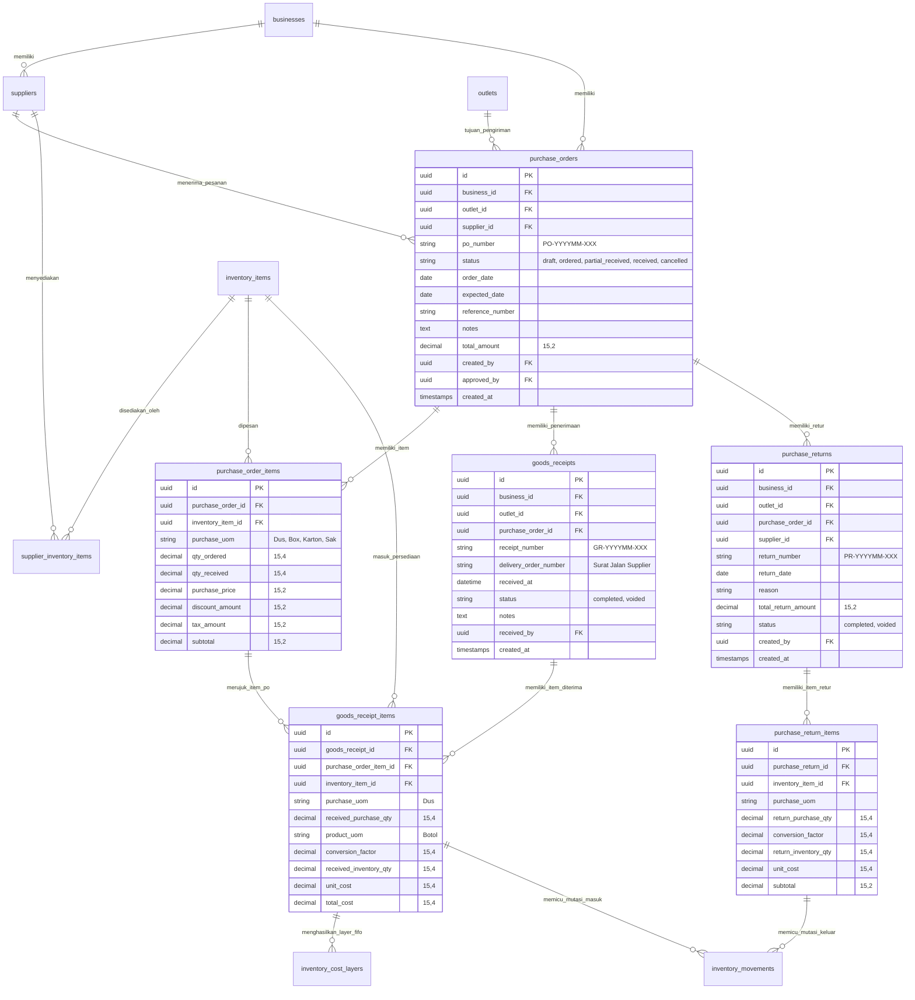

# PRD — Purchasing V2 (Pembelian Persediaan & Konversi Satuan Fleksibel)

## 1. Overview
Modul **Purchasing V2 (Pembelian Persediaan)** di Sollu App adalah sistem pengadaan barang multi-tenant yang dirancang khusus untuk bisnis ritel, F&B, dan jasa multi-outlet. Berbeda dengan sistem ERP konvensional yang memaksakan konfigurasi Multi-UOM (*Unit of Measure*) yang rumit pada tingkat master produk, Purchasing V2 mengadopsi prinsip **Flexible Purchase Unit & Manual Conversion**. 

Sistem mempertahankan **Single Product UOM** pada master persediaan (satuan baku untuk mutasi stok, stok opname, resep HPP, dan penjualan kasir), namun memberikan fleksibilitas penuh kepada staf pengadaan untuk membeli dalam satuan kemasan apa pun (*free-form transactional purchase unit* seperti Dus, Karton, Sak, Karung, Ball, Jerigen). Konversi kuantitas dan kalkulasi harga pokok per unit persediaan dihitung secara manual dan transparan saat penerimaan fisik barang (*Goods Receipt*). Modul ini juga mendukung pengadaan langsung (*Direct Purchase*), alur pesanan terstruktur (*Purchase Order/PO*), penerimaan bertahap (*Partial Receiving*), retur pembelian (*Purchase Return*), integrasi valuasi stok FIFO / Moving Average, serta pengadaan terpusat (*Central Purchasing*).

---

## 2. Requirements
- **Prinsip Satuan Tunggal Produk (Single Product UOM):** Master produk/bahan baku (`inventory_items`) hanya memiliki 1 satuan persediaan utama. Dilarang menambahkan master multi-UOM atau faktor konversi statis permanen ke dalam tabel master produk.
- **Satuan Beli Bebas & Transaksional (Transactional Purchase UOM):** Satuan pembelian pada PO/pembelian bersifat transaksional per baris dokumen. Sistem dapat menyediakan *auto-suggest* satuan umum (Dus, Box, Pack, Karton, Kg, Liter), namun nilainya tidak mengubah master produk.
- **Konversi Manual Saat Penerimaan (Manual Dynamic Conversion):** Faktor konversi (misal: $1\text{ Dus} = 24\text{ Botol}$) ditentukan saat fisik barang diterima (*Goods Receipt*). Jika kemasan berubah pada pengiriman berikutnya (misal: $1\text{ Dus} = 20\text{ Botol}$), sistem mencatat nilai faktual tersebut pada dokumen penerimaan terkait tanpa merusak riwayat transaksi terdahulu.
- **Alur Status PO Lengkap:** Sistem mendukung status: `Draft` $\rightarrow$ `Ordered` $\rightarrow$ `Partial Received` $\rightarrow$ `Received` $\rightarrow$ `Cancelled`.
- **Penerimaan Sebagian (Partial Receiving) & Multi-Delivery:** Satu dokumen PO dapat diterima dalam beberapa kali pengiriman barang (*Goods Receipt*) dengan nomor surat jalan dan faktor konversi yang dapat berbeda per pengiriman. Kuantitas sisa pesanan (*Outstanding Quantity*) dihitung secara otomatis.
- **Kebijakan Penerimaan Lebih (Over-Receiving Policy):** Konfigurasi toleransi over-receiving per bisnis/outlet (diizinkan dengan batas persentase atau dilarang/memerlukan otorisasi manajer).
- **Kalkulasi Biaya Persediaan & Integrasi FIFO/Moving Average:** Sistem menghitung unit cost persediaan secara otomatis:
  $$\text{Unit Cost Persediaan} = \frac{\text{Total Biaya Pembelian}}{\text{Kuantitas Persediaan Hasil Konversi}}$$
  Data ini langsung disuntikkan ke `inventory_cost_layers` (FIFO) dan memperbarui `average_cost` pada `inventory_balances`.
- **Pembelian Langsung (Direct Purchase):** Alur cepat (*quick purchase*) untuk toko kecil: input data pembelian dan langsung menghasilkan status *Received* serta mutasi stok tanpa melalui alur persetujuan PO terpisah.
- **Retur Pembelian (Purchase Return):** Pencatatan pengembalian barang ke supplier akibat cacat/rusak/kelebihan kirim dengan mempertahankan jejak satuan beli dan satuan persediaan yang terpotong.
- **Pembatalan & Reversal (Zero Stock Drift):** Pembatalan PO berstatus *Received* atau *Goods Receipt* wajib melakukan pembalikan (*void/reversal*) pada mutasi stok dan menghapus layer FIFO terkait secara aman.
- **Isolasi Multi-Tenant & Multi-Outlet:** Setiap transaksi terikat ketat pada `business_id` dan `outlet_id` tujuan.
- **Dual-Layer Authorization:**
  - **RBAC:** Hak akses pengguna diatur via `PermissionEnum` (`purchase_order.view`, `purchase_order.create`, `purchase_order.order`, `purchase_order.receive`, `purchase_order.void`, `purchase_order.return`).
  - **SaaS Feature Plan:** Diproteksi melalui `FeatureEnum::PURCHASE_ORDERS` via middleware `plan.feature:purchase_orders` dan komponen UI `<FeatureLock>`.
- **Audit Logging:** Setiap perubahan data, pembuatan, penerimaan, koreksi konversi, dan pembatalan tercatat melalui `ActivityLogService`.
- **Cetak & Ekspor Dokumen:** Mendukung pembuatan surat pesanan PDF terstandarisasi (Blade DomPDF) dan ekspor spreadsheet pada menu *Opsi Data*.

---

## 3. Core Features
- **Purchase Order (PO) Management:**
  - Pembuatan draf PO dengan penomoran otomatis (`PO-YYYYMM-XXX`).
  - Pemilihan supplier, outlet/gudang tujuan, tanggal pesanan, estimasi tanggal datang, dan nomor referensi supplier.
  - Multi-item purchasing dengan detail: item persediaan, satuan beli, kuantitas pesan, harga satuan beli, diskon per baris, dan pajak.
  - Alur persetujuan (*Mark as Ordered*) yang mengunci draf PO menjadi pesanan resmi.
- **Direct Purchase / Instant Purchasing:**
  - Pembuatan transaksi pembelian langsung yang instan menambahkan persediaan tanpa status *Ordered* terlebih dahulu (cocok untuk belanja harian pasar / *petty cash*).
- **Goods Receipt Engine & Dynamic Conversion:**
  - Form penerimaan barang interaktif yang menampilkan *Ordered Qty*, *Previously Received*, dan *Outstanding Qty*.
  - Input kuantitas diterima dalam satuan pembelian dan rasio konversi ke satuan produk.
  - Perhitungan *live* kuantitas masuk persediaan (read-only) dan indikasi biaya per unit persediaan.
- **Partial Receiving & Multi-Receipt Tracker:**
  - Pencatatan dokumen penerimaan barang independen (`goods_receipts`) yang menginduk pada satu PO.
  - Otomasi pembaruan status PO menjadi `Partial Received` jika masih ada barang tersisa, dan `Received` jika seluruh pesanan terpenuhi.
- **Purchase Return (Retur Pembelian):**
  - Pembuatan dokumen retur barang mengacu pada PO atau penerimaan tertentu.
  - Pengurangan stok persediaan otomatis dan penyesuaian status tagihan/pembayaran supplier.
- **Void & Reversal Management:**
  - Otorisasi pembatalan penerimaan barang dengan pemotongan stok balik bertipe `purchase_void` dan pembersihan *cost layers*.
- **Supplier Price History & Auto-Suggestion:**
  - Menyimpan histori harga beli terakhir (`last_purchase_price`) dan satuan beli terakhir per item pada relasi supplier untuk mempermudah pemesanan berulang.
- **Central Purchasing & Distribution Readiness:**
  - Dukungan pemesanan oleh kantor pusat (*Head Office*) dengan tujuan pengiriman ke Gudang Pusat sebelum didistribusikan ke cabang.
- **Dokumen & Laporan Cetak:**
  - Cetak Surat Pesanan (PO) format PDF formal untuk dikirim via WhatsApp/Email ke supplier.
  - Ekspor riwayat pembelian dan konversi persediaan via Excel/CSV.

---

## 4. User Flow

### Flow 1: Standar Purchase Order hingga Penerimaan Barang (PO Flow)
1. **Buat Draf PO:** Staf/Manajer membuka menu **Inventori > Pembelian (PO)**, klik tombol **+ Tambah PO**.
2. **Isi Detail Pesanan:** Memilih Outlet tujuan, Supplier, Tanggal Pesanan, dan menambahkan item barang. Mengisi *Satuan Beli* (misal: "Karton"), *Qty Pesan* (misal: 10), dan *Harga Beli per Satuan* (misal: Rp120.000). Sistem menghitung subtotal dan total PO.
3. **Kunci Pesanan (Mark as Ordered):** Manajer meninjau draf dan klik **Pesan Barang (Ordered)**. PO terkunci dan siap dicetak/dikirim ke supplier.
4. **Penerimaan Barang (Goods Receipt):** Saat barang fisik tiba di outlet, staf gudang membuka PO berstatus *Ordered*, lalu klik **Terima Barang**.
5. **Input Konversi:** Staf memasukkan jumlah fisik diterima (misal: 10 Karton) dan memasukkan faktor konversi faktual (misal: 1 Karton = 40 Pcs). Sistem secara otomatis menghitung:
   - *Kuantitas Masuk Persediaan:* $10 \times 40 = 400\text{ Pcs}$
   - *Unit Cost Persediaan:* $\text{Rp}1.200.000 \div 400 = \text{Rp}3.000\text{ / Pcs}$
6. **Posting Penerimaan:** Staf klik **Simpan Penerimaan**. Status PO diperbarui menjadi `Received`, mutasi stok bertipe `purchase` tercatat (+400 Pcs), dan layer biaya FIFO terbentuk.

### Flow 2: Penerimaan Bertahap (Partial Receiving Flow)
1. Supplier mengirimkan 40 Karton dari total 100 Karton yang dipesan pada PO.
2. Staf membuka dokumen PO, klik **Terima Barang**, menginput kuantitas diterima: 40 Karton dengan konversi 1 Karton = 24 Pcs.
3. Sistem memposting penerimaan $40 \times 24 = 960\text{ Pcs}$ ke stok, dan mengubah status PO menjadi `Partial Received` (Sisa / *Outstanding*: 60 Karton).
4. Beberapa hari kemudian sisa 60 Karton tiba dengan kemasan baru (1 Karton = 20 Pcs).
5. Staf melakukan penerimaan kedua atas sisa 60 Karton dengan konversi 20 Pcs/Karton ($60 \times 20 = 1.200\text{ Pcs}$).
6. Sistem memposting stok $1.200\text{ Pcs}$. Total penerimaan mencapai 100 Karton, dan status PO otomatis berubah menjadi `Received`.

### Flow 3: Pembelian Langsung (Direct / Quick Purchase Flow)
1. Staf membuka menu **Pembelian (PO)**, memilih opsi **Pembelian Langsung**.
2. Staf mengisi Supplier, Outlet, Item, Satuan Beli, Qty Beli, Harga Satuan, dan Faktor Konversi dalam satu formulir cepat.
3. Saat disimpan, sistem langsung mencatat transaksi pembelian berstatus `Received`, membuat mutasi stok masuk, dan membentuk layer biaya persediaan seketika.

### Flow 4: Retur Pembelian (Purchase Return Flow)
1. Staf menemukan 2 Karton barang rusak dari penerimaan sebelumnya.
2. Staf membuka menu **Pembelian > Retur Pembelian**, memilih nomor PO/Penerimaan terkait, dan menginput 2 Karton retur.
3. Sistem membaca konversi terkait (misal: 24 Pcs/Karton), memotong stok persediaan sebesar 48 Pcs dengan mutasi `purchase_return`, serta mencatat nota retur.

### Flow 5: Pembatalan & Void (Void Receipt Flow)
1. Terjadi kesalahan input faktual atau transaksi dibatalkan oleh manajer pada PO yang telah berstatus `Received`.
2. Pengguna berwenang klik **Void Penerimaan** dan memasukkan alasan pembatalan.
3. Sistem membuat mutasi stok keluar pembalik bertipe `purchase_void`, menghapus layer FIFO terkait, mengembalikan saldo persediaan ke posisi sebelum penerimaan, dan mengubah status PO menjadi `Cancelled`.

---

## 5. Architecture
Modul **Purchasing V2** dibangun di atas arsitektur **Modular Monolith** terisolasi di bawah namespace `App\Services\App\Inventory` dan `App\Http\Controllers\App\Inventory`.

```mermaid
flowchart TD
    User([Staff Pengadaan / Manajer]) -->|Inertia.js SPA Request| WebRoute[Route: /app/inventories/purchases]
    
    subgraph Controller & Authorization Layer
        WebRoute --> AuthCheck{Auth & Plan Gate}
        AuthCheck -->|Valid: RBAC + FeatureEnum::PURCHASE_ORDERS| Controller[StockPurchasesController]
        AuthCheck -->|Unauthorized / Plan Locked| LockUI[FeatureLock / 403 Forbidden]
    end

    subgraph Service Business Logic Layer
        Controller --> POService[PurchaseOrderService]
        Controller --> GRService[GoodsReceiptService]
        Controller --> ReturnService[PurchaseReturnService]
        
        POService --> ActivityLog[ActivityLogService]
        GRService --> CostingService[InventoryCostingService]
        ReturnService --> CostingService
    end

    subgraph Inventory Mutation & Costing Engine
        CostingService -->|Record +Qty & FIFO Layer| CostLayer[(inventory_cost_layers)]
        CostingService -->|Update Balance & Moving Avg| InvBalance[(inventory_balances)]
        CostingService -->|Write Stock Ledger (+/-)| InvMovement[(inventory_movements)]
    end

    subgraph Database Persistence Layer
        POService <--> DB_PO[(purchase_orders & items)]
        GRService <--> DB_GR[(goods_receipts & items)]
        ReturnService <--> DB_PR[(purchase_returns & items)]
        POService <--> DB_Supplier[(suppliers & supplier_inventory_items)]
    end

    Controller -->|Render Vue Component| UI_Display[Pages/App/Inventory/Purchase]
    Controller -->|Generate PDF Stream| DomPDF[DomPDF / purchase-order.blade.php]
```

---

## 6. Database Schema

### Tabel & Struktur Data Utama
- `suppliers`: Master data vendor/pemasok barang persediaan.
- `supplier_inventory_items`: Relasi item persediaan yang disediakan supplier beserta histori harga beli terakhir.
- `purchase_orders`: Dokumen utama pesanan pembelian.
- `purchase_order_items`: Rincian item pesanan pembelian dengan satuan beli transaksional.
- `goods_receipts`: Dokumen fisik penerimaan barang (mendukung multi-receipt / partial receiving).
- `goods_receipt_items`: Rincian barang diterima lengkap dengan faktor konversi manual dan kalkulasi kuantitas persediaan.
- `purchase_returns`: Dokumen retur barang ke pemasok.
- `purchase_return_items`: Rincian barang retur beserta faktor konversi pengurang stok.
- `inventory_cost_layers`: Pencatatan lapisan biaya masuk untuk alokasi COGS FIFO.
- `inventory_movements`: Buku besar (*ledger*) mutasi persediaan dalam satuan tunggal produk (*Product UOM*).
- `inventory_balances`: Saldo persediaan per item per outlet/gudang.



---

## 7. Tech Stack
- **Backend Framework:** **Laravel 11.x** (PHP 8.3) dengan penerapan Controller $\rightarrow$ Service Pattern, Form Requests terisolasi, dan Eloquent ORM.
- **Frontend Architecture:** **Vue 3** (`<script setup>`) terintegrasi melalui **Inertia.js 1.2**.
- **UI & Layout:** **Tailwind CSS v4** dengan standarisasi komponen Sollu App (`@/Components/UI/ActionBar/ActionBar.vue`, `<Table>`, `<PopUpPage>`, `DropdownField`, `TextField`, `NumberField`).
- **Database Engine:** **PostgreSQL** dengan tipe data `UUID` untuk primary/foreign keys dan presisi `DECIMAL(15,4)` untuk kuantitas dan kalkulasi biaya.
- **PDF & Document Engine:** **Blade + DomPDF** untuk pencetakan dokumen resmi Surat Pesanan (*Purchase Order*) dan Bukti Penerimaan Barang (*Goods Receipt Slip*).
- **Export / Import Engine:** **OpenSpout / FastExcel** untuk ekspor dataset transaksi pembelian pada toolbar *Opsi Data*.
- **Quality Assurance & Testing:** **PHPUnit** (100% Mocking Unit Tests pada Service Layer dan Feature Tests untuk isolasi multi-tenant serta validasi konversi pecahan).
