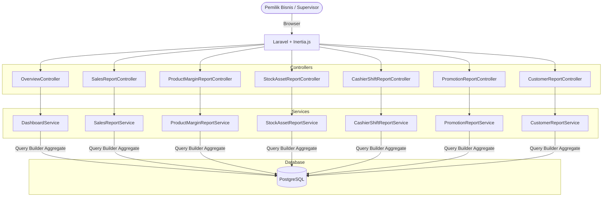

# PRD — Reporting & Analytics (Laporan & Analitik)

## 1. Overview

Modul Reporting & Analytics (Laporan & Analitik) bertanggung jawab menyajikan data historis dan ringkasan operasional bisnis secara komprehensif pada aplikasi Sollu POS. Modul ini sepenuhnya bersifat **read-only**, artinya tidak ada pembuatan atau modifikasi data yang terjadi melalui modul ini. Fokus utamanya adalah mengagregasi data dari modul-modul lain (seperti Transaksi, Inventori, dan Pegawai) untuk mendukung pemilik bisnis dalam pengambilan keputusan. Modul ini mencakup 1 Dashboard Overview sebagai halaman utama setelah login, serta 6 jenis laporan spesifik yang dapat difilter berdasarkan outlet dan rentang tanggal:

1. Laporan Penjualan
2. Laporan Produk & Margin
3. Laporan Stock & Aset
4. Laporan Shift & Kas
5. Laporan Promo
6. Laporan Pelanggan

---

## 2. Requirements

- **Read-Only Operation:** Modul ini murni untuk menampilkan, mengagregasi, dan mengekspor data. Tidak ada aksi penambahan, pengubahan, atau penghapusan data.
- **Outlet-Scoped Data:** Seluruh laporan dan dashboard wajib difilter berdasarkan hak akses outlet pengguna.
- **Date Range Filtering:** Seluruh laporan harus mendukung filter rentang tanggal (periode tanggal mulai & akhir).
- **Service per Report:** Setiap jenis laporan dikelola oleh satu kelas Service khusus untuk memisahkan logika query agregasi.
- **Raw SQL & Query Builder:** Menggunakan Query Builder dengan `DB::raw()` dibandingkan Eloquent Collection agar efisien untuk agregasi (SUM, AVG, COUNT, GROUP BY).
- **Chart.js Integration:** Visualisasi data (line chart, bar chart, pie chart) pada frontend menggunakan Chart.js.
- **Export Capability:** Setiap laporan tabel harus dapat diekspor ke dalam format CSV/Excel.
- **Existing Dashboard Controller:** Menggunakan `OverviewController.php` untuk dashboard ringkasan.

---

## 3. Core Features

1. **Dashboard Overview (`/overview`)**
    - **Header Filter** (Global Filter)
        - Dapat mengubah seluruh data visual di dashboard sesuai rentang waktu yang dipilih:
            - **Default**: Hari Ini (Today) – agar pemilik toko langsung melihat perkembangan penjualan hari berjalan.
            - **Pilihan Preset**: Hari Ini, Kemarin, 7 Hari Terakhir, Bulan Ini, dan Custom Range.
    - **KPI Cards:** Total Omset Kotor, Estimasi Keuntungan Kotor, Total Transaksi, Rata-rata Nilai Belanja dengan perbandingan periode performa.
    - **Grafik Tren Penjualan:** _Line chart_ tren omset (hari/minggu/bulan/tahun).
    - **Kategori Penjualan:** _Pie/Bar chart_ pendapatan per kategori.
    - **Top 5 Produk Terlaris:** Tabel 5 produk pendapatan tertinggi.
    - **Produk Stok Rendah:** Tabel item yang mendekati `minimum_stock`.
    - **Ringkasan Metode Pembayaran:** Pie Chart, Membantu bisnis memastikan aliran uang masuk paling dominan.

2. **Laporan Penjualan (`report.sales`)**
    - Mengagregasi data omset (Gross), Diskon, Pajak, dan Omset Bersih (Net) per hari atau per outlet.
    - _Line chart_ tren penjualan.
    - Breakdown berdasarkan metode pembayaran (Tunai, QRIS, Transfer, EDC).
    - Ekspor data CSV/Excel.

3. **Laporan Produk & Margin (`report.product`)**
    - Menampilkan performa tiap produk: Nama, Kategori, Qty Terjual, Total Penjualan.
    - Menampilkan Margin Keuntungan (Gross Profit) berdasarkan harga jual dikurangi HPP (Cost of Goods Sold).
    - Sorting berdasarkan kuantitas atau margin tertinggi.
    - Ekspor data CSV/Excel.

4. **Laporan Stock & Aset (`report.stock`)**
    - Ringkasan nilai aset inventori (berdasarkan cost_layer atau moving average).
    - Tabel pergerakan stok: Stok Awal, Masuk (Pembelian/Transfer In/Opname+), Keluar (Penjualan/Waste/Transfer Out/Opname-), dan Stok Akhir.
    - Highlight item Low Stock dan Out of Stock.
    - Ekspor data CSV/Excel.

5. **Laporan Shift & Kas (`report.cashier`)**
    - Riwayat shift kasir: Jam Buka/Tutup, Kas Awal, Kas Akhir (Sistem vs Fisik), dan Selisih Kas (Over/Short).
    - Metrik performa kasir: Total Transaksi dan Total Penjualan yang ditangani selama shift aktif.
    - Rincian mutasi kas (Cash In / Cash Out) selama operasional.
    - Ekspor data CSV/Excel.

6. **Laporan Promo (`report.promotion`)**
    - Evaluasi efektivitas promosi dan diskon.
    - Total diskon yang diberikan, jumlah transaksi yang menggunakan promo, dan frekuensi penggunaan tiap tipe promo.
    - Ekspor data CSV/Excel.

7. **Laporan Pelanggan (`report.customer`)**
    - Data demografi transaksi pelanggan (Member vs Non-Member).
    - Top Pelanggan berdasarkan frekuensi kunjungan dan total nilai belanja.
    - Ekspor data CSV/Excel.

---

## 4. User Flow

### **Melihat Dashboard Overview**

1. User masuk ke Dashboard (`/overview`).
2. Filter default: Hari Ini. Sistem menampilkan metrik agregasi penjualan dan grafik tren.
3. User mengganti rentang waktu (misal: 30 Hari Terakhir), dashboard me-refresh secara asinkron (Inertia reload).

### **Melihat & Mengekspor Laporan Produk & Margin**

1. User memilih menu **Laporan > Laporan Produk & Margin**.
2. Sistem menampilkan tabel rincian performa produk (Qty, Omset, Margin).
3. User memfilter berdasarkan Outlet tertentu.
4. User mengklik tombol **Ekspor CSV**. Unduhan berjalan otomatis.

### **Menganalisis Laporan Shift & Kas**

1. User memilih menu **Laporan > Laporan Shift & Kas**.
2. Supervisor memeriksa daftar shift hari sebelumnya untuk menemukan adanya selisih kas merah (short).
3. Klik detail shift untuk melihat rincian Cash Out (misal: biaya makan karyawan) yang dicatat kasir.

---

## 5. Architecture

---

## 6. Database Schema

Modul beroperasi **Read-Only** mengambil data dari tabel operasional:

- `transactions` & `transaction_items` (Penjualan, Margin, Diskon, Metode Pembayaran).
- `shifts` & `shift_cash_logs` (Laporan Shift & Kas).
- `inventory_balances` & `inventory_movements` (Laporan Stock & Aset).
- `products`, `product_categories`, `customers`, `promos` (Master Data dimensi).

---

## 7. Tech Stack & Routes

- **Frontend:** Vue 3 + Tailwind CSS v4 + Inertia.js. Komponen grafik menggunakan Chart.js.
- **Backend:** Laravel 11.
- **Routes & Controllers:**
    - `GET /overview` → `OverviewController@index`
    - `GET /reports/sales` → `SalesReportController@index`
    - `GET /reports/products` → `ProductMarginReportController@index`
    - `GET /reports/stocks` → `StockAssetReportController@index`
    - `GET /reports/cashiers` → `CashierShiftReportController@index`
    - `GET /reports/promotions` → `PromotionReportController@index`
    - `GET /reports/customers` → `CustomerReportController@index`
- **Eksport Data:** CSV generator via `Maatwebsite\Excel` atau native PHP `fputcsv`.

---

## 8. Hak Akses (Authorization)

Sesuai dengan mapping pada file `resources/js/Composable/Sidebar/main.js`.

| Permission              | Keterangan / Laporan yang Dapat Diakses                    | Kasir | Supervisor | Owner/Admin |
| ----------------------- | ---------------------------------------------------------- | ----- | ---------- | ----------- |
| `report.sales.view`     | Mengakses Laporan Penjualan (Omset, Pajak, Payment Method) | Tidak | Ya         | Ya          |
| `report.product.view`   | Mengakses Laporan Produk & Margin                          | Tidak | Ya         | Ya          |
| `report.stock.view`     | Mengakses Laporan Stock & Aset                             | Tidak | Ya         | Ya          |
| `report.cashier.view`   | Mengakses Laporan Shift & Kas                              | Tidak | Ya         | Ya          |
| `report.promotion.view` | Mengakses Laporan Promo                                    | Tidak | Ya         | Ya          |
| `report.customer.view`  | Mengakses Laporan Pelanggan                                | Tidak | Tidak      | Ya          |
| `report.export`         | Izin menekan tombol "Ekspor CSV/Excel" (Global)            | Tidak | Ya         | Ya          |

---

## 9. Validasi & Error Handling

- **Format Tanggal Salah:** Validasi Query String `date_format:Y-m-d`. Kembali ke default 30 hari.
- **Tanggal Mulai > Akhir:** Alert/Pesan error rentang tanggal tidak valid.
- **Outlet Scope Guard:** Pastikan query selalu di-chain dengan `whereIn('outlet_id', $userAuthorizedOutlets)`.
- **Large Dataset Export:** Batasi ekspor CSV jika baris > 10,000 (beri peringatan untuk mempersempit rentang tanggal).

---

## 10. UI Components Reference

### **Filter Umum (Header Laporan)**

- Dropdown Outlet (Multiselect atau Single).
- Date Range Picker (Mulai & Akhir) + Quick Filter (Bulan Ini, 7 Hari Terakhir).
- Tombol **Ekspor CSV** (icon).

### **Laporan Produk & Margin**

| Kolom Tabel           | Tipe Data  | Keterangan                          |
| --------------------- | ---------- | ----------------------------------- |
| Nama Produk           | Teks       | Termasuk Kategori                   |
| Qty Terjual           | Angka      |                                     |
| Total Penjualan       | Rupiah     | Gross Revenue                       |
| HPP (COGS)            | Rupiah     | Harga Pokok Penjualan (Aset keluar) |
| Margin (Gross Profit) | Rupiah / % | Total Penjualan - HPP               |

### **Laporan Stock & Aset**

| Kolom Tabel    | Tipe Data | Keterangan                 |
| -------------- | --------- | -------------------------- |
| Nama Item      | Teks      |                            |
| Stok Awal      | Angka     |                            |
| Masuk / Keluar | Angka     | Mutasi Stok (Qty)          |
| Stok Akhir     | Angka     |                            |
| Nilai Aset     | Rupiah    | Stok Akhir × HPP rata-rata |

### **Laporan Shift & Kas**

| Kolom Tabel   | Tipe Data | Keterangan                        |
| ------------- | --------- | --------------------------------- |
| Tanggal       | Date      |                                   |
| Shift / Kasir | Teks      | Nama Kasir & Waktu Buka-Tutup     |
| Expected Cash | Rupiah    | Uang kas yang dihitung sistem     |
| Actual Cash   | Rupiah    | Uang fisik laci kas               |
| Selisih       | Rupiah    | Merah jika Short, Hijau jika Over |
| Catatan       | Teks      | Alasan selisih dari kasir         |
