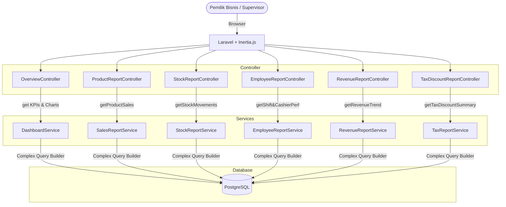
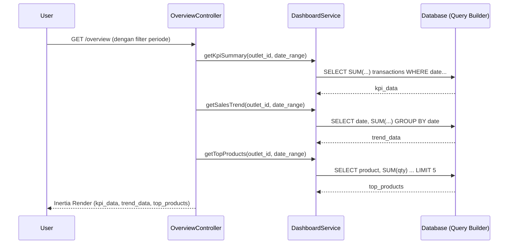
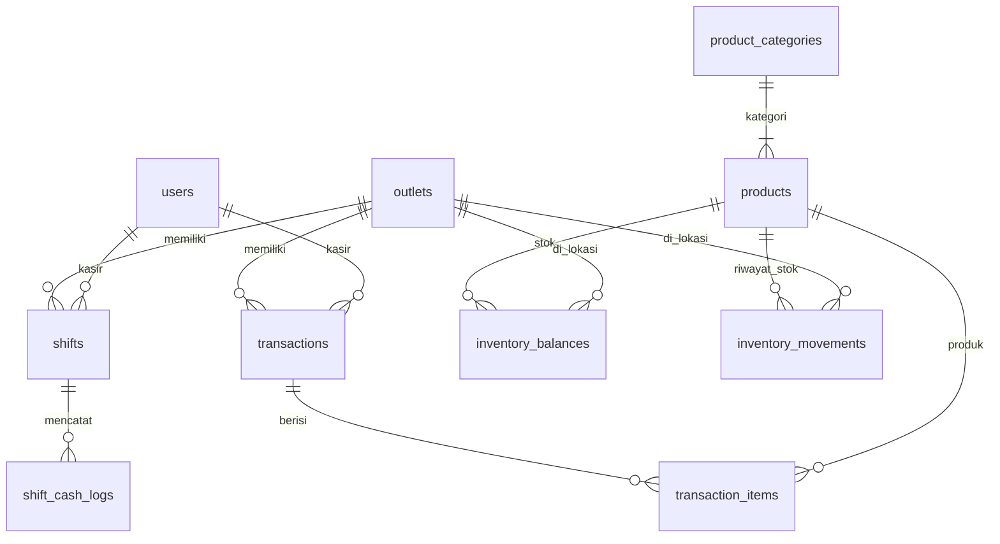

# PRD — Reporting & Analytics (Laporan & Analitik)

## 1. Overview

Modul Reporting & Analytics (Laporan & Analitik) bertanggung jawab menyajikan data historis dan ringkasan operasional bisnis secara komprehensif pada aplikasi Sollu POS. Modul ini sepenuhnya bersifat **read-only**, artinya tidak ada pembuatan atau modifikasi data yang terjadi melalui modul ini. Fokus utamanya adalah mengagregasi data dari modul-modul lain (seperti Transaksi, Inventori, dan Pegawai) untuk mendukung pemilik bisnis dalam pengambilan keputusan. Modul ini mencakup 1 Dashboard Overview sebagai halaman utama setelah login, serta 6 jenis laporan spesifik yang dapat difilter berdasarkan outlet dan rentang tanggal.

---

## 2. Requirements

- **Read-Only Operation:** Modul ini murni untuk menampilkan, mengagregasi, dan mengekspor data. Tidak ada aksi penambahan (insert), pengubahan (update), atau penghapusan (delete) data.
- **Outlet-Scoped Data:** Seluruh laporan dan dashboard wajib difilter berdasarkan hak akses outlet pengguna. Jika pengguna memiliki akses ke lebih dari satu outlet, mereka dapat melihat agregasi dari outlet-outlet tersebut atau memilih outlet spesifik melalui filter.
- **Date Range Filtering:** Seluruh laporan harus mendukung filter rentang tanggal (periode tanggal mulai & akhir) untuk menganalisis data dalam jangka waktu tertentu.
- **Service per Report:** Setiap jenis laporan harus dikelola oleh satu kelas Service khusus (misalnya: `SalesReportService`, `StockReportService`) untuk memisahkan logika query agregasi yang kompleks.
- **Raw SQL & Query Builder:** Mengingat kebutuhan agregasi data yang kompleks (seperti sum, average, count, dan grouping), implementasi query disarankan menggunakan Query Builder dengan `DB::raw()` dibandingkan proses collection Eloquent agar lebih efisien di sisi database.
- **Chart.js Integration:** Visualisasi data seperti *line chart*, *bar chart*, dan *pie chart* pada antarmuka pengguna (frontend) harus menggunakan library Chart.js.
- **Export Capability:** Setiap laporan tabel harus dapat diekspor ke dalam format CSV/Excel untuk kebutuhan analisis lanjutan di luar sistem.
- **Existing Dashboard Controller:** Harus menggunakan `OverviewController.php` yang sudah ada di `app/Http/Controllers/OverviewController.php` dengan mengganti mock data menjadi data aktual.
- **Menu Navigasi:** Semua laporan menempati menu navigasi (sidebar) yang sudah tersedia (placeholder saat ini).

---

## 3. Core Features

1. **Dashboard Overview:**
   - **KPI Cards:** Menampilkan Total Penjualan, Total Transaksi, Rata-rata per Transaksi. Dilengkapi dengan perbandingan performa (hari ini vs kemarin) berupa persentase perubahan.
   - **Grafik Tren Penjualan:** *Line chart* tren omset dengan filter cepat (hari/minggu/bulan/tahun).
   - **Kategori Penjualan:** *Pie* atau *bar chart* yang mem-breakdown pendapatan berdasarkan kategori produk.
   - **Top 5 Produk Terlaris:** Tabel 5 produk dengan qty terjual dan total pendapatan tertinggi.
   - **Produk Stok Rendah:** Tabel produk yang `current_stock`-nya mendekati atau di bawah `minimum_stock`.
   - **Produk Tidak Terjual:** Tabel produk aktif yang tidak memiliki transaksi dalam periode terpilih.

2. **Laporan Penjualan Produk (`reports.products`):**
   - Menampilkan detail performa tiap produk: Nama, Kategori, Qty Terjual, Total Pendapatan, Rata-rata Harga Jual.
   - Mendukung pengurutan (sort) berdasarkan qty terbanyak atau pendapatan tertinggi.
   - Ekspor data ke CSV/Excel.

3. **Laporan Stok (`reports.stock`):**
   - Ringkasan kondisi inventori: Total item, item low stock, item out of stock, dan total nilai persediaan (opsional jika HPP/Cost tersedia).
   - Pergerakan stok terperinci: Stok Awal, Masuk (pembelian, transfer_in, opname+), Keluar (penjualan, waste, transfer_out, opname-), dan Stok Akhir.
   - Ekspor data ke CSV.

4. **Laporan Pegawai (`reports.employees`):**
   - **Performa Kasir:** Metrik per kasir meliputi Total Transaksi, Total Penjualan, dan Rata-rata per Transaksi.
   - **Shift History:** Riwayat pergeseran shift meliputi Nomor Shift, Jam Buka/Tutup, Kas Awal, Kas Akhir, dan Selisih (Selisih Kas).

5. **Laporan Retur (`reports.return`) — *Phase 2*:**
   - Fitur placeholder. Menu tetap tersedia di sidebar namun berstatus *disabled* atau menampilkan halaman dengan pesan: "Fitur retur akan tersedia di versi selanjutnya."

6. **Laporan Pajak & Diskon (`reports.tax-discounts`):**
   - Ringkasan Pajak: Total penjualan sebelum pajak, total pajak terkumpul, tarif pajak.
   - Ringkasan Diskon: Total diskon yang diberikan, jumlah transaksi yang menggunakan diskon, rata-rata diskon per transaksi.
   - Rincian per tipe promo.
   - Ekspor data ke CSV.

7. **Laporan Omset (`reports.revenue`):**
   - *Line chart* tren omset (harian/mingguan/bulanan).
   - Rincian performa per outlet (untuk akun multi-outlet).
   - Rincian berdasarkan metode pembayaran (Tunai, QRIS, dll).
   - Tabel Omset Harian: Tanggal, Jumlah Transaksi, Total Omset, Diskon, Pajak, Omset Bersih.
   - Ekspor data ke CSV.

---

## 4. User Flow

### **Melihat Dashboard Overview**
1. User login ke aplikasi Sollu POS.
2. Sistem otomatis mengarahkan user ke halaman **Dashboard** (`/overview`).
3. Sistem mengambil data agregasi (KPI, Tren, Kategori, Top Produk, Stok Rendah) dari hari ini, membandingkannya dengan kemarin (untuk persentase).
4. User dapat melihat metrik utama dan grafik visual yang di-render oleh Chart.js.
5. User mengganti filter periode di pojok kanan atas (Hari Ini, Kemarin, 7 Hari Terakhir, 30 Hari Terakhir). Sistem memuat ulang data sesuai rentang waktu baru.

### **Melihat & Mengekspor Laporan Penjualan Produk**
1. User memilih menu **Laporan > Produk**.
2. Sistem menampilkan tabel rincian performa produk default untuk bulan berjalan.
3. User memfilter tabel berdasarkan **Outlet** tertentu dan **Kategori** produk.
4. User menekan header tabel "Qty Terjual" untuk mengurutkan data dari yang paling laku.
5. User menekan tombol **Ekspor**.
6. Sistem memproses file CSV dan browser memulai unduhan dokumen.

### **Melihat Laporan Stok**
1. User memilih menu **Laporan > Stok**.
2. Sistem menampilkan ringkasan stok (Total Item, Low Stock, Out of Stock) dan tabel pergerakan stok per produk.
3. User memilih rentang waktu tertentu. Sistem mengkalkulasi Stok Awal (sebelum tanggal mulai) dan agregasi Masuk/Keluar dalam periode tersebut.

### **Melihat Laporan Omset (Revenue)**
1. User memilih menu **Laporan > Omset**.
2. Sistem menampilkan *line chart* tren omset, pie chart metode pembayaran, dan tabel rincian per hari.
3. User menganalisis total pajak, diskon, dan omset bersih per hari dari tabel.

---

## 5. Architecture

Laporan dan agregasi data diproses oleh masing-masing Service class untuk memastikan Controller tetap bersih. Visualisasi grafik di-*render* di frontend menggunakan Chart.js.

### Sequence Diagram — Muat Dashboard Overview

---

## 6. Database Schema

Modul Reporting beroperasi dengan model **Read-Only** dari tabel-tabel operasional utama yang sudah ada atau akan dibuat oleh modul lain.

### Tabel yang Terlibat (Existing / Planned by other modules)

- `transactions` — Data header penjualan (total, pajak, diskon, metode pembayaran).
- `transaction_items` — Data detil produk yang terjual per transaksi (qty, harga jual, subtotal).
- `shifts` — Riwayat buka/tutup kasir per hari.
- `shift_cash_logs` — Detail uang masuk/keluar di mesin kasir (selisih kas).
- `inventory_balances` — Snapshot stok aktif per item per outlet.
- `inventory_movements` — Riwayat pergerakan stok harian (masuk/keluar).
- `products` / `product_categories` — Master data produk.
- `outlets` — Master data lokasi usaha.
- `users` — Master data pegawai/kasir.
- `promos` — Master data promosi atau diskon.

### Catatan Desain Agregasi

| Aspek | Detail Agregasi (Query Note) |
|---|---|
| **Rata-rata per Transaksi** | `SUM(total_amount) / COUNT(id)` dari tabel `transactions` pada periode terkait. |
| **Kalkulasi Stok Awal (Laporan Stok)** | Jumlah `stock_after` dari `inventory_movements` pada baris terakhir *sebelum* `start_date` filter, atau akumulasi (Stok Akhir - Pergerakan Dalam Periode). |
| **Tren Omset Harian** | Dikelompokkan dengan `GROUP BY DATE(created_at)`. |
| **Metrik Hari Ini vs Kemarin** | Diperlukan 2 kueri: satu untuk rentang waktu saat ini (contoh: Hari ini), satu lagi untuk periode sebanding sebelumnya (contoh: Kemarin). Persentase = `((Hari Ini - Kemarin) / Kemarin) * 100`. |
| **Produk Tidak Terjual** | `LEFT JOIN` dari `products` ke `transaction_items` dalam periode tertentu `WHERE transaction_items.id IS NULL`. |

---

## 7. Tech Stack

- **Frontend:** Vue 3 (Composition API `<script setup>`) + Tailwind CSS v4 + Inertia.js.
  - Komponen Daftar menggunakan pola `Container > ContainerHeader + Table + Pagination`.
  - Filter rentang waktu dan outlet di bagian atas halaman (ContainerHeader).
  - Visualisasi menggunakan `Chart.js` (komponen `vue-chartjs` atau pembungkus custom).
- **Backend:** Laravel 11 (PHP 8.3).
- **Services (Laporan):**
  - `DashboardService`
  - `SalesReportService`
  - `StockReportService`
  - `EmployeeReportService`
  - `TaxDiscountReportService`
  - `RevenueReportService`
- **Controller:** Mengambil query string untuk tanggal dan memanggil Service yang sesuai.
- **Eksport:** Package `Maatwebsite\Excel` (Laravel Excel) atau CSV generator sederhana bawaan PHP untuk mengubah Collection/Array ke format unduhan.
- **Authorization:** Spatie Laravel Permission.
- **Routes:**
  - `GET /overview` — Dashboard
  - `GET /reports/products` — Laporan Penjualan Produk
  - `GET /reports/stock` — Laporan Stok
  - `GET /reports/employees` — Laporan Pegawai
  - `GET /reports/return` — Laporan Retur (Placeholder)
  - `GET /reports/tax-discounts` — Laporan Pajak & Diskon
  - `GET /reports/revenue` — Laporan Omset

---

## 8. Hak Akses (Authorization)

| Permission | Keterangan / Laporan yang Dapat Diakses | Kasir | Supervisor | Owner / Admin |
|---|---|---|---|---|
| `report.*` | Memberikan akses ke semua laporan dan dashboard. | Tidak | Tidak | Ya |
| `report.sales` | Mengakses Dashboard & Laporan Produk (Performa Penjualan). | Tidak | Ya | Ya |
| `report.inventory` | Mengakses Laporan Stok. | Tidak | Ya | Ya |
| `report.cashflow` | Mengakses Laporan Omset (Revenue). | Tidak | Tidak | Ya |
| `report.shift` | Mengakses Laporan Pegawai (Shift & Performa Kasir). | Tidak | Ya | Ya |
| `report.product` | *Sama dengan report.sales (alias)* | - | - | - |
| `report.customer` | Mengakses Laporan Pelanggan (jika ada ke depannya). | Tidak | Tidak | Ya |
| `report.export` | Izin menekan tombol "Ekspor CSV/Excel" di laporan. | Tidak | Ya | Ya |

---

## 9. Validasi & Error Handling

Meskipun modul ini *Read-Only*, sistem tetap harus memvalidasi input filter dari pengguna (Query Strings) untuk menghindari error database atau timeout.

| Skenario | Validasi / Aturan | Pesan Error / Output |
|---|---|---|
| Format Tanggal Salah | `date_format:Y-m-d` | (Kembali ke default 30 hari terakhir atau tampilkan toast error) |
| Tanggal Mulai > Akhir | `before_or_equal:end_date` | "Tanggal mulai tidak boleh lebih besar dari tanggal akhir." |
| Outlet Tidak Ada / Bukan Haknya | Guard `in_array` dengan outlet akses user | (Otomatis diarahkan ke akses outlet default atau semua yang diizinkan) |
| Laporan Kosong (Tidak ada transaksi) | Data kembalian `[]` (array kosong) | Tabel menampilkan "Tidak ada data pada periode ini." Grafik menampilkan state kosong/nol. |
| Export Data Terlalu Besar | Limit row pada ekspor (misal maks 10,000) | "Data terlalu besar untuk diekspor. Harap persempit rentang tanggal." |

---

## 10. UI Components Reference

### **Filter Umum (Tampil di atas setiap halaman Laporan)**

- **Outlet Filter:** Dropdown select outlet (berisi outlet yang bisa diakses user, serta opsi "Semua Outlet" jika diizinkan).
- **Date Range Picker:** Dua `TextField` berjenis *date* (Mulai & Akhir), atau tombol *quick filter* (Hari ini, 7 Hari, Bulan ini).
- **Tombol Ekspor:** Tombol dengan icon unduh (btn-outline atau btn-flat), disembunyikan jika user tidak punya permission `report.export`.

### **Dashboard Overview (`/overview`)**

- **KPI Cards Section:** 3 kartu berjejer horizontal.
  - Kartu 1: Total Penjualan (Rp). Sub-text: "+15% dibanding kemarin" (Teks hijau jika positif, merah jika negatif).
  - Kartu 2: Total Transaksi (Angka).
  - Kartu 3: Rata-rata per Transaksi (Rp).
- **Chart Section:**
  - Kiri: Grafik Tren Penjualan (Line Chart, Sumbu X: Jam/Tanggal, Sumbu Y: Rupiah).
  - Kanan: Kategori Penjualan (Pie Chart atau Doughnut Chart).
- **Table Section:**
  - Kiri (Tabel Top 5 Produk Terlaris): Kolom: Nama Produk, Qty, Total.
  - Tengah (Tabel Stok Rendah): Kolom: Nama Produk, Stok Saat Ini, Min. Stok.
  - Kanan (Produk Tidak Terjual): Kolom: Nama Produk.

### **Laporan Produk & Penjualan (`reports.products`)**

| Kolom Tabel | Tipe Data | Keterangan |
|---|---|---|
| Nama Produk | Teks | - |
| Kategori | Teks | Badge Kategori |
| Qty Terjual | Angka | Mendukung *Sortable Header* |
| Total Pendapatan | Rupiah | Mendukung *Sortable Header* |
| Rata-rata Harga Jual | Rupiah | Total Pendapatan dibagi Qty Terjual |

### **Laporan Stok (`reports.stock`)**

| Kolom Tabel | Tipe Data | Keterangan |
|---|---|---|
| Nama Item | Teks | Nama inventori barang |
| Stok Awal | Angka / Decimal | Sebelum rentang waktu (tanggal mulai) |
| Masuk | Angka / Decimal | Total pembelian, penyesuaian(+), dll (warna hijau) |
| Keluar | Angka / Decimal | Total penjualan, waste, penyesuaian(-) (warna merah) |
| Stok Akhir | Angka / Decimal | Stok di akhir periode terpilih |

### **Laporan Omset (`reports.revenue`)**

| Kolom Tabel Harian | Tipe Data | Keterangan |
|---|---|---|
| Tanggal | Date | Format: dd MMM yyyy |
| Jumlah Transaksi | Angka | Total setruk di hari tersebut |
| Total Omset | Rupiah | Omset kotor (Gross) |
| Diskon | Rupiah | Total diskon keluar (warna merah) |
| Pajak | Rupiah | Total pajak terkumpul |
| Omset Bersih | Rupiah | Omset kotor - diskon + pajak (Net) |

### **Mapping State Halaman Placeholder (Laporan Retur)**

Halaman menampilkan desain *Empty State*:
- **Icon/Gambar:** Ilustrasi fitur dalam pengerjaan (Coming Soon).
- **Judul:** "Segera Hadir"
- **Pesan Teks:** "Fitur retur (pengembalian barang) sedang dalam tahap pengembangan dan akan tersedia di versi sistem selanjutnya."
- *Action*: Tidak ada tombol aksi.
