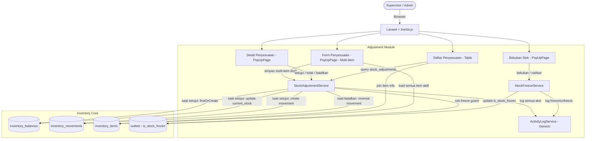
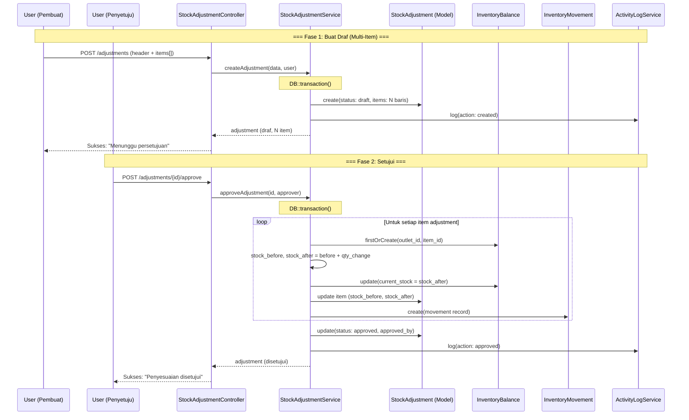
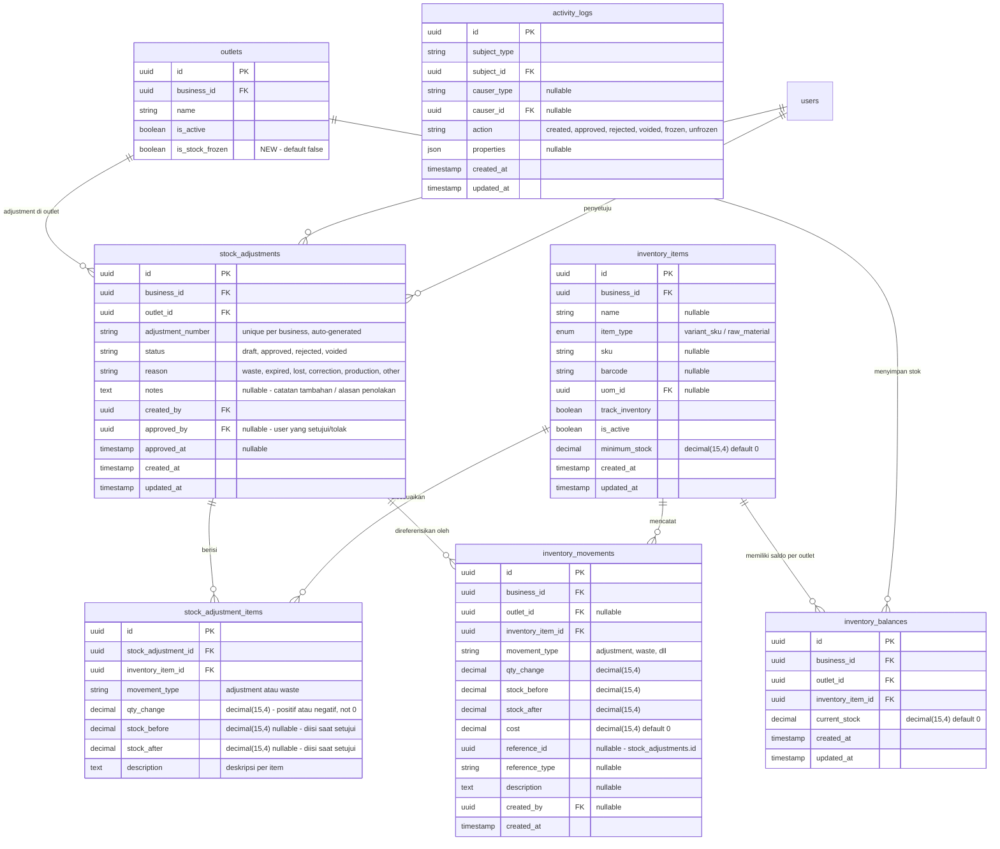

# PRD — Inventory - Stock Adjustment (Penyesuaian Stok)

## 1. Overview

Modul Stock Adjustment bertanggung jawab untuk mengelola proses **koreksi stok manual** yang terjadi di luar transaksi operasional normal (seperti penjualan atau pembelian). Penyesuaian stok diperlukan ketika terdapat selisih antara stok sistem dengan kondisi fisik barang yang disebabkan oleh berbagai faktor — barang rusak, kedaluwarsa, hilang, salah input, atau penyesuaian lainnya. Modul ini mendukung penyesuaian **multi-item per dokumen** — pengguna memilih outlet, menambahkan satu atau lebih item beserta jumlah perubahannya, memilih alasan, lalu menyimpan sebagai draft. Adjustment memiliki **approval workflow** — adjustment yang dibuat berstatus `Draf` dan baru memengaruhi stok setelah di-approve. Seluruh tipe inventory item (`raw_material` maupun `variant_sku`) dapat disesuaikan melalui modul ini. Modul ini juga menyediakan fitur **Bekukan Stok (Freeze Stock)** yang mengunci seluruh pergerakan stok pada outlet tertentu untuk keperluan penghitungan fisik atau audit.

---

## 2. Requirements

- **Outlet-Scoped Adjustment:** Seluruh adjustment wajib memiliki `outlet_id`. Perubahan stok hanya berlaku pada outlet yang dipilih. Balance yang diperbarui adalah record di `inventory_balances` dengan kombinasi `(outlet_id, inventory_item_id)`.
- **Adjustment Document:** Sistem harus menyediakan dokumen header adjustment (`stock_adjustments`) dengan nomor unik (`adjustment_number`) yang dihasilkan otomatis. Satu dokumen adjustment dapat memiliki satu atau lebih item penyesuaian (`stock_adjustment_items`).
- **Multi-Item Input:** Form pembuatan adjustment harus mendukung input lebih dari satu item dalam satu dokumen. Pengguna dapat menambah dan menghapus baris item secara dinamis. Kolom **Jumlah Item** pada halaman daftar terhitung otomatis berdasarkan jumlah `stock_adjustment_items` yang terkait dengan dokumen.
- **Adjustment Reason (Wajib):** Setiap dokumen adjustment wajib memiliki alasan (`reason`). Alasan ditampilkan dalam bahasa Indonesia:
  - `waste` — Rusak / Terbuang
  - `expired` — Kedaluwarsa
  - `lost` — Hilang
  - `correction` — Koreksi
  - `production` — Produksi
  - `other` — Lainnya (wajib mengisi deskripsi)
- **Bidirectional Quantity:** Qty penyesuaian (`qty_change`) mendukung nilai positif (penambahan stok) maupun negatif (pengurangan stok). Nilai nol tidak diperbolehkan.
- **Stock Validation:** Saat qty_change negatif, sistem harus memvalidasi bahwa stok setelah penyesuaian tidak menjadi negatif (`stock_after >= 0`), kecuali jika business setting mengizinkan stok negatif.
- **All Inventory Item Types:** Seluruh tipe inventory item yang aktif (`is_active = true`) dapat dipilih untuk adjustment, baik `raw_material` maupun `variant_sku`. Tidak ada pembatasan berdasarkan `item_type`.
- **Movement Type Mapping:** Setiap item adjustment menghasilkan `inventory_movement` dengan movement type yang sesuai dengan alasan:
  - `waste` / `expired` → `InventoryMovementType::Waste`
  - `correction` / `other` / `lost` / `production` → `InventoryMovementType::Adjustment`
- **Balance Auto-Create:** Jika `inventory_balances` untuk kombinasi `(outlet_id, inventory_item_id)` belum ada, sistem harus otomatis membuatnya dengan `current_stock = 0` (menggunakan `firstOrCreate`) sebelum menerapkan penyesuaian.
- **Atomic Transaction:** Seluruh proses adjustment (update balance + create movement + create adjustment record) harus dibungkus dalam `DB::transaction()` untuk menjamin konsistensi data.
- **Description (Wajib):** Setiap item adjustment wajib memiliki deskripsi detail (`description`) yang menjelaskan alasan spesifik penyesuaian item tersebut.
- **Auditability:** Seluruh adjustment tercatat di `inventory_movements` dengan `created_by`, `reference_id` (mengarah ke `stock_adjustments`), `reference_type`, dan `created_at`. Tidak ada perubahan stok tanpa history.
- **Activity Logging:** Setiap perubahan status adjustment dicatat oleh `ActivityLogService` ke tabel `activity_logs` dengan subject = `StockAdjustment`, action = `created` / `approved` / `rejected` / `voided`, dan properties berisi ringkasan perubahan.
- **Approval Workflow:** Dokumen adjustment mendukung status flow: `Draf` → `Disetujui` / `Ditolak`. Adjustment yang baru dibuat berstatus `Draf` dan **belum memengaruhi stok**. Stok hanya berubah saat user ber-permission `inventory.adjustment.approve` meng-approve dokumen. Jika ditolak, adjustment tidak memengaruhi stok dan tidak dapat diubah lagi. Adjustment yang sudah `Disetujui` dapat di-void oleh Owner/Admin.
- **No Physical Delete:** Dokumen adjustment tidak boleh dihapus secara permanen. Draft yang belum di-approve dapat ditolak. Adjustment yang sudah `Disetujui` hanya bisa dibatalkan melalui mekanisme void yang menghasilkan reversal movement.
- **Stok Sebelum & Sesudah:** Setiap adjustment item wajib mencatat `stock_before` dan `stock_after` untuk keperluan audit dan rekonsiliasi. Nilai ini dihitung **saat approval** (bukan saat pembuatan draft).
- **Freeze Stock:** Sistem mendukung fitur pembekuan stok per outlet. Saat stok dibekukan pada suatu outlet, **seluruh pergerakan stok di outlet tersebut ditolak** (penjualan, pembelian, transfer, adjustment) kecuali oleh proses unfreeze. Fitur ini digunakan untuk keperluan stock opname atau audit fisik agar tidak ada pergerakan stok selama penghitungan berlangsung. Status freeze disimpan pada tabel `outlets` (kolom `is_stock_frozen`).

---

## 3. Core Features

- **Buat Penyesuaian (Multi-Item Draft):** Pengguna membuat dokumen adjustment dengan memilih outlet dan alasan, lalu menambahkan satu atau lebih item secara dinamis. Setiap item memiliki: pilihan inventory item, qty perubahan, dan deskripsi. Jumlah item otomatis terhitung. Dokumen disimpan sebagai `Draf` dan belum memengaruhi stok.
- **Setujui Penyesuaian:** User ber-permission meng-approve dokumen adjustment. Saat disetujui, sistem menghitung stock_before/stock_after, memperbarui `inventory_balances`, dan membuat record `inventory_movements` secara atomic.
- **Tolak Penyesuaian:** User ber-permission menolak dokumen adjustment. Status berubah menjadi `Ditolak` dan tidak ada perubahan stok.
- **Daftar Penyesuaian:** Tabel seluruh adjustment yang pernah dibuat: nomor adjustment, tanggal, outlet, alasan (bahasa Indonesia), jumlah item (auto-count), status (bahasa Indonesia), pembuat, dan approver. Mendukung filter dan pencarian. Tersedia tombol **Bekukan Stok**.
- **Detail Penyesuaian (PopUpPage):** Detail lengkap satu dokumen dalam PopUpPage — header (nomor, outlet, alasan, status, pembuat, approver), tabel item beserta qty perubahan dan stok sebelum/sesudah (jika sudah disetujui). Tombol aksi sesuai status.
- **Batalkan Penyesuaian (Void):** Untuk membatalkan adjustment yang sudah `Disetujui`, Owner/Admin melakukan void yang menghasilkan reversal movement.
- **Bekukan Stok (Freeze Stock):** Tombol pada halaman utama untuk mengaktifkan/menonaktifkan pembekuan stok pada outlet aktif. Saat dibekukan, seluruh pergerakan stok di outlet tersebut ditolak oleh sistem.
- **Filter & Pencarian:** Pencarian berdasarkan nomor adjustment atau nama item. Filter berdasarkan: status, alasan, outlet, dan rentang tanggal.
- **Ekspor Riwayat:** Ekspor riwayat adjustment ke Excel/CSV untuk keperluan audit.
- **Pencatatan Aktivitas:** Mencatat semua aksi (Buat, Setujui, Tolak, Batalkan) menggunakan `ActivityLogService`.

---

## 4. User Flow

### **Membuat Penyesuaian (Multi-Item Draft)**
1. User masuk ke menu **Inventori > Penyesuaian**.
2. Sistem menampilkan daftar dokumen adjustment dengan kolom: No. Penyesuaian, Tanggal, Outlet, Alasan, Jumlah Item, Status, Pembuat.
3. User klik **Buat Penyesuaian**.
4. Sistem menampilkan form PopUpPage dengan field:
   - **Outlet** — Dropdown outlet aktif milik bisnis.
   - **Alasan** — Dropdown: Rusak / Terbuang, Kedaluwarsa, Hilang, Koreksi, Produksi, Lainnya.
   - **Catatan** — Textarea (opsional) catatan umum untuk dokumen.
   - **Daftar Item** — Tabel dinamis yang dapat ditambah/hapus baris. Setiap baris berisi:
     - **Item** — Dropdown inventory item aktif (semua tipe). Menampilkan: `{nama} (Stok: {qty} {satuan})`. Stok yang ditampilkan adalah stok di outlet terpilih.
     - **Jumlah Perubahan** — Input angka. Positif untuk penambahan, negatif untuk pengurangan.
     - **Deskripsi** — Input teks untuk penjelasan per item.
     - **Hapus** — Tombol untuk menghapus baris item.
   - **Tombol Tambah Item** — Menambahkan baris item baru ke dalam tabel.
   - **Jumlah Item** — Terhitung otomatis dari jumlah baris item yang diinput (ditampilkan di summary/footer form).
5. User mengisi header dan menambahkan minimal 1 item.
6. User klik **Simpan sebagai Draf**.
7. Sistem melakukan validasi:
   - Outlet dan alasan wajib diisi.
   - Minimal 1 item harus diinput.
   - Setiap item: inventory_item_id, qty_change, dan deskripsi wajib diisi.
   - Qty tidak boleh nol.
   - Item harus aktif (`is_active = true`).
   - Tidak boleh ada item duplikat dalam satu dokumen.
8. Sistem dalam satu `DB::transaction()`:
   a. Buat record `stock_adjustments` dengan status `draft`, reason, outlet_id, notes.
   b. Buat record `stock_adjustment_items` untuk setiap item (tanpa stock_before/stock_after — dihitung saat approve).
   c. Catat ke `activity_logs` (action: `created`).
9. Sistem menampilkan pesan sukses: "Penyesuaian berhasil disimpan sebagai draf. Menunggu persetujuan."

### **Menyetujui Penyesuaian**
1. User (Supervisor/Owner) masuk ke menu **Inventori > Penyesuaian**.
2. User melihat adjustment berstatus `Draf` (ditandai badge kuning).
3. User klik baris adjustment untuk membuka **Detail PopUpPage**.
4. Sistem menampilkan detail: header (No., Outlet, Alasan, Pembuat, Tanggal), tabel item (Nama Item, Qty Perubahan, Deskripsi).
5. User klik tombol **Setujui**.
6. Sistem menampilkan dialog konfirmasi: "Apakah Anda yakin ingin menyetujui penyesuaian ini? Stok akan berubah sesuai data berikut."
7. User konfirmasi. Sistem dalam satu `DB::transaction()`:
   a. Untuk setiap item adjustment:
      - Ambil atau buat `inventory_balances` (`firstOrCreate`).
      - Catat `stock_before` ke `stock_adjustment_items`.
      - Hitung `stock_after = stock_before + qty_change`.
      - Validasi `stock_after >= 0` (jika business tidak izinkan stok negatif).
      - Update `inventory_balances.current_stock`.
      - Catat `stock_after` ke `stock_adjustment_items`.
      - Buat record `inventory_movements`.
   b. Update `stock_adjustments.status` = `approved`, set `approved_by` dan `approved_at`.
   c. Catat ke `activity_logs` (action: `approved`).
8. Sistem menampilkan pesan sukses dan PopUpPage menampilkan status terbaru beserta stock_before/stock_after per item.

### **Menolak Penyesuaian**
1. User (Supervisor/Owner) membuka Detail PopUpPage adjustment berstatus `Draf`.
2. User klik tombol **Tolak**.
3. Sistem menampilkan dialog konfirmasi dengan input catatan alasan penolakan.
4. User mengisi alasan dan konfirmasi.
5. Sistem update `stock_adjustments.status` = `rejected`, set `approved_by` (penolak), `approved_at`, dan catatan penolakan ke `notes`.
6. Catat ke `activity_logs` (action: `rejected`).
7. Tidak ada perubahan stok. Adjustment tidak dapat diubah lagi.

### **Membatalkan Penyesuaian (Void)**
1. User (Owner/Admin) membuka Detail PopUpPage adjustment berstatus `Disetujui`.
2. User klik tombol **Batalkan**.
3. Sistem menampilkan konfirmasi: "Apakah Anda yakin ingin membatalkan penyesuaian ini? Stok akan dikembalikan."
4. User konfirmasi. Sistem dalam satu `DB::transaction()`:
   a. Untuk setiap item adjustment:
      - Ambil balance saat ini.
      - Buat reversal movement (qty berlawanan).
      - Update `inventory_balances.current_stock`.
   b. Update `stock_adjustments.status` = `voided`.
   c. Catat ke `activity_logs` (action: `voided`).
5. Stok dikembalikan.

### **Melihat Detail Penyesuaian (PopUpPage)**
1. User klik baris adjustment di daftar.
2. Sistem membuka **PopUpPage** detail dengan informasi:
   - **Header:** No. Penyesuaian, Outlet, Alasan (bahasa Indonesia), Status (badge warna, bahasa Indonesia), Catatan, Dibuat oleh, Tanggal Dibuat, Disetujui/Ditolak oleh, Tanggal Disetujui/Ditolak.
   - **Tabel Item:** Nama Item, SKU, Satuan, Qty Perubahan (+/-), Stok Sebelum, Stok Sesudah, Deskripsi. Menampilkan **Jumlah Item** (total baris) di footer tabel.
   - **Footer Aksi:** Tombol sesuai status:
     - Status `Draf` → **Setujui** (btn-main) + **Tolak** (btn-danger)
     - Status `Disetujui` → **Batalkan** (btn-danger) — hanya untuk Owner/Admin
     - Status `Ditolak` / `Dibatalkan` → Tidak ada tombol aksi (read-only)
3. User melakukan aksi atau menutup PopUpPage.

### **Bekukan Stok (Freeze Stock)**
1. User (Supervisor/Owner) masuk ke menu **Inventori > Penyesuaian**.
2. User klik tombol **Bekukan Stok** di header halaman.
3. Sistem menampilkan PopUpPage/dialog:
   - **Outlet** — Dropdown outlet aktif. Menampilkan status freeze saat ini per outlet.
   - Tombol **Bekukan** (jika outlet belum beku) atau **Cairkan** (jika outlet sudah beku).
4. User memilih outlet dan klik **Bekukan**.
5. Sistem mengupdate `outlets.is_stock_frozen = true` dan mencatat ke `activity_logs`.
6. Selama outlet dibekukan:
   - Seluruh transaksi yang mengubah stok (penjualan, pembelian, transfer, adjustment) **ditolak** oleh sistem dengan pesan: "Stok outlet ini sedang dibekukan. Hubungi admin untuk mencairkan."
   - Badge/indikator **Stok Dibekukan** tampil di header halaman.
7. Untuk mencairkan, user klik **Cairkan** pada outlet bersangkutan. Sistem mengupdate `outlets.is_stock_frozen = false`.

---

## 5. Architecture

Modul Stock Adjustment mengikuti pendekatan **Modular Monolith** dengan pola Controller → Service → Model. Adjustment memiliki status flow (`draft` → `approved` / `rejected`). Perubahan stok hanya terjadi saat approval. Freeze stock menggunakan guard check pada setiap operasi yang mengubah stok.

### Sequence Diagram — Buat & Setujui Penyesuaian

---

## 6. Database Schema

### Tabel yang Digunakan

**Tabel Baru:**
- `stock_adjustments` (**NEW**) — Header dokumen adjustment dengan approval workflow.
- `stock_adjustment_items` (**NEW**) — Detail item per dokumen adjustment (multi-item).

**Tabel Existing yang Dimodifikasi:**
- `outlets` (**MODIFY**) — Ditambahkan kolom `is_stock_frozen` (boolean, default false).

**Tabel Existing yang Digunakan:**
- `inventory_movements` — Setiap item adjustment yang disetujui menghasilkan movement record.
- `inventory_balances` — Snapshot stok yang diperbarui saat adjustment disetujui.
- `inventory_items` — Master data item untuk dropdown (semua tipe).
- `activity_logs` — Audit trail via `ActivityLogService`.

### Catatan Desain Penting

| Aspek | Detail |
|---|---|
| **Alur status** | `draft` → `approved` (stok berubah) atau `rejected` (stok tidak berubah). `approved` → `voided` (stok di-reversal) |
| **Stock_before/after timing** | Diisi **saat approve**, bukan saat draft — karena stok bisa berubah antara pembuatan draft dan approval |
| **Multi-item** | Satu dokumen adjustment dapat memiliki banyak item. Jumlah item di halaman daftar = `COUNT(stock_adjustment_items)` |
| **Balance lookup** | Menggunakan `firstOrCreate` — jika balance belum ada, dibuat otomatis dengan `current_stock = 0` |
| **Movement type mapping** | `waste` dan `expired` → `Waste`. Alasan lainnya → `Adjustment` |
| **Movement reference** | Polymorphic: `reference_id` → `stock_adjustments.id` |
| **Adjustment number format** | `ADJ-{YYYYMMDD}-{sequence}`, contoh: `ADJ-20260728-001` |
| **Semua tipe item** | Dropdown menampilkan **semua** inventory item aktif, tanpa filter `item_type` |
| **Freeze stock** | Kolom `is_stock_frozen` pada `outlets`. Guard check di setiap service yang mengubah stok |
| **Decimal precision** | Semua kolom qty: `decimal(15,4)` |

---

## 7. Tech Stack

- **Frontend:** Vue 3 (Composition API `<script setup>`) + Tailwind CSS v4 + Inertia.js. Form penyesuaian (multi-item) dan detail penyesuaian menggunakan `PopUpPage`. Halaman daftar menggunakan pola `Container > ContainerHeader + Table + Pagination`. Komponen form: `DropdownField`, `TextField`, `TextareaField`. Daftar item dinamis menggunakan `v-for` dengan tombol Tambah/Hapus.
- **Backend:** Laravel 11 (PHP 8.3). Arsitektur Controller → Service → Model.
- **Services:**
  - `StockAdjustmentService` — Logika inti:
    - `createAdjustment()`: Membuat dokumen draft multi-item (tanpa perubahan stok).
    - `approveAdjustment()`: Freeze guard check, validasi, update balance per item, create movement, update status. Dibungkus `DB::transaction()`.
    - `rejectAdjustment()`: Update status ke `rejected`, simpan catatan penolakan.
    - `voidAdjustment()`: Freeze guard check, buat reversal movement per item, kembalikan stok, update status. Dibungkus `DB::transaction()`.
  - `StockFreezeService` — Logika bekukan/cairkan stok:
    - `freezeOutlet()`: Set `is_stock_frozen = true`.
    - `unfreezeOutlet()`: Set `is_stock_frozen = false`.
    - `assertNotFrozen()`: Guard check — throw exception jika outlet dibekukan.
  - `ActivityLogService` (Generic) — Mencatat audit trail setiap aksi.
- **Request Validation:**
  - `StoreStockAdjustmentRequest` — Validasi pembuatan draft multi-item:
    - `outlet_id` (required, uuid, exists)
    - `reason` (required, string, in:waste,expired,lost,correction,production,other)
    - `notes` (nullable, string)
    - `items` (required, array, min:1)
    - `items.*.inventory_item_id` (required, uuid, exists, distinct)
    - `items.*.qty_change` (required, numeric, not_in:0)
    - `items.*.description` (required, string)
  - `RejectStockAdjustmentRequest` — Validasi: `notes` (required, string).
- **Enum (PHP):**
  - `AdjustmentStatus` — `Draft = 'draft'`, `Approved = 'approved'`, `Rejected = 'rejected'`, `Voided = 'voided'`. Method `label()`: Draf, Disetujui, Ditolak, Dibatalkan.
  - `AdjustmentReason` — `Waste = 'waste'`, `Expired = 'expired'`, `Lost = 'lost'`, `Correction = 'correction'`, `Production = 'production'`, `Other = 'other'`. Method `label()`: Rusak / Terbuang, Kedaluwarsa, Hilang, Koreksi, Produksi, Lainnya.
  - `InventoryMovementType` — Existing enum.
- **Model:** `StockAdjustment` (NEW), `StockAdjustmentItem` (NEW), `InventoryBalance`, `InventoryMovement`.
- **Database:** PostgreSQL, UUID primary key, `decimal(15,4)` untuk quantity. Semua mutation dalam `DB::transaction()`.
- **Authorization:** Spatie Laravel Permission.
- **Routes:**
  - `GET inventory/adjustments` — daftar penyesuaian
  - `POST inventory/adjustments` — buat draf (multi-item)
  - `GET inventory/adjustments/{id}` — detail (data untuk PopUpPage)
  - `POST inventory/adjustments/{id}/approve` — setujui
  - `POST inventory/adjustments/{id}/reject` — tolak
  - `POST inventory/adjustments/{id}/void` — batalkan
  - `POST inventory/adjustments/freeze` — bekukan stok outlet
  - `POST inventory/adjustments/unfreeze` — cairkan stok outlet

---

## 8. Hak Akses (Authorization)

| Permission | Kasir | Supervisor | Owner / Admin |
|---|---|---|---|
| `inventory.adjustment.read` | Tidak | Ya | Ya |
| `inventory.adjustment.create` | Tidak | Ya | Ya |
| `inventory.adjustment.approve` | Tidak | Ya | Ya |
| `inventory.adjustment.void` | Tidak | Tidak | Ya |
| `inventory.adjustment.export` | Tidak | Ya | Ya |
| `inventory.adjustment.freeze` | Tidak | Ya | Ya |

**Penjelasan:**
- **Kasir** tidak memiliki akses ke fitur penyesuaian.
- **Supervisor** dapat membuat draf, menyetujui/menolak draf dari user lain, dan membekukan/mencairkan stok outlet. Supervisor **tidak bisa menyetujui penyesuaian buatan sendiri** (segregation of duties).
- **Owner / Admin** memiliki akses penuh termasuk void dan menyetujui penyesuaian milik sendiri.

---

## 9. Validasi & Error Handling

| Skenario | Validasi | Pesan Error |
|---|---|---|
| Item kosong | `required, array, min:1` | "Minimal 1 item harus ditambahkan." |
| Qty change = 0 | `not_in:0` | "Jumlah perubahan tidak boleh nol." |
| Item duplikat | `distinct` pada `items.*.inventory_item_id` | "Item tidak boleh duplikat dalam satu dokumen." |
| Outlet tidak valid | `exists:outlets,id` | "Outlet tidak ditemukan." |
| Item tidak valid | `exists:inventory_items,id` | "Item inventory tidak ditemukan." |
| Deskripsi item kosong | `required` per item | "Deskripsi per item wajib diisi." |
| Stok negatif (saat setujui) | Custom validation | "Stok tidak mencukupi. Stok saat ini: {stok}, perubahan: {qty}." |
| Item tidak aktif | Custom validation | "Item tidak aktif dan tidak dapat disesuaikan." |
| Setujui non-draf | Status check | "Hanya penyesuaian berstatus Draf yang dapat disetujui." |
| Tolak non-draf | Status check | "Hanya penyesuaian berstatus Draf yang dapat ditolak." |
| Batalkan non-disetujui | Status check | "Hanya penyesuaian berstatus Disetujui yang dapat dibatalkan." |
| Self-approve (Supervisor) | Permission check | "Anda tidak dapat menyetujui penyesuaian yang Anda buat sendiri." |
| Alasan penolakan kosong | `required` | "Alasan penolakan wajib diisi." |
| Outlet dibekukan (saat setujui) | Freeze guard | "Stok outlet ini sedang dibekukan. Hubungi admin untuk mencairkan." |
| Outlet dibekukan (saat void) | Freeze guard | "Stok outlet ini sedang dibekukan. Hubungi admin untuk mencairkan." |

---

## 10. UI Components Reference

### Halaman Daftar Penyesuaian

**Header:** "Penyesuaian Stok" dengan tombol **Buat Penyesuaian** (btn-main) dan **Bekukan Stok** (btn-warning) di kanan.

**Kolom Tabel:**

| Kolom | Sumber Data | Keterangan |
|---|---|---|
| No. Penyesuaian | `stock_adjustments.adjustment_number` | Format: ADJ-YYYYMMDD-NNN |
| Tanggal | `stock_adjustments.created_at` | Format: dd MMM yyyy HH:mm |
| Outlet | `outlet.name` | Via relasi |
| Alasan | `stock_adjustments.reason` | Badge bahasa Indonesia: Rusak, Kedaluwarsa, Hilang, Koreksi, Produksi, Lainnya |
| Jumlah Item | `stock_adjustment_items_count` | Auto-count via `withCount('items')` |
| Status | `stock_adjustments.status` | Badge: Draf (kuning), Disetujui (hijau), Ditolak (merah), Dibatalkan (abu-abu) |
| Pembuat | `creator.name` | Via relasi created_by |
| Aksi | - | Tombol: Lihat Detail (membuka PopUpPage) |

**Filter:**
- Pencarian: nomor penyesuaian atau nama item
- Status: dropdown (Semua, Draf, Disetujui, Ditolak, Dibatalkan)
- Alasan: dropdown (Semua, Rusak / Terbuang, Kedaluwarsa, Hilang, Koreksi, Produksi, Lainnya)
- Outlet: dropdown outlet aktif

### Form Penyesuaian (PopUpPage — Buat Multi-Item)

**Header Section:**

| Field | Tipe | Wajib | Keterangan |
|---|---|---|---|
| Outlet | Dropdown | Ya | Outlet aktif milik bisnis |
| Alasan | Dropdown | Ya | Rusak / Terbuang, Kedaluwarsa, Hilang, Koreksi, Produksi, Lainnya |
| Catatan | Textarea | Tidak | Catatan umum dokumen |

**Tabel Item Dinamis:**

| Kolom | Tipe | Wajib | Keterangan |
|---|---|---|---|
| Item | Dropdown | Ya | Semua item aktif. Tampil: `{nama} (Stok: {qty} {satuan})` |
| Jumlah Perubahan | Number input | Ya | Positif/negatif, bukan 0 |
| Deskripsi | Text input | Ya | Penjelasan per item |
| Hapus | Tombol | - | Ikon trash, hapus baris item |

**Footer:**
- Kiri: **Jumlah Item: {N}** (auto-count)
- Kanan: Tombol **Batal** (btn-flat) dan **Simpan sebagai Draf** (btn-main)
- Tombol **+ Tambah Item** di bawah tabel item

### Detail Penyesuaian (PopUpPage — Lihat)

**Header Section:**

| Field | Keterangan |
|---|---|
| No. Penyesuaian | ADJ-20260728-001 |
| Outlet | Outlet A |
| Alasan | Badge: Rusak / Terbuang |
| Status | Badge warna: Draf / Disetujui / Ditolak / Dibatalkan |
| Catatan | Catatan dokumen atau alasan penolakan |
| Dibuat oleh | Nama user + tanggal |
| Disetujui/Ditolak oleh | Nama user + tanggal (jika sudah diproses) |

**Tabel Item:**

| Kolom | Keterangan |
|---|---|
| Nama Item | Nama inventory item |
| SKU | Kode SKU |
| Satuan | UOM |
| Qty Perubahan | Hijau (+) atau Merah (-), bold |
| Stok Sebelum | Tampil setelah disetujui |
| Stok Sesudah | Tampil setelah disetujui |
| Deskripsi | Deskripsi per item |

**Footer Tabel:** Jumlah Item: {N}

**Footer Aksi (sesuai status):**
- Status `Draf` → **Setujui** (btn-main) + **Tolak** (btn-danger)
- Status `Disetujui` → **Batalkan** (btn-danger) — hanya Owner/Admin
- Status `Ditolak` / `Dibatalkan` → Tidak ada tombol aksi (read-only)

### Dialog Bekukan Stok (PopUpPage)

| Field | Keterangan |
|---|---|
| Outlet | Dropdown outlet aktif. Setiap opsi menampilkan status: `{nama} — Aktif` atau `{nama} — Dibekukan` |
| Tombol | **Bekukan** (btn-warning) jika outlet aktif, **Cairkan** (btn-main) jika outlet dibekukan |

### Contoh Data Tabel

| No. Penyesuaian | Tanggal | Outlet | Alasan | Jumlah Item | Status | Pembuat |
|---|---|---|---|---|---|---|
| ADJ-20260728-001 | 28 Jul 2026 14:30 | Outlet A | Rusak / Terbuang | 3 | Draf | Budi |
| ADJ-20260728-002 | 28 Jul 2026 10:15 | Outlet A | Koreksi | 1 | Disetujui | Sari |
| ADJ-20260727-001 | 27 Jul 2026 09:00 | Outlet B | Kedaluwarsa | 5 | Ditolak | Andi |

### Mapping Label Bahasa Indonesia

**Status:**

| Value (DB) | Label (Tampilan) | Warna Badge |
|---|---|---|
| `draft` | Draf | Kuning |
| `approved` | Disetujui | Hijau |
| `rejected` | Ditolak | Merah |
| `voided` | Dibatalkan | Abu-abu |

**Alasan:**

| Value (DB) | Label (Tampilan) |
|---|---|
| `waste` | Rusak / Terbuang |
| `expired` | Kedaluwarsa |
| `lost` | Hilang |
| `correction` | Koreksi |
| `production` | Produksi |
| `other` | Lainnya |
