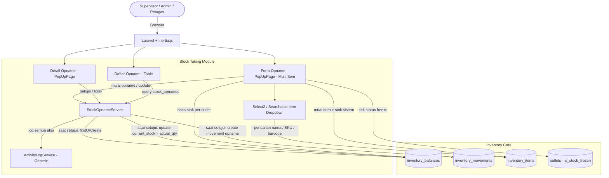
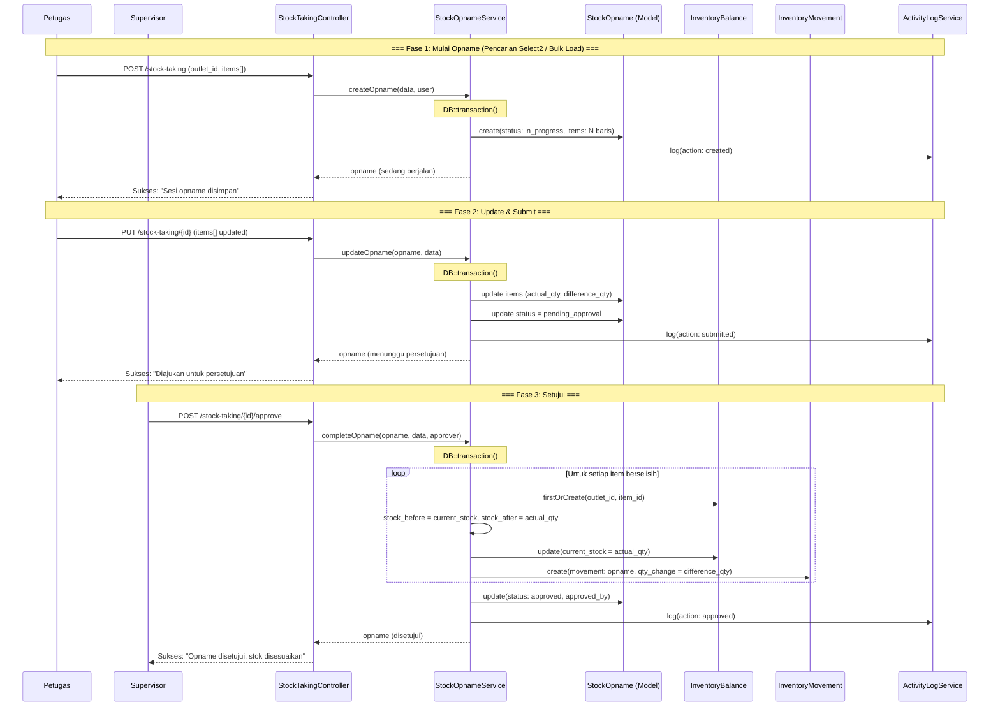
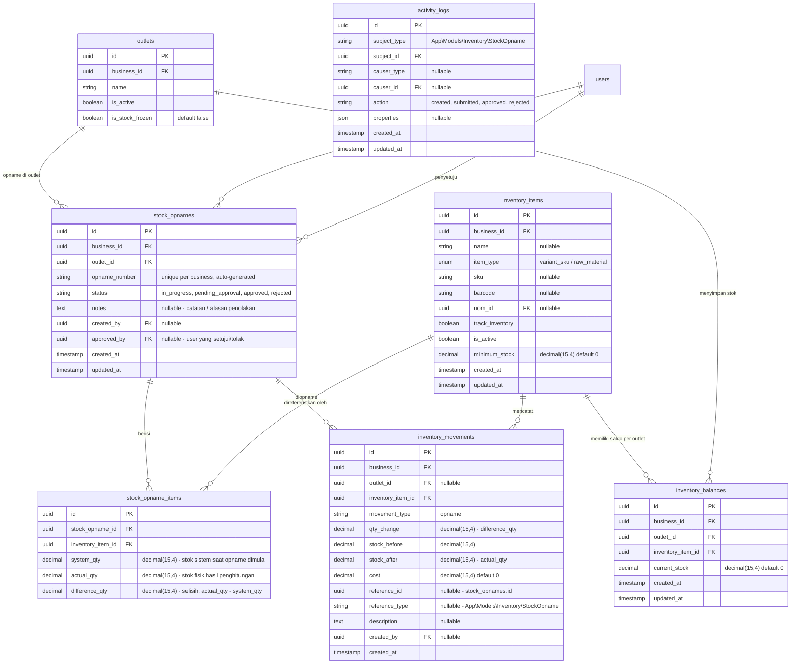

# PRD — Inventory - Stock Taking / Opname (Penghitungan Stok Fisik)

## 1. Overview

Modul Stock Taking (Opname) bertanggung jawab untuk mengelola proses **penghitungan fisik stok** di outlet. Opname adalah prosedur rutin yang membandingkan jumlah stok yang tercatat di sistem dengan jumlah aktual barang yang ada secara fisik. Selisih antara stok sistem dan stok fisik secara otomatis menghasilkan penyesuaian (adjustment) pada inventory. Modul ini mendukung alur kerja **multi-tahap dengan approval** — sesi opname dimulai oleh petugas penghitung, hasilnya disubmit untuk diverifikasi, lalu disetujui oleh Supervisor/Owner yang berwenang. Saat disetujui, selisih stok otomatis diterapkan ke `inventory_balances` dan tercatat sebagai `inventory_movements` bertipe `opname`. Modul ini terintegrasi dengan fitur **Bekukan Stok (Freeze Stock)** dari modul Stock Adjustment — selama opname berlangsung, disarankan untuk membekukan stok outlet terkait agar tidak ada pergerakan stok lain yang mengganggu akurasi penghitungan. Seluruh tipe inventory item (`raw_material` maupun `variant_sku`) dapat diopname.

---

## 2. Requirements

- **Outlet-Scoped Opname:** Setiap sesi opname wajib memiliki `outlet_id`. Penghitungan fisik hanya berlaku untuk stok di outlet yang dipilih. Stok sistem diambil dari `inventory_balances` dengan kombinasi `(outlet_id, inventory_item_id)`.
- **Opname Document:** Sistem harus menyediakan dokumen header opname (`stock_opnames`) dengan nomor unik (`opname_number`) yang dihasilkan otomatis, format: `OP-{YYYYMM}-{sequence}`, contoh: `OP-202608-001`.
- **Multi-Item Input:** Satu dokumen opname berisi banyak item. Pengguna dapat memuat semua item inventory yang aktif di outlet terpilih sekaligus (tombol **Muat Semua Item**), atau menambahkan item secara spesifik. Sistem otomatis mengisi `system_qty` dari `inventory_balances.current_stock` per item per outlet.
- **Searchable Item Selection (Select2 UI/UX):** Saat memilih atau menambahkan item ke dalam form opname, sistem wajib menggunakan komponen dropdown pencarian interaktif (**Select2 / Searchable Select**). Komponen ini harus mendukung pencarian cepat (instant search) berdasarkan **Nama Item**, **Kode SKU**, maupun **Barcode**. Hal ini bertujuan memberikan pengalaman UI/UX yang intuitif, fleksibel, dan efisien tanpa memaksa pengguna melakukan scroll manual pada daftar item yang sangat panjang.
- **All Inventory Item Types:** Seluruh tipe inventory item yang aktif (`is_active = true`) dapat diopname, baik `raw_material` maupun `variant_sku`. Tidak ada pembatasan berdasarkan `item_type`.
- **Penghitungan Fisik:** Untuk setiap item, pengguna menginput jumlah fisik aktual (`actual_qty`). Sistem secara otomatis menghitung selisih (`difference_qty = actual_qty - system_qty`).
- **Selisih Otomatis:** Selisih positif berarti stok fisik lebih banyak dari sistem (surplus). Selisih negatif berarti stok fisik lebih sedikit (shortage/kehilangan). Selisih nol berarti stok cocok.
- **Status Flow dengan Approval:** Dokumen opname mendukung alur status:
  - `Sedang Berjalan` (`in_progress`) — Sesi opname sedang berlangsung, data masih bisa diubah.
  - `Menunggu Persetujuan` (`pending_approval`) — Petugas sudah menyelesaikan input data fisik dan mengajukan untuk di-review.
  - `Disetujui` (`approved`) — Supervisor/Owner telah menyetujui, stok otomatis disesuaikan.
  - `Ditolak` (`rejected`) — Supervisor/Owner menolak hasil opname (misal: data tidak valid).
- **Stok Disesuaikan Saat Approve:** Perubahan stok **hanya terjadi saat status berubah ke `Disetujui`**. Pada saat itu, sistem:
  - Memperbarui `inventory_balances.current_stock` menjadi `actual_qty` untuk setiap item yang memiliki selisih.
  - Membuat record `inventory_movements` bertipe `opname` dengan `qty_change = difference_qty`.
  - Menyimpan `reference_id` dan `reference_type` pada movement yang mengarah ke `stock_opnames` (polymorphic).
- **Balance Auto-Create:** Jika `inventory_balances` untuk kombinasi `(outlet_id, inventory_item_id)` belum ada, sistem harus otomatis membuatnya dengan `current_stock = 0` (menggunakan `firstOrCreate`).
- **Integrasi Freeze Stock:** Saat opname berlangsung di suatu outlet, disarankan untuk mengaktifkan fitur **Bekukan Stok** (`outlets.is_stock_frozen = true`) agar tidak ada pergerakan stok lain (penjualan, pembelian, transfer, adjustment) yang mengubah data selama penghitungan. Modul opname menampilkan pengingat untuk membekukan stok saat memulai sesi baru.
- **Atomic Transaction:** Seluruh proses penyesuaian stok saat approval harus dibungkus dalam `DB::transaction()`.
- **Decimal Quantity:** Mendukung fractional quantity menggunakan `decimal(15,4)` pada semua kolom qty (`system_qty`, `actual_qty`, `difference_qty`).
- **Auditability:** Seluruh penyesuaian stok dari opname tercatat di `inventory_movements` dengan `created_by`, `reference_id`, `reference_type`, dan `created_at`.
- **Activity Logging:** Setiap perubahan status opname dicatat oleh `ActivityLogService` ke tabel `activity_logs` dengan subject = `StockOpname`, action = `created` / `submitted` / `approved` / `rejected`, dan properties berisi ringkasan.
- **Edit Selama In Progress:** Selama status `Sedang Berjalan`, data opname (items, actual_qty, catatan) masih dapat diubah. Setelah disubmit atau disetujui, data tidak dapat diubah lagi.
- **Soft Delete / Cancel:** Sesi opname yang masih `Sedang Berjalan` dapat dibatalkan (dihapus). Opname yang sudah `Menunggu Persetujuan` atau `Disetujui` tidak dapat dihapus.
- **Catatan (Notes):** Dokumen opname memiliki field catatan (`notes`) untuk mencatat informasi tambahan seperti kondisi lapangan, alasan selisih, dsb.

---

## 3. Core Features

- **Mulai Opname Baru:** Pengguna memulai sesi opname dengan memilih outlet. Sistem menghasilkan nomor opname otomatis dan membuat dokumen berstatus `Sedang Berjalan`. Pengguna dapat memuat semua item sekaligus atau memilih item tertentu menggunakan komponen pencarian interaktif (**Select2 UI/UX**).
- **Penambahan Item Interaktif (Select2 UI/UX):** Pengguna dapat mencari dan menambahkan item secara instan berdasarkan Nama, SKU, atau Barcode menggunakan dropdown **Select2 / Searchable Select** untuk kemudahan navigasi dan efisiensi input.
- **Input Penghitungan Fisik:** Pengguna menginput jumlah fisik aktual (`actual_qty`) per item. Selisih otomatis terhitung dan ditampilkan real-time dengan indikator warna (merah untuk shortage, hijau untuk surplus, abu-abu untuk cocok).
- **Update Opname:** Selama status `Sedang Berjalan`, pengguna dapat mengubah data penghitungan fisik, menambah/mengurangi baris item, dan memperbarui catatan.
- **Submit untuk Persetujuan:** Pengguna menyelesaikan input dan mengajukan hasil opname. Status berubah ke `Menunggu Persetujuan`. Data tidak dapat diubah lagi kecuali oleh approver.
- **Setujui Opname:** Supervisor/Owner mereview hasil opname dan menyetujui. Stok otomatis disesuaikan: `current_stock` diperbarui ke `actual_qty`, movement `opname` dibuat untuk setiap item berselisih.
- **Tolak Opname:** Supervisor/Owner menolak hasil opname dengan catatan alasan. Tidak ada perubahan stok. Status berubah ke `Ditolak`.
- **Daftar Opname:** Tabel seluruh sesi opname: nomor opname, tanggal mulai, outlet, jumlah item, jumlah selisih, status (bahasa Indonesia), pembuat, dan penyetuju. Mendukung filter dan pencarian.
- **Detail Opname (PopUpPage):** Detail lengkap satu sesi opname dalam PopUpPage — header (nomor, outlet, status, catatan, pembuat, penyetuju), tabel item (nama, SKU, stok sistem, stok fisik, selisih). Tombol aksi sesuai status.
- **Batalkan Opname:** Menghapus sesi opname yang masih `Sedang Berjalan`.
- **Pencatatan Aktivitas:** Mencatat semua aksi menggunakan `ActivityLogService`.
- **Ekspor ke PDF:** Setiap header opname beserta isinya dapat di ekspor melalui pdf.

---

## 4. User Flow

### **Memulai Opname Baru**
1. User masuk ke menu **Inventori > Stock Opname**.
2. Sistem menampilkan daftar sesi opname dengan kolom: No. Opname, Tanggal, Outlet, Jumlah Item, Status, Pembuat.
3. User klik **Mulai Opname Baru**.
4. Sistem menampilkan form PopUpPage:
    - **Outlet** — Dropdown outlet aktif milik bisnis.
    - **Catatan** — Textarea (opsional).
    - **Peringatan Freeze:** Jika outlet belum dibekukan, tampilkan peringatan: "Disarankan untuk membekukan stok outlet ini sebelum memulai opname agar data lebih akurat."
5. Setelah memilih outlet, pengguna dapat menambahkan item melalui dua metode:
    - **Metode A (Bulk Load):** Klik tombol **Muat Semua Item** untuk memuat seluruh item inventory aktif di outlet terpilih beserta stok sistemnya secara otomatis.
    - **Metode B (Pencarian Select2):** Gunakan komponen **Select2 / Searchable Select** di baris penambahan item untuk mengetik dan mencari barang secara live berdasarkan **Nama Item**, **Kode SKU**, atau **Barcode**, lalu menekan tombol Tambah.
6. Sistem memuat detail item yang dipilih beserta stok sistem (`inventory_balances.current_stock`). Jika balance belum ada, stok sistem = 0.
7. Untuk setiap item di tabel, sistem menampilkan:
    - Nama item, Kode SKU, satuan (UOM)
    - **Stok Sistem** — read-only, dari `inventory_balances`
    - **Stok Fisik** — input angka (default: sama dengan stok sistem)
    - **Selisih** — otomatis terhitung (`stok_fisik - stok_sistem`), dengan warna indikator
8. User menginput stok fisik per item berdasarkan penghitungan lapangan.
9. User klik **Simpan Opname**.
10. Sistem dalam satu `DB::transaction()`:
    a. Buat record `stock_opnames` dengan status `in_progress`.
    b. Buat record `stock_opname_items` untuk setiap item (system_qty, actual_qty, difference_qty).
    c. Catat ke `activity_logs` (action: `created`).
11. Sistem menampilkan pesan sukses: "Sesi opname berhasil disimpan."

### **Melanjutkan & Mengupdate Opname**
1. User membuka sesi opname berstatus `Sedang Berjalan` dari daftar.
2. Sistem menampilkan form PopUpPage dengan data yang sudah tersimpan.
3. User dapat menambah item baru (via **Select2 / Searchable Select**), mengubah stok fisik per item, menghapus baris item, atau menambah catatan.
4. User klik **Simpan Opname** untuk menyimpan perubahan, atau **Ajukan Persetujuan** untuk mengubah status ke `Menunggu Persetujuan`.
5. Jika mengajukan persetujuan:
    - Sistem memvalidasi bahwa semua item memiliki `actual_qty` yang valid.
    - Status berubah ke `pending_approval`.
    - Data tidak dapat diubah lagi oleh pembuat.
    - Catat ke `activity_logs` (action: `submitted`).

### **Menyetujui Opname**
1. User (Supervisor/Owner) masuk ke menu **Inventori > Stock Opname**.
2. User melihat opname berstatus `Menunggu Persetujuan` (badge biru).
3. User klik baris opname untuk membuka **Detail PopUpPage**.
4. Sistem menampilkan:
    - **Header:** No. Opname, Outlet, Status, Catatan, Dibuat oleh, Tanggal.
    - **Tabel Item:** Nama Item, SKU, Satuan, Stok Sistem, Stok Fisik, Selisih. Item berselisih diberi highlight merah.
    - **Ringkasan:** Total item, item cocok, item berselisih, total surplus, total shortage.
5. User mereview data dan klik **Setujui & Sesuaikan Stok**.
6. Sistem menampilkan dialog konfirmasi: "Apakah Anda yakin? Stok akan disesuaikan berdasarkan hasil penghitungan fisik."
7. User konfirmasi. Sistem dalam satu `DB::transaction()`:
    a. Untuk setiap item dengan `difference_qty != 0`:
        - Ambil atau buat `inventory_balances` (`firstOrCreate`).
        - Catat `stock_before = current_stock`.
        - Set `stock_after = actual_qty`.
        - Update `inventory_balances.current_stock = actual_qty`.
        - Buat `inventory_movements`:
            - `movement_type = opname`
            - `qty_change = difference_qty`
            - `stock_before`, `stock_after`
            - `reference_id = stock_opname.id`, `reference_type = StockOpname`
            - `description = "Penyesuaian stok dari Opname: {opname_number}"`
    b. Update `stock_opnames.status = approved`, set `approved_by`.
    c. Catat ke `activity_logs` (action: `approved`).
8. Sistem menampilkan pesan sukses: "Opname disetujui, stok telah disesuaikan."

### **Menolak Opname**
1. User (Supervisor/Owner) membuka Detail PopUpPage opname berstatus `Menunggu Persetujuan`.
2. User klik **Tolak**.
3. Sistem menampilkan dialog konfirmasi dengan input alasan penolakan.
4. User mengisi alasan dan konfirmasi.
5. Sistem update `stock_opnames.status = rejected`, simpan alasan ke `notes`.
6. Catat ke `activity_logs` (action: `rejected`).
7. Tidak ada perubahan stok.

### **Membatalkan Opname**
1. User membuka opname berstatus `Sedang Berjalan`.
2. User klik **Batalkan Opname**.
3. Sistem menampilkan konfirmasi.
4. User konfirmasi. Sistem menghapus dokumen opname beserta item-nya.
5. Tidak ada perubahan stok.

### **Melihat Detail Opname (PopUpPage)**
1. User klik baris opname di daftar.
2. Sistem membuka **PopUpPage** detail:
    - **Header:** No. Opname, Outlet, Status (badge warna, bahasa Indonesia), Catatan, Dibuat oleh + tanggal, Disetujui/Ditolak oleh + tanggal.
    - **Tabel Item:** Nama Item, SKU, Satuan, Stok Sistem, Stok Fisik, Selisih (warna: merah negatif, hijau positif, abu-abu nol).
    - **Ringkasan Footer:**
        - Total Item: {N}
        - Cocok: {N} item
        - Berselisih: {N} item
        - Total Surplus: +{qty}
        - Total Shortage: -{qty}
    - **Footer Aksi:**
        - `Sedang Berjalan` → **Simpan** (btn-main) + **Ajukan Persetujuan** (btn-info) + **Batalkan** (btn-danger)
        - `Menunggu Persetujuan` → **Setujui & Sesuaikan Stok** (btn-main) + **Tolak** (btn-danger)
        - `Disetujui` / `Ditolak` → Tidak ada tombol aksi (read-only)

---

## 5. Architecture

Modul Stock Taking mengikuti pendekatan **Modular Monolith** dengan pola Controller → Service → Model. Opname memiliki status flow multi-tahap. Perubahan stok hanya terjadi saat approval. Terintegrasi dengan freeze stock dari modul Adjustment.

### Sequence Diagram — Mulai, Submit & Setujui Opname

---

## 6. Database Schema

### Tabel yang Digunakan

**Tabel Existing:**
- `stock_opnames` — Header dokumen opname dengan approval workflow.
- `stock_opname_items` — Detail item per sesi opname (system_qty, actual_qty, difference_qty).

**Tabel Existing yang Digunakan:**
- `inventory_movements` — Setiap item opname yang berselisih dan disetujui menghasilkan movement record bertipe `opname`.
- `inventory_balances` — Snapshot stok yang diperbarui saat opname disetujui (`current_stock = actual_qty`).
- `inventory_items` — Master data item untuk memuat daftar item yang akan diopname.
- `outlets` — Data outlet, termasuk `is_stock_frozen` untuk integrasi freeze stock.
- `activity_logs` — Audit trail via `ActivityLogService`.

### Catatan Desain Penting

| Aspek                             | Detail                                                                                                                              |
| --------------------------------- | ----------------------------------------------------------------------------------------------------------------------------------- |
| **Alur status**                   | `in_progress` → `pending_approval` → `approved` (stok berubah) atau `rejected` (stok tidak berubah)                               |
| **Item Search UI/UX**             | Menggunakan komponen **Select2 / Searchable Select** untuk pencarian interaktif cepat berdasarkan Nama, SKU, dan Barcode            |
| **Stok disesuaikan saat approve** | `inventory_balances.current_stock` diset langsung ke `actual_qty` (bukan ditambah/dikurang difference)                            |
| **Movement type**                 | `InventoryMovementType::Opname` — menggunakan enum `opname`, bukan `adjustment`                                                   |
| **Movement qty_change**           | `difference_qty` (bisa positif/negatif). Movement hanya dibuat untuk item yang **memiliki selisih** (`difference_qty != 0`)       |
| **Movement reference**            | Polymorphic: `reference_id` → `stock_opnames.id`, `reference_type` → `StockOpname::class`                                         |
| **Opname number format**          | `OP-{YYYYMM}-{sequence}`, contoh: `OP-202608-001`. Sequence per bulan per bisnis                                                  |
| **Semua tipe item**               | Muat semua inventory item aktif di outlet, tanpa filter `item_type`                                                               |
| **Freeze stock**                  | Disarankan membekukan outlet sebelum opname via modul Adjustment. Modul opname menampilkan peringatan jika outlet belum dibekukan |
| **Hapus saat in_progress**        | Hanya opname `in_progress` yang bisa dihapus. Status lain bersifat immutable                                                      |
| **Timestamps**                    | `stock_opname_items` tidak memiliki timestamps (append-only via parent)                                                           |
| **Decimal precision**             | Semua kolom qty: `decimal(15,4)`                                                                                                  |

---

## 7. Tech Stack

- **Frontend:** Vue 3 (Composition API `<script setup>`) + Tailwind CSS v4 + Inertia.js. Form opname dan detail opname menggunakan `PopUpPage`. Penambahan item menggunakan komponen **Select2 / Searchable Select** (pencarian instan berdasarkan Nama, SKU, dan Barcode). Daftar item menggunakan `v-for` dengan input stok fisik per baris. Selisih dihitung real-time di frontend. Warna indikator: merah (shortage), hijau (surplus), abu-abu (cocok). Item berselisih diberi highlight `bg-red-50` saat review.
- **Backend:** Laravel 11 (PHP 8.3). Arsitektur Controller → Service → Model.
- **Services:**
    - `StockOpnameService` — Logika inti:
        - `createOpname()`: Membuat sesi opname dengan status `in_progress`, generate nomor, simpan items. Dibungkus `DB::transaction()`.
        - `updateOpname()`: Update items (actual_qty) dan notes. Opsional mengubah status ke `pending_approval` (submit). Validasi status harus `in_progress`.
        - `completeOpname()`: Approval. Untuk setiap item berselisih: `firstOrCreate` balance → update `current_stock = actual_qty` → create movement `opname`. Update status ke `approved`. Dibungkus `DB::transaction()`.
        - `rejectOpname()`: Update status ke `rejected`, simpan alasan.
    - `ActivityLogService` (Generic) — Mencatat audit trail setiap aksi.
- **Request Validation:**
    - `StoreStockOpnameRequest` — Validasi pembuatan opname:
        - `outlet_id` (required, uuid, exists)
        - `notes` (nullable, string)
        - `items` (required, array, min:1)
        - `items.*.inventory_item_id` (required, uuid, exists)
        - `items.*.system_qty` (required, numeric, min:0)
        - `items.*.actual_qty` (nullable, numeric, min:0)
    - `UpdateStockOpnameRequest` — Validasi update/submit:
        - `notes` (nullable, string)
        - `items` (required, array, min:1)
        - `items.*.inventory_item_id` (required, uuid, exists)
        - `items.*.system_qty` (required, numeric, min:0)
        - `items.*.actual_qty` (required, numeric, min:0) — wajib saat submit
- **Enum (PHP):**
    - `OpnameStatus` — `InProgress = 'in_progress'`, `PendingApproval = 'pending_approval'`, `Approved = 'approved'`, `Rejected = 'rejected'`. Method `label()`: Sedang Berjalan, Menunggu Persetujuan, Disetujui, Ditolak.
    - `InventoryMovementType::Opname` — Existing enum value `opname`.
- **Model:** `StockOpname` (existing), `StockOpnameItem` (existing, timestamps: false), `InventoryBalance`, `InventoryMovement`.
- **Database:** PostgreSQL, UUID primary key, `decimal(15,4)` untuk quantity.
- **Authorization:** Spatie Laravel Permission.
- **Routes:**
    - `GET inventory/stock-taking` — daftar opname (index)
    - `POST inventory/stock-taking` — mulai opname baru (store)
    - `PUT inventory/stock-taking/{id}` — update / submit untuk persetujuan
    - `DELETE inventory/stock-taking/{id}` — batalkan opname (destroy)
    - `POST inventory/stock-taking/{id}/approve` — setujui opname

---

## 8. Hak Akses (Authorization)

| Permission                 | Kasir | Supervisor | Owner / Admin |
| -------------------------- | ----- | ---------- | ------------- |
| `inventory.opname.read`    | Tidak | Ya         | Ya            |
| `inventory.opname.create`  | Tidak | Ya         | Ya            |
| `inventory.opname.update`  | Tidak | Ya         | Ya            |
| `inventory.opname.approve` | Tidak | Ya         | Ya            |
| `inventory.opname.delete`  | Tidak | Ya         | Ya            |

**Penjelasan:**

- **Kasir** tidak memiliki akses ke fitur opname. Penghitungan stok fisik harus dilakukan oleh Supervisor atau lebih tinggi.
- **Supervisor** dapat memulai sesi opname, menginput data fisik, mengajukan persetujuan, dan menyetujui/menolak opname dari user lain di outlet tanggung jawabnya. Supervisor **tidak bisa menyetujui opname buatan sendiri** (segregation of duties).
- **Owner / Admin** memiliki akses penuh, termasuk menyetujui opname dari siapapun (termasuk milik sendiri), dan melihat opname seluruh outlet.

---

## 9. Validasi & Error Handling

| Skenario                      | Validasi                    | Pesan Error                                                                                                           |
| ----------------------------- | --------------------------- | --------------------------------------------------------------------------------------------------------------------- |
| Item kosong                   | `required, array, min:1`    | "Minimal 1 item harus dimuat untuk opname."                                                                           |
| Outlet tidak valid            | `exists:outlets,id`         | "Outlet tidak ditemukan."                                                                                             |
| Item tidak valid              | `exists:inventory_items,id` | "Item inventory tidak ditemukan."                                                                                     |
| Stok fisik negatif            | `min:0`                     | "Stok fisik tidak boleh negatif."                                                                                     |
| Stok fisik kosong saat submit | `required`                  | "Stok fisik wajib diisi untuk semua item."                                                                            |
| Update non-in_progress        | Status check                | "Hanya opname berstatus Sedang Berjalan yang dapat diubah."                                                           |
| Approve non-pending           | Status check                | "Opname harus dalam status Menunggu Persetujuan untuk disetujui."                                                     |
| Reject non-pending            | Status check                | "Opname harus dalam status Menunggu Persetujuan untuk ditolak."                                                       |
| Delete non-in_progress        | Status check                | "Hanya opname berstatus Sedang Berjalan yang dapat dibatalakan."                                                      |
| Self-approve (Supervisor)     | Permission check            | "Anda tidak dapat menyetujui opname yang Anda buat sendiri."                                                          |
| Alasan penolakan kosong       | `required`                  | "Alasan penolakan wajib diisi."                                                                                       |
| Outlet sedang dibekukan       | Info warning                | "Outlet ini sedang dalam status Stok Dibekukan. Pergerakan stok lain ditolak selama opname." (informasi, bukan error) |

---

## 10. UI Components Reference

### Halaman Daftar Opname

**Header:** "Stock Opname" dengan tombol **Mulai Opname Baru** (btn-main) di kanan.

**Kolom Tabel:**

| Kolom         | Sumber Data                   | Keterangan                                      |
| ------------- | ----------------------------- | ----------------------------------------------- |
| No. Opname    | `stock_opnames.opname_number` | Format: OP-YYYYMM-NNN                           |
| Tanggal Mulai | `stock_opnames.created_at`    | Format: dd MMM yyyy HH:mm                       |
| Outlet        | `outlet.name`                 | Via relasi                                      |
| Jumlah Item   | `stock_opname_items_count`    | Auto-count via `withCount('items')`             |
| Status        | `stock_opnames.status`        | Badge bahasa Indonesia (lihat mapping di bawah) |
| Catatan       | `stock_opnames.notes`         | Teks catatan, truncated                         |
| Aksi          | -                             | Tombol sesuai status (lihat di bawah)           |

**Tombol Aksi per Status:**

- `Sedang Berjalan` → **Lanjutkan** (btn-main, ikon pensil) + **Batalkan** (btn-danger, ikon trash)
- `Menunggu Persetujuan` → **Review** (btn-info, ikon check)
- `Disetujui` / `Ditolak` → **Lihat Detail** (btn-main, ikon eye)

**Filter:**

- Pencarian: nomor opname
- Status: dropdown (Semua, Sedang Berjalan, Menunggu Persetujuan, Disetujui, Ditolak)

### Form Opname (PopUpPage — Mulai/Update)

**Header Section:**

| Field   | Tipe     | Wajib | Keterangan                                                             |
| ------- | -------- | ----- | ---------------------------------------------------------------------- |
| Outlet  | Dropdown | Ya    | Outlet aktif milik bisnis (hanya saat buat baru, readonly saat update) |
| Catatan | Textarea | Tidak | Catatan umum sesi opname                                               |

**Info Box (jika outlet belum dibekukan):**

> ⚠️ Disarankan untuk membekukan stok outlet ini sebelum memulai opname agar data lebih akurat.

**Pilihan Penambahan Item:**

1. **Tombol Muat Semua Item:** Memuat seluruh item inventory aktif di outlet terpilih sekaligus.
2. **Pencarian Live (Select2 / Searchable Select):**
    - **Komponen:** Dropdown pencarian interaktif dengan dukungan instant search.
    - **Keyword Pencarian:** Nama Item, Kode SKU, atau Barcode.
    - **Tampilan Opsi Dropdown:** `{nama} | SKU: {sku} | Stok: {qty_sistem} {uom}`.
    - **Aksi:** Memilih item dari dropdown lalu menekan tombol **+ Tambah Item** untuk menambahkan item spesifik ke dalam tabel penghitungan opname.

**Tabel Item Penghitungan:**

| Kolom       | Keterangan                                                                                        |
| ----------- | ------------------------------------------------------------------------------------------------- |
| Nama Item   | Nama & SKU inventory item (read-only)                                                             |
| Satuan      | UOM (read-only)                                                                                   |
| Stok Sistem | `system_qty` (read-only, dari balance)                                                            |
| Stok Fisik  | Input angka (user menginput hasil penghitungan fisik)                                             |
| Selisih     | Auto-calculated: `stok_fisik - stok_sistem`. Warna: merah (negatif), hijau (positif), abu-abu (0) |
| Aksi        | Tombol hapus baris item                                                                           |

**Highlight:** Item dengan selisih != 0 diberi background `bg-red-50` saat mode review/approve.

**Footer:**

- Kiri: **Total Item: {N}** (auto-count)
- Kanan:
    - `in_progress` → **Simpan Opname** (btn-main) + **Ajukan Persetujuan** (btn-info)
    - `pending_approval` (reviewer) → **Setujui & Sesuaikan Stok** (btn-main) + **Tolak** (btn-danger)

### Detail Opname (PopUpPage — View Read-Only)

**Header Section:**

| Field                  | Keterangan                                                                |
| ---------------------- | ------------------------------------------------------------------------- |
| No. Opname             | OP-202608-001                                                             |
| Outlet                 | Outlet A                                                                  |
| Status                 | Badge warna: Sedang Berjalan / Menunggu Persetujuan / Disetujui / Ditolak |
| Catatan                | Catatan sesi atau alasan penolakan                                        |
| Dibuat oleh            | Nama user + tanggal                                                       |
| Disetujui/Ditolak oleh | Nama user + tanggal (jika sudah diproses)                                 |

**Tabel Item:**

| Kolom       | Keterangan                                               |
| ----------- | -------------------------------------------------------- |
| Nama Item   | Nama inventory item                                      |
| SKU         | Kode SKU                                                 |
| Satuan      | UOM                                                      |
| Stok Sistem | Stok sistem saat opname dimulai                          |
| Stok Fisik  | Hasil penghitungan fisik                                 |
| Selisih     | Hijau (+) surplus, Merah (-) shortage, Abu-abu (0) cocok |

**Ringkasan Footer:**

| Metrik         | Keterangan                   |
| -------------- | ---------------------------- |
| Total Item     | Jumlah item yang diopname    |
| Cocok          | Jumlah item tanpa selisih    |
| Berselisih     | Jumlah item dengan selisih   |
| Total Surplus  | Jumlah total selisih positif |
| Total Shortage | Jumlah total selisih negatif |

### Mapping Label Bahasa Indonesia

**Status:**

| Value (DB)         | Label (Tampilan)     | Warna Badge |
| ------------------ | -------------------- | ----------- |
| `in_progress`      | Sedang Berjalan      | Kuning      |
| `pending_approval` | Menunggu Persetujuan | Biru        |
| `approved`         | Disetujui            | Hijau       |
| `rejected`         | Ditolak              | Merah       |

### Contoh Data Tabel

| No. Opname    | Tanggal           | Outlet   | Jumlah Item | Status               | Catatan                  |
| ------------- | ----------------- | -------- | ----------- | -------------------- | ------------------------ |
| OP-202608-001 | 05 Agu 2026 14:30 | Outlet A | 25          | Sedang Berjalan      | Opname bulanan Agustus   |
| OP-202608-002 | 05 Agu 2026 10:00 | Outlet B | 18          | Menunggu Persetujuan | -                        |
| OP-202607-003 | 28 Jul 2026 09:00 | Outlet A | 25          | Disetujui            | Opname bulanan Juli      |
| OP-202607-002 | 15 Jul 2026 11:00 | Outlet B | 20          | Ditolak              | Data fisik tidak lengkap |
