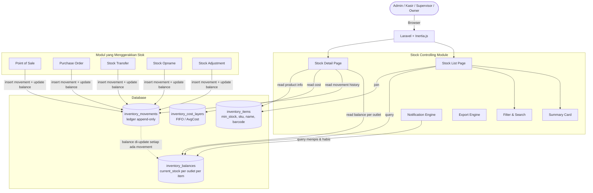

# PRD — Inventory - Stok (Stock Controlling)

## 1. Overview

Modul Stok bertanggung jawab untuk memberikan **visibilitas dan kontrol penuh terhadap kondisi persediaan barang** di setiap outlet. Scope modul ini berfokus pada **stock controlling** — yaitu kemampuan pengguna untuk memantau jumlah stok per outlet secara real-time, mengetahui kondisi stok (Aman / Menipis / Habis), serta menelusuri riwayat pergerakan stok secara kronologis. Modul ini **tidak** mencakup proses operasional seperti Stock Adjustment, Transfer Stok, maupun Stock Opname — fitur-fitur tersebut dikelola oleh modul tersendiri.

Sumber data utama stok per outlet adalah tabel `inventory_balances`, yang menyimpan snapshot `current_stock` per kombinasi outlet dan item. Riwayat pergerakan stok diambil dari `inventory_movements` (ledger append-only). Modul ini terintegrasi dengan modul Purchasing (PO), Point of Sale, dan Product Management sebagai sumber penggerak stok.

---

## 2. Requirements

- **Outlet-Scoped Stock View:** Tampilan stok wajib difilter berdasarkan `outlet_id`. Data stok per outlet dibaca dari tabel `inventory_balances` (kolom `current_stock`). Pengguna hanya dapat melihat stok outlet yang menjadi haknya sesuai hak akses.
- **Stock Status Calculation:** Sistem menghitung status stok otomatis berdasarkan perbandingan `inventory_balances.current_stock` dengan `inventory_items.minimum_stock`:
    - `Aman`: `current_stock > minimum_stock`
    - `Menipis`: `0 < current_stock <= minimum_stock`
    - `Habis`: `current_stock = 0`
- **Summary Card:** Ringkasan statistik di atas halaman daftar: Total Produk Terdaftar, Total Nilai Stok, Jumlah Produk Menipis, Jumlah Produk Habis, dan Jumlah Outlet Aktif.
- **Stock Movement History (Read-Only):** Halaman detail menampilkan riwayat pergerakan stok dari `inventory_movements` secara kronologis per item, mencakup semua tipe movement yang ada di sistem.
- **Inventory Valuation Display:** Nilai persediaan dihitung dari `current_stock x cost` menggunakan data dari `inventory_cost_layers` per item per outlet.
- **Stock Chart (30 Hari):** Grafik perubahan stok dalam 30 hari terakhir di halaman detail, dikonstruksi dari data `inventory_movements`.
- **Minimum Stock Alert:** Peringatan visual (badge) dan notifikasi untuk item berstatus Menipis atau Habis.
- **Filter & Search:** Filter berdasarkan Outlet, Kategori, Status Stok, Brand, dan toggle produk aktif. Pencarian berdasarkan Nama Produk, SKU, Barcode.
- **Export:** Mendukung ekspor data daftar stok ke format CSV dan PDF.
- **Role-Based Access Control:** Kasir hanya dapat melihat stok outlet sendiri, Supervisor dan Owner dapat melihat seluruh outlet (tergantung akses yang dimiliki).
- **Performance:** Daftar stok menggunakan snapshot `inventory_balances.current_stock` untuk response < 300ms — bukan kalkulasi real-time dari ledger.
- **Read-Only Scope:** Modul ini bersifat **read-only**. Tidak ada operasi penulisan (create/update/delete) yang dilakukan dalam scope PRD ini.

---

## 3. Core Features

- **Halaman Daftar Stok:** Tabel stok seluruh produk per outlet. Data stok diambil dari `inventory_balances`. Mendukung filter, pencarian, sorting, dan pagination.
- **Summary Card:** Kartu ringkasan statistik di atas tabel (Total Produk, Total Nilai Stok, Menipis, Habis, Outlet Aktif).
- **Filter & Pencarian:** Filter Outlet, Tipe, Kategori, Status Stok (Semua / Aman / Menipis / Habis), toggle "Hanya stok > 0", toggle "Hanya produk aktif". Pencarian cepat by Nama, SKU, Barcode.
- **Halaman Detail Stok:** Informasi lengkap per produk mencakup: header produk, ringkasan stok per outlet (dari `inventory_balances`), riwayat pergerakan stok (dari `inventory_movements`), grafik tren 30 hari, info minimum stok & status, dan nilai persediaan.
- **Notifikasi Stok:** Badge notifikasi di menu navigasi untuk produk hampir habis dan habis.
- **Export Data:** Ekspor daftar stok ke Excel / CSV / PDF.

---

## 4. User Flow

### Melihat Daftar Stok

1. Pengguna masuk ke menu **Inventori > Stok**.
2. Sistem menampilkan **Summary Card**: Total Produk, Total Nilai Stok, Stok Menipis, Stok Habis, Outlet Aktif — dihitung dari `inventory_balances` join `inventory_items`.
3. Sistem menampilkan **tabel stok** seluruh produk pada outlet yang dapat diakses pengguna.
4. Pengguna menggunakan **Filter** (Outlet, Kategori, Status) atau **Pencarian** (Nama, SKU, Barcode) untuk menemukan produk tertentu.
5. Pengguna mengklik baris produk untuk membuka halaman Detail Stok.
6. tampilkan semua data `inventory_items` baik tipe bahan baku maupun produk

### Melihat Detail Stok Produk

1. Pengguna mengklik salah satu produk dari daftar.
2. Sistem menampilkan **header produk**: Nama, SKU, Barcode, Tipe, Kategori, Supplier, Harga Modal, Harga Jual, Total Stok seluruh outlet.
3. Pengguna melihat **Ringkasan Stok per Outlet** — tabel yang menampilkan `current_stock` per outlet dari `inventory_balances`.
4. Pengguna melihat **Riwayat Pergerakan Stok** (read-only) — data dari `inventory_movements`: Tanggal, Jenis Transaksi, Qty, Outlet, User, Referensi Dokumen.
5. Pengguna melihat **Grafik Tren Stok** 30 hari terakhir, dikonstruksi dari akumulasi `qty_change` di `inventory_movements`.
6. Pengguna melihat **Informasi Minimum Stok**: nilai `minimum_stock` dari `inventory_items`, status Aman/Menipis/Habis, dan rekomendasi tindakan jika stok menipis.
7. Pengguna melihat **Nilai Persediaan**: Cost x Stok = Total Nilai (dari `inventory_cost_layers`).

### Melihat Notifikasi Stok

1. Sistem menampilkan badge/counter di menu navigasi berisi jumlah produk Menipis dan Habis.
2. Pengguna mengklik notifikasi untuk melihat daftar produk bermasalah yang sudah difilter otomatis.

---

## 5. Architecture

Modul Stok bersifat **read-heavy** dan mengikuti pendekatan Modular Monolith. Seluruh query stok memanfaatkan snapshot `inventory_balances.current_stock` untuk performa optimal. Data movement diambil dari `inventory_movements` secara on-demand saat halaman detail dibuka.



---

## 6. Database Schema

Modul Stok hanya **membaca** dari tabel-tabel berikut. Tidak ada tabel baru yang dibuat dalam scope PRD ini.

**Tabel yang Digunakan (Read-Only):**

| Tabel                   | Peran dalam Modul Stok                                                    |
| ----------------------- | ------------------------------------------------------------------------- |
| `inventory_balances`    | **Sumber utama** snapshot stok per item per outlet                        |
| `inventory_items`       | Informasi produk: nama, SKU, barcode, UOM, minimum_stock, track_inventory |
| `inventory_movements`   | Ledger riwayat pergerakan stok (read-only untuk tampilan)                 |
| `inventory_cost_layers` | Data cost layer untuk perhitungan nilai persediaan                        |
| `products`              | Informasi produk (nama, kategori, gambar) via relasi ke inventory_items   |
| `product_categories`    | Untuk filter berdasarkan kategori                                         |
| `outlets`               | Untuk filter dan tampilan nama outlet                                     |

```mermaid
erDiagram
    inventory_balances {
        uuid id PK
        uuid business_id FK
        uuid outlet_id FK
        uuid inventory_item_id FK
        decimal current_stock "decimal(15,4) default 0"
        timestamp created_at
        timestamp updated_at
        "UNIQUE" outlet_id__inventory_item_id "One balance per item per outlet"
    }

    inventory_items {
        uuid id PK
        uuid business_id FK
        string name "nullable"
        enum item_type "variant_sku / raw_material"
        uuid product_id FK "nullable"
        string sku "nullable"
        string barcode "nullable"
        uuid uom_id FK "nullable"
        boolean track_inventory
        boolean is_active
        decimal minimum_stock "decimal(15,4) default 0"
        timestamp created_at
        timestamp updated_at
    }

    inventory_movements {
        uuid id PK
        uuid business_id FK
        uuid outlet_id FK "nullable"
        uuid inventory_item_id FK
        string movement_type "sale, purchase, adjustment, transfer_in, transfer_out, waste, opname, dll"
        decimal qty_change "decimal(15,4)"
        decimal stock_before "decimal(15,4)"
        decimal stock_after "decimal(15,4)"
        decimal cost "decimal(15,4) default 0"
        uuid reference_id "nullable - polymorphic"
        string reference_type "nullable - polymorphic"
        text description "nullable"
        uuid created_by FK "nullable"
        timestamp created_at
    }

    inventory_cost_layers {
        uuid id PK
        uuid inventory_item_id FK
        uuid outlet_id FK
        decimal purchase_price "decimal(15,2)"
        decimal qty_purchased "decimal(15,4)"
        decimal qty_remaining "decimal(15,4)"
        uuid reference_id "nullable"
        timestamp created_at
    }

    outlets {
        uuid id PK
        uuid business_id FK
        string name
        boolean is_active
    }

    inventory_items ||--o{ inventory_balances : "has balance per outlet"
    outlets ||--o{ inventory_balances : "stores stock"
    inventory_items ||--o{ inventory_movements : "records movements"
    inventory_items ||--o{ inventory_cost_layers : "costed by"
    outlets ||--o{ inventory_cost_layers : "at outlet"
```

**Catatan Desain Penting:**

- `inventory_balances` adalah tabel snapshot dengan unique constraint `(outlet_id, inventory_item_id)` — artinya satu baris per kombinasi item + outlet.
- `minimum_stock` disimpan di `inventory_items` (bukan per outlet), sehingga berlaku sama untuk semua outlet.
- `inventory_movements` tidak memiliki kolom `updated_at` — hanya `created_at` (append-only ledger).
- Kolom biaya di `inventory_movements` adalah `cost` (decimal 15,4), bukan `purchase_price`.

---

## 7. Tech Stack

- **Frontend:** Vue 3 (Composition API `<script setup>`) + Tailwind CSS v4 + Inertia.js. Pola komponen: MainPage > MainPageHeader + SummaryCard + Filter + Table + Pagination. Halaman Detail menggunakan layout tab: Ringkasan | Riwayat | Grafik.
- **Backend:** Laravel 11 (PHP 8.3). Arsitektur Controller > Service > Model.
- **Services:**
    - `StockQueryService`: Query daftar stok dari `inventory_balances` join `inventory_items`, kalkulasi status stok, dan summary card.
    - `StockMovementQueryService`: Query riwayat pergerakan stok dari `inventory_movements` dengan filter outlet dan item.
    - `StockValuationQueryService`: Kalkulasi nilai persediaan dari `inventory_cost_layers`.
    - `StockNotificationService`: Query produk Menipis dan Habis untuk badge notifikasi.
    - `StockExportService`: Ekspor data stok ke Excel/CSV/PDF.
- **Database:** PostgreSQL. Query stok menggunakan `inventory_balances` sebagai snapshot (bukan aggregate dari ledger).
- **Charts:** ApexCharts atau Chart.js untuk grafik tren stok 30 hari.
- **Authorization:** Spatie Laravel Permission.

---

## 8. Hak Akses (Authorization)

| Permission                              | Kasir | Supervisor | Owner / Admin |
| --------------------------------------- | ----- | ---------- | ------------- |
| `inventory.stock.read` (outlet sendiri) | Ya    | Ya         | Ya            |
| `inventory.stock.read` (semua outlet)   | Tidak | Ya         | Ya            |
| `inventory.stock.export`                | Tidak | Ya         | Ya            |
| `inventory.stock.report.read`           | Tidak | Ya         | Ya            |

---

## 9. Notification & Alert

Notifikasi stok ditampilkan sebagai badge di menu navigasi dan/atau dashboard. Data diquery saat halaman dimuat berdasarkan `inventory_balances` join `inventory_items`.

| Notifikasi           | Kondisi                                                                               |
| -------------------- | ------------------------------------------------------------------------------------- |
| **N Produk Menipis** | `current_stock > 0` AND `current_stock <= minimum_stock` AND `track_inventory = true` |
| **N Produk Habis**   | `current_stock = 0` AND `track_inventory = true`                                      |

Jika item berstatus Menipis atau Habis, halaman detail menampilkan rekomendasi: _"Segera lakukan pembelian atau transfer stok."_

---

## 10. UI Components Reference

### Summary Card (di atas tabel)

| Card             | Sumber Data                                                                          |
| ---------------- | ------------------------------------------------------------------------------------ |
| Total Produk     | COUNT dari `inventory_items` (track_inventory = true, is_active = true)              |
| Total Nilai Stok | SUM(`current_stock` x `cost`) dari `inventory_balances` join `inventory_cost_layers` |
| Stok Menipis     | COUNT item dengan `0 < current_stock <= minimum_stock`                               |
| Stok Habis       | COUNT item dengan `current_stock = 0`                                                |
| Outlet Aktif     | COUNT outlet aktif milik bisnis                                                      |

**Contoh Tampilan:**
| Total Produk | Total Nilai Stok | Stok Menipis | Stok Habis | Outlet Aktif |
|---|---|---|---|---|
| 530 | Rp 58.000.000 | 17 | 5 | 8 |

### Kolom Tabel Daftar Stok

| Kolom            | Sumber Data                        | Keterangan                   |
| ---------------- | ---------------------------------- | ---------------------------- |
| SKU              | `inventory_items.sku`              | Kode unik item               |
| Nama Produk      | `inventory_items.name`             | Nama item                    |
| Kategori         | `product_categories.name`          | Via relasi produk            |
| Outlet           | `outlets.name`                     | Outlet pemilik balance       |
| Stok Saat Ini    | `inventory_balances.current_stock` | Snapshot stok                |
| Unit             | `uoms.name`                        | Via `inventory_items.uom_id` |
| Minimum Stok     | `inventory_items.minimum_stock`    | Safety stock                 |
| Status           | Kalkulasi                          | Aman / Menipis / Habis       |
| Nilai Persediaan | Kalkulasi                          | Stok x Cost                  |
| Terakhir Update  | `inventory_balances.updated_at`    | Waktu update terakhir        |
| Aksi             | -                                  | Tombol: Detail, Riwayat      |

### Contoh Data Tabel

| SKU    | Produk          | Outlet   | Stok | Min | Status  |
| ------ | --------------- | -------- | ---- | --- | ------- |
| BRG001 | Coca Cola 330ml | Outlet A | 120  | 30  | Aman    |
| BRG002 | Aqua 600ml      | Outlet B | 10   | 20  | Menipis |
| BRG003 | Sprite          | Outlet A | 0    | 15  | Habis   |

### Riwayat Pergerakan Stok (Halaman Detail — Read Only)

| Tanggal | Jenis           | Qty  | Outlet   | User  | Referensi |
| ------- | --------------- | ---- | -------- | ----- | --------- |
| 10 Jul  | Penjualan       | -3   | Outlet A | Kasir | INV001    |
| 10 Jul  | Pembelian       | +100 | Outlet A | Admin | PO021     |
| 11 Jul  | Transfer Keluar | -20  | Outlet A | Admin | TF001     |
| 11 Jul  | Transfer Masuk  | +20  | Outlet B | Admin | TF001     |
| 12 Jul  | Adjustment      | -1   | Outlet A | Admin | ADJ001    |

Tipe movement yang ditampilkan berasal dari kolom `inventory_movements.movement_type`: `sale`, `purchase`, `adjustment`, `transfer_in`, `transfer_out`, `waste`, `opname`, `recipe_deduction`, `bundle_deduction`.
