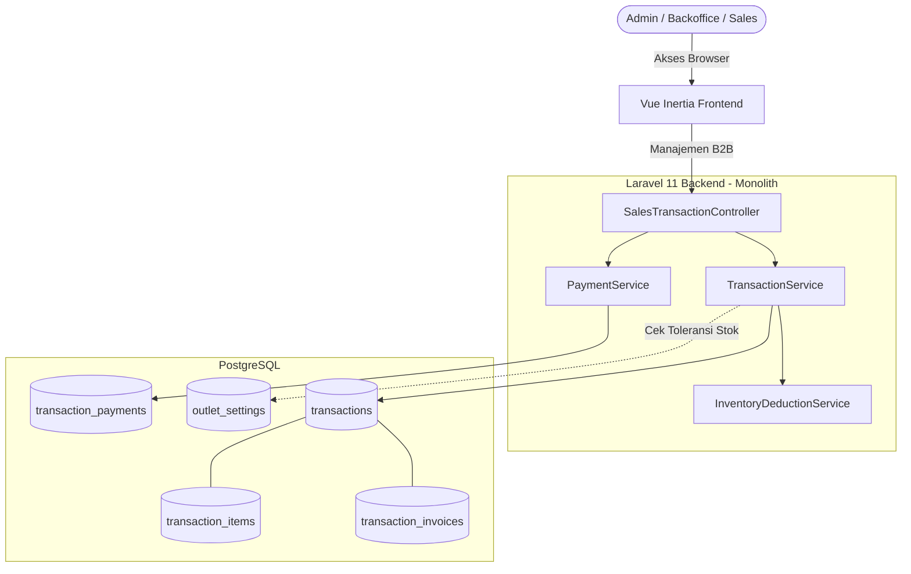

# PRD — Transaksi & Penjualan - Channel B2B (V1)

## 1. Overview

Modul Transaksi & Penjualan B2B bertanggung jawab mengelola seluruh aktivitas penjualan berbasis faktur (invoice) pada aplikasi **Sollu App** melalui dashboard _backoffice_ (menu **Transaksi > Penjualan**). Modul ini ditujukan untuk mengakomodasi transaksi di luar kasir retail, seperti penjualan grosir (_wholesale_), _e-commerce_, pesanan _custom_, atau penjualan langsung berbasis termin/piutang.

**Selling Point Utama V1:**

- **Fleksibilitas Bisnis (Configurable Workflows)**: Didesain khusus untuk kultur UMKM di Indonesia, sistem memungkinkan fleksibilitas tinggi. Admin dapat melakukan _override_ harga/diskon secara kustom saat pembuatan invoice, memperbarui tanggal jatuh tempo kapan saja, serta memproses transaksi walaupun stok sedang kosong (jika diizinkan via konfigurasi _outlet_).
- **Pembayaran Bertahap (Cicilan / Down Payment)**: Mendukung penuh pelunasan parsial sejak V1. Satu invoice tagihan dapat dicicil berkali-kali hingga lunas, dengan sistem yang secara otomatis melacak _balance due_ (sisa tagihan).
- **Manajemen Piutang & Jatuh Tempo (_Aging Receivables_)**: Memudahkan pemilik bisnis memonitor tagihan yang belum lunas berdasarkan umur jatuh temponya, serta mengirimkan notifikasi.

Modul ini mengadopsi arsitektur data terpisah berdasar pola _Parent-Extension Table_:

1. **`transactions` (Parent Table)**: Entitas induk universal yang menampung seluruh transaksi (baik dari POS maupun B2B).
2. **`transaction_invoices` (Extension Table)**: Tabel turunan (1-to-1) yang menyimpan data spesifik faktur resmi (`INV/YYYYMM/XXXX`, tanggal jatuh tempo, dan syarat pembayaran) yang tidak dibutuhkan pada transaksi ritel biasa.

---

## 2. Requirements

- **Fleksibilitas Channel Penjualan**: Channel dapat disesuaikan dan diaktifkan/dinonaktifkan per outlet (contoh: `e-commerce`, `social-media`, `direct`, `wholesale`, `custom`).
- **Penerbitan Invoice Langsung**: Proses transaksi difokuskan pada penerbitan langsung ke Invoice (_Draft_ -> _Unpaid_ -> _Paid_). Alur Quotation/Penawaran ditunda ke versi selanjutnya.
- **Fleksibilitas Transaksi (Configurable Options)**:
    - **Custom Price & Discount**: Admin dengan hak akses tertentu dapat mengubah harga barang atau memasukkan nominal diskon kustom di luar harga master.
    - **Fleksibilitas Jatuh Tempo**: Tanggal jatuh tempo (_due date_) dapat diperpanjang atau diubah setelah invoice diterbitkan.
    - **Toleransi Stok (Stok Minus)**: Terdapat pengaturan _outlet_ yang memungkinkan penerbitan invoice meskipun stok barang fisik tidak mencukupi (stok menjadi negatif sementara waktu), mencegah terhambatnya proses penjualan.
- **Pembayaran Parsial (Cicilan/DP)**: Sistem harus bisa mencatat banyak riwayat pembayaran untuk satu invoice (`transaction_payments`).
- **Integrasi Stok Barang**: Pengurangan stok barang (`inventory_movements`) terjadi secara otomatis ketika status invoice berubah menjadi `unpaid` (diterbitkan) atau `paid`.

---

## 3. Core Features

- **Dashboard Penjualan B2B**: Halaman manajemen di _backoffice_ Vue Inertia untuk memantau daftar transaksi, memfilter status piutang, dan pencarian pelanggan.
- **Pembuatan Invoice yang Fleksibel**: Form pembuatan invoice dengan dukungan _override_ harga, pemilihan pelanggan, perhitungan pajak/diskon tingkat dokumen, dan biaya pengiriman.
- **Siklus Hidup Invoice (V1)**:
    - `draft`: Disimpan sementara, belum memotong stok dan belum menagihkan piutang.
    - `unpaid`: Invoice resmi diterbitkan. Stok terpotong (tergantung konfigurasi). Sisa tagihan dicatat sebagai piutang.
    - `paid`: Sisa tagihan (_balance due_) telah mencapai nol.
    - `cancel`: Pembatalan transaksi. Jika stok sebelumnya dipotong, sistem otomatis memicu jurnal pembalik (_stock movement reversal_).
- **Pencatatan Pembayaran (Cicilan)**: Modal pencatatan pelunasan, baik secara penuh (_full payment_) maupun sebagian (_partial/DP_), lengkap dengan metode pembayaran (`cash`, `qris`, `bank_transfer`, dsb).
- **Cetak & Ekspor PDF Invoice**: _Generate_ dokumen faktur berstandar profesional untuk dikirimkan ke klien (mencakup syarat & ketentuan serta riwayat cicilan yang sudah masuk).

---

## 4. User Flow

1. **Membuat Penjualan**: Pengguna (Admin/Sales) membuka menu **Transaksi > Penjualan** dan menekan **Tambah Penjualan**.
2. **Pengisian Form & Fleksibilitas**:
    - Memilih Pelanggan dan Channel Penjualan.
    - Mengatur Tanggal Transaksi dan Tanggal Jatuh Tempo.
    - Memasukkan Item Produk. Jika diizinkan, admin dapat mengubah harga jual secara langsung (_override_) atau memberikan diskon nominal bebas.
3. **Penyimpanan**:
    - Jika disimpan sebagai **Draf**, transaksi tersimpan tanpa memengaruhi stok.
    - Jika **Terbitkan Invoice**, sistem menghasilkan nomor resmi (`INV/...`), status berubah menjadi `unpaid`, dan memicu pemotongan stok (bahkan jika stok minus, jika pengaturan mengizinkan).
4. **Pembayaran Bertahap (DP/Cicilan)**:
    - Pengguna membuka detail invoice `unpaid`, klik **Catat Pembayaran**.
    - Pengguna memasukkan nominal yang dibayar (bisa sebagian dari total tagihan). Sistem memperbarui `balance_due` dan menyimpan riwayat di `transaction_payments`.
    - Proses ini bisa diulang hingga `balance_due` = 0, di mana status invoice otomatis berubah menjadi `paid`.
5. **Manajemen Lanjutan**: Admin dapat mengubah jatuh tempo jika pelanggan meminta perpanjangan, atau melakukan _Cancel_ transaksi jika batal (stok akan dikembalikan).
6. **Ekspor**: Pengguna mengunduh/mencetak PDF Invoice yang menampilkan total tagihan, jumlah yang sudah dibayar, dan sisa piutang.

---

## 5. Architecture

---

## 6. Database Schema

Schema difokuskan pada kemampuan mencatat sisa tagihan dan relasi pembayaran _one-to-many_. Seluruh tabel menggunakan `id` UUID.

### 1. `transactions` (Parent Table Universal)

- `id`: UUID, PK
- `outlet_id`, `customer_id`: UUID, FK
- `transaction_number`: string (Misal: `TRX/202608/00001`)
- `channel`: enum (`e_commerce`, `direct`, `wholesale`, dll)
- `subtotal`, `discount_amount`, `tax_amount`, `shipping_fee`: decimal(15,4)
- `total`: decimal(15,4) (Grand total)
- `total_paid`: decimal(15,4) (Total yang sudah dibayar/dicicil)
- `balance_due`: decimal(15,4) (Sisa tagihan; `total` - `total_paid`)
- `status`: enum (`draft`, `unpaid`, `paid`, `cancel`)
- `transaction_date`: datetime
- `created_by`, `updated_by`: UUID, FK

### 2. `transaction_invoices` (Extension Table Faktur)

- `id`: UUID, PK
- `transaction_id`: UUID, FK (Unique, 1-to-1)
- `invoice_number`: string (Misal: `INV/202608/00001`)
- `invoice_date`: datetime
- `due_date`: datetime (Bisa diubah/fleksibel)
- `status`: enum (Sinkron dengan tabel parent)
- `terms_and_conditions`: text

### 3. `transaction_payments` (Pencatatan Cicilan/Pembayaran)

- `id`: UUID, PK
- `transaction_id`: UUID, FK
- `payment_method_id`: UUID, FK
- `amount`: decimal(15,4) (Nominal yang dibayarkan saat ini)
- `payment_date`: datetime
- `notes`: text
- `created_by`: UUID, FK

### 4. `outlet_settings` (Tabel Konfigurasi Fleksibilitas)

- `outlet_id`: UUID
- `allow_negative_stock`: boolean (Opsi membiarkan stok minus)
- `allow_custom_price`: boolean (Opsi override harga)

---

## 7. Tech Stack

- **Frontend**: Vue.js 3 (Composition API) + Tailwind CSS v4. Terintegrasi dengan Inertia.js. Tidak ada pemisahan repository.
- **Backend**: Laravel 11. Arsitektur berpusat pada _Controller_ dan _Service layer_ tipis.
- **Database**: PostgreSQL (menyimpan UUID dan tipe data decimal yang presisi).
- **PDF Generator**: DomPDF (via `barryvdh/laravel-dompdf`) untuk mencetak dokumen invoice resmi.
