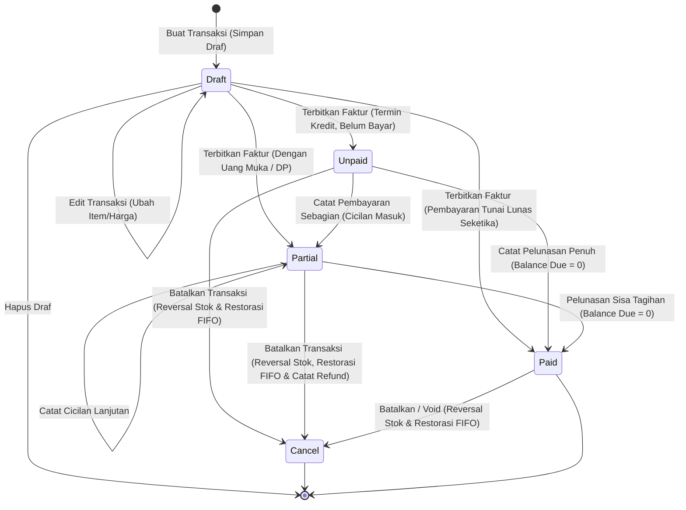
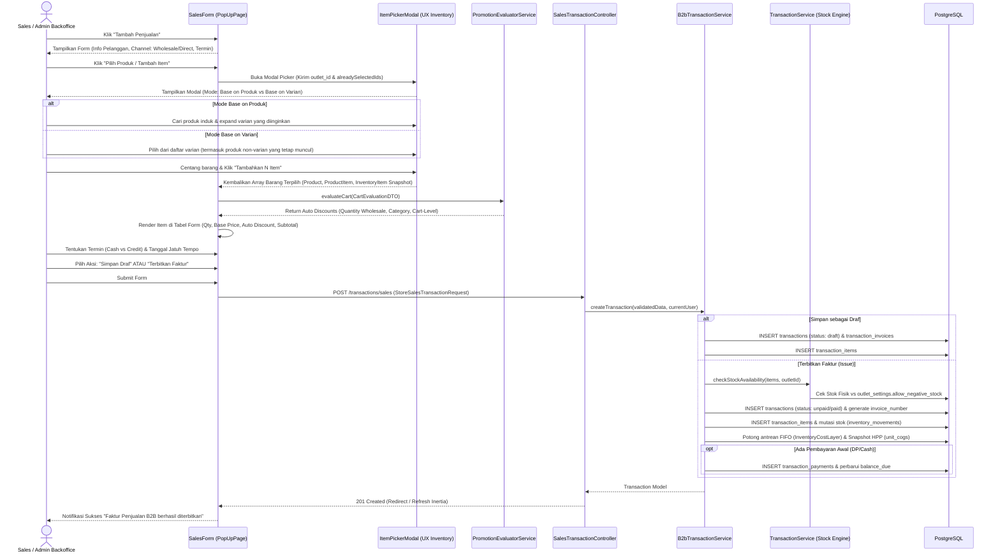
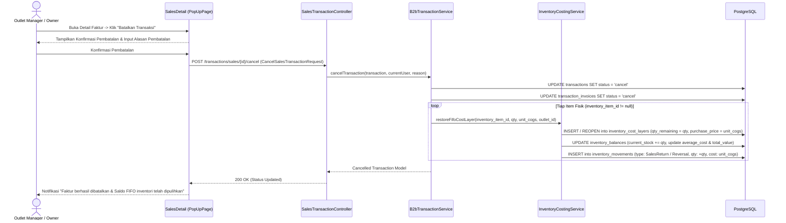
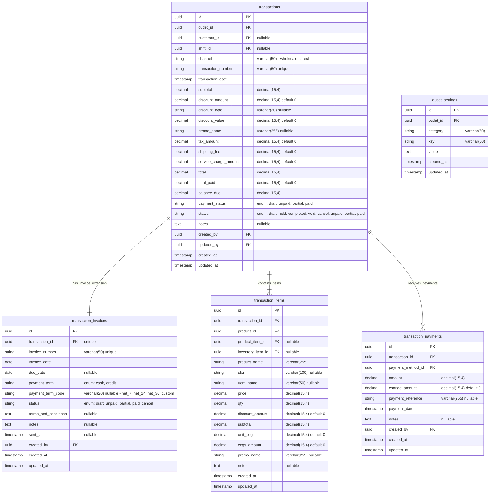

# PRD — Modul Transaksi & Penjualan - Channel B2B V1

## 1. Executive Summary & Bounded Context

Modul **Transaksi & Penjualan - Channel B2B (V1)** adalah _Bounded Context_ utama dalam ekosistem **Sollu App** yang bertanggung jawab untuk mengelola seluruh aktivitas penjualan berbasis faktur (*commercial invoice*), perdagangan grosir (*wholesale*), dan penjualan langsung (*direct sales*) melalui antarmuka *backoffice* (menu **Transaksi > Penjualan**). Modul ini dirancang dengan standar bisnis profesional untuk memenuhi kebutuhan transaksi B2B dan korporat UMKM hingga skala menengah di Indonesia secara akuntabel, terstruktur, dan fleksibel.

### Batasan Saluran Penjualan V1 (*Channel Scoping*):
Pada versi V1, kanal penjualan B2B difokuskan secara ketat pada 2 saluran utama:
1. **Grosir (`wholesale`)**: Transaksi volume besar ke mitra toko, distributor, agen, atau *reseller*.
2. **Penjualan Langsung (`direct`)**: Transaksi penjualan langsung berbasis faktur resmi kepada pelanggan korporat atau pembeli institusional di luar kasir ritel instan.

### Kapabilitas Utama V1:

1. **Arsitektur Parent-Extension Table (`transactions` + `transaction_invoices`)**: Memisahkan data buku besar penjualan universal dengan entitas faktur komersial resmi (`INV/YYYYMM/XXXX`, *due date*, termin pembayaran, syarat & ketentuan) tanpa terjadi redundansi data.
2. **Standar Bisnis & Faktur Komersial Profesional**: Penerbitan dokumen faktur resmi berstandar korporat yang mencakup identitas legal perusahaan, NPWP/NIB, data penagihan (*Bill To*) & pengiriman (*Ship To*), termin pembayaran (*Terms of Payment / TOP*: Net 7, Net 14, Net 30, Net 60, COD), instruksi rekening bank resmi, rincian histori cicilan, serta kolom tanda tangan & stempel otorisasi.
3. **Integrasi Auto Discount (Engine Promosi Otomatis)**: Terintegrasi dengan `PromotionEvaluatorInterface` untuk mengevaluasi dan menerapkan diskon otomatis secara transparan (diskon kuantitas/grosir, diskon kategori, diskon produk/varian, hingga diskon nilai transaksi) berdampingan dengan diskon kustom manual.
4. **Product Picker Modal Berstandar Modul Inventory (Dual View Mode)**:
   - Mengadopsi standar UX modul *Inventory* menggunakan modal terdedikasi (`ItemPickerModal`).
   - **Mode Tampilan Base on Produk**: Tampilan terkelompok berdasarkan produk induk (*parent product*) dengan kemampuan *expand* varian SKU.
   - **Mode Tampilan Base on Varian**: Tampilan datar (*flat list*) seluruh varian SKU. **Wajib menampilkan produk tunggal/non-varian** sehingga tidak ada produk yang hilang dari katalog pencarian.
   - Dilengkapi baki seleksi (*selection tray*), deteksi item duplikat (*locked in form*), dan indikator stok *real-time*.
5. **Dukungan Item Fisik & Item Jasa/Layanan (*Flexible Item Classification*)**: Mendukung penjualan barang fisik inventori maupun item non-stok / jasa (*service items*, seperti ongkos instalasi, sablon, jahit) dengan struktur kolom `product_item_id` dan `inventory_item_id` bernilai *nullable*.
6. **Fleksibilitas Alur Bisnis B2B (*Configurable Workflows*)**: Admin dan staf penjualan berwenang dapat menerbitkan draf, melakukan *override* harga satuan per pelanggan, memberikan diskon kustom manual tingkat dokumen/item, serta menyesuaikan tanggal jatuh tempo kapan saja.
7. **Pembayaran Bertahap & Cicilan (Down Payment / Partial Payment)**: Mendukung penuh skema termin pembayaran. Satu faktur tagihan dapat dicicil berkali-kali (`transaction_payments`) dengan perhitungan otomatis sisa tagihan (*balance due*).
8. **Manajemen Piutang & Umur Tagihan (*Aging Receivables*)**: Pelacakan status pembayaran faktur secara *real-time* (`unpaid`, `partial`, `paid`) dengan peringatan jatuh tempo (*due date*) dan pencatatan riwayat penagihan komprehensif.
9. **Toleransi Stok per Outlet (*Negative Stock Allowance*)**: Konfigurasi fleksibel di level *outlet* yang memungkinkan penerbitan faktur penjualan meskipun stok fisik di sistem belum mencukupi (stok menjadi minus sementara) guna mencegah kemacetan alur komersial.
10. **Integritas Reversal Mutasi Stok & Presisi Saldo FIFO**: Pengurangan stok barang (`inventory_movements`) otomatis saat faktur diterbitkan (*issued*). Saat faktur dibatalkan (*cancelled/void*), sistem memicu mutasi pembalik (*stock reversal*) dan **mengembalikan layer biaya FIFO (`InventoryCostLayer`) secara akurat** sesuai snapshot HPP/COGS awal guna menjaga presisi valuasi inventori.
11. **Penerbitan Dokumen Resmi & Cetak PDF (DomPDF)**: *Engine* pembuatan dokumen faktur standar profesional via DomPDF beresolusi tinggi yang siap dicetak atau dikirimkan ke pelanggan korporat.
12. **Audit Trail & Activity Logging**: Seluruh siklus penerbitan faktur, revisi tanggal jatuh tempo, dan pencatatan cicilan terekam secara otomatis melalui `ActivityLoggerInterface`.

---

## 2. B2B Sales & Invoice Architecture

Pondasi modul Transaksi Channel B2B V1 mengadopsi struktur relasi berbasis **Parent Transaction & Invoice Extension**:

```
Transaction (Parent Table - Universal Sales Ledger)
│
├── Identity & Scoped Channels (B2B V1 Scope)
│   ├── Business & Outlet Scope (Multi-Tenant Isolation)
│   ├── Customer Entity (B2B Corporate Account / Reseller)
│   ├── Channel: Strictly [Wholesale vs Direct Sales]
│   └── Status (Draft, Unpaid, Partial, Paid, Cancel, Void)
│
├── Financial Breakdown & Snapshot (DECIMAL 15,4)
│   ├── Subtotal (Gross Line Items Value)
│   ├── Document Discounts (Auto Promo Engine Result / Manual Amount)
│   ├── Dasar Pengenaan Pajak (DPP) & Tax Amount (PPN)
│   ├── Shipping Fee (Ongkos Kirim Logistik & Ekspedisi)
│   ├── Grand Total (Net Invoice Amount)
│   ├── Total Paid (Akumulasi Pembayaran Masuk)
│   └── Balance Due (Sisa Piutang / Tagihan Berjalan)
│
├── Invoice Extension (1-to-1 with `transaction_invoices`)
│   ├── Official Invoice Number (e.g., INV/YYYYMM/XXXX)
│   ├── Invoice Date & Payment Term (Cash / COD vs Credit / Termin)
│   ├── Terms of Payment (TOP: Net 7, Net 14, Net 30, Net 60, Custom)
│   ├── Dynamic Due Date (Dapat diperpanjang sesuai kesepakatan)
│   ├── Legal Terms & Conditions (Syarat Pembayaran & Denda Keterlambatan)
│   └── Official Company Bank Accounts for Settlement
│
├── Line Items (`transaction_items`)
│   ├── Product Master Reference (`product_id`)
│   ├── Product Item / Variant Reference (`product_item_id` - Nullable)
│   ├── Inventory Snapshot Reference (`inventory_item_id` - Nullable)
│   ├── UOM (Unit of Measure) Snapshot
│   ├── Quantity & Base Selling Price
│   ├── Custom Price Override & Line Discount
│   └── Line Subtotal & COGS (HPP) Snapshot
│
└── Payment Ledger (`transaction_payments`)
    ├── Installment Records (One-to-Many Multi-Payment)
    ├── Payment Method (Bank Transfer, Giro/Cek, QRIS, Tunai)
    ├── Payment Reference / Bukti Transfer Bank
    └── Payment Date & Verified Collector (Created By)
```

### Aturan Evaluasi & Operasional Bisnis (Operational Rules Matrix):

- **Waktu Pemotongan Stok (*Stock Deduction Timing*)**: Stok barang fisik tidak dipotong saat transaksi berstatus `draft`. Pemotongan stok pada tabel inventori (`inventory_movements`) terjadi seketika saat aksi **Terbitkan Faktur (*Issue Invoice*)** dilakukan (status bertransisi ke `unpaid` atau `paid`). Item non-inventori/jasa (`inventory_item_id = null`) dilewati dari pemotongan stok.
- **Resolusi Auto Discount & Diskon Manual (*Discount Precedence*)**:
  1. Engine secara otomatis mengevaluasi diskon promo aktif (`PromotionEvaluatorInterface`) berdasarkan subtotal, kuantitas item (diskon grosir), kategori produk, dan varian.
  2. Jika user berwenang memasukkan diskon manual (*manual override*), sistem mengkombinasikan atau memprioritaskan diskon sesuai aturan konfigurasi promo (*stackable* vs *non-stackable*).
  3. Snapshot promo dicatat pada `transactions.promo_name`, `discount_type`, `discount_value`, dan baris `transaction_promos`.
- **Integritas Jurnal Pembalik & Restorasi Layer FIFO (*FIFO Reversal Precision*)**:
  - Apabila faktur berstatus `unpaid` atau `paid` dibatalkan (`cancel`/`void`), sistem secara otomatis membuat mutasi stok pembalik (*reversal movement*).
  - **Restorasi Layer FIFO**: Sistem memanggil `InventoryCostingService` untuk mengembalikan layer biaya `InventoryCostLayer` sebesar kuantitas yang diretur dengan nilai biaya satuan yang persis sama dengan snapshot `unit_cogs` saat transaksi diterbitkan.
  - Saldo `InventoryBalance` diperbarui (`current_stock += qty`, hitung ulang `total_value` dan `average_cost`) sehingga antrean FIFO dan valuasi persediaan tetap 100% konsisten dan akurat.
- **Resolusi Status Pembayaran (*Payment Status Resolution*)**:
  - `total_paid == 0` $\rightarrow$ `payment_status = unpaid`
  - `0 < total_paid < total` $\rightarrow$ `payment_status = partial`
  - `total_paid >= total` $\rightarrow$ `payment_status = paid` & `balance_due = 0`
- **Standar Penomoran Faktur (*Sequential Invoice Numbering*)**: Format nomor faktur `INV/{YYYYMM}/{XXXX}` berurutan per bisnis/outlet untuk mencegah nomor ganda atau lompatan nomor (*gapless audit sequence*).

---

## 3. Core Features & Use Cases

### 3.1. Fitur Utama

| Fitur | Deskripsi |
| :--- | :--- |
| **Manajemen Penjualan B2B (CRUD)** | Pembuatan draf transaksi, perubahan draf, pratinjau detail faktur, dan pembatalan transaksi dengan rekam jejak audit. |
| **Auto Discount Promo Engine** | Evaluasi dan kalkulasi diskon otomatis berbasis aturan promo aktif (diskon kuantitas grosir, promo kategori, dan promo nilai transaksi). |
| **Product Picker Modal (UX Inventory)** | Modal pencarian barang multi-mode (*Base on Produk* & *Base on Varian*) lengkap dengan filter pencarian, baki seleksi, dan status stok. |
| **Dukungan Item Non-Stok & Jasa** | Penjualan item berupa jasa/layanan (*service*) atau barang non-inventori tanpa pemotongan stok fisik (`inventory_item_id = null`). |
| **Dual Publishing Workflow** | Opsi penyimpanan fleksibel sebagai **Draf** (tanpa efek stok & piutang) atau langsung **Terbitkan Faktur** (*Issue Invoice*). |
| **Pencatatan Pembayaran Parsial / DP** | Pencatatan cicilan pembayaran bertahap (*multi-payment ledger*) dengan pelacakan sisa piutang (*balance due*) otomatis. |
| **Stock Tolerance Guard** | Validasi stok fisik barang dengan integrasi pengaturan toleransi *outlet* (`allow_negative_stock`). |
| **FIFO Cost Layer Reversal Guard** | Pengembalian otomatis saldo dan antrean layer biaya FIFO yang presisi saat faktur komersial dibatalkan. |
| **Aging Receivables & Due Date Extension** | Monitoring umur piutang komersial (0-30, 31-60, >60 hari) dan fleksibilitas perpanjangan tanggal jatuh tempo (*due date*). |
| **Professional DomPDF Commercial Invoice** | Pencetakan dokumen faktur berstandar korporat lengkap dengan data NPWP, rekening penampung resmi, rincian cicilan, dan legalitas stempel/tanda tangan. |
| **Activity Logging & Audit Trail** | Pencatatan riwayat setiap penerbitan faktur, revisi tanggal, dan pembayaran via `ActivityLogService`. |

### 3.2. Skenario Bisnis V1 (Use Cases)

```
┌────────────────────────────────────────────────────────────────────────────────────────────────────────┐
│ Skenario Bisnis B2B V1 (Channel: Wholesale & Direct Sales)                                             │
├──────────────────────────────┬──────────────────────────────┬──────────────────────────────────────────┤
│ Use Case                     │ Setup & Kondisi              │ Respon & Output Sistem                   │
├──────────────────────────────┼──────────────────────────────┼──────────────────────────────────────────┤
│ 1. Penjualan Grosir Tunai    │ Channel: Wholesale           │ Invoice terbit (INV/...), status Paid,   │
│    (Full Payment Langsung)   │ Payment Term: Cash           │ Stok terpotong, balance_due = Rp 0,      │
│                              │ Action: Issue Invoice        │ Payment tercatat di transaction_payments │
├──────────────────────────────┼──────────────────────────────┼──────────────────────────────────────────┤
│ 2. Diskon Grosir Otomatis    │ Channel: Wholesale           │ Engine Promo mendeteksi qty >= 50 pcs,   │
│    (Auto Quantity Discount)  │ Min Qty: 50 pcs              │ Otomatis memotong harga 15% (Auto Disc), │
│                              │ Item: Baju Kaos Polos        │ Snapshot promo tercatat di invoice.      │
├──────────────────────────────┼──────────────────────────────┼──────────────────────────────────────────┤
│ 3. Penjualan Grosir Kredit   │ Channel: Wholesale           │ Invoice terbit (INV/...), status Unpaid, │
│    Termin (TOP Net 30)       │ Payment Term: Credit (Termin)│ Stok terpotong, balance_due = Grand Total│
│                              │ Due Date: +30 hari (Net 30)  │ Masuk ke daftar pantauan Piutang Jatuh   │
│                              │ Action: Issue Invoice        │ Tempo & Aging Receivables.               │
├──────────────────────────────┼──────────────────────────────┼──────────────────────────────────────────┤
│ 4. Penjualan Barang + Jasa   │ Channel: Direct Sales        │ Item 1: Mesin Kopi (Potong stok),        │
│    (Layanan / Service Item)  │ Item 1: Barang Inventori     │ Item 2: Biaya Instalasi (Jasa, inventory │
│                              │ Item 2: Biaya Instalasi/Jasa │ item null, tidak memotong stok inventori)│
├──────────────────────────────┼──────────────────────────────┼──────────────────────────────────────────┤
│ 5. Pembayaran Uang Muka (DP) │ Channel: Direct Sales        │ Invoice terbit, payment_status: Partial, │
│    + Pelunasan Bertahap      │ Paid Amount: 30% Grand Total │ balance_due berkurang 30%, tercatat satu │
│                              │ Payment Term: Credit         │ baris cicilan DP. Sisa 70% dicatat piutang│
├──────────────────────────────┼──────────────────────────────┼──────────────────────────────────────────┤
│ 6. Penjualan Stok Kosong     │ Outlet Setting:              │ Transaksi berhasil diterbitkan, mutasi   │
│    (Toleransi Stok Negatif)  │ `allow_negative_stock = true`│ inventori mencatat stok minus sementara, │
│                              │ Stok Fisik Saat Ini: 0 pcs   │ pengiriman barang tetap dapat diproses.  │
├──────────────────────────────┼──────────────────────────────┼──────────────────────────────────────────┤
│ 7. Pembatalan Faktur &       │ Status: Unpaid / Partial     │ Status berubah Cancel, Reversal stok     │
│    Restorasi Layer FIFO      │ Pesanan dibatalkan klien     │ dibuat, layer FIFO dikembalikan sesuai   │
│                              │                              │ unit_cogs awal tanpa distorsi valuasi.   │
└──────────────────────────────┴──────────────────────────────┴──────────────────────────────────────────┘
```

---

## 4. User Flow & Status Lifecycle

### 4.1. Lifecycle Status Transaksi & Faktur B2B


```mermaid
stateDiagram-v2
    [*] --> Draft : Buat Transaksi (Simpan Draf)
    Draft --> Draft : Edit Transaksi (Ubah Item/Harga)
    Draft --> [*] : Hapus Draf
    Draft --> Unpaid : Terbitkan Faktur (Termin Kredit, Belum Bayar)
    Draft --> Partial : Terbitkan Faktur (Dengan Uang Muka / DP)
    Draft --> Paid : Terbitkan Faktur (Pembayaran Tunai Lunas Seketika)
    Unpaid --> Partial : Catat Pembayaran Sebagian (Cicilan Masuk)
    Unpaid --> Paid : Catat Pelunasan Penuh (Balance Due = 0)
    Partial --> Partial : Catat Cicilan Lanjutan
    Partial --> Paid : Pelunasan Sisa Tagihan (Balance Due = 0)
    Unpaid --> Cancel : Batalkan Transaksi (Reversal Stok & Restorasi FIFO)
    Partial --> Cancel : Batalkan Transaksi (Reversal Stok, Restorasi FIFO & Catat Refund)
    Paid --> Cancel : Batalkan / Void (Reversal Stok & Restorasi FIFO)
    Cancel --> [*]
    Paid --> [*]
```

- **Draf (`draft`)**: Transaksi baru disusun oleh staf penjualan. Item dan harga dapat diedit bebas. Belum memotong stok barang dan belum membebankan piutang pelanggan.
- **Belum Dibayar (`unpaid`)**: Faktur resmi telah diterbitkan (`invoice_number` dibuat). Stok barang fisik langsung dipotong. Sisa tagihan utuh sebagai piutang aktif.
- **Dibayar Sebagian (`partial`)**: Faktur telah menerima satu atau lebih cicilan pembayaran, namun `balance_due` masih lebih dari nol.
- **Lunas (`paid`)**: Seluruh nilai tagihan faktur telah terbayar penuh (`total_paid >= total`), dan sisa tagihan menjadi Rp 0.
- **Batal (`cancel` / `void`)**: Transaksi dibatalkan secara resmi. Sistem secara otomatis memicu pembalikan mutasi inventori (*stock reversal*) dan restorasi antrean layer biaya FIFO (`InventoryCostLayer`).

---

### 4.2. Alur Penerbitan Faktur B2B dengan Auto Promo & Product Picker Modal


```mermaid
sequenceDiagram
    actor Sales as Sales / Admin Backoffice
    participant UI as SalesForm (PopUpPage)
    participant Picker as ItemPickerModal (UX Inventory)
    participant PromoEngine as PromotionEvaluatorService
    participant Ctrl as SalesTransactionController
    participant Svc as B2bTransactionService
    participant InvSvc as TransactionService (Stock Engine)
    participant DB as PostgreSQL

    Sales->>UI: Klik "Tambah Penjualan"
    UI-->>Sales: Tampilkan Form (Info Pelanggan, Channel: Wholesale/Direct, Termin)

    Sales->>UI: Klik "Pilih Produk / Tambah Item"
    UI->>Picker: Buka Modal Picker (Kirim outlet_id & alreadySelectedIds)
    Picker-->>Sales: Tampilkan Modal (Mode: Base on Produk vs Base on Varian)

    alt Mode Base on Produk
        Sales->>Picker: Cari produk induk & expand varian yang diinginkan
    else Mode Base on Varian
        Sales->>Picker: Pilih dari daftar varian (termasuk produk non-varian yang tetap muncul)
    end

    Sales->>Picker: Centang barang & Klik "Tambahkan N Item"
    Picker-->>UI: Kembalikan Array Barang Terpilih (Product, ProductItem, InventoryItem Snapshot)
    
    UI->>PromoEngine: evaluateCart(CartEvaluationDTO)
    PromoEngine-->>UI: Return Auto Discounts (Quantity Wholesale, Category, Cart-Level)
    UI->>UI: Render Item di Tabel Form (Qty, Base Price, Auto Discount, Subtotal)

    Sales->>UI: Tentukan Termin (Cash vs Credit) & Tanggal Jatuh Tempo
    Sales->>UI: Pilih Aksi: "Simpan Draf" ATAU "Terbitkan Faktur"

    Sales->>UI: Submit Form
    UI->>Ctrl: POST /transactions/sales (StoreSalesTransactionRequest)
    Ctrl->>Svc: createTransaction(validatedData, currentUser)

    alt Simpan sebagai Draf
        Svc->>DB: INSERT transactions (status: draft) & transaction_invoices
        Svc->>DB: INSERT transaction_items
    else Terbitkan Faktur (Issue)
        Svc->>InvSvc: checkStockAvailability(items, outletId)
        InvSvc->>DB: Cek Stok Fisik vs outlet_settings.allow_negative_stock
        Svc->>DB: INSERT transactions (status: unpaid/paid) & generate invoice_number
        Svc->>DB: INSERT transaction_items & mutasi stok (inventory_movements)
        Svc->>DB: Potong antrean FIFO (InventoryCostLayer) & Snapshot HPP (unit_cogs)
        opt Ada Pembayaran Awal (DP/Cash)
            Svc->>DB: INSERT transaction_payments & perbarui balance_due
        end
    end

    Svc-->>Ctrl: Transaction Model
    Ctrl-->>UI: 201 Created (Redirect / Refresh Inertia)
    UI-->>Sales: Notifikasi Sukses "Faktur Penjualan B2B berhasil diterbitkan"
```

---

### 4.3. Alur Pembatalan Faktur & Restorasi Layer FIFO


```mermaid
sequenceDiagram
    actor Manager as Outlet Manager / Owner
    participant UI as SalesDetail (PopUpPage)
    participant Ctrl as SalesTransactionController
    participant Svc as B2bTransactionService
    participant CostSvc as InventoryCostingService
    participant DB as PostgreSQL

    Manager->>UI: Buka Detail Faktur -> Klik "Batalkan Transaksi"
    UI-->>Manager: Tampilkan Konfirmasi Pembatalan & Input Alasan Pembatalan
    Manager->>UI: Konfirmasi Pembatalan

    UI->>Ctrl: POST /transactions/sales/{id}/cancel (CancelSalesTransactionRequest)
    Ctrl->>Svc: cancelTransaction(transaction, currentUser, reason)

    Svc->>DB: UPDATE transactions SET status = 'cancel'
    Svc->>DB: UPDATE transaction_invoices SET status = 'cancel'

    loop Tiap Item Fisik (inventory_item_id != null)
        Svc->>CostSvc: restoreFifoCostLayer(inventory_item_id, qty, unit_cogs, outlet_id)
        CostSvc->>DB: INSERT / REOPEN into inventory_cost_layers (qty_remaining = qty, purchase_price = unit_cogs)
        CostSvc->>DB: UPDATE inventory_balances (current_stock += qty, update average_cost & total_value)
        CostSvc->>DB: INSERT into inventory_movements (type: SalesReturn / Reversal, qty: +qty, cost: unit_cogs)
    end

    Svc-->>Ctrl: Cancelled Transaction Model
    Ctrl-->>UI: 200 OK (Status Updated)
    UI-->>Manager: Notifikasi "Faktur berhasil dibatalkan & Saldo FIFO inventori telah dipulihkan"
```

---

## 5. Technical Architecture & Module Decoupling

Untuk menjaga modul Penjualan B2B tetap modular dan mematuhi aturan arsitektur Laravel 12 & PHP 8.3 (*Modular Monolith*), struktur berkas diatur sebagai berikut:

```
app/
├── Http/
│   ├── Controllers/App/Transaction/
│   │   ├── InvoiceController.php             # Invoice PDF Generator & Export
│   │   └── SalesTransactionController.php    # B2B Sales CRUD & Payment Handling
│   └── Requests/App/Transaction/Sales/
│       ├── StoreSalesTransactionRequest.php  # Validasi Pembuatan/Penerbitan Faktur
│       ├── UpdateSalesTransactionRequest.php # Validasi Perubahan Draf Faktur
│       ├── RecordPaymentTransactionRequest.php # Validasi Pencatatan Cicilan
│       ├── UpdateDueDateRequest.php          # Validasi Perubahan Jatuh Tempo
│       └── CancelSalesTransactionRequest.php # Validasi Pembatalan Faktur
├── Models/Sales/
│   ├── Transaction.php                       # Parent Universal Model
│   ├── TransactionInvoice.php                # Extension Faktur Komersial B2B
│   ├── TransactionItem.php                   # Rincian Item Penjualan & Snapshot HPP
│   ├── TransactionPayment.php                # Buku Besar Pembayaran/Cicilan
│   └── TransactionPromo.php                  # Snapshot Promo Transaksi
├── Services/App/Transaction/
│   ├── B2bTransactionService.php             # Orkestrasi Alur Penjualan B2B
│   ├── TransactionService.php                # Core Universal Transaction Engine
│   ├── TransactionPaymentService.php         # Manajemen Cicilan & Balance Due
│   ├── InvoicePdfService.php                 # DomPDF Commercial Invoice Builder
│   └── Contracts/
│       └── B2bTransactionServiceInterface.php
├── DTOs/Transaction/
│   ├── CreateB2bTransactionDTO.php
│   ├── RecordPaymentDTO.php
│   └── InvoiceSummaryDTO.php
└── Enums/
    ├── TransactionStatus.php
    ├── TransactionPaymentStatus.php
    ├── PaymentTermEnum.php
    └── SalesChannelEnum.php
```

### Public Service Contract (PHP 8.3 DTO Interface)

Komunikasi antar-modul berlangsung secara murni melalui DTO bertipe ketat:

```php
namespace App\Services\App\Transaction\Contracts;

use App\DTOs\Transaction\CreateB2bTransactionDTO;
use App\DTOs\Transaction\RecordPaymentDTO;
use App\Models\Sales\Transaction;
use App\Models\User;

interface B2bTransactionServiceInterface
{
    /**
     * Membuat atau menerbitkan transaksi penjualan B2B secara atomik.
     */
    public function createTransaction(CreateB2bTransactionDTO $dto, User $user): Transaction;

    /**
     * Menerbitkan faktur resmi dari draf yang telah tersimpan sebelumnya.
     */
    public function issueInvoice(Transaction $transaction, User $user, array $paymentData = []): Transaction;

    /**
     * Mencatat cicilan pembayaran faktur dan memperbarui sisa tagihan (balance due).
     */
    public function recordPayment(Transaction $transaction, RecordPaymentDTO $dto, User $user): Transaction;

    /**
     * Memperbarui tanggal jatuh tempo faktur dengan pencatatan audit trail.
     */
    public function updateDueDate(Transaction $transaction, string $newDueDate, User $user, ?string $reason = null): Transaction;

    /**
     * Membatalkan transaksi penjualan dan memicu pemulihan saldo serta layer FIFO inventori.
     */
    public function cancelTransaction(Transaction $transaction, User $user, ?string $reason = null): Transaction;
}
```

---

## 6. Database Schema & Data Integrity

### 6.1. Entity Relationship Diagram (PostgreSQL)


```mermaid
erDiagram
    transactions {
        uuid id PK
        uuid outlet_id FK
        uuid customer_id FK "nullable"
        uuid shift_id FK "nullable"
        string channel "varchar(50) - wholesale, direct"
        string transaction_number "varchar(50) unique"
        timestamp transaction_date
        decimal subtotal "decimal(15,4)"
        decimal discount_amount "decimal(15,4) default 0"
        string discount_type "varchar(20) nullable"
        decimal discount_value "decimal(15,4) default 0"
        string promo_name "varchar(255) nullable"
        decimal tax_amount "decimal(15,4) default 0"
        decimal shipping_fee "decimal(15,4) default 0"
        decimal service_charge_amount "decimal(15,4) default 0"
        decimal total "decimal(15,4)"
        decimal total_paid "decimal(15,4) default 0"
        decimal balance_due "decimal(15,4)"
        string payment_status "enum: draft, unpaid, partial, paid"
        string status "enum: draft, hold, completed, void, cancel, unpaid, partial, paid"
        text notes "nullable"
        uuid created_by FK
        uuid updated_by FK
        timestamp created_at
        timestamp updated_at
    }

    transaction_invoices {
        uuid id PK
        uuid transaction_id FK "unique"
        string invoice_number "varchar(50) unique"
        date invoice_date
        date due_date "nullable"
        string payment_term "enum: cash, credit"
        string payment_term_code "varchar(20) nullable - net_7, net_14, net_30, custom"
        string status "enum: draft, unpaid, partial, paid, cancel"
        text terms_and_conditions "nullable"
        text notes "nullable"
        timestamp sent_at "nullable"
        uuid created_by FK
        timestamp created_at
        timestamp updated_at
    }

    transaction_items {
        uuid id PK
        uuid transaction_id FK
        uuid product_id FK
        uuid product_item_id FK "nullable"
        uuid inventory_item_id FK "nullable"
        string product_name "varchar(255)"
        string sku "varchar(100) nullable"
        string uom_name "varchar(50) nullable"
        decimal price "decimal(15,4)"
        decimal qty "decimal(15,4)"
        decimal discount_amount "decimal(15,4) default 0"
        decimal subtotal "decimal(15,4)"
        decimal unit_cogs "decimal(15,4) default 0"
        decimal cogs_amount "decimal(15,4) default 0"
        string promo_name "varchar(255) nullable"
        text notes "nullable"
        timestamp created_at
        timestamp updated_at
    }

    transaction_payments {
        uuid id PK
        uuid transaction_id FK
        uuid payment_method_id FK
        decimal amount "decimal(15,4)"
        decimal change_amount "decimal(15,4) default 0"
        string payment_reference "varchar(255) nullable"
        timestamp payment_date
        text notes "nullable"
        uuid created_by FK
        timestamp created_at
        timestamp updated_at
    }

    outlet_settings {
        uuid id PK
        uuid outlet_id FK
        string category "varchar(50)"
        string key "varchar(50)"
        text value
        timestamp created_at
        timestamp updated_at
    }

    transactions ||--|| transaction_invoices : has_invoice_extension
    transactions ||--|{ transaction_items : contains_items
    transactions ||--o{ transaction_payments : receives_payments
```

---

### 6.2. Kamus Data (Data Dictionary)

#### Tabel `transactions` (Parent Universal Table)

| Nama Kolom | Tipe Data | Nullable | Default | Keterangan |
| :--- | :--- | :--- | :--- | :--- |
| `id` | UUID | No | `gen_random_uuid()` | Primary Key transaksi universal. |
| `outlet_id` | UUID | No | - | Foreign Key ke `outlets.id` (Tenant Scoping). |
| `customer_id` | UUID | Yes | `NULL` | Foreign Key ke `customers.id` (Entitas Pelanggan B2B/Retail). |
| `shift_id` | UUID | Yes | `NULL` | Foreign Key ke `shifts.id` (Khusus transaksi kasir POS). |
| `channel` | VARCHAR(50) | No | `'wholesale'` | Saluran penjualan B2B: `wholesale` atau `direct`. |
| `transaction_number` | VARCHAR(50) | No | - | Nomor transaksi unik sistem (contoh: `TRX/202609/0001`). |
| `transaction_date` | TIMESTAMP | No | `now()` | Waktu transaksi operasional. |
| `subtotal` | DECIMAL(15,4) | No | `0.0000` | Akumulasi subtotal kotor seluruh baris item. |
| `discount_amount` | DECIMAL(15,4) | No | `0.0000` | Total potongan diskon tingkat dokumen (Auto Promo / Manual). |
| `discount_type` | VARCHAR(20) | Yes | `NULL` | Tipe diskon dokumen (`manual`, `promo`). |
| `discount_value` | DECIMAL(15,4) | No | `0.0000` | Nilai persentase atau nominal diskon. |
| `promo_name` | VARCHAR(255) | Yes | `NULL` | Nama program promo yang diaplikasikan otomatis. |
| `tax_amount` | DECIMAL(15,4) | No | `0.0000` | Total nominal pajak (PPN). |
| `shipping_fee` | DECIMAL(15,4) | No | `0.0000` | Biaya pengiriman logistik / ekspedisi. |
| `service_charge_amount` | DECIMAL(15,4) | No | `0.0000` | Biaya layanan tambahan. |
| `total` | DECIMAL(15,4) | No | `0.0000` | Grand total akhir nilai tagihan resmi. |
| `total_paid` | DECIMAL(15,4) | No | `0.0000` | Akumulasi total pembayaran yang telah diterima. |
| `balance_due` | DECIMAL(15,4) | No | `0.0000` | Sisa tagihan piutang berjalan (`total - total_paid`). |
| `payment_status` | VARCHAR(20) | No | `'draft'` | Enum: `draft`, `unpaid`, `partial`, `paid`. |
| `status` | VARCHAR(20) | No | `'draft'` | Enum: `draft`, `unpaid`, `partial`, `paid`, `cancel`, `void`. |
| `notes` | TEXT | Yes | `NULL` | Catatan internal transaksi. |
| `created_by` | UUID | No | - | User ID pembuat transaksi. |
| `updated_by` | UUID | No | - | User ID pemutakhir transaksi terakhir. |
| `created_at` | TIMESTAMP | No | `now()` | Waktu pencatatan baris. |
| `updated_at` | TIMESTAMP | No | `now()` | Waktu pembaruan terakhir. |

#### Tabel `transaction_invoices` (Extension Table Faktur Komersial B2B)

| Nama Kolom | Tipe Data | Nullable | Default | Keterangan |
| :--- | :--- | :--- | :--- | :--- |
| `id` | UUID | No | `gen_random_uuid()` | Primary Key entitas faktur resmi. |
| `transaction_id` | UUID | No | - | Foreign Key ke `transactions.id` (Unique 1-to-1). |
| `invoice_number` | VARCHAR(50) | No | - | Nomor faktur resmi (contoh: `INV/202609/0001`). |
| `invoice_date` | DATE | No | - | Tanggal resmi penerbitan faktur komersial. |
| `due_date` | DATE | Yes | `NULL` | Tanggal jatuh tempo pelunasan (Wajib jika termin kredit). |
| `payment_term` | VARCHAR(20) | No | `'cash'` | Termin pembayaran: `cash` (Tunai/COD) atau `credit` (Termin). |
| `payment_term_code`| VARCHAR(20) | Yes | `'custom'` | Kode termin: `net_7`, `net_14`, `net_30`, `net_60`, `custom`. |
| `status` | VARCHAR(20) | No | `'draft'` | Status faktur (Sinkron dengan `transactions.payment_status`). |
| `terms_and_conditions` | TEXT | Yes | `NULL` | Syarat & ketentuan faktur cetak komersial. |
| `notes` | TEXT | Yes | `NULL` | Catatan tambahan pada dokumen faktur. |
| `sent_at` | TIMESTAMP | Yes | `NULL` | Waktu pengiriman faktur ke pelanggan. |
| `created_by` | UUID | No | - | User ID penerbit faktur. |
| `created_at` | TIMESTAMP | No | `now()` | Waktu pembuatan baris. |
| `updated_at` | TIMESTAMP | No | `now()` | Waktu pembaruan terakhir. |

#### Tabel `transaction_items` (Rincian Item Penjualan B2B)

| Nama Kolom | Tipe Data | Nullable | Default | Keterangan |
| :--- | :--- | :--- | :--- | :--- |
| `id` | UUID | No | `gen_random_uuid()` | Primary Key rincian item. |
| `transaction_id` | UUID | No | - | Foreign Key ke `transactions.id`. |
| `product_id` | UUID | No | - | Foreign Key ke `products.id` (Master Produk Induk). |
| `product_item_id` | UUID | Yes | `NULL` | Foreign Key ke `product_items.id` (Varian SKU spesifik. `NULL` jika produk tunggal atau jasa). |
| `inventory_item_id`| UUID | Yes | `NULL` | Foreign Key ke `inventory_items.id` (Snapshot fisik barang. `NULL` jika item layanan/jasa). |
| `product_name` | VARCHAR(255) | No | - | Snapshot nama produk & varian saat transaksi diterbitkan. |
| `sku` | VARCHAR(100) | Yes | `NULL` | Snapshot SKU barang saat transaksi dibuat. |
| `uom_name` | VARCHAR(50) | Yes | `NULL` | Snapshot satuan kuantitas (Pcs, Box, Kg, Jam, dsb). |
| `price` | DECIMAL(15,4) | No | `0.0000` | Harga satuan jual aktual setelah override/diskon. |
| `qty` | DECIMAL(15,4) | No | `1.0000` | Jumlah kuantitas barang/jasa yang dijual. |
| `discount_amount` | DECIMAL(15,4) | No | `0.0000` | Nilai potongan diskon per baris item. |
| `subtotal` | DECIMAL(15,4) | No | `0.0000` | Nilai subtotal baris: `(price * qty) - discount_amount`. |
| `unit_cogs` | DECIMAL(15,4) | No | `0.0000` | Snapshot HPP (COGS) satuan hasil kalkulasi FIFO. |
| `cogs_amount` | DECIMAL(15,4) | No | `0.0000` | Total nilai HPP baris: `unit_cogs * qty`. |
| `promo_name` | VARCHAR(255) | Yes | `NULL` | Nama promo spesifik per item (jika berlaku promo item). |
| `notes` | TEXT | Yes | `NULL` | Catatan kustom item (misal: instruksi khusus bordir). |
| `created_at` | TIMESTAMP | No | `now()` | Waktu pencatatan baris. |
| `updated_at` | TIMESTAMP | No | `now()` | Waktu pembaruan terakhir. |

#### Tabel `transaction_payments` (Pencatatan Cicilan / Pelunasan)

| Nama Kolom | Tipe Data | Nullable | Default | Keterangan |
| :--- | :--- | :--- | :--- | :--- |
| `id` | UUID | No | `gen_random_uuid()` | Primary Key bukti pembayaran. |
| `transaction_id` | UUID | No | - | Foreign Key ke `transactions.id`. |
| `payment_method_id` | UUID | No | - | Foreign Key ke `payment_methods.id`. |
| `amount` | DECIMAL(15,4) | No | - | Nominal pembayaran yang disetor. |
| `change_amount` | DECIMAL(15,4) | No | `0.0000` | Nominal kembalian (jika ada overpayment tunai). |
| `payment_reference` | VARCHAR(255) | Yes | `NULL` | Nomor referensi transfer bank / otorisasi kartu. |
| `payment_date` | TIMESTAMP | No | `now()` | Waktu realisasi pembayaran. |
| `notes` | TEXT | Yes | `NULL` | Catatan pembayaran / nomor rekening pengirim. |
| `created_by` | UUID | No | - | User ID pencatat pembayaran. |
| `created_at` | TIMESTAMP | No | `now()` | Waktu pencatatan baris. |
| `updated_at` | TIMESTAMP | No | `now()` | Waktu pembaruan terakhir. |

---

### 6.3. Standar Dokumen Faktur PDF Profesional (DomPDF Specification)

Dokumen Faktur Penjualan B2B yang dihasilkan via DomPDF mengikuti tata letak standar akuntansi dan perpajakan bisnis profesional Indonesia:

1. **Header Perusahaan**:
   - Logo resmi bisnis (kiri atas).
   - Nama legal perusahaan, alamat lengkap outlet, nomor telepon, email operasional, dan No. NPWP / NIB bisnis.
2. **Metadata Faktur (Kanan Atas)**:
   - Judul Dokumen: **FAKTUR PENJUALAN / COMMERCIAL INVOICE**.
   - No. Faktur: `INV/YYYYMM/XXXX`.
   - Tanggal Faktur (*Invoice Date*) & Tanggal Jatuh Tempo (*Due Date*).
   - Termin Pembayaran (*TOP*): e.g. "Net 30 Hari".
3. **Data Pembeli (*Bill To & Ship To*)**:
   - Nama entitas/perusahaan pelanggan, nama PIC, alamat penagihan, kontak telepon, dan NPWP Pelanggan (jika tersedia).
4. **Tabel Rincian Barang & Jasa**:
   - Kolom: No, Kode SKU, Deskripsi Produk & Varian / Jasa, Satuan (UOM), Qty, Harga Satuan Bruto (Rp), Diskon (Rp), Total Bersih (Rp).
5. **Ringkasan Finansial & Pajak**:
   - Subtotal Bruto, Total Diskon (Auto Promo + Manual), Dasar Pengenaan Pajak (DPP), PPN (Pajak Pertambahan Nilai), Biaya Pengiriman, dan **Grand Total Tagihan**.
6. **Riwayat Pembayaran & Sisa Piutang**:
   - Tabel histori pembayaran cicilan/DP yang telah diterima (Tanggal, Metode, No. Referensi Transfer, Jumlah Bayar).
   - Ringkasan: **Total yang Telah Dibayar** dan **Sisa Tagihan (Balance Due)** yang masih harus dilunasi.
7. **Instruksi Rekening Bank Resmi**:
   - Nama Bank, Nomor Rekening Resmi Perusahaan, Atas Nama Rekening.
8. **Area Pengesahan & Tanda Tangan**:
   - Tiga kolom tanda tangan formal: **Dibuat Oleh (Sales)**, **Disetujui Oleh (Finance/Manager)**, dan **Diterima Oleh (Customer/Buyer)** lengkap dengan cap stempel perusahaan.

---

## 7. Single Source of Truth: PHP Enums

Seluruh status transaksi, status pembayaran, termin, dan saluran penjualan terpusat pada PHP Enums (`app/Enums/`) dan dibagikan ke frontend Vue melalui Inertia `$enums`:

### 7.1. `TransactionStatus`

```php
namespace App\Enums;

enum TransactionStatus: string
{
    case Draft = 'draft';
    case Hold = 'hold';
    case Completed = 'completed';
    case Void = 'void';
    case Cancel = 'cancel';
    case Paid = 'paid';
    case Unpaid = 'unpaid';
    case Partial = 'partial';

    public function label(): string
    {
        return match ($this) {
            self::Draft => 'Draf',
            self::Hold => 'Ditahan',
            self::Completed => 'Selesai',
            self::Void => 'Dibatalkan (Void)',
            self::Cancel => 'Batal',
            self::Paid => 'Lunas',
            self::Unpaid => 'Belum Dibayar',
            self::Partial => 'Dibayar Sebagian',
        };
    }

    public function color(): string
    {
        return match ($this) {
            self::Draft => 'neutral',
            self::Hold => 'warning',
            self::Completed, self::Paid => 'success',
            self::Void, self::Cancel => 'danger',
            self::Unpaid => 'neutral',
            self::Partial => 'info',
        };
    }
}
```

### 7.2. `TransactionPaymentStatus`

```php
namespace App\Enums;

enum TransactionPaymentStatus: string
{
    case Draft = 'draft';
    case Unpaid = 'unpaid';
    case Partial = 'partial';
    case Paid = 'paid';

    public function label(): string
    {
        return match ($this) {
            self::Draft => 'Draf',
            self::Unpaid => 'Belum Dibayar',
            self::Partial => 'Dibayar Sebagian',
            self::Paid => 'Lunas',
        };
    }

    public function color(): string
    {
        return match ($this) {
            self::Draft => 'neutral',
            self::Unpaid => 'danger',
            self::Partial => 'warning',
            self::Paid => 'success',
        };
    }
}
```

### 7.3. `PaymentTermEnum`

```php
namespace App\Enums;

enum PaymentTermEnum: string
{
    case Cash = 'cash';
    case Credit = 'credit';

    public function label(): string
    {
        return match ($this) {
            self::Cash => 'Tunai (Langsung Lunas / COD)',
            self::Credit => 'Termin / Kredit (Tempo)',
        };
    }
}
```

### 7.4. `SalesChannelEnum` (Strictly Scoped for B2B V1)

```php
namespace App\Enums;

enum SalesChannelEnum: string
{
    case Wholesale = 'wholesale';
    case Direct = 'direct';

    public function label(): string
    {
        return match ($this) {
            self::Wholesale => 'Grosir (Wholesale)',
            self::Direct => 'Penjualan Langsung (Direct Sales)',
        };
    }
}
```

---

## 8. Dual-Layer Authorization & Permissions

Mengikuti **Rule 03**: Dual-Layer Authorization memisahkan kewenangan paket langganan (*Tenant SaaS Plan*) dan hak akses pengguna (*User RBAC*).

```
┌────────────────────────────────────────────────────────────────────────┐
│ Dual-Layer Authorization — B2B Sales                                   │
├─────────────────────┬───────────────────┬──────────────────────────────┤
│ Dimensi             │ User RBAC         │ Tenant SaaS Feature Plan     │
├─────────────────────┼───────────────────┼──────────────────────────────┤
│ Entitas             │ User / Employee   │ Business / Tenant            │
│ Source of Truth     │ PermissionEnum    │ FeatureEnum::TRANSACTION     │
│ Logika Tampilan     │ Sembunyikan (Hide)│ FeatureLock Overlay / Upsell │
│ Directive Frontend  │ v-can             │ v-feature                    │
│ Middleware Backend  │ permission:...    │ plan.feature:transaction     │
└─────────────────────┴───────────────────┴──────────────────────────────┘
```

### Matriks Otorisasi RBAC

| Permission | Owner | Outlet Manager | Sales Staff | Kasir | Keterangan |
| :--- | :---: | :---: | :---: | :---: | :--- |
| `transaction.view` | Ya | Ya | Ya | Ya | Melihat daftar & detail faktur penjualan B2B. |
| `transaction.create` | Ya | Ya | Ya | Tidak | Membuat draf transaksi penjualan baru. |
| `transaction.issue` | Ya | Ya | Ya | Tidak | Menerbitkan faktur resmi & memotong stok inventori. |
| `transaction.discount` | Ya | Ya | Tidak | Tidak | Mengisi diskon manual dokumen atau override harga jual. |
| `transaction.record_payment` | Ya | Ya | Ya | Tidak | Mencatat pembayaran cicilan / pelunasan faktur. |
| `transaction.update_due_date` | Ya | Ya | Tidak | Tidak | Memperpanjang atau mengubah tanggal jatuh tempo. |
| `transaction.cancel` | Ya | Ya | Tidak | Tidak | Membatalkan faktur, memicu reversal stok & restorasi FIFO. |

---

## 9. Validasi & Error Handling

### 9.1. Aturan Validasi Request (`StoreSalesTransactionRequest` & `RecordPaymentTransactionRequest`)

| Field | Aturan Validasi | Pesan Error Kustom |
| :--- | :--- | :--- |
| `outlet_id` | `required \| uuid \| exists:outlets,id` | "Outlet penjualan wajib dipilih." |
| `customer_id` | `nullable \| uuid \| exists:customers,id` | "Pelanggan yang dipilih tidak valid." |
| `channel` | `required \| in:wholesale,direct` | "Saluran penjualan B2B hanya boleh Grosir (wholesale) atau Penjualan Langsung (direct)." |
| `transaction_date` | `required \| date` | "Tanggal transaksi wajib diisi dengan format tanggal yang valid." |
| `payment_term` | `required \| in:cash,credit` | "Termin pembayaran harus berupa Tunai atau Kredit." |
| `due_date` | `nullable \| required_if:payment_term,credit \| date \| after_or_equal:transaction_date` | "Tanggal jatuh tempo wajib diisi untuk termin kredit dan tidak boleh mendahului tanggal transaksi." |
| `payment_method_id` | `nullable \| uuid \| exists:payment_methods,id` (Wajib jika termin tunai atau ada DP) | "Metode pembayaran wajib dipilih untuk transaksi tunai atau pembayaran uang muka (DP)." |
| `paid_amount` | `nullable \| numeric \| min:0` | "Nominal pembayaran awal tidak boleh bernilai negatif." |
| `items` | `required \| array \| min:1` | "Faktur penjualan wajib memuat minimal satu item produk/jasa." |
| `items.*.product_id` | `required \| uuid \| exists:products,id` | "Produk yang dipilih tidak valid." |
| `items.*.product_item_id` | `nullable \| uuid \| exists:product_items,id` | "Varian produk tidak valid." |
| `items.*.inventory_item_id`| `nullable \| uuid \| exists:inventory_items,id` | "Data inventori barang tidak valid." |
| `items.*.qty` | `required \| numeric \| min:0.01` | "Kuantitas barang minimal 0.01 unit." |
| `items.*.price` | `required \| numeric \| min:0` | "Harga satuan barang tidak boleh bernilai negatif." |
| `items.*.discount_amount` | `nullable \| numeric \| min:0` | "Diskon per baris barang tidak boleh bernilai negatif." |
| `manual_discount_amount` | `nullable \| numeric \| min:0` | "Diskon manual dokumen tidak boleh bernilai negatif." |
| `shipping_fee` | `nullable \| numeric \| min:0` | "Biaya pengiriman tidak boleh bernilai negatif." |
| `tax_amount` | `nullable \| numeric \| min:0` | "Nominal pajak tidak boleh bernilai negatif." |
| `action` | `required \| in:draft,issue` | "Aksi penyimpanan transaksi tidak valid." |
| `amount` (Payment) | `required \| numeric \| min:1` | "Nominal pembayaran cicilan minimal Rp 1." |

### 9.2. Proteksi State Bisnis & Keamanan Finansial

1. **Proteksi Overpayment Cicilan**: Nominal pembayaran pada `RecordPaymentTransactionRequest` tidak boleh melebihi nilai `balance_due` faktur saat ini.
2. **Kunci Mutasi Faktur Terbit**: Faktur berstatus `unpaid`, `partial`, atau `paid` dilarang diubah komposisi item barangnya secara langsung. Perubahan dilakukan melalui mekanisme retur atau pembatalan faktur resmi.
3. **Bypass Inventori untuk Item Layanan / Jasa**: Jika baris transaksi adalah item jasa (`inventory_item_id = null`), sistem secara otomatis melewati validasi ketersediaan stok fisik dan tidak membuat mutasi `inventory_movements`.
4. **Toleransi Stok Negatif Terkontrol**: Jika stok fisik barang tidak mencukupi saat penerbitan faktur (`action = issue`), sistem memeriksa `outlet_settings.allow_negative_stock`. Jika `false`, transaksi diblokir dengan pesan error *"Stok produk [Nama Produk] tidak mencukupi untuk outlet ini."*
5. **Keamanan Jurnal Reversal & FIFO Restitution**: Pembatalan transaksi mengembalikan kuantitas fisik dan merekonstruksi layer FIFO `InventoryCostLayer` dalam satu transaksi database atomik berstatus *pessimistic lock*.

---

## 10. UI & Frontend Standards

Mengikuti **Rule 04** (*Frontend Standards*) dan **Rule 01** (*UX & Wording*):

### 10.1. Halaman Index (`resources/js/Pages/App/Transaction/Sales/Index.vue`)

- Menggunakan arsitektur layout 5-slot `MainPage`:
  - `#header`: Judul "Penjualan B2B", deskripsi singkat saluran penjualan (Grosir & Penjualan Langsung), dan tombol aksi `Tambah Penjualan` (`v-can="transaction.create"`).
  - `#action-bar`: Input pencarian (No Transaksi / No Invoice / Pelanggan), filter status pembayaran (`all`, `unpaid`, `partial`, `paid`, `draft`), filter outlet (`SelectedOutlet`), filter saluran penjualan (`wholesale`, `direct`), dan pemilih rentang tanggal.
  - `#table`: Tabel responsif dengan kolom:
    - **No. Faktur & Tanggal**: Nomor invoice resmi + badge draf + tanggal transaksi.
    - **Pelanggan & Saluran**: Nama pelanggan/perusahaan B2B + badge channel (`Grosir`, `Penjualan Langsung`).
    - **Total Tagihan**: Grand total nominal rupiah dengan format monospaced.
    - **Sisa Tagihan (*Balance Due*)**: Nominal sisa piutang + indikator visual (merah jika jatuh tempo telah lewat).
    - **Status Pembayaran**: Badge semantik (`Draf`, `Belum Dibayar`, `Dibayar Sebagian`, `Lunas`).
    - **Jatuh Tempo**: Tanggal jatuh tempo + hitung mundur hari (*Aging*).
    - **Aksi**: Dropdown aksi kontekstual (Detail Faktur, Catat Pembayaran, Cetak PDF, Ubah Jatuh Tempo, Batalkan Transaksi).
  - `#pagination`: Pagination server-side bersih.

### 10.2. PopUpPage Form Penjualan B2B (`SalesForm.vue`)

- Menggunakan `PopUpPage` dengan standar tinggi field form `sm` (30px).
- Dilengkapi `useFormDirtyGuard` untuk melindungi data input form dari penutupan modal tanpa sengaja.
- **Struktur 3-Tier Form Section**:
  1. **Section 1: Pelanggan & Info Faktur**:
     - Pemilih Outlet & Pelanggan B2B (dengan fitur *Quick Add Customer*).
     - Saluran Penjualan (*Sales Channel*): Radio/Dropdown `Grosir (Wholesale)` vs `Penjualan Langsung (Direct Sales)`.
     - Tanggal Transaksi.
     - Termin Pembayaran (`Tunai / COD` vs `Termin / Kredit`) & Pemilih Tanggal Jatuh Tempo (*Net 7, Net 14, Net 30, Net 60, Custom*).
  2. **Section 2: Daftar Item Produk & Product Picker Modal (UX Standar Inventory)**:
     - Tombol pemicu **"Pilih Produk / Tambah Item"** yang membuka `ProductPickerModal.vue`.
     - **Tabel Item Hasil Seleksi**:
       - Kolom SKU & Satuan (UOM).
       - Kolom Nama Produk & Varian (atau Nama Jasa/Layanan).
       - Kolom Stok Tersedia di Outlet (Badge strip `-` jika item jasa non-stok).
       - Kolom Kuantitas (Qty).
       - Kolom Harga Satuan (Bisa di-*override* jika memiliki hak `transaction.discount`).
       - Kolom Diskon Item (Otomatis dari Promo Engine / Manual).
       - Kolom Subtotal Baris & Tombol Hapus Baris (*Delete Item*).
  3. **Section 3: Rincian Finansial & Opsi Penerbitan**:
     - Subtotal otomatis, Diskon Otomatis Promo + Diskon Manual Dokumen, Biaya Pengiriman (*Shipping Fee*), dan Pajak (PPN).
     - Ringkasan Grand Total Tagihan Resmi.
     - Bagian Pembayaran Awal (Input Uang Muka / DP dan Metode Pembayaran Bank/Tunai jika ada).
     - Tombol Aksi Bersama: **"Simpan Draf"** (abu-abu/netral) dan **"Terbitkan Faktur"** (aksen primer).

### 10.3. Komponen Product Picker Modal (`ProductPickerModal.vue` - Standar UX Inventory)

Mengadopsi pola standar dari `ItemPickerModal.vue` pada modul *Inventory*:

1. **Header & Kontrol Pencarian**:
   - Komponen `FilterSearch` untuk pencarian instan nama produk, SKU, atau barcode.
   - **Tab Toggle Mode Tampilan (Dual View Mode)**:
     - **Base on Produk (`product`)**: Mengelompokkan item berdasarkan produk induk (*parent product*). Jika produk memiliki varian, disediakan tombol akordeon *Expand/Collapse* untuk memilih varian SKU di bawahnya.
     - **Base on Varian (`variant`)**: Menampilkan daftar datar (*flat list*) seluruh varian SKU. **Wajib menampilkan produk tunggal/non-varian** sehingga tidak ada produk yang hilang dari katalog pencarian.
2. **Daftar Item & Status Penguncian (*Locked State*)**:
   - Checkbox seleksi per item.
   - Badge **"Sudah di Form"** (`isLocked`) untuk item yang telah ada di formulir penjualan (terkunci agar tidak terjadi duplikasi baris).
   - Badge **"Dipilih"** (`isNewlySelected`) untuk item yang baru dicentang pada sesi modal saat ini.
   - Tampilan stok *real-time* per outlet (atau badge "Layanan/Jasa" jika item non-stok).
3. **Baki Seleksi (*Selection Tray*) di Bagian Bawah**:
   - Chip horizontal barang terpilih yang dapat dibatalkan per item (*unselect*).
   - Tombol *"Pilih Semua"* dan *"Reset"*.
4. **Footer Aksi Modal**:
   - Keterangan jumlah barang siap ditambahkan.
   - Tombol *"Batal"* dan tombol aksi utama *"Tambahkan N Item"*.

### 10.4. PopUpPage Detail & Catat Pembayaran (`SalesDetail.vue` & `RecordPaymentModal.vue`)

- **`SalesDetail.vue`**: Tampilan faktur lengkap dengan ringkasan status, data pelanggan B2B, daftar barang & HPP, mutasi inventori, tabel riwayat cicilan masuk, rincian diskon promo yang terpasang, dan tombol aksi cepat (*Cetak Faktur PDF*, *Catat Pembayaran*, *Perpanjang Tempo*).
- **`RecordPaymentModal.vue`**: Modal ringkas untuk memasukkan jumlah cicilan yang disetor, metode pembayaran, referensi bukti transfer bank, dan tanggal penerimaan uang.

---

## 11. Testing & Quality Assurance Strategy

Mengikuti **Rule 06** (*Pragmatic 5-Layer Testing Architecture*):

1. **Unit Tests (Enums & DTOs)**:
   - Verifikasi integritas seluruh PHP Enums (`TransactionStatus`, `TransactionPaymentStatus`, `PaymentTermEnum`, `SalesChannelEnum`) terdaftar pada `FrontendEnumProvider` dan memiliki label serta badge warna yang valid.
   - Verifikasi instansiasi dan validasi DTO kalkulasi finansial (`CreateB2bTransactionDTO`, `RecordPaymentDTO`).
2. **Feature Tests (B2B Sales CRUD & Dual Publishing Workflow)**:
   - `test_user_can_create_draft_b2b_transaction_without_deducting_inventory()`
   - `test_user_can_issue_b2b_invoice_and_deduct_inventory_movements()`
   - `test_issuing_invoice_with_full_cash_payment_sets_status_to_paid()`
   - `test_issuing_invoice_with_credit_term_sets_status_to_unpaid()`
   - `test_user_without_discount_permission_cannot_override_price_or_manual_discount()`
   - `test_channel_validation_strictly_allows_only_wholesale_and_direct()`
3. **Feature Tests (Auto Promotion Engine Integration)**:
   - `test_b2b_transaction_automatically_evaluates_and_applies_wholesale_quantity_discount()`
   - `test_b2b_transaction_correctly_records_promo_snapshot_in_transaction_promos_table()`
4. **Feature Tests (Service Items & Non-Inventory Support)**:
   - `test_b2b_transaction_can_include_service_items_with_null_inventory_item_id()`
   - `test_service_items_do_not_create_inventory_movements_or_fail_stock_check()`
5. **Feature Tests (Partial Payment & Installment Tracking)**:
   - `test_recording_partial_payment_updates_balance_due_and_sets_status_to_partial()`
   - `test_full_settlement_payment_sets_balance_due_to_zero_and_status_to_paid()`
   - `test_cannot_record_payment_exceeding_current_balance_due()`
6. **Stock Tolerance & FIFO Layer Reversal Tests**:
   - `test_issuing_invoice_with_insufficient_stock_fails_when_negative_stock_disabled()`
   - `test_issuing_invoice_with_insufficient_stock_succeeds_when_negative_stock_enabled()`
   - `test_cancelling_issued_invoice_creates_inventory_movement_reversal()`
   - `test_cancelling_issued_invoice_accurately_restores_fifo_cost_layers_and_inventory_balance()`
7. **Product Picker Modal & Non-Variant Product Query Tests**:
   - `test_product_picker_api_returns_both_variant_and_non_variant_items_in_variant_mode()`
   - `test_product_picker_filters_items_by_active_outlet_stock()`
8. **Tenant Isolation Tests**:
   - Memastikan pengguna Business A tidak dapat melihat, mengubah, mencatat pembayaran, atau menerbitkan faktur milik Business B.
   - Memastikan transaksi antar-outlet tetap terisolasi sesuai izin peran pengguna (*outlet scoping*).
