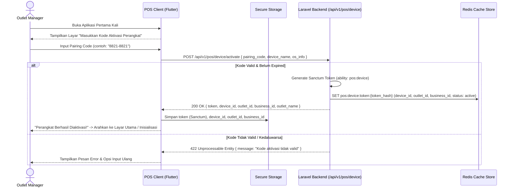
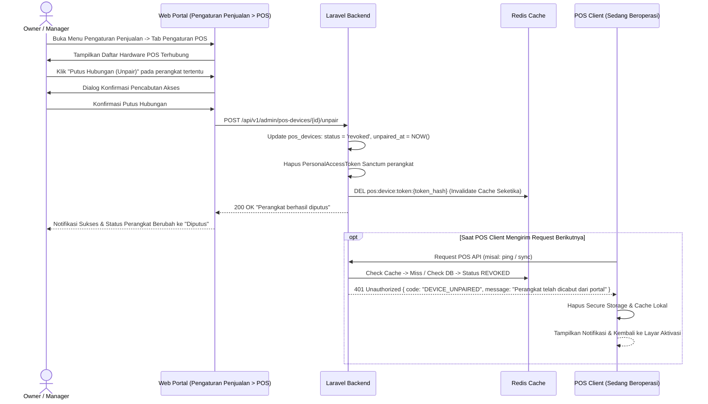
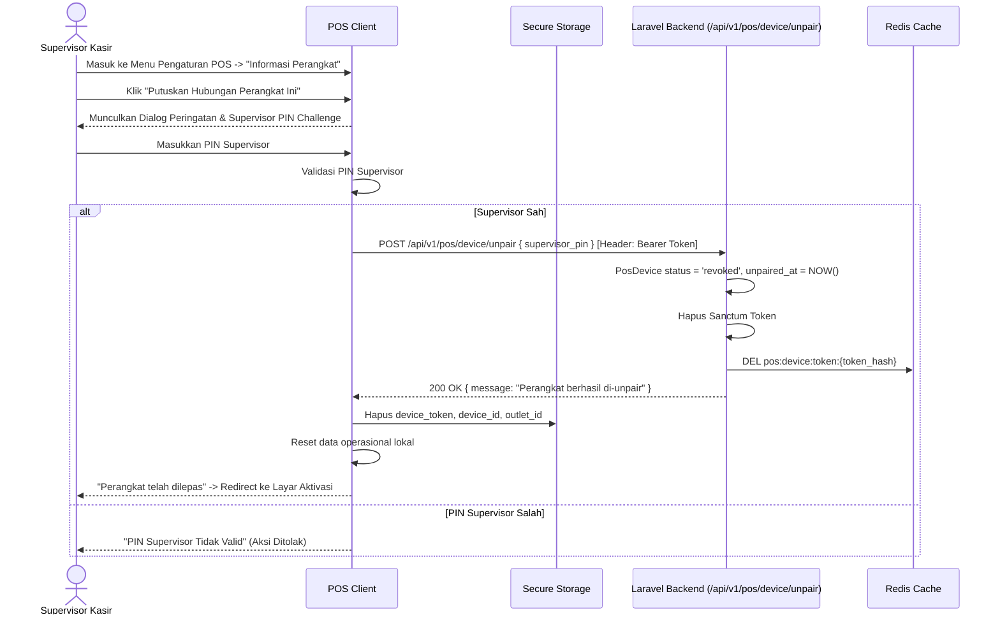
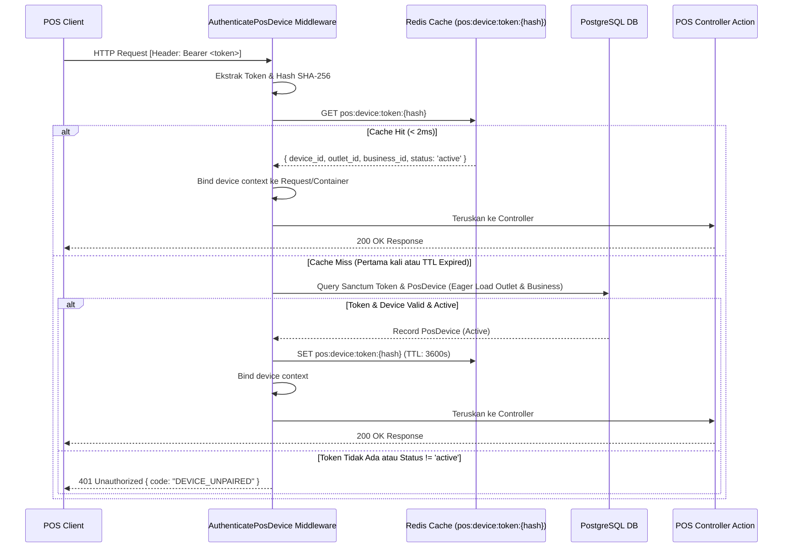

# PRD — Modul Transaksi & Penjualan - Channel POS V1.1
## Connecting Device, Hardware Pairing/Unpairing & Server-Side Security

## 1. Executive Summary & Bounded Context

Sub-modul **V1.1 Connecting Device, Hardware Pairing/Unpairing & Server-Side Security** adalah gerbang pertama (*onboarding & access control*) dalam ekosistem **Sollu POS Client**. Modul ini berfokus murni pada tata kelola perangkat keras kasir: identifikasi fisik perangkat (*Hardware Device Pairing*), siklus hidup pemutusan perangkat (*Two-Way Hardware Unpairing & Revocation*), penerbitan token keamanan jangka panjang menggunakan **Laravel Sanctum**, optimasi verifikasi autentikasi setiap request di sisi server berbasis **Cache (Redis/Memory Store)**, otorisasi tindakan kritis perangkat (*Supervisor PIN Challenge*), serta sentralisasi tata kelola konfigurasi melalui portal web pada menu **Pengaturan Penjualan**.

> **Catatan Fase Arsitektur**: Proses login kasir harian (*Cashier PIN Login*, *Offline PIN Verification*, *User PIN Update*, serta *Cashier Shift Switch*) secara khusus dipindahkan ke **Fase V1.2** bersamaan dengan *Initial Master Data Bootstrapping* dan *Core Register Screens*.

### Kapabilitas Utama V1.1:
1. **Device Activation & Pairing**: Pemasangan perangkat kasir baru ke outlet tertentu menggunakan kode aktivasi (*one-time pairing code*) 8-karakter yang divalidasi oleh backend Laravel.
2. **Device Unpairing & Hardware Revocation (Two-Way Lifecycle)**:
   - **Dari Web Portal (Remote Revocation)**: Owner/Outlet Manager dapat mencabut hak akses perangkat kasir secara remote melalui portal web (misal: jika perangkat rusak, hilang, atau ditarik). Token Sanctum langsung dicabut (*revoked*) dan cache sesi perangkat dibersihkan seketika.
   - **Dari POS Client (Local Unpairing)**: Staf berwenang dengan otorisasi Supervisor dapat memutuskan hubungan perangkat secara langsung dari menu pengaturan POS klien. Setelah konfirmasi PIN supervisor, token lokal & data offline dibersihkan, dan aplikasi kembali ke layar aktivasi awal.
3. **Optimized Server-Side Auth Caching**: Setiap request API dari POS client divalidasi secara optimal melalui middleware autentikasi server yang memanfaatkan **Redis / In-Memory Cache**. Metadata esensial perangkat (`pos_device_id`, `outlet_id`, `business_id`, status aktif) di-cache secara terstruktur sehingga memangkas query berulang ke database PostgreSQL pada setiap transaksi kasir bertrafik tinggi (*sub-millisecond auth overhead*), dilengkapi mekanisme *instant cache invalidation* saat pairing diputus.
4. **Sanctum Device Token Storage**: Penyimpanan aman token perangkat terenkripsi pada *Secure Storage* klien (Flutter Secure Storage) dengan kemampuan token (*ability*) khusus `pos:device`.
5. **Configurable Supervisor PIN Guard**: Proteksi aksi sensitif (*Void*, *Override Price*, *Custom Discount*, serta aksi *Unpair Device*) dengan mekanisme popup PIN supervisor lokal yang dapat diaktif/nonaktifkan per outlet.
6. **Sentralisasi Pengaturan Penjualan di Portal Web**:
   - Seluruh konfigurasi terkait kasir & transaksi dikelompokkan ke dalam menu **Pengaturan Penjualan** (`Sales Settings`) di portal web.
   - Halaman pengaturan dipisahkan menjadi dua tab/seksi terpisah:
     - **Pengaturan POS**: Konfigurasi operasional kasir, daftar hardware terpasang, kode pairing, dan toggle Supervisor PIN Guard.
     - **Pengaturan Penjualan Faktur**: Konfigurasi toleransi stok minus B2B, termin tempo pembayaran, prefix faktur, dan T&C standar. Seksi ini diproteksi secara kondisional dan **hanya muncul ketika fitur `invoice_debt` (`FeatureEnum::INVOICE_DEBT`) aktif** pada paket langganan bisnis yang bersangkutan (dilengkapi dialog upgrade jika diakses non-subscriber).

---

## 2. Architecture & Domain Flow

```
Sollu POS Client (Flutter)                   Laravel 12 Backend & Cache Layer
┌───────────────────────────┐                ┌──────────────────────────────────────────┐
│ Device Pairing Screen     │──Pairing Code─>│ PosDeviceController                      │
│ (Input Activation Code)   │<──Device Token─│ (Issues Sanctum Token & Caches Metadata) │
└─────────────┬─────────────┘                └────────────────────┬─────────────────────┘
              │                                                   │
              ▼                                                   ▼
┌───────────────────────────┐                        ┌────────────────────────┐
│ Flutter Secure Storage    │                        │ Redis Cache Layer      │
│ (device_token, device_id, │                        │ Key: pos:auth:{token}  │
│  outlet_id, business_id)  │                        │ (Status, Outlet, Biz)  │
└─────────────┬─────────────┘                        └────────────┬───────────┘
              │                                                   │
              ▼ (Every API Request w/ Bearer Token)               │ Fast Cache Hit
┌───────────────────────────┐                                     ▼ (< 2ms)
│ POS Request Interceptor   │───────────────────────────────>┌────────────────────────┐
│ (Hardware / POS Actions)  │                                │ AuthenticatePosDevice  │
└─────────────┬─────────────┘                                │ Middleware (Fast-Pass) │
              │                                              └────────────────────────┘
              │
              ▼ (Unpair Action: Client / Remote Web)
┌───────────────────────────┐                ┌──────────────────────────────────────────┐
│ Settings: Putus Pairing   │──POST unpair──>│ Invalidate Cache + Revoke Sanctum Token  │
│ (Supervisor PIN Confirmed)│<──200 OK Reset─│ (Status -> revoked / unlinked)           │
└───────────────────────────┘                └──────────────────────────────────────────┘
```

---

## 3. Core Features & User Activity Use Cases

### 3.1. Fitur Utama

| Fitur | Deskripsi |
| :--- | :--- |
| **Aktivasi Perangkat (*Device Pairing*)** | Registrasi tablet/PC kasir baru ke outlet dengan memasukkan 8-karakter kode aktivasi yang dibuat di web portal. |
| **Pemutusan Hubungan Perangkat (*Hardware Unpairing*)** | Mekanisme pencabutan lisensi perangkat secara remote dari Web Portal (oleh Manager/Owner) atau secara lokal dari POS Client (dengan PIN Supervisor). |
| **Optimasi Server Auth (*Cache-Driven Auth*)** | Caching metadata otentikasi perangkat di Redis pada setiap request API POS, memangkas round-trip DB dan menjamin throughput tinggi (< 2ms). |
| **Penyimpanan Token Aman** | Enkripsi token Sanctum `pos:device` di Keystore (Android) / Keychain (macOS/iOS) / DPAPI (Windows). |
| **Supervisor PIN Challenge** | Modal verifikasi otorisasi supervisor lokal saat staf melakukan aksi sensitif di luar wewenangnya (termasuk aksi unpair hardware). |
| **Pengaturan Penjualan Terpisah (Web Portal)** | Pembagian modul pada menu **Pengaturan Penjualan** menjadi tab **Pengaturan POS** dan tab **Pengaturan Penjualan Faktur** (gated by `invoice_debt`). |

### 3.2. Skenario Aktivitas Pengguna (Use Cases)

```
┌────────────────────────────────────────────────────────────────────────────────────────────────────────┐
│ Skenario Pengguna POS V1.1 & Portal Web                                                                │
├──────────────────────────────┬──────────────────────────────┬──────────────────────────────────────────┤
│ Use Case                     │ Kondisi & Perangkat          │ Respon & Output Sistem                   │
├──────────────────────────────┼──────────────────────────────┼──────────────────────────────────────────┤
│ 1. Pemasangan Perangkat Baru │ Aplikasi baru di-install     │ Kasir/Manager input pairing code 8-digit.│
│    (Device Pairing)          │ Internet: Online             │ Backend verifikasi & terbitkan device    │
│                              │                              │ token. Cache dibuat & disimpan di SecStore│
├──────────────────────────────┼──────────────────────────────┼──────────────────────────────────────────┤
│ 2. Pemutusan Pairing via Web │ Perangkat rusak / hilang     │ Manager klik "Putus Hubungan Perangkat". │
│    (Remote Unpair / Revoke)  │ Portal Web Admin             │ Token Sanctum & Redis cache dicabut.     │
│                              │                              │ POS Client otomatis ter-reset saat sync. │
├──────────────────────────────┼──────────────────────────────┼──────────────────────────────────────────┤
│ 3. Pemutusan Pairing di POS  │ Perangkat dipindahkan outlet │ Supervisor akses menu Device Settings di │
│    (Local Client Unpairing)  │ Layar POS Client             │ POS, input PIN Supervisor, konfirmasi.   │
│                              │                              │ Server me-revoke token, klien purge DB.  │
├──────────────────────────────┼──────────────────────────────┼──────────────────────────────────────────┤
│ 4. Verifikasi Request Cepat  │ POS mengirim request API     │ Middleware memeriksa Redis cache (< 2ms).│
│    (High-Throughput Guard)   │ Transaksi berjalan           │ Request lolos tanpa query berat ke DB.   │
├──────────────────────────────┼──────────────────────────────┼──────────────────────────────────────────┤
│ 5. Buka Pengaturan Penjualan │ Web Portal Admin/Owner       │ Pengaturan dipisah: Tab POS & Faktur.    │
│    (Sales Settings Nav)      │ Cek status paket langganan   │ Tab Penjualan Faktur hanya tampil jika   │
│                              │                              │ fitur `invoice_debt` aktif di tenant.    │
└──────────────────────────────┴──────────────────────────────┴──────────────────────────────────────────┘
```

---

## 4. User Flow & Sequence Diagrams

### 4.1. Alur Aktivasi Perangkat (*Device Pairing Flow*)



### 4.2. Alur Pemutusan Hubungan Perangkat (*Hardware Device Unpairing Flow*)

#### 4.2.1. Pemutusan dari Portal Web (Remote Revocation oleh Manager/Owner)



#### 4.2.2. Pemutusan dari POS Client (Local Unpairing dengan Supervisor PIN)



### 4.3. Alur Autentikasi Permintaan POS & Optimasi Cache Server



---

## 5. Technical Architecture & File Structure

### 5.1. File Structure Klien Flutter (`sollu_pos_client`)

```
lib/features/device/
├── presentation/
│   ├── controllers/
│   │   ├── device_activation_controller.dart # Notifier alur pairing perangkat
│   │   └── device_unpair_controller.dart     # Notifier alur pemutusan pairing hardware
│   ├── screens/
│   │   ├── device_activation_screen.dart    # Layar input pairing code
│   │   └── device_info_settings_screen.dart # Layar info perangkat & tombol unpair
│   └── widgets/
│       ├── pairing_code_input_field.dart    # Input field 8-digit berformat
│       ├── supervisor_pin_dialog.dart       # Modal challenge otorisasi supervisor
│       └── unpair_confirmation_dialog.dart  # Modal konfirmasi pemutusan hardware
├── domain/
│   ├── entities/
│   │   └── device_info.dart                 # Entity info perangkat kasir
│   └── usecases/
│       ├── activate_device_usecase.dart
│       ├── unpair_device_usecase.dart       # Call unpair API & purge local data
│       └── verify_supervisor_pin_usecase.dart
└── data/
    ├── datasources/
    │   ├── device_remote_data_source.dart   # Dio HTTP calls ke endpoint activate & unpair
    │   └── device_local_data_source.dart    # SecureStorage (device_token, device_id)
    └── repositories/
        └── device_repository_impl.dart
```

### 5.2. File Structure Backend Laravel 12 (`sollu-app`)

```
app/
├── Http/
│   ├── Controllers/
│   │   ├── API/POS/
│   │   │   ├── PosDeviceController.php      # Pairing, Unpairing & Device Info
│   │   │   └── PosSupervisorController.php  # Verifikasi wewenang supervisor
│   │   └── App/Settings/
│   │       └── SalesSettingController.php   # Controller Web Portal Pengaturan Penjualan
│   ├── Middleware/
│   │   └── AuthenticatePosDevice.php        # Fast-path cache-driven Sanctum token guard
│   └── Requests/
│       ├── API/POS/
│       │   ├── ActivateDeviceRequest.php    # Validasi pairing_code
│       │   └── UnpairDeviceRequest.php      # Validasi PIN supervisor saat unpair
│       └── App/Settings/
│           └── UpdateSalesSettingRequest.php # Validasi pengaturan POS & Penjualan Faktur
├── Services/
│   └── Pos/
│       └── PosDeviceAuthCacheService.php    # Layanan Redis cache auth perangkat & invalidation
├── Events/
│   └── Pos/
│       └── PosDeviceUnpairedEvent.php       # Event saat device di-unpair / di-revoke
├── Listeners/
│   └── Pos/
│       └── InvalidatePosDeviceCache.php     # Listener pembersihan cache seketika
├── Models/
│   └── PosDevice.php                        # Model perangkat kasir terdaftar
└── Enums/
    ├── DeviceStatusEnum.php                 # active, revoked, pending
    └── FeatureEnum.php                      # INVOICE_DEBT, POS_CASHIER, dll.
resources/js/
└── Pages/App/Settings/Sales/
    ├── Index.vue                            # Halaman Pengaturan Penjualan (Tab POS vs Tab Faktur)
    └── Partials/
        ├── PosSettingsTab.vue               # Tab Pengaturan POS (Hardware list, PIN Guard)
        └── InvoiceSettingsTab.vue           # Tab Penjualan Faktur (v-feature="invoice_debt")
```

### 5.3. Public API Contracts

#### 5.3.1. Endpoint Aktivasi Perangkat (Client Pairing)
- *Endpoint*: `POST /api/v1/pos/device/activate`
- *Request Body*:
  ```json
  {
    "pairing_code": "8821-8821",
    "device_name": "Kasir Utama Depan",
    "device_model": "iPad Pro 11-inch",
    "platform": "ios"
  }
  ```
- *Response (200 OK)*:
  ```json
  {
    "success": true,
    "data": {
      "token": "1|sanctum_plain_text_token_string",
      "device_id": "9b1deb4d-3b7d-4bad-9bdd-2b0d7b3dcb6d",
      "outlet_id": "8a0deb4c-1b7d-4aad-9bee-1b0d7b3dcb1a",
      "business_id": "7b0deb4c-1b7d-4aad-9bee-1b0d7b3dcb2b",
      "outlet_name": "Sollu Coffee Kemang"
    }
  }
  ```

#### 5.3.2. Endpoint Pemutusan Hubungan Perangkat dari POS Client (Local Unpairing)
- *Endpoint*: `POST /api/v1/pos/device/unpair`
- *Header*: `Authorization: Bearer <sanctum_device_token>`
- *Request Body*:
  ```json
  {
    "supervisor_pin": "654321",
    "reason": "Perangkat dialihkan ke Outlet Cabang B"
  }
  ```
- *Response (200 OK)*:
  ```json
  {
    "success": true,
    "message": "Perangkat berhasil diputus dari outlet."
  }
  ```
- *Response (403 Forbidden)*:
  ```json
  {
    "success": false,
    "message": "PIN Supervisor tidak valid untuk melakukan pemutusan perangkat."
  }
  ```

#### 5.3.3. Endpoint Pencabutan Hubungan Perangkat dari Portal Web (Remote Revocation)
- *Endpoint*: `POST /api/v1/admin/pos-devices/{id}/unpair`
- *Header*: `Authorization: Bearer <sanctum_web_user_token>`
- *Middleware*: `auth:sanctum`, `can:manage-pos-devices`
- *Request Body*:
  ```json
  {
    "reason": "Perangkat tablet lama rusak diganti unit baru"
  }
  ```
- *Response (200 OK)*:
  ```json
  {
    "success": true,
    "message": "Koneksi hardware kasir berhasil dicabut."
  }
  ```

#### 5.3.4. Konfigurasi Portal Web (Pengaturan Penjualan)
- *Route Web*: `GET /app/settings/sales` (Inertia Page: `App/Settings/Sales/Index`)
- *Struktur Navigasi Tab*:
  1. **Tab "Pengaturan POS"**:
     - *Daftar Perangkat Terhubung*: Tabel hardware (`name`, `model`, `platform`, `last_synced_at`, `status`, aksi "Putus Hubungan").
     - *Generate Kode Pairing*: Tombol untuk menerbitkan kode 8 digit baru (`XXXX-XXXX`) dengan TTL 15 menit.
     - *Supervisor PIN Guard*: Switch `enable_supervisor_pin_pos` (Void, Ubah Harga, Diskon Manual).
     - *Toleransi Operasional*: Switch `pos_allow_negative_stock`, `pos_auto_print_receipt`.
  2. **Tab "Pengaturan Penjualan Faktur"**:
     - **Conditional Rendering**: Dilindungi direktif `v-feature="FeatureEnum::INVOICE_DEBT"` (atau `v-if="$hasFeature('invoice_debt')"`). Jika paket langganan tenant tidak memiliki fitur `invoice_debt`, tab ini menampilkan trigger upgrade / terkunci secara anggun.
     - *Konfigurasi Faktur*: Toleransi stok minus B2B (`allow_negative_stock_b2b`), termin pembayaran & jatuh tempo (`default_due_days_b2b`), format awalan faktur (`b2b_invoice_prefix`), dan standar T&C faktur (`default_terms_and_conditions_b2b`).

---

## 6. Database Schema & Data Integrity

### 6.1. Schema PostgreSQL (Server)

```sql
-- Tabel Perangkat Kasir Terdaftar & Siklus Hidup Pairing
CREATE TABLE pos_devices (
    id UUID PRIMARY KEY DEFAULT gen_random_uuid(),
    business_id UUID NOT NULL REFERENCES businesses(id) ON DELETE CASCADE,
    outlet_id UUID NOT NULL REFERENCES outlets(id) ON DELETE CASCADE,
    name VARCHAR(100) NOT NULL,
    device_model VARCHAR(100),
    platform VARCHAR(50), -- android, ios, macos, windows
    pairing_code VARCHAR(20) UNIQUE,
    pairing_expires_at TIMESTAMP,
    status VARCHAR(20) NOT NULL DEFAULT 'active', -- pending, active, revoked
    is_active BOOLEAN GENERATED ALWAYS AS (status = 'active') STORED,
    unpaired_at TIMESTAMP NULL,
    unpaired_by UUID NULL REFERENCES users(id) ON DELETE SET NULL,
    revocation_reason VARCHAR(255) NULL,
    last_synced_at TIMESTAMP,
    created_at TIMESTAMP DEFAULT CURRENT_TIMESTAMP,
    updated_at TIMESTAMP DEFAULT CURRENT_TIMESTAMP
);

CREATE INDEX idx_pos_devices_tenant_status ON pos_devices(business_id, outlet_id, status);
CREATE INDEX idx_pos_devices_pairing_code ON pos_devices(pairing_code) WHERE pairing_code IS NOT NULL;

-- Pengaturan POS pada Tabel Outlets
ALTER TABLE outlets ADD COLUMN IF NOT EXISTS enable_supervisor_pin_pos BOOLEAN DEFAULT TRUE;
ALTER TABLE outlets ADD COLUMN IF NOT EXISTS pos_allow_negative_stock BOOLEAN DEFAULT FALSE;
ALTER TABLE outlets ADD COLUMN IF NOT EXISTS pos_auto_print_receipt BOOLEAN DEFAULT TRUE;
```

### 6.2. Schema Drift SQLite (Client)

```dart
class LocalDeviceInfo extends Table {
  TextColumn get deviceId => text()();
  TextColumn get outletId => text()();
  TextColumn get businessId => text()();
  TextColumn get deviceName => text()();
  DateTimeColumn get pairedAt => dateTime()();

  @override
  Set<Column> get primaryKey => {deviceId};
}
```

---

## 7. Single Source of Truth: Enums

### 7.1. PHP Backend Enums

```php
namespace App\Enums;

enum DeviceStatusEnum: string
{
    case PENDING = 'pending';
    case ACTIVE = 'active';
    case REVOKED = 'revoked';

    public function label(): string
    {
        return match ($this) {
            self::PENDING => 'Menunggu Aktivasi',
            self::ACTIVE => 'Terhubung',
            self::REVOKED => 'Terputus / Dicabut',
        };
    }
}
```

### 7.2. Dart Client Enums

```dart
enum DeviceStatus {
  pending('pending'),
  active('active'),
  revoked('revoked');

  final String value;
  const DeviceStatus(this.value);
}
```

---

## 8. Security, Server-Side Caching & Dual-Layer Authorization

### 8.1. Strategi Server-Side Authentication Caching (Ultra-Fast Device Auth)

Untuk menjamin setiap request kasir berjalan optimal tanpa degradasi performa database PostgreSQL pada jam sibuk (*peak hours*), proses autentikasi Sanctum perangkat dilindungi lapisan cache:

1. **Cache Key Pattern**:
   ```
   pos:device:token:{sha256_token_hash}
   ```
2. **Cached Metadata Payload**:
   ```json
   {
     "device_id": "9b1deb4d-3b7d-4bad-9bdd-2b0d7b3dcb6d",
     "business_id": "7b0deb4c-1b7d-4aad-9bee-1b0d7b3dcb2b",
     "outlet_id": "8a0deb4c-1b7d-4aad-9bee-1b0d7b3dcb1a",
     "status": "active",
     "outlet_is_active": true,
     "supervisor_pin_guard": true,
     "cached_at": 1741234567
   }
   ```
3. **TTL & Lifecycle**:
   - Cache disimpan selama **3.600 detik (1 jam)**.
   - Setiap kali request masuk, metadata langsung dibaca dari Redis (< 1.5ms). Database tidak disentuh sama sekali untuk pengecekan validitas device token.
4. **Instant Invalidation Triggers**:
   - Saat admin melakukan **Unpair / Revoke** dari Web Portal: Cache key dihapus seketika via `PosDeviceAuthCacheService::invalidate($tokenHash)`.
   - Saat staf melakukan **Unpair** dari POS Client: Token dihapus dan cache dibersihkan.
   - Saat status outlet atau bisnis dinonaktifkan: Event listener membersihkan seluruh cache device yang terafiliasi dengan outlet tersebut.

### 8.2. Dual-Layer Authorization & SaaS Feature Gating

1. **Device Level Authorization**:
   - Seluruh request POS wajib membawa Bearer token dengan ability `pos:device`.
   - Jika cache/DB mendeteksi `status !== 'active'`, middleware langsung merespons `401 Unauthorized` dengan error code `DEVICE_UNPAIRED`.
2. **Supervisor PIN Challenge**:
   - Aksi unpair dari klien dan aksi sensitif diatur oleh outlet toggle `enable_supervisor_pin_pos`.
3. **Portal Web Feature Plan Gating (`invoice_debt`)**:
   - Menu **Pengaturan Penjualan** memisahkan konfigurasi POS dan Penjualan Faktur.
   - Tab **Pengaturan Penjualan Faktur** wajib menggunakan `v-feature="FeatureEnum::INVOICE_DEBT"` pada template Vue. Jika tenant berada pada paket Starter/Retail yang tidak memiliki fitur faktur piutang tempo, tab faktur tidak tampil atau menampilkan ajakan upgrade, mencegah *feature confusion*.

---

## 9. Validasi & Error Handling

- **Format Pairing Code**: Format 8 digit alphanumeric (`/^[A-Z0-9]{4}-[A-Z0-9]{4}$/` atau `/^[A-Z0-9]{8}$/`).
- **Revoked / Unpaired Device Handling**: Jika token perangkat di-revoke di server (baik via web atau client unpair), seluruh request mengembalikan kode khusus `DEVICE_UNPAIRED`. POS Client mendeteksi kode ini, menghapus Secure Storage secara atomik, dan kembali ke layar aktivasi.
- **Offline Unpair Prevention**: Pemutusan hubungan perangkat hanya dapat dilakukan saat perangkat online agar status di backend dan fisik hardware tetap sinkron (*strictly consistent*).

---

## 10. UI & Hardware Interaction Standards

- **Layar Aktivasi Sederhana**: Input kode pairing dengan layout terpusat yang ramah sentuhan, mendukung auto-advance per 4 karakter.
- **Pemisahan Tab Visual Web**: Pada portal web `App/Settings/Sales/Index.vue`, gunakan tab navigasi modern tanpa shadow (Zero-Shadow style Sollu) dengan badge indikator jumlah hardware aktif.

---

## 11. Testing & Quality Assurance

1. **Device Pairing & Unpairing**:
   - `test_device_can_be_activated_with_valid_pairing_code()`
   - `test_activation_fails_with_expired_pairing_code()`
   - `test_device_can_be_unpaired_from_client_with_supervisor_pin()`
   - `test_client_unpair_fails_with_invalid_supervisor_pin()`
   - `test_device_can_be_revoked_from_web_portal()`
2. **Server-Side Authentication Caching**:
   - `test_device_request_hits_redis_cache_on_subsequent_requests()`
   - `test_device_cache_is_evicted_immediately_when_device_is_unpaired()`
   - `test_unpaired_device_request_is_rejected_with_device_unpaired_code()`
3. **Portal Web Sales Settings & Feature Gating**:
   - `test_sales_settings_renders_pos_tab_for_all_subscribed_merchants()`
   - `test_sales_settings_invoice_debt_tab_is_hidden_when_feature_not_active()`
   - `test_sales_settings_invoice_debt_tab_is_visible_when_feature_active()`

---

## 12. Implementation Plan & Definition of Done

### Deliverables:
1. **Backend**:
   - Endpoint aktivasi perangkat (`activate`), pemutusan pairing (`unpair`), dan pencabutan remote (`revoke`).
   - Middleware `AuthenticatePosDevice` terintegrasi cache Redis (`PosDeviceAuthCacheService`).
   - Web Controller `SalesSettingController` dengan pemisahan schema payload Pengaturan POS vs Penjualan Faktur.
   - Skema database `pos_devices` (status enum, index unpair).
2. **Web Portal Frontend**:
   - Pembaharuan halaman `resources/js/Pages/App/Settings/Sales/Index.vue` dengan tab **Pengaturan POS** dan **Pengaturan Penjualan Faktur**.
   - Integrasi `v-feature="FeatureEnum::INVOICE_DEBT"` untuk proteksi tab Penjualan Faktur.
   - Komponen manajemen hardware terhubung & tombol "Putus Hubungan".
3. **POS Client**:
   - Layar aktivasi, dialog supervisor modal untuk aksi unpair, penyimpanan SecureStorage.
   - Alur unpairing hardware lokal dengan supervisor challenge & auto-reset Secure Storage.

### Definition of Done (DoD):
- Perangkat kasir baru dapat terpasang ke outlet dalam waktu < 1 menit.
- Pemutusan hubungan perangkat (baik dari portal web maupun POS client) mencabut akses seketika dan membersihkan cache dalam waktu < 100ms.
- Verifikasi autentikasi server setiap request POS berjalan sub-milidetik memanfaatkan Redis cache tanpa query DB berulang.
- Menu Pengaturan Penjualan di portal web memisahkan tab POS dan tab Faktur, di mana tab Faktur hanya tampil jika fitur `invoice_debt` aktif.
