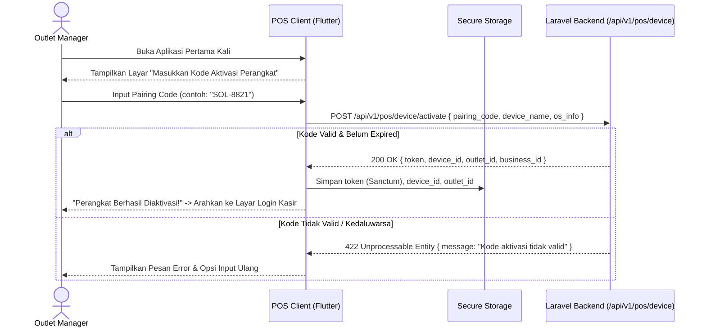
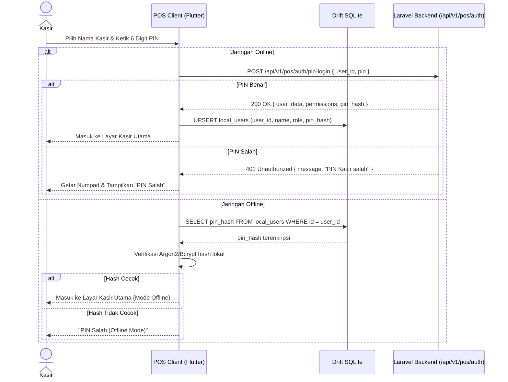

# PRD — Modul Transaksi & Penjualan - Channel POS App V1.1
## Connecting Device, User Authentication & PIN Management

## 1. Executive Summary & Bounded Context

Sub-modul **V1.1 Connecting Device, User Authentication & PIN Management** adalah gerbang pertama (*onboarding & access control*) dalam ekosistem **Sollu POS Client**. Modul ini bertanggung jawab atas identifikasi fisik perangkat kasir (*Hardware Device Pairing*), penerbitan token keamanan jangka panjang menggunakan **Laravel Sanctum**, autentikasi kasir berbasis PIN numerik cepat, otorisasi tindakan kritis (*Supervisor PIN Challenge*), serta pengelolaan peremajaan PIN pengguna.

### Kapabilitas Utama V1.1:
1. **Device Activation & Pairing**: Pemasangan perangkat kasir baru ke outlet tertentu menggunakan kode aktivasi (*one-time pairing code*) yang divalidasi oleh backend Laravel.
2. **Sanctum Device Token Storage**: Penyimpanan aman token perangkat terenkripsi pada *Secure Storage* klien (Flutter Secure Storage) dengan kemampuan token (*ability*) khusus `pos:device`.
3. **Fast Cashier PIN Login**: Akses login kasir harian menggunakan PIN 6-digit numerik berkecepatan tinggi tanpa perlu memasukkan email dan password panjang di layar sentuh kasir.
4. **Offline PIN Verification**: Verifikasi PIN kasir secara lokal menggunakan hash terenkripsi aman yang tersimpan di SQLite Drift untuk mendukung login saat internet terputus.
5. **User PIN Update**: Fitur penggantian PIN mandiri oleh kasir yang sedang aktif dengan verifikasi PIN lama dan validasi format.
6. **Configurable Supervisor PIN Guard**: Proteksi aksi sensitif (*Void*, *Override Price*, *Custom Discount*) dengan mekanisme popup PIN supervisor lokal yang dapat diaktif/nonaktifkan melalui pengaturan outlet di portal web.

---

## 2. Architecture & Domain Flow

```
Sollu POS Client (Flutter)                   Laravel 12 Backend
┌───────────────────────────┐                ┌───────────────────────────────┐
│ Device Pairing Screen     │──Pairing Code─>│ DeviceActivationController    │
│ (Input Activation Code)   │<──Device Token─│ (Issues Sanctum Device Token) │
└─────────────┬─────────────┘                └───────────────────────────────┘
              │
              ▼
┌───────────────────────────┐
│ Flutter Secure Storage    │ (device_token, device_uuid, outlet_id)
└─────────────┬─────────────┘
              │
              ▼
┌───────────────────────────┐                ┌───────────────────────────────┐
│ Cashier PIN Numpad Screen │──Verify PIN───>│ PosAuthController             │
│ (Fast Login / Lock Screen)│<──Cashier Data─│ (Returns user payload & hash) │
└─────────────┬─────────────┘                └───────────────────────────────┘
              │ (If Offline)
              ▼
┌───────────────────────────┐
│ Drift DB: local_users     │ (Local PIN Hash Verification)
└───────────────────────────┘
```

---

## 3. Core Features & User Activity Use Cases

### 3.1. Fitur Utama

| Fitur | Deskripsi |
| :--- | :--- |
| **Aktivasi Perangkat (*Device Pairing*)** | Registrasi tablet/PC kasir baru ke outlet dengan memasukkan 6-karakter kode aktivasi dari web portal. |
| **Penyimpanan Token Aman** | Enkripsi token Sanctum `pos:device` di Keystore (Android) / Keychain (macOS/iOS) / DPAPI (Windows). |
| **Login Kasir Cepat (*PIN Numpad*)** | Antarmuka keypad angka 0-9 untuk login kasir harian dalam waktu < 2 detik. |
| **Kunci Layar Kasir (*Screen Lock*)** | Mengunci sesi aktif kasir saat kasir meninggalkan meja register tanpa logout penuh. |
| **Ganti PIN Mandiri (*Update PIN*)** | Formulir pembaruan PIN kasir yang memverifikasi PIN lama dan menyinkronkan hash baru ke cloud & lokal. |
| **Supervisor PIN Challenge** | Modal verifikasi otorisasi supervisor lokal saat kasir standar melakukan aksi di luar wewenangnya. |

### 3.2. Skenario Aktivitas Pengguna (Use Cases)

```
┌────────────────────────────────────────────────────────────────────────────────────────────────────────┐
│ Skenario Pengguna POS V1.1                                                                             │
├──────────────────────────────┬──────────────────────────────┬──────────────────────────────────────────┤
│ Use Case                     │ Kondisi & Perangkat          │ Respon & Output Sistem                   │
├──────────────────────────────┼──────────────────────────────┼──────────────────────────────────────────┤
│ 1. Pemasangan Perangkat Baru │ Aplikasi baru di-install     │ Kasir/Manager input pairing code 6-digit.│
│    (Device Pairing)          │ Internet: Online             │ Backend verifikasi & terbitkan device    │
│                              │                              │ token. Token disimpan di Secure Storage. │
├──────────────────────────────┼──────────────────────────────┼──────────────────────────────────────────┤
│ 2. Login Kasir Harian        │ Device telah terpasang       │ Kasir pilih profil & ketik PIN 6 digit.  │
│    (Online Fast Login)       │ Internet: Online             │ Login sukses < 500ms, sesi aktif dimuat. │
├──────────────────────────────┼──────────────────────────────┼──────────────────────────────────────────┤
│ 3. Login Kasir Offline       │ Internet: Terputus           │ Sistem mencocokkan PIN dengan hash lokal │
│    (Offline PIN Match)       │ Kasir pergantian shift       │ di SQLite Drift. Akses kasir terbuka.    │
├──────────────────────────────┼──────────────────────────────┼──────────────────────────────────────────┤
│ 4. Penggantian PIN Kasir     │ Kasir di menu Pengaturan     │ Kasir input PIN lama, input PIN baru x2. │
│    (Update Cashier PIN)      │ Ingin memperbarui PIN        │ PIN divalidasi, hash di-update ke server │
│                              │                              │ dan tabel lokal `local_users`.           │
├──────────────────────────────┼──────────────────────────────┼──────────────────────────────────────────┤
│ 5. Tantangan PIN Supervisor  │ Kasir melakukan Void / Diskon│ Popup Supervisor PIN muncul. Supervisor  │
│    (Action Authorization)    │ enable_supervisor_pin = true │ memasukkan PIN. Aksi disetujui seketika. │
└──────────────────────────────┴──────────────────────────────┴──────────────────────────────────────────┘
```

---

## 4. User Flow & Sequence Diagrams

### 4.1. Alur Aktivasi Perangkat (*Device Pairing Flow*)



### 4.2. Alur Login Kasir & Verifikasi PIN (Online & Offline)



---

## 5. Technical Architecture & File Structure

### 5.1. File Structure Klien Flutter (`sollu_pos_client`)

```
lib/features/auth/
├── presentation/
│   ├── controllers/
│   │   ├── auth_controller.dart             # Riverpod Notifier untuk sesi kasir aktif
│   │   ├── device_activation_controller.dart # Notifier alur pairing perangkat
│   │   └── pin_update_controller.dart       # State pengelolaan ganti PIN
│   ├── screens/
│   │   ├── device_activation_screen.dart    # Layar input pairing code
│   │   ├── cashier_pin_login_screen.dart    # Layar numpad login kasir
│   │   └── change_pin_screen.dart           # Layar pembaruan PIN pengguna
│   └── widgets/
│       ├── numpad_keypad_widget.dart        # Reusable component angka 0-9 & backspace
│       ├── pin_dots_indicator.dart          # Komponen 6 bulatan status input PIN
│       └── supervisor_pin_dialog.dart       # Modal challenge otorisasi supervisor
├── domain/
│   ├── entities/
│   │   ├── pos_user.dart                    # Entity user kasir & supervisor
│   │   └── device_info.dart                 # Entity info perangkat kasir
│   └── usecases/
│       ├── activate_device_usecase.dart
│       ├── login_with_pin_usecase.dart
│       ├── update_user_pin_usecase.dart
│       └── verify_supervisor_pin_usecase.dart
└── data/
    ├── datasources/
    │   ├── auth_remote_data_source.dart     # Dio HTTP calls ke endpoint Laravel
    │   └── auth_local_data_source.dart      # SecureStorage & Drift DAO access
    └── repositories/
        └── auth_repository_impl.dart
```

### 5.2. File Structure Backend Laravel 12 (`sollu-app`)

```
app/
├── Http/
│   ├── Controllers/API/POS/
│   │   ├── PosDeviceController.php          # Pairing & Token Issuance
│   │   ├── PosAuthController.php            # PIN Login & PIN Update
│   │   └── PosSupervisorController.php      # Verifikasi wewenang supervisor
│   └── Requests/API/POS/
│       ├── ActivateDeviceRequest.php        # Validasi pairing_code
│       ├── PosPinLoginRequest.php           # Validasi login PIN
│       └── UpdateUserPinRequest.php         # Validasi PIN baru (numeric, length 6)
├── Models/
│   ├── PosDevice.php                        # Model perangkat kasir terdaftar
│   └── User.php                             # Menampung kolom `pos_pin` (hashed)
└── Enums/
    └── DeviceStatusEnum.php                 # active, revoked, pending
```

### 5.3. Public API Contracts

#### 5.3.1. Endpoint Aktivasi Perangkat
- *Endpoint*: `POST /api/v1/pos/device/activate`
- *Request Body*:
  ```json
  {
    "pairing_code": "SOL-8821",
    "device_name": "Kasir Utama Depan",
    "device_model": "iPad Pro 11-inch",
    "platform": "ios"
  }
  ```
- *Response (200 OK)*:
  ```json
  {
    "success": true,
    "data": {
      "token": "1|sanctum_plain_text_token_string",
      "device_id": "9b1deb4d-3b7d-4bad-9bdd-2b0d7b3dcb6d",
      "outlet_id": "8a0deb4c-1b7d-4aad-9bee-1b0d7b3dcb1a",
      "business_id": "7b0deb4c-1b7d-4aad-9bee-1b0d7b3dcb2b",
      "outlet_name": "Sollu Coffee Kemang"
    }
  }
  ```

#### 5.3.2. Endpoint Login PIN Kasir
- *Endpoint*: `POST /api/v1/pos/auth/pin-login`
- *Header*: `Authorization: Bearer <sanctum_device_token>`
- *Request Body*:
  ```json
  {
    "user_id": "3c0deb4c-1b7d-4aad-9bee-1b0d7b3dcb8e",
    "pin": "123456"
  }
  ```
- *Response (200 OK)*:
  ```json
  {
    "success": true,
    "data": {
      "user": {
        "id": "3c0deb4c-1b7d-4aad-9bee-1b0d7b3dcb8e",
        "name": "Budi Santoso",
        "role": "cashier",
        "is_supervisor": false,
        "pin_hash": "$2y$12$eXampLeHash..."
      },
      "permissions": ["pos:checkout", "pos:hold_bill"]
    }
  }
  ```

#### 5.3.3. Endpoint Update PIN Kasir
- *Endpoint*: `PUT /api/v1/pos/auth/update-pin`
- *Header*: `Authorization: Bearer <sanctum_device_token>`
- *Request Body*:
  ```json
  {
    "user_id": "3c0deb4c-1b7d-4aad-9bee-1b0d7b3dcb8e",
    "current_pin": "123456",
    "new_pin": "654321",
    "new_pin_confirmation": "654321"
  }
  ```

---

## 6. Database Schema & Data Integrity

### 6.1. Schema PostgreSQL (Server)

```sql
-- Tabel Perangkat Terdaftar
CREATE TABLE pos_devices (
    id UUID PRIMARY KEY DEFAULT gen_random_uuid(),
    business_id UUID NOT NULL REFERENCES businesses(id) ON DELETE CASCADE,
    outlet_id UUID NOT NULL REFERENCES outlets(id) ON DELETE CASCADE,
    name VARCHAR(100) NOT NULL,
    device_model VARCHAR(100),
    platform VARCHAR(50), -- android, ios, macos, windows
    pairing_code VARCHAR(20) UNIQUE,
    pairing_expires_at TIMESTAMP,
    is_active BOOLEAN DEFAULT TRUE,
    last_synced_at TIMESTAMP,
    created_at TIMESTAMP DEFAULT CURRENT_TIMESTAMP,
    updated_at TIMESTAMP DEFAULT CURRENT_TIMESTAMP
);

-- Kolom Tambahan pada Tabel Users
ALTER TABLE users ADD COLUMN IF NOT EXISTS pos_pin VARCHAR(255) NULL;
ALTER TABLE users ADD COLUMN IF NOT EXISTS is_pos_supervisor BOOLEAN DEFAULT FALSE;
```

### 6.2. Schema Drift SQLite (Client)

```dart
class LocalUsers extends Table {
  TextColumn get id => text()();
  TextColumn get name => text()();
  TextColumn get role => text()();
  BoolColumn get isSupervisor => boolean().withDefault(const Constant(false))();
  TextColumn get pinHash => text()();
  DateTimeColumn get updatedAt => dateTime()();

  @override
  Set<Column> get primaryKey => {id};
}
```

---

## 7. Single Source of Truth: Enums

### 7.1. PHP Backend Enums

```php
namespace App\Enums;

enum DeviceStatusEnum: string
{
    case PENDING = 'pending';
    case ACTIVE = 'active';
    case REVOKED = 'revoked';
}
```

### 7.2. Dart Client Enums

```dart
enum DeviceStatus { pending, active, revoked }
enum AuthStatus { unauthenticated, authenticated, locked }
```

---

## 8. Security & Dual-Layer Authorization

1. **Device Level Authorization**: Seluruh permintaan HTTP dari POS client wajib menyertakan Sanctum token dengan ability `pos:device`. Perangkat yang dinonaktifkan di web portal seketika mendapat 403 Forbidden.
2. **User Level Authorization**: Tindakan operasional didasarkan pada role user (`cashier` vs `outlet_supervisor`).
3. **Supervisor PIN Challenge**: Verifikasi aksi di-bypass otomatis jika konfigurasi outlet `enable_supervisor_pin_pos == false`.

---

## 9. Validasi & Error Handling

- **PIN Format**: Wajib 6 digit numerik (`regex:/^[0-9]{6}$/`).
- **Brute Force Protection**: Kunci input PIN selama 30 detik setelah 5 kali kesalahan berturut-turut.
- **Revoked Device Handling**: Jika token perangkat di-revoke di server, klien menghapus seluruh data lokal sensitif dan kembali ke layar aktivasi.

---

## 10. UI & Hardware Interaction Standards

- **Numpad Sentuh Ergonomis**: Tombol angka berukuran minimal $64 \times 64$ dp dengan efek haptic feedback saat ditekan.
- **Keyboard Listener Desktop**: Dukungan tombol Numpad fisik dan deretan angka keyboard (0-9, Backspace, Enter) pada platform PC kasir.

---

## 11. Testing & Quality Assurance

- `test_device_can_be_activated_with_valid_pairing_code()`
- `test_activation_fails_with_expired_pairing_code()`
- `test_cashier_can_login_with_valid_pin_online()`
- `test_cashier_can_login_with_valid_pin_offline_from_drift_cache()`
- `test_user_cannot_update_pin_with_invalid_current_pin()`
- `test_supervisor_pin_allows_protected_actions()`

---

## 12. Implementation Plan & Definition of Done

### Deliverables:
1. **Backend**: Controller aktivasi perangkat, penerbitan token Sanctum, endpoint login PIN & update PIN, migrasi skema tabel.
2. **Client**: Layar aktivasi, numpad PIN login, dialog ganti PIN, supervisor modal, penyimpanan SecureStorage.

### Definition of Done (DoD):
- Perangkat kasir baru dapat terpasang ke outlet dalam waktu < 1 menit.
- Kasir dapat login dalam waktu < 2 detik baik online maupun offline.
- Perubahan PIN tersinkronisasi ke server dan cache lokal tanpa kendala.
