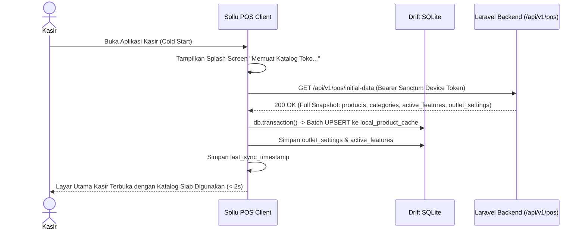
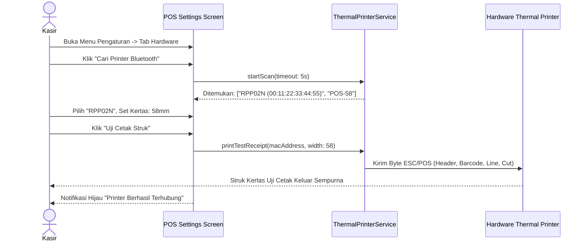

# PRD — Modul Transaksi & Penjualan - Channel POS App V1.2
## Initial Master Data, Hardware Printer & Core Register Screens

## 1. Executive Summary & Bounded Context

Sub-modul **V1.2 Initial Master Data, Hardware Printer & Core Register Screens** bertanggung jawab atas proses inisialisasi awal (*cold start bootstrapping*), sinkronisasi snapshot master produk dan kategori ke basis data lokal Drift SQLite, penghubung perangkat keras cetak (*hardware thermal printing bridge* ESC/POS), serta penyediaan tata letak layar utama kasir (*POS Register Screen*) yang ergonomis untuk tablet, smartphone, maupun desktop PC.

### Kapabilitas Utama V1.2:
1. **Dedicated Initial Data Bootstrapping (`GET /api/v1/pos/initial-data`)**: Endpoint terpisah berkecepatan tinggi yang mengembalikan snapshot utuh (katalog produk, kategori, varian, pelanggan, fitur paket bisnis aktif, konfigurasi outlet) tanpa logika percabangan delta yang rumit.
2. **Local Drift SQLite Database Engine**: Penyimpanan data katalog, varian, dan setting outlet ke tabel lokal SQLite untuk akses instan (< 10ms) dan ketahanan offline total.
3. **Adaptive POS Register Screen**: Antarmuka responsif dengan mode Split-View Landscape (65% Katalog di kiri, 35% Panel Keranjang di kanan) dan Portrait kompak.
4. **Hardware Thermal Printer Bridge**: Driver printer lokal mendukung koneksi Bluetooth Low Energy (BLE) dan USB ESC/POS dengan template cetak 58mm (32 kolom) dan 80mm (48 kolom).
5. **Hardware Barcode Scanner Bridge**: Dukungan pemindaian instan via kamera bawaan atau Barcode Scanner fisik (USB/Bluetooth HID Keyboard Emulation).
6. **Layar Pengaturan Aplikasi (*POS Settings Screen*)**: Menu konfigurasi koneksi printer, uji cetak (*test print*), pemilihan ukuran kertas, dan preferensi tampilan katalog (Grid Gambar vs List Kompak).

---

## 2. Architecture & Domain Flow

```
Laravel 12 Backend                   Sollu POS Client (Flutter)
┌──────────────────────────────┐     ┌────────────────────────────────┐
│ PosInitialDataController     │────>│ Remote Dio API Client          │
│ (Full Snapshot Loader)       │     └───────────────┬────────────────┘
└──────────────────────────────┘                     │ (Batch UPSERT)
                                                     ▼
                                     ┌────────────────────────────────┐
                                     │ Drift SQLite Local Database    │
                                     │ (local_product_cache, settings)│
                                     └───────────────┬────────────────┘
                                                     │
                                                     ▼
┌──────────────────────────────┐     ┌────────────────────────────────┐
│ Thermal Printer (ESC/POS)    │<────│ ThermalPrinterService (Bridge) │
│ Bluetooth BLE / USB OTG      │     │ (58mm / 80mm Format Generator) │
└──────────────────────────────┘     └────────────────────────────────┘
```

---

## 3. Core Features & User Activity Use Cases

### 3.1. Fitur Utama

| Fitur | Deskripsi |
| :--- | :--- |
| **Initial Master Data Loader** | Mengunduh seluruh snapshot master produk, harga, varian, kategori, pelanggan, dan fitur SaaS bisnis aktif. |
| **Katalog Produk Dinamis** | Tampilan Grid Gambar atau List Kompak dengan Category Chips dan pencarian instan. |
| **Panel Pengaturan Printer** | Pemindaian perangkat Bluetooth/USB di sekitar, pemilihan ukuran kertas (58mm/80mm), dan tombol Uji Cetak Struk. |
| **Hardware Scanner Bridge** | Listener pemindai barcode USB/Bluetooth HID yang langsung menangkap input tanpa memindahkan kursor mouse. |
| **Kustomisasi Tampilan Layar** | Pengaturan rasio grid produk, visibilitas foto produk, dan ukuran teks untuk kenyamanan kasir. |

### 3.2. Skenario Aktivitas Pengguna (Use Cases)

```
┌────────────────────────────────────────────────────────────────────────────────────────────────────────┐
│ Skenario Pengguna POS V1.2                                                                             │
├──────────────────────────────┬──────────────────────────────┬──────────────────────────────────────────┤
│ Use Case                     │ Kondisi & Perangkat          │ Respon & Output Sistem                   │
├──────────────────────────────┼──────────────────────────────┼──────────────────────────────────────────┤
│ 1. Cold Start Inisialisasi   │ Kasir selesai aktivasi/login │ App memanggil /api/v1/pos/initial-data.  │
│    Data Master Katalog       │ Internet: Online             │ 1.000 produk tersimpan ke Drift SQLite   │
│                              │                              │ dalam waktu < 2 detik.                   │
├──────────────────────────────┼──────────────────────────────┼──────────────────────────────────────────┤
│ 2. Menghubungkan Printer     │ Kasir di menu Pengaturan     │ App memindai Bluetooth BLE. Kasir pilih  │
│    Thermal Bluetooth         │ Printer ESC/POS menyala      │ "RPP02N", klik Test Print. Struk keluar. │
├──────────────────────────────┼──────────────────────────────┼──────────────────────────────────────────┤
│ 3. Pindai Barcode Produk     │ Kasir di Layar Utama POS     │ Scanner menembak barcode produk. Item    │
│    dengan Barcode Scanner    │ Scanner USB terpasang        │ langsung masuk ke keranjang belanja.     │
├──────────────────────────────┼──────────────────────────────┼──────────────────────────────────────────┤
│ 4. Menyesuaikan Layout Layar │ Tablet kasir 10 inci         │ Kasir beralih dari Grid Gambar ke List   │
│    (Grid vs List Kompak)     │ Mode Landscape               │ Kompak untuk menampilkan 30 item/layar.  │
└──────────────────────────────┴──────────────────────────────┴──────────────────────────────────────────┘
```

---

## 4. User Flow & Sequence Diagrams

### 4.1. Alur Bootstrapping Data Master Awal (*Cold Start Flow*)



### 4.2. Alur Konfigurasi Printer & Test Print



---

## 5. Technical Architecture & File Structure

### 5.1. File Structure Klien Flutter (`sollu_pos_client`)

```
lib/features/
├── pos/
│   ├── presentation/
│   │   ├── controllers/
│   │   │   ├── catalog_controller.dart          # Riverpod Notifier pencarian & filter produk
│   │   │   └── pos_layout_controller.dart       # Pengaturan tampilan Grid vs List
│   │   ├── screens/
│   │   │   ├── pos_register_screen.dart         # Layar utama kasir (Split Screen)
│   │   │   ├── catalog_view.dart                # Grid/List katalog produk
│   │   │   └── product_detail_modal.dart        # Pop-up varian produk & modifier
│   │   └── widgets/
│   │       ├── category_chips_bar.dart          # Filter horizontal kategori produk
│   │       └── product_card_item.dart           # Komponen kartu produk di katalog
│   └── data/
│       ├── database/
│       │   ├── tables/
│       │   │   ├── local_product_cache.dart     # Definisi tabel produk SQLite
│       │   │   └── local_outlet_settings.dart   # Pengaturan outlet lokal
│       │   └── daos/
│       │       └── catalog_dao.dart             # Query cari produk, filter kategori
│       └── remote/
│           └── pos_initial_data_service.dart    # Dio client call ke initial-data
├── hardware/
│   ├── presentation/
│   │   └── screens/
│   │       └── printer_settings_screen.dart     # Layar pemindaian printer & konfigurasi
│   ├── printer/
│   │   ├── thermal_printer_service.dart         # Wrapper Bluetooth BLE & USB ESC/POS
│   │   ├── escpos_ticket_builder.dart           # Generator byte ESC/POS 58mm & 80mm
│   │   └── thermal_printer_models.dart          # PrinterDevice, PaperWidthEnum
│   └── scanner/
│       └── barcode_scanner_listener.dart        # HID Keyboard event interceptor
└── settings/
    └── presentation/
        └── screens/
            └── pos_settings_screen.dart         # Layar pengaturan umum kasir
```

### 5.2. File Structure Backend Laravel 12 (`sollu-app`)

```
app/
├── Http/
│   ├── Controllers/API/POS/
│   │   ├── PosInitialDataController.php         # Endpoint /api/v1/pos/initial-data
│   │   └── PosConfigController.php              # Pengaturan outlet POS
│   └── Resources/POS/
│       ├── PosInitialDataResource.php           # Resource pembungkus snapshot
│       └── PosCatalogProductResource.php        # Resource produk, varian, dan harga
```

### 5.3. Public API Contract (`GET /api/v1/pos/initial-data`)

- *Endpoint*: `GET /api/v1/pos/initial-data`
- *Header*: `Authorization: Bearer <sanctum_device_token>`
- *Response (200 OK)*:
  ```json
  {
    "success": true,
    "data": {
      "outlet": {
        "id": "8a0deb4c-1b7d-4aad-9bee-1b0d7b3dcb1a",
        "name": "Sollu Coffee Kemang",
        "address": "Jl. Kemang Raya No. 10, Jakarta Selatan",
        "phone": "081234567890",
        "receipt_footer": "Terima kasih atas kunjungan Anda!"
      },
      "active_features": [
        "pos_cashier",
        "shift_management",
        "cash_drawer"
      ],
      "outlet_settings": {
        "enable_supervisor_pin_pos": false,
        "allow_negative_stock_pos": true,
        "bypass_shift_pos": false,
        "tax_percentage": 11.0,
        "service_charge_percentage": 0.0
      },
      "categories": [
        {
          "id": "1a0deb4c-1b7d-4aad-9bee-1b0d7b3dcb11",
          "name": "Coffee",
          "order": 1
        }
      ],
      "products": [
        {
          "id": "7b0deb4c-1b7d-4aad-9bee-1b0d7b3dcb2b",
          "name": "Kopi Susu Gula Aren",
          "category_id": "1a0deb4c-1b7d-4aad-9bee-1b0d7b3dcb11",
          "barcode": "899123456789",
          "price": 25000.0000,
          "stock": 45.0000,
          "image_url": "https://cdn.sollu.id/products/kopi.jpg",
          "variants": []
        }
      ]
    }
  }
  ```

---

## 6. Database Schema & Data Integrity

### 6.1. Schema Drift SQLite (Client)

```dart
class LocalProductCache extends Table {
  TextColumn get id => text()();
  TextColumn get name => text()();
  TextColumn get categoryId => text().nullable()();
  TextColumn get barcode => text().nullable()();
  RealColumn get price => real()();
  RealColumn get stock => real().withDefault(const Constant(0.0))();
  TextColumn get imageUrl => text().nullable()();
  BoolColumn get isActive => boolean().withDefault(const Constant(true))();
  DateTimeColumn get updatedAt => dateTime()();

  @override
  Set<Column> get primaryKey => {id};
}

class LocalCategories extends Table {
  TextColumn get id => text()();
  TextColumn get name => text()();
  IntColumn get sortOrder => integer().withDefault(const Constant(0))();

  @override
  Set<Column> get primaryKey => {id};
}
```

---

## 7. Single Source of Truth: Enums

### 7.1. Dart Client Enums

```dart
enum PaperWidth {
  mm58(32),
  mm80(48);

  final int maxCharsPerLine;
  const PaperWidth(this.maxCharsPerLine);
}

enum CatalogViewMode { grid, compactList }
enum PrinterConnectionStatus { disconnected, connecting, connected }
```

---

## 8. Hardware Printing Standard (ESC/POS)

- **Template Struk Standar 58mm**:
  - Kolom Maksimal: 32 karakter per baris.
  - Nama Toko: `ESC ! 0x30` (Double Height & Width, Center).
  - Alamat & Telp: Normal Center.
  - Garis Pemisah: `--------------------------------` (32 karakter `-`).
  - Baris Item: Format 2 baris jika nama produk panjang.
  - Total & Pembayaran: Bold Align Right.
  - Cut Paper: `GS V 66 0` (Feed and Cut).

---

## 9. Testing & Quality Assurance

- `test_initial_data_fetches_and_persists_to_drift()`
- `test_catalog_search_filters_instantly_by_name_and_barcode()`
- `test_escpos_generator_formats_58mm_receipt_within_character_limit()`
- `test_scanner_bridge_captures_fast_keyboard_keystrokes()`

---

## 10. Implementation Plan & Definition of Done

### Deliverables:
1. **Backend**: Controller & Resource `/api/v1/pos/initial-data`.
2. **Client**: Initial data sync worker, Drift table `LocalProductCache`, antarmuka Split-Screen kasir, thermal printer service Bluetooth/USB, layar setting printer.

### Definition of Done (DoD):
- Inisialisasi awal 1.000 produk berhasil disimpan di SQLite lokal dalam waktu < 2 detik.
- Aplikasi berhasil mendeteksi dan mencetak struk uji coba ke printer thermal Bluetooth 58mm/80mm.
- Barcode scanner fisik langsung memasukkan item ke keranjang belanja tanpa latensi.
