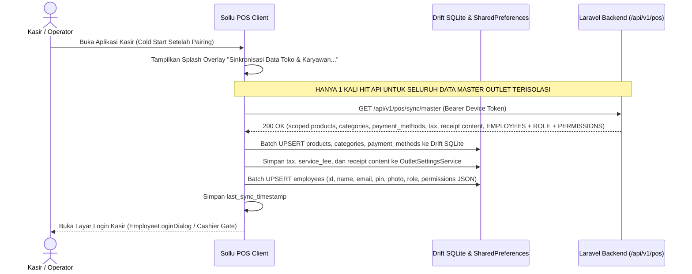
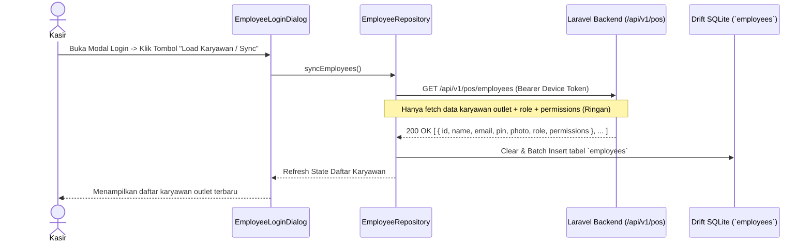
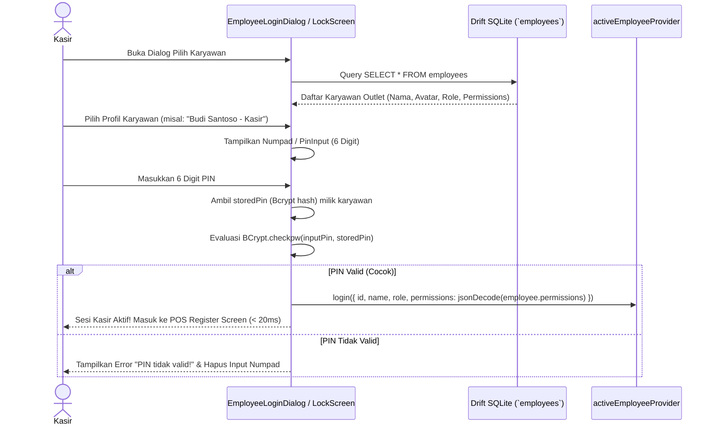

# PRD — Modul Transaksi & Penjualan - Channel POS V1.2
## Initial Master Data, Cashier PIN Authentication, Dedicated Device Hardware Printer & Core Register Screens

## 1. Executive Summary & Bounded Context

Sub-modul **V1.2 Initial Master Data, Cashier PIN Authentication, Dedicated Device Hardware Printer & Core Register Screens** bertanggung jawab atas proses inisialisasi awal (*cold start bootstrapping*), sinkronisasi snapshot master data outlet yang terisolasi ketat per outlet (katalog produk, varian, kategori, pelanggan, metode pembayaran aktif, pajak dan biaya layanan, pengaturan konten struk, serta **daftar karyawan yang terdaftar pada outlet tersebut lengkap dengan peran (*role*) dan hak aksesnya (*permissions*)**), autentikasi kasir harian berbasis PIN numerik cepat (*Fast Cashier PIN Login*) menggunakan **flow existing**, otorisasi aksi kasir berbasis role dan permissions, penguncian layar kasir (*Screen Lock*), penghubung perangkat keras cetak (*hardware thermal printing bridge* ESC/POS) yang dikonfigurasi **secara dedicated pada masing-masing perangkat kasir (Local Device Storage)** lengkap dengan fitur **Auto Print Struk (default: true)**, pemindai barcode (*barcode scanner HID*), serta penyediaan tata letak layar utama kasir (*POS Register Screen*) yang ergonomis untuk tablet, smartphone, maupun desktop PC.

> **Catatan Fase Arsitektur**:
> 1. **Isolasi Data Ketat Per Outlet (*Strict Outlet Scoping*)**: Seluruh data yang disinkronkan ke perangkat kasir diambil secara eksklusif berdasarkan `outlet_id` perangkat yang terotorisasi. Karyawan, produk, metode pembayaran, inventori, dan pengaturan yang bukan milik outlet tersebut **dilarang keras diambil atau bocor**.
> 2. **Single-Endpoint Cold Start**: Untuk efisiensi jaringan dan keandalan cold start, aplikasi kasir **hanya memanggil 1 endpoint tunggal** (`GET /api/v1/pos/sync/master`). Endpoint ini mengembalikan data katalog produk, pengaturan outlet, metode pembayaran, pajak/biaya, tata letak konten struk, **serta seluruh data karyawan terdaftar pada outlet tersebut lengkap dengan peran (*role*), hash PIN, dan daftar izin (*permissions*)**. Klien **tidak perlu melakukan 2 kali hit API** saat awal aplikasi dibuka.
> 3. **On-Demand Employee Refresh**: Endpoint `GET /api/v1/pos/employees` difungsikan khusus untuk pembaruan mandiri (*on-demand refresh*) data karyawan dan hak akses tanpa perlu mengunduh ulang master katalog.
> 4. **Dedicated Device Hardware & Local Storage**: Pengaturan perangkat keras printer thermal (MAC address Bluetooth BLE, koneksi USB/Network, ukuran kertas fisik 58mm/80mm) serta opsi **Auto Print (default: true)** sepenuhnya disimpan dan dikelola **di perangkat kasir masing-masing (Local SharedPreferences)**. Pengaturan printer dihilangkan dari portal app web backend. Pada portal app web (menu Layout Struk), pengaturan ukuran kertas **hanya berfungsi sebagai toggle display/preview simulator struk semata tanpa menyimpan ke database**.

### Kapabilitas Utama V1.2:
1. **Unified Initial Master Data Bootstrapping (`GET /api/v1/pos/sync/master`)**: Endpoint snapshot tunggal berkecepatan tinggi yang mengembalikan seluruh data master outlet secara terisolasi ketat: katalog produk, varian, kategori, pelanggan, metode pembayaran aktif outlet, pengaturan pajak & biaya layanan (*tax & service fee*), tata letak konten struk (*receipt layout*), serta **daftar karyawan aktif outlet lengkap dengan peran (*role*), hash PIN, dan daftar hak akses (*permissions*)**.
2. **On-Demand Employee Refresh (`GET /api/v1/pos/employees`)**: Jalur pembaruan data karyawan outlet secara mandiri dan cepat tanpa harus mengunduh ulang seluruh katalog master data.
3. **Fast Cashier PIN Login, Role & Permission Session (Flow Existing)**: 
   - Kasir memilih profil dari daftar karyawan outlet yang tersedia (dengan pencarian instan dan tombol reload staf).
   - Numpad angka 0-9 untuk input 6 digit PIN kasir.
   - Verifikasi PIN dieksekusi secara instan dan *offline-first* dengan mencocokkan input terhadap hash Bcrypt (`BCrypt.checkpw`) pada basis data lokal `employees`.
   - Pembebanan **role** dan **permissions** kasir ke sesi aktif (`activeEmployeeProvider`) untuk memvalidasi wewenang operasional kasir (seperti void transaksi, diskon khusus, buka/tutup shift, dan unpair device).
   - Perpindahan shift kasir (*cashier switch*) serta penguncian layar instan (*screen lock*) saat kasir meninggalkan meja register.
4. **Pembaruan PIN Kasir Mandiri (`PUT /api/v1/pos/employees/pin`)**: Menggunakan alur existing dengan validasi PIN lama (`current_pin`), PIN baru 6 digit numerik (`pin`), dan konfirmasi PIN (`pin_confirmation`), lalu mengupdate hash di server dan tabel lokal `employees`.
5. **Local Drift SQLite Database & Local Settings Storage**: Penyimpanan katalog produk, varian, kategori, metode pembayaran, dan karyawan (+ role & permissions JSON) ke tabel lokal SQLite Drift, serta penyimpanan profil outlet, pajak/biaya, dan layout struk ke `OutletSettingsService` (SharedPreferences) untuk akses instan (< 10ms) dan ketahanan offline total.
6. **Dedicated Device Hardware Printer Bridge**: Driver printer lokal mendukung koneksi Bluetooth Low Energy (BLE), USB ESC/POS, dan Network/Desktop Raw Printer dengan konfigurasi fisik mandiri di level perangkat kasir.
7. **Pengaturan Auto Print Struk (Default: True, Dedicated di Device)**: Pengaturan otomatisasi cetak struk begitu transaksi berhasil diselesaikan, aktif secara bawaan (*default: true*), dikelola secara lokal pada perangkat kasir melalui Layar Pengaturan POS tanpa perlu disinkronkan ke server web.
8. **Adaptive POS Register Screen**: Antarmuka responsif dengan mode Split-View Landscape (65% Katalog di kiri, 35% Panel Keranjang di kanan) dan Portrait kompak.
9. **Hardware Barcode Scanner Bridge**: Dukungan pemindaian instan via kamera bawaan atau Barcode Scanner fisik (USB/Bluetooth HID Keyboard Emulation).
10. **Layar Pengaturan Aplikasi (*POS Settings Screen*)**: Menu konfigurasi koneksi printer, uji cetak (*test print*), pemilihan ukuran kertas printer fisik, **toggle auto print struk (default: true)**, preferensi tampilan katalog, dan profil akun kasir.

---

## 2. Architecture & Domain Flow

```
Laravel 12 Backend                   Sollu POS Client (Flutter)
┌──────────────────────────────┐     ┌──────────────────────────────────────────┐
│ SyncController@masterData    │────>│ SyncRepository (Dio API Client)            │
│ (Strict Outlet Scoped:       │     │ 1 Single Request: GET /sync/master       │
│  - Products, Categories      │     └────────────────────┬─────────────────────┘
│  - Active Payment Methods    │                          │
│  - Tax & Service Fees        │                          ▼ (Atomic Batch UPSERT & Cache)
│  - Receipt Content Settings  │     ┌──────────────────────────────────────────┐
│  - Employees, Roles, Perms)  │     │ Local Storage Engine                     │
└──────────────────────────────┘     │ 1. Drift SQLite:                         │
                                     │    - products, product_categories        │
┌──────────────────────────────┐     │    - payment_methods                     │
│ EmployeeController@index     │────>│    - employees (id, name, pin, role,     │
│ (On-Demand Refresh:          │     │                 permissions JSON)        │
│  GET /employees)             │     │ 2. OutletSettingsService (Dedicated):    │
└──────────────────────────────┘     │    - tax_percentage, service_charge      │
                                     │    - receipt_settings (content only)     │
                                     │    - printer_config (MAC, paper, auto)   │
                                     └────────────────────┬─────────────────────┘
                                                          │
                                                          ▼ (Existing Cashier PIN Flow)
                                     ┌──────────────────────────────────────────┐
                                     │ EmployeeLoginDialog / LockScreen         │
                                     │ 1. Pilih Karyawan Outlet                 │
                                     │ 2. Input PIN 6-digit                     │
                                     │ 3. Offline BCrypt.checkpw(pin, hash)     │
                                     │ 4. Set Active Employee (Role & Perms)    │
                                     └────────────────────┬─────────────────────┘
                                                          │
                                                          ▼ (Authenticated Session)
                                     ┌──────────────────────────────────────────┐
                                     │ POS Register Screen                      │
                                     │ - Split-View Catalog & Cart              │
                                     │ - Role/Permission Guard (Void/Discount)  │
                                     └────────────────────┬─────────────────────┘
                                                          │ (Checkout Done)
                                                          ▼ (Auto Print: True Default)
                                     ┌──────────────────────────────────────────┐
                                     │ Thermal Printer (ESC/POS Dedicated)      │
                                     │ - BLE / USB / Desktop Raw Printer        │
                                     │ - Managed 100% on Local Device           │
                                     └──────────────────────────────────────────┘
```

---

## 3. Core Features & User Activity Use Cases

### 3.1. Fitur Utama

| Fitur | Deskripsi |
| :--- | :--- |
| **Unified Master Data Loader** | Mengunduh snapshot master produk, kategori, pelanggan, metode pembayaran aktif, pajak & biaya layanan, pengaturan konten struk, **serta karyawan outlet beserta role & hak aksesnya** via **1 endpoint tunggal** `GET /api/v1/pos/sync/master`. Semua data terfilter ketat hanya untuk outlet perangkat terkait. |
| **On-Demand Employee Refresh** | Endpoint mandiri `GET /api/v1/pos/employees` untuk memperbarui data staf, role, dan hak akses kasir outlet tanpa perlu re-fetch master katalog. |
| **Login Kasir Cepat (Flow Existing)** | Kasir memilih profil karyawan outlet dan memasukkan 6 digit PIN. Verifikasi dilakukan instan secara lokal menggunakan `BCrypt.checkpw`. |
| **Otorisasi Berbasis Role & Permissions** | Memuat `role` dan daftar `permissions` ke sesi aktif untuk memvalidasi wewenang operasional kasir (misal: kasir vs supervisor untuk void transaksi atau diskon manual). |
| **Dedicated Hardware Printer & Auto Print** | Pengaturan koneksi printer fisik dan toggle **Auto Print (default: true)** disimpan mandiri di level perangkat kasir tanpa dependensi ke portal web backend. |
| **Web Portal Receipt Preview Only** | Di portal web backoffice, pengaturan ukuran kertas hanya berfungsi sebagai toggle simulator preview tampilan nota, tanpa menyimpan data hardware/kertas ke database. |
| **Kunci Layar & Ganti Kasir (*Screen Lock*)** | Mengunci sesi register kasir saat ditinggalkan dan mendukung perpindahan operator kasir dengan cepat tanpa logout perangkat. |
| **Ganti PIN Mandiri (*Update PIN*)** | Formulir pembaruan PIN kasir via `PUT /api/v1/pos/employees/pin` dengan validasi PIN lama dan update hash di server & database lokal. |

### 3.2. Skenario Aktivitas Pengguna (Use Cases)

```
┌────────────────────────────────────────────────────────────────────────────────────────────────────────┐
│ Skenario Pengguna POS V1.2                                                                             │
├──────────────────────────────┬──────────────────────────────┬──────────────────────────────────────────┤
│ Use Case                     │ Kondisi & Perangkat          │ Respon & Output Sistem                   │
├──────────────────────────────┼──────────────────────────────┼──────────────────────────────────────────┤
│ 1. Cold Start Inisialisasi   │ Perangkat telah di-pairing   │ App HANYA memanggil /sync/master (1 hit).│
│    Data Master Khusus Outlet │ Internet: Online             │ Hanya data milik outlet perangkat yang   │
│                                                             │ diambil. Karyawan, role, perms tersimpan.│
├──────────────────────────────┼──────────────────────────────┼──────────────────────────────────────────┤
│ 2. Login Kasir Harian        │ Kasir memulai shift          │ Kasir pilih profil & ketik PIN 6 digit.  │
│    (Flow Existing PIN Auth)  │ Internet: Online/Offline     │ Validasi hash BCrypt lokal (< 20ms).     │
│                                                             │ Sesi aktif + role & permissions termuat. │
├──────────────────────────────┼──────────────────────────────┼──────────────────────────────────────────┤
│ 3. On-Demand Refresh Staf    │ Kasir baru didaftarkan       │ Kasir klik "Load Karyawan" di dialog.    │
│    (Pembaruan Data Karyawan) │ Operasional toko berjalan    │ App memanggil /employees (tanpa re-fetch │
│                                                             │ katalog). Staf outlet terbaru muncul.    │
├──────────────────────────────┼──────────────────────────────┼──────────────────────────────────────────┤
│ 4. Otorisasi Supervisor Void │ Kasir biasa ingin void item  │ Sistem cek role & permission kasir. Jika │
│    (Permission Guard)        │ Meja register aktif          │ tidak ada izin, muncul pop-up otorisasi  │
│                                                             │ PIN Supervisor outlet.                   │
├──────────────────────────────┼──────────────────────────────┼──────────────────────────────────────────┤
│ 5. Konfigurasi Printer &     │ Kasir di menu Pengaturan     │ Kasir hubungkan printer Bluetooth/USB    │
│    Auto Print Struk          │ Tab Hardware Printer         │ lokal. Auto Print aktif (default true).  │
│                                                             │ Pengaturan tersimpan di device lokal.    │
├──────────────────────────────┼──────────────────────────────┼──────────────────────────────────────────┤
│ 6. Desain Struk di Portal    │ Manajer di web backoffice    │ Manajer mengatur logo, header, footer.   │
│    (Web Layout Preview)      │ Halaman Layout Struk         │ Toggle 58mm/80mm hanya mengubah tampilan │
│                                                             │ preview tanpa menyimpan ukuran ke DB.    │
└──────────────────────────────┴──────────────────────────────┴──────────────────────────────────────────┘
```

---

## 4. User Flow & Sequence Diagrams

### 4.1. Alur Bootstrapping Data Master Awal (*Cold Start Flow - 1 Single Request*)



### 4.2. Alur Pembaruan Karyawan Mandiri (*On-Demand Employee Refresh*)



### 4.3. Alur Login Kasir, Role & Pemuatan Hak Akses (Flow Existing)



---

## 5. Technical Architecture & File Structure

### 5.1. File Structure Klien Flutter (`sollu-pos-client`)

```
lib/
├── core/
│   ├── database/
│   │   ├── app_database.dart                     # Drift database container
│   │   └── tables/
│   │       └── master_data_tables.dart           # Tabel Products, PaymentMethods, Employees (role & permissions)
│   ├── network/
│   │   └── dio_client.dart                       # Dio HTTP client dengan interceptor token
│   └── services/
│       ├── outlet_settings_service.dart          # Local cache profil outlet, tax, receipt settings, printer config
│       └── desktop_raw_printer.dart              # Raw printing service untuk desktop (macOS/Win)
├── features/
│   ├── auth/
│   │   ├── data/
│   │   │   ├── auth_repository.dart              # Pairing & unpairing device
│   │   │   └── employee_repository.dart          # syncEmployees (/employees) & changePin (/employees/pin)
│   │   └── presentation/
│   │       ├── providers/
│   │       │   ├── auth_provider.dart            # activeEmployeeProvider (id, name, role, permissions)
│   │       │   └── employee_provider.dart        # employeeListProvider
│   │       └── widgets/
│   │           ├── employee_login_dialog.dart    # Dialog pilih karyawan & input PIN (Flow Existing)
│   │           └── change_pin_dialog.dart        # Dialog ganti PIN 6 digit mandiri
│   ├── settings/
│   │   ├── data/
│   │   │   └── sync_repository.dart              # syncMasterData (/sync/master) memproses katalog + employees
│   │   └── presentation/
│   │       ├── providers/
│   │       │   └── printer_provider.dart         # Pengelolaan koneksi printer & toggle auto_print (dedicated lokal)
│   │       └── pages/
│   │           └── settings_screen.dart          # Layar pengaturan printer & auto-print (default: true)
│   └── hardware/
│       └── printer/
│           ├── thermal_printer_service.dart      # Adapter Bluetooth BLE & USB ESC/POS
│           └── escpos_ticket_builder.dart        # Generator struk 58mm & 80mm
```

### 5.2. File Structure Backend Laravel 12 (`sollu-app`)

```
app/
├── Http/
│   ├── Controllers/
│   │   ├── API/POS/
│   │   │   ├── SyncController.php                # GET /api/v1/pos/sync/master (Strict Scoped, Employees & Perms)
│   │   │   ├── EmployeeController.php            # GET /api/v1/pos/employees & PUT /api/v1/pos/employees/pin
│   │   │   └── DeviceController.php              # Pairing, checkStatus, & unpair pos device
│   │   └── App/Settings/
│   │       └── ReceiptSettingController.php      # Layout Struk web portal (Hanya simpan konten nota)
│   └── Requests/App/Settings/
│       └── UpdateReceiptSettingRequest.php       # Form request konten struk (tanpa konfigurasi printer hardware)
├── Services/App/
│   └── Transaction/
│       └── MasterDataSyncService.php             # Agregator snapshot master: scoped produk, setting & employees
└── Models/
    ├── User.php                                  # Kolom `pin` (Bcrypt), relasi `roles`, `permissions`, `outlets`
    ├── Outlet.php                                # Relasi `users`, `paymentMethods`, `settings`
    └── Master/
        └── PaymentMethod.php                     # Scope `activeForOutlet($outletId)`
resources/js/Pages/App/Settings/Receipt/
└── Index.vue                                     # Web layout struk (Toggle kertas hanya untuk display preview)
```

### 5.3. Public API Contracts

#### 5.3.1. Endpoint Master Data Sync (`GET /api/v1/pos/sync/master`)
- *Endpoint*: `GET /api/v1/pos/sync/master`
- *Header*: `Authorization: Bearer <sanctum_device_token>`
- *Deskripsi*: Satu-satunya endpoint yang dipanggil saat *cold start*, memuat seluruh data master katalog, konfigurasi outlet, serta karyawan outlet beserta peran (*role*) dan hak aksesnya (*permissions*). Data terfilter ketat hanya untuk outlet perangkat terkait.
- *Response (200 OK)*:
  ```json
  {
    "success": true,
    "message": "Master data retrieved successfully",
    "data": {
      "outlet": {
        "id": "8a0deb4c-1b7d-4aad-9bee-1b0d7b3dcb1a",
        "name": "Sollu Coffee Kemang",
        "address": "Jl. Kemang Raya No. 10, Jakarta Selatan",
        "phone": "081234567890",
        "email": "kemang@sollu.id",
        "logo_url": "https://cdn.sollu.id/outlets/logo.png"
      },
      "products": [
        {
          "id": "7b0deb4c-1b7d-4aad-9bee-1b0d7b3dcb2b",
          "name": "Kopi Susu Gula Aren",
          "product_category_id": "1a0deb4c-1b7d-4aad-9bee-1b0d7b3dcb11",
          "sku": "KOP-001",
          "barcode": "899123456789",
          "is_show": true
        }
      ],
      "payment_methods": [
        {
          "id": "pm-cash-01",
          "name": "Tunai (Cash)",
          "type": "cash",
          "sort_order": 1,
          "is_active": true
        }
      ],
      "settings": {
        "tax_percentage": 11.0,
        "service_charge_percentage": 5.0,
        "tax_included_in_price": false,
        "rounding_enabled": true,
        "rounding_mode": "nearest",
        "receipt": {
          "show_logo": true,
          "logo_url": "https://cdn.sollu.id/outlets/logo.png",
          "custom_header_title": null,
          "header_notes": "Terima kasih atas kunjungan Anda!",
          "show_address": true,
          "show_phone": true,
          "show_cashier_name": true,
          "show_customer_name": true,
          "show_order_type": true,
          "show_tax_detail": true,
          "show_service_charge": true,
          "footer_notes": "Barang yang sudah dibeli tidak dapat ditukar."
        }
      },
      "employees": [
        {
          "id": "3c0deb4c-1b7d-4aad-9bee-1b0d7b3dcb8e",
          "name": "Budi Santoso",
          "email": "budi@sollu.id",
          "pin": "$2y$12$eXampLeHashCashier1...",
          "photo": null,
          "role": "Kasir",
          "permissions": [
            "transaction.create",
            "transaction.view",
            "transaction.hold",
            "transaction.reprint"
          ]
        },
        {
          "id": "5e0deb4c-1b7d-4aad-9bee-2b0d7b3dcb9f",
          "name": "Siti Rahma",
          "email": "siti@sollu.id",
          "pin": "$2y$12$eXampLeHashSupervisor2...",
          "photo": "https://cdn.sollu.id/avatars/siti.jpg",
          "role": "Supervisor Outlet",
          "permissions": [
            "transaction.*",
            "transaction.void",
            "transaction.refund",
            "transaction.discount",
            "transaction.open_shift",
            "transaction.close_shift",
            "setting.device"
          ]
        }
      ]
    }
  }
  ```

#### 5.3.2. Endpoint Refresh Data Karyawan Mandiri (`GET /api/v1/pos/employees`)
- *Endpoint*: `GET /api/v1/pos/employees`
- *Header*: `Authorization: Bearer <sanctum_device_token>`
- *Deskripsi*: Digunakan secara on-demand untuk me-refresh data staf, role, dan hak akses kasir outlet terkait.
- *Response (200 OK)*:
  ```json
  {
    "success": true,
    "message": "Data karyawan berhasil diambil.",
    "data": [
      {
        "id": "3c0deb4c-1b7d-4aad-9bee-1b0d7b3dcb8e",
        "name": "Budi Santoso",
        "email": "budi@sollu.id",
        "pin": "$2y$12$eXampLeHashCashier1...",
        "photo": null,
        "role": "Kasir",
        "permissions": [
          "transaction.create",
          "transaction.view",
          "transaction.hold",
          "transaction.reprint"
        ]
      }
    ]
  }
  ```

---

## 6. Hardware Printing & Dedicated Device Auto Print

### 6.1. Dedicated Device Printer Architecture
- **Konsep**: Printer thermal adalah periferal fisik yang melekat pada unit kasir (POS Terminal / Device). Tidak ada penyimpanan hardware printer di database pusat.
- **Konfigurasi Lokal (`OutletSettingsService`)**:
  - Mac Address / Vendor ID / Product ID Printer.
  - Ukuran Kertas Fisik (58mm / 80mm).
  - **Auto Print Struk**: Nilai bawaan (*default*) adalah **`true`**.
- **Perilaku Selesai Transaksi**:
  - Begitu kasir menekan selesaikan pembayaran dan transaksi sukses tercatat di database lokal, jika `autoPrint == true`, aplikasi langsung memicu pencetakan struk ke printer yang terhubung.
- **Portal Backoffice Layout Struk**:
  - Tombol ukuran kertas (58mm vs 80mm) pada form web portal hanya berfungsi sebagai toggle simulator preview display struk di layar monitor, **tidak disimpan ke database**.
