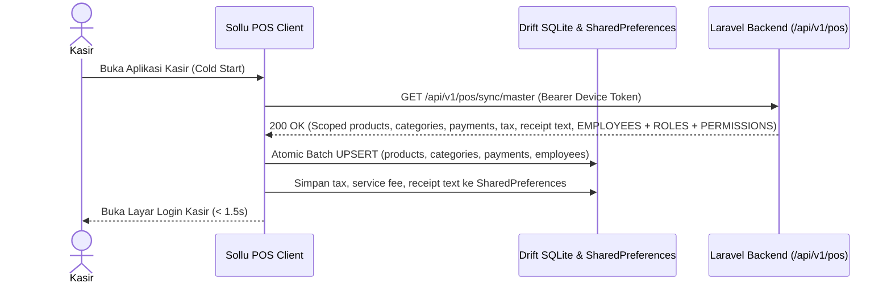
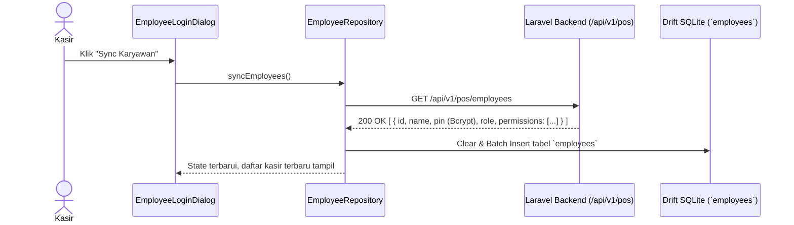
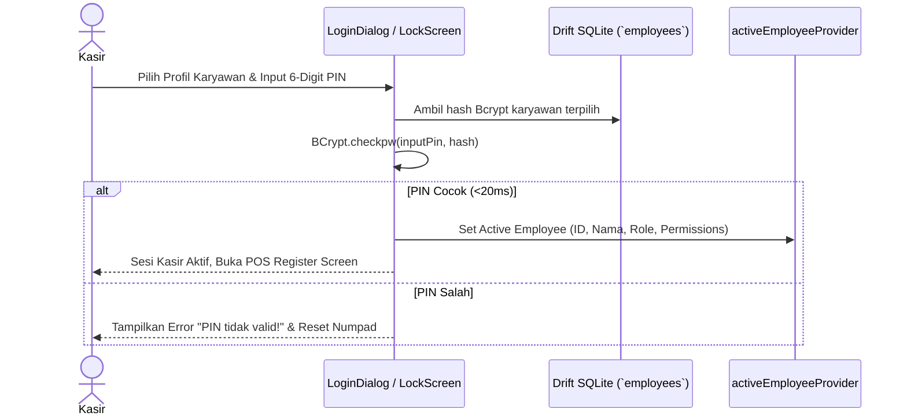

# PRD — Modul Transaksi & Penjualan - Channel POS V1.2
## Initial Master Data, Cashier PIN Authentication, Dedicated Device Hardware Printer & Core Register Screens

---

## 1. Executive Summary & Core Principles

Sub-modul **V1.2** mencakup cold-start bootstrapping master data outlet, otentikasi kasir cepat berbasis PIN lokal, otorisasi supervisi berbasis permission eksplisit, manajemen hardware printer thermal dedicated (dengan fitur Auto Print bawaan dan Test Print format nyata), integrasi scanner barcode HID, dan antarmuka kasir ergonomis dengan standar 17 keyboard shortcuts POS industri yang dioptimalkan untuk layar dengan color gamut rendah.

### Prinsip Arsitektur Utama:
1. **Strict Outlet Isolation**: Data yang disinkronkan ke perangkat kasir difilter ketat hanya untuk `outlet_id` perangkat terdaftar. Data outlet lain dilarang keras bocor.
2. **Single-Hit Cold Start (`GET /api/v1/pos/sync/master`)**: Mengunduh seluruh master data dalam 1 kali pemanggilan: katalog produk, varian, kategori, pelanggan, metode pembayaran aktif, pajak & biaya, pengaturan teks nota, serta **karyawan outlet lengkap dengan peran (*role*), hash PIN (Bcrypt), dan daftar *permissions***.
3. **On-Demand Employee Refresh (`GET /api/v1/pos/employees`)**: Pembaruan cepat data karyawan tanpa perlu mengunduh ulang katalog produk.
4. **Dedicated Device Hardware (Zero Server Sync)**: Konfigurasi printer fisik (Bluetooth BLE, Win32 Spooler, CUPS, Network TCP 9100, ukuran 58mm/80mm) dan preferensi **Auto Print (default: `true`)** disimpan murni di local storage perangkat (`SharedPreferences`). Web portal hanya menyediakan simulator preview nota tanpa menyimpan konfigurasi printer ke database.
5. **Live Setup Test Print**: Fitur uji cetak printer thermal langsung menggunakan format nyata sesuai setup pengaturan struk & nota outlet aktif (nama outlet, logo lokal ter-rasterisasi, header/footer notes, kalkulasi simulasi pajak/service, auto-cut, dan cash drawer kick).
6. **Role-Agnostic Supervision (`transaction.validation_supervision`)**: Otorisasi supervisi kasir didecouple dari nama role dinamis. Hak persetujuan tindakan kasir berisiko (diskon, open price, void, buka laci) divalidasi murni berdasarkan permission khusus `transaction.validation_supervision` (atau root user).
7. **High-Definition UI Standards (Low Color Gamut Resilience)**: Standar desain kasir anti-ambigu untuk hardware layar POS low-cost (panel TN / gamut rendah <60% sRGB) dengan border struktural tegas (1–2px), kontras teks maksimal (WCAG AAA), outline status aktif tegas, dan zero-shadow flat design.
8. **Standard 17 Industrial POS Shortcuts**: Seluruh operasional kasir desktop/tablet mendukung operasional 100% keyboard (*Zero-Mouse Operation*) dengan standar industri POS (`F1`–`F12`, `Esc`, `Panah ↑/↓`, `Enter`, `Ctrl+P`, `Spacebar`).

---

## 2. Architecture & Domain Flow

```
Laravel 12 Backend                   Sollu POS Client (Flutter)
┌──────────────────────────────┐     ┌──────────────────────────────────────────┐
│ SyncController@masterData    │────>│ SyncRepository (Dio Client)              │
│ (Strict Outlet Scoped:       │     │ 1 Single Hit: GET /sync/master           │
│  - Products, Categories      │     └────────────────────┬─────────────────────┘
│  - Active Payment Methods    │                          │
│  - Tax & Service Fees        │                          ▼ (Atomic Batch UPSERT & Cache)
│  - Receipt Text Content      │     ┌──────────────────────────────────────────┐
│  - Employees, Roles, Perms)  │     │ Local Storage Engine                     │
└──────────────────────────────┘     │ 1. Drift SQLite:                         │
                                     │    - products, product_categories        │
┌──────────────────────────────┐     │    - payment_methods                     │
│ EmployeeController@index     │────>│    - employees (id, name, pin, role,     │
│ (GET /employees: on-demand)  │     │                 permissions JSON)        │
└──────────────────────────────┘     │ 2. OutletSettingsService (Dedicated):    │
                                     │    - tax, service fee, receipt content   │
                                     │    - printer_config, pos_auto_print      │
                                     └────────────────────┬─────────────────────┘
                                                          │
                                                          ▼ (Offline BCrypt Check <20ms)
                                     ┌──────────────────────────────────────────┐
                                     │ EmployeeLoginDialog / LockScreen         │
                                     │ - Input 6-Digit PIN                      │
                                     │ - Populate activeEmployeeProvider        │
                                     └────────────────────┬─────────────────────┘
                                                          │
                                                          ▼ (Active Cashier Session)
                                     ┌──────────────────────────────────────────┐
                                     │ POS Register Screen (High-Contrast UI)   │
                                     │ - Split-View Catalog & Cart              │
                                     │ - 17 POS Shortcuts (F1-F12, etc.)        │
                                     │ - Supervisor Challenge:                  │
                                     │   transaction.validation_supervision     │
                                     └────────────────────┬─────────────────────┘
                                                          │ (Checkout Done / Test Print)
                                                          ▼ (Auto Print: True Default)
                                     ┌──────────────────────────────────────────┐
                                     │ Thermal Printer (Dedicated ESC/POS)      │
                                     │ - BLE / Win32 RAW / CUPS / Network Socket│
                                     │ - Live Setup Test Print (Real Receipt)   │
                                     └──────────────────────────────────────────┘
```

---

## 3. Core Features & Use Cases

### 3.1. Fitur Utama

| Fitur | Deskripsi Teknis |
| :--- | :--- |
| **Unified Master Sync** | Snapshot tunggal katalog, pembayaran, setting, dan staf via `GET /api/v1/pos/sync/master`. |
| **On-Demand Employee Sync** | Refresh data staf, role, dan permission via `GET /api/v1/pos/employees`. |
| **Fast PIN Login (<20ms)** | Otentikasi kasir instan via `BCrypt.checkpw` lokal terhadap tabel SQLite `employees`. |
| **Role-Agnostic Supervision** | Otorisasi supervisi (diskon, void, open price) mengecek permission `transaction.validation_supervision` (bukan string nama role). |
| **Dedicated Hardware Printer** | Konfigurasi printer (BLE, USB RAW, Network) tersimpan di `SharedPreferences` perangkat kasir. |
| **Live Setup Test Print** | Tombol uji cetak yang langsung merender format nyata setup struk toko (logo, profil, item simulasi, kalkulasi, footer, auto-cut, drawer). |
| **Dedicated Auto Print** | Cetak struk otomatis pasca checkout aktif secara bawaan (`pos_auto_print = true`). |
| **17 Industrial POS Shortcuts** | Navigasi kasir cepat tanpa mouse via keyboard standar F1-F12. |
| **Low-Gamut Resilient UI** | Desain visual berketegasan tinggi: border kontur 1-2px, seleksi ber-outline tebal, tipografi kontras pekat (WCAG AAA). |
| **Barcode HID Wedge** | Interceptor input barcode scanner USB/Bluetooth berbasis timing keystroke (<50ms). |
| **Screen Lock & Fast Switch** | Kunci antarmuka instan tanpa menghapus keranjang aktif; ganti shift kasir instan. |
| **Self-Service PIN Update** | Kasir memperbarui PIN mandiri via `PUT /api/v1/pos/employees/pin`. |

### 3.2. Skenario Aktivitas Pengguna (Use Cases)

| Use Case | Aktor & Kondisi | Respon & Output Sistem |
| :--- | :--- | :--- |
| **1. Cold Start Inisialisasi** | Kasir membuka app setelah pairing | App memanggil `GET /sync/master` (1 hit). Katalog & karyawan outlet tersimpan ke SQLite & SharedPreferences lokal. |
| **2. Login Kasir Harian** | Kasir memulai shift (Online/Offline) | Kasir memilih nama & mengetik 6-digit PIN. Validasi BCrypt lokal <20ms memuat permissions ke sesi aktif. |
| **3. Refresh Staf Mandiri** | Karyawan baru ditambahkan di web | Kasir klik "Sync Karyawan" di dialog login. App memanggil `GET /employees` tanpa re-fetch katalog. |
| **4. Uji Cetak Format Nyata** | Kasir di menu Pengaturan Printer | Kasir klik "Uji Cetak / Test Print". Printer langsung mencetak nota fisik format nyata sesuai logo, nama toko, item simulasi, dan footer outlet. |
| **5. Input Barang via Scanner** | Kasir memindai barcode fisik | Global HID listener mendeteksi burst ketikan <50ms, mencari item di SQLite, dan memasukkan ke keranjang tanpa fokus kursor manual. |
| **6. Operasi Kasir via Shortcut** | Kasir menggunakan keyboard desktop | Kasir menekan `F2` (Diskon), `F3` (Qty), `Panah ↑/↓` (Pilih Item), `F8` (Tahan), `F10` (Quick Cash), atau `F12` (Pay & Print). |
| **7. Supervisor Override** | Kasir tanpa izin menekan `F5` (Open Price) / `F6` (Void) | Sistem memunculkan modal PIN Supervisor. Supervisor dengan permission `transaction.validation_supervision` memasukkan PIN untuk menyetujui aksi. |
| **8. Auto Print Pasca Transaksi** | Transaksi pembayaran berhasil | Sistem membaca `pos_auto_print == true` dan mencetak struk secara asinkron tanpa menahan UI kasir. |

---

## 4. Sequence Diagrams

### 4.1. Cold Start Bootstrapping (Single Hit API)



### 4.2. On-Demand Employee Refresh



### 4.3. Fast PIN Login & Permission Loading



---

## 5. Technical Architecture & API Contracts

### 5.1. File Structure

#### Klien Flutter (`sollu-pos-client`)
```
lib/
├── core/
│   ├── database/app_database.dart                 # Drift database container
│   │   └── tables/master_data_tables.dart         # Tabel Products, PaymentMethods, Employees
│   ├── models/printer_model.dart                  # Model PrinterConfig, PaperSize, ConnectionType
│   ├── network/dio_client.dart                    # Dio HTTP client dengan token Sanctum
│   └── services/
│       ├── outlet_settings_service.dart          # Local SharedPreferences (pos_auto_print, printer)
│       ├── printer_service.dart                  # Unified printer service (BLE, Network)
│       └── desktop_raw_printer.dart              # Win32 FFI & CUPS raw ESC/POS service
├── features/
│   ├── auth/
│   │   ├── data/employee_repository.dart          # /employees & /employees/pin
│   │   ├── presentation/providers/auth_provider.dart # activeEmployeeProvider (role & permissions)
│   │   └── presentation/widgets/
│   │       ├── employee_login_dialog.dart        # Dialog login PIN & switch cashier
│   │       └── change_pin_dialog.dart            # Dialog ganti PIN mandiri
│   ├── pos/
│   │   ├── presentation/pages/pos_layout.dart     # Core Screen (High-contrast Split-view & 17 Shortcuts)
│   │   ├── presentation/providers/cart_provider.dart # State keranjang belanja
│   │   └── presentation/widgets/
│   │       ├── product_grid.dart                 # Grid katalog produk ber-border tegas
│   │       ├── cart_panel.dart                   # Panel keranjang belanja
│   │       ├── supervisor_challenge_dialog.dart  # Modal otorisasi PIN transaction.validation_supervision
│   │       └── hardware_scanner_listener.dart    # Global HID keyboard wedge interceptor
│   └── settings/
│       └── presentation/pages/printer_settings_screen.dart # Konfigurasi printer, auto-print & live test print
```

#### Backend Laravel 12 (`sollu-app`)
```
app/
├── Enums/
│   └── PermissionEnum.php                        # Includes TRANSACTION_VALIDATION_SUPERVISION
├── Http/Controllers/API/POS/
│   ├── SyncController.php                        # GET /api/v1/pos/sync/master
│   └── EmployeeController.php                    # GET /employees & PUT /employees/pin
├── Services/App/Transaction/
│   └── MasterDataSyncService.php                 # Agregator snapshot master scoped outlet
└── Models/
    ├── User.php                                  # pin (Bcrypt), roles, permissions, outlets
    └── Outlet.php                                # users, paymentMethods, settings
```

### 5.2. Public API Contracts

#### 1. `GET /api/v1/pos/sync/master`
- **Header**: `Authorization: Bearer <device_token>`
- **Response (200 OK)**:
```json
{
  "success": true,
  "message": "Master data retrieved successfully",
  "data": {
    "outlet": {
      "id": "8a0deb4c-1b7d-4aad-9bee-1b0d7b3dcb1a",
      "name": "Sollu Coffee Kemang",
      "address": "Jl. Kemang Raya No. 10",
      "phone": "081234567890",
      "email": "kemang@sollu.id",
      "logo_url": "https://cdn.sollu.id/outlets/logo.png"
    },
    "products": [
      {
        "id": "7b0deb4c-1b7d-4aad-9bee-1b0d7b3dcb2b",
        "name": "Kopi Susu Gula Aren",
        "product_category_id": "1a0deb4c-1b7d-4aad-9bee-1b0d7b3dcb11",
        "sku": "KOP-001",
        "barcode": "899123456789",
        "is_show": true
      }
    ],
    "payment_methods": [
      {
        "id": "pm-cash-01",
        "name": "Tunai (Cash)",
        "type": "cash",
        "sort_order": 1,
        "is_active": true
      }
    ],
    "settings": {
      "tax_percentage": 11.0,
      "service_charge_percentage": 5.0,
      "tax_included_in_price": false,
      "rounding_enabled": true,
      "rounding_mode": "nearest",
      "receipt": {
        "show_logo": true,
        "logo_url": "https://cdn.sollu.id/outlets/logo.png",
        "custom_header_title": null,
        "header_notes": "Terima kasih atas kunjungan Anda!",
        "show_address": true,
        "show_phone": true,
        "show_cashier_name": true,
        "show_customer_name": true,
        "show_order_type": true,
        "show_tax_detail": true,
        "show_service_charge": true,
        "footer_notes": "Barang yang sudah dibeli tidak dapat ditukar."
      }
    },
    "employees": [
      {
        "id": "3c0deb4c-1b7d-4aad-9bee-1b0d7b3dcb8e",
        "name": "Budi Santoso",
        "email": "budi@sollu.id",
        "pin": "$2y$12$eXampLeHashCashier1...",
        "photo": null,
        "role": "Kasir",
        "permissions": [
          "transaction.create",
          "transaction.view",
          "transaction.hold",
          "transaction.reprint"
        ]
      },
      {
        "id": "5e0deb4c-1b7d-4aad-9bee-2b0d7b3dcb9f",
        "name": "Siti Rahma",
        "email": "siti@sollu.id",
        "pin": "$2y$12$eXampLeHashSupervisor2...",
        "photo": "https://cdn.sollu.id/avatars/siti.jpg",
        "role": "Supervisor Shift",
        "permissions": [
          "transaction.*",
          "transaction.validation_supervision",
          "transaction.void",
          "transaction.refund",
          "transaction.discount",
          "transaction.override_price",
          "transaction.open_shift",
          "transaction.close_shift",
          "setting.device"
        ]
      }
    ]
  }
}
```

#### 2. `GET /api/v1/pos/employees`
- **Header**: `Authorization: Bearer <device_token>`
- **Response (200 OK)**: Mengembalikan array objek karyawan serupa segmen `employees` pada master sync.

#### 3. `PUT /api/v1/pos/employees/pin`
- **Header**: `Authorization: Bearer <device_token>`
- **Request Body**:
```json
{
  "user_id": "3c0deb4c-1b7d-4aad-9bee-1b0d7b3dcb8e",
  "current_pin": "123456",
  "pin": "654321",
  "pin_confirmation": "654321"
}
```
- **Response (200 OK)**:
```json
{
  "success": true,
  "message": "PIN berhasil diperbarui.",
  "data": {
    "id": "3c0deb4c-1b7d-4aad-9bee-1b0d7b3dcb8e",
    "name": "Budi Santoso",
    "pin": "$2y$12$newBcryptHashedPinValue..."
  }
}
```
- **Error Validation**: `403 Forbidden` jika `user_id` bukan staf outlet; `422 Unprocessable Entity` jika `current_pin` salah atau format PIN bukan 6 digit numerik.

---

## 6. Hardware Printing, Auto Print & Barcode Scanner

### 6.1. Multi-Platform Thermal Printing Architecture
Konfigurasi printer bersifat dedicated di perangkat (`SharedPreferences`), tidak pernah dikirim ke database backend.

- **Mobile (Android/iOS)**: Bluetooth BLE/Classic via `print_bluetooth_thermal`.
- **Desktop Windows**: Raw Win32 Spooler FFI (`winspool.drv` mode `RAW`). Sangat cepat (<100ms) tanpa overhead konversi PDF/grafik.
- **Desktop macOS/Linux**: Piping ESC/POS stdin langsung ke CUPS CLI (`lpr -P <printer_name>`).
- **Network / LAN**: Direct TCP Socket ke port `9100` (timeout 4s).
- **Format ESC/POS (`esc_pos_utils_plus`)**:
  - `58mm`: 32 karakter/baris (Font B), lebar 384 dots.
  - `80mm`: 48 karakter/baris (Font B), lebar 576 dots.
  - **Bit-Image Logo**: Di-rasterisasi sekali dan di-cache dalam memori (`_cachedLogoRasterBytes`).
  - Perintah printer: Auto-cut (`GS V 66 0`), Drawer kick (`ESC p 0 25 250`).

### 6.2. Live Setup Test Print (Format Nyata Sesuai Pengaturan Struk Toko)
Pada layar pengaturan printer kasir (`printer_settings_screen.dart`), tombol **"Uji Cetak / Test Print"** wajib menghasilkan cetakan struk berformat nyata sesuai data setup nota yang sedang aktif di `OutletSettingsService`, bukan sekadar teks dummy polos:

1. **Header Penanda**: Baris teks tengah tebal `*** TEST PRINT / UJI STRUK ***`.
2. **Logo Toko Nyata**: Jika opsi `show_logo` bernilai `true` dan file logo lokal tersedia, logo langsung di-rasterisasi dan dicetak di bagian paling atas.
3. **Identitas Toko Riil**: Mencetak Nama Outlet, Alamat Lengkap, dan Nomor Telepon sesuai profil outlet aktif.
4. **Header Notes**: Mencetak teks pembuka nota sesuai isi `header_notes` toko.
5. **Simulasi Rincian Transaksi Nyata**:
   - `1x Kopi Contoh (Reguler)        25.000`
   - `1x Snack Contoh                 15.000`
   - Garis pemisah putus-putus (`-` sepanjang 32 karakter untuk 58mm / 48 karakter untuk 80mm).
6. **Kalkulasi Finansial Riil**:
   - Subtotal: `40.000`
   - Pajak PPN (persentase sesuai outlet, misal 11%): `4.400`
   - Service Charge (sesuai outlet, misal 5%): `2.000`
   - Total Tagihan: `46.400`
7. **Footer Notes**: Mencetak teks penutup nota sesuai `footer_notes` toko.
8. **Diagnostik Teknis Hardware**:
   - `Ukuran Kertas : 58mm (32 Kolom) / 80mm (48 Kolom)`
   - `Tipe Koneksi  : Bluetooth BLE / Win32 RAW / Socket`
   - `Waktu Uji     : 2026-10-08 15:30:00`
9. **Eksekusi Perintah Fisik**: Memicu Auto-Cut dan Cash Drawer Kick jika opsi toggle hardware tersebut diaktifkan oleh kasir.

*Tujuan*: Memungkinkan kasir dan teknisi memverifikasi kerapatan teks, margin tepi, kontras logo, dan fungsi pemotong kertas secara nyata sebelum terminal digunakan untuk melayani transaksi riil.

### 6.3. Dedicated Auto Print (Default: True)
- **Key Storage**: `pos_auto_print` (Boolean di `SharedPreferences`). Bawaan bernilai `true`.
- **Mekanisme**: Saat transaksi tersimpan ke SQLite lokal, sistem memeriksa `pos_auto_print`. Jika `true`, memicu pencetakan struk secara asinkron (non-blocking).
- **Web Portal Sanitasi**: Menu Layout Struk di web hanya mengubah simulator display preview. Nilai ukuran kertas dan setting hardware tidak disimpan ke database backend.

### 6.4. Barcode Scanner HID Interceptor
- **Physical Barcode Scanner (USB/Bluetooth HID)**:
  - Beroperasi sebagai emulasi keyboard cepat yang mengetik karakter dengan jeda <50ms dan diakhiri `Enter`.
  - `HardwareScannerListener` mendeteksi rentang waktu ketikan. Jika valid, sistem langsung mengeksekusi pencarian SKU/Barcode di SQLite lokal dan memasukkan item ke keranjang belanja secara instan (*Zero-Click Add to Cart*), **tanpa mewajibkan kursor berada di kolom input pencarian**.
- **Camera Scanner Fallback**: Tombol ikon kamera di samping search bar mengaktifkan pemindai kamera bawaan (`mobile_scanner`).

---

## 7. Database Schema & Storage

### 7.1. Schema Drift SQLite (Client)

```dart
@DataClassName('Employee')
class Employees extends Table {
  TextColumn get id => text()();
  TextColumn get name => text()();
  TextColumn get email => text().nullable()();
  TextColumn get pin => text().nullable()(); // Bcrypt Hash
  TextColumn get photo => text().nullable()();
  TextColumn get role => text().nullable()();
  TextColumn get permissions => text().nullable()(); // JSON Array String
  BoolColumn get isRootUser => boolean().withDefault(const Constant(false))();
  @override
  Set<Column> get primaryKey => {id};
}

@DataClassName('Product')
class Products extends Table {
  TextColumn get id => text()();
  TextColumn get name => text()();
  TextColumn get categoryId => text().nullable()();
  TextColumn get sku => text().nullable()();
  TextColumn get barcode => text().nullable()();
  RealColumn get price => real()();
  BoolColumn get isAvailable => boolean().withDefault(const Constant(true))();
  TextColumn get productType => text().withDefault(const Constant('basic'))();
  TextColumn get unit => text().withDefault(const Constant('Pcs'))();
  @override
  Set<Column> get primaryKey => {id};
}

@DataClassName('Inventory')
class Inventories extends Table {
  TextColumn get id => text()();
  TextColumn get productId => text()();
  TextColumn get name => text()();
  TextColumn get sku => text().nullable()();
  TextColumn get barcode => text().nullable()();
  RealColumn get stock => real().withDefault(const Constant(0.0))();
  TextColumn get unit => text().withDefault(const Constant('Pcs'))();
  BoolColumn get trackInventory => boolean().withDefault(const Constant(true))();
  BoolColumn get isActive => boolean().withDefault(const Constant(true))();
  @override
  Set<Column> get primaryKey => {id};
}

@DataClassName('PaymentMethod')
class PaymentMethods extends Table {
  TextColumn get id => text()();
  TextColumn get name => text()();
  TextColumn get type => text()();
  IntColumn get sortOrder => integer().withDefault(const Constant(0))();
  IntColumn get localSortOrder => integer().nullable()();
  BoolColumn get isActive => boolean().withDefault(const Constant(true))();
  @override
  Set<Column> get primaryKey => {id};
}
```

### 7.2. Schema SharedPreferences (`OutletSettingsService`)

| Key | Tipe | Deskripsi & Default |
| :--- | :--- | :--- |
| `sollu_saved_printer_config` | JSON | Hardware config: nama, connection type, paper size (`58mm`/`80mm`), drawer kick. |
| `pos_auto_print` | Bool | Otomatis cetak struk pasca checkout. **Default: `true`**. |
| `outlet_profile` | JSON | Cache ID, nama, alamat, telepon, logo lokal. |
| `outlet_settings` | JSON | Pajak, service charge, aturan pembulatan, catatan nota. |
| `pos_display_mode` | String | Mode katalog: `'product'` atau `'variant'`. |

### 7.3. Schema PostgreSQL (Backend)
```sql
ALTER TABLE users ADD COLUMN IF NOT EXISTS pin VARCHAR(255) NULL;
ALTER TABLE users ADD COLUMN IF NOT EXISTS is_root_user BOOLEAN DEFAULT FALSE;
```

---

## 8. Enums & Permissions Matrix

### 8.1. Dart Client Enums
```dart
enum PrinterPaperSize {
  mm58(58, 32, '58 mm (32 Karakter)'),
  mm80(80, 48, '80 mm (48 Karakter)');

  final int paperWidth;
  final int maxCharsPerLine;
  final String label;
  const PrinterPaperSize(this.paperWidth, this.maxCharsPerLine, this.label);
}

enum PrinterConnectionType {
  bluetooth('Bluetooth'),
  system('USB / Driver OS'),
  network('Network / LAN IP');

  final String label;
  const PrinterConnectionType(this.label);
}

enum PosDisplayMode {
  product('product', 'Berbasis Produk'),
  variant('variant', 'Berbasis Varian');

  final String value;
  final String label;
  const PosDisplayMode(this.value, this.label);
}
```

### 8.2. Permissions Matrix

| Permission Name | Deskripsi Tindakan Kasir | Kasir Reguler | Pengawas / Supervisor | Owner (Root) |
| :--- | :--- | :---: | :---: | :---: |
| `transaction.create` | Membuat transaksi baru & checkout | ✅ | ✅ | ✅ |
| `transaction.view` | Melihat riwayat transaksi shift berjalan | ✅ | ✅ | ✅ |
| `transaction.hold` | Menahan transaksi (`F8`) & recall (`F9`) | ✅ | ✅ | ✅ |
| `transaction.discount` | Memberikan diskon transaksi/item (`F2`) | ❌ (PIN Supv) | ✅ | ✅ |
| `transaction.override_price` | Ubah harga jual manual / open price (`F5`) | ❌ (PIN Supv) | ✅ | ✅ |
| `transaction.void` | Hapus item (`F6`) / Batal transaksi (`F7`) | ❌ (PIN Supv) | ✅ | ✅ |
| `transaction.refund` | Memproses pengembalian dana / retur | ❌ (PIN Supv) | ✅ | ✅ |
| `transaction.reprint` | Cetak ulang struk terakhir (`Ctrl + P`) | ✅ | ✅ | ✅ |
| `transaction.validation_supervision` | **Hak Otorisator / Override Supervisi** (Menyetujui diskon, void, open price, buka laci) | ❌ | ✅ | ✅ |
| `transaction.open_shift` | Membuka shift kerja kasir | ✅ | ✅ | ✅ |
| `transaction.close_shift` | Menutup shift kerja kasir | ✅ | ✅ | ✅ |
| `setting.device` | Akses info device / unpair terminal | ❌ (PIN Supv) | ✅ | ✅ |

> **Prinsip Otorisasi Supervisi Bebas dari Nama Role (*Role-Agnostic Supervision*)**:
> Role pengguna di sistem bersifat dinamis dan dapat dibuat kustom (*user-defined custom roles* seperti "Store Manager", "Shift Leader", atau "Head Cashier"). Oleh karena itu, **sistem dilarang keras mengandalkan pencocokan string nama role** (`role == 'Supervisor'`). Penanda bahwa seorang staf memiliki hak memberikan otorisasi/override supervisi pada modal tantangan PIN kasir ditentukan secara murni dan eksklusif oleh kepemilikan permission **`transaction.validation_supervision`** (atau `is_root_user: true`).

---

## 9. Security, PIN Login & Role-Agnostic Supervision

### 9.1. Offline BCrypt Verification (<20ms)
Validasi PIN kasir dieksekusi murni di memori lokal klien via `BCrypt.checkpw`. Tidak ada panggilan jaringan yang menghambat saat kasir masuk ke meja register atau berpindah shift.

### 9.2. Role-Agnostic Supervisor PIN Challenge
Ketika kasir reguler mencoba melakukan tindakan yang memerlukan hak supervisi (Diskon `F2`, Open Price `F5`, Hapus Item `F6`, Batal Transaksi `F7`, atau Buka Laci `Spacebar`):
1. **Modal Popup Otorisasi**: Sistem menampilkan dialog *"Otorisasi Supervisi Diperlukan: Masukkan PIN Supervisor / Otorisator"*.
2. **Evaluasi Hak Supervisi**: Staf pengawas memasukkan 6 digit PIN. Sistem mencocokkan input terhadap data staf di tabel lokal SQLite `employees`:
   ```dart
   bool canAuthorizeSupervision(Employee employee, String actionPermission) {
     if (employee.isRootUser) return true;
     final perms = jsonDecode(employee.permissions ?? '[]') as List;
     return perms.contains('transaction.*') ||
            perms.contains('transaction.validation_supervision') ||
            perms.contains(actionPermission);
   }
   ```
3. **Persetujuan Instan (*One-Time Approval*)**: Jika staf yang memasukkan PIN memiliki permission `transaction.validation_supervision` (atau wewenang terkait):
   - Aksi kasir langsung dieksekusi seketika.
   - Sesi kasir yang sedang melayani transaksi **tetap aktif dan tidak ter-logout**.
   - `supervisor_id` dicatat dalam payload transaksi/log audit untuk pertanggungjawaban operasional.

### 9.3. Screen Lock & Fast Cashier Switch
- **Lock Screen**: Mengunci layar kasir seketika saat kasir meninggalkan meja register tanpa mengosongkan keranjang belanja aktif.
- **Switch Cashier**: Logout sesi aktif dan menampilkan dialog pemilihan kasir untuk shift selanjutnya.

---

## 10. UI Standards & 17 POS Keyboard Shortcuts

### 10.1. Adaptive POS Register Screen Layout

```
┌────────────────────────────────────────────────────────────────────────────────────────────────────────┐
│ [Logo] [Search / Barcode / Bantuan (F1)]        [Indikator Jaringan] [Shift Aktif: Budi] [Kunci Layar] │
├───────────────────┬─────────────────────────────────────────────────┬──────────────────────────────────┤
│ Kategori Produk   │ Grid Katalog Produk / Varian                    │ Panel Keranjang Belanja          │
│ (20% Lebar Layar) │ (50% Lebar Layar)                               │ (30% Lebar Layar)                │
│ (Border Kanan 2px)│ (Border Kanan 2px)                              │ (Kontur Tegas Slate-300)         │
│                   │                                                 │                                  │
│ • Semua Menu      │ ┌──────────────┐ ┌──────────────┐ ┌───────────┐ │ Pelanggan: Umum (F4)             │
│ • Minuman Kopi    │ │ Espresso     │ │ Kopi Susu    │ │ Croissant │ │ ──────────────────────────────── │
│ • Makanan Ringan  │ │ Rp 20.000    │ │ Rp 25.000    │ │ Rp 28.000 │ │ • [x] 2x Kopi Susu Aren  50.000  │
│ • Makanan Berat   │ └──────────────┘ └──────────────┘ └───────────┘ │ • [ ] 1x Croissant Butter 28.000 │
│                   │ ┌──────────────┐ ┌──────────────┐ ┌───────────┐ │ ──────────────────────────────── │
│                   │ │ Americano    │ │ Matcha Latte │ │ Muffin    │ │ [↑/↓ Navigasi] [F3 Qty]          │
│                   │ │ Rp 22.000    │ │ Rp 28.000    │ │ Rp 24.000 │ │ [F5 Open Price] [F6 Void Item]   │
│                   │ └──────────────┘ └──────────────┘ └───────────┘ │ ──────────────────────────────── │
│                   │                                                 │ Diskon (F2):              -5.000 │
│                   │                                                 │ Pajak PPN (11%):           8.580 │
│                   │                                                 │ Service Fee (5%):          3.900 │
│                   │                                                 │ ════════════════════════════════ │
│                   │                                                 │ TOTAL TAGIHAN:            85.480 │
│                   │                                                 │ ──────────────────────────────── │
│                   │                                                 │ [F7 Batal] [F8 Tahan] [F9 Antri] │
│                   │                                                 │ [F10 Tunai] [F11 Lain] [F12 Bayar]
└───────────────────┴─────────────────────────────────────────────────┴──────────────────────────────────┘
```

### 10.2. Pemetaan 17 Keyboard Shortcuts Baku Industri POS

Sistem mengimplementasikan standar 17 tombol pintasan industri POS untuk operasional kasir berkecepatan tinggi tanpa mouse:

| Shortcut | Aksi Kasir | Perilaku Sistem & Otorisasi |
| :---: | :--- | :--- |
| **`F1`** | Bantuan (*Help*) / Cari Produk (*Search*) | Mengarahkan fokus kursor ke kolom pencarian produk atau menampilkan modal bantuan pintasan. |
| **`F2`** | Diskon Item / Transaksi (*Discount*) | Membuka dialog input diskon manual nominal / persentase. *(Butuh `transaction.discount` / `transaction.validation_supervision`)*. |
| **`F3`** | Ubah Kuantitas (*Change Qty*) | Membuka input perubahan jumlah barang untuk baris keranjang yang sedang disorot. |
| **`F4`** | Cari Pelanggan (*Customer / Loyalty*) | Membuka modal pencarian member/pelanggan terdaftar atau input pelanggan baru. |
| **`F5`** | Ubah Harga Jual Manual (*Open Price*) | Mengubah harga jual satuan baris item terpilih. *(Butuh `transaction.override_price` / `transaction.validation_supervision`)*. |
| **`F6`** | Hapus Baris Item (*Void Item*) | Menghapus satu baris item yang sedang dipilih dari keranjang. *(Butuh `transaction.void` / `transaction.validation_supervision`)*. |
| **`F7`** | Batalkan Seluruh Transaksi (*Void Bill*) | Mengosongkan keranjang dan membatalkan transaksi berjalan dengan dialog konfirmasi. *(Butuh `transaction.void` / `transaction.validation_supervision`)*. |
| **`F8`** | Tahan Transaksi (*Hold Bill / Pending*) | Memarkir keranjang saat ini ke daftar pesanan tertunda. *(Butuh `transaction.hold`)*. |
| **`F9`** | Buka Transaksi Tertahan (*Recall Bill*) | Membuka drawer daftar tagihan yang ditahan untuk dimuat kembali ke keranjang kasir. |
| **`F10`** | Cepat Tunai (*Quick Cash*) | Membuka dialog bayar cepat tunai dengan nominal uang pas atau pecahan umum. |
| **`F11`** | Metode Bayar Lainnya | Membuka dialog pilihan pembayaran non-tunai (QRIS, EDC Kartu Debit/Kredit, Transfer Bank). |
| **`F12`** | Selesaikan Transaksi & Cetak (*Pay & Print*) | Memproses checkout pembayaran akhir dan memicu cetak struk nota fisik. |
| **`Esc`** | Batal / Tutup Pop-Up | Menutup modal/dialog aktif, membatalkan input, atau keluar dari layar pembayaran kembali ke kasir. |
| **`Panah ↑ / ↓`** | Navigasi Keranjang | Memindahkan sorotan item terpilih naik atau turun di dalam panel daftar keranjang belanja. |
| **`Enter`** | Konfirmasi / Lanjut | Menyetujui tindakan, submit formulir modal, atau menambahkan produk yang disorot ke keranjang. |
| **`Ctrl + P`** | Cetak Ulang Struk (*Reprint Last Receipt*) | Memerintahkan printer thermal untuk mencetak ulang nota transaksi terakhir. *(Butuh `transaction.reprint`)*. |
| **`Spacebar`** | Buka Laci Kasir Manual (*Open Cash Drawer*) | Mengirimkan sinyal denyut voltase ESC/POS untuk membuka laci kasir tanpa transaksi penjualan. *(Dapat diproteksi `transaction.validation_supervision`)*. |

### 10.3. Standar Desain UI Sollu: Ketegasan Komponen untuk Layar Rendah Color Gamut

Di lingkungan ritel & F&B nyata, perangkat kasir seringkali berupa tablet Android low-cost, monitor kasir panel TN berbiaya hemat, atau layar POS all-in-one dengan **color gamut rendah (<60% sRGB), rasio kontras terbatas, dan sudut pandang sempit**. Pada layar seperti ini, nuansa abu-abu tipis (`slate-100`/`slate-200`) dan efek bayangan lembut (*soft blur drop-shadows*) akan terlihat pudar (*washed out*) atau bahkan menyatu tanpa kontur, menyebabkan ambiguitas visual bagi kasir.

Untuk menjamin kenyamanan dan kejelasan operasional di segala kondisi perangkat keras, antarmuka kasir Sollu POS wajib mematuhi standar **High-Definition Visual Boundaries**:

1. **Garis Batas Struktural Tegas (*Explicit Structural Borders*)**:
   - Seluruh kartu produk katalog, panel keranjang, dialog modal, dan divider kolom wajib memiliki garis batas struktural tegas minimal 1px hingga 2px (`border-slate-300` atau `border-slate-400`). Dilarang mengandalkan pembatas abu-abu tipis (`slate-100`/`slate-200`) yang mudah pudar.
   - Pemisah antar panel utama (Sidebar Kategori vs Grid Katalog vs Panel Keranjang) menggunakan garis batas tebal 2px (`border-r-2 border-slate-300` / `border-l-2 border-slate-300`).
2. **Diferensiasi Status Aktif Berkontras Tinggi (*High-Contrast Active States*)**:
   - Baris item keranjang yang sedang dipilih (*selected item*) tidak boleh hanya mengandalkan background tint pastel; wajib menggunakan **outline 2px solid dengan warna aksen tegas** (`border-2 border-primary-600` / `border-2 border-emerald-600`), highlight background kontras, dan indikator visual aktif (ikon sorotan / penanda tebal).
3. **Tipografi & Kontras Teks Maksimal (WCAG AAA)**:
   - Seluruh data numerik operasional penting (Harga Satuan, Kuantitas, Subtotal, Diskon, Pajak, dan Total Akhir) wajib menggunakan warna hitam pekat (`text-slate-900` atau `text-black`) dengan bobot tebal (*bold / semibold 600-700*). Dilarang keras menggunakan teks abu-abu pudar (`text-slate-400`) untuk data keuangan.
   - Teks sekunder/label keterangan menggunakan minimal `text-slate-600`.
4. **Tombol Interaktif Berkontur Kuat (*High-Impact Action Buttons*)**:
   - Tombol aksi kasir utama (`F10 Tunai`, `F12 Bayar & Cetak`, dll) menggunakan warna solid kontras tinggi (WCAG AAA > 7:1) dengan teks putih tebal dan garis batas tepi tegas, sehingga tetap kontras dan mudah dikenali di bawah pencahayaan toko yang silau (*anti-glare & ambient light resilience*).
5. **Zero-Shadow, Zero-Ambiguity (Flat Precision Elevation)**:
   - Sepenuhnya menghindari bayangan blur halus (*no blurry drop-shadows*); hierarki dan elevasi visual murni diciptakan melalui **garis kontur presisi (explicit strokes), pembagian latar belakang tegas, dan kontras warna solid**.
6. **Touch Target Nyaman**:
   - Ukuran target sentuh minimal 44x44 dp (mobile) dan 48x48 dp (tablet) untuk meminimalisir salah sentuh (*mis-taps*).

---

## 11. Testing & Quality Assurance

### 11.1. Backend Laravel Tests (`sollu-app`)
1. `test_master_data_sync_returns_strictly_scoped_outlet_data`: Memastikan data katalog, pembayaran, dan staf hanya milik outlet terdaftar.
2. `test_master_data_sync_includes_employees_with_roles_and_permissions`: Memastikan payload mencakup data karyawan + Bcrypt hash PIN + role + permissions JSON (termasuk `transaction.validation_supervision`).
3. `test_master_data_sync_receipt_settings_does_not_contain_hardware_printer_config`: Memastikan tidak ada data hardware printer yang bocor di payload sync.
4. `test_employee_index_returns_active_outlet_staff`: Memastikan endpoint `/employees` mengembalikan daftar staf outlet yang valid.
5. `test_employee_can_update_pin_with_valid_current_pin`: Memvalidasi update PIN mandiri berhasil dengan hash Bcrypt baru.
6. `test_update_pin_fails_with_invalid_current_pin`: Menolak pembaruan jika PIN lama keliru (422).
7. `test_receipt_setting_can_be_updated_without_hardware_paper_size`: Memastikan form layout struk web portal berhasil disimpan tanpa payload hardware printer.

### 11.2. Flutter Client Tests (`sollu-pos-client`)
1. `test_sync_master_data_populates_drift_sqlite_atomically`: Memverifikasi batch UPSERT atomik ke SQLite lokal.
2. `test_offline_pin_verification_succeeds_with_correct_pin`: Memverifikasi kecocokan PIN via `BCrypt.checkpw` lokal (<20ms).
3. `test_supervisor_challenge_authorizes_via_validation_supervision_permission`: Memverifikasi modal otorisasi menerima PIN staf dengan `transaction.validation_supervision` terlepas dari string nama role staf.
4. `test_live_setup_test_print_renders_active_outlet_receipt_format`: Memverifikasi tombol Test Print merender struk nyata dengan logo ter-rasterisasi, identitas toko, simulasi item, kalkulasi pajak/service, auto-cut, dan cash drawer kick.
5. `test_auto_print_triggers_upon_checkout_completion`: Memverifikasi cetak struk otomatis terpicu saat `pos_auto_print == true`.
6. `test_escpos_generator_formats_58mm_and_80mm_correctly`: Memverifikasi batas karakter 32 (58mm) dan 48 (80mm).
7. `test_barcode_scan_adds_item_to_cart_instantly`: Memverifikasi intervensi scanner HID <50ms langsung menambah produk ke keranjang.
8. `test_pos_shortcuts_execute_expected_actions`: Memverifikasi mapping 17 tombol pintasan (`F1`–`F12`, `Esc`, `Panah`, `Enter`, `Ctrl+P`, `Spacebar`).

---

## 12. Deliverables & Definition of Done (DoD)

### 12.1. Deliverables
1. **Laravel 12 Backend**:
   - Endpoint `GET /api/v1/pos/sync/master` terisolasi ketat per outlet dengan data karyawan + role + permissions (termasuk enum `TRANSACTION_VALIDATION_SUPERVISION`).
   - Endpoint `GET /api/v1/pos/employees` dan `PUT /api/v1/pos/employees/pin`.
   - Sanitasi portal web: layout struk hanya sebagai visual simulator tanpa persistensi hardware printer.
2. **Flutter POS Client**:
   - Skema Drift SQLite (`employees`, `products`, `inventories`, `payment_methods`).
   - Otentikasi PIN kasir offline (<20ms) dan modal otorisasi supervisi berbasis `transaction.validation_supervision`.
   - Driver printer multi-platform (BLE, Win32 Spooler FFI RAW, CUPS stdin, Socket 9100) lengkap dengan tombol **Live Setup Test Print** dan opsi `pos_auto_print` (default: `true`).
   - Global Barcode HID listener wedge (<50ms timing threshold).
   - Antarmuka register kasir responsif Split-View berketegasan visual tinggi (kontras WCAG AAA, border kontur 1-2px) dengan implementasi 17 Industrial POS Shortcuts.

### 12.2. Definition of Done (DoD)
- **Cold Start <1.5s**: Seluruh katalog dan staf outlet tersinkronisasi dalam **1 kali request API tunggal** (`/sync/master`).
- **Login Kasir Offline <20ms**: Verifikasi PIN via BCrypt lokal instan tanpa ketergantungan jaringan.
- **Role-Agnostic Supervision**: Otorisasi modal tantangan supervisi berhasil memvalidasi permission `transaction.validation_supervision` tanpa mempedulikan string nama peran staf.
- **Live Setup Test Print**: Tombol Test Print mencetak struk format nyata sesuai pengaturan aktif toko (logo, nama outlet, simulasi order, perhitungan pajak, footer notes, cut, drawer).
- **Dedicated Auto Print**: Struk langsung dicetak otomatis pasca transaksi secara asinkron tanpa menahan UI kasir.
- **Ketegasan Visual di Layar Low-Gamut**: Setiap komponen antarmuka memiliki batas kontur tegas (1-2px border), diferensiasi state aktif ber-outline tebal, dan kontras teks finansial pekat (WCAG AAA) tanpa ambiguitas visual di layar monitor panel TN / gamut <60% sRGB.
- **Zero-Click Barcode Scanning**: Scanner HID fisik mendeteksi barcode dan menambah item ke keranjang secara instan dari layar kasir.
- **100% Zero-Mouse POS Shortcuts**: 17 pintasan keyboard POS (`F1`–`F12`, `Esc`, `Panah ↑/↓`, `Enter`, `Ctrl+P`, `Spacebar`) terpetakan dan berfungsi presisi sesuai standar industri POS.
- **Isolasi Hardware Lokal Total**: Seluruh konfigurasi periferal fisik printer tersimpan murni di perangkat kasir (`SharedPreferences`) tanpa dependensi ke database cloud.
