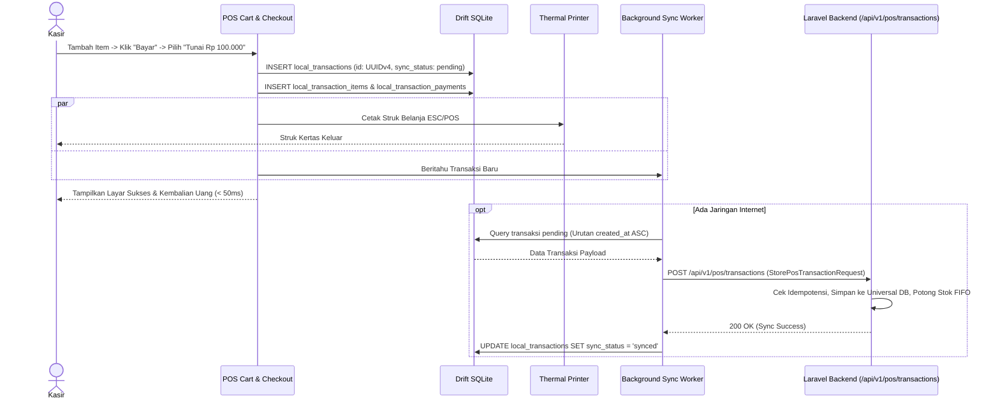
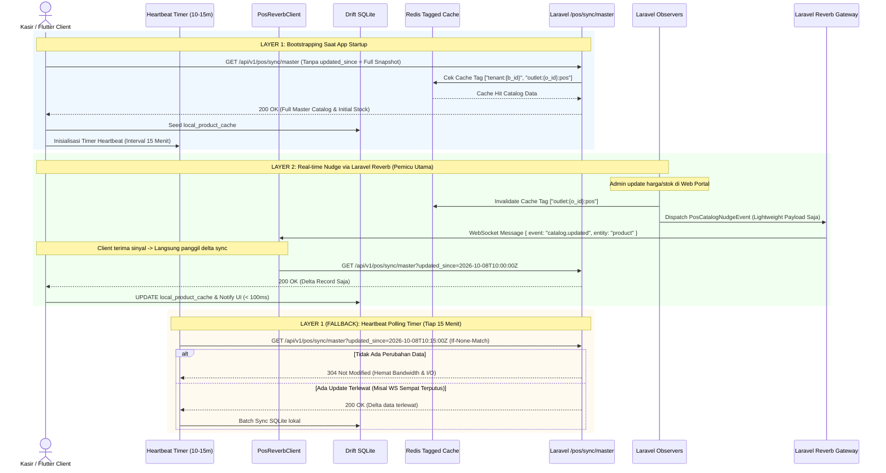
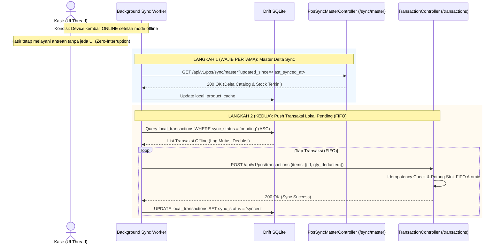
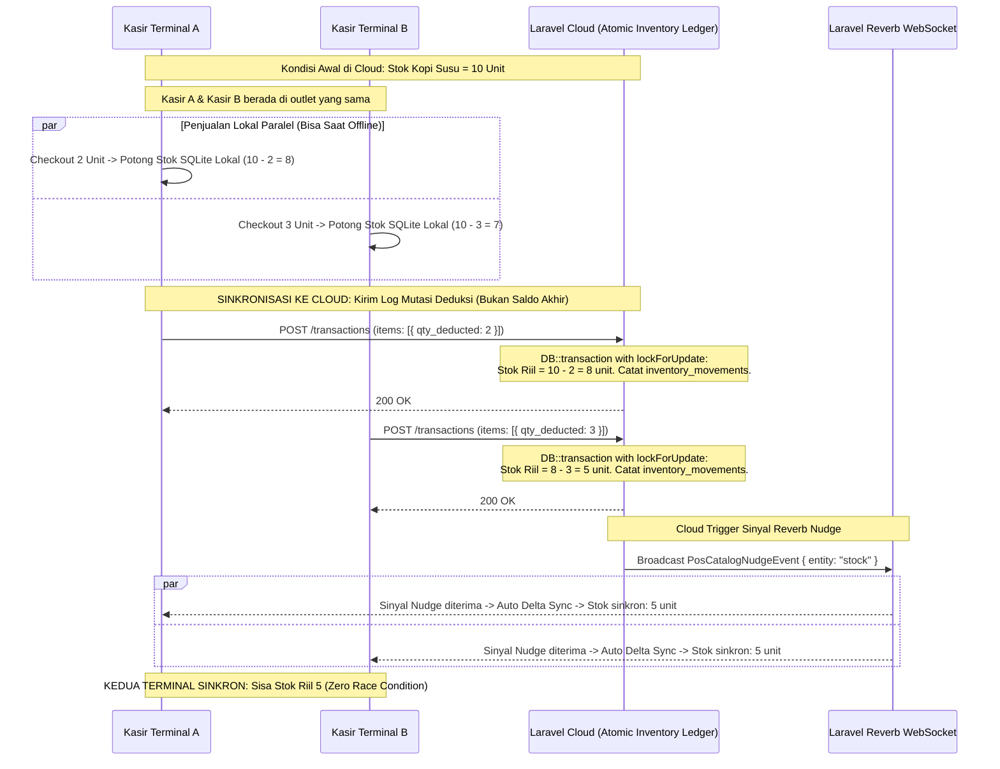

# PRD — Modul Transaksi & Penjualan - Channel POS App V1.3
## Core Fast Checkout, Hold-Resume, Delta Sync & Realtime Stream

## 1. Executive Summary & Bounded Context

Sub-modul **V1.3 Core Fast Checkout, Hold-Resume, Delta Sync & Realtime Stream** adalah mesin inti (*engine*) transaksi penjualan pada aplikasi kasir **Sollu POS Client**. Modul ini bertanggung jawab atas alur checkout ultra-cepat berlatensi rendah (< 50ms), kalkulasi keranjang belanja (diskon baris/dokumen, pajak, kembalian), penundaan tagihan (*Hold Bill*) dan pembukaan kembali (*Resume Bill*), pengiriman transaksi asinkron ke server Laravel (`POST /api/v1/pos/transactions`), serta arsitektur sinkronisasi data master dan stok 3-layer (*Bootstrapping & Heartbeat*, *Real-time Nudge via Laravel Reverb*, dan *Smart Conflict Resolution Stok*) melalui endpoint khusus teroptimasi (`GET /api/v1/pos/sync/master`).

### Kapabilitas Utama V1.3:
1. **Ultra-Fast Local Checkout (< 50ms)**: Transaksi penjualan disimpan seketika ke SQLite lokal (`local_transactions`), memicu pencetakan struk fisik dan membuka laci kas tanpa menunggu respons jaringan internet.
2. **Dedicated Transaction Submission (`POST /api/v1/pos/transactions`)**: Transaksi penjualan lokal dikirimkan secara mandiri melalui *Background Sync Worker* secara FIFO ke server tanpa mencampuradukkan payload master data.
3. **Idempotency & Zero Double-Deduction**: Pencegahan pemotongan stok berulang dan duplikasi transaksi via pemeriksaan `offline_id` UUIDv7 di server backend.
4. **Hold & Resume Transactions (*Held Bills*)**: Kasir dapat memarkir transaksi pelanggan yang menunda pembayaran ke tabel `local_held_transactions` dan melanjutkannya kembali kapan saja.
5. **Optimized Master Delta Sync Endpoint (`GET /api/v1/pos/sync/master`)**: Endpoint khusus berlatensi rendah untuk sinkronisasi delta/inkremental data katalog dan stok. Terminal Flutter hanya mengirimkan timestamp lokal terakhir kali data diperbarui (`updated_since`). Endpoint ini dilengkapi *multi-tenant tagged cache* (Redis) dan invalidasi terstruktur agar data selalu mutakhir.
6. **3-Layer Synchronization Engine**:
   - **Layer 1: Bootstrapping & Heartbeat Polling Fallback**: Full/delta sync saat aplikasi kasir pertama kali dibuka (*startup*), didukung background timer berkala (tiap 10–15 menit) untuk menyerap perubahan delta yang mungkin terlewat bila koneksi WebSocket sempat terputus tanpa disadari.
   - **Layer 2: Real-time Nudge via Laravel Reverb (Pemicu Utama)**: Penyaluran sinyal pembaruan ringan (*lightweight nudge signal*) tanpa membawa seluruh objek data melalui WebSocket `private-outlet.{outlet_id}.pos`. Begitu sinyal diterima, Flutter langsung memicu request delta sync ter-cache ke `/sync/master`.
   - **Layer 3: Smart Conflict Resolution untuk Stok (Mutation-Log Deduction)**: Saat offline, kasir memotong stok lokal secara independen. Saat sinkronisasi ke cloud, transaksi dikirim dalam bentuk **log mutasi pengurangan** (`qty_deducted: X`), bukan saldo stok absolut kasir. Cloud yang mengakumulasi pengurangan stok riil dalam transaksi atomik untuk mencegah *race condition* multi-terminal kasir dalam 1 outlet.
7. **Automated Cache Invalidation via Eloquent Observers**: Setiap mutasi pada model produk, varian, kategori, atau saldo stok di backend secara otomatis meng-invalidate Redis Tagged Cache outlet terkait dan mendispatch event sinyal Reverb Nudge seketika (< 100ms).

---

## 2. Architecture & Domain Flow

### 2.1. Arsitektur 3-Layer Sinkronisasi POS & Cloud

```
Flutter Client (sollu_pos_client)                           Laravel 12 Backend
┌───────────────────────────────────────┐                 ┌───────────────────────────────────────────────┐
│ [LAYER 1: Bootstrapping & Heartbeat]  │                 │ Cache Layer (Redis Tagged Cache)              │
│ - Startup: Delta/Full Sync            │                 │ Tag: ["tenant:{b_id}", "outlet:{o_id}:pos"]   │
│ - Timer: 10-15 Min Fallback Check     │                 └───────────────────────▲───────────────────────┘
│   GET /api/v1/pos/sync/master         │                                         │ (Cache Hit / Miss)
│   ?updated_since=<ISO-Timestamp>      │────────HTTP GET Delta Fetch────────────►│ PosSyncMasterController      │
└───────────────────▲───────────────────┘                                         │ (Optimized Query & 304 ETag)  │
                    │                                                             └───────────────────────────────┘
                    │                                                                             ▲
┌───────────────────┴───────────────────┐                                                         │ (Flushes Tagged Cache)
│ [LAYER 2: Real-time Reverb Nudge]     │                                         ┌───────────────┴───────────────┐
│ - PosReverbClient (WebSocket)         │◄──Lightweight Nudge (Type Sinyal Saja)──│ PosCatalogNudgeEvent          │
│   Channel: private-outlet.{o_id}.pos  │   (Tanpa kirim seluruh data objek)      │ (Laravel Reverb Gateway)      │
│ - Sinyal Diterima -> Auto-trigger:    │                                         └───────────────▲───────────────┘
│   GET /api/v1/pos/sync/master         │                                                         │ (Model Mutated)
└───────────────────────────────────────┘                                         ┌───────────────┴───────────────┐
                                                                                  │ Eloquent Observers:           │
┌───────────────────────────────────────┐                                         │ - ProductObserver             │
│ [LAYER 3: Smart Stock Conflict Res.]  │                                         │ - InventoryBalanceObserver    │
│ - Offline Checkout: Potong SQLite     │                                         └───────────────────────────────┘
│ - Push Sync Transaksi:                │                                                         ▲
│   Kirim Mutation Log:                 │────────HTTP POST FIFO Mutation─────────►│ TransactionController         │
│   items: [{ id, qty_deducted: 2 }]    │   (BUKAN current total stock)           │ (Atomic Row Lock & FIFO)      │
│   (Mencegah Race Condition Kasir)     │                                         │ DB::transaction Inventory     │
└───────────────────────────────────────┘                                         └───────────────────────────────┘
```

### 2.2. Prinsip Non-Blocking, Caching Terstruktur & Urutan Eksekusi

1. **Optimasi Endpoint `GET /api/v1/pos/sync/master` & Cache Invalidation**:
   - **Parameter Ringkas**: Flutter hanya mengirim `updated_since` (ISO 8601 timestamp lokal data terakhir diperbarui).
   - **Multi-Tenant Redis Tagged Cache**: Hasil query katalog disimpan dengan key `pos_catalog:{outlet_id}:{updated_since}` di bawah tags `["tenant:{$businessId}", "outlet:{$outletId}:pos"]`.
   - **Structured Invalidation**: Setiap kali admin/sistem mengubah data harga, produk, atau mutasi stok, `ProductObserver` dan `InventoryBalanceObserver` secara otomatis mengeksekusi `Cache::tags(["outlet:{$outletId}:pos"])->flush()` sehingga query sinkronisasi berikutnya selalu mengembalikan data termutakhir.
   - **HTTP Conditional ETag / 304**: Jika tidak ada mutasi data sejak `updated_since`, backend merespons cepat dengan status `304 Not Modified` atau JSON payload kosong (`updated_products: []`), meminimalkan beban bandwidth dan I/O database.

2. **3-Layer Synchronization Workflow**:
   - **Layer 1 (Bootstrapping & Heartbeat)**: Saat aplikasi dibuka pertama kali, kasir melakukan sinkronisasi awal. Background timer berkala (tiap 10–15 menit) mengecek pembaruan ke `/sync/master` sebagai jaring pengaman (*heartbeat fallback*) bila WebSocket Reverb terputus tanpa memicu reconnect event.
   - **Layer 2 (Lightweight Reverb Nudge)**: Payload Reverb tidak menguras bandwidth dengan mengirim seluruh entitas produk. Reverb hanya mengirim sinyal ringan (*nudge*) seperti `{ "event": "catalog.updated", "entity_type": "product", "timestamp": "..." }`. Begitu sinyal ini diterima di klien Flutter, klien secara reaktif meminta delta perubahan ke endpoint `/sync/master`.
   - **Layer 3 (Smart Conflict Resolution untuk Stok)**: Saat offline, kasir memotong stok lokal secara mandiri untuk proteksi penjualan lokal. Saat tersambung kembali, payload transaksi **hanya mengirim kuantitas deduksi (`qty_deducted: X`)**, bukan total stok absolut kasir. Cloud mengeksekusi mutasi stok secara atomik dalam `DB::transaction` dengan *pessimistic locking* (`lockForUpdate`), mengeliminasi risiko *race condition* jika ada terminal kasir lain (Kasir B, C) yang menjual produk yang sama secara paralel.

3. **Urutan Eksekusi Pasca Offline (Strict Pipeline)**:
   - **Langkah 1 (Master Sync Wajib Pertama)**: Eksekusi `GET /api/v1/pos/sync/master?updated_since=...` untuk memastikan katalog master & stok termutakhir telah terserap ke Drift SQLite lokal.
   - **Langkah 2 (Push Antrean Transaksi)**: Dilanjutkan pengiriman antrean transaksi lokal pending (`POST /api/v1/pos/transactions`) secara FIFO.
   - **Zero UI Interruption**: Seluruh pipeline berjalan di background worker non-blocking, menjamin aktivitas kasir melayani pembeli tetap mulus tanpa jeda frame.

---

## 3. Core Features & User Activity Use Cases

### 3.1. Fitur Utama

| Fitur | Deskripsi |
| :--- | :--- |
| **Keranjang Belanja Reaktif (*Cart Engine*)** | Kalkulasi subtotal, diskon per item, diskon global keranjang, pajak PPN 11%, dan biaya layanan (*service charge*). |
| **Modal Pembayaran Kilat (*Quick Pay*)** | Tombol pecahan uang pas (*Exact Cash*, 50rb, 100rb), kalkulator kembalian otomatis, dan metode multi-bayar. |
| **Simpan Tagihan (*Hold Bill*)** | Menyimpan isi keranjang aktif ke antrean pending tanpa memotong stok, memberi nama catatan (contoh: "Meja 5"). |
| **Buka Tagihan (*Resume Bill*)** | Drawer daftar held bills dengan jam simpan, tombol muat ulang ke keranjang (*resume*), dan tombol hapus. |
| **Optimized Master Delta Sync (`GET /api/v1/pos/sync/master`)** | Endpoint khusus delta/inkremental data. Flutter hanya mengirimkan `updated_since`. Terlindungi Redis Tagged Cache multi-tenant dengan invalidasi terstruktur dan ETag 304. |
| **3-Layer Sync Architecture** | Sinergi Layer 1 (Bootstrapping & Heartbeat Polling 10-15m), Layer 2 (Lightweight Reverb Nudge $\rightarrow$ Auto Delta Fetch), dan Layer 3 (Smart Conflict Resolution). |
| **Smart Conflict Resolution Stok** | Pengiriman transaksi lokal ke cloud menggunakan format **log mutasi pengurangan** (`qty_deducted: X`), bukan saldo akhir, mencegah race condition multi-terminal kasir. |
| **Strict Background Reconnection Pipeline** | Saat kembali online: (1) Endpoint master sync dieksekusi pertama kali, (2) dilanjutkan push transaksi pending FIFO di latar belakang tanpa freeze UI. |
| **Realtime Nudge via Eloquent Observers** | `ProductObserver` & `InventoryBalanceObserver` di backend memantau mutasi data, mem-flush tagged cache, dan mengirimkan lightweight nudge signal via Reverb WebSocket. |

### 3.2. Skenario Aktivitas Pengguna (Use Cases)

```
┌────────────────────────────────────────────────────────────────────────────────────────────────────────┐
│ Skenario Pengguna POS V1.3 (3-Layer Sync & Transaksi)                                                  │
├──────────────────────────────┬──────────────────────────────┬──────────────────────────────────────────┤
│ Use Case                     │ Kondisi & Perangkat          │ Respon & Output Sistem                   │
├──────────────────────────────┼──────────────────────────────┼──────────────────────────────────────────┤
│ 1. Checkout Cepat Kasir      │ Internet: Terputus (Offline) │ Transaksi tersimpan lokal < 50ms, struk  │
│    (Offline Sale Checkout)   │ Pembayaran: Tunai            │ keluar, stok lokal berkurang, status     │
│                              │                              │ transaksi: `pending_sync`.               │
├──────────────────────────────┼──────────────────────────────┼──────────────────────────────────────────┤
│ 2. Tahan Tagihan (Hold Bill) │ Pelanggan lupa bawa dompet   │ Kasir klik "Hold", input "Meja 12".      │
│                              │ Kasir harus layani antrean   │ Keranjang bersih, siap melayani antrean. │
├──────────────────────────────┼──────────────────────────────┼──────────────────────────────────────────┤
│ 3. Buka Tagihan (Resume Bill)│ Pelanggan Meja 12 siap bayar │ Kasir buka drawer Held Bills, klik       │
│                              │ Antrean sebelumnya selesai   │ Resume. Item kembali ke keranjang kasir. │
├──────────────────────────────┼──────────────────────────────┼──────────────────────────────────────────┤
│ 4. Bootstrapping Kasir Pagi  │ Kasir baru buka app (Pagi)   │ Flutter panggil /sync/master             │
│    (Layer 1 Startup Sync)    │ Status: Online               │ Mengunduh katalog awal, inisialisasi     │
│                              │                              │ heartbeat timer 15 menit & Reverb WS.    │
├──────────────────────────────┼──────────────────────────────┼──────────────────────────────────────────┤
│ 5. Heartbeat Polling Fallback│ Koneksi WS sempat drop diam- │ Tiap 15 menit, background timer panggil  │
│    (Layer 1 Timer 15 Menit)  │ diam tanpa reconnect event   │ /sync/master?updated_since=...           │
│                              │                              │ Jika ada delta, SQLite lokal terupdate.  │
├──────────────────────────────┼──────────────────────────────┼──────────────────────────────────────────┤
│ 6. Realtime Reverb Nudge     │ Admin ubah harga di Web      │ 1. Observer flush tagged cache outlet.   │
│    (Layer 2 Signal Stream)   │ Kasir sedang standby         │ 2. Reverb kirim nudge {type: "product"}. │
│                              │                              │ 3. Flutter panggil /sync/master seketika │
│                              │                              │    dan perbarui harga di UI (< 100ms).   │
├──────────────────────────────┼──────────────────────────────┼──────────────────────────────────────────┤
│ 7. Penjualan Multi-Terminal  │ Kasir A & Kasir B jual kopi  │ Keduanya kirim log mutasi qty_deducted:  │
│    (Layer 3 Smart Conflict)  │ stok awal 10 di outlet sama  │ Kasir A deduksi 2, Kasir B deduksi 3.    │
│                              │                              │ Cloud potong atomik: 10 - 2 - 3 = sisa 5 │
│                              │                              │ Bebas race condition / double deduction. │
├──────────────────────────────┼──────────────────────────────┼──────────────────────────────────────────┤
│ 8. Pemulihan Pasca Offline   │ Internet kembali terhubung   │ Background Worker berjalan senyap:       │
│    (Master Sync -> Push)     │ Ada 20 transaksi pending     │ 1. Urutan 1: Hit GET /sync/master        │
│                              │ Kasir sedang sibuk checkout  │ 2. Urutan 2: Push 20 transaksi FIFO.     │
│                              │                              │ 3. UI Kasir 100% responsif tanpa jeda.   │
└──────────────────────────────┴──────────────────────────────┴──────────────────────────────────────────┘
```

---

## 4. User Flow & Sequence Diagrams

### 4.1. Alur Transaksi Kasir Offline & Background Push



### 4.2. Alur 3-Layer Sinkronisasi: Bootstrapping, Real-time Nudge & Polling Fallback



### 4.3. Alur Reconnection Sequence (Urutan Eksekusi Pasca Offline)



### 4.4. Alur Smart Conflict Resolution Stok Multi-Terminal



---

## 5. Technical Architecture & File Structure

### 5.1. File Structure Klien Flutter (`sollu_pos_client`)

```
lib/features/pos/
├── presentation/
│   ├── controllers/
│   │   ├── cart_controller.dart                 # Riverpod Notifier kalkulasi keranjang
│   │   ├── checkout_controller.dart             # Penanganan proses pembayaran
│   │   └── held_bills_controller.dart           # Manajemen Hold & Resume bill
│   ├── screens/
│   │   ├── quick_pay_modal.dart                 # Pop-up pembayaran cepat & kembalian
│   │   └── held_bills_drawer.dart               # Drawer daftar tagihan yang ditahan
│   └── widgets/
│       ├── cart_item_tile.dart                  # Baris item keranjang (qty, diskon, catatan)
│       └── cart_summary_bar.dart                # Subtotal, diskon, pajak, grand total
├── domain/
│   ├── entities/
│   │   ├── cart_item.dart
│   │   └── pos_sale_transaction.dart
│   └── usecases/
│       ├── process_sale_usecase.dart
│       ├── hold_bill_usecase.dart
│       └── resume_bill_usecase.dart
└── data/
    ├── database/
    │   ├── tables/
    │   │   ├── local_transactions.dart
    │   │   ├── local_transaction_items.dart
    │   │   ├── local_transaction_payments.dart
    │   │   └── local_held_transactions.dart
    │   └── daos/
    │       ├── transaction_dao.dart
    │       └── held_bills_dao.dart
    ├── sync/
    │   ├── background_sync_worker.dart          # Orchestrator non-blocking: Master Sync Step 1 -> Transaction FIFO Push Step 2
    │   ├── sync_master_service.dart             # Client API pemanggil GET /api/v1/pos/sync/master dengan query updated_since
    │   └── heartbeat_polling_service.dart       # Layer 1 Fallback: Background timer berkala (10-15 menit) untuk delta check
    └── realtime/
        └── pos_reverb_client.dart               # Layer 2: Listener WebSocket Reverb pemantau sinyal PosCatalogNudgeEvent
```

### 5.2. File Structure Backend Laravel 12 (`sollu-app`)

```
app/
├── Http/
│   ├── Controllers/API/POS/
│   │   ├── TransactionController.php            # POST /api/v1/pos/transactions (Log mutasi stok & FIFO deduction)
│   │   └── PosSyncMasterController.php          # GET /api/v1/pos/sync/master (Optimized incremental fetch, Redis Cache & ETag)
│   └── Requests/API/POS/
│       ├── StorePosTransactionRequest.php       # Validasi lengkap payload transaksi (memuat qty_deducted)
│       └── PosSyncMasterRequest.php             # Validasi parameter updated_since & outlet_id
├── Observers/POS/
│   ├── ProductObserver.php                      # Flush Tagged Cache & dispatch PosCatalogNudgeEvent saat produk berubah
│   └── InventoryBalanceObserver.php             # Flush Tagged Cache & dispatch PosCatalogNudgeEvent saat stok berubah
├── Events/POS/
│   └── PosCatalogNudgeEvent.php                 # ShouldBroadcastNow (Lightweight signal tanpa memuat objek data besar)
└── Services/App/
    ├── POS/
    │   └── PosCatalogCacheService.php           # Pengelola Redis Tagged Cache & structured invalidation
    └── Transaction/
        └── TransactionService.php               # Pemotongan stok FIFO atomik (lockForUpdate) & idempotensi
```

### 5.3. Public API Contracts

#### 5.3.1. Submit Transaksi POS (`POST /api/v1/pos/transactions`)
- *Tujuan*: Mengirim transaksi lokal ke server dengan format **log mutasi deduksi** guna mencegah *race condition* multi-terminal.
- *Endpoint*: `POST /api/v1/pos/transactions`
- *Request Body*:
  ```json
  {
    "offline_id": "9b1deb4d-3b7d-4bad-9bdd-2b0d7b3dcb6d",
    "transaction_number": "POS/20261001/0001",
    "shift_id": null,
    "transaction_date": "2026-10-01T12:00:00+07:00",
    "subtotal": 50000.0,
    "discount_amount": 5000.0,
    "tax_amount": 4950.0,
    "total": 49950.0,
    "payment_status": "paid",
    "status": "completed",
    "items": [
      {
        "product_id": "7b0deb4c-1b7d-4aad-9bee-1b0d7b3dcb2b",
        "qty_deducted": 2.0,
        "price": 25000.0,
        "subtotal": 50000.0
      }
    ],
    "payments": [
      {
        "payment_method": "cash",
        "amount": 50000.0,
        "change_amount": 50.0
      }
    ]
  }
  ```
  > *Catatan Integritas Stok*: Field `qty_deducted` merepresentasikan kuantitas yang dipotong oleh transaksi ini (log mutasi). Backend akan mengeksekusi `stock = stock - qty_deducted` secara atomik di database PostgreSQL (`lockForUpdate`), BUKAN menimpa total saldo stok kasir.

#### 5.3.2. Optimized Master Delta Sync (`GET /api/v1/pos/sync/master`)
- *Tujuan*: Sinkronisasi data master katalog dan stok secara inkremental (*Delta Fetch*). Digunakan pada Bootstrapping, Heartbeat Timer, dan Reaksi Sinyal Nudge.
- *Optimasi*: Terlindungi Redis Tagged Cache `["tenant:{$businessId}", "outlet:{$outletId}:pos"]` dan HTTP Conditional ETag.
- *Endpoint*: `GET /api/v1/pos/sync/master?updated_since=2026-10-08T10:00:00Z&outlet_id=9b1deb4c-2b7d-4aad-9bee-1b0d7b3dcb1a`
- *Query Parameters*:
  - `updated_since` (string ISO 8601, optional): Timestamp lokal terakhir data diperbarui. Jika tidak disertakan, server mengirimkan *full catalog snapshot* (Bootstrapping). Jika disertakan, hanya record yang berubah sejak waktu tersebut yang dikembalikan.
  - `outlet_id` (UUIDv4, required): ID outlet terminal kasir.
- *Headers*:
  - Request: `If-None-Match: "<ETag-Hash>"` (Opsional)
  - Response: `ETag: "<ETag-Hash>"`, `Cache-Control: private, no-cache`
- *HTTP 304 Not Modified*: Jika tidak ada perubahan data sejak timestamp yang diminta dan ETag cocok, server merespons header 304 tanpa body untuk menghemat bandwidth.
- *Response (200 OK)*:
  ```json
  {
    "success": true,
    "message": "Delta master catalog synchronized successfully",
    "data": {
      "synced_at": "2026-10-08T10:05:00+07:00",
      "updated_products": [
        {
          "id": "7b0deb4c-1b7d-4aad-9bee-1b0d7b3dcb2b",
          "name": "Kopi Susu Gula Aren",
          "price": 28000.0,
          "stock": 38.0,
          "is_active": true
        }
      ],
      "deleted_product_ids": []
    }
  }
  ```

#### 5.3.3. Lightweight Real-time Nudge WebSocket Contract (Laravel Reverb)
- *Channel*: `private-outlet.{outlet_id}.pos`
- *Event Class*: `App\Events\POS\PosCatalogNudgeEvent` (implements `ShouldBroadcastNow`)
- *Karakteristik Payload*: Tidak membawa objek data besar/seluruh entitas, melainkan hanya sinyal notifikasi ringan (< 1KB).
- *Payload*:
  ```json
  {
    "event": "pos.catalog.nudge",
    "outlet_id": "9b1deb4c-2b7d-4aad-9bee-1b0d7b3dcb1a",
    "entity_type": "product",
    "timestamp": "2026-10-08T10:05:01+07:00"
  }
  ```
- *Client Behavior*: Begitu `PosCatalogNudgeEvent` diterima oleh klien Flutter, klien segera memicu eksekusi `sync_master_service.fetchDelta(updatedSince: lastLocalTimestamp)`.

---

### 6.1. Schema PostgreSQL (Server) & Atomic Stock Deduction
Data bermuara ke tabel universal `transactions`, `transaction_items`, `transaction_payments`, `inventory_balances`, dan `inventory_movements`.

```php
// Proteksi Race Condition Multi-Terminal pada TransactionService.php:
DB::transaction(function () use ($validatedPayload) {
    // 1. Simpan header transaksi (Idempotent via offline_id)
    $transaction = Transaction::create([...]);

    // 2. Loop tiap item dengan kuantitas mutasi (qty_deducted)
    foreach ($validatedPayload['items'] as $item) {
        // Pessimistic Locking untuk mencegah race condition antar-kasir
        $balance = InventoryBalance::where('outlet_id', $validatedPayload['outlet_id'])
            ->where('product_id', $item['product_id'])
            ->lockForUpdate()
            ->firstOrFail();

        // Deduksi stok secara akumulatif (Atomic Mutation)
        $balance->stock -= $item['qty_deducted'];
        $balance->save();

        // Catat mutasi ledger
        InventoryMovement::create([
            'outlet_id' => $validatedPayload['outlet_id'],
            'product_id' => $item['product_id'],
            'type' => 'pos_sale',
            'quantity' => -$item['qty_deducted'],
            'reference_id' => $transaction->id,
        ]);
    }
});
```

### 6.2. Schema Drift SQLite (Client)

```dart
class LocalTransactions extends Table {
  TextColumn get id => text()(); // UUIDv4
  TextColumn get transactionNumber => text()();
  TextColumn get shiftId => text().nullable()();
  RealColumn get subtotal => real()();
  RealColumn get discountAmount => real().withDefault(const Constant(0.0))();
  RealColumn get taxAmount => real().withDefault(const Constant(0.0))();
  RealColumn get total => real()();
  TextColumn get syncStatus => text()(); // pending, syncing, synced, failed
  DateTimeColumn get createdAt => dateTime()();

  @override
  Set<Column> get primaryKey => {id};
}

class LocalHeldTransactions extends Table {
  TextColumn get id => text()();
  TextColumn get customerNote => text().nullable()();
  TextColumn get cartPayloadJson => text()(); // Serialized items
  DateTimeColumn get heldAt => dateTime()();

  @override
  Set<Column> get primaryKey => {id};
}
```

---

## 7. Single Source of Truth: Enums

```php
namespace App\Enums;

enum TransactionStatus: string {
    case DRAFT = 'draft';
    case COMPLETED = 'completed';
    case CANCELLED = 'cancelled';
}

enum SyncStatusEnum: string {
    case PENDING = 'pending';
    case SYNCING = 'syncing';
    case SYNCED = 'synced';
    case FAILED = 'failed';
}
```

---

## 8. Testing & Quality Assurance

- `test_offline_checkout_persists_instantly_in_drift()`
- `test_bootstrapping_sync_master_fetches_full_snapshot_on_null_updated_since()`: Memastikan app startup mengunduh katalog penuh.
- `test_heartbeat_polling_timer_triggers_periodic_delta_sync()`: Memastikan timer 10-15 menit berjalan di background.
- `test_heartbeat_polling_returns_304_not_modified_when_no_changes()`: Memastikan ETag conditional request hemat bandwidth.
- `test_pos_catalog_nudge_event_broadcasts_lightweight_payload_only()`: Memastikan payload Reverb tidak memuat objek data besar (< 1KB).
- `test_flutter_client_triggers_delta_fetch_upon_receiving_nudge()`: Memastikan penerimaan sinyal nudge langsung memicu fetch `/sync/master`.
- `test_multi_terminal_concurrent_sales_deducts_stock_atomically_without_race_condition()`: Simulasi Kasir A & B mengirim mutasi bersamaan; stok terpotong presisi via `lockForUpdate`.
- `test_pos_catalog_redis_cache_is_invalidated_when_product_observer_fires()`: Memastikan Tagged Cache ter-flush saat produk diupdate.
- `test_pos_catalog_redis_cache_is_invalidated_when_inventory_observer_fires()`: Memastikan Tagged Cache ter-flush saat stok bermutasi.
- `test_reconnection_pipeline_executes_sync_master_before_transaction_push()`: Memastikan urutan rekoneksi mendahulukan endpoint sync sebelum push transaksi.
- `test_background_sync_is_non_blocking_to_cashier_cart_flow()`: Memastikan proses sinkronisasi background tidak memblokir frame render/interaksi kasir.
- `test_idempotency_prevents_duplicate_transactions_with_same_offline_id()`

---

## 9. Implementation Plan & Definition of Done

### Deliverables:
1. **Backend**:
   - Controller `PosSyncMasterController` (`GET /api/v1/pos/sync/master`) dengan Redis Tagged Cache, invalidasi terstruktur, dan conditional ETag 304.
   - Controller `TransactionController` (`POST /api/v1/pos/transactions`) dengan processor log mutasi deduksi stok atomik (`lockForUpdate`) dan idempotency check.
   - Eloquent Observers (`ProductObserver`, `InventoryBalanceObserver`) yang mem-flush Tagged Cache dan mentrigger `PosCatalogNudgeEvent`.
   - Event `PosCatalogNudgeEvent` (ShouldBroadcastNow) ke channel WebSocket Reverb outlet.
   - Service `PosCatalogCacheService` dan `TransactionService`.
2. **Client**:
   - Service `sync_master_service.dart` (pengirim parameter `updated_since` dan penerima respons delta/304).
   - Service `heartbeat_polling_service.dart` (background timer berkala 10–15 menit).
   - Listener `pos_reverb_client.dart` (reaktif terhadap sinyal nudge Reverb untuk langsung memicu delta fetch).
   - Background Sync Worker dengan 2-phase reconnection pipeline (Urutan 1: Master Delta Sync -> Urutan 2: Transaction Queue Push FIFO) berjalan senyap di background.
   - Cart state & checkout calculation, Quick Pay Modal, Hold & Resume drawer.

### Definition of Done (DoD):
- Endpoint `GET /api/v1/pos/sync/master` terbukti berlatensi rendah (< 50ms pada cache hit), mengembalikan 304 Not Modified saat data tidak berubah, dan hanya mengirim delta record saat `updated_since` disertakan.
- Tagged Cache Redis terinvalidasi secara otomatis saat admin memodifikasi harga produk atau saat ada mutasi saldo stok di backend.
- Sinyal WebSocket Reverb berukuran ultra-ringan (< 1KB) dan berhasil memicu client Flutter untuk melakukan delta sync reaktif (< 100ms).
- Penjualan simultan oleh 2 atau lebih terminal kasir (Kasir A & B) pada produk yang sama berhasil diakumulasikan secara atomik di cloud tanpa selisih atau race condition.
- Saat perangkat kembali online pasca offline, sistem secara disiplin mengeksekusi `/sync/master` terlebih dahulu sebelum mengosongkan antrean transaksi pending FIFO.
- Seluruh sinkronisasi berjalan secara non-blocking di latar belakang, tanpa jeda/hang pada form kasir.
