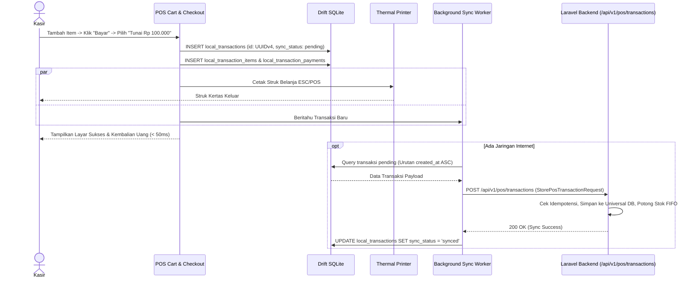
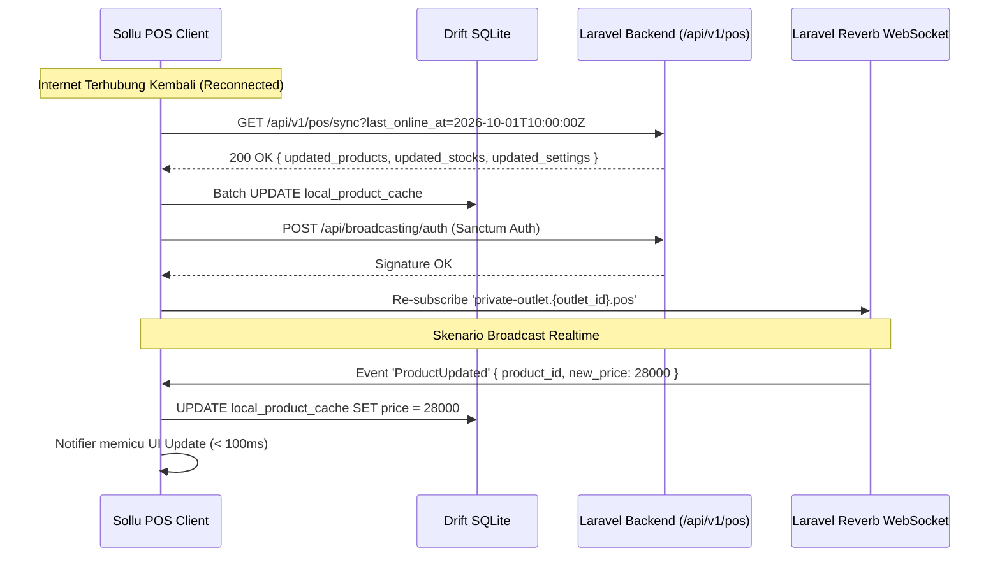

# PRD — Modul Transaksi & Penjualan - Channel POS App V1.3
## Core Fast Checkout, Hold-Resume, Delta Sync & Realtime Stream

## 1. Executive Summary & Bounded Context

Sub-modul **V1.3 Core Fast Checkout, Hold-Resume, Delta Sync & Realtime Stream** adalah mesin inti (*engine*) transaksi penjualan pada aplikasi kasir **Sollu POS Client**. Modul ini bertanggung jawab atas alur checkout ultra-cepat berlatensi rendah (< 50ms), kalkulasi keranjang belanja (diskon baris/dokumen, pajak, kembalian), penundaan tagihan (*Hold Bill*) dan pembukaan kembali (*Resume Bill*), pengiriman transaksi asinkron ke server Laravel (`POST /api/v1/pos/transactions`), pemulihan rekoneksi delta sync (`GET /api/v1/pos/sync?last_online_at=...`), serta penyaluran perubahan master produk & saldo stok inventori secara seketika (*realtime*) menggunakan **Laravel Reverb WebSocket** yang diamankan oleh **Laravel Sanctum**.

### Kapabilitas Utama V1.3:
1. **Ultra-Fast Local Checkout (< 50ms)**: Transaksi penjualan disimpan seketika ke SQLite lokal (`local_transactions`), memicu pencetakan struk fisik dan membuka laci kas tanpa menunggu respons jaringan internet.
2. **Dedicated Transaction Submission (`POST /api/v1/pos/transactions`)**: Transaksi penjualan lokal dikirimkan secara mandiri melalui *Background Sync Worker* secara FIFO ke server tanpa mencampuradukkan payload master data.
3. **Idempotency & Zero Double-Deduction**: Pencegahan pemotongan stok berulang dan duplikasi transaksi via pemeriksaan `offline_id` UUIDv4 di server backend.
4. **Hold & Resume Transactions (*Held Bills*)**: Kasir dapat memarkir transaksi pelanggan yang menunda pembayaran ke tabel `local_held_transactions` dan melanjutkannya kembali kapan saja.
5. **Reconnection Delta Sync Engine (`GET /api/v1/pos/sync`)**: Saat internet kembali online, sistem hanya mengunduh data yang mengalami pembaruan sejak `last_online_at` tanpa mengunduh ulang snapshot penuh.
6. **Realtime Broadcast via Laravel Reverb (Sanctum Auth)**: Sinkronisasi instan pembaruan harga, penonaktifan produk, dan mutasi saldo stok ke seluruh terminal kasir aktif di outlet via WebSocket `private-outlet.{outlet_id}.pos`.

---

## 2. Architecture & Domain Flow

```
Flutter Client (sollu_pos_client)                     Laravel 12 Backend
┌─────────────────────────────────┐                   ┌───────────────────────────────────┐
│ CartNotifier & Checkout Flow    │                   │ TransactionController             │
│ (Instant Save to Drift SQLite)  │                   │ POST /api/v1/pos/transactions     │
└────────────────┬────────────────┘                   └─────────────────▲─────────────────┘
                 │ (UUIDv4 Generated)                                   │
                 ▼                                                      │ (FIFO Queue)
┌─────────────────────────────────┐                   ┌─────────────────┴─────────────────┐
│ Drift DB: local_transactions    │───Background Worker──│ SyncQueueManager                  │
│ Status: pending -> synced       │                   │ (Retry on Network Error)          │
└─────────────────────────────────┘                   └───────────────────────────────────┘

┌─────────────────────────────────┐                   ┌───────────────────────────────────┐
│ PosReverbClient (WebSocket WS)  │<──Realtime Events─│ Laravel Reverb Gateway            │
│ private-outlet.{outletId}.pos   │                   │ (Sanctum Authenticated Channel)   │
└────────────────┬────────────────┘                   └───────────────────────────────────┘
                 │
                 ▼
┌─────────────────────────────────┐                   ┌───────────────────────────────────┐
│ PosSyncController (Delta)       │<──Delta Request───│ GET /api/v1/pos/sync              │
│ Catch-up after Reconnect        │                   │ ?last_online_at=<ISO-Timestamp>   │
└─────────────────────────────────┘                   └───────────────────────────────────┘
```

---

## 3. Core Features & User Activity Use Cases

### 3.1. Fitur Utama

| Fitur | Deskripsi |
| :--- | :--- |
| **Keranjang Belanja Reaktif (*Cart Engine*)** | Kalkulasi subtotal, diskon per item, diskon global keranjang, pajak PPN 11%, dan biaya layanan (*service charge*). |
| **Modal Pembayaran Kilat (*Quick Pay*)** | Tombol pecahan uang pas (*Exact Cash*, 50rb, 100rb), kalkulator kembalian otomatis, dan metode multi-bayar. |
| **Simpan Tagihan (*Hold Bill*)** | Menyimpan isi keranjang aktif ke antrean pending tanpa memotong stok, memberi nama catatan (contoh: "Meja 5"). |
| **Buka Tagihan (*Resume Bill*)** | Drawer daftar held bills dengan jam simpan, tombol muat ulang ke keranjang (*resume*), dan tombol hapus. |
| **Dedicated Transaction Push** | Pengiriman transaksi lokal ke endpoint `POST /api/v1/pos/transactions` berstatus FIFO. |
| **Reconnection Delta Sync** | Pengambilan delta perubahan master data & stok saat internet kembali tersambung via `GET /api/v1/pos/sync`. |
| **Live Reverb Event Stream** | Pembaruan stok dan harga secara seketika (< 100ms) saat admin mengubah data di Web Portal. |

### 3.2. Skenario Aktivitas Pengguna (Use Cases)

```
┌────────────────────────────────────────────────────────────────────────────────────────────────────────┐
│ Skenario Pengguna POS V1.3                                                                             │
├──────────────────────────────┬──────────────────────────────┬──────────────────────────────────────────┤
│ Use Case                     │ Kondisi & Perangkat          │ Respon & Output Sistem                   │
├──────────────────────────────┼──────────────────────────────┼──────────────────────────────────────────┤
│ 1. Checkout Cepat Kasir      │ Internet: Terputus (Offline) │ Transaksi tersimpan lokal < 50ms, struk  │
│    (Offline Sale Checkout)   │ Pembayaran: Tunai            │ tercetak, status lokal: `pending_sync`.  │
├──────────────────────────────┼──────────────────────────────┼──────────────────────────────────────────┤
│ 2. Tahan Tagihan (Hold Bill) │ Pelanggan lupa bawa dompet   │ Kasir klik "Hold", input "Meja 12".      │
│                              │ Kasir harus layani antrean   │ Keranjang bersih, siap melayani antrean. │
├──────────────────────────────┼──────────────────────────────┼──────────────────────────────────────────┤
│ 3. Buka Tagihan (Resume Bill)│ Pelanggan Meja 12 siap bayar │ Kasir buka drawer Held Bills, klik       │
│                              │ Antrean sebelumnya selesai   │ Resume. Item kembali ke keranjang kasir. │
├──────────────────────────────┼──────────────────────────────┼──────────────────────────────────────────┤
│ 4. Pemulihan Pasca Offline   │ Internet kembali terhubung   │ 1. Worker kirim 20 transaksi pending.    │
│    (Auto Sync & Delta Fetch) │ Ada 20 transaksi pending     │ 2. Client panggil /pos/sync?last_online. │
│                              │                              │ 3. Status transaksi menjadi `synced`.    │
├──────────────────────────────┼──────────────────────────────┼──────────────────────────────────────────┤
│ 5. Update Harga & Stok Live  │ Internet: Online             │ Admin ubah harga kopi di Web Portal.     │
│    (Reverb Event Stream)     │ Aplikasi Kasir Standby       │ Reverb menyiarkan event, harga di layar  │
│                              │                              │ kasir berubah seketika tanpa refresh.    │
└──────────────────────────────┴──────────────────────────────┴──────────────────────────────────────────┘
```

---

## 4. User Flow & Sequence Diagrams

### 4.1. Alur Transaksi Kasir Offline & Background Push



### 4.2. Alur Reconnection Delta & Realtime Reverb Stream



---

## 5. Technical Architecture & File Structure

### 5.1. File Structure Klien Flutter (`sollu_pos_client`)

```
lib/features/pos/
├── presentation/
│   ├── controllers/
│   │   ├── cart_controller.dart                 # Riverpod Notifier kalkulasi keranjang
│   │   ├── checkout_controller.dart             # Penanganan proses pembayaran
│   │   └── held_bills_controller.dart           # Manajemen Hold & Resume bill
│   ├── screens/
│   │   ├── quick_pay_modal.dart                 # Pop-up pembayaran cepat & kembalian
│   │   └── held_bills_drawer.dart               # Drawer daftar tagihan yang ditahan
│   └── widgets/
│       ├── cart_item_tile.dart                  # Baris item keranjang (qty, diskon, catatan)
│       └── cart_summary_bar.dart                # Subtotal, diskon, pajak, grand total
├── domain/
│   ├── entities/
│   │   ├── cart_item.dart
│   │   └── pos_sale_transaction.dart
│   └── usecases/
│       ├── process_sale_usecase.dart
│       ├── hold_bill_usecase.dart
│       └── resume_bill_usecase.dart
└── data/
    ├── database/
    │   ├── tables/
    │   │   ├── local_transactions.dart
    │   │   ├── local_transaction_items.dart
    │   │   ├── local_transaction_payments.dart
    │   │   └── local_held_transactions.dart
    │   └── daos/
    │       ├── transaction_dao.dart
    │       └── held_bills_dao.dart
    ├── sync/
    │   ├── background_sync_worker.dart          # Antrean FIFO pengiriman transaksi
    │   └── sync_delta_service.dart              # Pemanggil /pos/sync
    └── realtime/
        └── pos_reverb_client.dart               # Listener WebSocket Reverb
```

### 5.2. File Structure Backend Laravel 12 (`sollu-app`)

```
app/
├── Http/
│   ├── Controllers/API/POS/
│   │   ├── TransactionController.php            # POST /api/v1/pos/transactions
│   │   └── PosSyncController.php                # GET /api/v1/pos/sync
│   └── Requests/API/POS/
│       └── StorePosTransactionRequest.php       # Validasi lengkap payload transaksi
├── Events/POS/
│   ├── PosProductUpdatedEvent.php               # ShouldBroadcastNow
│   └── PosStockBalanceUpdatedEvent.php          # ShouldBroadcastNow
└── Services/App/Transaction/
    └── TransactionService.php                   # Pemotongan stok FIFO & idempotensi
```

### 5.3. Public API Contracts

#### 5.3.1. Submit Transaksi POS (`POST /api/v1/pos/transactions`)
- *Endpoint*: `POST /api/v1/pos/transactions`
- *Request Body*:
  ```json
  {
    "offline_id": "9b1deb4d-3b7d-4bad-9bdd-2b0d7b3dcb6d",
    "transaction_number": "POS/20261001/0001",
    "shift_id": null,
    "transaction_date": "2026-10-01T12:00:00+07:00",
    "subtotal": 50000.0,
    "discount_amount": 5000.0,
    "tax_amount": 4950.0,
    "total": 49950.0,
    "payment_status": "paid",
    "status": "completed",
    "items": [
      {
        "product_id": "7b0deb4c-1b7d-4aad-9bee-1b0d7b3dcb2b",
        "qty": 2.0,
        "price": 25000.0,
        "subtotal": 50000.0
      }
    ],
    "payments": [
      {
        "payment_method": "cash",
        "amount": 50000.0,
        "change_amount": 50.0
      }
    ]
  }
  ```

#### 5.3.2. Reconnection Delta Sync (`GET /api/v1/pos/sync`)
- *Endpoint*: `GET /api/v1/pos/sync?last_online_at=2026-10-01T10:00:00Z`
- *Response (200 OK)*:
  ```json
  {
    "success": true,
    "data": {
      "synced_at": "2026-10-01T12:05:00+07:00",
      "updated_products": [
        {
          "id": "7b0deb4c-1b7d-4aad-9bee-1b0d7b3dcb2b",
          "name": "Kopi Susu Gula Aren",
          "price": 28000.0,
          "stock": 38.0,
          "is_active": true
        }
      ],
      "deleted_product_ids": []
    }
  }
  ```

---

## 6. Database Schema & Data Integrity

### 6.1. Schema PostgreSQL (Server)
Data bermuara ke tabel universal `transactions`, `transaction_items`, `transaction_payments`, dan `inventory_movements`.

### 6.2. Schema Drift SQLite (Client)

```dart
class LocalTransactions extends Table {
  TextColumn get id => text()(); // UUIDv4
  TextColumn get transactionNumber => text()();
  TextColumn get shiftId => text().nullable()();
  RealColumn get subtotal => real()();
  RealColumn get discountAmount => real().withDefault(const Constant(0.0))();
  RealColumn get taxAmount => real().withDefault(const Constant(0.0))();
  RealColumn get total => real()();
  TextColumn get syncStatus => text()(); // pending, syncing, synced, failed
  DateTimeColumn get createdAt => dateTime()();

  @override
  Set<Column> get primaryKey => {id};
}

class LocalHeldTransactions extends Table {
  TextColumn get id => text()();
  TextColumn get customerNote => text().nullable()();
  TextColumn get cartPayloadJson => text()(); // Serialized items
  DateTimeColumn get heldAt => dateTime()();

  @override
  Set<Column> get primaryKey => {id};
}
```

---

## 7. Single Source of Truth: Enums

```php
namespace App\Enums;

enum TransactionStatus: string {
    case DRAFT = 'draft';
    case COMPLETED = 'completed';
    case CANCELLED = 'cancelled';
}

enum SyncStatusEnum: string {
    case PENDING = 'pending';
    case SYNCING = 'syncing';
    case SYNCED = 'synced';
    case FAILED = 'failed';
}
```

---

## 8. Testing & Quality Assurance

- `test_offline_checkout_persists_instantly_in_drift()`
- `test_background_sync_pushes_pending_transactions_fifo()`
- `test_idempotency_prevents_duplicate_transactions_with_same_offline_id()`
- `test_reconnection_sync_returns_only_changed_records()`
- `test_reverb_event_updates_local_catalog_price()`

---

## 9. Implementation Plan & Definition of Done

### Deliverables:
1. **Backend**: Controller `/api/v1/pos/transactions`, `/api/v1/pos/sync`, Reverb Event Broadcasters, Service Inventory Deduction.
2. **Client**: Cart state calculation, Quick Pay Modal, Hold & Resume drawer, Background Sync Worker, Reverb WebSocket listener.

### Definition of Done (DoD):
- Transaksi offline dapat dieksekusi 100 kali berturut-turut tanpa jeda/hang.
- Saat kembali online, seluruh 100 transaksi tersinkronisasi tanpa duplikasi data atau selisih stok.
- Perubahan harga dari Web Portal langsung terupdate di kasir dalam waktu < 200ms.
