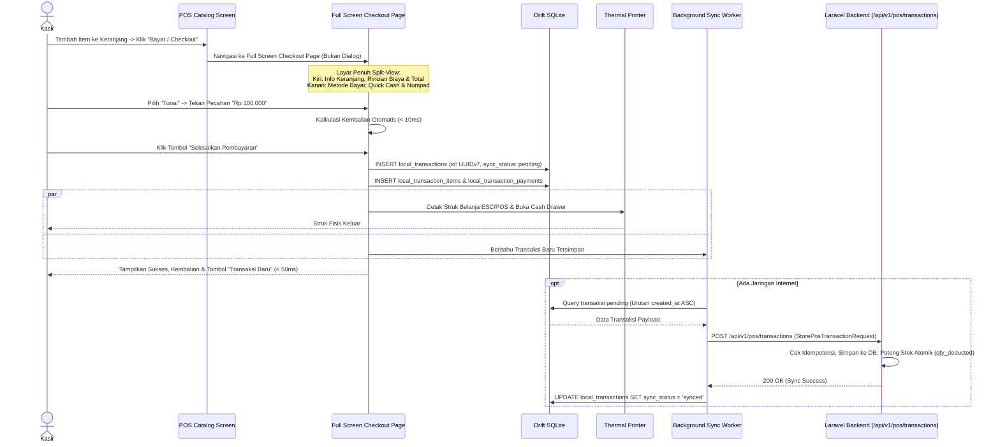
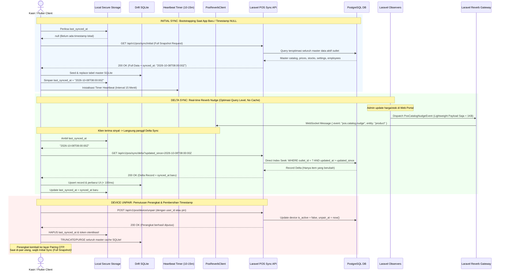

# PRD — Modul Transaksi & Penjualan - Channel POS App V1.3
## Core Fast Checkout (Full Screen), Hold-Resume, Dual-Mode Sync (Initial & Delta) & Realtime Stream

## 1. Executive Summary & Bounded Context

Sub-modul **V1.3 Core Fast Checkout, Hold-Resume, Dual-Mode Sync & Realtime Stream** adalah mesin inti (*engine*) transaksi penjualan pada aplikasi kasir **Sollu POS Client**. Modul ini bertanggung jawab atas alur checkout ultra-cepat berlatensi rendah (< 50ms) dengan tampilan **Layar Penuh (*Full Screen Checkout Page*)**, kalkulasi keranjang belanja komprehensif, penundaan tagihan (*Hold Bill*) dan pembukaan kembali (*Resume Bill*), pengiriman transaksi asinkron ke server Laravel (`POST /api/v1/pos/transactions`), pemisahan tegas antara **Pengambilan Data Keseluruhan (Initial Sync)** dan **Sinkronisasi Data Inkremental (Delta Sync)**, serta arsitektur sinkronisasi 3-layer (*Bootstrapping & Heartbeat*, *Real-time Nudge via Laravel Reverb*, dan *Smart Conflict Resolution Stok*).

### Kapabilitas Utama V1.3:
1. **Full Screen Checkout Page (Bukan Dialog Pop-up)**: Pengalaman kasir direfaktor dari dialog modal sempit menjadi halaman penuh (*Full Screen*) yang imersif dan ergonomis. Mengusung tata letak *Split View*: **Sisi Kiri** menyajikan informasi keranjang lengkap (*cart item breakdown*, diskon, pajak, pembulatan, grand total), sedangkan **Sisi Kanan** menyediakan panel pembayaran interaktif (*payment methods*, pecahan uang pas / *quick cash*, virtual keypad kalkulator kembalian, dan tombol eksekusi transaksi).
2. **Ultra-Fast Local Checkout (< 50ms)**: Transaksi penjualan disimpan seketika ke SQLite lokal (`local_transactions`), memicu pencetakan struk fisik ESC/POS dan membuka laci kas (*cash drawer*) tanpa menunggu respons jaringan internet.
3. **Dedicated Transaction Submission (`POST /api/v1/pos/transactions`)**: Transaksi penjualan lokal dikirimkan secara mandiri melalui *Background Sync Worker* secara FIFO ke server tanpa mencampuradukkan payload master data.
4. **Idempotency & Zero Double-Deduction**: Pencegahan pemotongan stok berulang dan duplikasi transaksi via pemeriksaan `offline_id` UUIDv7 di server backend.
5. **Hold & Resume Transactions (*Held Bills*)**: Kasir dapat memarkir transaksi pelanggan yang menunda pembayaran ke tabel `local_held_transactions` dan melanjutkannya kembali kapan saja via drawer interaktif.
6. **Dual-Mode Sync Architecture (Initial vs. Delta Sync)**:
   - **Initial Master Data Fetching (`GET /api/v1/pos/sync/initial`)**: Dipanggil khusus saat inisialisasi aplikasi pertama kali (saat *device pairing* / login), yaitu ketika parameter timestamp belum tersimpan di *local storage*. Endpoint ini mengembalikan *full snapshot* seluruh master data (katalog, harga, varian, modifier, stok awal, pelanggan, metode pembayaran, setting, karyawan).
   - **Delta Sync Endpoint (`GET /api/v1/pos/sync/delta?updated_since=...`)**: Dipanggil untuk sinkronisasi perubahan data inkremental (hanya entitas yang mengalami pembaruan/penghapusan sejak `updated_since`). Digunakan pada *periodic heartbeat polling*, reaksi *real-time nudge*, dan pemulihan pasca-offline.
7. **Device Unpair & Strict Timestamp Purge**: Ketika perangkat kasir diputus (*unpaired* atau logout melalui `POST /api/v1/pos/device/unpair`), klien Flutter **wajib menghapus parameter timestamp sinkronisasi (`last_synced_at`)** dan membersihkan seluruh cache master data lokal SQLite. Hal ini menjamin bahwa setiap kali perangkat dihubungkan kembali (*re-paired*), aplikasi dipaksa melakukan *Initial Sync* penuh yang bersih tanpa risiko *stale/dirty data*.
8. **Query-Level Optimization (Zero Cache Policy)**: Endpoint sinkronisasi data (baik initial maupun delta) **tidak menggunakan Redis cache**. Hal ini dikarenakan respons sinkronisasi selalu dinamis dan berbeda untuk setiap perangkat/permintaan bergantung pada parameter `updated_since` unik tiap kasir. Optimasi sepenuhnya difokuskan pada **level database query**: *compound indexes* `(outlet_id, is_enabled, updated_at)` dan `(business_id, updated_at)`, seleksi kolom ramping (*anti-overfetching*), dan pencegahan N+1 query.
9. **3-Layer Synchronization Engine**:
   - **Layer 1: Bootstrapping & Heartbeat Polling Fallback**: Initial sync saat aplikasi dibuka pertama kali tanpa timestamp, didukung background timer berkala (tiap 10–15 menit) yang memanggil delta sync untuk menyerap perubahan bila koneksi WebSocket sempat terputus tanpa disadari.
   - **Layer 2: Real-time Nudge via Laravel Reverb (Pemicu Utama)**: Penyaluran sinyal pembaruan ringan (*lightweight nudge signal*) tanpa membawa seluruh objek data melalui WebSocket `private-outlet.{outlet_id}.pos`. Begitu sinyal diterima, Flutter langsung memicu request delta sync teroptimasi ke `/sync/delta`.
   - **Layer 3: Smart Conflict Resolution untuk Stok (Mutation-Log Deduction)**: Saat offline, kasir memotong stok lokal secara independen. Saat sinkronisasi ke cloud, transaksi dikirim dalam bentuk **log mutasi pengurangan** (`qty_deducted: X`), bukan saldo stok absolut kasir. Cloud mengakumulasi pengurangan stok riil dalam transaksi atomik (`lockForUpdate`) untuk mencegah *race condition* multi-terminal kasir dalam 1 outlet.
10. **Lightweight Real-time Dispatch via Eloquent Observers**: Setiap mutasi pada model produk atau saldo stok di backend secara otomatis memicu dispatch event sinyal Reverb Nudge seketika (< 100ms) tanpa overhead manajemen invalidasi cache.

---

## 2. Architecture & Domain Flow

### 2.1. Arsitektur Sinkronisasi POS & Cloud (Dual-Mode & Query-Level Optimization)

```
Flutter Client (sollu_pos_client)                               Laravel 12 Backend
┌──────────────────────────────────────────────┐              ┌───────────────────────────────────────────────┐
│ [INITIAL BOOTSTRAP]                          │              │ PostgreSQL 16 (Multi-Tenant Scoped)           │
│ - Kondisi: Timestamp lokal NULL (Belum ada)  │              │ Optimasi Level Query (Zero Cache):            │
│ - Memicu Full Snapshot Download              │              │ - Compound Index: (outlet_id, updated_at)     │
│   GET /api/v1/pos/sync/initial               │─────────────►│ - Direct Table Scan Optimization              │
│   Simpan data & catat last_synced_at         │              │ - Ramping (Anti-Overfetching)                 │
└──────────────────────────────────────────────┘              └───────────────────────▲───────────────────────┘
                                                                                      │ (Direct Query Execution)
┌──────────────────────────────────────────────┐                                      │ (Tanpa Redis Cache)
│ [LAYER 1: Heartbeat Polling Fallback]        │                                      │
│ - Tiap 10-15 Menit kirim Delta Sync          │                                      │
│   GET /api/v1/pos/sync/delta                 │──────────────────────────────────────┤
│   ?updated_since=<ISO-Timestamp>             │                                      │
└──────────────────────▲───────────────────────┘                                      │
                       │                                                              │
┌──────────────────────┴───────────────────────┐                                      │
│ [LAYER 2: Real-time Reverb Nudge]            │                                      │
│ - PosReverbClient (WebSocket)                │◄──Lightweight Nudge (Type Sinyal)────┤ PosCatalogNudgeEvent
│   Channel: private-outlet.{o_id}.pos         │   (Ukuran < 1KB, Tanpa Objek Data)   │ (Laravel Reverb Gateway)
│ - Sinyal Diterima -> Auto Delta Sync:        │                                      ▲
│   GET /api/v1/pos/sync/delta?updated_since=..│──────────────────────────────────────┤
└──────────────────────────────────────────────┘                                      │ (Trigger Seketika)
                                                                                      │
┌──────────────────────────────────────────────┐              ┌───────────────────────┴───────────────────────┐
│ [DEVICE UNPAIR / DISCONNECT]                 │              │ Eloquent Observers:                           │
│ - User/Admin Putus Perangkat                 │              │ - ProductObserver                             │
│ - POST /api/v1/pos/device/unpair             │─────────────►│ - InventoryBalanceObserver                    │
│ - KLIEN: HAPUS TIMESTAMP & PURGE DB LOKAL!   │              └───────────────────────────────────────────────┘
└──────────────────────────────────────────────┘                                      ▲
                                                                                      │
┌──────────────────────────────────────────────┐                                      │
│ [LAYER 3: Smart Stock Conflict Res.]         │                                      │
│ - Offline Checkout: Potong SQLite Lokal      │                                      │
│ - Push Sync Transaksi FIFO:                  │                                      │
│   Kirim Log Mutasi Deduksi:                  │────────HTTP POST FIFO Mutation──────►│ TransactionController
│   items: [{ id, qty_deducted: 2 }]           │   (BUKAN current total stock)        │ (Atomic Row Lock & FIFO)
│   (Mencegah Race Condition Kasir)            │                                      │ DB::transaction Inventory
└──────────────────────────────────────────────┘                                      └───────────────────────────────┘
```

### 2.2. Prinsip Non-Blocking, Optimasi Query Level & Lifecycle Timestamp

1. **Pemisahan Tegas Initial Sync vs. Delta Sync**:
   - **Initial Sync (`GET /api/v1/pos/sync/initial`)**:
     - *Kapan Dipanggil*: Hanya saat aplikasi pertama kali diinisialisasi atau setelah *pairing device* baru, ketika nilai timestamp `last_synced_at` bernilai `null` atau tidak ditemukan pada penyimpanan lokal (*secure storage*).
     - *Payload*: Mengirimkan seluruh entitas master data tanpa filter `updated_at`.
     - *Local Persistence*: Menyimpan seluruh master data ke tabel SQLite Drift dan menyimpan header `synced_at` dari server sebagai baseline timestamp lokal.
   - **Delta Sync (`GET /api/v1/pos/sync/delta`)**:
     - *Kapan Dipanggil*: Dipanggil secara berkala oleh *Heartbeat Timer* (tiap 10–15 menit), saat menerima sinyal WebSocket Reverb Nudge, atau saat perangkat kembali *online* pasca-offline.
     - *Parameter Wajib*: `updated_since` (ISO 8601 UTC timestamp).
     - *Payload*: Hanya mengembalikan *diff* (daftar record yang dibuat/diubah/dihapus sejak `updated_since`).
     - *Local Persistence*: Melakukan operasi *upsert* dan *soft-delete* inkremental pada SQLite lokal, lalu memperbarui nilai `last_synced_at`.

2. **Lifecycle Timestamp & Pemutusan Perangkat (*Device Unpair*)**:
   - Timestamp `last_synced_at` adalah penanda integritas sesi perangkat dengan outlet server.
   - Saat kasir/admin mengeksekusi pemutusan perangkat via `POST /api/v1/pos/device/unpair` (atau perangkat di-unpair secara remote dari portal web):
     - Klien kasir **wajib menghapus parameter timestamp `last_synced_at`** dari penyimpanan lokal.
     - Klien kasir **wajib menghapus seluruh data tabel master lokal** di Drift SQLite (`local_products`, `local_prices`, `local_categories`, dll.) guna mencegah kontaminasi data antar-outlet atau antar-sesi.
     - Token Sanctum dihapus dari *secure storage*.
   - Ketika perangkat dihubungkan ulang (*re-paired* via OTP), ketiadaan timestamp secara otomatis memaksa aplikasi memanggil **Initial Sync** untuk mengambil data segar secara utuh.

3. **Prinsip Query-Level Optimization (Zero Cache Policy)**:
   - **Mengapa Tanpa Cache (No Cache)?**: Nilai parameter `updated_since` dari klien kasir bersifat sangat dinamis dan granular (presisi detik/milidetik). Penggunaan cache (seperti Redis) justru menjadi *anti-pattern* karena tingkat *cache hit* mendekati 0% (hampir setiap request memiliki key timestamp berbeda), memboroskan memori Redis, dan memicu overhead serialisasi data.
   - **Optimasi Terfokus pada PostgreSQL Query**:
     - *Compound Indexes*: Memastikan query filter `WHERE outlet_id = ? AND updated_at > ?` menggunakan indeks gabungan spesifik (`idx_outlet_product_sync`, `idx_inventory_balances_sync`).
     - *Anti-Overfetching*: Kolom yang diambil hanya field yang esensial untuk operasional kasir (menghindari `SELECT *`).
     - *Eager Loading Ramping*: Relasi dimuat menggunakan `with(['items:id,name,uom_id'])` guna mencegah fenomena N+1 query.
     - *Lightweight Delta Calculation*: Jika query mendeteksi tidak ada mutasi data sejak `updated_since`, backend merespons cepat dengan JSON delta kosong (`updated_products: []`), berlatensi sangat rendah (< 30ms).

4. **3-Layer Synchronization Workflow**:
   - **Layer 1 (Bootstrapping & Heartbeat)**: Memastikan kasir memiliki data awal lengkap saat buka kasir pagi, serta memiliki jaring pengaman (*fallback heartbeat timer* tiap 10–15 menit) bila koneksi WebSocket Reverb terputus tanpa terdeteksi.
   - **Layer 2 (Lightweight Reverb Nudge)**: Penyaluran sinyal pembaruan data secara instan (< 100ms). Objek data tidak dikirim lewat WebSocket; Reverb hanya mengirim sinyal *nudge* berukuran < 1KB (contoh: `{ "event": "pos.catalog.nudge", "entity": "product" }`). Begitu sinyal diterima, klien langsung memicu Delta Sync ke `/sync/delta`.
   - **Layer 3 (Smart Conflict Resolution untuk Stok)**: Menggunakan format **log mutasi kuantitas (`qty_deducted: X`)**, bukan nilai saldo stok kasir. Cloud mengeksekusi mutasi stok secara atomik dalam `DB::transaction` menggunakan *pessimistic locking* (`lockForUpdate`), mengeliminasi *race condition* jika beberapa terminal kasir menjual produk yang sama secara simultan.

5. **Urutan Eksekusi Pasca Offline (Strict Pipeline)**:
   - **Langkah 1 (Master Delta Sync Wajib Pertama)**: Eksekusi `GET /api/v1/pos/sync/delta?updated_since=...` untuk memastikan stok dan harga termutakhir di server terserap ke Drift SQLite kasir.
   - **Langkah 2 (Push Antrean Transaksi Pending)**: Pengiriman antrean transaksi lokal pending (`POST /api/v1/pos/transactions`) secara FIFO.
   - **Zero UI Interruption**: Seluruh pipeline berjalan di *background worker* non-blocking. Kasir tetap dapat melayani antrean belanja tanpa hambatan frame atau jeda antarmuka.

---

## 3. Core Features & User Activity Use Cases

### 3.1. Fitur Utama

| Fitur | Deskripsi |
| :--- | :--- |
| **Layar Checkout Penuh (*Full Screen Checkout*)** | Refaktor dari dialog pop-up menjadi halaman penuh interaktif (*Split View*): Sisi kiri menyajikan informasi keranjang lengkap & rincian biaya, sisi kanan menyediakan pemilihan metode bayar, pecahan uang pas (*quick cash*), virtual keypad, dan kalkulator kembalian otomatis. |
| **Keranjang Belanja Reaktif (*Cart Engine*)** | Kalkulasi subtotal, diskon baris item, diskon global keranjang, pajak PPN 11%, biaya layanan (*service charge*), dan pembulatan transaksi (*rounding*). |
| **Simpan Tagihan (*Hold Bill*)** | Menyimpan isi keranjang aktif ke antrean pending tanpa memotong stok, memberi nama catatan (contoh: "Meja 5"). |
| **Buka Tagihan (*Resume Bill*)** | Drawer daftar held bills dengan jam simpan, tombol muat ulang ke keranjang (*resume*), dan tombol hapus antrean. |
| **Pengambilan Keseluruhan Data (*Initial Sync*)** | Endpoint `GET /api/v1/pos/sync/initial` untuk mengunduh seluruh master data saat aplikasi pertama kali dipasang/dibuka tanpa parameter timestamp. |
| **Sinkronisasi Data Inkremental (*Delta Sync*)** | Endpoint `GET /api/v1/pos/sync/delta` berlatensi rendah untuk mengambil data perubahan sejak `updated_since`. Dioptimasi level database query tanpa beban cache. |
| **Pembersihan Timestamp Saat Putus Perangkat (*Unpair Cleanup*)** | Eksekusi `POST /api/v1/pos/device/unpair` menghapus parameter timestamp `last_synced_at` dan membersihkan SQLite lokal agar pairing berikutnya selalu memicu *Initial Sync*. |
| **Query-Level Optimization (Zero Cache)** | Tidak menggunakan Redis cache pada endpoint sync karena respon selalu dinamis; mengandalkan compound index dan query seek cepat. |
| **3-Layer Sync Architecture** | Sinergi Layer 1 (Bootstrapping & Heartbeat Polling 10-15m), Layer 2 (Lightweight Reverb Nudge $\rightarrow$ Auto Delta Fetch), dan Layer 3 (Smart Conflict Resolution Stok). |
| **Smart Conflict Resolution Stok** | Pengiriman transaksi lokal ke cloud menggunakan format **log mutasi pengurangan** (`qty_deducted: X`), bukan saldo akhir, mencegah race condition multi-terminal kasir. |
| **Strict Background Reconnection Pipeline** | Saat kembali online: (1) Endpoint delta sync dieksekusi pertama kali, (2) dilanjutkan push transaksi pending FIFO di latar belakang tanpa freeze UI. |

### 3.2. Skenario Aktivitas Pengguna (Use Cases)

```
┌────────────────────────────────────────────────────────────────────────────────────────────────────────┐
│ Skenario Pengguna POS V1.3 (Full Screen Checkout, Dual-Mode Sync & Pemutusan Device)                   │
├──────────────────────────────┬──────────────────────────────┬──────────────────────────────────────────┤
│ Use Case                     │ Kondisi & Perangkat          │ Respon & Output Sistem                   │
├──────────────────────────────┼──────────────────────────────┼──────────────────────────────────────────┤
│ 1. Checkout Layar Penuh      │ Kasir tekan tombol "Bayar"   │ Berpindah ke Full Screen Checkout Page.  │
│    (Full Screen Checkout)    │ Pelanggan siap melunasi      │ Kiri: Info keranjang & kalkulasi lengkap │
│                              │                              │ Kanan: Metode bayar & pecahan uang tunai.│
├──────────────────────────────┼──────────────────────────────┼──────────────────────────────────────────┤
│ 2. Checkout Offline Cepat    │ Internet: Terputus (Offline) │ Transaksi tersimpan lokal < 50ms, struk  │
│    (Offline Sale Checkout)   │ Pembayaran: Tunai            │ keluar, laci kas terbuka, status         │
│                              │                              │ transaksi: `pending_sync`.               │
├──────────────────────────────┼──────────────────────────────┼──────────────────────────────────────────┤
│ 3. Tahan Tagihan (Hold Bill) │ Pelanggan lupa bawa dompet   │ Kasir klik "Hold", input "Meja 12".      │
│                              │ Kasir harus layani antrean   │ Keranjang bersih, siap melayani antrean. │
├──────────────────────────────┼──────────────────────────────┼──────────────────────────────────────────┤
│ 4. Buka Tagihan (Resume Bill)│ Pelanggan Meja 12 siap bayar │ Kasir buka drawer Held Bills, klik       │
│                              │ Antrean sebelumnya selesai   │ Resume. Item kembali ke keranjang kasir. │
├──────────────────────────────┼──────────────────────────────┼──────────────────────────────────────────┤
│ 5. Initial App Startup       │ Device baru dipairing /      │ Local storage: timestamp NULL.           │
│    (Initial Master Sync)     │ Baru pertama kali buka app   │ Memanggil /sync/initial (Full Snapshot). │
│                              │ Status: Online               │ Simpan catalog, set last_synced_at = now │
├──────────────────────────────┼──────────────────────────────┼──────────────────────────────────────────┤
│ 6. Heartbeat Polling Fallback│ Koneksi WS sempat terputus   │ Tiap 15 menit, timer background panggil  │
│    (Layer 1 Timer 15 Menit)  │ diam-diam tanpa event reconnect /sync/delta?updated_since=<timestamp>.   │
│                              │                              │ Query level cepat mengembalikan delta.   │
├──────────────────────────────┼──────────────────────────────┼──────────────────────────────────────────┤
│ 7. Realtime Reverb Nudge     │ Admin ubah harga di Web      │ 1. Observer kirim sinyal nudge ringan.   │
│    (Layer 2 Signal Stream)   │ Kasir sedang standby         │ 2. WS Reverb teruskan pesan ke Flutter.  │
│                              │                              │ 3. Flutter auto-fetch /sync/delta.       │
│                              │                              │ 4. Harga di UI terupdate (< 100ms).      │
├──────────────────────────────┼──────────────────────────────┼──────────────────────────────────────────┤
│ 8. Pemutusan Perangkat       │ Kasir ganti tablet kasir     │ 1. Kirim POST /device/unpair.            │
│    (Device Unpair & Purge)   │ Admin putus koneksi device   │ 2. Klien HAPUS timestamp & SQLite lokal. │
│                              │                              │ 3. Pairing ulang WAJIB Initial Sync.     │
├──────────────────────────────┼──────────────────────────────┼──────────────────────────────────────────┤
│ 9. Penjualan Multi-Terminal  │ Kasir A & Kasir B jual kopi  │ Keduanya kirim log mutasi qty_deducted:  │
│    (Layer 3 Smart Conflict)  │ stok awal 10 di outlet sama  │ Kasir A deduksi 2, Kasir B deduksi 3.    │
│                              │                              │ Cloud potong atomik: 10 - 2 - 3 = sisa 5 │
│                              │                              │ Bebas race condition / double deduction. │
├──────────────────────────────┼──────────────────────────────┼──────────────────────────────────────────┤
│ 10. Pemulihan Pasca Offline  │ Internet kembali terhubung   │ Background Worker berjalan senyap:       │
│    (Delta Sync -> Push)      │ Ada 20 transaksi pending     │ 1. Urutan 1: Hit GET /sync/delta         │
│                              │ Kasir sedang sibuk checkout  │ 2. Urutan 2: Push 20 transaksi FIFO.     │
│                              │                              │ 3. UI Kasir 100% responsif tanpa jeda.   │
└──────────────────────────────┴──────────────────────────────┴──────────────────────────────────────────┘
```

---

## 4. User Flow & Sequence Diagrams

### 4.1. Alur Checkout Penuh (Full Screen) & Background Push Transaksi



### 4.2. Alur Dual-Mode Sinkronisasi & Pemutusan Perangkat (Unpair Lifecycle)



---

## 5. UI/UX Specifications: Full Screen Checkout Page

### 5.1. Alasan Refaktor dari Dialog Menjadi Full Screen
1. **Ergonomi Kasir (Touch Targets & Clarity)**: Dialog pop-up di layar kasir (tablet 10"–12" atau monitor POS 15") membatasi ruang pandang dan memaksa tombol-tombol numpad serta daftar item menjadi kerdil, meningkatkan risiko salah ketik (*tap error*).
2. **Visibilitas Keranjang Saat Pelunasan**: Kasir dan pelanggan sering membutuhkan konfirmasi ulang daftar barang yang dibeli (terutama saat penerapan diskon, pajak, dan catatan modifikasi) tepat di samping proses pembayaran tunai/non-tunai.
3. **Penyajian Metode Pembayaran Modern**: Pembayaran modern melibatkan opsi beragam (Tunai, QRIS Dinamis, EDC Kartu, Transfer). Layar penuh memberikan ruang yang cukup untuk memuat QR code beresolusi jelas atau numpad kembalian berukuran ramah jari kasir.

### 5.2. Tata Letak *Split View* (Desktop/Tablet POS)

```
┌────────────────────────────────────────────────────────────────────────────────────────────────────────┐
│ [<- Kembali ke Kasir]                CHECKOUT & PEMBAYARAN                    No: POS/20261008/0042   │
├─────────────────────────────────────────────┬──────────────────────────────────────────────────────────┤
│ PANEL KIRI: INFO KERANJANG & RINCIAN        │ PANEL KANAN: METODE BAYAR & AKSI PEMBAYARAN              │
│                                             │                                                          │
│ DAFTAR PESANAN (3 Item):                    │ METODE PEMBAYARAN:                                       │
│ ┌─────────────────────────────────────────┐ │ ┌──────────┐ ┌──────────┐ ┌──────────┐ ┌──────────────┐ │
│ │ 2x Kopi Susu Gula Aren      Rp 56.000   │ │ │ [TUNAI]  │ │   QRIS   │ │ EDC/KARTU│ │   TRANSFER   │ │
│ │    - Less Sugar, Oatmilk (+Rp 6.000)    │ │ └──────────┘ └──────────┘ └──────────┘ └──────────────┘ │
│ │ 1x Croissant Butter         Rp 25.000   │ │                                                          │
│ └─────────────────────────────────────────┘ │ PECAHAN UANG CEPAT (QUICK CASH):                         │
│                                             │ ┌──────────────┐ ┌──────────────┐ ┌────────────────────┐ │
│ RINCIAN BIAYA:                              │ │ UANG PAS     │ │ Rp 100.000   │ │ Rp 150.000         │ │
│ Subtotal Kotor                 Rp 87.000    │ │ (Rp 98.790)  │ │              │ │                    │ │
│ Diskon Promo (Member 10%)     -Rp  8.700    │ └──────────────┘ └──────────────┘ └────────────────────┘ │
│ Service Charge (5%)            Rp  3.915    │ ┌──────────────┐ ┌──────────────┐ ┌────────────────────┐ │
│ Pajak PB1/PPN (11%)            Rp  9.053    │ │ Rp 200.000   │ │ Rp 50.000    │ │ Nominal Lain (Ketik)│ │
│ Pembulatan                    -Rp    178    │ └──────────────┘ └──────────────┘ └────────────────────┘ │
│ ─────────────────────────────────────────── │                                                          │
│ TOTAL TAGIHAN (GRAND TOTAL):                │ NOMINAL DITERIMA:          Rp [ 100.000              ]   │
│                                             │ KEMBALIAN (CHANGE DUE):    Rp [   1.210              ]   │
│            Rp 98.790                        │ (Kalkulasi dinamis & berwarna hijau kontras)             │
│                                             │                                                          │
│ Catatan Transaksi:                          │ [X] Cetak Struk Otomatis     [X] Buka Laci Kas           │
│ [ Meja 04 - Dine In                       ] │ ┌──────────────────────────────────────────────────────┐ │
│                                             │ │        SELESAIKAN PEMBAYARAN (Rp 98.790)             │ │
│                                             │ └──────────────────────────────────────────────────────┘ │
└─────────────────────────────────────────────┴──────────────────────────────────────────────────────────┘
```

### 5.3. Komponen Layar Checkout:
- **Panel Kiri (Lebar ~42%)**:
  - Tombol Navigasi Kembali: `IconButton(Icons.arrow_back)` di bagian atas kiri untuk kembali ke kasir tanpa menghapus status keranjang aktif.
  - Kartu Pesanan Scrollable: Menampilkan tiap item keranjang, modifikasi varian/opsi, harga subtotal item, dan catatan baris.
  - Rincian Kalkulasi: Subtotal kotor, total diskon, biaya layanan, pajak, dan penyesuaian pembulatan.
  - Display Grand Total: Kontras tinggi, font `Plus Jakarta Sans` berukuran 28–32sp, tebal (*bold*), mempermudah kasir dan pembeli melihat nominal akhir.
- **Panel Kanan (Lebar ~58%)**:
  - Tab Pilihan Metode Pembayaran: Tombol segmented responsif dengan tinggi min 48px untuk Tunai, QRIS, EDC Kartu, dan Transfer.
  - Area Pembayaran Tunai:
    - *Quick Cash Chips*: Tombol instan bernilai uang pas (*exact cash*), pecahan Rp 50.000, Rp 100.000, Rp 200.000.
    - Virtual Numpad & Input Field: Input nominal diterima dengan pemformatan mata uang Rupiah otomatis.
    - Kembalian Uang: Indikator teks besar, bernilai Rp 0 jika uang pas, berwarna hijau jika ada kembalian, dan merah/disabled jika nominal uang diterima kurang dari total tagihan.
  - Area Pembayaran Non-Tunai: Menampilkan QRIS dinamis atau input *Approval Code* mesin EDC.
  - Kontrol Aksesori Struk: Toggle switch untuk "Cetak Struk Otomatis" dan "Buka Laci Kas".
  - Tombol Eksekusi (*Primary CTA*): Tombol penuh (*full width*), tinggi min 56px, latar hijau Sollu (`SolluColors.primary`), memicu penyimpanan transaksi offline ke Drift SQLite < 50ms.

---

## 6. Technical Architecture & File Structure

### 6.1. File Structure Klien Flutter (`sollu_pos_client`)

```
lib/features/pos/
├── presentation/
│   ├── controllers/
│   │   ├── cart_controller.dart                 # Riverpod Notifier kalkulasi keranjang & breakdown tagihan
│   │   ├── checkout_controller.dart             # Controller logika pembayaran, kalkulasi kembalian & numpad
│   │   └── held_bills_controller.dart           # Manajemen Hold & Resume bill
│   ├── screens/
│   │   ├── checkout_screen.dart                 # [REFACTOR] Layar Checkout Penuh (Full Screen Page Split View)
│   │   └── held_bills_drawer.dart               # Drawer daftar tagihan yang ditahan
│   └── widgets/
│       ├── checkout/
│       │   ├── checkout_cart_pane.dart          # Panel Kiri: Daftar item, breakdown biaya & Grand Total
│       │   ├── checkout_payment_pane.dart       # Panel Kanan: Metode bayar, quick cash, numpad & tombol bayar
│       │   ├── quick_cash_grid.dart             # Grid pecahan uang pas (Exact Cash, 50k, 100k, 200k)
│       │   └── payment_method_selector.dart     # Segmented selector (Tunai, QRIS, EDC, Transfer)
│       ├── cart_item_tile.dart                  # Baris item keranjang (qty, diskon, catatan)
│       └── cart_summary_bar.dart                # Summary bar di layar katalog kasir
├── domain/
│   ├── entities/
│   │   ├── cart_item.dart
│   │   └── pos_sale_transaction.dart
│   └── usecases/
│       ├── process_sale_usecase.dart
│       ├── initial_sync_usecase.dart            # UseCase pemanggil Initial Sync saat startup tanpa timestamp
│       ├── delta_sync_usecase.dart              # UseCase pemanggil Delta Sync saat menerima Reverb nudge/timer
│       └── device_unpair_usecase.dart           # UseCase pemutus device & penghapusan timestamp lokal
└── data/
    ├── database/
    │   ├── tables/
    │   │   ├── local_transactions.dart
    │   │   ├── local_transaction_items.dart
    │   │   ├── local_transaction_payments.dart
    │   │   └── local_held_transactions.dart
    │   └── daos/
    │       ├── transaction_dao.dart
    │       └── held_bills_dao.dart
    ├── sync/
    │   ├── background_sync_worker.dart          # Pipeline rekoneksi: Delta Sync Step 1 -> Transaction FIFO Step 2
    │   ├── initial_sync_service.dart            # Pemanggil GET /api/v1/pos/sync/initial (Full master snapshot)
    │   ├── delta_sync_service.dart              # Pemanggil GET /api/v1/pos/sync/delta?updated_since=...
    │   └── heartbeat_polling_service.dart       # Layer 1 Fallback: Background timer berkala (10-15m) panggil delta
    └── realtime/
        └── pos_reverb_client.dart               # Layer 2: Listener WebSocket Reverb pemantau sinyal PosCatalogNudgeEvent
```

### 6.2. File Structure Backend Laravel 12 (`sollu-app`)

```
app/
├── Http/
│   ├── Controllers/API/V1/POS/
│   │   ├── DeviceController.php                 # POST /connect, GET /status, POST /unpair (Memicu unpair cleanup)
│   │   ├── TransactionController.php            # POST /transactions (Log mutasi kuantitas & FIFO deduction atomik)
│   │   └── SyncController.php                   # GET /sync/initial (Full Snapshot) & GET /sync/delta (Query-Level Optimized)
│   └── Requests/API/V1/POS/
│       ├── StorePosTransactionRequest.php       # Validasi lengkap payload transaksi (memuat qty_deducted)
│       ├── PosDeltaSyncRequest.php              # Validasi parameter updated_since (ISO 8601)
│       └── UnpairPosDeviceRequest.php           # Validasi PIN / user_id autorisasi unpair
├── Observers/POS/
│   ├── ProductObserver.php                      # Dispatch PosCatalogNudgeEvent seketika (Tanpa cache flush overhead)
│   └── InventoryBalanceObserver.php             # Dispatch PosCatalogNudgeEvent seketika (Tanpa cache flush overhead)
├── Events/POS/
│   ├── PosCatalogNudgeEvent.php                 # ShouldBroadcastNow (Lightweight signal tanpa memuat objek data besar)
│   └── PosDeviceUnpairedEvent.php               # Event pemutusan perangkat
└── Services/App/
    ├── Transaction/
    │   ├── MasterDataSyncService.php            # Query-Level Optimized Full Snapshot Builder (Zero Cache)
    │   ├── DeltaSyncService.php                 # Query-Level Optimized Delta Builder (Index scan seek, Zero Cache)
    │   └── TransactionService.php               # Pemotongan stok FIFO atomik (lockForUpdate) & idempotensi
    └── Pos/
        └── PosDeviceAuthCacheService.php        # Cache otentikasi Sanctum & status device aktif
```

---

## 7. Public API Contracts

### 7.1. Submit Transaksi POS (`POST /api/v1/pos/transactions`)
- *Tujuan*: Mengirim transaksi lokal ke server dengan format **log mutasi deduksi** guna mencegah *race condition* multi-terminal.
- *Endpoint*: `POST /api/v1/pos/transactions`
- *Request Body*:
  ```json
  {
    "offline_id": "9b1deb4d-3b7d-4bad-9bdd-2b0d7b3dcb6d",
    "transaction_number": "POS/20261001/0001",
    "shift_id": null,
    "transaction_date": "2026-10-01T12:00:00+07:00",
    "subtotal": 50000.0,
    "discount_amount": 5000.0,
    "tax_amount": 4950.0,
    "service_charge_amount": 0.0,
    "rounding_amount": 0.0,
    "total": 49950.0,
    "payment_status": "paid",
    "status": "completed",
    "items": [
      {
        "product_id": "7b0deb4c-1b7d-4aad-9bee-1b0d7b3dcb2b",
        "qty_deducted": 2.0,
        "price": 25000.0,
        "subtotal": 50000.0
      }
    ],
    "payments": [
      {
        "payment_method": "cash",
        "amount": 50000.0,
        "change_amount": 50.0
      }
    ]
  }
  ```
  > *Catatan Integritas Stok*: Field `qty_deducted` merepresentasikan kuantitas yang dipotong oleh transaksi ini (log mutasi). Backend akan mengeksekusi `stock = stock - qty_deducted` secara atomik di database PostgreSQL (`lockForUpdate`), BUKAN menimpa total saldo stok kasir.

### 7.2. Initial Master Data Fetching (`GET /api/v1/pos/sync/initial`)
- *Tujuan*: Mengunduh **keseluruhan data master** (*Full Snapshot*) saat aplikasi kasir pertama kali diinisialisasi atau dipasangkan (*paired*), ketika parameter timestamp **belum ada di local storage**.
- *Karakteristik*: Query-level optimized, tanpa cache Redis, menghasilkan snapshot data lengkap terkini.
- *Endpoint*: `GET /api/v1/pos/sync/initial`
- *Headers*: `Authorization: Bearer <device-token>`
- *Response (200 OK)*:
  ```json
  {
    "success": true,
    "message": "Initial master data snapshot retrieved successfully",
    "data": {
      "synced_at": "2026-10-08T08:00:00+07:00",
      "outlet": {
        "id": "9b1deb4c-2b7d-4aad-9bee-1b0d7b3dcb1a",
        "name": "Sollu Coffee & Eatery - Cabang Utama",
        "address": "Jl. Sudirman No. 45, Jakarta",
        "phone": "08123456789",
        "email": "cabang.utama@sollu.id",
        "logo_url": "https://cdn.sollu.id/outlets/logo-1.png"
      },
      "products": [
        {
          "id": "7b0deb4c-1b7d-4aad-9bee-1b0d7b3dcb2b",
          "name": "Kopi Susu Gula Aren",
          "category_id": "c10deb4c-1b7d-4aad-9bee-1b0d7b3dcb01",
          "is_active": true
        }
      ],
      "product_categories": [
        {
          "id": "c10deb4c-1b7d-4aad-9bee-1b0d7b3dcb01",
          "name": "Coffee",
          "sort_order": 1
        }
      ],
      "product_prices": [
        {
          "id": "p10deb4c-1b7d-4aad-9bee-1b0d7b3dcb01",
          "product_id": "7b0deb4c-1b7d-4aad-9bee-1b0d7b3dcb2b",
          "price": 28000.0
        }
      ],
      "product_images": [],
      "variant_groups": [],
      "variant_group_options": [],
      "product_modifier_groups": [],
      "modifier_groups": [],
      "modifier_options": [],
      "customers": [],
      "payment_methods": [
        {
          "id": "pm-cash",
          "code": "cash",
          "name": "Tunai",
          "is_active": true
        }
      ],
      "outlet_settings": [],
      "settings": {
        "tax_percentage": 11.0,
        "service_charge_percentage": 0.0,
        "tax_included_in_price": false,
        "rounding_enabled": true,
        "rounding_mode": "nearest"
      },
      "employees": [
        {
          "id": "u1",
          "name": "Budi Kasir",
          "pin": "$2y$10$...",
          "role": "Kasir",
          "permissions": ["pos.checkout", "pos.hold_bill"]
        }
      ],
      "inventory_balances": [
        {
          "product_id": "7b0deb4c-1b7d-4aad-9bee-1b0d7b3dcb2b",
          "stock": 45.0
        }
      ],
      "promos": []
    }
  }
  ```
  > *Aturan Klien*: Begitu respons 200 diterima, simpan seluruh entitas ke database lokal Drift SQLite dan simpan `synced_at` ke local secure storage sebagai nilai `last_synced_at`.

### 7.3. Inkremental Master Delta Sync (`GET /api/v1/pos/sync/delta`)
- *Tujuan*: Sinkronisasi delta data katalog dan saldo stok yang mengalami pembaruan/penghapusan sejak `updated_since`.
- *Karakteristik*: Query-level optimized murni tanpa Redis cache. Query menggunakan *index seek* `WHERE updated_at > :updated_since`.
- *Endpoint*: `GET /api/v1/pos/sync/delta?updated_since=2026-10-08T08:00:00Z`
- *Query Parameters*:
  - `updated_since` (string ISO 8601 UTC, required): Timestamp lokal terakhir kali data disinkronkan.
- *Headers*: `Authorization: Bearer <device-token>`
- *Response (200 OK)*:
  ```json
  {
    "success": true,
    "message": "Delta master catalog synchronized successfully",
    "data": {
      "synced_at": "2026-10-08T10:05:00+07:00",
      "updated_products": [
        {
          "id": "7b0deb4c-1b7d-4aad-9bee-1b0d7b3dcb2b",
          "name": "Kopi Susu Gula Aren Spesial",
          "is_active": true
        }
      ],
      "updated_prices": [
        {
          "product_id": "7b0deb4c-1b7d-4aad-9bee-1b0d7b3dcb2b",
          "price": 30000.0
        }
      ],
      "updated_inventory_balances": [
        {
          "product_id": "7b0deb4c-1b7d-4aad-9bee-1b0d7b3dcb2b",
          "stock": 38.0
        }
      ],
      "deleted_product_ids": []
    }
  }
  ```
  > *Aturan Klien*: Klien mengeksekusi operasi upsert pada record lokal, menghapus data yang terdaftar di `deleted_product_ids`, lalu memperbarui nilai `last_synced_at` dengan nilai `synced_at` baru.

### 7.4. Pemutusan Perangkat & Pembersihan Timestamp (`POST /api/v1/pos/device/unpair`)
- *Tujuan*: Memutuskan hubungan perangkat POS dari outlet.
- *Endpoint*: `POST /api/v1/pos/device/unpair`
- *Request Body*:
  ```json
  {
    "user_id": "uuid-authorized-manager-or-owner",
    "pin": "123456"
  }
  ```
- *Response (200 OK)*:
  ```json
  {
    "success": true,
    "message": "Perangkat berhasil diputus dari outlet."
  }
  ```
- *Side-Effect Klien Kasir (Wajib)*:
  1. Menghapus Sanctum token dari *secure storage*.
  2. **Menghapus variabel `last_synced_at` dari *local storage***.
  3. Menghapus (*truncate/purge*) seluruh tabel master data lokal Drift SQLite.
  4. Mereset state aplikasi kembali ke halaman *Connect Device / OTP Pairing*.

### 7.5. Lightweight Real-time Nudge WebSocket Contract (Laravel Reverb)
- *Channel*: `private-outlet.{outlet_id}.pos`
- *Event Class*: `App\Events\POS\PosCatalogNudgeEvent` (implements `ShouldBroadcastNow`)
- *Karakteristik Payload*: Tidak membawa objek data katalog, melainkan sinyal pemantik ringan (< 1KB) agar tidak membebani koneksi WebSocket.
- *Payload*:
  ```json
  {
    "event": "pos.catalog.nudge",
    "outlet_id": "9b1deb4c-2b7d-4aad-9bee-1b0d7b3dcb1a",
    "entity_type": "product",
    "timestamp": "2026-10-08T10:05:01+07:00"
  }
  ```
- *Client Behavior*: Begitu `PosCatalogNudgeEvent` diterima oleh klien Flutter, klien secara reaktif membaca `last_synced_at` dari *storage* dan memicu `delta_sync_service.fetchDelta(updatedSince: lastLocalTimestamp)`.

---

## 8. Database Schema & Atomic Transactions

### 8.1. Optimasi Indexing PostgreSQL (Server) untuk Query-Level Sync

```sql
-- Indeks gabungan untuk mempercepat scan delta sync tanpa sequential scan
CREATE INDEX IF NOT EXISTS idx_outlet_product_sync 
ON outlet_product (outlet_id, is_enabled, updated_at);

CREATE INDEX IF NOT EXISTS idx_products_business_sync 
ON products (business_id, updated_at);

CREATE INDEX IF NOT EXISTS idx_product_prices_sync 
ON product_prices (outlet_id, updated_at);

CREATE INDEX IF NOT EXISTS idx_inventory_balances_sync 
ON inventory_balances (outlet_id, updated_at);
```

### 8.2. Proteksi Race Condition Stok Multi-Terminal (`TransactionService.php`)

```php
DB::transaction(function () use ($validatedPayload) {
    // 1. Simpan header transaksi (Idempotent via offline_id)
    $transaction = Transaction::create([...]);

    // 2. Loop tiap item dengan kuantitas mutasi (qty_deducted)
    foreach ($validatedPayload['items'] as $item) {
        // Pessimistic Locking untuk mencegah race condition antar-kasir
        $balance = InventoryBalance::where('outlet_id', $validatedPayload['outlet_id'])
            ->where('product_id', $item['product_id'])
            ->lockForUpdate()
            ->firstOrFail();

        // Deduksi stok secara akumulatif (Atomic Mutation)
        $balance->stock -= $item['qty_deducted'];
        $balance->save();

        // Catat mutasi ledger
        InventoryMovement::create([
            'outlet_id' => $validatedPayload['outlet_id'],
            'product_id' => $item['product_id'],
            'type' => 'pos_sale',
            'quantity' => -$item['qty_deducted'],
            'reference_id' => $transaction->id,
        ]);
    }
});
```

### 8.3. Schema Drift SQLite (Klien Kasir)

```dart
class LocalTransactions extends Table {
  TextColumn get id => text()(); // UUIDv7
  TextColumn get transactionNumber => text()();
  TextColumn get shiftId => text().nullable()();
  RealColumn get subtotal => real()();
  RealColumn get discountAmount => real().withDefault(const Constant(0.0))();
  RealColumn get taxAmount => real().withDefault(const Constant(0.0))();
  RealColumn get serviceChargeAmount => real().withDefault(const Constant(0.0))();
  RealColumn get roundingAmount => real().withDefault(const Constant(0.0))();
  RealColumn get total => real()();
  TextColumn get syncStatus => text()(); // pending, syncing, synced, failed
  DateTimeColumn get createdAt => dateTime()();

  @override
  Set<Column> get primaryKey => {id};
}

class LocalHeldTransactions extends Table {
  TextColumn get id => text()();
  TextColumn get customerNote => text().nullable()();
  TextColumn get cartPayloadJson => text()(); // Serialized items & modifiers
  DateTimeColumn get heldAt => dateTime()();

  @override
  Set<Column> get primaryKey => {id};
}
```

---

## 9. Single Source of Truth: Enums

```php
namespace App\Enums;

enum TransactionStatus: string {
    case DRAFT = 'draft';
    case COMPLETED = 'completed';
    case CANCELLED = 'cancelled';
}

enum SyncStatusEnum: string {
    case PENDING = 'pending';
    case SYNCING = 'syncing';
    case SYNCED = 'synced';
    case FAILED = 'failed';
}
```

---

## 10. Testing & Quality Assurance

1. **Full Screen Checkout Testing**:
   - `test_navigate_to_full_screen_checkout_renders_cart_on_left_and_payment_on_right()`: Memastikan antarmuka checkout tampil sebagai halaman penuh (*split view*) dengan keranjang di kiri dan panel pembayaran di kanan.
   - `test_quick_cash_buttons_calculate_correct_change_dynamically()`: Memastikan pecahan uang pas dan tombol instan menghitung kembalian uang secara akurat.
   - `test_complete_payment_saves_to_drift_sqlite_in_less_than_50ms()`: Memverifikasi persistensi transaksi lokal < 50ms tanpa menunggu panggilan internet.

2. **Dual-Mode Sync & Lifecycle Timestamp Testing**:
   - `test_initial_sync_invoked_when_local_timestamp_is_null()`: Memastikan ketiadaan timestamp di local storage memicu pemanggilan `GET /api/v1/pos/sync/initial` (Full Snapshot).
   - `test_delta_sync_invoked_with_valid_timestamp_returns_only_modified_records()`: Memastikan `GET /api/v1/pos/sync/delta?updated_since=...` hanya mengembalikan record inkremental yang berubah.
   - `test_device_unpair_purges_local_timestamp_and_forces_initial_sync_on_reconnect()`: Memastikan pemutusan perangkat via `POST /api/v1/pos/device/unpair` menghapus timestamp lokal dan memaksa Initial Sync saat tersambung kembali.

3. **Query-Level Optimization (Zero Cache) Testing**:
   - `test_delta_sync_executes_direct_database_query_without_redis_cache()`: Memverifikasi tidak ada pemanggilan `Cache::tags` atau penyimpanan key cache pada endpoint sync delta.
   - `test_delta_sync_query_uses_indexed_updated_at_range_scan()`: Memverifikasi query delta memanfaatkan compound index `(outlet_id, updated_at)` dengan latensi < 30ms.

4. **Multi-Terminal Concurrency & Reverb Nudge Testing**:
   - `test_multi_terminal_concurrent_sales_deducts_stock_atomically_without_race_condition()`: Simulasi Kasir A & Kasir B mengirim mutasi bersamaan; stok terpotong presisi via `lockForUpdate`.
   - `test_pos_catalog_nudge_event_broadcasts_lightweight_payload_only()`: Memastikan event Reverb tidak memuat objek data katalog besar (< 1KB).
   - `test_reconnection_pipeline_executes_delta_sync_before_transaction_push()`: Memastikan urutan rekoneksi mendahulukan endpoint sync sebelum push transaksi pending FIFO.

---

## 11. Implementation Plan & Definition of Done

### Deliverables:
1. **Backend (`sollu-app`)**:
   - Pemisahan endpoint sinkronisasi pada `SyncController.php`:
     - `GET /api/v1/pos/sync/initial`: Mengembalikan *Full Snapshot* katalog & master data secara teroptimasi query.
     - `GET /api/v1/pos/sync/delta`: Mengembalikan data inkremental berdasarkan parameter `updated_since` dengan *compound index scan* (Zero Cache).
   - Pembaruan `DeviceController.php` pada metode `unpair()`: Menjamin revokasi token dan memancarkan event pemutusan perangkat.
   - Eloquent Observers (`ProductObserver`, `InventoryBalanceObserver`): Mengirim sinyal `PosCatalogNudgeEvent` murni tanpa manajemen invalidasi Redis cache untuk endpoint sync.
   - Layanan `TransactionService.php`: Pemotongan kuantitas stok atomik (`lockForUpdate`) berdasarkan log mutasi `qty_deducted`.
2. **Client Flutter (`sollu_pos_client`)**:
   - **Refaktor Checkout UI**: Mengganti modal dialog dengan `CheckoutScreen` (Layar Penuh *Split View*: panel kiri menampilkan ringkasan keranjang belanja & rincian biaya, panel kanan menampilkan pemilihan metode bayar, pecahan uang pas, virtual keypad, dan kembalian).
   - Layanan Sinkronisasi Dual-Mode:
     - `InitialSyncService`: Mengunduh data snapshot lengkap saat startup jika timestamp belum ada di penyimpanan lokal.
     - `DeltaSyncService`: Mengunduh data inkremental saat menerima sinyal WebSocket Reverb atau *timer heartbeat*.
   - Logika Pemutusan Perangkat: Menghapus token, menghapus parameter `last_synced_at`, dan membersihkan SQLite lokal saat unpair dilakukan.
   - Worker Sinkronisasi Latar Belakang: Pipeline non-blocking saat kembali online (Urutan 1: Delta Sync -> Urutan 2: FIFO Push Transaksi).

### Definition of Done (DoD):
- Layar Checkout tampil penuh (*Full Screen Page*) dengan tata letak *Split View* (kiri: keranjang belanja, kanan: metode pembayaran & kembalian), bukan lagi modal dialog sempit.
- Klien Flutter memanggil endpoint Initial Sync (`GET /sync/initial`) saat pertama kali dibuka dengan timestamp null, dan menyimpan baseline `last_synced_at`.
- Pemutusan perangkat (*unpair*) terbukti menghapus nilai `last_synced_at` dan membersihkan cache lokal di Flutter, sehingga pairing berikutnya selalu memicu Initial Sync utuh.
- Endpoint Delta Sync (`GET /sync/delta`) beroperasi murni pada optimasi level database query tanpa Redis cache, merespons < 50ms untuk payload inkremental.
- Observers backend berhasil memicu event `PosCatalogNudgeEvent` ringan (< 1KB) via Reverb, dan klien Flutter merespons dengan delta fetch otomatis (< 100ms).
- Penjualan simultan oleh 2 atau lebih kasir pada produk yang sama berhasil diakumulasikan secara atomik di cloud tanpa selisih atau race condition.
- Seluruh sinkronisasi berjalan secara non-blocking di latar belakang, tanpa jeda/hang pada form kasir.
