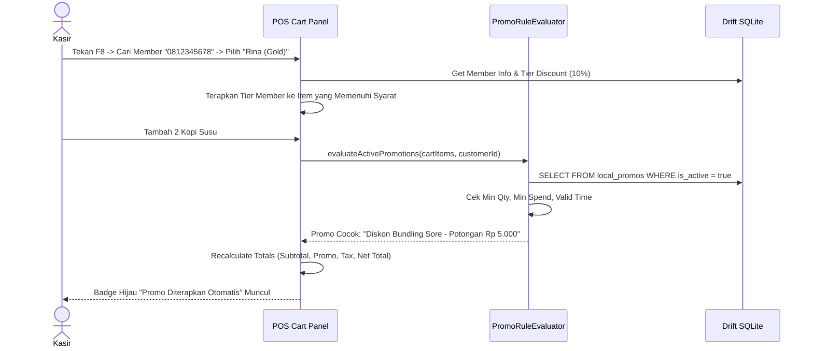

# PRD — Modul Transaksi & Penjualan - Channel POS App V1.4
## Desktop Keyboard Shortcuts, Automatic Promo & Customer Membership

## 1. Executive Summary & Bounded Context

Sub-modul **V1.4 Desktop Keyboard Shortcuts, Automatic Promo & Customer Membership** fokus pada akselerasi kecepatan kasir tingkat lanjut (*power user operations*), penerapan diskon promosi otomatis (*automatic promotion engine*), serta pengelolaan pelanggan dan diskon khusus anggota (*customer membership & loyalty*). Modul ini menjamin operasional kasir pada perangkat PC/Desktop dapat diselesaikan sepenuhnya menggunakan tombol papan ketik (*hotkeys*) tanpa menyentuh mouse, serta memberikan kalkulasi promo yang deterministik dan konsisten antara klien offline dan server backend.

### Kapabilitas Utama V1.4:
1. **Desktop Keyboard Hotkeys Standard (F1–F12, Esc, Space, Enter)**: Pemetaan pintasan tombol fisik untuk pencarian produk cepat, pengubahan kuantitas, penerapan diskon, hold/resume bill, hingga pembayaran uang pas.
2. **Automatic Promotion Evaluation Engine**: Evaluasi aturan promosi berbasis waktu, kuantitas (*Buy X Get Y*), atau nominal minimum keranjang belanja secara lokal di klien kasir tanpa latensi API.
3. **Manual Promo / Voucher Code**: Dukungan input kode kupon promo dengan validasi kuota lokal dan tanggal berlaku.
4. **Customer Membership Search & Selection**: Pencarian pelanggan berdasarkan nama, nomor telepon, atau pemindaian kartu member fisik (barcode/QR code).
5. **Member-Tier Price & Loyalty Points**: Penetapan harga khusus tier anggota (Regular, Gold, Platinum) serta kalkulasi perolehan poin loyalitas yang dicetak pada struk belanja.

---

## 2. Architecture & Domain Flow

```
Flutter Client (sollu_pos_client)
┌─────────────────────────────────┐
│ Hardware Keyboard Event Source  │
│ (Desktop RawKeyboardListener)   │
└────────────────┬────────────────┘
                 │ (Key Event: F1-F12, Esc, Space)
                 ▼
┌─────────────────────────────────┐
│ PosKeyBindings & FocusManager   │
│ (Intent-to-Action Dispatcher)   │
└────────────────┬────────────────┘
                 │
                 ▼
┌─────────────────────────────────┐
│ CartNotifier                    │
│ ├── Apply Member (Tier Price)   │<──Local Customers Cache (Drift DB)
│ └── PromoRuleEvaluator (Auto)   │<──Local Active Promos Cache (Drift DB)
└────────────────┬────────────────┘
                 │ (Calculated Cart with Applied Promos)
                 ▼
┌─────────────────────────────────┐
│ UI Live Cart & Receipt Summary  │
└─────────────────────────────────┘
```

---

## 3. Core Features & User Activity Use Cases

### 3.1. Fitur Utama

| Fitur | Deskripsi |
| :--- | :--- |
| **Desktop Hotkeys (F1–F12)** | Navigasi kasir menggunakan keyboard fisik tanpa membutuhkan klik mouse. |
| **Evaluasi Promo Otomatis** | Keranjang otomatis menerapkan diskon saat syarat kuantitas/nominal terpenuhi (misal: "Beli 2 Kopi Diskon Rp 5.000"). |
| **Input Voucher Diskon** | Modal input kode promo manual yang dapat dibuka cepat via pintasan `F3`. |
| **Pencarian & Pemilihan Member** | Pencarian instan anggota via nomor WhatsApp / pemindaian barcode member via `F8`. |
| **Diskon Khusus Tier Member** | Harga produk otomatis menyesuaikan dengan tier member (misal: Tier Gold diskon 10%). |
| **Estimasi Poin Reward** | Menghitung perolehan poin yang akan didapat pelanggan untuk ditampilkan di layar dan struk. |

### 3.2. Pemetaan Pintasan Keyboard Kasir Desktop (*Desktop Hotkeys*)

| Pintasan Keyboard | Aksi Operasional Kasir | Keterangan & Perilaku Sistem |
| :--- | :--- | :--- |
| `F1` | Panduan Pintasan (*Help*) | Menampilkan modal pop-up ringkasan seluruh tombol pintasan keyboard. |
| `F2` | Cari Produk / Barcode | Memindahkan fokus kursor langsung ke field pencarian item atau pemindaian barcode. |
| `F3` | Diskon / Kode Promo | Membuka modal input diskon manual (nominal Rp atau persentase %) atau voucher. |
| `F4` | Simpan Tagihan (*Hold Bill*) | Memarkir transaksi aktif saat ini ke daftar antrean tagihan yang ditahan. |
| `F5` | Buka Tagihan (*Resume Bill*) | Membuka daftar drawer transaksi yang ditahan (*Held Bills*) untuk dipilih kembali. |
| `F6` | Ubah Kuantitas (*Edit Qty*) | Membuka input jumlah kuantitas pada baris produk yang sedang disorot. |
| `F7` | Override Harga (*Open Price*) | Mengubah harga satuan item aktif (tunduk pada proteksi PIN jika diaktifkan). |
| `F8` | Pilih Pelanggan / Member | Membuka pemilihan pelanggan atau input catatan pesanan / nomor meja. |
| `F9` | Kas Laci (*Cash Management*) | Membuka modal kas laci untuk pencatatan Cash In atau Cash Out. |
| `F10` / `Space` | Bayar Uang Pas (*Exact Cash*) | Langsung memproses pembayaran tunai dengan nominal tepat tanpa pop-up kembalian. |
| `F12` / `Enter` | Buka Dialog Pembayaran | Membuka modal checkout untuk memilih metode bayar atau input uang tunai. |
| `Delete` / `Backspace` | Hapus Item Keranjang | Menghapus baris produk yang sedang dipilih dari keranjang belanja. |
| `Esc` | Batalkan / Tutup Pop-up | Menutup modal/dialog aktif, atau membatalkan seluruh keranjang (dengan konfirmasi). |
| `Panah Atas / Bawah` | Navigasi Keranjang | Memindahkan sorotan item produk yang aktif di dalam keranjang belanja. |

### 3.3. Skenario Aktivitas Pengguna (Use Cases)

```
┌────────────────────────────────────────────────────────────────────────────────────────────────────────┐
│ Skenario Pengguna POS V1.4                                                                             │
├──────────────────────────────┬──────────────────────────────┬──────────────────────────────────────────┤
│ Use Case                     │ Kondisi & Perangkat          │ Respon & Output Sistem                   │
├──────────────────────────────┼──────────────────────────────┼──────────────────────────────────────────┤
│ 1. Transaksi Kilat Keyboard  │ PC Kasir / Keyboard Fisik    │ Kasir tekan F2 (cari barang), F6 (qty 2),│
│    (Full Hotkey Checkout)    │ Pelanggan bayar uang pas     │ F10 (bayar pas), Enter. Selesai < 3 dtk. │
├──────────────────────────────┼──────────────────────────────┼──────────────────────────────────────────┤
│ 2. Penerapan Promo Otomatis  │ Pelanggan beli 3 Kopi Aren   │ Sistem mendeteksi aturan promo "Beli 3   │
│    (Auto Bundle Discount)    │ Total keranjang memenuhi     │ Diskon 15%". Diskon terpotong otomatis.  │
├──────────────────────────────┼──────────────────────────────┼──────────────────────────────────────────┤
│ 3. Pindai Kartu Member       │ Pelanggan tunjukkan QR member│ Scanner tembak QR, nama "Rina (Gold)"    │
│    (Attach Customer Member)  │ Kasir tekan F8               │ muncul di keranjang, harga tier aktif.   │
├──────────────────────────────┼──────────────────────────────┼──────────────────────────────────────────┤
│ 4. Input Voucher Manual      │ Pelanggan sebut kode promo   │ Kasir tekan F3, ketik "HEMAT10", sistem  │
│    (Coupon Code Apply)       │ Kode: "HEMAT10"              │ validasi dan potong diskon Rp 10.000.    │
└──────────────────────────────┴──────────────────────────────┴──────────────────────────────────────────┘
```

---

## 4. User Flow & Sequence Diagrams

### 4.1. Alur Evaluasi Promo Otomatis & Member Discount



---

## 5. Technical Architecture & File Structure

### 5.1. File Structure Klien Flutter (`sollu_pos_client`)

```
lib/features/
├── pos/
│   ├── presentation/
│   │   ├── shortcuts/
│   │   │   ├── pos_key_bindings.dart            # Pemetaan F1-F12, Esc, Space, Enter
│   │   │   └── pos_actions.dart                 # Intent actions handler
│   │   └── widgets/
│   │       ├── keyboard_shortcuts_modal.dart    # Pop-up bantuan cheat-sheet F1
│   │       └── promo_badge_widget.dart          # Indikator promo pada baris item
├── promo/
│   ├── domain/
│   │   ├── entities/
│   │   │   └── promo_rule_entity.dart
│   │   └── services/
│   │       └── promo_rule_evaluator.dart        # Engine kalkulasi diskon lokal
│   └── data/
│       ├── database/
│       │   └── local_promos.dart                # Tabel cache promo aktif di Drift
│       └── daos/
│           └── promo_dao.dart
└── customer/
    ├── presentation/
    │   ├── controllers/
    │   │   └── customer_selection_controller.dart
    │   └── screens/
    │       └── customer_selection_modal.dart    # Modal pencarian pelanggan (F8)
    └── data/
        ├── database/
        │   └── local_customers.dart             # Tabel pelanggan lokal di Drift
        └── daos/
            └── customer_dao.dart
```

### 5.2. File Structure Backend Laravel 12 (`sollu-app`)

```
app/
├── Http/
│   └── Controllers/API/POS/
│       ├── PosPromoController.php               # Daftar promo aktif untuk initial-data
│       └── PosCustomerController.php            # Pencarian customer online jika tidak ada di lokal
├── Models/
│   ├── Promo.php                                # Model Promo universal
│   └── Customer.php                             # Model Pelanggan & Member
└── Services/
    └── Promo/
        └── PromoCalculationService.php          # Verifikasi kalkulasi promo di server
```

---

## 6. Database Schema & Data Models

### 6.1. Schema Drift SQLite (Client)

```dart
class LocalPromos extends Table {
  TextColumn get id => text()();
  TextColumn get name => text()();
  TextColumn get promoType => text()(); // percentage, fixed_amount, buy_x_get_y
  RealColumn get discountValue => real()();
  RealColumn get minSpend => real().withDefault(const Constant(0.0))();
  RealColumn get minQty => real().withDefault(const Constant(0.0))();
  DateTimeColumn get startDate => dateTime()();
  DateTimeColumn get endDate => dateTime()();
  BoolColumn get isActive => boolean().withDefault(const Constant(true))();

  @override
  Set<Column> get primaryKey => {id};
}

class LocalCustomers extends Table {
  TextColumn get id => text()();
  TextColumn get name => text()();
  TextColumn get phone => text().nullable()();
  TextColumn get email => text().nullable()();
  TextColumn get memberTier => text().withDefault(const Constant('regular'))();
  RealColumn get loyaltyPoints => real().withDefault(const Constant(0.0))();

  @override
  Set<Column> get primaryKey => {id};
}
```

---

## 7. Single Source of Truth: Enums

```dart
enum PromoTypeEnum {
  percentage,
  fixedAmount,
  buyXGetY,
}

enum MemberTierEnum {
  regular,
  silver,
  gold,
  platinum,
}
```

---

## 8. Testing & Quality Assurance

- `test_keyboard_shortcut_f2_focuses_search_bar()`
- `test_keyboard_shortcut_f10_triggers_exact_cash_payment()`
- `test_promo_evaluator_applies_percentage_discount_correctly()`
- `test_promo_evaluator_ignores_expired_promos()`
- `test_customer_tier_discount_applied_to_eligible_items()`

---

## 9. Implementation Plan & Definition of Done

### Deliverables:
1. **Client**: Hotkey listener `PosKeyBindings`, promo calculation engine, modal bantuan `F1`, modal pemilihan member `F8`, cache tabel pelanggan & promo di Drift.
2. **Backend**: Integrasi daftar promo & pelanggan ke endpoint `GET /api/v1/pos/initial-data`.

### Definition of Done (DoD):
- Seluruh alur penjualan di PC kasir dapat diselesaikan tanpa mouse menggunakan keyboard hotkeys < 5 detik.
- Promo otomatis langsung diterapkan di keranjang saat syarat minimum belanja terpenuhi.
- Anggota member terhubung dengan benar dan diskon tier terhitung akurat.
