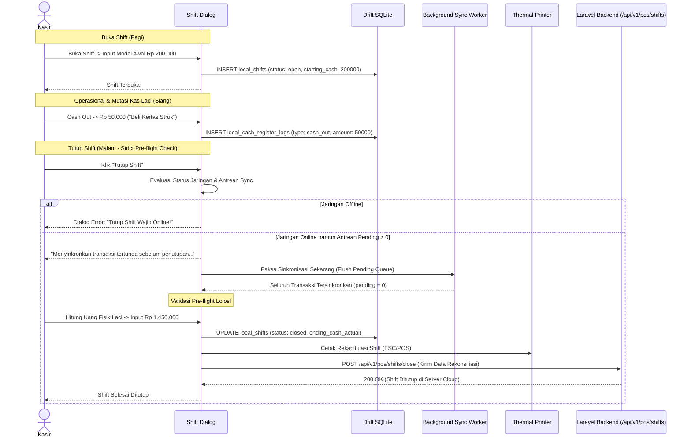

# PRD — Modul Transaksi & Penjualan - Channel POS App V1.5
## Shift Management, Cash Register Drawer & Strict Closing Reconciliation

## 1. Executive Summary & Bounded Context

Sub-modul **V1.5 Shift Management, Cash Register Drawer & Strict Closing Reconciliation** mengelola siklus operasional kasir harian (*daily cashier operations*), pembukuan uang modal awal laci kasir (*starting cash*), pencatatan mutasi kas masuk & kas keluar (*Cash In / Cash Out*), rekonsiliasi selisih uang fisik (*cash variance*), serta penegakan aturan integritas rekonsiliasi awan (*Strict Shift Close Guard*). Modul ini di-gate secara deterministik oleh lisensi paket bisnis tenant via **`FeatureEnum::SHIFT_MANAGEMENT`** dan **`FeatureEnum::CASH_DRAWER`**.

### Kapabilitas Utama V1.5:
1. **Fitur Shift Berbasis Lisensi Bisnis (`FeatureEnum::SHIFT_MANAGEMENT`)**: Modul shift hanya aktif jika paket bisnis memiliki fitur `shift_management`. Jika tidak aktif, kasir otomatis beroperasi dalam mode *Bypass Shift*.
2. **Fleksibilitas Bypass Shift Toko Kecil**: Outlet berlisensi tetap dapat mengaktifkan konfigurasi `bypass_shift_pos = true` jika operasional gerai tidak memerlukan pembagian giliran kerja kasir.
3. **Buka Shift (*Shift Open*)**: Pencatatan uang modal awal kasir (*starting cash*) sebelum kasir dapat memproses transaksi penjualan.
4. **Manajemen Laci Kas Berbasis Fitur (`FeatureEnum::CASH_DRAWER`)**: Mutasi kas masuk (*Cash In*) dan kas keluar operasional darurat (*Cash Out*) dapat dicatat secara offline ke Drift SQLite lokal dan disinkronkan saat terhubung ke server.
5. **Strict Shift Close Pre-flight Guard (Online & Zero Pending Sync Queue)**: Penutupan shift kasir **wajib dilakukan dalam kondisi ONLINE** dan sistem mewajibkan seluruh antrean transaksi lokal pada shift tersebut telah **100% tersinkronisasi ke cloud (`pending_sync == 0`)**. Jika offline atau ada antrean pending, sistem menahan penutupan shift demi menjamin akurasi rekonsiliasi kas di cloud.
6. **Rekonsiliasi Kas Fisik (*Cash Variance Calculation*)**: Perhitungan selisih kas otomatis antara hitungan uang fisik kasir (*actual cash*) dan ekspektasi sistem (*expected cash* = modal awal + penjualan tunai + cash in - cash out).
7. **Laporan Rekapitulasi Shift Thermal**: Pencetakan struk ringkasan shift (total penjualan per metode, mutasi kas, selisih) langsung ke printer termal saat shift resmi ditutup.

---

## 2. Architecture & Domain Flow

```
Flutter Client (sollu_pos_client)                     Laravel 12 Backend
┌─────────────────────────────────┐
│ Shift Open Dialog               │
│ (Input Starting Cash)           │
└────────────────┬────────────────┘
                 │
                 ▼
┌─────────────────────────────────┐
│ Drift DB: local_shifts          │
│ (status: open)                  │
└────────────────┬────────────────┘
                 │ (Cash In / Cash Out Offline-Supported)
                 ▼
┌─────────────────────────────────┐
│ Drift DB: local_cash_logs       │──Sync When Online──>│ POST /api/v1/pos/cash-registers/log│
└────────────────┬────────────────┘                     └────────────────────────────────────┘
                 │
                 ▼ (Cashier Clicks "Tutup Shift")
┌─────────────────────────────────┐
│ Strict Shift Close Pre-Flight   │
│ 1. Is Device Online?            │
│ 2. Is Pending Sync Queue == 0?  │
└────────────────┬────────────────┘
                 │
        ┌────────┴────────┐
   [NO: Blocked]     [YES: Allowed]
        │                 │
        ▼                 ▼
┌─────────────────┐ ┌─────────────────────────────────┐ ┌────────────────────────────────────┐
│ Error / Prompt: │ │ Calculate Cash Variance         │ │ POST /api/v1/pos/shifts/close      │
│ Flush Queue     │ │ UPDATE local_shifts (closed)    │─│ (Reconcile Shift in PostgreSQL)    │
└─────────────────┘ └────────────────┬────────────────┘ └────────────────────────────────────┘
                                     │
                                     ▼
                            ┌─────────────────┐
                            │ Print X/Z Report│
                            │ Thermal Printer │
                            └─────────────────┘
```

---

## 3. Core Features & User Activity Use Cases

### 3.1. Fitur Utama

| Fitur | Deskripsi |
| :--- | :--- |
| **Buka Shift (*Open Shift*)** | Input modal uang tunai awal di laci kasir (**Gated by `FeatureEnum::SHIFT_MANAGEMENT`**). |
| **Bypass Shift Mode** | Masuk langsung ke layar kasir tanpa shift jika diatur toko atau jika tenant tanpa lisensi shift. |
| **Kas Masuk (*Cash In*)** | Menambah uang tunai ke laci kas (misal: tambah uang kembalian) (**Gated by `FeatureEnum::CASH_DRAWER`**). |
| **Kas Keluar (*Cash Out*)** | Mengeluarkan kas laci untuk biaya operasional toko darurat (didukung pencatatan offline). |
| **Strict Tutup Shift Guard** | Memblokir tutup shift jika perangkat sedang offline atau masih ada transaksi pending di lokal. |
| **Rekonsiliasi & Selisih Kas** | Menghitung otomatis status kas: Seimbang (*Balanced*), Lebih (*Over*), atau Kurang (*Short*). |
| **Cetak Struk Rekap Shift** | Mencetak ringkasan penutupan shift ke printer kasir (Laporan Ringkasan Kas). |

### 3.2. Skenario Aktivitas Pengguna (Use Cases)

```
┌────────────────────────────────────────────────────────────────────────────────────────────────────────┐
│ Skenario Pengguna POS V1.5                                                                             │
├──────────────────────────────┬──────────────────────────────┬──────────────────────────────────────────┤
│ Use Case                     │ Kondisi & Perangkat          │ Respon & Output Sistem                   │
├──────────────────────────────┼──────────────────────────────┼──────────────────────────────────────────┤
│ 1. Buka Shift Pagi           │ Lisensi: shift_management    │ Kasir input modal Rp 200.000. Laci kasir │
│    (Open Shift Cashier)      │ Status shift sebelumnya tutup│ terbuka, shift berstatus 'open'.         │
├──────────────────────────────┼──────────────────────────────┼──────────────────────────────────────────┤
│ 2. Catat Kas Keluar Offline  │ Internet: Terputus (Offline) │ Kasir catat Rp 25.000 "Beli Galon Aqua". │
│    (Offline Cash Out)        │ Laci kasir aktif             │ Log kas tersimpan lokal, saldo terpotong.│
├──────────────────────────────┼──────────────────────────────┼──────────────────────────────────────────┤
│ 3. Percobaan Tutup Shift     │ Internet: Offline ATAU       │ Sistem tolak: "Tutup Shift Ditolak! Harap│
│    Gagal (Pending Queue > 0) │ Masih ada 3 transaksi pending│ hubungkan internet & sinkronkan antrean".│
├──────────────────────────────┼──────────────────────────────┼──────────────────────────────────────────┤
│ 4. Tutup Shift Sukses        │ Internet: Online             │ Sistem flush transaksi (antrean = 0).    │
│    (Strict Shift Close Pass) │ Antrean: 0 pending           │ Kasir input kas fisik, sistem hitung     │
│                              │ Akhir jam kerja kasir        │ selisih, cetak struk shift, sync server. │
└──────────────────────────────┴──────────────────────────────┴──────────────────────────────────────────┘
```

---

## 4. User Flow & Sequence Diagrams

### 4.1. Alur Siklus Shift & Validasi Ketat Penutupan Shift



---

## 5. Technical Architecture & File Structure

### 5.1. File Structure Klien Flutter (`sollu_pos_client`)

```
lib/features/shift/
├── presentation/
│   ├── controllers/
│   │   ├── shift_controller.dart                # Riverpod Notifier status shift aktif
│   │   └── cash_register_controller.dart        # Notifier Cash In / Cash Out
│   ├── screens/
│   │   ├── open_shift_dialog.dart               # Modal input starting cash
│   │   ├── close_shift_dialog.dart              # Modal input ending cash & selisih
│   │   └── cash_movement_dialog.dart            # Modal input Cash In / Cash Out (F9)
│   └── widgets/
│       ├── cash_summary_card.dart               # Tampilan ekspektasi kas berjalan
│       └── shift_receipt_preview.dart           # Preview cetak ringkasan shift
├── domain/
│   ├── entities/
│   │   ├── pos_shift_entity.dart
│   │   └── cash_log_entity.dart
│   └── usecases/
│       ├── open_shift_usecase.dart
│       ├── record_cash_movement_usecase.dart
│       └── close_shift_usecase.dart             # Berisi validasi online & pending queue = 0
└── data/
    ├── database/
    │   ├── tables/
    │   │   ├── local_shifts.dart
    │   │   └── local_cash_register_logs.dart
    │   └── daos/
    │       ├── shift_dao.dart
    │       └── cash_log_dao.dart
    └── remote/
        └── shift_api_service.dart
```

### 5.2. File Structure Backend Laravel 12 (`sollu-app`)

```
app/
├── Http/
│   ├── Controllers/API/POS/
│   │   ├── ShiftController.php                  # Buka & Tutup Shift Cloud
│   │   └── CashRegisterController.php           # Log Cash In / Cash Out
│   └── Requests/API/POS/
│       ├── OpenShiftRequest.php
│       ├── CloseShiftRequest.php
│       └── StoreCashRegisterLogRequest.php
├── Models/Sales/
│   ├── Shift.php
│   └── CashRegisterLog.php
└── Services/App/Transaction/
    └── PosShiftService.php                      # Hitung expected ending cash di server
```

### 5.3. Public API Contracts

#### 5.3.1. Endpoint Tutup Shift (`POST /api/v1/pos/shifts/close`)
- *Endpoint*: `POST /api/v1/pos/shifts/close`
- *Header*: `Authorization: Bearer <sanctum_device_token>`
- *Request Body*:
  ```json
  {
    "shift_id": "8a0deb4c-1b7d-4aad-9bee-1b0d7b3dcb1a",
    "ending_cash_actual": 1450000.0,
    "closed_at": "2026-10-01T22:00:00+07:00",
    "notes": "Shift malam selesai lancar, uang pas."
  }
  ```
- *Response (200 OK)*:
  ```json
  {
    "success": true,
    "data": {
      "shift_id": "8a0deb4c-1b7d-4aad-9bee-1b0d7b3dcb1a",
      "starting_cash": 200000.0,
      "total_sales_cash": 1300000.0,
      "total_sales_non_cash": 2500000.0,
      "total_cash_in": 0.0,
      "total_cash_out": 50000.0,
      "ending_cash_expected": 1450000.0,
      "ending_cash_actual": 1450000.0,
      "cash_variance": 0.0,
      "status": "closed"
    }
  }
  ```

---

## 6. Database Schema & Data Models

### 6.1. Schema PostgreSQL (Server)

```sql
CREATE TABLE shifts (
    id UUID PRIMARY KEY DEFAULT gen_random_uuid(),
    business_id UUID NOT NULL REFERENCES businesses(id) ON DELETE CASCADE,
    outlet_id UUID NOT NULL REFERENCES outlets(id) ON DELETE CASCADE,
    user_id UUID NOT NULL REFERENCES users(id) ON DELETE CASCADE,
    device_id UUID REFERENCES pos_devices(id) ON DELETE SET NULL,
    starting_cash DECIMAL(15,4) DEFAULT 0.0000,
    ending_cash_expected DECIMAL(15,4) DEFAULT 0.0000,
    ending_cash_actual DECIMAL(15,4) DEFAULT 0.0000,
    total_sales_cash DECIMAL(15,4) DEFAULT 0.0000,
    total_sales_non_cash DECIMAL(15,4) DEFAULT 0.0000,
    total_cash_in DECIMAL(15,4) DEFAULT 0.0000,
    total_cash_out DECIMAL(15,4) DEFAULT 0.0000,
    status VARCHAR(20) DEFAULT 'open', -- open, closed
    opened_at TIMESTAMP NOT NULL,
    closed_at TIMESTAMP NULL,
    created_at TIMESTAMP DEFAULT CURRENT_TIMESTAMP,
    updated_at TIMESTAMP DEFAULT CURRENT_TIMESTAMP
);
```

### 6.2. Schema Drift SQLite (Client)

```dart
class LocalShifts extends Table {
  TextColumn get id => text()();
  TextColumn get userId => text()();
  RealColumn get startingCash => real()();
  RealColumn get endingCashExpected => real().withDefault(const Constant(0.0))();
  RealColumn get endingCashActual => real().withDefault(const Constant(0.0))();
  TextColumn get status => text()(); // open, closed
  DateTimeColumn get openedAt => dateTime()();
  DateTimeColumn get closedAt => dateTime().nullable()();

  @override
  Set<Column> get primaryKey => {id};
}

class LocalCashRegisterLogs extends Table {
  TextColumn get id => text()();
  TextColumn get shiftId => text()();
  TextColumn get type => text()(); // cash_in, cash_out
  RealColumn get amount => real()();
  TextColumn get note => text().nullable()();
  TextColumn get syncStatus => text()(); // pending, synced
  DateTimeColumn get createdAt => dateTime()();

  @override
  Set<Column> get primaryKey => {id};
}
```

---

## 7. Single Source of Truth: Enums

```php
namespace App\Enums;

enum ShiftStatus: string {
    case OPEN = 'open';
    case CLOSED = 'closed';
}

enum CashRegisterTypeEnum: string {
    case CASH_IN = 'cash_in';
    case CASH_OUT = 'cash_out';
}
```

---

## 8. Testing & Quality Assurance

- `test_shift_open_persists_starting_cash()`
- `test_cash_out_records_locally_when_offline()`
- `test_shift_close_blocked_when_device_is_offline()`
- `test_shift_close_blocked_when_pending_sync_queue_exists()`
- `test_shift_close_succeeds_when_online_and_zero_pending_queue()`
- `test_cash_variance_calculated_accurately()`

---

## 9. Implementation Plan & Definition of Done

### Deliverables:
1. **Client**: Modal Buka/Tutup Shift, Modal Cash In/Out, Pre-flight Shift Close Guard, Struk Ringkasan Shift thermal ESC/POS.
2. **Backend**: Controller Shift & Cash Register, Service kalkulasi saldo ekspektasi kas di server.

### Definition of Done (DoD):
- Kasir dapat melakukan Cash In/Out saat offline tanpa hambatan.
- Tutup Shift terbukti diblokir jika perangkat sedang offline atau masih ada transaksi pending di lokal.
- Setelah online dan antrean 0, shift dapat ditutup resmi dan data selisih kas fisik tercatat sempurna di PostgreSQL cloud.
