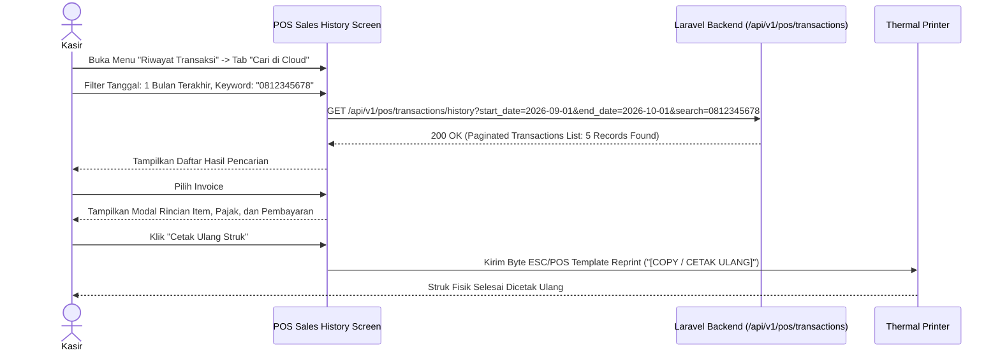

# PRD — Modul Transaksi & Penjualan - Channel POS App V1.6
## Sales History & Wide-Range Backend Transaction Search

## 1. Executive Summary & Bounded Context

Sub-modul **V1.6 Sales History & Wide-Range Backend Transaction Search** menyediakan kapabilitas audit, pelacakan, dan layanan purnajual (*after-sales service*) pada terminal kasir **Sollu POS Client**. Modul ini menjembatani keterbatasan ruang penyimpanan lokal perangkat kasir: transaksi hari berjalan dapat diakses instan dari SQLite lokal, sedangkan transaksi lampau dengan rentang tanggal yang luas (*wide-range historical search* seperti 30 hari hingga 1 tahun lalu) dapat dicari secara langsung ke server cloud backend **Laravel 12**.

### Kapabilitas Utama V1.6:
1. **Local Recent Transactions Drawer**: Melihat daftar transaksi shift aktif atau hari ini secara instan dari cache lokal Drift SQLite tanpa membutuhkan koneksi internet.
2. **Wide-Range Backend Search API (`GET /api/v1/pos/transactions/history`)**: Pencarian transaksi lama langsung ke server backend dengan filter nomor struk, rentang tanggal (30/60/90 hari), nama pelanggan, kasir yang bertugas, dan status transaksi.
3. **Detail Transaksi Komprehensif**: Menampilkan rincian lengkap item belanja, varian, diskon yang didapat, rincian pembayaran, serta status sinkronisasi.
4. **Cetak Ulang Struk (*Reprint Receipt*)**: Kemampuan mencetak ulang struk fisik ke printer termal dengan watermark/label penanda `[COPY / CETAK ULANG]`.
5. **Pembatalan Transaksi Kasir (*Void / Cancel Transaction*)**: Pembatalan transaksi yang keliru di tempat dengan otorisasi wajib PIN supervisor (jika proteksi PIN aktif) dan pengembalian saldo stok inventori secara otomatis.

---

## 2. Architecture & Domain Flow

```
Flutter Client (sollu_pos_client)                     Laravel 12 Backend
┌─────────────────────────────────┐
│ Sales History Screen            │
├─────────────────────────────────┤
│ Tab 1: Hari Ini (Lokal SQLite)  │───Query Local DB───> Drift DB: local_transactions
│ Tab 2: Cari Riwayat (Backend)   │───Online Query────> GET /api/v1/pos/transactions/history
└────────────────┬────────────────┘                     (Paginated wide-range search)
                 │
                 ▼
┌─────────────────────────────────┐
│ Transaction Detail Modal        │
├─────────────────────────────────┤
│ [ Cetak Ulang Struk (Reprint) ] │───ESC/POS Driver───> Hardware Thermal Printer
│ [ Batalkan Transaksi (Void) ]   │───Supervisor PIN───> POST /api/v1/pos/transactions/{id}/void
└─────────────────────────────────┘
```

---

## 3. Core Features & User Activity Use Cases

### 3.1. Fitur Utama

| Fitur | Deskripsi |
| :--- | :--- |
| **Riwayat Transaksi Lokal** | Menampilkan transaksi yang terjadi pada shift kasir saat ini secara instan. |
| **Pencarian Rentang Lebar (Cloud)** | Mencari transaksi bulan lalu menggunakan nomor invoice atau nomor telepon pelanggan. |
| **Cetak Ulang Struk (*Reprint*)** | Mencetak kembali struk transaksi yang telah selesai dengan penanda khusus. |
| **Void Transaksi di Kasir** | Membatalkan transaksi salah input, mewajibkan input alasan pembatalan dan verifikasi PIN supervisor. |
| **Auto Restock on Void** | Pembatalan transaksi otomatis mengembalikan saldo stok produk di server maupun cache lokal kasir. |

### 3.2. Skenario Aktivitas Pengguna (Use Cases)

```
┌────────────────────────────────────────────────────────────────────────────────────────────────────────┐
│ Skenario Pengguna POS V1.6                                                                             │
├──────────────────────────────┬──────────────────────────────┬──────────────────────────────────────────┤
│ Use Case                     │ Kondisi & Perangkat          │ Respon & Output Sistem                   │
├──────────────────────────────┼──────────────────────────────┼──────────────────────────────────────────┤
│ 1. Cetak Ulang Struk         │ Pelanggan minta struk kedua  │ Kasir buka Riwayat Hari Ini -> Pilih     │
│    (Reprint Recent Receipt)  │ Transaksi 10 menit lalu      │ Struk POS/001 -> Klik Cetak Ulang.       │
├──────────────────────────────┼──────────────────────────────┼──────────────────────────────────────────┤
│ 2. Cari Transaksi 2 Minggu   │ Pelanggan komplain pesanan   │ Kasir buka Tab Cari Cloud -> Filter Tgl  │
│    Lalu (Wide-Range Search)  │ Internet: Online             │ 15-20 Sep -> Ketik Nama "Budi". Transaksi│
│                              │                              │ ditemukan < 500ms lengkap dengan detail. │
├──────────────────────────────┼──────────────────────────────┼──────────────────────────────────────────┤
│ 3. Batalkan Transaksi (Void) │ Kasir salah input jumlah     │ Kasir klik "Void" -> Masukkan alasan ->  │
│    dengan Supervisor PIN     │ Proteksi PIN aktif           │ Supervisor input PIN -> Transaksi batal  │
│                              │                              │ dan stok kembali pulih.                  │
└──────────────────────────────┴──────────────────────────────┴──────────────────────────────────────────┘
```

---

## 4. User Flow & Sequence Diagrams

### 4.1. Alur Pencarian Riwayat Transaksi Lebar ke Backend



---

## 5. Technical Architecture & File Structure

### 5.1. File Structure Klien Flutter (`sollu_pos_client`)

```
lib/features/history/
├── presentation/
│   ├── controllers/
│   │   ├── local_history_controller.dart        # Notifier transaksi hari ini dari Drift
│   │   └── remote_history_controller.dart       # Notifier pencarian online ke backend
│   ├── screens/
│   │   ├── sales_history_screen.dart            # Layar utama riwayat (Tab Lokal & Cloud)
│   │   └── transaction_detail_sheet.dart        # Modal detail rincian transaksi
│   └── widgets/
│       ├── transaction_history_card.dart
│       └── date_range_filter_chips.dart         # Filter Hari Ini, Kemarin, 7 Hari, 30 Hari
├── domain/
│   ├── entities/
│   │   └── pos_history_item.dart
│   └── usecases/
│       ├── get_local_history_usecase.dart
│       ├── search_remote_transactions_usecase.dart
│       └── void_transaction_usecase.dart
└── data/
    └── remote/
        └── history_api_service.dart
```

### 5.2. File Structure Backend Laravel 12 (`sollu-app`)

```
app/
├── Http/
│   ├── Controllers/API/POS/
│   │   └── PosHistoryController.php             # GET /api/v1/pos/transactions/history & POST void
│   └── Resources/POS/
│       └── PosTransactionHistoryResource.php    # Resource lengkap transaksi
└── Services/App/Transaction/
    └── VoidTransactionService.php               # Reversal inventori & mutasi jurnal
```

### 5.3. Public API Contracts

#### 5.3.1. Endpoint Cari Riwayat Transaksi (`GET /api/v1/pos/transactions/history`)
- *Endpoint*: `GET /api/v1/pos/transactions/history`
- *Header*: `Authorization: Bearer <sanctum_device_token>`
- *Query Parameters*:
  - `start_date` (optional, `YYYY-MM-DD`)
  - `end_date` (optional, `YYYY-MM-DD`)
  - `search` (optional, nomor invoice atau nama/telepon pelanggan)
  - `page` (optional, default 1)
- *Response (200 OK)*:
  ```json
  {
    "success": true,
    "data": [
      {
        "id": "9b1deb4d-3b7d-4bad-9bdd-2b0d7b3dcb6d",
        "transaction_number": "POS/20260915/0042",
        "transaction_date": "2026-09-15T14:30:00+07:00",
        "cashier_name": "Budi Santoso",
        "customer_name": "Rina Wijaya",
        "total": 54000.0,
        "payment_method": "qris",
        "status": "completed",
        "items_count": 2
      }
    ],
    "meta": {
      "current_page": 1,
      "total_pages": 1,
      "total_records": 1
    }
  }
  ```

---

## 6. Testing & Quality Assurance

- `test_local_history_returns_today_records_instantly()`
- `test_remote_history_searches_by_date_range_and_keyword()`
- `test_reprint_receipt_adds_copy_watermark()`
- `test_void_transaction_reverses_stock_correctly()`
- `test_void_transaction_requires_supervisor_pin_when_enabled()`

---

## 7. Implementation Plan & Definition of Done

### Deliverables:
1. **Client**: Layar Riwayat Transaksi (Tab Lokal & Cloud), Filter Rentang Tanggal, Modal Detail Struk, Generator Cetak Ulang ESC/POS, Void Dialog.
2. **Backend**: Controller riwayat dengan query performa tinggi di PostgreSQL berindeks, Service Void Transaksi.

### Definition of Done (DoD):
- Kasir dapat melihat transaksi lokal hari ini tanpa koneksi internet.
- Pencarian data transaksi 90 hari lalu di backend mengembalikan hasil dalam waktu < 500ms.
- Struk yang dicetak ulang memiliki penanda jelas `[COPY / CETAK ULANG]`.
- Transaksi yang di-void mengembalikan saldo stok ke kondisi semula secara konsisten.
