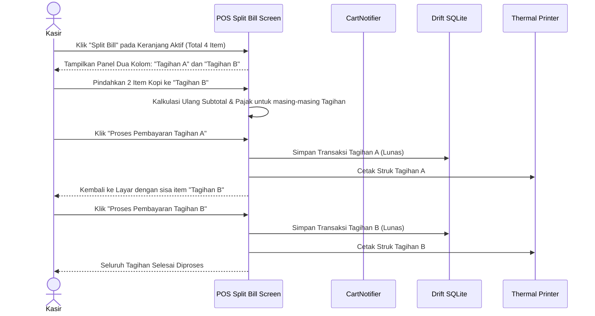

# PRD — Modul Transaksi & Penjualan - Channel POS App V1.7
## Split Bill & Multi-Payment Settlement

## 1. Executive Summary & Bounded Context

Sub-modul **V1.7 Split Bill & Multi-Payment Settlement** melengkapi kapabilitas operasional kasir ritel dan F&B pada **Sollu POS Client** dengan fleksibilitas penyelesaian pembayaran tingkat lanjut (*advanced payment settlement*). Modul ini menangani skenario dunia nyata di mana sekelompok pelanggan ingin memisahkan tagihan dalam satu meja/antrean (*Split Bill*) atau seorang pelanggan ingin membayar sebagian dengan uang tunai dan sisanya menggunakan metode non-tunai (QRIS / Kartu Debit).

### Kapabilitas Utama V1.7:
1. **Split Bill by Item (Pemisahan Berdasarkan Menu)**: Kasir dapat memindahkan sebagian item dari pesanan utama ke tagihan sub-bill baru untuk dibayar oleh pelanggan berbeda.
2. **Split Bill by Amount (Pemisahan Nominal Rata / Custom Nominal)**: Membagi total tagihan menjadi $N$ bagian sama rata (misal: 4 orang membagi tagihan Rp 200.000 menjadi @ Rp 50.000) atau nominal kustom.
3. **Multi-Payment Settlement**: Memproses satu transaksi menggunakan beberapa metode pembayaran sekaligus (contoh: Total Rp 75.000 dibayar Tunai Rp 25.000 dan QRIS Rp 50.000).
4. **Independent Receipt Printing per Sub-Bill**: Masing-masing sub-bill menghasilkan nomor struk unik dan mencetak struk fisiknya sendiri lengkap dengan rincian item yang dibayar.
5. **Universal Database Consistency**: Data sub-bill tersimpan secara konsisten di tabel universal `transactions` dan `transaction_payments` di backend Laravel tanpa duplikasi pemotongan stok.

---

## 2. Architecture & Domain Flow

```
Flutter Client (sollu_pos_client)
┌─────────────────────────────────┐
│ Active Cart / Held Bill         │
└────────────────┬────────────────┘
                 │ Klik "Pisah Tagihan (Split Bill)"
                 ▼
┌─────────────────────────────────┐
│ Split Bill Dialog Screen        │
├─────────────────────────────────┤
│ Mode A: Split by Item           │──Pilih Item──> Sub-Bill 1 (Lunas) -> Print Struk 1
│                                 │                Sub-Bill 2 (Lunas) -> Print Struk 2
│ Mode B: Split by Amount (Equal) │──Bagi 4 Orang─> Bayar Parsial 1..4
└────────────────┬────────────────┘
                 │
                 ▼ (Single Transaction with Multiple Payments)
┌─────────────────────────────────┐
│ Multi-Payment Checkout Engine   │
├─────────────────────────────────┤
│ Payment 1: Tunai Rp 25.000      │──> `transaction_payments` (cash)
│ Payment 2: QRIS Rp 50.000       │──> `transaction_payments` (qris)
└────────────────┬────────────────┘
                 │ (UUIDv4 Generated per Transaction)
                 ▼
┌─────────────────────────────────┐                     ┌────────────────────────────────────┐
│ Drift DB: local_transactions    │───Background Sync──>│ POST /api/v1/pos/transactions      │
│ (with multiple payment rows)    │                     │ (Universal Storage in PostgreSQL)  │
└─────────────────────────────────┘                     └────────────────────────────────────┘
```

---

## 3. Core Features & User Activity Use Cases

### 3.1. Fitur Utama

| Fitur | Deskripsi |
| :--- | :--- |
| **Pisah Tagihan Per Item (*Split by Item*)** | Memindahkan item atau porsi item dari keranjang aktif ke tagihan baru (*Sub-Bill*). |
| **Pisah Tagihan Rata (*Split by Amount*)** | Membagi total nilai transaksi menjadi 2 hingga 10 bagian sama rata. |
| **Multi-Metode Pembayaran** | Menerima kombinasi pembayaran tunai + QRIS + kartu dalam satu transaksi. |
| **Cetak Struk Terpisah** | Mencetak struk belanja individu untuk setiap pihak yang melakukan pembayaran terpisah. |
| **Validasi Saldo Pembayaran Penuh** | Tombol selesaikan transaksi terkunci sampai total pembayaran menutupi seluruh grand total. |

### 3.2. Skenario Aktivitas Pengguna (Use Cases)

```
┌────────────────────────────────────────────────────────────────────────────────────────────────────────┐
│ Skenario Pengguna POS V1.7                                                                             │
├──────────────────────────────┬──────────────────────────────┬──────────────────────────────────────────┤
│ Use Case                     │ Kondisi & Perangkat          │ Respon & Output Sistem                   │
├──────────────────────────────┼──────────────────────────────┼──────────────────────────────────────────┤
│ 1. Pisah Tagihan per Item    │ 2 Pelanggan makan di 1 meja  │ Kasir klik Split Item. Item A dipindah   │
│    (Split by Item Bill)      │ Masing-masing bayar sendiri  │ ke Bill 1 (dibayar tunai), Item B ke     │
│                              │                              │ Bill 2 (dibayar QRIS). Cetak 2 struk.    │
├──────────────────────────────┼──────────────────────────────┼──────────────────────────────────────────┤
│ 2. Bagi Rata Tagihan         │ 4 Teman kumpul bareng        │ Kasir klik Split Amount -> Pilih 4 Orang.│
│    (Split Equal Amount)      │ Total tagihan Rp 200.000     │ Muncul 4 antrean bayar @ Rp 50.000.      │
│                              │                              │ Masing-masing bayar sesuai metodenya.    │
├──────────────────────────────┼──────────────────────────────┼──────────────────────────────────────────┤
│ 3. Pembayaran Campuran       │ Pelanggan uang tunai kurang  │ Kasir input Tunai Rp 20.000. Sisa tagihan│
│    (Multi-Payment Split)     │ Total Rp 50.000              │ Rp 30.000 dipilih via QRIS. Lunas.       │
└──────────────────────────────┴──────────────────────────────┴──────────────────────────────────────────┘
```

---

## 4. User Flow & Sequence Diagrams

### 4.1. Alur Pemisahan Tagihan per Item (*Split Bill by Item*)



---

## 5. Technical Architecture & File Structure

### 5.1. File Structure Klien Flutter (`sollu_pos_client`)

```
lib/features/split_bill/
├── presentation/
│   ├── controllers/
│   │   ├── split_bill_controller.dart           # Notifier pembagian item & nominal
│   │   └── multi_payment_controller.dart        # Notifier multi-metode bayar
│   ├── screens/
│   │   ├── split_bill_screen.dart               # Layar interaktif split item (drag/move)
│   │   └── split_amount_modal.dart              # Pop-up bagi rata tagihan
│   └── widgets/
│       ├── sub_bill_column_widget.dart          # Komponen kolom tagihan pecahan
│       └── payment_split_row.dart               # Baris input nominal per metode bayar
├── domain/
│   ├── entities/
│   │   └── sub_bill_group.dart
│   └── usecases/
│       ├── split_bill_by_item_usecase.dart
│       └── settle_multi_payment_usecase.dart
└── data/
    └── daos/
        └── split_transaction_dao.dart
```

### 5.2. File Structure Backend Laravel 12 (`sollu-app`)

```
app/
├── Http/
│   └── Requests/API/POS/
│       └── StorePosTransactionRequest.php       # Array 'payments' menampung multi-metode
├── Models/Sales/
│   ├── Transaction.php
│   └── TransactionPayment.php                   # Menyimpan baris pembayaran ganda
└── Services/App/Transaction/
    └── TransactionService.php                   # Memvalidasi sum(payments.amount) == total
```

### 5.3. Public API Contract (Multi-Payment Payload)

```json
{
  "offline_id": "8a1deb4d-3b7d-4bad-9bdd-2b0d7b3dcb7a",
  "transaction_number": "POS/20261001/0088",
  "subtotal": 100000.0,
  "tax_amount": 11000.0,
  "total": 111000.0,
  "payment_status": "paid",
  "items": [
    {
      "product_id": "7b0deb4c-1b7d-4aad-9bee-1b0d7b3dcb2b",
      "qty": 4.0,
      "price": 25000.0,
      "subtotal": 100000.0
    }
  ],
  "payments": [
    {
      "payment_method": "cash",
      "amount": 50000.0,
      "reference_number": null
    },
    {
      "payment_method": "qris",
      "amount": 61000.0,
      "reference_number": "NMD-QRIS-99212"
    }
  ]
}
```

---

## 6. Database Schema & Data Models

Pada tabel `transaction_payments`, setiap pembayaran pecahan dicatat sebagai rekaman terpisah dengan `transaction_id` yang sama:

```sql
CREATE TABLE transaction_payments (
    id UUID PRIMARY KEY DEFAULT gen_random_uuid(),
    transaction_id UUID NOT NULL REFERENCES transactions(id) ON DELETE CASCADE,
    business_id UUID NOT NULL REFERENCES businesses(id) ON DELETE CASCADE,
    outlet_id UUID NOT NULL REFERENCES outlets(id) ON DELETE CASCADE,
    payment_method VARCHAR(50) NOT NULL, -- cash, qris, debit_card, transfer
    amount DECIMAL(15,4) NOT NULL,
    reference_number VARCHAR(100) NULL,
    created_at TIMESTAMP DEFAULT CURRENT_TIMESTAMP,
    updated_at TIMESTAMP DEFAULT CURRENT_TIMESTAMP
);
```

---

## 7. Testing & Quality Assurance

- `test_split_bill_by_item_calculates_proportional_tax()`
- `test_split_bill_by_amount_divides_equally_without_rounding_loss()`
- `test_multi_payment_rejects_submission_when_sum_is_less_than_total()`
- `test_multi_payment_records_multiple_payment_entries_in_db()`
- `test_each_sub_bill_prints_dedicated_receipt()`

---

## 8. Implementation Plan & Definition of Done

### Deliverables:
1. **Client**: Antarmuka Split Bill interaktif (Split by Item & Split by Amount), Modal multi-payment settlement, Generator struk sub-bill ESC/POS.
2. **Backend**: Dukungan array `payments` pada `StorePosTransactionRequest` dan validasi total pembayaran di `TransactionService`.

### Definition of Done (DoD):
- Kasir dapat memisahkan pesanan meja menjadi beberapa sub-bill dan memproses pembayarannya secara independen.
- Transaksi dengan metode pembayaran kombinasi (Tunai + QRIS) tercatat akurat di SQLite Drift dan tersinkronisasi sempurna ke PostgreSQL server.
- Struk belanja terpisah berhasil dicetak untuk masing-masing pembayar.
