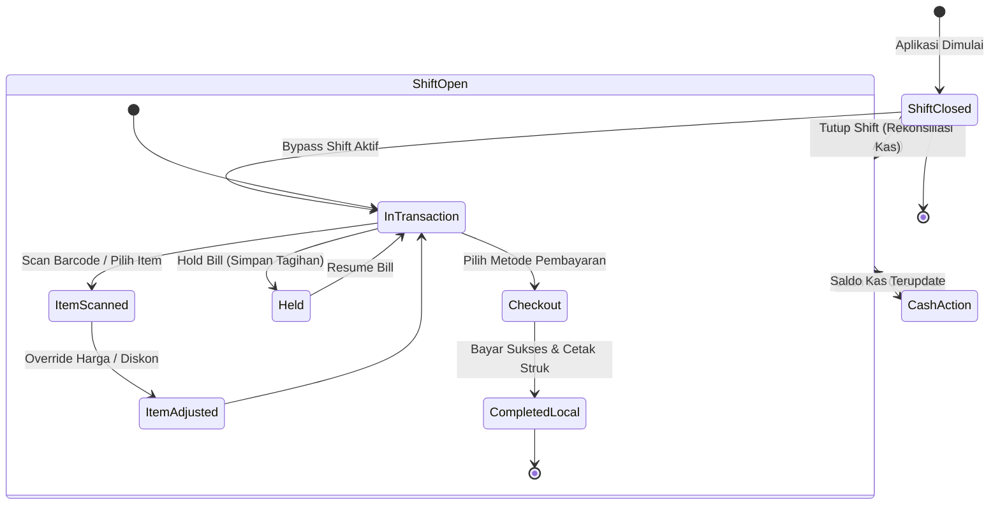
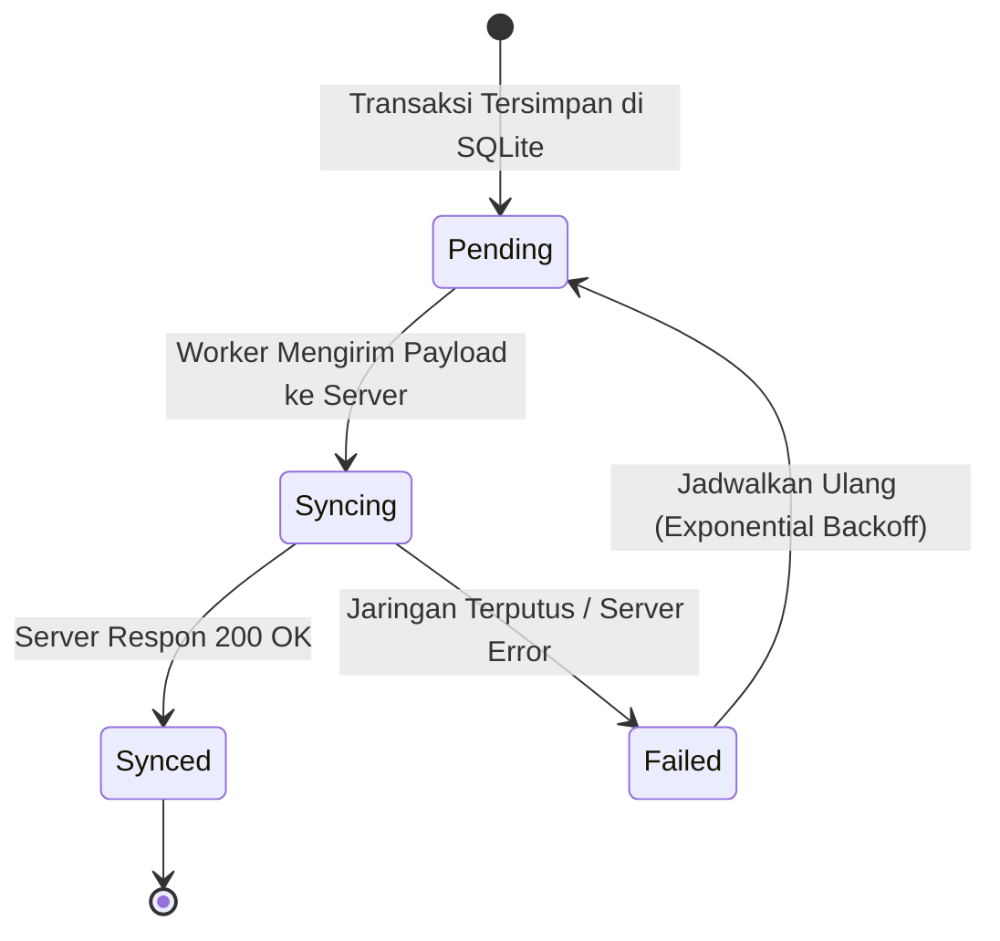
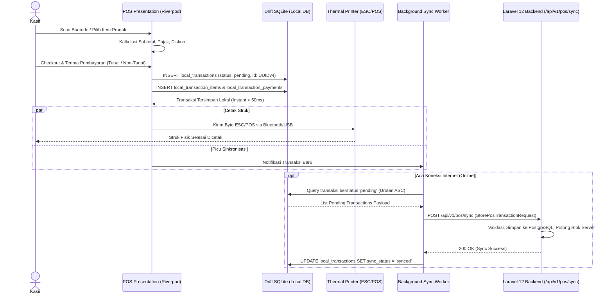
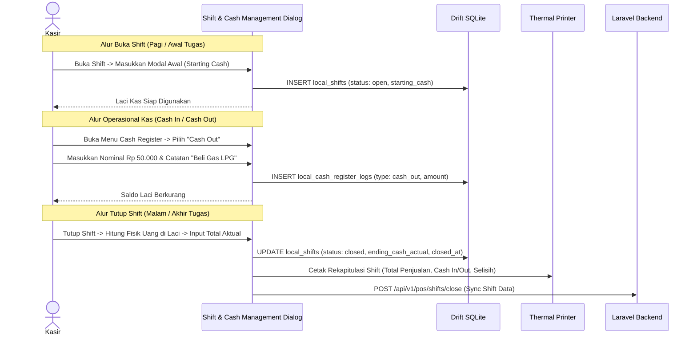
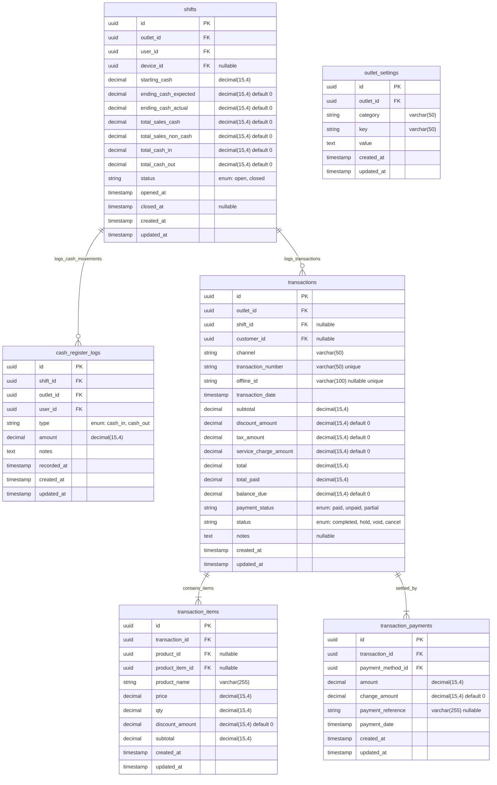

# PRD — Modul Transaksi & Penjualan - Channel POS App V1

## 1. Executive Summary & Bounded Context

Modul **Transaksi & Penjualan - Channel POS App (V1)** adalah _Bounded Context_ operasional garis depan (*frontline*) dalam ekosistem **Sollu App** yang bertanggung jawab atas seluruh aktivitas kasir ritel dan F&B langsung di *outlet*. Modul ini diwujudkan melalui aplikasi klien **Sollu POS Client** berbasis **Flutter (Dart 3)** yang terhubung secara asinkron ke *backend* **Laravel 12**. Dirancang untuk menangani transaksi berkecepatan tinggi, mobilitas tinggi, interaksi perangkat keras (*hardware*), serta memiliki ketahanan penuh terhadap gangguan jaringan internet (*zero-downtime offline-first*).

### Kapabilitas Utama V1:

1. **Arsitektur Offline-First Sejati (Drift / SQLite)**: Seluruh katalog produk, varian, pelanggan, pengaturan, dan transaksi tersimpan secara lokal. Kasir dapat memproses ribuan transaksi tanpa hambatan saat koneksi internet terputus.
2. **Background Queue Synchronization Engine**: Mesin antrean sinkronisasi latar belakang yang secara otomatis mengirimkan *payload* transaksi lokal secara berurutan (*FIFO*) ke *endpoint* API Laravel (`/api/v1/pos/sync`) saat perangkat kembali terhubung ke internet.
3. **Fleksibilitas Alur Shift (*Configurable Shift Workflow*)**: Mendukung mode **Kasir Tanpa Shift** (*Bypass Shift*) untuk usaha mikro/warung sederhana, maupun mode **Shift Ketat** dengan pencatatan modal awal (*starting cash*), saldo berjalan, dan rekonsiliasi kas akhir (*close shift*) untuk ritel/restoran.
4. **Manajemen Kas Laci (*Cash Management*)**: Pencatatan kas masuk (*Cash In* / penambahan modal kembalian) dan kas keluar (*Cash Out* / biaya operasional darurat) yang terhubung langsung ke saldo kasir berjalan.
5. **Operasional Kasir Cepat & Fleksibel**:
   - **Simpan & Buka Tagihan (*Hold & Resume Transaction / Save Bill*)**: Memarkir transaksi pelanggan yang menunda pembayaran agar antrean kasir tidak terhenti.
   - **Pembayaran Terpisah (*Split Bill*)**: Dukungan pemisahan pembayaran dalam satu transaksi penjualan.
   - **Override Harga (*Open Price*) & Diskon Kustom**: Kasir berwenang dapat mengubah nominal harga satuan atau memberikan diskon nominal/persentase langsung di keranjang belanja.
   - **Toleransi Stok Negatif (*Negative Stock Allowance*)**: Transaksi penjualan dapat diteruskan meskipun data stok di sistem sedang nol atau minus jika diizinkan oleh pengaturan *outlet*.
6. **Integrasi Perangkat Keras (*Native Hardware Bridge*)**: Koneksi langsung dengan *Thermal Receipt Printer* (Bluetooth & USB ESC/POS) dan *Barcode Scanner* (USB/Bluetooth HID).
7. **Keamanan Otorisasi PIN Lokal (*Local Supervisor PIN*)**: Proteksi tindakan kritis (seperti *Void*, *Override Price*, dan *Cash Out*) menggunakan verifikasi PIN supervisor secara lokal tanpa latensi API *network*.
8. **Skema Data Universal**: Seluruh transaksi POS bermuara pada tabel universal `transactions` di *backend* Laravel tanpa mewajibkan penerbitan entitas faktur `transaction_invoices`.

---

## 2. POS Client & Offline-First Sync Architecture

Pondasi arsitektur modul POS V1 mengadopsi **Clean Architecture** pada aplikasi klien Flutter dan sinkronisasi idempotensial ke *backend* Laravel:

```
Sollu POS Client (Flutter / Dart 3)
│
├── Presentation Layer (Riverpod State Management)
│   ├── POS Register & Catalog Screen (Grid / List / Barcode Scan)
│   ├── Cart State & Calculation Engine (Discount, Tax, Service Charge)
│   ├── Cash Drawer Modal (Cash In / Cash Out / Shift Overview)
│   └── Payment Dialog & Receipt Thermal Print Preview
│
├── Domain Layer (Clean Architecture UseCases & Entities)
│   ├── ProcessSaleUseCase & HoldTransactionUseCase
│   ├── OpenShiftUseCase & CloseShiftUseCase
│   ├── RecordCashMovementUseCase
│   └── SyncOfflineTransactionsUseCase
│
├── Data Layer (Drift SQLite & Remote Gateway)
│   ├── Local Database (Drift / SQLite with Sync Status Flags)
│   │   ├── `local_transactions` (Status: pending, synced, failed)
│   │   ├── `local_transaction_items` & `local_transaction_payments`
│   │   ├── `local_shifts` & `local_cash_register_logs`
│   │   └── `local_product_cache` & `local_outlet_settings`
│   ├── Background Sync Worker (Monotonic Queue + Retry Mechanism)
│   └── Remote API Client (Dio HTTP Client with Sanctum Auth & Interceptors)
│
└── Laravel 12 Backend (Cloud Server / REST API Gateway)
    ├── `/api/v1/pos/sync` (StorePosTransactionRequest)
    ├── Inventory Ledger Deduction (`inventory_movements`)
    └── PostgreSQL Universal Storage (`transactions`, `shifts`, `cash_register_logs`)
```

### Aturan Operasional & Resolusi Sinkronisasi (Sync Matrix):

- **Pre-Generated UUID**: Seluruh ID entitas lokal (`id`, `transaction_number`, `shift_id`) digenerasi menggunakan standard UUIDv4 pada perangkat Flutter sebelum transaksi disimpan ke SQLite lokal. Hal ini menjamin tidak adanya konflik ID (*ID collision*) saat proses sinkronisasi ke server PostgreSQL.
- **Prinsip Idempotensi Server**: Endpoint API backend mengevaluasi nomor transaksi atau `offline_id`. Jika *payload* yang sama terkirim ulang akibat gangguan jaringan (*network retry*), *server* mengembalikan respon sukses transaksi yang telah ada tanpa melakukan pemotongan stok ganda.
- **Urutan Sinkronisasi (*FIFO Queue*)**: Sinkronisasi data berjalan dengan urutan kronologis: Sinkronisasi Buka Shift $\rightarrow$ Transaksi Penjualan $\rightarrow$ Catatan Cash In/Out $\rightarrow$ Sinkronisasi Tutup Shift.

---

## 3. Core Features & Use Cases

### 3.1. Fitur Utama

| Fitur | Deskripsi |
| :--- | :--- |
| **Katalog & Quick Cart** | Antarmuka kasir cepat dengan pemindai *barcode*, pencarian instan, filter kategori, dan manajemen keranjang belanja. |
| **Offline-First Transaction Engine** | Pemrosesan checkout dan penyimpanan transaksi ke database lokal Drift SQLite secara instan tanpa bergantung koneksi internet. |
| **Manajemen Shift Kasir** | Pembukaan shift dengan modal awal (*starting cash*), pencatatan transaksi kasir, dan penutupan shift dengan rekonsiliasi kas fisik. |
| **Bypass Shift Mode** | Opsi konfigurasi *outlet* untuk menjalankan aplikasi POS secara langsung tanpa keharusan membuka atau menutup shift. |
| **Cash Management (Cash In / Out)** | Pencatatan arus kas operasional kasir (tambah modal kembalian atau pengeluaran kas kecil) dengan kolom alasan/keterangan. |
| **Operasional Cepat (Hold & Resume)** | Fitur simpan tagihan (*Save Bill*) untuk menunda transaksi pelanggan dan membukanya kembali kapan saja. |
| **Override Harga & Diskon Fleksibel** | Penyesuaian harga satuan di tempat (*open price*) serta diskon manual berupa persentase maupun nominal tunai. |
| **Thermal Printing Bridge** | Pencetakan struk belanja instan dan laporan ringkasan shift menggunakan printer termal 58mm/80mm via Bluetooth atau USB. |
| **Local PIN Security Guard** | Penguncian aksi supervisor (*Void*, ubah harga, hapus antrean) menggunakan verifikasi PIN lokal yang aman. |
| **Background Sync Service** | *Worker* sinkronisasi otomatis yang mendeteksi ketersediaan internet dan mengirimkan antrean data lokal ke *server*. |

### 3.2. Skenario Bisnis V1 (Use Cases)

```
┌────────────────────────────────────────────────────────────────────────────────────────────────────────┐
│ Skenario Bisnis POS V1                                                                                 │
├──────────────────────────────┬──────────────────────────────┬──────────────────────────────────────────┤
│ Use Case                     │ Kondisi & Perangkat          │ Respon & Output Sistem                   │
├──────────────────────────────┼──────────────────────────────┼──────────────────────────────────────────┤
│ 1. Penjualan Ritel Offline   │ Internet: Terputus (Offline) │ Transaksi tersimpan instan di Drift DB,  │
│    (Zero Latency Checkout)   │ Mode Shift: Aktif            │ Struk tercetak via Bluetooth Thermal,    │
│                              │ Pembayaran: Tunai (Lunas)    │ Status lokal: `pending_sync`.            │
├──────────────────────────────┼──────────────────────────────┼──────────────────────────────────────────┤
│ 2. Simpan Tagihan Sementara  │ Pelanggan menambah pesanan / │ Keranjang belanja disimpan ke tabel      │
│    (Hold & Resume Bill)      │ dompet tertinggal di mobil   │ `local_held_transactions`. Kasir bebas   │
│                              │                              │ melayani antrean pelanggan berikutnya.   │
├──────────────────────────────┼──────────────────────────────┼──────────────────────────────────────────┤
│ 3. Kasir Tanpa Shift         │ Setting Outlet:              │ Kasir langsung masuk ke katalog penjualan│
│    (Bypass Shift Toko Kecil) │ `bypass_shift_pos = true`    │ tanpa form modal awal. Transaksi dicatat │
│                              │                              │ tanpa relasi wajib ke `shift_id`.        │
├──────────────────────────────┼──────────────────────────────┼──────────────────────────────────────────┤
│ 4. Override Harga & Diskon   │ Pelanggan menawar produk /   │ Kasir memasukkan harga baru & diskon Rp, │
│    Manual Kasir              │ program diskon khusus toko   │ Sistem memvalidasi izin PIN supervisor,  │
│                              │                              │ Subtotal keranjang terhitung ulang.      │
├──────────────────────────────┼──────────────────────────────┼──────────────────────────────────────────┤
│ 5. Pengeluaran Kas Operasional│ Kasir membayar tagihan galon │ Kasir membuka menu Cash Out, isi nominal │
│    (Cash Out Laci)           │ air / parkir kurir logistik  │ Rp 25.000 + catatan. Saldo estimasi kas  │
│                              │                              │ pada shift kasir berkurang seketika.     │
├──────────────────────────────┼──────────────────────────────┼──────────────────────────────────────────┤
│ 6. Sinkronisasi Batch Pasca  │ Internet: Kembali Tersambung │ Sync Worker mendeteksi koneksi online,   │
│    Internet Pulih            │ Antrean: 50 Transaksi Offline│ Mengirim transaksi bertahap ke Laravel,  │
│                              │                              │ Status diupdate menjadi `synced`.        │
├──────────────────────────────┼──────────────────────────────┼──────────────────────────────────────────┤
│ 7. Tutup Shift & Rekonsiliasi│ Akhir jam operasional kasir  │ Kasir input kas aktual di laci, sistem   │
│    Selisih Kas Fisik         │ Shift ditutup resmi          │ hitung selisih (*variance*), cetak       │
│                              │                              │ Laporan Tutup Shift ke printer termal.   │
└──────────────────────────────┴──────────────────────────────┴──────────────────────────────────────────┘
```

---

## 4. User Flow & Status Lifecycle

### 4.1. Lifecycle Status Transaksi POS & Shift Kasir



#### Siklus Status Sinkronisasi Data Lokal (*Local Sync Status Lifecycle*):



- **`pending`**: Transaksi berhasil diproses di kasir dan tersimpan di database lokal. Menunggu giliran sinkronisasi.
- **`syncing`**: *Payload* transaksi sedang dalam proses transmisi HTTP ke *endpoint* API backend.
- **`synced`**: Transaksi telah diterima secara utuh oleh server Laravel, stok inventori server telah terpotong, dan data terverifikasi.
- **`failed`**: Gagal terkirim akibat kegagalan jaringan atau kesalahan format data. Masuk ke antrean coba ulang (*auto-retry*).

---

### 4.2. Alur Transaksi Kasir POS (Offline-First Flow)



---

### 4.3. Alur Manajemen Shift & Cash In/Out



---

## 5. Technical Architecture & Module Decoupling

Arsitektur modul POS terbagi secara tegas antara antarmuka klien Flutter dan backend Laravel 12:

### 5.1. Struktur Berkas Klien (Flutter - `sollu_pos_client`)

```
lib/
├── features/
│   ├── pos/
│   │   ├── presentation/
│   │   │   ├── controllers/         # Riverpod Notifiers (Cart, Shift, Catalog)
│   │   │   ├── screens/             # PosMainScreen, CatalogGrid, CartPanel
│   │   │   └── widgets/             # ReceiptDialog, QuickPayModal, DiscountDialog
│   │   ├── domain/
│   │   │   ├── entities/            # CartItem, PosTransaction, ShiftEntity
│   │   │   └── usecases/            # ProcessSaleUseCase, HoldTransactionUseCase
│   │   └── data/
│   │       ├── database/            # Drift Database Definitions (AppDatabase.dart)
│   │       │   ├── tables/          # LocalTransactions, LocalItems, LocalShifts
│   │       │   └── daos/            # TransactionDao, ShiftDao, CashLogDao
│   │       ├── sync/                # BackgroundSyncWorker, SyncQueueManager
│   │       └── remote/              # PosApiClient (Dio HTTP Client)
│   ├── hardware/
│   │   ├── printer/                 # ThermalPrinterService (ESC/POS Generator)
│   │   └── scanner/                 # BarcodeScannerBridge
│   └── auth/
│       └── presentation/            # SupervisorPinDialog, DeviceLoginScreen
```

### 5.2. Struktur Berkas Server (Laravel 12 Backend)

```
app/
├── Http/
│   ├── Controllers/API/POS/
│   │   ├── TransactionController.php        # Sync Endpoint (/api/v1/pos/sync)
│   │   ├── ShiftController.php              # POS Shift Sync & Reporting
│   │   ├── CashRegisterController.php       # Cash In / Cash Out Sync
│   │   └── PosConfigController.php          # Outlet Settings & Catalog Download
│   └── Requests/API/POS/
│       ├── StorePosTransactionRequest.php   # Validasi Payload Transaksi POS
│       ├── SyncShiftRequest.php             # Validasi Sinkronisasi Shift
│       └── StoreCashRegisterLogRequest.php  # Validasi Mutasi Kas Laci
├── Models/Sales/
│   ├── Transaction.php                      # Parent Universal Model
│   ├── TransactionItem.php                  # Detail Produk Terjual
│   ├── TransactionPayment.php               # Pembayaran Transaksi
│   ├── Shift.php                            # Rekap Shift Kasir
│   └── CashRegisterLog.php                  # Mutasi Kas In/Out
├── Services/App/Transaction/
│   ├── TransactionService.php               # Core Transaction & Stock Engine
│   └── PosShiftService.php                  # Perhitungan Selisih Kas & Rekap Shift
└── Enums/
    ├── TransactionStatus.php
    ├── TransactionPaymentStatus.php
    ├── ShiftStatus.php
    └── CashRegisterTypeEnum.php
```

### 5.3. Public API Contract (JSON Payload Sinkronisasi POS)

*Endpoint*: `POST /api/v1/pos/sync`

```json
{
  "offline_id": "9b1deb4d-3b7d-4bad-9bdd-2b0d7b3dcb6d",
  "transaction_number": "POS/20260930/0001",
  "shift_id": "8a0deb4c-1b7d-4aad-9bee-1b0d7b3dcb1a",
  "customer_id": null,
  "transaction_date": "2026-09-30T17:00:00+07:00",
  "subtotal": 100000.0000,
  "discount_amount": 10000.0000,
  "discount_type": "fixed",
  "discount_value": 10000.0000,
  "promo_name": "Diskon Member",
  "tax_amount": 9900.0000,
  "service_charge_amount": 0.0000,
  "total": 99900.0000,
  "payment_status": "paid",
  "status": "completed",
  "notes": "Pelanggan Meja 4",
  "items": [
    {
      "product_id": "7b0deb4c-1b7d-4aad-9bee-1b0d7b3dcb2b",
      "product_item_id": "6c0deb4c-1b7d-4aad-9bee-1b0d7b3dcb3c",
      "variant_group_option_id": null,
      "product_name": "Kopi Susu Gula Aren",
      "price": 25000.0000,
      "qty": 4.0000,
      "discount_amount": 0.0000,
      "subtotal": 100000.0000
    }
  ],
  "payments": [
    {
      "payment_method_id": "5a0deb4c-1b7d-4aad-9bee-1b0d7b3dcb4d",
      "amount": 100000.0000,
      "change_amount": 100.0000,
      "payment_reference": "TUNAI"
    }
  ]
}
```

---

## 6. Database Schema & Data Integrity

### 6.1. Entity Relationship Diagram (PostgreSQL Server)



---

### 6.2. Kamus Data (Data Dictionary)

#### Tabel `shifts` (Manajemen Shift Kasir)

| Nama Kolom | Tipe Data | Nullable | Default | Keterangan |
| :--- | :--- | :--- | :--- | :--- |
| `id` | UUID | No | `gen_random_uuid()` | Primary Key shift kasir. |
| `outlet_id` | UUID | No | - | Foreign Key ke `outlets.id`. |
| `user_id` | UUID | No | - | Foreign Key ke `users.id` (Kasir yang bertugas). |
| `device_id` | UUID | Yes | `NULL` | ID Perangkat POS terdaftar. |
| `starting_cash` | DECIMAL(15,4) | No | `0.0000` | Modal uang tunai awal di laci kasir. |
| `ending_cash_expected`| DECIMAL(15,4) | No | `0.0000` | Total ekspektasi saldo kas menurut sistem. |
| `ending_cash_actual`  | DECIMAL(15,4) | No | `0.0000` | Total hitungan fisik uang kasir saat tutup shift. |
| `total_sales_cash`    | DECIMAL(15,4) | No | `0.0000` | Total penjualan tunai selama shift. |
| `total_sales_non_cash`| DECIMAL(15,4) | No | `0.0000` | Total penjualan non-tunai (QRIS, Kartu, dll). |
| `total_cash_in`       | DECIMAL(15,4) | No | `0.0000` | Akumulasi penambahan kas (*Cash In*). |
| `total_cash_out`      | DECIMAL(15,4) | No | `0.0000` | Akumulasi pengeluaran kas (*Cash Out*). |
| `status`              | VARCHAR(20)   | No | `'open'`    | Enum: `open`, `closed`. |
| `opened_at`           | TIMESTAMP     | No | `now()`     | Waktu pembukaan shift. |
| `closed_at`           | TIMESTAMP     | Yes| `NULL`      | Waktu penutupan shift. |

#### Tabel `cash_register_logs` (Mutasi Kas Laci)

| Nama Kolom | Tipe Data | Nullable | Default | Keterangan |
| :--- | :--- | :--- | :--- | :--- |
| `id` | UUID | No | `gen_random_uuid()` | Primary Key log kas. |
| `shift_id` | UUID | No | - | Foreign Key ke `shifts.id`. |
| `outlet_id` | UUID | No | - | Foreign Key ke `outlets.id`. |
| `user_id` | UUID | No | - | User ID kasir pencatat. |
| `type` | VARCHAR(20) | No | - | Enum: `cash_in`, `cash_out`. |
| `amount` | DECIMAL(15,4) | No | - | Nominal penambahan/penarikan kas laci. |
| `notes` | TEXT | No | - | Alasan/keterangan mutasi kas. |
| `recorded_at` | TIMESTAMP | No | `now()` | Waktu transaksi kas lokal. |

#### Konfigurasi Outlet (`outlet_settings`) Terkait POS:

1. `bypass_shift_pos`: Boolean (`true` = kasir tidak diwajibkan buka shift).
2. `allow_override_price_pos`: Boolean (`true` = tombol ubah harga satuan di keranjang aktif).
3. `allow_custom_discount_pos`: Boolean (`true` = input diskon manual di keranjang aktif).
4. `allow_negative_stock_pos`: Boolean (`true` = penjualan tetap diizinkan saat stok habis).

---

### 6.3. Synchronization & Conflict Resolution Strategy

1. **Client-Side UUID Primary Key**: Perangkat POS klien membuat UUID independen. Server menerima UUID tersebut sebagai PK resmi sehingga tidak memerlukan mekanisme translasi mapping ID yang lambat.
2. **Deterministic Stock Ledger Deduction**: Pemotongan inventori di server dieksekusi berdasarkan timestamp riil transaksi (`transaction_date`), memastikan urutan pemotongan FIFO tetap akurat meskipun sinkronisasi tertunda berjam-jam.
3. **Queue Lock & Backoff Retry**: Jika permintaan sinkronisasi menerima kegagalan HTTP (contoh: 500 atau *connection timeout*), antrean terkunci sementara dan mencoba kembali secara eksponensial (5s, 15s, 30s, 60s) tanpa mengganggu interaksi UI kasir.

---

## 7. Single Source of Truth: PHP & Dart Enums

### 7.1. `TransactionStatus` (PHP & Dart)

```php
namespace App\Enums;

enum TransactionStatus: string
{
    case Completed = 'completed';
    case Hold = 'hold';
    case Void = 'void';
    case Cancel = 'cancel';
    case Paid = 'paid';

    public function label(): string
    {
        return match ($this) {
            self::Completed, self::Paid => 'Selesai / Lunas',
            self::Hold => 'Ditahan (Hold)',
            self::Void => 'Dibatalkan (Void)',
            self::Cancel => 'Batal',
        };
    }
}
```

```dart
// Dart Enum for Sollu POS Client
enum PosTransactionStatus {
  completed('completed', 'Selesai'),
  hold('hold', 'Ditahan'),
  voided('void', 'Void'),
  cancel('cancel', 'Batal');

  final String value;
  final String label;
  const PosTransactionStatus(this.value, this.label);
}
```

### 7.2. `ShiftStatus`

```php
namespace App\Enums;

enum ShiftStatus: string
{
    case Open = 'open';
    case Closed = 'closed';

    public function label(): string
    {
        return match ($this) {
            self::Open => 'Aktif (Buka)',
            self::Closed => 'Ditutup',
        };
    }
}
```

### 7.3. `CashRegisterTypeEnum`

```php
namespace App\Enums;

enum CashRegisterTypeEnum: string
{
    case CashIn = 'cash_in';
    case CashOut = 'cash_out';

    public function label(): string
    {
        return match ($this) {
            self::CashIn => 'Kas Masuk (Cash In)',
            self::CashOut => 'Kas Keluar (Cash Out)',
        };
    }
}
```

---

## 8. Dual-Layer Authorization & Device Security

Mengikuti **Rule 03**: Pemisahan otorisasi fitur SaaS dan keamanan operasional kasir:

```
┌────────────────────────────────────────────────────────────────────────┐
│ Dual-Layer Authorization & POS Device Security                         │
├─────────────────────┬───────────────────┬──────────────────────────────┤
│ Dimensi             │ Kasir / Device    │ Tenant SaaS Feature Plan     │
├─────────────────────┼───────────────────┼──────────────────────────────┤
│ Autentikasi Perangkat│ Laravel Sanctum   │ Business Plan Verification   │
│ Otorisasi Aksi Kritis│ Local Supervisor PIN│ FeatureEnum::POS           │
│ Directive / Guard   │ Local Pin Guard   │ v-feature / Middleware Guard │
│ Validasi Offline    │ Hash PIN di DB Lokal│ Lisensi Token Aktif        │
└─────────────────────┴───────────────────┴──────────────────────────────┘
```

### Matriks Hak Akses Kasir & Supervisor (POS Client)

| Aksi / Fitur Kasir | Kasir Standar | Outlet Supervisor | Catatan Keamanan |
| :--- | :---: | :---: | :--- |
| Scan & Checkout Transaksi | Ya | Ya | Operasional standar kasir. |
| Simpan Tagihan (*Hold Bill*) | Ya | Ya | Dapat dilakukan tanpa otorisasi tambahan. |
| Override Harga Satuan | Wajib PIN | Ya | Terkunci PIN jika `allow_override_price_pos = true`. |
| Diskon Kustom Bebas | Wajib PIN | Ya | Terkunci PIN jika `allow_custom_discount_pos = true`. |
| Kas Masuk (*Cash In*) | Ya | Ya | Wajib menyertakan keterangan. |
| Kas Keluar (*Cash Out*) | Wajib PIN | Ya | Proteksi penarikan uang laci kasir. |
| Batalkan Transaksi (*Void*) | Wajib PIN | Ya | Wajib input PIN dan alasan pembatalan. |
| Tutup Shift (*Close Shift*) | Ya | Ya | Kasir wajib menghitung uang fisik secara mandiri. |

---

## 9. Validasi & Error Handling

### 9.1. Aturan Validasi Request Sinkronisasi (`StorePosTransactionRequest`)

| Field | Aturan Validasi | Tindakan / Respon Error |
| :--- | :--- | :--- |
| `offline_id` | `nullable \| string \| max:100` | Digunakan untuk pemeriksaan idempotensi transaksi duplikat. |
| `transaction_number` | `nullable \| string \| max:50` | Nomor struk lokal kasir. |
| `shift_id` | `nullable \| uuid` | Jika tidak dikirim atau null, server mengikat transaksi ke shift terbuka saat ini. |
| `subtotal` | `required \| numeric \| min:0` | Ditolak 422 jika bernilai negatif. |
| `discount_amount` | `required \| numeric \| min:0` | Ditolak 422 jika bernilai negatif. |
| `tax_amount` | `required \| numeric \| min:0` | Ditolak 422 jika bernilai negatif. |
| `total` | `required \| numeric \| min:0` | Ditolak 422 jika bernilai negatif. |
| `items` | `required \| array \| min:1` | Transaksi wajib memuat minimal 1 baris item produk. |
| `items.*.product_name`| `required \| string` | Nama produk snapshot untuk cetak struk. |
| `items.*.qty` | `required \| numeric \| min:1` | Kuantitas item minimal 1 unit. |
| `items.*.price` | `required \| numeric \| min:0` | Harga satuan barang tidak boleh negatif. |
| `payments` | `nullable \| array` | Rincian metode pembayaran yang disetor pelanggan. |
| `payments.*.amount` | `required \| numeric \| min:0` | Nominal uang pembayaran yang diterima. |

### 9.2. Proteksi Operasional Kasir & State Guards

1. **Shift Guard Otomatis**: Jika setting `bypass_shift_pos = false`, aplikasi kasir mengunci akses ke keranjang belanja sampai kasir menyelesaikan form Buka Shift.
2. **Pencegahan Double Checkout**: Tombol pembayaran di UI dinonaktifkan seketika (*debounced loading state*) saat kasir menekan tombol "Bayar" untuk mencegah duplikasi pencatatan.
3. **Peringatan Stok Tipis / Habis**: Saat kasir memasukkan produk dengan stok $\le 0$, UI menampilkan badge kuning peringatan stok habis, namun tetap mengizinkan transaksi jika `allow_negative_stock_pos = true`.
4. **Idempotency Protection**: Jika terjadi *timeout* jaringan dan klien mencoba mengirim ulang *payload* transaksi yang sama, server mendeteksi `offline_id` dan merespon dengan data transaksi yang sudah tersimpan tanpa mutasi ganda.

---

## 10. POS UI & Hardware Interaction Standards

### 10.1. Layar Utama Kasir (*POS Register Screen*)

- **Tata Letak Adaptif**: Mendukung mode Tablet/Desktop Landscape (katalog produk di sisi kiri 65%, panel keranjang interaktif di sisi kanan 35%) dan Smartphone Portrait.
- **Header Ringkas**: Status jaringan (*Online / Offline Indicator*), status printer (*Connected / Disconnected*), tombol Buka/Tutup Shift, dan pencarian cepat.
- **Katalog Produk Cepat**:
  - Pilihan Tampilan: Grid Gambar atau List Kompak.
  - Tab Kategori Produk (*Category Chips*) dengan transisi halus.
  - Dukungan pemindaian instan via *Camera Scanner* atau *Hardware Scanner* fisik.
- **Panel Keranjang Belanja (*Live Cart*)**:
  - Daftar item dengan kontrol kuantitas (+ / - / input langsung).
  - Tombol aksi per item: Ubah Harga, Beri Diskon, Tambah Catatan Item (misal: "Sedikit Gula").
  - Tombol aksi bawah: **Tahan (*Hold*)**, **Batal (*Clear*)**, dan **Bayar (*Checkout*)** yang mencolok.

### 10.2. Pop-up Dialog & Modal Kasir

1. **Modal Pembayaran Cepat (*Quick Pay Modal*)**: Menampilkan total belanja, pilihan metode (Tunai, QRIS, Kartu Debit, Transfer), tombol pecahan uang pas (*Exact Cash*, 50rb, 100rb), serta kalkulator kembalian otomatis.
2. **Modal Simpan Tagihan (*Held Bills Drawer*)**: Daftar transaksi yang diparkir lengkap dengan jam simpan dan nama pelanggan untuk dilanjutkan kembali (*Resume*).
3. **Modal Cash Register (*Cash In / Cash Out*)**: Input cepat nominal kas, pilihan kategori mutasi, catatan alasan, dan tombol simpan instan.

### 10.3. Thermal Printing Template & Hardware Bridge

- Mendukung kertas termal ukuran **58mm (32 karakter/baris)** dan **80mm (48 karakter/baris)**.
- **Struktur Struk Standar (ESC/POS)**:
  1. Header: Nama Outlet, Alamat, Nomor Telepon, Nomor Struk/Invoice, Tanggal & Jam, Nama Kasir.
  2. Garis Pemisah (`--------------------------------`).
  3. Baris Item: Nama Produk, Qty x Harga Satuan, Diskon Item, Subtotal Baris.
  4. Garis Pemisah.
  5. Ringkasan Finansial: Subtotal, Diskon Dokumen, Pajak (PPN), Biaya Layanan, Grand Total.
  6. Rincian Pembayaran: Metode Bayar, Jumlah Bayar, Uang Kembalian.
  7. Footer: Pesan penutup kustom (contoh: "Terima kasih atas kunjungan Anda!").

---

## 11. Testing & Quality Assurance Strategy

Mengikuti **Rule 06** (*Pragmatic 5-Layer Testing Architecture*):

1. **Unit Tests (Flutter Drift & State Notifiers)**:
   - Pengujian kalkulasi subtotal keranjang belanja, diskon kustom, pajak, dan kembalian uang pada `CartNotifier`.
   - Pengujian operasi database lokal Drift SQLite (Insert transaksi lokal, query pending sync, update status sync).
2. **Feature Tests (Laravel Backend Sync API)**:
   - `test_pos_device_can_sync_completed_offline_transaction_successfully()`
   - `test_pos_sync_deducts_inventory_stock_correctly()`
   - `test_pos_sync_handles_idempotency_for_duplicate_offline_id()`
   - `test_pos_sync_auto_assigns_to_active_open_shift_when_shift_id_is_null()`
3. **Shift & Cash Register Feature Tests**:
   - `test_cashier_can_open_and_close_shift_with_cash_reconciliation()`
   - `test_cash_in_and_cash_out_movements_correctly_affect_expected_ending_cash()`
4. **Network Interruption & Recovery Integration Tests**:
   - Simulasi 100 transaksi dalam kondisi offline, disambung pemulihan jaringan, memastikan seluruh 100 transaksi tersinkronisasi tanpa ada data yang hilang atau urutan yang terbalik.
5. **Tenant & Outlet Isolation Tests**:
   - Memastikan perangkat POS Outlet A tidak dapat mengirim transaksi ke Outlet B atau mengakses data master dari Tenant lain.
