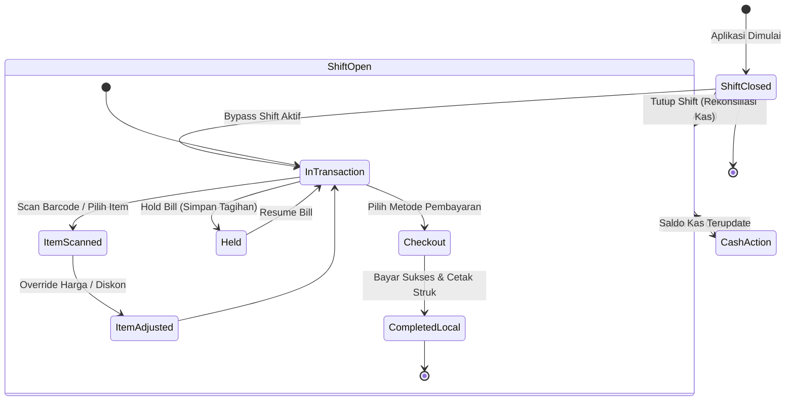
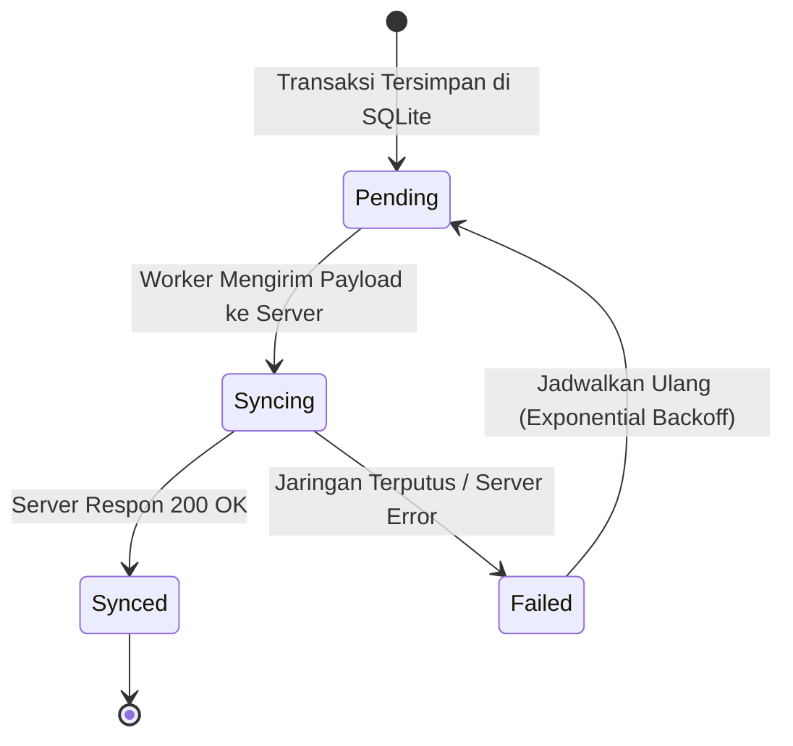
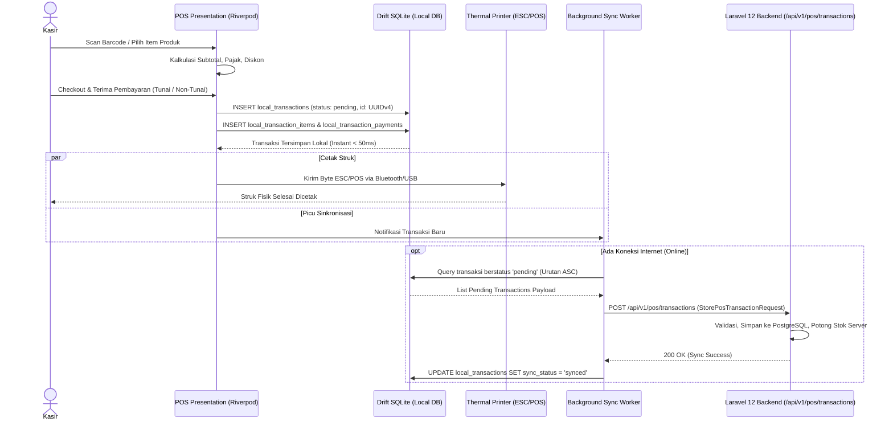
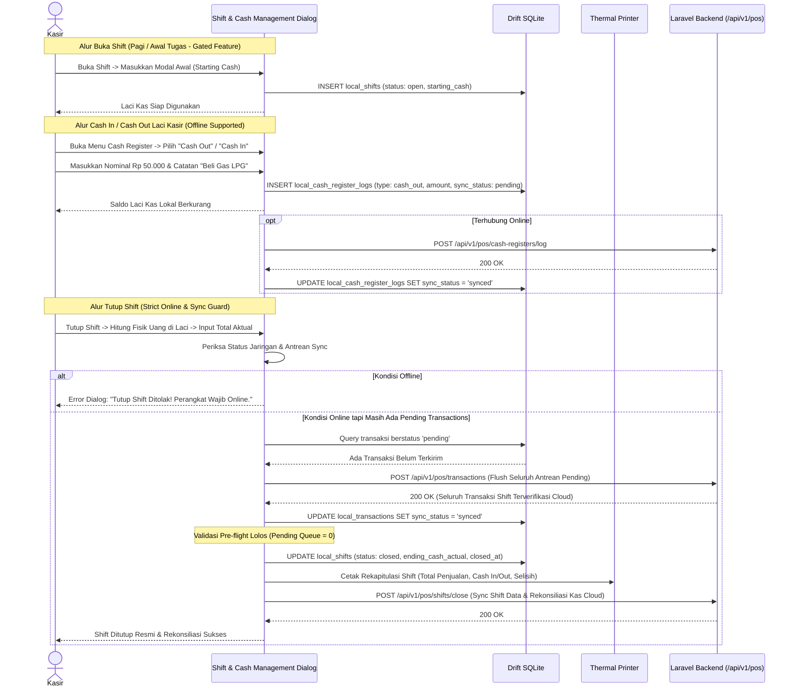
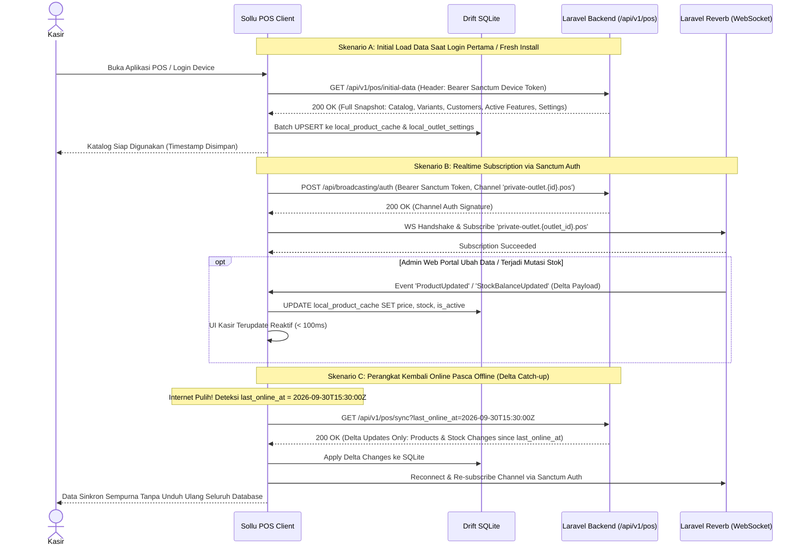
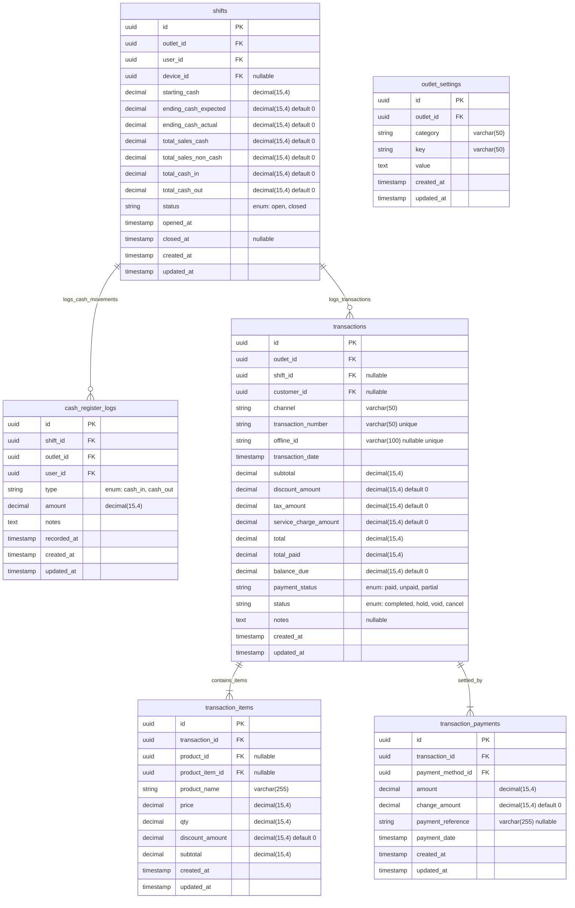

# PRD — Modul Transaksi & Penjualan - Channel POS App V1

## 1. Executive Summary & Bounded Context

Modul **Transaksi & Penjualan - Channel POS App (V1)** adalah _Bounded Context_ operasional garis depan (*frontline*) dalam ekosistem **Sollu App** yang bertanggung jawab atas seluruh aktivitas kasir ritel dan F&B langsung di *outlet*. Modul ini diwujudkan melalui aplikasi klien **Sollu POS Client** berbasis **Flutter (Dart 3)** yang terhubung secara asinkron ke *backend* **Laravel 12**. Dirancang untuk menangani transaksi berkecepatan tinggi, mobilitas tinggi, interaksi perangkat keras (*hardware*), serta memiliki ketahanan penuh terhadap gangguan jaringan internet (*zero-downtime offline-first*).

### Kapabilitas Utama V1:

1. **Arsitektur Offline-First Sejati (Drift / SQLite)**: Seluruh katalog produk, varian, pelanggan, pengaturan, dan transaksi tersimpan secara lokal. Kasir dapat memproses ribuan transaksi tanpa hambatan saat koneksi internet terputus.
2. **Sinkronisasi Hibrida (Separated Initial Load, Delta Sync, Dedicated Transaction API & Realtime Reverb)**:
   - **Initial Load Data (`GET /api/v1/pos/initial-data`)**: Endpoint khusus satu tanggung jawab (*single responsibility*) untuk mengunduh master snapshot awal secara menyeluruh (katalog produk, kategori, varian, pelanggan, daftar fitur bisnis aktif, dan konfigurasi outlet) saat inisialisasi aplikasi atau login pertama kali tanpa percabangan kondisi yang rumit.
   - **Reconnection Delta Sync (`GET /api/v1/pos/sync`)**: Endpoint khusus pemulihan saat perangkat kembali terhubung ke internet (*reconnected*) dengan mengirimkan query parameter `last_online_at` guna mengambil hanya data perubahan (*delta updates*) selama perangkat terputus, menjaga kode tetap ringkas dan mudah dirawat (*low-maintenance*).
   - **Dedicated Transaction Submission (`POST /api/v1/pos/transactions`)**: Pengiriman data transaksi penjualan lokal dikirimkan secara mandiri melalui antrean latar belakang (*Background Queue FIFO*) ke endpoint transaksi tersendiri.
   - **Realtime Master & Stock Updates (Laravel Reverb & Sanctum Auth)**: Pembaruan data produk, harga, dan mutasi stok inventori disiarkan secara seketika (*realtime*) melalui WebSocket **Laravel Reverb** yang terintegrasi langsung dengan **Laravel Sanctum Device Token** untuk otorisasi *private channel*, sehingga cache Drift lokal langsung terbarui tanpa perlu *full sync*.
3. **Fleksibilitas Alur Shift Berbasis Fitur Bisnis (*FeatureEnum::SHIFT_MANAGEMENT*)**:
   - Fitur shift kasir dikendalikan secara bertingkat: hanya aktif jika paket bisnis tenant memiliki fitur **`shift_management`** (`FeatureEnum::SHIFT_MANAGEMENT`).
   - Jika fitur tersedia pada bisnis, outlet dapat mengonfigurasi penggunaan mode **Shift Ketat** (modal awal, saldo berjalan, rekonsiliasi kas akhir) atau mode **Kasir Tanpa Shift** (*Bypass Shift*). Jika bisnis tidak memiliki fitur ini, aplikasi kasir otomatis berjalan dalam mode *Bypass Shift*.
4. **Manajemen Kas Laci Berbasis Fitur (*FeatureEnum::CASH_DRAWER*)**:
   - Modul kas laci (Cash In / Cash Out) hanya aktif jika paket bisnis tenant memiliki fitur **`cash_drawer`** (`FeatureEnum::CASH_DRAWER`). Kasir dapat mencatat mutasi kas masuk dan kas keluar operasional harian secara cepat.
5. **Aturan Ketat Tutup Shift (*Shift Close Guard: Online & Zero Pending Queue*)**:
   - Penutupan shift kasir (*Shift Close*) **wajib dilakukan dalam kondisi perangkat ONLINE**. Sebelum shift resmi ditutup dan uang kas direkonsiliasi, sistem memverifikasi bahwa seluruh data operasional shift tersebut (antrean transaksi penjualan, pembaruan shift, dan mutasi kas laci) telah **100% tersinkronisasi ke cloud** (*zero pending queue*). Jika masih ada antrean lokal atau perangkat offline, penutupan shift ditahan untuk mencegah diskrepansi rekonsiliasi kas dan selisih pembukuan.
6. **Operasional Kasir Cepat & Fleksibel**:
   - **Simpan & Buka Tagihan (*Hold & Resume Transaction / Save Bill*)**: Memarkir transaksi pelanggan yang menunda pembayaran agar antrean kasir tidak terhenti.
   - **Pembayaran Terpisah (*Split Bill*)**: Dukungan pemisahan pembayaran dalam satu transaksi penjualan.
   - **Override Harga (*Open Price*) & Diskon Kustom**: Kasir berwenang dapat mengubah nominal harga satuan atau memberikan diskon nominal/persentase langsung di keranjang belanja.
   - **Toleransi Stok Negatif (*Negative Stock Allowance*)**: Transaksi penjualan dapat diteruskan meskipun data stok di sistem sedang nol atau minus jika diizinkan oleh pengaturan *outlet*.
   - **Dukungan Pintasan Papan Ketik Desktop (*Desktop Keyboard Shortcuts*)**: Akselerasi operasional kasir pada perangkat PC/Desktop menggunakan tombol pintasan (*hotkeys* standar POS seperti F1–F12, Esc, Enter, Delete) untuk pencarian instan, ubah qty, hold/resume bill, hingga pembayaran uang pas tanpa menyentuh mouse.
7. **Integrasi Perangkat Keras (*Native Hardware Bridge*)**: Koneksi langsung dengan *Thermal Receipt Printer* (Bluetooth & USB ESC/POS) dan *Barcode Scanner* (USB/Bluetooth HID).
8. **Keamanan Otorisasi PIN Lokal Fleksibel (*Configurable Local Supervisor PIN*)**: Proteksi tindakan kritis (seperti *Void*, *Override Price*, dan *Cash Out*) menggunakan verifikasi PIN supervisor secara lokal tanpa latensi API *network*. Proteksi PIN ini **dapat diaktifkan atau dinonaktifkan secara fleksibel melalui pengaturan pada portal app** sesuai kebijakan keamanan outlet.
9. **Skema Data Universal**: Seluruh transaksi POS bermuara pada tabel universal `transactions` di *backend* Laravel tanpa mewajibkan penerbitan entitas faktur `transaction_invoices`.

---

## 2. POS Client & Offline-First Sync Architecture

Pondasi arsitektur modul POS V1 mengadopsi **Clean Architecture** pada aplikasi klien Flutter, sinkronisasi idempotensial ke *backend* Laravel, dan *realtime event streaming* via Laravel Reverb terintegrasi Sanctum:

```
Sollu POS Client (Flutter / Dart 3)
│
├── Presentation Layer (Riverpod State Management)
│   ├── POS Register & Catalog Screen (Grid / List / Barcode Scan)
│   ├── Desktop Keyboard Shortcuts Listener (Hotkeys F1-F12, Esc, Enter)
│   ├── Cart State & Calculation Engine (Discount, Tax, Service Charge)
│   ├── Cash Drawer Modal (Cash In / Cash Out Gated by FeatureEnum::CASH_DRAWER)
│   ├── Shift Close Dialog (Guarded by Online Status & Zero Pending Queue)
│   └── Payment Dialog & Receipt Thermal Print Preview
│
├── Domain Layer (Clean Architecture UseCases & Entities)
│   ├── ProcessSaleUseCase & HoldTransactionUseCase
│   ├── OpenShiftUseCase & CloseShiftUseCase (Guarded by Online & Sync Check, Gated by FeatureEnum::SHIFT_MANAGEMENT)
│   ├── RecordCashMovementUseCase (Gated by FeatureEnum::CASH_DRAWER)
│   ├── SyncOfflineTransactionsUseCase
│   └── HandleRealtimeCatalogUpdateUseCase
│
├── Data Layer (Drift SQLite, Remote Gateway & WebSocket)
│   ├── Local Database (Drift / SQLite with Sync Status Flags)
│   │   ├── `local_transactions` (Status: pending, synced, failed)
│   │   ├── `local_transaction_items` & `local_transaction_payments`
│   │   ├── `local_shifts` & `local_cash_register_logs`
│   │   └── `local_product_cache` & `local_outlet_settings`
│   ├── Background Sync Worker (Monotonic FIFO Queue + Retry Mechanism)
│   ├── Remote API Client (Dio HTTP Client with Sanctum Device Auth)
│   └── WebSocket Realtime Client (Laravel Echo / Reverb Client via Sanctum Auth)
│
└── Laravel 12 Backend (Cloud Server / REST API & Reverb Gateway)
    ├── `/api/v1/pos/initial-data` (Initial Master Snapshot & Active Business Features)
    ├── `/api/v1/pos/sync` (Dedicated Reconnection Delta Sync by last_online_at)
    ├── `/api/v1/pos/transactions` (Dedicated StorePosTransactionRequest)
    ├── `/api/v1/pos/shifts/close` (Shift Close Reconciliation Endpoint)
    ├── Laravel Reverb Gateway (Sanctum Auth Guard: private-outlet.{outlet_id}.pos)
    ├── Inventory Ledger Deduction (`inventory_movements`)
    └── PostgreSQL Universal Storage (`transactions`, `shifts`, `cash_register_logs`)
```

### Aturan Operasional & Resolusi Sinkronisasi (Sync Matrix):

- **Pemisahan Tegas Jalur Sinkronisasi**:
  1. **Initial Load Master Data (`GET /api/v1/pos/initial-data`)**:
     - Mengunduh paket data lengkap pertama kali saat login device: seluruh katalog produk, varian, kategori, pelanggan, shift aktif (jika fitur aktif), metode pembayaran, dan daftar `business_features` aktif (`shift_management`, `cash_drawer`).
     - Endpoint ini fokus pada pengiriman snapshot bersih tanpa perlu mengurai query parameter atau logika delta.
  2. **Reconnection Delta Sync (`GET /api/v1/pos/sync`)**:
     - Saat perangkat kembali online (*reconnected*) setelah terputus dari jaringan, perangkat memanggil endpoint ini dengan menyertakan query parameter wajib `last_online_at=<ISO-8601>`.
     - Server hanya mengembalikan rekaman data yang berubah setelah timestamp tersebut (*delta updates*), sehingga respon cepat, hemat bandwidth, dan tidak membebani server dengan query duplikat.
  3. **Dedicated Transaction Submission (`POST /api/v1/pos/transactions`)**: Transaksi penjualan yang tersimpan di SQLite lokal di-push ke endpoint transaksi khusus ini melalui *Background Sync Worker* secara FIFO.
  4. **Realtime Broadcast via Sanctum Authenticated WebSocket (Laravel Reverb)**: Aplikasi kasir melakukan *handshake* dan *subscribe* ke *private channel* `private-outlet.{outlet_id}.pos` menggunakan token autentikasi perangkat **Laravel Sanctum**. Perubahan produk, harga, dan mutasi stok seketika disiarkan oleh Reverb ke seluruh klien kasir aktif di outlet bersangkutan.
- **Pre-flight Cloud Sync Guard pada Tutup Shift (*Shift Close Guard*)**:
  - Tindakan *Tutup Shift* tidak diizinkan berjalan secara offline.
  - Saat kasir mengajukan *Tutup Shift*, sistem melakukan verifikasi: (1) Koneksi internet aktif, (2) Seluruh antrean transaksi hari itu berstatus `pending` di Drift SQLite berjumlah 0. Jika masih ada antrean, sistem melakukan sinkronisasi paksa (*instant flush*) terlebih dahulu. Jika gagal atau offline, aksi Tutup Shift ditahan demi integritas rekonsiliasi kas dan akurasi laporan selisih kas fisik di cloud.
- **Pre-Generated UUID**: Seluruh ID entitas lokal (`id`, `transaction_number`, `shift_id`) digenerasi menggunakan standard UUIDv4 pada perangkat Flutter sebelum transaksi disimpan ke SQLite lokal. Hal ini menjamin tidak adanya konflik ID (*ID collision*) saat proses sinkronisasi ke server PostgreSQL.
- **Prinsip Idempotensi Server**: Endpoint API backend mengevaluasi nomor transaksi atau `offline_id`. Jika *payload* yang sama terkirim ulang akibat gangguan jaringan (*network retry*), *server* mengembalikan respon sukses transaksi yang telah ada tanpa melakukan pemotongan stok ganda.
- **Urutan Sinkronisasi (*FIFO Queue*)**: Sinkronisasi data berjalan dengan urutan kronologis: Sinkronisasi Buka Shift $\rightarrow$ Transaksi Penjualan $\rightarrow$ Catatan Cash In/Out $\rightarrow$ Sinkronisasi Tutup Shift.

---

## 3. Core Features & Use Cases

### 3.1. Fitur Utama

| Fitur | Deskripsi |
| :--- | :--- |
| **Katalog & Quick Cart** | Antarmuka kasir cepat dengan pemindai *barcode*, pencarian instan, filter kategori, dan manajemen keranjang belanja. |
| **Offline-First Transaction Engine** | Pemrosesan checkout dan penyimpanan transaksi ke database lokal Drift SQLite secara instan tanpa bergantung koneksi internet. |
| **Initial Master Data Load** | Pengunduhan awal seluruh master data produk, kategori, pelanggan, setting, dan lisensi fitur bisnis via endpoint `GET /api/v1/pos/initial-data`. |
| **Reconnection Delta Sync** | Pengunduhan delta perubahan data pasca offline via endpoint `GET /api/v1/pos/sync?last_online_at=<timestamp>`. |
| **Dedicated Transaction Push** | Pengiriman data transaksi lokal ke server backend melalui endpoint khusus `POST /api/v1/pos/transactions` secara FIFO di background queue. |
| **Realtime Reverb Engine** | Sinkronisasi perubahan produk, harga, dan saldo stok inventori secara seketika melalui WebSocket Laravel Reverb tanpa intervensi kasir. |
| **Desktop Keyboard Shortcuts** | Akselerasi operasional kasir desktop menggunakan hotkeys standar industri (F1–F12, Esc, Enter, Delete, Space) untuk operasional serba cepat tanpa mouse. |
| **Manajemen Shift Kasir** | Pembukaan shift modal awal (*starting cash*), saldo berjalan, dan rekonsiliasi kas fisik. **Gated by `FeatureEnum::SHIFT_MANAGEMENT`**. Aksi Tutup Shift mewajibkan perangkat online dan seluruh antrean lokal tersinkronisasi penuh. |
| **Bypass Shift Mode** | Opsi berjalan tanpa shift jika diatur outlet atau jika bisnis tidak memiliki fitur `shift_management`. |
| **Cash Management (Cash In / Out)** | Arus kas masuk/keluar laci kasir (**Gated by `FeatureEnum::CASH_DRAWER`**). Dapat dicatat secara offline dan disinkronkan saat online. |
| **Operasional Cepat (Hold & Resume)** | Fitur simpan tagihan (*Save Bill*) untuk menunda transaksi pelanggan dan membukanya kembali kapan saja. |
| **Override Harga & Diskon Fleksibel** | Penyesuaian harga satuan di tempat (*open price*) serta diskon manual berupa persentase maupun nominal tunai. |
| **Thermal Printing Bridge** | Pencetakan struk belanja instan dan laporan ringkasan shift menggunakan printer termal 58mm/80mm via Bluetooth atau USB. |
| **Configurable PIN Security Guard** | Penguncian aksi supervisor (*Void*, ubah harga, cash out) dengan PIN lokal yang dapat diaktif/nonaktifkan via pengaturan portal app. |
| **Background Sync Service** | *Worker* sinkronisasi otomatis yang mendeteksi ketersediaan internet dan mengirimkan antrean transaksi lokal ke *server*. |

### 3.2. Skenario Bisnis V1 (Use Cases)

```
┌────────────────────────────────────────────────────────────────────────────────────────────────────────┐
│ Skenario Bisnis POS V1                                                                                 │
├──────────────────────────────┬──────────────────────────────┬──────────────────────────────────────────┤
│ Use Case                     │ Kondisi & Perangkat          │ Respon & Output Sistem                   │
├──────────────────────────────┼──────────────────────────────┼──────────────────────────────────────────┤
│ 1. Penjualan Ritel Offline   │ Internet: Terputus (Offline) │ Transaksi tersimpan instan di Drift DB,  │
│    (Zero Latency Checkout)   │ Mode Shift: Aktif            │ Struk tercetak via Bluetooth Thermal,    │
│                              │ Pembayaran: Tunai (Lunas)    │ Status lokal: `pending_sync`.            │
├──────────────────────────────┼──────────────────────────────┼──────────────────────────────────────────┤
│ 2. Simpan Tagihan Sementara  │ Pelanggan menambah pesanan / │ Keranjang belanja disimpan ke tabel      │
│    (Hold & Resume Bill)      │ dompet tertinggal di mobil   │ `local_held_transactions`. Kasir bebas   │
│                              │                              │ melayani antrean pelanggan berikutnya.   │
├──────────────────────────────┼──────────────────────────────┼──────────────────────────────────────────┤
│ 3. Kasir Tanpa Shift         │ Fitur: Tanpa shift_management│ Kasir langsung masuk ke katalog penjualan│
│    (Bypass Shift Toko Kecil) │ atau bypass_shift_pos = true │ tanpa form modal awal. Transaksi dicatat │
│                              │                              │ tanpa relasi wajib ke `shift_id`.        │
├──────────────────────────────┼──────────────────────────────┼──────────────────────────────────────────┤
│ 4. Override Harga & Diskon   │ Pelanggan menawar produk /   │ Kasir memasukkan harga baru & diskon Rp. │
│    Manual Kasir              │ Setting PIN: Aktif di Portal │ Sistem memvalidasi PIN supervisor lokal. │
│                              │                              │ (Jika PIN nonaktif, langsung diterapkan).│
├──────────────────────────────┼──────────────────────────────┼──────────────────────────────────────────┤
│ 5. Pengeluaran Kas Operasional│ Fitur cash_drawer aktif.     │ Kasir input nominal & catatan di laci.   │
│    (Cash Out Laci Kasir)     │ Kasir bayar biaya darurat/atk│ Tersimpan instan di Drift DB lokal.      │
│                              │ (Offline didukung)           │ Disinkronkan ke server saat online.      │
├──────────────────────────────┼──────────────────────────────┼──────────────────────────────────────────┤
│ 6. Sinkronisasi Batch Pasca  │ Internet: Kembali Tersambung │ Sync Worker mendeteksi koneksi online,   │
│    Internet Pulih            │ Antrean: 50 Transaksi Offline│ Mengirim transaksi ke /pos/transactions, │
│                              │                              │ Status diupdate menjadi `synced`.        │
├──────────────────────────────┼──────────────────────────────┼──────────────────────────────────────────┤
│ 7. Tutup Shift & Rekonsiliasi│ Akhir jam operasional kasir  │ Pre-flight check: Wajib ONLINE & antrean │
│    Selisih Kas Fisik         │ Shift ditutup resmi          │ sync = 0. Kasir input kas fisik, sistem  │
│    (Strict Shift Close Guard)│ Rekonsiliasi kas cloud       │ hitung selisih & cetak Laporan Shift.    │
├──────────────────────────────┼──────────────────────────────┼──────────────────────────────────────────┤
│ 8. Update Stok & Produk Live │ Internet: Terhubung (Online) │ Laravel Reverb WebSocket menyiarkan event│
│    (Realtime Reverb Stream)  │ Admin ubah harga di Portal   │ perubahan harga/stok, Drift DB terupdate │
│                              │                              │ seketika di kasir tanpa sinkronisasi.    │
├──────────────────────────────┼──────────────────────────────┼──────────────────────────────────────────┤
│ 9. Checkout Kilat Desktop    │ Perangkat PC / Desktop       │ Kasir tekan F2 (cari barang), F6 (qty),  │
│    (Keyboard Hotkeys)        │ Layar Kasir Aktif            │ Spasi/F10 (uang pas), Enter (cetak struk)│
│                              │                              │ selesai < 5 detik tanpa klik mouse.      │
└──────────────────────────────┴──────────────────────────────┴──────────────────────────────────────────┘
```

---

## 4. User Flow & Status Lifecycle

### 4.1. Lifecycle Status Transaksi POS & Shift Kasir



#### Siklus Status Sinkronisasi Data Lokal (*Local Sync Status Lifecycle*):



- **`pending`**: Transaksi berhasil diproses di kasir dan tersimpan di database lokal. Menunggu giliran sinkronisasi.
- **`syncing`**: *Payload* transaksi sedang dalam proses transmisi HTTP ke *endpoint* API backend.
- **`synced`**: Transaksi telah diterima secara utuh oleh server Laravel, stok inventori server telah terpotong, dan data terverifikasi.
- **`failed`**: Gagal terkirim akibat kegagalan jaringan atau kesalahan format data. Masuk ke antrean coba ulang (*auto-retry*).

---

### 4.2. Alur Transaksi Kasir POS (Offline-First Flow)



---

### 4.3. Alur Manajemen Shift & Cash In/Out (Strict Online Guard on Shift Close)

> [!IMPORTANT]
> - **Fitur Shift**: Hanya dapat diakses jika paket bisnis memiliki fitur `FeatureEnum::SHIFT_MANAGEMENT`.
> - **Fitur Cash Drawer**: Hanya dapat diakses jika paket bisnis memiliki fitur `FeatureEnum::CASH_DRAWER`.
> - **Aturan Mutlak Tutup Shift**: Kasir **wajib online** dan seluruh transaksi lokal hari itu harus **telah tersinkronisasi 100% ke cloud** sebelum penutupan shift dan rekonsiliasi kas dapat diproses di server.



---

### 4.4. Alur Initial Data Load, Reconnection Delta & Realtime Stream (Sanctum + Reverb)



---

## 5. Technical Architecture & Module Decoupling

Arsitektur modul POS terbagi secara tegas antara antarmuka klien Flutter dan backend Laravel 12:

### 5.1. Struktur Berkas Klien (Flutter - `sollu_pos_client`)

```
lib/
├── features/
│   ├── pos/
│   │   ├── presentation/
│   │   │   ├── controllers/         # Riverpod Notifiers (Cart, Shift, Catalog)
│   │   │   ├── screens/             # PosMainScreen, CatalogGrid, CartPanel
│   │   │   ├── shortcuts/           # PosKeyBindings (Desktop Hotkeys: F1-F12, Esc, Enter)
│   │   │   └── widgets/             # ReceiptDialog, QuickPayModal, DiscountDialog
│   │   ├── domain/
│   │   │   ├── entities/            # CartItem, PosTransaction, ShiftEntity
│   │   │   └── usecases/            # ProcessSaleUseCase, HoldTransactionUseCase
│   │   └── data/
│   │       ├── database/            # Drift Database Definitions (AppDatabase.dart)
│   │       │   ├── tables/          # LocalTransactions, LocalItems, LocalShifts
│   │       │   └── daos/            # TransactionDao, ShiftDao, CashLogDao
│   │       ├── sync/                # BackgroundSyncWorker, SyncQueueManager
│   │       ├── realtime/            # PosReverbClient (Laravel Echo / Reverb Listener via Sanctum)
│   │       └── remote/              # PosApiClient (Dio HTTP Client)
│   ├── hardware/
│   │   ├── printer/                 # ThermalPrinterService (ESC/POS Generator)
│   │   └── scanner/                 # BarcodeScannerBridge
│   └── auth/
│       └── presentation/            # SupervisorPinDialog, DeviceLoginScreen
```

### 5.2. Struktur Berkas Server (Laravel 12 Backend)

```
app/
├── Http/
│   ├── Controllers/API/POS/
│   │   ├── PosInitialDataController.php     # Initial Master Load (/api/v1/pos/initial-data)
│   │   ├── PosSyncController.php            # Reconnection Delta Sync (/api/v1/pos/sync)
│   │   ├── TransactionController.php        # Submit POS Transaction (/api/v1/pos/transactions)
│   │   ├── ShiftController.php              # POS Shift Sync & Reporting
│   │   ├── CashRegisterController.php       # Cash In / Cash Out Sync (Strict Online Guard)
│   │   └── PosConfigController.php          # Outlet Settings Management
│   └── Requests/API/POS/
│       ├── StorePosTransactionRequest.php   # Validasi Payload Transaksi POS
│       ├── SyncShiftRequest.php             # Validasi Sinkronisasi Shift
│       └── StoreCashRegisterLogRequest.php  # Validasi Mutasi Kas Laci
├── Events/POS/
│   ├── PosProductUpdatedEvent.php           # Broadcast Update Produk via Reverb
│   ├── PosStockBalanceUpdatedEvent.php      # Broadcast Mutasi Stok via Reverb
│   └── PosOutletSettingsUpdatedEvent.php    # Broadcast Update Pengaturan POS
├── Models/Sales/
│   ├── Transaction.php                      # Parent Universal Model
│   ├── TransactionItem.php                  # Detail Produk Terjual
│   ├── TransactionPayment.php               # Pembayaran Transaksi
│   ├── Shift.php                            # Rekap Shift Kasir
│   └── CashRegisterLog.php                  # Mutasi Kas In/Out
├── Services/App/Transaction/
│   ├── TransactionService.php               # Core Transaction & Stock Engine
│   └── PosShiftService.php                  # Perhitungan Selisih Kas & Rekap Shift
└── Enums/
    ├── FeatureEnum.php                      # SSOT SaaS Features (SHIFT_MANAGEMENT, CASH_DRAWER, dll)
    ├── TransactionStatus.php
    ├── TransactionPaymentStatus.php
    ├── ShiftStatus.php
    └── CashRegisterTypeEnum.php
```

### 5.3. Public API & Realtime Contracts

#### 5.3.1. Endpoint Pengiriman Transaksi Penjualan (*Dedicated Transaction API*)

*Endpoint*: `POST /api/v1/pos/transactions`

```json
{
  "offline_id": "9b1deb4d-3b7d-4bad-9bdd-2b0d7b3dcb6d",
  "transaction_number": "POS/20260930/0001",
  "shift_id": "8a0deb4c-1b7d-4aad-9bee-1b0d7b3dcb1a",
  "customer_id": null,
  "transaction_date": "2026-09-30T17:00:00+07:00",
  "subtotal": 100000.0000,
  "discount_amount": 10000.0000,
  "discount_type": "fixed",
  "discount_value": 10000.0000,
  "promo_name": "Diskon Member",
  "tax_amount": 9900.0000,
  "service_charge_amount": 0.0000,
  "total": 99900.0000,
  "payment_status": "paid",
  "status": "completed",
  "notes": "Pelanggan Meja 4",
  "items": [
    {
      "product_id": "7b0deb4c-1b7d-4aad-9bee-1b0d7b3dcb2b",
      "product_item_id": "6c0deb4c-1b7d-4aad-9bee-1b0d7b3dcb3c",
      "variant_group_option_id": null,
      "product_name": "Kopi Susu Gula Aren",
      "price": 25000.0000,
      "qty": 4.0000,
      "discount_amount": 0.0000,
      "subtotal": 100000.0000
    }
  ],
  "payments": [
    {
      "payment_method_id": "5a0deb4c-1b7d-4aad-9bee-1b0d7b3dcb4d",
      "amount": 100000.0000,
      "change_amount": 100.0000,
      "payment_reference": "TUNAI"
    }
  ]
}
```

#### 5.3.2. Endpoint Inisialisasi Master Data (*Initial Load Master Snapshot*)

*Endpoint*: `GET /api/v1/pos/initial-data`  
*Header Wajib*: `Authorization: Bearer <sanctum_device_token>`  
*Tujuan*: Mengunduh snapshot lengkap master data dan lisensi fitur paket tenant saat inisialisasi awal aplikasi atau login pertama kali tanpa parameter query rumit.

```json
{
  "success": true,
  "data": {
    "synced_at": "2026-09-30T17:00:00+07:00",
    "business_features": [
      "pos_cashier",
      "shift_management",
      "cash_drawer",
      "split_payment"
    ],
    "outlet_settings": {
      "bypass_shift_pos": false,
      "enable_supervisor_pin_pos": true,
      "allow_override_price_pos": true,
      "allow_custom_discount_pos": true,
      "allow_negative_stock_pos": false
    },
    "active_shift": {
      "id": "8a0deb4c-1b7d-4aad-9bee-1b0d7b3dcb1a",
      "user_id": "1a0deb4c-1b7d-4aad-9bee-1b0d7b3dcb99",
      "starting_cash": 150000.0000,
      "status": "open"
    },
    "payment_methods": [
      { "id": "5a0deb4c-1b7d-4aad-9bee-1b0d7b3dcb4d", "name": "Tunai", "type": "cash" },
      { "id": "4a0deb4c-1b7d-4aad-9bee-1b0d7b3dcb4e", "name": "QRIS", "type": "qris" }
    ],
    "products": [
      {
        "id": "7b0deb4c-1b7d-4aad-9bee-1b0d7b3dcb2b",
        "name": "Kopi Susu Gula Aren",
        "sku": "KOP-001",
        "barcode": "8992753123456",
        "category_id": "2b0deb4c-1b7d-4aad-9bee-1b0d7b3dcb11",
        "price": 25000.0000,
        "stock": 45.0000,
        "is_active": true
      }
    ]
  }
}
```

#### 5.3.3. Endpoint Sinkronisasi Delta Pemulihan (*Reconnection Delta Sync*)

*Endpoint*: `GET /api/v1/pos/sync`  
*Header Wajib*: `Authorization: Bearer <sanctum_device_token>`  
*Query Parameter*:
- `last_online_at` (**Required**, format `ISO-8601`): Waktu terakhir perangkat terhubung online sebelum terputus.

*Tujuan*: Hanya mengembalikan mutasi data yang terjadi sejak stempel waktu `last_online_at`.

```json
{
  "success": true,
  "data": {
    "synced_at": "2026-09-30T17:00:00+07:00",
    "updated_products": [
      {
        "id": "7b0deb4c-1b7d-4aad-9bee-1b0d7b3dcb2b",
        "name": "Kopi Susu Gula Aren",
        "price": 27000.0000,
        "stock": 40.0000,
        "is_active": true,
        "updated_at": "2026-09-30T16:45:00+07:00"
      }
    ],
    "deleted_product_ids": [],
    "updated_outlet_settings": {
      "enable_supervisor_pin_pos": false
    }
  }
}
```

#### 5.3.4. Kontrak WebSocket Realtime (Laravel Reverb & Sanctum Device Auth)

- **Channel**: `private-outlet.{outlet_id}.pos`
- **Autentikasi Channel**: Sanctum Device Token via Broadcast Auth Controller (`POST /api/broadcasting/auth`).
  ```php
  // routes/channels.php
  Broadcast::channel('outlet.{outletId}.pos', function ($user, $outletId) {
      return $user->tokenCan('pos:device') && (string)$user->outlet_id === (string)$outletId;
  }, ['guards' => ['sanctum']]);
  ```
- **Events & Payloads**:
  1. `PosProductUpdated` (`product.updated`):
     ```json
     {
       "product_id": "7b0deb4c-1b7d-4aad-9bee-1b0d7b3dcb2b",
       "name": "Kopi Susu Gula Aren",
       "price": 27000.0000,
       "is_active": true
     }
     ```
  2. `PosStockBalanceUpdated` (`stock.updated`):
     ```json
     {
       "product_id": "7b0deb4c-1b7d-4aad-9bee-1b0d7b3dcb2b",
       "new_balance": 40.0000,
       "reason": "movement_synced"
     }
     ```
  3. `PosOutletSettingsUpdated` (`settings.updated`):
     ```json
     {
       "enable_supervisor_pin_pos": false,
       "allow_negative_stock_pos": true
     }
     ```

---

## 6. Database Schema & Data Integrity

### 6.1. Entity Relationship Diagram (PostgreSQL Server)



---

### 6.2. Kamus Data (Data Dictionary)

#### Tabel `shifts` (Manajemen Shift Kasir)

| Nama Kolom | Tipe Data | Nullable | Default | Keterangan |
| :--- | :--- | :--- | :--- | :--- |
| `id` | UUID | No | `gen_random_uuid()` | Primary Key shift kasir. |
| `outlet_id` | UUID | No | - | Foreign Key ke `outlets.id`. |
| `user_id` | UUID | No | - | Foreign Key ke `users.id` (Kasir yang bertugas). |
| `device_id` | UUID | Yes | `NULL` | ID Perangkat POS terdaftar. |
| `starting_cash` | DECIMAL(15,4) | No | `0.0000` | Modal uang tunai awal di laci kasir. |
| `ending_cash_expected`| DECIMAL(15,4) | No | `0.0000` | Total ekspektasi saldo kas menurut sistem. |
| `ending_cash_actual`  | DECIMAL(15,4) | No | `0.0000` | Total hitungan fisik uang kasir saat tutup shift. |
| `total_sales_cash`    | DECIMAL(15,4) | No | `0.0000` | Total penjualan tunai selama shift. |
| `total_sales_non_cash`| DECIMAL(15,4) | No | `0.0000` | Total penjualan non-tunai (QRIS, Kartu, dll). |
| `total_cash_in`       | DECIMAL(15,4) | No | `0.0000` | Akumulasi penambahan kas (*Cash In*). |
| `total_cash_out`      | DECIMAL(15,4) | No | `0.0000` | Akumulasi pengeluaran kas (*Cash Out*). |
| `status`              | VARCHAR(20)   | No | `'open'`    | Enum: `open`, `closed`. |
| `opened_at`           | TIMESTAMP     | No | `now()`     | Waktu pembukaan shift. |
| `closed_at`           | TIMESTAMP     | Yes| `NULL`      | Waktu penutupan shift. |

#### Tabel `cash_register_logs` (Mutasi Kas Laci)

| Nama Kolom | Tipe Data | Nullable | Default | Keterangan |
| :--- | :--- | :--- | :--- | :--- |
| `id` | UUID | No | `gen_random_uuid()` | Primary Key log kas. |
| `shift_id` | UUID | No | - | Foreign Key ke `shifts.id`. |
| `outlet_id` | UUID | No | - | Foreign Key ke `outlets.id`. |
| `user_id` | UUID | No | - | User ID kasir pencatat. |
| `type` | VARCHAR(20) | No | - | Enum: `cash_in`, `cash_out`. |
| `amount` | DECIMAL(15,4) | No | - | Nominal penambahan/penarikan kas laci. |
| `notes` | TEXT | No | - | Alasan/keterangan mutasi kas. |
| `recorded_at` | TIMESTAMP | No | `now()` | Waktu transaksi kas lokal. |

#### Konfigurasi Outlet (`outlet_settings`) Terkait POS:

1. `bypass_shift_pos`: Boolean (`true` = kasir tidak diwajibkan buka shift).
2. `enable_supervisor_pin_pos`: Boolean (`true` = mewajibkan verifikasi PIN supervisor untuk aksi kritis; `false` = proteksi dinonaktifkan dan kasir dapat mengeksekusi langsung tanpa verifikasi PIN. Dikonfigurasi via Portal App).
3. `allow_override_price_pos`: Boolean (`true` = tombol ubah harga satuan di keranjang aktif).
4. `allow_custom_discount_pos`: Boolean (`true` = input diskon manual di keranjang aktif).
5. `allow_negative_stock_pos`: Boolean (`true` = penjualan tetap diizinkan saat stok habis).
6. `require_pin_for_void_pos`: Boolean (pengaturan granular verifikasi PIN khusus pembatalan/void).
7. `require_pin_for_cash_out_pos`: Boolean (pengaturan granular verifikasi PIN khusus penarikan kas laci).

---

### 6.3. Synchronization & Conflict Resolution Strategy

1. **Pemisahan Jalur Komunikasi Backend**:
   - **Bootstrap Awal (`GET /api/v1/pos/initial-data`)**: Mengunduh seluruh master data katalog produk, varian, pelanggan, shift aktif, konfigurasi outlet, dan daftar lisensi fitur bisnis (`business_features`) saat kasir login pertama kali.
   - **Sinkronisasi Pemulihan Delta (`GET /api/v1/pos/sync`)**: Endpoint khusus pemulihan pasca offline yang menerima parameter wajib `last_online_at` dan hanya mengembalikan rekaman yang termutasi.
   - **Pengiriman Transaksi (`POST /api/v1/pos/transactions`)**: Transaksi penjualan yang tersimpan di SQLite lokal dikirimkan secara asinkron melalui antrean FIFO ke endpoint khusus transaksi.
2. **Sinkronisasi Realtime via WebSocket (Laravel Reverb)**: Pembaruan katalog produk, harga, dan pergerakan saldo stok inventori dari portal app disiarkan secara instan ke channel `private-outlet.{outlet_id}.pos` sehingga aplikasi kasir yang online selalu memegang data mutakhir tanpa perlu memicu sinkronisasi ulang manual.
3. **Pre-flight Cloud Sync Guard pada Cash Out**: Kas laci tidak dapat dikeluarkan (*Cash Out*) saat perangkat offline atau masih memiliki transaksi pending di Drift SQLite. Sistem memvalidasi koneksi online dan memastikan seluruh data hari itu sudah terkirim ke server sebelum mencatat mutasi pengeluaran kas.
4. **Client-Side UUID Primary Key**: Perangkat POS klien membuat UUID independen (`id`, `transaction_number`, `shift_id`). Server menerima UUID tersebut sebagai PK resmi sehingga tidak memerlukan mekanisme translasi mapping ID yang lambat.
5. **Deterministic Stock Ledger Deduction**: Pemotongan inventori di server dieksekusi berdasarkan timestamp riil transaksi (`transaction_date`), memastikan urutan pemotongan FIFO tetap akurat meskipun sinkronisasi tertunda berjam-jam.
6. **Queue Lock & Backoff Retry**: Jika permintaan pengiriman transaksi menerima kegagalan HTTP (contoh: 500 atau *connection timeout*), antrean terkunci sementara dan mencoba kembali secara eksponensial (5s, 15s, 30s, 60s) tanpa mengganggu interaksi UI kasir.

---

## 7. Single Source of Truth: PHP & Dart Enums

### 7.1. `TransactionStatus` (PHP & Dart)

```php
namespace App\Enums;

enum TransactionStatus: string
{
    case Completed = 'completed';
    case Hold = 'hold';
    case Void = 'void';
    case Cancel = 'cancel';
    case Paid = 'paid';

    public function label(): string
    {
        return match ($this) {
            self::Completed, self::Paid => 'Selesai / Lunas',
            self::Hold => 'Ditahan (Hold)',
            self::Void => 'Dibatalkan (Void)',
            self::Cancel => 'Batal',
        };
    }
}
```

```dart
// Dart Enum for Sollu POS Client
enum PosTransactionStatus {
  completed('completed', 'Selesai'),
  hold('hold', 'Ditahan'),
  voided('void', 'Void'),
  cancel('cancel', 'Batal');

  final String value;
  final String label;
  const PosTransactionStatus(this.value, this.label);
}
```

### 7.2. `ShiftStatus`

```php
namespace App\Enums;

enum ShiftStatus: string
{
    case Open = 'open';
    case Closed = 'closed';

    public function label(): string
    {
        return match ($this) {
            self::Open => 'Aktif (Buka)',
            self::Closed => 'Ditutup',
        };
    }
}
```

### 7.3. `CashRegisterTypeEnum`

```php
namespace App\Enums;

enum CashRegisterTypeEnum: string
{
    case CashIn = 'cash_in';
    case CashOut = 'cash_out';

    public function label(): string
    {
        return match ($this) {
            self::CashIn => 'Kas Masuk (Cash In)',
            self::CashOut => 'Kas Keluar (Cash Out)',
        };
    }
}
```

---

## 8. Dual-Layer Authorization & Device Security

Mengikuti **Rule 03**: Pemisahan otorisasi fitur SaaS dan keamanan operasional kasir:

```
┌────────────────────────────────────────────────────────────────────────────────────────┐
│ Dual-Layer Authorization & POS Device Security                                         │
├───────────────────────┬───────────────────────────┬────────────────────────────────────┤
│ Dimensi               │ Kasir / Device Operasional│ Tenant SaaS Feature Plan           │
├───────────────────────┼───────────────────────────┼────────────────────────────────────┤
│ Autentikasi Perangkat │ Laravel Sanctum Token     │ Business Plan Active Verification  │
│ Fitur Shift Kasir     │ Local Shift Guard         │ FeatureEnum::SHIFT_MANAGEMENT      │
│ Fitur Kas Laci        │ Pre-flight Sync Guard     │ FeatureEnum::CASH_DRAWER           │
│ Otorisasi Aksi Kritis │ Local Supervisor PIN      │ FeatureEnum::POS_CASHIER           │
│ Directive / Guard     │ Local Pin & Online Guard  │ v-feature / Middleware Gating      │
│ Validasi Offline      │ Hash PIN di DB Lokal      │ Lisensi Fitur Ter-cache di DB Lokal│
└───────────────────────┴───────────────────────────┴────────────────────────────────────┘
```

### Matriks Hak Akses Kasir & Supervisor (POS Client)

> [!NOTE]
> 1. Fitur **Shift Kasir** hanya dapat diakses jika paket bisnis memiliki fitur **`FeatureEnum::SHIFT_MANAGEMENT`**.
> 2. Fitur **Cash In & Cash Out** hanya dapat diakses jika paket bisnis memiliki fitur **`FeatureEnum::CASH_DRAWER`**.
> 3. Tindakan **Tutup Shift** mewajibkan perangkat **ONLINE** dan seluruh transaksi lokal pada shift tersebut telah tersinkronisasi 100% ke cloud sebelum rekonsiliasi kas final.
> 4. Verifikasi PIN supervisor pada tindakan kritis dikendalikan oleh konfigurasi **`enable_supervisor_pin_pos`** dari Portal App. Jika dinonaktifkan di portal app (`false`), kasir dapat mengeksekusi aksi-aksi tersebut secara langsung tanpa pop-up tantangan PIN.

| Aksi / Fitur Kasir | Kasir Standar | Outlet Supervisor | Prasyarat Bisnis & Keamanan |
| :--- | :---: | :---: | :--- |
| Scan & Checkout Transaksi | Ya | Ya | Lisensi `FeatureEnum::POS_CASHIER`. |
| Simpan Tagihan (*Hold Bill*) | Ya | Ya | Dapat dilakukan tanpa otorisasi tambahan. |
| Buka / Tutup Shift | Ya | Ya | Wajib fitur `FeatureEnum::SHIFT_MANAGEMENT`. **Tutup Shift: Wajib ONLINE & Sync Queue = 0**. |
| Override Harga Satuan | Wajib PIN* | Ya | *Hanya jika `enable_supervisor_pin_pos = true` & `allow_override_price_pos = true`. |
| Diskon Kustom Bebas | Wajib PIN* | Ya | *Hanya jika `enable_supervisor_pin_pos = true` & `allow_custom_discount_pos = true`. |
| Kas Masuk (*Cash In*) | Ya | Ya | Wajib fitur `FeatureEnum::CASH_DRAWER` & keterangan. |
| Kas Keluar (*Cash Out*) | Wajib PIN* | Ya | Wajib `FeatureEnum::CASH_DRAWER`, keterangan alasan, & PIN*. |
| Batalkan Transaksi (*Void*) | Wajib PIN* | Ya | *Wajib input PIN jika proteksi PIN aktif di portal app. |

---

## 9. Validasi & Error Handling

### 9.1. Aturan Validasi Request Transaksi (`StorePosTransactionRequest` - `POST /api/v1/pos/transactions`)

| Field | Aturan Validasi | Tindakan / Respon Error |
| :--- | :--- | :--- |
| `offline_id` | `nullable \| string \| max:100` | Digunakan untuk pemeriksaan idempotensi transaksi duplikat. |
| `transaction_number` | `nullable \| string \| max:50` | Nomor struk lokal kasir. |
| `shift_id` | `nullable \| uuid` | Jika tidak dikirim atau null, server mengikat transaksi ke shift terbuka saat ini. |
| `subtotal` | `required \| numeric \| min:0` | Ditolak 422 jika bernilai negatif. |
| `discount_amount` | `required \| numeric \| min:0` | Ditolak 422 jika bernilai negatif. |
| `tax_amount` | `required \| numeric \| min:0` | Ditolak 422 jika bernilai negatif. |
| `total` | `required \| numeric \| min:0` | Ditolak 422 jika bernilai negatif. |
| `items` | `required \| array \| min:1` | Transaksi wajib memuat minimal 1 baris item produk. |
| `items.*.product_name`| `required \| string` | Nama produk snapshot untuk cetak struk. |
| `items.*.qty` | `required \| numeric \| min:1` | Kuantitas item minimal 1 unit. |
| `items.*.price` | `required \| numeric \| min:0` | Harga satuan barang tidak boleh negatif. |
| `payments` | `nullable \| array` | Rincian metode pembayaran yang disetor pelanggan. |
| `payments.*.amount` | `required \| numeric \| min:0` | Nominal uang pembayaran yang diterima. |

### 9.2. Proteksi Operasional Kasir & State Guards

1. **Shift Guard Otomatis**: Jika setting `bypass_shift_pos = false` (dan bisnis memiliki lisensi `shift_management`), aplikasi kasir mengunci akses ke keranjang belanja sampai kasir menyelesaikan form Buka Shift. Jika `shift_management` tidak aktif, sistem otomatis membypass shift.
2. **Pencegahan Double Checkout**: Tombol pembayaran di UI dinonaktifkan seketika (*debounced loading state*) saat kasir menekan tombol "Bayar" untuk mencegah duplikasi pencatatan.
3. **Peringatan Stok Tipis / Habis**: Saat kasir memasukkan produk dengan stok $\le 0$, UI menampilkan badge kuning peringatan stok habis, namun tetap mengizinkan transaksi jika `allow_negative_stock_pos = true`.
4. **Idempotency Protection**: Jika terjadi *timeout* jaringan dan klien mencoba mengirim ulang *payload* transaksi yang sama, server mendeteksi `offline_id` dan merespon dengan data transaksi yang sudah tersimpan tanpa mutasi ganda.
5. **Reverb Reconnection & Delta Sync**: Jika sambungan WebSocket Reverb sempat terputus dan kembali aktif, klien secara otomatis memicu pengecekan stempel waktu perubahan data terbaru via endpoint terpisah `GET /api/v1/pos/sync?last_online_at=...` untuk mencegah inkonsistensi data harga dan stok.
6. **Strict Shift Close Pre-flight Check (Online & Zero Pending Sync Guard)**: Operasi **Tutup Shift (*Shift Close*)** dilarang keras saat perangkat offline atau masih memiliki transaksi pending di antrean lokal (`pending_sync > 0`). Klien POS mewajibkan koneksi online dan memastikan seluruh antrean transaksi pada shift tersebut telah 100% tersinkronisasi ke server sebelum mengizinkan modal/request Tutup Shift dan rekonsiliasi selisih kas fisik diproses.
7. **Feature License Gating Guard**: Fitur Shift Management (`FeatureEnum::SHIFT_MANAGEMENT`) dan Laci Kas (`FeatureEnum::CASH_DRAWER`) di-gate secara deterministik oleh lisensi paket langganan tenant. Klien POS mengonsumsi daftar fitur aktif dari respons `GET /api/v1/pos/initial-data` dan secara dinamis menyembunyikan/menonaktifkan UI terkait jika lisensi tidak tersedia.

---

## 10. POS UI & Hardware Interaction Standards

### 10.1. Layar Utama Kasir (*POS Register Screen*)

- **Tata Letak Adaptif**: Mendukung mode Tablet/Desktop Landscape (katalog produk di sisi kiri 65%, panel keranjang interaktif di sisi kanan 35%) dan Smartphone Portrait.
- **Header Ringkas**: Status jaringan (*Online / Offline Indicator*), status printer (*Connected / Disconnected*), status koneksi WebSocket Reverb (*Live / Disconnected*), tombol Buka/Tutup Shift, dan pencarian cepat.
- **Katalog Produk Cepat**:
  - Pilihan Tampilan: Grid Gambar atau List Kompak.
  - Tab Kategori Produk (*Category Chips*) dengan transisi halus.
  - Dukungan pemindaian instan via *Camera Scanner* atau *Hardware Scanner* fisik.
- **Panel Keranjang Belanja (*Live Cart*)**:
  - Daftar item dengan kontrol kuantitas (+ / - / input langsung).
  - Tombol aksi per item: Ubah Harga, Beri Diskon, Tambah Catatan Item (misal: "Sedikit Gula").
  - Tombol aksi bawah: **Tahan (*Hold*)**, **Batal (*Clear*)**, dan **Bayar (*Checkout*)** yang mencolok.

### 10.2. Pop-up Dialog & Modal Kasir

1. **Modal Pembayaran Cepat (*Quick Pay Modal*)**: Menampilkan total belanja, pilihan metode (Tunai, QRIS, Kartu Debit, Transfer), tombol pecahan uang pas (*Exact Cash*, 50rb, 100rb), serta kalkulator kembalian otomatis.
2. **Modal Simpan Tagihan (*Held Bills Drawer*)**: Daftar transaksi yang diparkir lengkap dengan jam simpan dan nama pelanggan untuk dilanjutkan kembali (*Resume*).
3. **Modal Cash Register (*Cash In / Cash Out*)**: Input cepat nominal kas, pilihan kategori mutasi, catatan alasan, dan tombol simpan instan.

### 10.3. Thermal Printing Template & Hardware Bridge

- Mendukung kertas termal ukuran **58mm (32 karakter/baris)** dan **80mm (48 karakter/baris)**.
- **Struktur Struk Standar (ESC/POS)**:
  1. Header: Nama Outlet, Alamat, Nomor Telepon, Nomor Struk/Invoice, Tanggal & Jam, Nama Kasir.
  2. Garis Pemisah (`--------------------------------`).
  3. Baris Item: Nama Produk, Qty x Harga Satuan, Diskon Item, Subtotal Baris.
  4. Garis Pemisah.
  5. Ringkasan Finansial: Subtotal, Diskon Dokumen, Pajak (PPN), Biaya Layanan, Grand Total.
  6. Rincian Pembayaran: Metode Bayar, Jumlah Bayar, Uang Kembalian.
  7. Footer: Pesan penutup kustom (contoh: "Terima kasih atas kunjungan Anda!").

### 10.4. Pintasan Papan Ketik Kasir Desktop (*Desktop Keyboard Shortcuts*)

Untuk mengakomodasi operasional kasir berkecepatan tinggi pada perangkat Desktop/PC kasir tanpa harus menggunakan kursor *mouse*, sistem menyediakan pemetaan tombol fungsi (*hotkeys*) standar industri:

| Pintasan Keyboard | Aksi Operasional Kasir | Keterangan & Perilaku Sistem |
| :--- | :--- | :--- |
| `F1` | Panduan Pintasan (*Help*) | Menampilkan modal pop-up ringkasan seluruh tombol pintasan keyboard. |
| `F2` | Cari Produk / Barcode | Memindahkan fokus kursor langsung ke field pencarian item atau pemindaian barcode. |
| `F3` | Diskon Keranjang / Item | Membuka modal input diskon manual (nominal Rp atau persentase %). |
| `F4` | Simpan Tagihan (*Hold Bill*) | Memarkir transaksi aktif saat ini ke daftar antrean tagihan yang ditahan. |
| `F5` | Buka Tagihan (*Resume Bill*) | Membuka daftar drawer transaksi yang ditahan (*Held Bills*) untuk dipilih kembali. |
| `F6` | Ubah Kuantitas (*Edit Qty*) | Membuka input jumlah kuantitas pada baris produk yang sedang disorot. |
| `F7` | Override Harga (*Open Price*) | Mengubah harga satuan item aktif (tunduk pada proteksi PIN jika diaktifkan). |
| `F8` | Pelanggan & Catatan | Membuka pemilihan pelanggan atau input catatan pesanan / nomor meja. |
| `F9` | Kas Laci (*Cash Management*) | Membuka modal kas laci untuk pencatatan Cash In atau Cash Out. |
| `F10` / `Space` | Bayar Uang Pas (*Exact Cash*) | Langsung memproses pembayaran tunai dengan nominal tepat tanpa pop-up kembalian. |
| `F12` / `Enter` | Buka Dialog Pembayaran | Membuka modal checkout untuk memilih metode bayar atau input uang tunai. |
| `Delete` / `Backspace` | Hapus Item Keranjang | Menghapus baris produk yang sedang dipilih dari keranjang belanja. |
| `Esc` | Batalkan / Tutup Pop-up | Menutup modal/dialog aktif, atau membatalkan seluruh keranjang (dengan konfirmasi). |
| `Panah Atas / Bawah` | Navigasi Keranjang | Memindahkan sorotan item produk yang aktif di dalam keranjang belanja. |

---

## 11. Testing & Quality Assurance Strategy

Mengikuti **Rule 06** (*Pragmatic 5-Layer Testing Architecture*):

1. **Unit Tests (Flutter Drift & State Notifiers)**:
   - Pengujian kalkulasi subtotal keranjang belanja, diskon kustom, pajak, dan kembalian uang pada `CartNotifier`.
   - Pengujian pemetaan pintasan keyboard desktop (*intent-to-action*) pada `PosKeyBindings`.
   - Pengujian operasi database lokal Drift SQLite (Insert transaksi lokal, query pending sync, update status sync, upsert data master).
   - Pengujian guard Tutup Shift: Tombol/Modal Tutup Shift diblokir saat perangkat offline atau `pending_sync > 0`.
2. **Feature Tests (Laravel Backend Sync & Transactions API)**:
   - `test_pos_device_can_fetch_initial_data_snapshot_and_active_features()`
   - `test_pos_device_can_fetch_reconnection_delta_sync_via_timestamp()`
   - `test_pos_device_can_submit_offline_transaction_to_dedicated_endpoint()`
   - `test_pos_sync_deducts_inventory_stock_correctly()`
   - `test_pos_sync_handles_idempotency_for_duplicate_offline_id()`
   - `test_pos_sync_auto_assigns_to_active_open_shift_when_shift_id_is_null()`
   - `test_product_and_stock_mutations_broadcast_via_reverb_channel()`
   - `test_supervisor_pin_bypass_when_disabled_in_portal_settings()`
3. **Shift & Cash Register Feature Tests**:
   - `test_cashier_can_open_and_close_shift_with_cash_reconciliation()`
   - `test_cash_in_and_cash_out_movements_correctly_affect_expected_ending_cash()`
   - `test_shift_features_disabled_and_bypassed_when_business_lacks_shift_management()`
   - `test_cash_drawer_features_disabled_when_business_lacks_cash_drawer()`
   - `test_shift_close_rejected_when_pending_sync_queue_exists_or_offline()`
4. **Network Interruption & Recovery Integration Tests**:
   - Simulasi 100 transaksi dalam kondisi offline, disambung pemulihan jaringan, memastikan seluruh 100 transaksi tersinkronisasi ke `/api/v1/pos/transactions` tanpa ada data yang hilang atau urutan yang terbalik.
5. **Tenant & Outlet Isolation Tests**:
   - Memastikan perangkat POS Outlet A tidak dapat mengirim transaksi ke Outlet B, mendengarkan channel Reverb Outlet B, atau mengakses data master dari Tenant lain.

---

## 12. Rencana Implementasi Bertahap (Phased Implementation Plan)

Rencana implementasi dirancang modular ke dalam 7 fase berurutan berbasis skenario aktivitas pengguna (*User Use Case & Activity Driven*). Untuk menjaga kejelasan teknis dan mempermudah eksekusi oleh AI Agent / Pengembang tanpa beban konteks yang terlalu besar, dokumen ini telah dipecah menjadi 7 dokumen spesifik:

| Fase | Dokumen Spesifikasi PRD | Cakupan Domain & Aktivitas Pengguna |
| :---: | :--- | :--- |
| **Fase 1** | [PRD V1.1 Connecting Device, User Authentication & PIN Management](file:///Users/whykrr/Documents/Projects/Laravel/sollu-app/prd/PRD%20Transaksi%20-%20Channel%20POS%20V1.1%20Connecting%20Device,%20User%20Authentication%20&%20PIN%20Management.md) | Pairing perangkat kasir baru, penerbitan token Sanctum `pos:device`, login kasir via PIN Numpad (online & offline), ganti PIN mandiri, dan otorisasi PIN supervisor. |
| **Fase 2** | [PRD V1.2 Initial Master Data, Hardware Printer & Core Register Screens](file:///Users/whykrr/Documents/Projects/Laravel/sollu-app/prd/PRD%20Transaksi%20-%20Channel%20POS%20V1.2%20Initial%20Master%20Data,%20Hardware%20Printer%20&%20Core%20Register%20Screens.md) | Initial data bootstrapping (`/initial-data`), cache produk & kategori ke Drift SQLite, konfigurasi hardware printer thermal Bluetooth/USB ESC/POS, barcode scanner bridge, dan tata letak layar utama kasir. |
| **Fase 3** | [PRD V1.3 Core Fast Checkout, Hold-Resume, Delta Sync & Realtime Stream](file:///Users/whykrr/Documents/Projects/Laravel/sollu-app/prd/PRD%20Transaksi%20-%20Channel%20POS%20V1.3%20Core%20Fast%20Checkout,%20Hold-Resume,%20Delta%20Sync%20&%20Realtime%20Stream.md) | Operasional kasir ultra-cepat, kalkulasi keranjang belanja, parkir tagihan (*Hold Bill*) & lanjut tagihan (*Resume Bill*), pengiriman transaksi FIFO (`/pos/transactions`), reconnect delta sync (`/pos/sync`), serta realtime WebSocket Reverb stream via Sanctum. |
| **Fase 4** | [PRD V1.4 Desktop Keyboard Shortcuts, Automatic Promo & Customer Membership](file:///Users/whykrr/Documents/Projects/Laravel/sollu-app/prd/PRD%20Transaksi%20-%20Channel%20POS%20V1.4%20Desktop%20Keyboard%20Shortcuts,%20Automatic%20Promo%20&%20Customer%20Membership.md) | Pintasan keyboard desktop lengkap (F1–F12, Esc, Space, Enter), evaluasi aturan promo otomatis lokal kasir, input kode voucher, serta pemilihan pelanggan & tier diskon member. |
| **Fase 5** | [PRD V1.5 Shift Management, Cash Register Drawer & Strict Closing Reconciliation](file:///Users/whykrr/Documents/Projects/Laravel/sollu-app/prd/PRD%20Transaksi%20-%20Channel%20POS%20V1.5%20Shift%20Management,%20Cash%20Register%20Drawer%20&%20Strict%20Closing%20Reconciliation.md) | Buka shift modal awal, mutasi kas laci (Cash In & Cash Out didukung offline), konfigurasi bypass shift, rekonsiliasi kas fisik, dan **Strict Shift Close Guard** (wajib online & zero pending sync queue). |
| **Fase 6** | [PRD V1.6 Sales History & Wide-Range Backend Transaction Search](file:///Users/whykrr/Documents/Projects/Laravel/sollu-app/prd/PRD%20Transaksi%20-%20Channel%20POS%20V1.6%20Sales%20History%20&%20Wide-Range%20Backend%20Transaction%20Search.md) | Menu riwayat penjualan shift aktif di lokal SQLite, pencarian transaksi lampau rentang lebar (30-90 hari) ke backend cloud, cetak ulang struk (*reprint*), dan pembatalan (*void*) dengan supervisor PIN. |
| **Fase 7** | [PRD V1.7 Split Bill & Multi-Payment Settlement](file:///Users/whykrr/Documents/Projects/Laravel/sollu-app/prd/PRD%20Transaksi%20-%20Channel%20POS%20V1.7%20Split%20Bill%20&%20Multi-Payment%20Settlement.md) | Pemisahan tagihan per menu (*Split by Item*), pemisahan nominal rata (*Split by Amount*), penyelesaian multi-metode pembayaran (Tunai + QRIS/Debit), dan pencetakan struk terpisah per sub-bill. |

---

### Ringkasan Rencana Per Fase:

#### Fase 1: Connecting Device, Authentikasi User (PIN) & Update PIN User
- **Fokus Utama**: Menghubungkan perangkat kasir fisik ke outlet melalui aktivasi kode pairing Sanctum, autentikasi kasir cepat berbasis PIN 6-digit (didukung verifikasi offline), dan pengelolaan update PIN pengguna.
- **DoD**: Perangkat dapat dipasangkan dalam < 1 menit, kasir dapat login dengan PIN < 2 detik baik online maupun offline, dan PIN pengguna dapat diubah dengan aman.

#### Fase 2: Grab Initial Data, Konfigurasi Produk, Printer & Layar Kasir
- **Fokus Utama**: Menarik master snapshot awal via endpoint terpisah `GET /api/v1/pos/initial-data`, menyimpan ke Drift SQLite lokal, menghubungkan printer thermal ESC/POS (Bluetooth/USB 58mm/80mm), dan menyajikan antarmuka katalog Split-Screen yang responsif.
- **DoD**: 1.000 produk termuat ke SQLite lokal dalam < 2 detik, printer terhubung dan berhasil mencetak struk uji coba, barcode scanner fisik langsung mendeteksi input.

#### Fase 3: Operasional Kasir Cepat, Hold & Resume, Delta Sync & Realtime Stream
- **Fokus Utama**: Pemrosesan checkout instan (< 50ms), fitur simpan tagihan (*Hold Bill*) dan buka tagihan (*Resume Bill*), pengiriman transaksi FIFO ke `POST /api/v1/pos/transactions`, rekoneksi delta sync `GET /api/v1/pos/sync`, serta penyaluran mutasi harga/stok via WebSocket Reverb Sanctum.
- **DoD**: 100 checkout offline berhasil tanpa hang, saat online seluruh 100 transaksi tersinkronisasi FIFO tanpa duplikasi stok, dan pembaruan harga dari web portal ter-stream < 200ms.

#### Fase 4: Shortcut Kasir Desktop, Apply Promo Otomatis & Customer Member
- **Fokus Utama**: Pengoperasian kasir penuh menggunakan tombol keyboard PC (F1–F12, Esc, Enter, Space), evaluasi promo otomatis lokal, input voucher, dan penetapan diskon tier pelanggan member.
- **DoD**: Transaksi PC kasir selesai < 3 detik tanpa klik mouse, promo bundling langsung terpotong saat syarat belanja terpenuhi, member terhubung akurat.

#### Fase 5: Shift Open, Close, Cash Log, Konfigurasi Shift & Kas
- **Fokus Utama**: Alur buka shift modal awal, mutasi kas masuk/keluar laci (Cash In / Out offline-supported), pengaturan bypass shift, rekonsiliasi selisih kas fisik, dan **Strict Shift Close Pre-flight Guard** (wajib online dan zero pending sync queue).
- **DoD**: Tutup shift terbukti diblokir jika perangkat offline atau memiliki transaksi pending di lokal; setelah antrean 0 dan online, shift ditutup dan laporan selisih kas fisik tersimpan di cloud.

#### Fase 6: Menu Riwayat Penjualan & Pencarian Rentang Lebar Backend
- **Fokus Utama**: Tampilan riwayat shift aktif di SQLite lokal, pencarian transaksi lama rentang tanggal lebar (30-90 hari) ke backend `GET /api/v1/pos/transactions/history`, cetak ulang struk (*reprint*), serta pembatalan transaksi (*void*) berotorisasi supervisor.
- **DoD**: Riwayat hari ini terbuka instan tanpa internet, pencarian 90 hari di cloud selesai < 500ms, cetak ulang memuat label `[COPY]`, void membatalkan transaksi dan memulihkan stok.

#### Fase 7: Split Bill & Multi-Payment Settlement
- **Fokus Utama**: Pemisahan tagihan berdasarkan item produk (*Split by Item*), pemisahan nominal sama rata (*Split by Amount*), pembayaran campuran (Tunai + QRIS), dan pencetakan struk terpisah per sub-bill.
- **DoD**: Kasir dapat memisahkan meja pesanan menjadi beberapa sub-bill terpisah, pembayaran campuran tervalidasi penuh, dan masing-masing sub-bill mencetak struk fisiknya sendiri.


