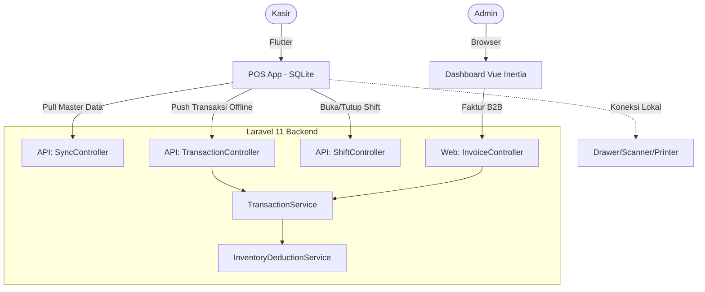

# PRD — Transaction & POS (V1)

## 1. Overview

Modul Transaction (Point of Sale/POS) menangani penjualan via 2 kanal:

1. **POS App (Flutter+SQLite)**: Klien _offline-first_ (Desktop/Mobile), UI kasir dioptimasi untuk kecepatan (navigasi _keyboard shortcut_), integrasi hardware lokal (Drawer/Scanner/Printer).
2. **Dashboard (Vue Inertia)**: Pusat kontrol untuk transaksi B2B (Faktur/Invoice) dan manajemen master data.

**Fitur Inti:**

- **Manajemen Shift**: Kas awal/akhir, cash in/out.
- **Keranjang**: Input via sentuh, _search_, atau _barcode scanner_. Dukung varian, modifier, catatan.
- **Pajak & Diskon**: PPN/Service charge via `outlet_settings`. Diskon item/bill.
- **Pembayaran**: Tunai (buka laci otomatis), QRIS, Transfer, EDC, _Split Payment_, dan _Hold Payment_.
- **Offline-First & Auto-Sync**: Aplikasi POS berfungsi 100% lokal (SQLite). Transaksi disinkronisasi ke server di _background_.
- **Master Data Sync**: Sinkronisasi manual/awal data master (produk, harga, pengaturan) dari cloud ke SQLite lokal POS.

---

## 2. Requirements

### Channel Penjualan

- `channel = ?`: Channel penjualan umum yang digunakan dalam berbagai industri retail, fnb dan jasa, dapat di nonaktifkan pada setting per outlet.
- channel disimpan dalam bentuk laravel enum
- channel yang ada di pos kasir `dine-in, walk-in, take-away, online-delivery`.
- channel yang ada di tambah penjualan dashboard (invoice) `e-commerce, social-media, direct, etc`.

### Shift & Kas

- **Buka/Tutup Shift**: Kasir wajib buka shift (input `opening_cash`). Tutup shift mencatat `closing_cash` dan selisih kas.
- **Cash Log**: Supervisor dapat mencatat `cash_in` / `cash_out` operasional.

### Cart & Order

- Tipe pesanan: `dine_in` / `takeaway`.
- Support _Barcode Scanner_ (baca _keyboard event_ input cepat <100ms).

### Pajak, Diskon, & Pembayaran

- **Pajak**: Diatur per outlet. Otomatis teraplikasi saat _checkout_.
- **Metode Pembayaran**: `cash`, `qris`, `bank_transfer`, `edc`, `custom`.
- **Split Payment**: Transaksi dibayar dengan ≥2 metode (tabel `transaction_payments`).
- **Hold Payment**: Tahan pesanan (stok belum dipotong), lanjut bayar nanti.

### Offline-First Architecture (POS App)

- **Offline-First Concept**: Operasional kasir (cari produk, hitung keranjang, bayar) beroperasi 100% lokal via SQLite agar bebas _loading_.
- **Master Data Sync**: Saat login/buka shift, atau via tombol **Sync Master Data**, sistem _pull_ data master (produk, harga, varian, setting pajak) dari server via API ke SQLite.
- **Auto-Sync Transaksi**: Transaksi lokal mendapat `offline_id` (UUID). _Background worker_ melakukan _push_ (sinkronisasi) ke server secara asinkron.
- **Idempotency**: Server memvalidasi `offline_id` (UNIQUE) untuk cegah duplikasi. Stok dipotong saat sync berhasil.

### Hardware (Koneksi Lokal)

- **Cash Drawer**: Kirim ESC/POS command otomatis saat bayar tunai (WebSerial/Bluetooth).
- **Thermal Printer**: Cetak struk via ESC/POS. Template diatur dari dashboard.

---

## 3. Core Features

- **Buka/Tutup Shift**: Form rekap kas dan perhitungan selisih.
- **Antarmuka Kasir**: Grid produk, keranjang, _shortcuts_, tombol "Sync Master Data".
- **Faktur/Invoice**: Form transaksi B2B di dashboard (mendukung termin/jatuh tempo).
- **Popup Varian/Modifier**: Pilihan detail sebelum produk masuk keranjang.
- **Checkout & Bayar**: Hitung otomatis subtotal, pajak, diskon, kembalian tunai.
- **Riwayat & Cetak Ulang**: Filter daftar transaksi dan tombol _reprint_ struk.

---

## 4. User Flow

### Pairing Device & Login POS

1. Admin menambahkan Device baru di menu Pengaturan Outlet (Dashboard).
2. Admin mengklik tombol "Hubungkan Device", sistem men-generate 8-digit OTP (berlaku misal 5 menit).
3. Kasir membuka aplikasi POS dan memasukkan 8-digit OTP tersebut.
4. POS App memanggil API Verifikasi OTP. Jika valid, server me-return Sanctum Token yang diikat secara permanen pada perangkat tersebut.
5. Device tersambung dan siap digunakan.

### Buka Shift & Sync Master Data

1. Kasir masuk POS App.
2. Kasir klik tombol **Sync Master Data** (atau otomatis saat login) untuk menarik data terbaru ke SQLite.
3. Muncul PopUp Buka Shift → Input kas awal → Shift aktif (`open`).

### Transaksi Kasir (Offline-First)

1. Kasir pilih produk (sentuh/cari/scan). Semua query ke SQLite lokal (instan).
2. Tentukan quantity, diskon item, modifier.
3. Klik **Checkout** (`F8`). Pilih metode pembayaran (opsi Split Payment tersedia).
4. Klik **Bayar**.
5. Transaksi disimpan ke SQLite lokal dengan `offline_id`.
6. Laci kas terbuka (jika tunai), struk dicetak.
7. Aplikasi melakukan _push_ (sync) ke server di _background_.

### Hold & Resume

1. Kasir klik **Tahan Pesanan** (`F3`). Pesanan masuk status `hold` lokal.
2. Lanjut via tab **Pesanan Tertahan** → Checkout normal.

### Faktur B2B (Dashboard)

1. Buka menu Faktur → Isi form (pelanggan, item, diskon, due date) → **Simpan**. (Online only).

---

## 5. Architecture

---

## 6. Database Schema

Semua tabel menggunakan `id` UUID dan `decimal(15,4)` untuk harga/qty.

- **`shifts`**: `id`, `outlet_id`, `user_id`, `shift_number`, `opening_cash`, `closing_cash`, `expected_cash`, `total_sales`, `status` (open/closed).
- **`shift_cash_logs`**: `id`, `shift_id`, `type` (cash_in/out), `amount`.
- **`payment_methods`**: `id`, `name`, `type`, `is_active`.
- **`transactions`**: `id`, `outlet_id`, `shift_id` (nullable), `customer_id`, `channel`, '', `subtotal`, `discount_amount`, `tax_amount`, `service_charge_amount`, `total`, `payment_status`, `status` (hold/completed/void), `is_offline`, `offline_id` (unique), `due_date`.
- **`transaction_items`**: Denormalized (copy `product_name`, harga, dll).
- **`transaction_item_modifiers`**: Denormalized detail modifier.
- **`transaction_payments`**: `transaction_id`, `payment_method_id`, `amount`, `change_amount`.

_(Pemotongan stok dilakukan di `inventory_movements` setelah transaksi berstatus `completed`)_

---

## 7. Tech Stack

- **Frontend Klien (POS)**: Flutter + SQLite (Offline-First). UI responsif, hardware serial direct connection.
- **Frontend Klien (Dashboard)**: Vue 3 + Inertia.js + TailwindCSS.
- **Backend**: Laravel 11. Arsitektur modular Controller → Service.
- **API Controllers (`api/pos/*`)**:
    - `DeviceController@verifyOtp` (Endpoint verifikasi 8-digit OTP dari POS app untuk mendapatkan Sanctum token).
    - `SyncController@masterData` (Endpoint menarik seluruh JSON data produk, kategori, varian, dan setting pajak).
    - `TransactionController` (Store, Hold, SyncOffline).
    - `ShiftController` (Open, Close, CashLog).
- **Web Controllers (`sales/*`)**:
    - `InvoiceController` (Faktur B2B).
    - `PaymentMethodController` (Master Data).
- **Services**:
    - `TransactionService`: Proses kalkulasi, pembayaran, potongan stok. Memiliki metode `syncOfflineTransaction()` dengan _idempotency check_.
    - `PriceCalculationService`: Subtotal & pajak.
    - `PaymentService`: Validasi pembayaran.
    - `ShiftService`: Hitung selisih kas.
    - `InventoryDeductionService`: Potong stok berdasar tipe (`sale`, `recipe`, `bundle`).
    - `MasterDataSyncService`: Kompilasi JSON response untuk `SyncController`.

---

## 8. Hak Akses (Authorization)

Berdasarkan `PermissionEnum.php`.

- **Kasir**: `transaction.view`, `transaction.create`, `transaction.hold`, `transaction.open_shift`, `transaction.close_shift`, `transaction.reprint`.
- **Supervisor**: Menambahkan `transaction.discount`, `transaction.cancel`.
- **Admin/Owner**: Akses penuh, termasuk `transaction.void` & `transaction.refund` (Phase 2).

---

## 9. Validasi & Error Handling

- **Buka Shift Ganda**: Dicek agar user tidak punya 2 shift aktif.
- **Checkout POS**: Tolak jika shift tidak aktif atau keranjang kosong.
- **Offline Sync Duplikat**: Mengandalkan UNIQUE `offline_id` (idempotensi).
- **Split Payment**: Total `amount - change_amount` harus `>= total`.
- **Stok Habis Saat Sync**: Jika server out of stock saat menerima data sync, transaksi diterima namun dengan label peringatan.

---

## 10. UI Components & Shortcuts

- **Grid POS**: Fullscreen (kiri produk, kanan keranjang).
- **Status Bar**: Indikator koneksi (Online/Offline/Syncing), nama shift, **Tombol Sync Master Data**.
- **Shortcuts Cepat**:
    - `F1` Cari Produk | `F2` Panel Keranjang | `F3` Tahan Pesanan
    - `F4` Diskon Bill | `F5` Pilih Pelanggan | `F8` Checkout
    - `F10` Cetak Struk | `F12` Tutup Shift | `Esc` Batal / Tutup Popup
- **PopUp Pembayaran**: Rincian tagihan, dropdown metode, input tunai (hitung kembalian otomatis), tombol tambah pembayaran (_split_).
- **Dashboard Faktur**: Form B2B kompleks dengan pencarian pelanggan dan _due date_.
