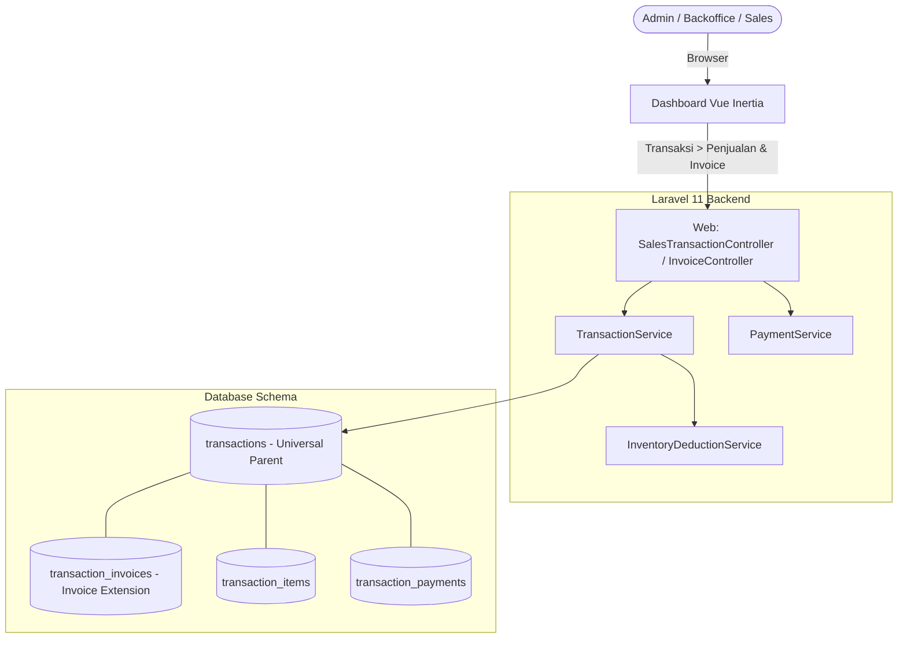

# PRD — Transaksi & Penjualan (V1)

## 1. Overview

Modul Transaksi & Penjualan bertanggung jawab mengelola seluruh aktivitas penjualan dan penerbitan faktur (invoice) pada aplikasi **Sollu App** melalui dashboard backoffice di menu **Transaksi > Penjualan**.

Modul ini mengadopsi arsitektur data terpisah berdasar pola *Parent-Extension Table*:
1. **`transactions` (Parent Table)**: Bertindak sebagai entitas induk universal yang menampung seluruh jenis transaksi dari semua *channel* penjualan (terutama transaksi langsung dari kasir POS maupun transaksi dari dashboard).
2. **`transaction_invoices` (Extension Table)**: Tabel turunan (1-to-1) yang menyimpan data spesifik penagihan dan dokumen faktur resmi (`INV/YYYYMM/XXXX`, tanggal jatuh tempo `due_date`, syarat pembayaran, dan catatan pengiriman) yang tidak dinaungi pada transaksi ritel biasa (lewat POS).

> [!NOTE]
> Pada V1, modul ini memfokuskan siklus hidup invoice pada 4 status utama: `Draft`, `Unpaid`, `Paid`, dan `Cancel`. Fitur penanganan **Pembayaran Bertahap (Down Payment / DP / Cicilan)** dialokasikan pada pengembangan **V1.2**.

**Fitur Inti:**

- **Dashboard Penjualan & Multi-Channel**: Form Tambah Penjualan pada menu **Transaksi > Penjualan** dengan pilihan channel seperti `e-commerce`, `social-media`, `direct`, `wholesale`, `custom`, dll.
- **Penerbitan & Siklus Invoice**: Penerbitan invoice resmi dengan penomoran otomatis (`INV/YYYYMM/XXXX`), tanggal jatuh tempo (termin pembayaran), dan manajemen status invoice (`Draft` → `Unpaid` → `Paid`, serta `Cancel`).
- **Pencatatan Pembayaran Lunas**: Pencatatan pelunasan tagihan invoice (_full payment_) menggunakan berbagai metode pembayaran. _(Pembayaran bertahap/DP pada V1.2)_.
- **Cetak & Ekspor PDF Invoice**: Generate dan cetak dokumen PDF Invoice resmi dengan tata letak profesional untuk dikirimkan ke pelanggan.
- **Integrasi Stok Barang**: Pengurangan stok barang (`inventory_movements`) otomatis terjadi saat invoice diterbitkan (`Unpaid`) atau diselesaikan (`Paid`).

---

## 2. Requirements

### Channel Penjualan

- **Fleksibilitas Channel**: Channel penjualan dapat disesuaikan dan di-nonaktifkan pada pengaturan per outlet.
- **Laravel Enum**: Channel disimpan sebagai Enum (`TransactionChannelEnum`).
- **Channel Penjualan Dashboard**: `e_commerce`, `social_media`, `direct`, `wholesale`, `custom`.
- **Channel POS Kasir (Skema Induk)**: `dine_in`, `walk_in`, `take_away`, `online_delivery`.

### Dashboard Penjualan & Alur Invoice (Menu Transaksi > Penjualan)

- **Menu Transaksi > Penjualan**: Halaman manajemen penjualan di dashboard Vue Inertia yang menampilkan daftar transaksi invoice, filter status, channel, rentang tanggal, dan pencarian pelanggan.
- **Pemisahan Entitas Induk (`transactions`) & Extension Faktur (`transaction_invoices`)**:
  - Setiap penjualan dari semua channel (termasuk POS) wajib mencatat record di tabel induk `transactions` dengan `transaction_number` universal (contoh: `TRX/202608/00001`).
  - Transaksi ritel biasa lewat POS yang tidak memerlukan faktur resmi hanya tersimpan di `transactions`.
  - Transaksi penjualan di dashboard/B2B/Online yang memerlukan penerbitan invoice resmi secara otomatis membuat 1 record turunan di `transaction_invoices` dengan `invoice_number` resmi (contoh: `INV/202608/00001`).
- **Form Tambah Penjualan**: Pengguna dapat menambahkan penjualan baru di dashboard dengan memilih:
    - Outlet & Pelanggan (`customer_id`).
    - Channel Penjualan (`e_commerce`, `social_media`, `direct`, `wholesale`, dll).
    - Tanggal Transaksi (`transaction_date`) & Tanggal Jatuh Tempo (`due_date` / `invoice_due_date`).
    - Item Produk (qty, harga jual, diskon item, varian/modifier).
    - Biaya Tambahan (Pengiriman / _Shipping Fee_) & Pajak/Diskon tingkat dokumen.
- **Auto-Generated Numbers**:
  - `transaction_number` (`TRX/YYYYMM/XXXXX`) dibuat otomatis untuk entitas induk `transactions`.
  - `invoice_number` (`INV/YYYYMM/XXXXX`) dibuat otomatis pada `transaction_invoices` saat invoice diterbitkan.
- **Status Faktur / Invoice (V1)**:
    - `draft`: Transaksi disimpan sebagai draf/penawaran harga; belum memotong stok dan belum menagihkan piutang.
    - `unpaid`: Invoice telah diterbitkan resmi ke pelanggan (record `transaction_invoices` dibuat) dan tagihan aktif; menunggu pelunasan.
    - `paid`: Tagihan telah dibayar lunas secara penuh (_full payment_).
    - `cancel`: Transaksi invoice dibatalkan. Jika stok sudah dipotong, sistem mengembalikan stok via jurnal pembalik (_stock movement reversal_).
- **Penanganan Pembayaran Bertahap (Roadmap V1.2)**:
    - Pada V1, sistem hanya mendukung pencatatan pembayaran lunas (_full payment_).
    - Pencatatan Down Payment (DP), pembayaran bertahap (cicilan), dan perhitungan sisa tagihan (_balance due_) akan diimplementasikan pada **V1.2**.
- **Integrasi Stok**: Pemotongan stok barang (`inventory_movements`) otomatis terjadi saat invoice diterbitkan (`unpaid`) atau dilunasi (`paid`), sesuai kebijakan outlet.
- **Cetak & Ekspor PDF Invoice**: Sistem menyediakan fitur cetak dan ekspor PDF dokumen invoice dengan layout standar profesional (Header outlet, detail pelanggan, itemized table, instruksi pembayaran, & status invoice).

### Pajak, Diskon, & Pembayaran

- **Pajak & Service Charge**: Diatur per outlet. Otomatis teraplikasi saat pembuatan/penerbitan invoice.
- **Metode Pembayaran**: `cash`, `qris`, `bank_transfer`, `edc`, `custom`.
- **Pelunasan Pembayaran**: Pembayaran penuh atas tagihan invoice di dashboard yang mengubah status `transactions` dan `transaction_invoices` dari `unpaid` menjadi `paid`.

---

## 3. Core Features

- **Tambah Penjualan Dashboard (`Transaksi > Penjualan`)**: Form pembuatan transaksi penjualan baru dengan opsi channel (`e-commerce`, `social-media`, `direct`, `wholesale`), tanggal transaksi, dan jatuh tempo.
- **Penerbitan & Pengelolaan Invoice**: Penerbitan invoice resmi (nomor `INV/...` pada `transaction_invoices`), draf invoice, pembatalan (`cancel`), dan ekspor/cetak PDF Invoice.
- **Pencatatan Pembayaran Lunas**: Modal catat pembayaran pada detail invoice untuk pelunasan tagihan.
- **Monitoring Status Invoice**: Filtering invoice berdasarkan 4 status V1 (`Draft`, `Unpaid`, `Paid`, `Cancel`).
- **Riwayat & Cetak Document**: Filter daftar transaksi dan tombol unduh/cetak PDF invoice.

---

## 4. User Flow

### Dashboard Penjualan & Alur Penerbitan Invoice

1. Pengguna membuka menu **Transaksi > Penjualan** di Dashboard.
2. Pengguna menekan tombol **Tambah Penjualan**.
3. Pengguna mengisi form penjualan:
    - Pilih **Outlet** dan **Pelanggan**.
    - Pilih **Channel Penjualan** (contoh: `social-media`, `direct`, `e-commerce`, atau `wholesale`).
    - Tentukan **Tanggal Transaksi** (`transaction_date`) dan **Tanggal Jatuh Tempo** (`due_date`).
    - Pilih **Item Produk**, kuantitas, harga, varian, dan diskon item.
    - Mengisi biaya pengiriman (_shipping fee_) atau catatan transaksi jika ada.
4. Pengguna memilih opsi simpan:
    - **Simpan Draf**: Dokumen tersimpan di `transactions` dan `transaction_invoices` sebagai status `draft`.
    - **Terbitkan Invoice**: Sistem men-generate `transaction_number` (`TRX/...`) pada `transactions` dan `invoice_number` resmi (`INV/YYYYMM/XXXX`) pada `transaction_invoices`, mengubah status menjadi `unpaid`, dan memicu pemotongan stok.
5. **Pencatatan Pembayaran (Pelunasan)**:
    - Pengguna membuka detail invoice berstatus `unpaid` → Klik **Catat Pembayaran / Pelunasan**.
    - Memilih metode pembayaran dan mengonfirmasi pembayaran penuh.
    - Status transaksi & invoice berubah menjadi `paid` (Lunas).
    - _(Note: Fitur pencatatan pembayaran bertahap / DP akan tersedia pada V1.2)_.
6. **Pembatalan Invoice (Cancel)**:
    - Pengguna dapat membatalkan invoice → Status berubah menjadi `cancel`. Jika barang sudah terpotong, stok otomatis dikembalikan.
7. **Cetak / Ekspor Document**:
    - Pengguna dapat mengunduh atau mencetak PDF Invoice resmi kapan saja dari halaman detail invoice.

---

## 5. Architecture

---

## 6. Database Schema

Semua tabel menggunakan `id` UUID dan `decimal(15,4)` untuk harga/qty.

### 1. `transactions` (Parent Table Universal)
Tabel induk untuk menyimpan seluruh bentuk transaksi penjualan dari semua channel (termasuk POS Kasir).
- **`id`**: UUID, Primary Key.
- **`outlet_id`**: UUID, Foreign Key (`outlets.id`), indexed.
- **`shift_id`**: UUID, Foreign Key (`shifts.id`), nullable (diisi untuk transaksi langsung via POS kasir).
- **`customer_id`**: UUID, Foreign Key (`customers.id`), nullable.
- **`transaction_number`**: string(50), Unique, nullable, Format: `TRX/YYYYMM/XXXXX` (nomor transaksi induk universal).
- **`channel`**: enum (`dine_in`, `walk_in`, `take_away`, `online_delivery`, `e_commerce`, `social_media`, `direct`, `wholesale`, `custom`).
- **`subtotal`**: decimal(15,4), Subtotal nominal barang.
- **`discount_amount`**: decimal(15,4), Total diskon.
- **`tax_amount`**: decimal(15,4), Total pajak.
- **`service_charge_amount`**: decimal(15,4), Biaya layanan outlet.
- **`shipping_fee`**: decimal(15,4), Biaya pengiriman.
- **`total`**: decimal(15,4), Grand total transaksi.
- **`total_paid`**: decimal(15,4), Accumulation terbayar.
- **`balance_due`**: decimal(15,4), Sisa tagihan.
- **`status`**: enum (`draft`, `unpaid`, `paid`, `cancel`).
- **`transaction_date`**: datetime, Tanggal transaksi dilakukan.
- **`notes`**: text, nullable, Catatan umum transaksi.
- **`created_by`**: UUID, Foreign Key (`users.id`).
- **`updated_by`**: UUID, Foreign Key (`users.id`), nullable.
- **`created_at`**, **`updated_at`**, **`deleted_at`**: timestamps (soft deletes).

### 2. `transaction_invoices` (Extension Table Faktur Resmi)
Tabel turunan 1-to-1 yang khusus menyimpan data faktur/invoice (diterbitkan untuk penjualan yang membutuhkan faktur resmi & termin pembayaran, tidak dinaungi pada transaksi ritel biasa POS).
- **`id`**: UUID, Primary Key.
- **`transaction_id`**: UUID, Foreign Key (`transactions.id`), Unique (relasi 1-to-1 dengan parent `transactions`).
- **`invoice_number`**: string(50), Unique, Format: `INV/YYYYMM/XXXXX` (nomor faktur resmi).
- **`invoice_date`**: datetime / date, Tanggal penerbitan invoice.
- **`due_date`**: datetime / date, Tanggal jatuh tempo pembayaran (_invoice due date_).
- **`status`**: enum (`draft`, `unpaid`, `paid`, `cancel`), Status faktur (sinkron dengan status induk).
- **`terms_and_conditions`**: text, nullable, Syarat & instruksi pembayaran yang dicetak pada PDF Invoice.
- **`notes`**: text, nullable, Catatan khusus faktur untuk pelanggan.
- **`sent_at`**: timestamp, nullable, Tanggal/waktu dokumen invoice dikirimkan ke pelanggan.
- **`created_by`**: UUID, Foreign Key (`users.id`), User yang menerbitkan invoice.
- **`created_at`**, **`updated_at`**: timestamps.

### 3. Tabel Pendukung Transaksi
- **`payment_methods`**: `id`, `name`, `type`, `is_active`.
- **`transaction_items`**: `id`, `transaction_id`, `product_id`, `product_name`, `variant_name`, `sku`, `price`, `qty`, `discount_amount`, `subtotal`, `notes`.
- **`transaction_item_modifiers`**: `id`, `transaction_item_id`, `modifier_name`, `price`, `qty`.
- **`transaction_payments`**: `id`, `transaction_id`, `payment_method_id`, `amount`, `change_amount`, `payment_date`, `notes`, `created_by`.

_(Pemotongan stok dicatat di `inventory_movements` saat status transaksi berubah menjadi `unpaid` atau `paid`)_

---

## 7. Tech Stack

- **Frontend Klien (Dashboard)**: Vue 3 (Composition API) + Inertia.js + TailwindCSS v4. Menu **Transaksi > Penjualan**.
- **Backend**: Laravel 11. Arsitektur modular Controller → Service.
- **Web Controllers (`sales/*` / `transaction/*`)**:
    - `SalesTransactionController` / `InvoiceController` (Menangani CRUD Penjualan Dashboard, Penerbitan Invoice, Pembayaran, Pembatalan, & Export PDF Invoice).
    - `PaymentMethodController` (Master Data).
- **Services**:
    - `TransactionService`: Mengelola pembuatan record induk `Transaction` dan turunan `TransactionInvoice`, kalkulasi harga, pembaruan status (`draft` → `unpaid` → `paid` / `cancel`), serta pemotongan stok.
    - `PriceCalculationService`: Subtotal, pajak, diskon, dan biaya pengiriman.
    - `PaymentService`: Validasi pembayaran lunas dan pembaruan status transaksi & invoice.
    - `InventoryDeductionService`: Potong/kembalikan stok berdasar tipe (`sale`, `recipe`, `bundle`).

---

## 8. Hak Akses (Authorization)

Berdasarkan `PermissionEnum.php`.

- **Sales / Backoffice Staff**: `transaction.view`, `transaction.create`, `transaction.issue_invoice`, `transaction.record_payment`.
- **Supervisor**: Menambahkan `transaction.discount`, `transaction.cancel`, `transaction.edit_due_date`.
- **Admin/Owner**: Akses penuh, termasuk `transaction.cancel` & `transaction.refund`.

---

## 9. Validasi & Error Handling

- **Penetapan Due Date Invoice**: Tanggal jatuh tempo (`due_date` pada `transaction_invoices`) tidak boleh lebih awal dari tanggal transaksi (`transaction_date`).
- **Relasi 1-to-1 Invoice**: Setiap `transaction_id` hanya boleh memiliki maksimal 1 record `transaction_invoices`.
- **Pelunasan Pembayaran**: Pembayaran pada V1 berupa pelunasan penuh tagihan.
- **Stok Habis Saat Penerbitan Invoice**: Jika stok barang tidak mencukupi saat invoice diterbitkan (`unpaid`), sistem menolak penerbitan atau memberikan peringatan sesuai dengan pengaturan stok negatif per outlet.
- **Pembatalan Invoice (`cancel`)**: Invoice berstatus `cancel` mengunci transaksi dari perubahan selanjutnya dan mengembalikan persediaan barang yang telah dipotong.

---

## 10. UI Components

- **Dashboard Penjualan (`Transaksi > Penjualan`)**: Halaman tabel daftar transaksi dengan 4 tab filter status (`Draft`, `Unpaid`, `Paid`, `Cancel`), pencarian `invoice_number` & `transaction_number`, form tambah penjualan multi-channel, modal pelunasan pembayaran, dan tombol aksi cetak PDF Invoice.
