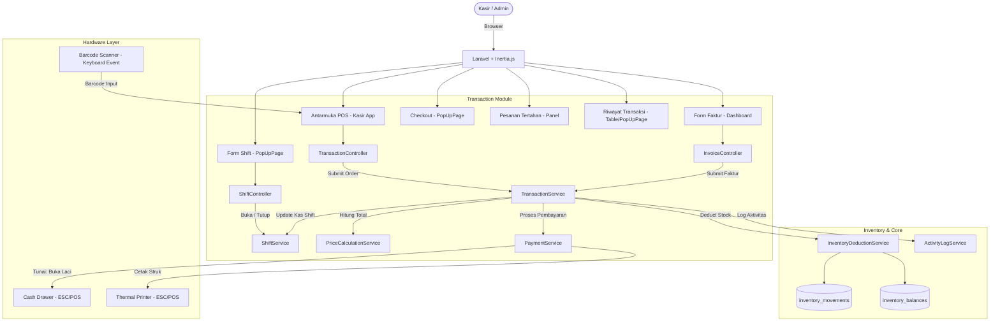
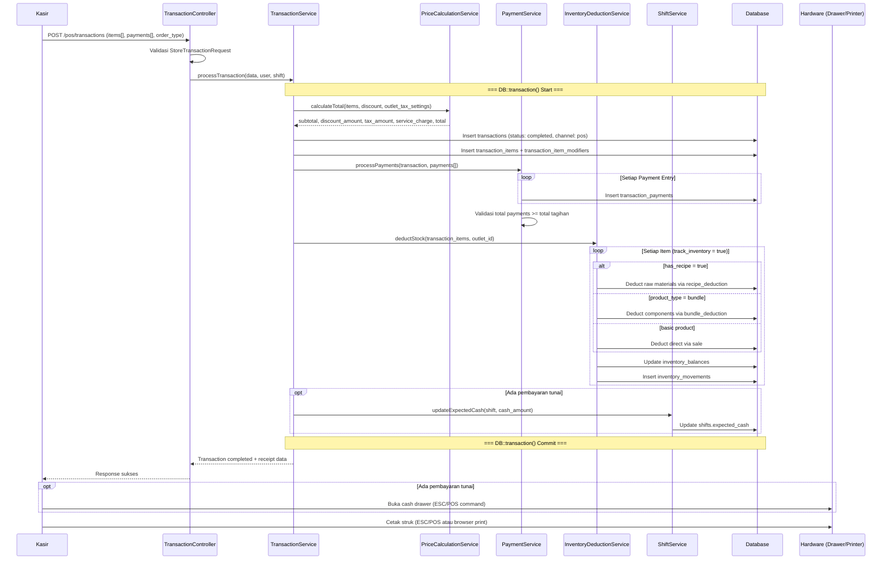
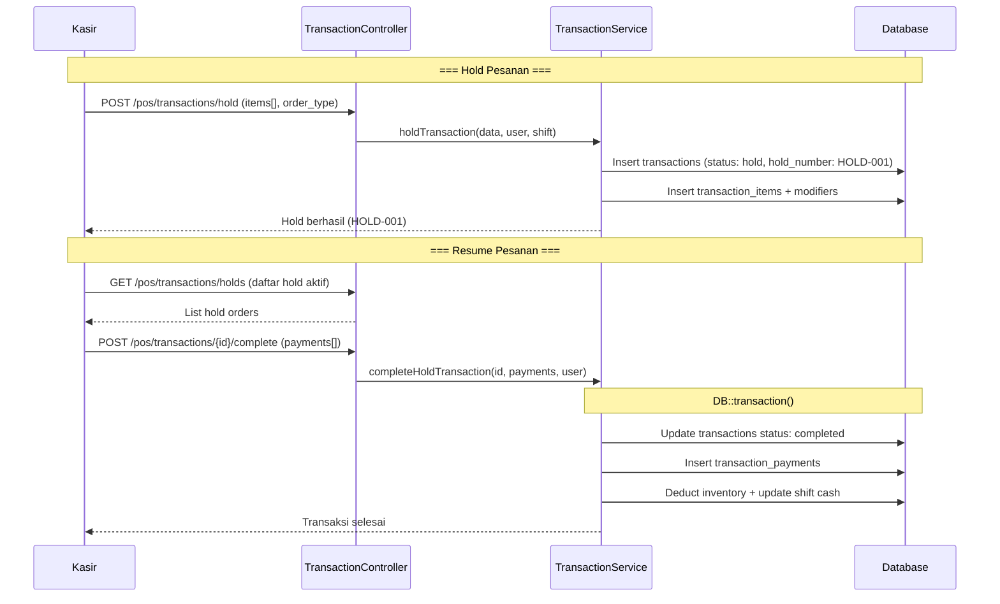
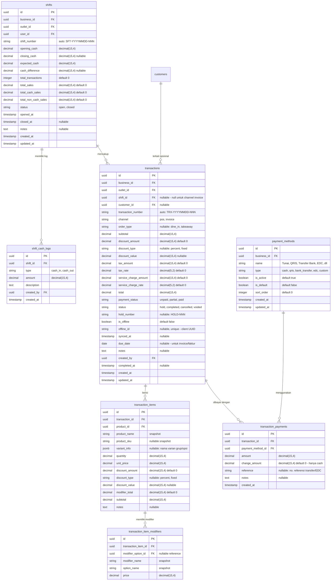

# PRD — Transaction & POS (V1)

## 1. Overview

Modul Transaction (Point of Sale / POS) adalah **inti operasional** dari aplikasi Sollu POS yang menangani seluruh proses penjualan — dari pencatatan pesanan hingga pembayaran. Modul ini mendukung **dua kanal penjualan**:

1. **Kasir (POS App):** Antarmuka kasir layar sentuh yang dioptimasi untuk operasional retail harian. Mendukung navigasi cepat via **keyboard shortcut**, koneksi hardware (Cash Drawer, Barcode Scanner, Thermal Printer), dan **operasi offline** saat koneksi internet terputus.
2. **Dashboard (Faktur/Invoice):** Kanal penjualan berbasis form untuk transaksi **B2B** atau penjualan non-kasir. Dibuat melalui dashboard management untuk menghasilkan faktur/invoice yang dapat dicetak atau dikirim ke pelanggan.

Modul ini mencakup:
- **Manajemen Shift Kasir** — Buka/tutup shift, kas awal/akhir, selisih kas, cash in/out logging.
- **Keranjang & Pesanan** — Tambah produk (via sentuh, pencarian, atau **barcode scanner**), pilih varian & modifier, atur quantity, catatan per item.
- **Tax & Discount** — Penerapan pajak outlet (PPN, service charge) dan diskon (per item maupun per bill) secara fleksibel.
- **Multi Payment** — Tunai (dengan **cash drawer**), QRIS, Transfer Bank, EDC Manual, **Split Payment** (gabungan ≥2 metode), dan Custom Payment Method.
- **Hold Payment** — Kemampuan menahan/memarkir transaksi untuk dilanjutkan kemudian (contoh: pelanggan masih memilih barang tambahan).
- **Offline Operating** — Transaksi tetap dapat diproses saat koneksi terputus. Data disimpan lokal (IndexedDB) dan otomatis disinkronisasi saat koneksi pulih.
- **Hardware Connection** — Integrasi Cash Drawer (buka laci otomatis saat pembayaran tunai), Barcode Scanner (input produk cepat), dan Thermal Printer (cetak struk ESC/POS).
- **Inventory Integration** — Setiap transaksi selesai secara atomik memotong stok melalui `inventory_movements` (tipe: `sale`, `recipe_deduction`, `bundle_deduction`).
- **Struk/Receipt** — Generate struk digital dan cetak ke thermal printer via ESC/POS.

---

## 2. Requirements

### Kanal Penjualan
- **Dual Channel:** Sistem mendukung dua kanal penjualan yang tercatat dalam satu tabel `transactions` dengan kolom `channel`:
  - `pos` — Transaksi melalui antarmuka kasir (wajib terhubung ke shift aktif).
  - `invoice` — Faktur/invoice melalui dashboard (tidak wajib shift, mendukung `due_date` untuk pembayaran).

### Shift & Kas
- **Cashier Shift Management:** Kasir harus melakukan **Buka Shift** (memasukkan `opening_cash`) sebelum memproses transaksi POS. Saat selesai bertugas, kasir melakukan **Tutup Shift** (memasukkan uang kas fisik akhir → sistem menghitung selisih). Shift hanya berlaku untuk kanal `pos`.
- **Cash In/Out Logging:** Selama shift berjalan, supervisor dapat mencatat aliran kas masuk/keluar (setoran tambahan, pengambilan kas untuk keperluan operasional) melalui `shift_cash_logs`.
- **Cash Drawer Integration:** Saat pembayaran tunai berhasil, sistem mengirim perintah buka laci kas (cash drawer) melalui koneksi hardware (ESC/POS via WebSerial atau Bluetooth).

### Cart & Order
- **Cart Management:** Antarmuka POS mendukung penambahan produk via **sentuh grid**, **pencarian nama**, atau **scan barcode**. Produk dengan varian/modifier menampilkan popup pemilihan sebelum masuk keranjang.
- **Order Types:** `dine_in` (Makan di Tempat) dan `takeaway` (Bawa Pulang). Berlaku untuk kanal `pos`. Kanal `invoice` tidak menggunakan order type.
- **Barcode Scanner Support:** Kasir dapat menggunakan barcode scanner (USB/Bluetooth). Scanner mengirim input sebagai keyboard event → sistem mencocokkan barcode dengan `products.barcode` atau `inventory_items.barcode` lalu menambahkan ke keranjang.

### Tax & Discount
- **Pajak Outlet:** Pajak (PPN) dan service charge dikonfigurasi per outlet melalui `outlet_settings` (category: `tax`). Diterapkan otomatis saat checkout berdasarkan setting outlet aktif.
- **Diskon Item:** Diskon per baris item (persen atau nominal) — kasir dengan permission `transaction.discount` dapat menerapkan diskon pada item tertentu.
- **Diskon Bill:** Diskon total tagihan (persen atau nominal) — diterapkan sebelum pajak atau setelah subtotal (konfigurabel).

### Pembayaran
- **Multi Payment Method:** Mendukung metode pembayaran:
  - `cash` — Tunai. Wajib input nominal yang diterima, sistem hitung kembalian. Memicu buka cash drawer.
  - `qris` — QRIS statis (tanpa integrasi gateway). Kasir verifikasi manual.
  - `bank_transfer` — Transfer bank. Kasir input nomor referensi.
  - `edc` — EDC Manual (mesin gesek kartu). Kasir input nomor approval/referensi.
  - `custom` — Metode custom yang dibuat merchant sendiri.
- **Split Payment:** Satu transaksi dapat dibayar dengan **≥2 metode pembayaran** berbeda (misal: sebagian tunai, sebagian QRIS). Setiap pembayaran dicatat di tabel `transaction_payments`. Total seluruh pembayaran harus ≥ total tagihan.
- **Hold Payment:** Kasir dapat **menahan transaksi** (status `hold`) untuk dilanjutkan nanti. Transaksi hold memiliki `hold_number` untuk identifikasi cepat. Kasir dapat melihat daftar transaksi hold dan melanjutkan checkout. Transaksi hold **belum memotong stok** — stok baru dipotong saat completed.

### Offline Operating
- **Offline Mode:** Saat koneksi terputus, antarmuka POS tetap berfungsi. Transaksi disimpan di **IndexedDB** browser dengan `offline_id` (UUID client-side).
- **Auto Sync:** Saat koneksi pulih, sistem otomatis menyinkronkan transaksi offline ke server. Status sinkronisasi ditampilkan di UI.
- **Conflict Handling:** Server melakukan idempotency check berdasarkan `offline_id` (UNIQUE constraint) untuk mencegah duplikasi. Jika stok tidak mencukupi saat sync, transaksi tetap disimpan dengan catatan peringatan.

### Hardware Connection
- **Cash Drawer:** Koneksi via ESC/POS command melalui WebSerial API atau Bluetooth. Perintah buka laci dikirim otomatis saat pembayaran tunai selesai. Mendukung konfigurasi port per perangkat outlet (`outlet_devices`).
- **Barcode Scanner:** Input barcode diproses sebagai keyboard event. Tidak memerlukan driver khusus — scanner mengirim karakter barcode + Enter. Sistem mendeteksi pola input cepat (<100ms antar karakter) sebagai scan event.
- **Thermal Printer:** Cetak struk via ESC/POS raw printing melalui WebSerial API, Bluetooth, atau fallback ke browser print dialog. Template struk dikonfigurasi melalui `outlet_settings` (category: `receipt`).

### Keyboard Shortcut
- **Navigasi Cepat POS:** Kasir dapat menggunakan keyboard shortcut untuk operasi umum:
  - `F1` — Fokus pencarian produk
  - `F2` — Buka/tutup panel keranjang
  - `F3` — Tahan pesanan (Hold)
  - `F4` — Diskon bill
  - `F5` — Pilih pelanggan
  - `F8` — Checkout / Bayar
  - `F10` — Cetak struk terakhir
  - `F12` — Tutup shift
  - `Esc` — Batal / Tutup popup
  - `+` / `-` — Tambah/kurangi qty item terpilih
  - `Del` — Hapus item terpilih dari keranjang

### Integritas Data
- **Inventory Integration:** Saat transaksi `completed`, stok dipotong atomik dalam `DB::transaction()`. Pemotongan sesuai tipe produk: `sale` (basic), `recipe_deduction` (has_recipe), `bundle_deduction` (bundle). Hanya produk dengan `track_inventory = true` yang dipotong.
- **Denormalized Snapshot:** Nama produk, harga, varian, modifier di-copy ke `transaction_items` dan `transaction_item_modifiers` agar histori tidak terpengaruh perubahan master data.
- **Format Penomoran:** Transaksi: `TRX-{YYYYMMDD}-{sequence}`. Shift: `SFT-{YYYYMMDD}-{sequence}`. Hold: `HOLD-{sequence}` (reset per shift).
- **Atomic Operations:** Pembuatan transaksi, pemotongan stok, update shift kas — semua dalam satu `DB::transaction()`.
- **Activity Logging:** Setiap aksi (buka shift, tutup shift, transaksi completed, hold, void) dicatat oleh `ActivityLogService`.

---

## 3. Core Features

- **Buka Shift (Open Shift):** Form kas awal untuk memulai sesi kasir. Wajib sebelum memproses transaksi POS.
- **Antarmuka Kasir (POS):** Tampilan layar sentuh dengan grid produk per kategori, pencarian, scan barcode, dan panel keranjang. Dioptimasi untuk navigasi cepat via keyboard shortcut.
- **Faktur/Invoice (Dashboard):** Form pembuatan faktur B2B melalui dashboard. Mendukung input pelanggan, daftar item, payment terms, dan tanggal jatuh tempo.
- **Pilihan Varian & Modifier:** PopUpPage untuk memilih opsi varian dan modifier sebelum item masuk keranjang.
- **Tax & Discount:** Penerapan diskon (persen/nominal) per item dan per bill. Pajak outlet (PPN, service charge) dihitung otomatis berdasarkan `outlet_settings`.
- **Checkout & Pembayaran:** Rincian tagihan, pilihan metode pembayaran (termasuk split payment), input nominal tunai & kembalian.
- **Hold Payment:** Tahan pesanan yang belum dibayar untuk dilanjutkan nanti. Daftar hold orders tersedia di panel POS.
- **Split Payment:** Bayar dengan gabungan ≥2 metode pembayaran berbeda.
- **Tutup Shift (Close Shift):** Rekap akhir shift — total penjualan, kas sistem vs kas fisik, selisih.
- **Riwayat Transaksi:** Daftar transaksi per shift/outlet dengan filter dan detail lengkap.
- **Cetak Struk:** Struk digital dan cetak ke thermal printer (ESC/POS). Cetak ulang (reprint) tersedia di detail transaksi.
- **Offline Mode:** Transaksi tetap berjalan saat offline, auto sync saat koneksi pulih.
- **Cash Drawer:** Buka laci kas otomatis saat pembayaran tunai.
- **Barcode Scan:** Input produk cepat via barcode scanner.

---

## 4. User Flow

### **Buka Shift**
1. Kasir masuk ke halaman **POS**.
2. Jika belum ada shift aktif (status `open`) untuk kasir tersebut di outlet bersangkutan, sistem otomatis menampilkan PopUpPage **Buka Shift**.
3. Kasir memasukkan **Uang Kas Awal** dan **Catatan** (opsional).
4. Kasir klik **Buka Shift**.
5. Sistem membuat record `shifts` berstatus `open` dan `shift_cash_logs` (tipe `cash_in` untuk kas awal).
6. Kasir diteruskan ke antarmuka POS utama.

### **Transaksi POS (Kasir)**
1. Pada halaman POS, kasir melihat grid produk yang dikelompokkan per kategori.
2. Kasir menambahkan produk ke keranjang via:
   - **Sentuh** grid produk
   - **Pencarian** nama produk (`F1` untuk fokus)
   - **Scan barcode** dengan scanner hardware
3. Jika produk memiliki varian/modifier → PopUpPage pemilihan muncul. Jika tidak → langsung masuk keranjang.
4. Kasir memilih **Tipe Pesanan** (Dine-in / Takeaway).
5. Kasir dapat:
   - Ubah quantity (`+` / `-`)
   - Tambah diskon per item (jika punya permission `transaction.discount`)
   - Tambah catatan per item
   - Hapus item (`Del`)
   - Tambah diskon bill (`F4`)
   - Pilih pelanggan (`F5`)
6. Kasir klik **Checkout** (`F8`).
7. PopUpPage Checkout muncul — rincian: Subtotal, Diskon, Pajak (PPN), Service Charge, Total.
8. Kasir memilih metode pembayaran:
   - **Tunai:** Input uang diterima → kembalian otomatis terhitung.
   - **QRIS:** Tampilkan QR → kasir verifikasi manual.
   - **Transfer Bank:** Input nomor referensi transfer.
   - **EDC Manual:** Input nomor approval EDC.
   - **Split Payment:** Klik "+ Tambah Pembayaran" → pilih metode kedua, input nominal.
9. Kasir klik **Bayar & Selesaikan**.
10. Sistem dalam satu `DB::transaction()`:
    a. Validasi data, ketersediaan stok.
    b. Buat `transactions` (status: `completed`) + `transaction_items` + `transaction_item_modifiers`.
    c. Buat `transaction_payments` (≥1 record).
    d. Trigger `InventoryDeductionService` (memotong `inventory_balances` + insert `inventory_movements`).
    e. Update `expected_cash` pada `shifts` (jika ada pembayaran tunai).
    f. Kirim perintah buka **cash drawer** (jika ada pembayaran tunai).
11. Tampilkan struk digital + opsi cetak ke thermal printer.

### **Hold Payment (Tahan Pesanan)**
1. Kasir sudah menambahkan item ke keranjang.
2. Kasir klik **Tahan Pesanan** (`F3`).
3. Sistem menyimpan transaksi berstatus `hold` dengan `hold_number` (misal: HOLD-001).
4. Keranjang dikosongkan, kasir bisa melayani pelanggan berikutnya.
5. Untuk melanjutkan: kasir klik tab **Pesanan Tertahan** → pilih pesanan → keranjang terisi kembali → lanjut checkout normal.
6. **Stok belum dipotong** saat hold — baru dipotong saat completed.

### **Faktur/Invoice (Dashboard)**
1. User masuk ke menu **Penjualan > Faktur** di dashboard.
2. Klik **Buat Faktur**.
3. Isi form: pilih pelanggan, tambah item (produk + qty + harga), diskon, pajak, tanggal jatuh tempo.
4. Klik **Simpan** → faktur tersimpan berstatus `completed` (langsung proses) atau `hold` (menunggu pembayaran).
5. Sistem memotong stok dan mencatat pembayaran.
6. Faktur dapat dicetak/export sebagai PDF.

### **Tutup Shift**
1. Kasir klik **Tutup Shift** (`F12`) dari header POS.
2. PopUpPage ringkasan muncul:
   - Total penjualan tunai
   - Total penjualan non-tunai
   - Total transaksi
   - Expected cash (kas sistem)
3. Kasir menghitung uang di laci kas, masukkan sebagai **Uang Kas Fisik**.
4. Sistem hitung selisih otomatis. Catatan wajib jika ada selisih.
5. Klik **Tutup Shift** → status shift berubah `closed`.

### **Offline Mode**
1. Koneksi internet terputus → indikator **Offline** muncul di header POS.
2. Kasir tetap dapat membuat transaksi seperti biasa.
3. Transaksi disimpan di IndexedDB browser dengan `offline_id` dan flag `is_offline = true`.
4. Saat koneksi pulih → sistem auto sync transaksi offline ke server via background API call.
5. Indikator berubah menjadi **Menyinkronkan...** → **Online** setelah selesai.

### **Riwayat & Cetak Ulang Struk**
1. Kasir buka menu **Riwayat Transaksi** dari POS.
2. Daftar transaksi (default: shift saat ini). Filter tersedia per outlet, tanggal, status.
3. Klik transaksi → Detail PopUpPage (item, modifier, pembayaran, struk).
4. Tombol **Cetak Ulang Struk** (`F10`) jika punya permission `transaction.reprint`.

---

## 5. Architecture

Modul Transaction menggunakan pola **Controller → Service → Model** (Modular Monolith) dengan pemisahan logika per concern: shift, pricing/tax, payment, inventory deduction, dan hardware.



### Sequence Diagram — Transaksi POS dengan Split Payment



### Sequence Diagram — Hold & Resume Payment



---

## 6. Database Schema

### Tabel Baru

- `shifts` — Siklus waktu kerja kasir (buka/tutup), saldo kas, dan perhitungan selisih.
- `shift_cash_logs` — Riwayat uang masuk/keluar selama shift (kas awal, cash in/out operasional).
- `transactions` — Dokumen utama transaksi/penjualan (POS maupun Invoice).
- `transaction_items` — Baris produk per transaksi (denormalized snapshot).
- `transaction_item_modifiers` — Modifier yang dipilih per item (denormalized snapshot).
- `transaction_payments` — Pembayaran per transaksi (≥1 record untuk split payment).
- `payment_methods` — Master metode pembayaran per bisnis.

### Tabel Existing yang Digunakan
- `outlets`, `outlet_settings` — Scope transaksi + konfigurasi pajak.
- `outlet_devices` — Konfigurasi hardware (printer, cash drawer) per outlet.
- `inventory_balances`, `inventory_movements` — Pemotongan stok saat transaksi selesai.
- `inventory_cost_layers` — Update cost layer (FIFO) saat penjualan.
- `products`, `product_prices`, `product_categories` — Katalog produk.
- `recipe_versions`, `product_recipe_items` — Resep untuk recipe deduction.
- `product_bundle_items` — Komponen bundle untuk bundle deduction.
- `variant_groups`, `variant_group_options` — Pemilihan varian.
- `modifier_groups`, `modifier_options` — Pemilihan modifier.
- `customers` — Pelanggan (opsional attach ke transaksi).
- `activity_logs` — Audit trail via `ActivityLogService`.



### Catatan Desain Penting

| Aspek | Detail |
|---|---|
| **Channel** | `pos` = kasir (wajib shift aktif, mendukung hold). `invoice` = faktur B2B (opsional shift, mendukung due_date) |
| **Shift Validation** | Setiap transaksi `channel = pos` wajib terhubung ke shift `open` milik kasir di outlet yang sama. `channel = invoice` tidak wajib shift |
| **Split Payment** | Satu transaksi bisa memiliki ≥1 record `transaction_payments`. Validasi: `SUM(amount - change_amount) >= transactions.total` |
| **Hold Order** | Status `hold` = pesanan tertahan. Item sudah tersimpan tapi **stok belum dipotong**. Saat di-complete, baru proses payment + deduct stock |
| **Denormalized Snapshot** | `product_name`, `product_sku`, `variant_info`, `modifier_name`, `option_name`, harga → di-copy saat transaksi dibuat. Perubahan master tidak memengaruhi histori |
| **expected_cash** | Buka shift: `expected_cash = opening_cash`. Transaksi tunai: `expected_cash += (cash_payment_amount - change_amount)`. Cash in/out: `expected_cash +=/-= amount` |
| **Offline ID** | UUID client-side, UNIQUE constraint. Server melakukan idempotency check → transaksi dengan `offline_id` yang sama tidak dibuat ulang |
| **Inventory Deduction** | Hanya saat status berubah ke `completed`. Freeze guard check (`outlets.is_stock_frozen`) harus divalidasi |
| **Tax Config** | Dari `outlet_settings` where `category = 'tax'`. Key: `tax_rate`, `service_charge_rate`, `tax_inclusive` (boolean) |
| **Decimal precision** | Semua kolom qty/amount: `decimal(15,4)`. Tax/service rate: `decimal(5,2)` |

---

## 7. Tech Stack

- **Frontend:** Vue 3 (Composition API `<script setup>`) + Tailwind CSS v4 + Inertia.js. Halaman POS menggunakan layout khusus tanpa sidebar (fullscreen). Dashboard Invoice menggunakan layout standar dengan `PopUpPage`. Keyboard shortcut menggunakan `@keydown` global listener. Hardware connection via Web Serial API / WebHID.
- **Backend:** Laravel 11 (PHP 8.3). Arsitektur Controller → Service → Model.
- **Controllers:**
  - `TransactionController` — CRUD transaksi POS (kanal `pos`): store, complete hold, list, show, receipt.
  - `InvoiceController` — CRUD faktur (kanal `invoice`): store, list, show, print PDF.
  - `ShiftController` — Buka/tutup shift, cash in/out, list shifts.
  - `PaymentMethodController` — CRUD metode pembayaran master (per business).
  - `PosController` — Render halaman POS kasir (Inertia page), load produk + kategori + shift aktif.
- **Services:**
  - `TransactionService` — Logika inti transaksi:
    - `processTransaction()`: Validasi, hitung harga (via PriceCalc), simpan transaksi + items + modifiers, proses payment (via PaymentService), deduct stok (via InventoryDeduction), update shift kas.
    - `holdTransaction()`: Simpan transaksi berstatus `hold` (tanpa payment dan tanpa deduct stok).
    - `completeHoldTransaction()`: Resume hold → proses payment + deduct stok → status `completed`.
    - `cancelHoldTransaction()`: Batalkan hold → status `cancelled`.
    - `syncOfflineTransaction()`: Terima transaksi offline, idempotency check via `offline_id`, proses seperti normal.
  - `PriceCalculationService` — Hitung subtotal, diskon (item + bill), pajak, service charge, total:
    - `calculateItemSubtotal()`: `(unit_price + modifier_total) * quantity - item_discount`.
    - `calculateTotal()`: `subtotal - bill_discount + tax + service_charge`.
    - Ambil tax config dari `outlet_settings`.
  - `ShiftService` — Manajemen shift kasir:
    - `openShift()`: Buat shift baru, log kas awal.
    - `closeShift()`: Hitung selisih, update status `closed`.
    - `addCashLog()`: Catat cash in/out.
    - `updateExpectedCash()`: Dipanggil oleh TransactionService saat ada pembayaran tunai.
    - `getActiveShift()`: Ambil shift aktif untuk user + outlet.
  - `PaymentService` — Proses pembayaran:
    - `processPayments()`: Validasi total payment >= total tagihan, simpan ke `transaction_payments`.
    - `validateSplitPayment()`: Pastikan jumlah split payment mencukupi.
  - `InventoryDeductionService` — Pemotongan stok saat transaksi selesai:
    - `deductForTransaction()`: Resolve item transaksi → inventory items (via recipe/bundle/direct), freeze guard check, update `inventory_balances`, insert `inventory_movements`.
    - Menggunakan pola yang sama dengan `StockAdjustmentService` (freeze guard, atomic, balance firstOrCreate).
  - `ActivityLogService` (Existing) — Audit trail.
- **Request Validation:**
  - `StoreTransactionRequest` — Validasi pembuatan transaksi POS:
    - `channel` (required, in:pos,invoice)
    - `order_type` (required_if:channel,pos, in:dine_in,takeaway)
    - `items` (required, array, min:1)
    - `items.*.product_id` (required, uuid, exists:products,id)
    - `items.*.quantity` (required, numeric, gt:0)
    - `items.*.variant_option_id` (nullable, uuid)
    - `items.*.modifier_option_ids` (nullable, array)
    - `items.*.discount_type` (nullable, in:percent,fixed)
    - `items.*.discount_value` (nullable, numeric, gte:0)
    - `items.*.notes` (nullable, string)
    - `discount_type` (nullable, in:percent,fixed)
    - `discount_value` (nullable, numeric, gte:0)
    - `payments` (required_unless:status,hold, array, min:1)
    - `payments.*.payment_method_id` (required, uuid, exists:payment_methods,id)
    - `payments.*.amount` (required, numeric, gt:0)
    - `payments.*.reference` (nullable, string)
    - `customer_id` (nullable, uuid, exists:customers,id)
    - `due_date` (nullable, required_if:channel,invoice, date, after_or_equal:today)
    - `notes` (nullable, string)
  - `HoldTransactionRequest` — Validasi hold:
    - `items` (required, array, min:1) — item validation sama seperti store.
    - `order_type` (required, in:dine_in,takeaway)
    - `customer_id` (nullable)
    - `notes` (nullable)
  - `OpenShiftRequest` — `opening_cash` (required, numeric, gte:0), `notes` (nullable).
  - `CloseShiftRequest` — `closing_cash` (required, numeric, gte:0), `notes` (required_if selisih != 0).
  - `StoreCashLogRequest` — `type` (required, in:cash_in,cash_out), `amount` (required, numeric, gt:0), `description` (required, string).
  - `SyncOfflineTransactionRequest` — Sama seperti StoreTransaction + `offline_id` (required, uuid, unique).
- **Enum (PHP):**
  - `TransactionChannel`: `Pos = 'pos'`, `Invoice = 'invoice'`. Label: Kasir, Faktur.
  - `OrderType`: `DineIn = 'dine_in'`, `Takeaway = 'takeaway'`. Label: Makan di Tempat, Bawa Pulang.
  - `TransactionStatus`: `Hold = 'hold'`, `Completed = 'completed'`, `Cancelled = 'cancelled'`, `Voided = 'voided'`. Label: Ditahan, Selesai, Dibatalkan, Divoid.
  - `PaymentStatus`: `Unpaid = 'unpaid'`, `Partial = 'partial'`, `Paid = 'paid'`. Label: Belum Bayar, Sebagian, Lunas.
  - `ShiftStatus`: `Open = 'open'`, `Closed = 'closed'`. Label: Aktif, Tutup.
  - `CashLogType`: `CashIn = 'cash_in'`, `CashOut = 'cash_out'`. Label: Kas Masuk, Kas Keluar.
  - `PaymentMethodType`: `Cash = 'cash'`, `Qris = 'qris'`, `BankTransfer = 'bank_transfer'`, `Edc = 'edc'`, `Custom = 'custom'`. Label: Tunai, QRIS, Transfer Bank, EDC, Lainnya.
  - `InventoryMovementType` — Existing: `Sale`, `RecipeDeduction`, `BundleDeduction`.
- **Models (NEW):** `Shift`, `ShiftCashLog`, `Transaction`, `TransactionItem`, `TransactionItemModifier`, `TransactionPayment`, `PaymentMethod`.
- **Database:** PostgreSQL, UUID primary key, `decimal(15,4)` untuk quantity/amount, `decimal(5,2)` untuk rate. Semua mutation dalam `DB::transaction()`.
- **Authorization:** Spatie Laravel Permission. Menggunakan `PermissionEnum` yang sudah ada.
- **Routes:**
  ```
  # Shift Management
  POST   pos/shifts/open                    → ShiftController@open
  POST   pos/shifts/close                   → ShiftController@close
  GET    pos/shifts                         → ShiftController@index
  GET    pos/shifts/{id}                    → ShiftController@show
  POST   pos/shifts/cash-log               → ShiftController@storeCashLog

  # POS Transactions (channel: pos)
  GET    pos                                → PosController@index (render halaman POS)
  POST   pos/transactions                   → TransactionController@store
  POST   pos/transactions/hold              → TransactionController@hold
  GET    pos/transactions/holds             → TransactionController@holds (daftar hold)
  POST   pos/transactions/{id}/complete     → TransactionController@complete (resume hold)
  POST   pos/transactions/{id}/cancel       → TransactionController@cancel (cancel hold)
  GET    pos/transactions                   → TransactionController@index
  GET    pos/transactions/{id}              → TransactionController@show
  GET    pos/transactions/{id}/receipt      → TransactionController@receipt
  POST   pos/transactions/sync             → TransactionController@syncOffline

  # Invoice / Faktur (channel: invoice)
  GET    sales/invoices                     → InvoiceController@index
  POST   sales/invoices                     → InvoiceController@store
  GET    sales/invoices/{id}                → InvoiceController@show
  GET    sales/invoices/{id}/print          → InvoiceController@print (PDF)

  # Payment Methods (Master)
  GET    settings/payment-methods           → PaymentMethodController@index
  POST   settings/payment-methods           → PaymentMethodController@store
  PUT    settings/payment-methods/{id}      → PaymentMethodController@update
  DELETE settings/payment-methods/{id}      → PaymentMethodController@destroy
  ```

---

## 8. Hak Akses (Authorization)

Modul Transaksi mengacu pada `PermissionEnum.php`.

| Permission | Kasir | Supervisor | Outlet Manager | Owner / Admin | Keterangan |
|---|---|---|---|---|---|
| `transaction.view` | Ya | Ya | Ya | Ya | Melihat POS, riwayat, detail transaksi |
| `transaction.create` | Ya | Ya | Ya | Ya | Membuat transaksi baru (checkout) |
| `transaction.discount` | Tidak | Ya | Ya | Ya | Menerapkan diskon item/bill |
| `transaction.hold` | Ya | Ya | Ya | Ya | Menahan pesanan (hold) |
| `transaction.reprint` | Ya | Ya | Ya | Ya | Cetak ulang struk |
| `transaction.open_shift` | Ya | Ya | Ya | Ya | Membuka shift kasir |
| `transaction.close_shift` | Ya | Ya | Ya | Ya | Menutup shift sendiri |
| `transaction.void` | Tidak | Tidak | Ya | Ya | Membatalkan transaksi (Phase 2) |
| `transaction.refund` | Tidak | Tidak | Tidak | Ya | Refund transaksi (Phase 2) |
| `transaction.cancel` | Tidak | Ya | Ya | Ya | Membatalkan hold order |
| `transaction.*` | Tidak | Tidak | Tidak | Ya | Akses penuh semua fitur transaksi |

**Catatan:**
- **Kasir** dapat membuat transaksi, hold, reprint, dan mengelola shift sendiri. Tidak bisa memberikan diskon atau void.
- **Supervisor** dapat memberikan diskon dan membatalkan hold order.
- **Owner/Admin** memiliki akses penuh termasuk void dan refund (Phase 2).

---

## 9. Validasi & Error Handling

| Skenario | Validasi | Pesan Error (Bahasa Indonesia) |
|---|---|---|
| Buka shift saat masih ada shift aktif | Custom check | "Anda masih memiliki shift yang terbuka. Harap tutup shift sebelumnya terlebih dahulu." |
| Checkout POS tanpa shift aktif | Middleware/Check | "Shift belum dibuka. Silakan buka shift terlebih dahulu untuk memproses pesanan." |
| Keranjang kosong saat bayar | `items: required, array, min:1` | "Keranjang pesanan masih kosong." |
| Produk tidak aktif/dihapus | `exists:products,id` + custom | "Beberapa produk dalam keranjang tidak valid atau sudah tidak aktif." |
| Bayar tunai uang kurang | Custom validation | "Jumlah uang pembayaran tunai kurang dari total tagihan." |
| Split payment total kurang | Custom validation | "Total pembayaran belum mencukupi. Kurang: Rp {selisih}." |
| Payment method tidak aktif | `exists:payment_methods,id,is_active,1` | "Metode pembayaran yang dipilih tidak aktif." |
| Stok tidak mencukupi | Service exception | "Stok untuk produk {nama} tidak mencukupi. Tersedia: {stok}, dibutuhkan: {qty}." |
| Outlet stok dibekukan | Freeze guard | "Stok outlet ini sedang dibekukan. Hubungi admin untuk mencairkan." |
| Tutup shift selisih tanpa catatan | `notes: required_if` | "Catatan wajib diisi karena terdapat selisih jumlah uang fisik dengan sistem." |
| Resume hold yang sudah tidak ada | Status check | "Pesanan tertahan tidak ditemukan atau sudah diproses." |
| Offline sync duplikat | `offline_id: unique` | "Transaksi offline ini sudah disinkronkan sebelumnya." |
| Faktur tanpa tanggal jatuh tempo | `due_date: required_if:channel,invoice` | "Tanggal jatuh tempo wajib diisi untuk faktur." |
| Diskon persen > 100 | `discount_value: max:100` (if percent) | "Diskon persentase tidak boleh melebihi 100%." |
| Qty item <= 0 | `quantity: gt:0` | "Jumlah item harus lebih dari 0." |

---

## 10. UI Components Reference

### Halaman Kasir (POS) — Layout Fullscreen

**Bagian Kiri/Tengah (Grid Produk):**
- **Kategori Tab/Pills:** Navigasi kategori produk horizontal (Semua, Makanan, Minuman, dsb).
- **Pencarian:** Input `TextField` dengan ikon search. Mendukung keyboard focus (`F1`).
- **Barcode Input:** Hidden input field yang menangkap scan event barcode (otomatis match + tambah ke keranjang).
- **Card Produk:** Grid responsif — gambar produk, nama, harga. Badge "Habis" jika stok kosong. Touch-optimized.

**Bagian Kanan (Panel Keranjang):**
- **Header Keranjang:** Order Type (`DropdownField`: Makan di Tempat / Bawa Pulang). Tombol pilih pelanggan (`F5`).
- **Daftar Item:** Nama produk + varian kecil + modifier. Harga subtotal. Tombol `+` / `-` qty. Swipe/klik untuk diskon item & catatan.
- **Daftar Hold:** Tab **Pesanan Tertahan** menampilkan hold orders dengan `hold_number`. Klik untuk resume.
- **Ringkasan:** Subtotal, Diskon (−), Pajak / PPN (+), Service Charge (+), **Total** (bold, besar).
- **Footer:** Tombol **Tahan** (`F3`, btn-warning) | **Checkout** (`F8`, btn-main).

**Status Bar (Header):**
- Nama kasir, outlet, shift number.
- Indikator koneksi: **Online** (hijau) / **Offline** (merah) / **Menyinkronkan** (kuning).
- Tombol **Tutup Shift** (`F12`).

### PopUpPage — Checkout (Pembayaran)

| Field | Tipe / Keterangan |
|---|---|
| Ringkasan Harga | Total tagihan ditampilkan besar & jelas |
| Metode Pembayaran | `DropdownField` (Tunai, QRIS, Transfer Bank, EDC, Custom) |
| Uang Diterima | `TextField` format Rupiah — hanya muncul jika Tunai |
| Kembalian | Label readonly — dihitung real-time |
| Referensi | `TextField` — muncul untuk Transfer Bank / EDC |
| + Tambah Pembayaran | Tombol untuk split payment — tambah baris metode kedua |
| Sisa Tagihan | Label — menampilkan sisa yang harus dibayar (split payment) |
| Action | **Bayar & Selesaikan** (btn-main) / **Batal** (btn-flat) |

### PopUpPage — Shift

**Buka Shift:**

| Field | Keterangan |
|---|---|
| Uang Kas Awal | `TextField` format angka Rupiah |
| Catatan | `TextareaField` opsional |

**Tutup Shift:**

| Field | Keterangan |
|---|---|
| Total Transaksi | Informasi sistem (jumlah transaksi completed) |
| Total Penjualan | Informasi sistem (sum total semua transaksi) |
| Penjualan Tunai | Informasi sistem (sum payment cash) |
| Penjualan Non-Tunai | Informasi sistem (sum payment non-cash) |
| Kas Masuk/Keluar | Informasi sistem (sum cash_in - sum cash_out) |
| Uang Kas Sistem (Expected) | Informasi sistem (`expected_cash`) |
| Uang Kas Fisik | `TextField` — kasir input hasil hitung riil |
| Selisih | Real-time: merah (negatif), hijau (positif), netral (0) |
| Catatan | `TextareaField` (wajib jika selisih ≠ 0) |

### Halaman Faktur/Invoice (Dashboard)

**Form Buat Faktur:**

| Field | Tipe | Wajib | Keterangan |
|---|---|---|---|
| Pelanggan | `SearchableSelect` | Ya | Cari pelanggan berdasarkan nama/telepon |
| Tanggal Jatuh Tempo | `DateField` | Ya | Default: +30 hari |
| Item Produk | Tabel dinamis | Ya | Produk + Qty + Harga + Diskon |
| Diskon Bill | `TextField` + `DropdownField` | Tidak | Persen atau nominal |
| Catatan | `TextareaField` | Tidak | Catatan untuk faktur |

**Daftar Faktur (Table):**

| Kolom | Sumber | Keterangan |
|---|---|---|
| No. Faktur | `transaction_number` | TRX-YYYYMMDD-NNN |
| Tanggal | `created_at` | Format: dd MMM yyyy |
| Pelanggan | `customer.name` | Relasi |
| Total | `total` | Format Rupiah |
| Status Bayar | `payment_status` | Badge: Belum Bayar (merah), Sebagian (kuning), Lunas (hijau) |
| Jatuh Tempo | `due_date` | Highlight merah jika overdue |

### Struk / Receipt

**Tampilan:** Meniru kertas struk thermal (lebar 58mm / 80mm).
**Komponen:**
- Header: Logo, Nama Bisnis, Alamat Outlet, Telepon.
- Info: No. Struk, Tanggal, Kasir, Tipe Pesanan, Pelanggan (jika ada).
- Item: Qty × Harga + modifier di bawah (indented).
- Summary: Subtotal, Diskon, PPN, Service Charge, **Total**, Pembayaran (per metode jika split), Kembalian.
- Footer: Pesan terima kasih (dari outlet_settings).

### Keyboard Shortcut Reference

| Shortcut | Aksi |
|---|---|
| `F1` | Fokus pencarian produk |
| `F2` | Toggle panel keranjang |
| `F3` | Tahan pesanan (Hold) |
| `F4` | Diskon bill |
| `F5` | Pilih pelanggan |
| `F8` | Checkout / Bayar |
| `F10` | Cetak struk terakhir |
| `F12` | Tutup shift |
| `Esc` | Batal / Tutup popup |
| `+` / `-` | Tambah/kurangi qty item terpilih |
| `Del` | Hapus item dari keranjang |

### Mapping Label Bahasa Indonesia

**Status Transaksi:**

| Value (DB) | Label (Tampilan) | Warna Badge |
|---|---|---|
| `hold` | Ditahan | Kuning |
| `completed` | Selesai | Hijau |
| `cancelled` | Dibatalkan | Abu-abu |
| `voided` | Divoid | Merah |

**Status Pembayaran:**

| Value (DB) | Label (Tampilan) | Warna Badge |
|---|---|---|
| `unpaid` | Belum Bayar | Merah |
| `partial` | Sebagian | Kuning |
| `paid` | Lunas | Hijau |

**Kanal:**

| Value (DB) | Label (Tampilan) |
|---|---|
| `pos` | Kasir |
| `invoice` | Faktur |

**Order Type:**

| Value (DB) | Label (Tampilan) |
|---|---|
| `dine_in` | Makan di Tempat |
| `takeaway` | Bawa Pulang |

**Tipe Pembayaran:**

| Value (DB) | Label (Tampilan) |
|---|---|
| `cash` | Tunai |
| `qris` | QRIS |
| `bank_transfer` | Transfer Bank |
| `edc` | EDC Manual |
| `custom` | Lainnya |

**Shift:**

| Value (DB) | Label (Tampilan) |
|---|---|
| `open` | Aktif |
| `closed` | Tutup |

**Cash Log:**

| Value (DB) | Label (Tampilan) |
|---|---|
| `cash_in` | Kas Masuk |
| `cash_out` | Kas Keluar |
