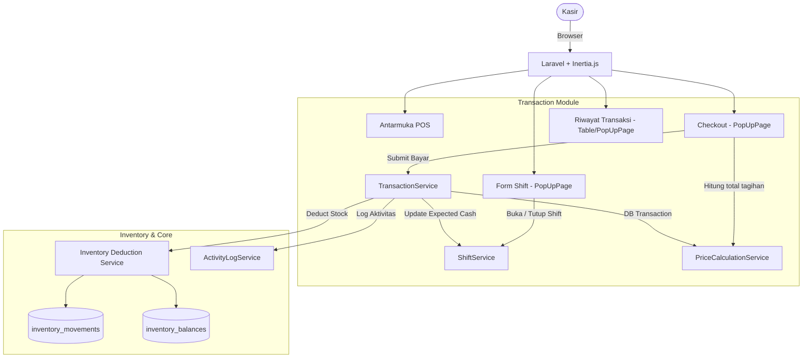
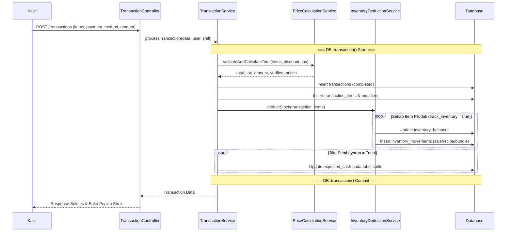
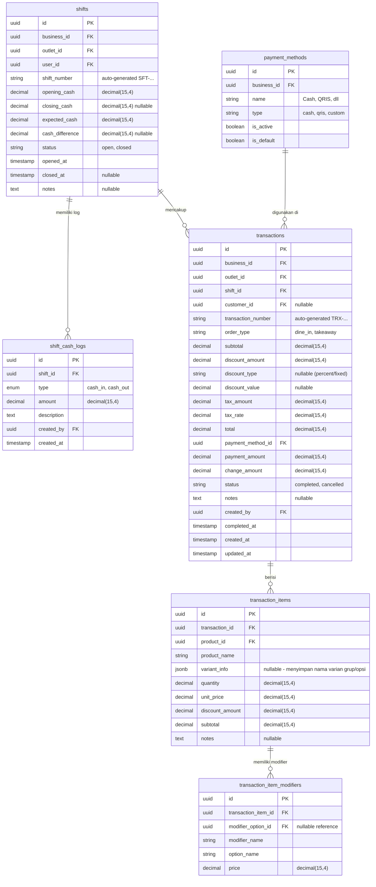

# PRD — Transaction & POS (V1)

## 1. Overview

Modul Transaction (Point of Sale / POS) adalah inti operasional dari aplikasi Sollu POS. Modul ini bertanggung jawab untuk memproses penjualan kasir mulai dari **manajemen shift kasir**, pencatatan **keranjang pesanan (cart)**, penerapan **diskon**, hingga **checkout dan pembayaran**. Pada versi V1, sistem mendukung tipe pesanan Dine-in dan Takeaway, serta metode pembayaran seperti Tunai (dengan perhitungan kembalian otomatis), QRIS (tanpa integrasi otomatis), dan metode custom lainnya. 

Setiap transaksi yang berhasil diselesaikan akan secara atomik memotong stok inventori melalui integrasi langsung ke tabel `inventory_movements` (menggunakan tipe `sale`, `recipe_deduction`, atau `bundle_deduction` sesuai dengan arsitektur produk dasar, servis, atau bundle). Modul ini juga mencakup fitur cetak struk/receipt secara digital, perekaman log uang kas (cash in/out) per shift, dan ringkasan transaksi akhir shift (shift summary) untuk memudahkan rekonsiliasi harian.

---

## 2. Requirements

- **Cashier Shift Management:** Kasir harus melakukan "Buka Shift" dengan memasukkan saldo kas awal (`opening_cash`) sebelum dapat memproses transaksi. Saat selesai bertugas, kasir melakukan "Tutup Shift" dan memasukkan uang kas fisik akhir, yang kemudian dibandingkan sistem (`expected_cash` vs `closing_cash`) untuk menghitung selisih (`cash_difference`).
- **Cart & Order Items:** Antarmuka POS harus mendukung penambahan produk ke keranjang, pemilihan varian (opsional jika produk memiliki `has_variant`), pemilihan modifier (opsional/wajib jika `has_modifier`), penyesuaian kuantitas pesanan, serta penambahan catatan per baris item.
- **Order Types:** Sistem mendukung dua tipe pesanan pada V1: `Dine-in` dan `Takeaway`. Pilihan dining option ini tidak terintegrasi ke table management pada fase ini, melainkan sekadar referensi di struk.
- **Checkout & Payment:** Sistem dapat menghitung subtotal, pajak (berdasarkan `outlet_settings` milik outlet), diskon (baik di level item maupun bill/transaksi total), dan grand total. 
- **Payment Methods:** Pembayaran mendukung:
  - `Cash` (Tunai): Wajib memasukkan nominal uang yang diterima (`payment_amount`) untuk otomatis menghitung kembalian (`change_amount`).
  - `QRIS`: Statis (tanpa integrasi gateway pada V1), diverifikasi manual oleh kasir.
  - `Custom`: Merchant dapat membuat metode pembayaran custom melalui tabel `payment_methods`.
- **Receipt/Struk:** Setelah pembayaran, sistem dapat men-generate struk digital (tampil di browser/PopUp) dan memfasilitasi perintah cetak ulang (Reprint) ke printer thermal (fitur cetak printer menggunakan browser print dialog atau raw ESC/POS pada iterasi selanjutnya).
- **Transaction History:** Kasir dan manajer dapat melihat riwayat transaksi per shift dan per outlet, serta melihat detail lengkap setiap transaksi.
- **Inventory Integration:** Saat transaksi selesai, sistem harus memicu pengurangan stok secara otomatis dalam satu `DB::transaction()`. Pengurangan ini bergantung pada tipe produk (Basic = `sale`, Bundle = `bundle_deduction`, Produk ber-resep = `recipe_deduction`). Pengurangan hanya terjadi jika `track_inventory` = `true`.
- **Customer Attachment:** Modul pelanggan berdiri sendiri, namun kasir memiliki opsi untuk menautkan `customer_id` ke dalam transaksi (opsional).
- **Format Penomoran:** Transaksi mengikuti format `TRX-{YYYYMMDD}-{sequence}`. Shift menggunakan format `SFT-{YYYYMMDD}-{sequence}`.
- **Pencatatan Aktivitas:** Setiap pembuatan transaksi dan pergantian status shift wajib dicatat oleh `ActivityLogService`.
- **Atomic Operations:** Pembuatan transaksi, pemotongan stok, serta penyesuaian perhitungan shift kasir harus berada dalam satu transaksi database atomik untuk menghindari data yatim.

> **Catatan Fase 2 (Out of Scope):** Refund, Void, Hold/Save Order, Table Management, Offline mode, Integrasi Payment Gateway (Midtrans), dan EDC/Card.

---

## 3. Core Features

- **Buka Shift (Open Shift):** Form untuk memasukkan saldo awal kas saat memulai hari/jadwal kerja.
- **POS Antarmuka / Menu (Point of Sale):** Tampilan kasir yang interaktif yang berisi daftar kategori, produk, pencarian produk, serta sidebar keranjang pesanan.
- **Pilihan Varian & Modifier (PopUpPage):** Ketika produk dengan varian atau modifier dipilih, tampilkan PopUpPage untuk memilih opsi yang tersedia sebelum masuk ke keranjang.
- **Diskon & Pajak:** Dukungan penerapan diskon (persen atau nominal) baik untuk item tunggal maupun total tagihan, dan perhitungan pajak outlet otomatis.
- **Checkout:** Menghitung total tagihan, menerima pembayaran (mencatat uang tunai dan kembalian, atau memverifikasi metode lain).
- **Tutup Shift (Close Shift):** Form rekapitulasi shift yang mencatat saldo fisik akhir, serta mencatat perhitungan perbedaan uang kas.
- **Riwayat Transaksi:** Halaman daftar transaksi sukses berdasarkan shift saat ini atau pencarian masa lalu, lengkap dengan detail transaksi.
- **Cetak Ulang Struk (Reprint):** Tombol pada detail transaksi untuk mencetak ulang struk.

---

## 4. User Flow

### **Buka Shift**
1. Kasir masuk ke halaman **POS**.
2. Jika belum ada shift yang aktif (Open) untuk kasir tersebut di outlet bersangkutan, sistem otomatis menampilkan form PopUp **Buka Shift**.
3. Kasir memasukkan **Uang Kas Awal** dan **Catatan** (opsional).
4. Kasir klik **Buka Shift**.
5. Sistem membuat rekam `shifts` berstatus `open` dan `shift_cash_logs` (tipe `cash_in`).
6. Kasir diteruskan ke antarmuka POS utama.

### **Tambah Pesanan & Checkout (Transaksi)**
1. Pada halaman POS, kasir melihat daftar produk yang dikelompokkan berdasarkan kategori.
2. Kasir mencari produk atau klik produk dari grid.
3. Jika produk tidak memiliki varian/modifier, langsung masuk ke panel keranjang. Jika memiliki, sistem memunculkan PopUp untuk memilih **Varian** dan **Modifier**.
4. Kasir memilih **Tipe Pesanan** (Dine-in / Takeaway).
5. Kasir dapat mengubah kuantitas atau klik baris produk di keranjang untuk menambahkan diskon per item atau catatan.
6. Kasir mengklik tombol **Checkout**.
7. PopUp Checkout muncul. Kasir melihat rincian Subtotal, Pajak, Diskon Bill, dan Total Tagihan.
8. Kasir memilih **Metode Pembayaran** (Tunai, QRIS, atau custom). 
   - Jika Tunai, kasir mengisi jumlah uang yang diterima. Sistem otomatis menampilkan jumlah **Kembalian**.
9. Kasir klik **Bayar & Selesaikan**.
10. Sistem dalam satu `DB::transaction()`:
    a. Memverifikasi validitas data dan ketersediaan stok.
    b. Membuat rekam `transactions`, `transaction_items`, dan `transaction_item_modifiers`.
    c. Men-trigger `InventoryDeductionService` untuk memotong stok (`inventory_movements` dan `inventory_balances`).
    d. Mengupdate ekspektasi kas `expected_cash` pada tabel `shifts` (jika pembayaran tunai).
11. Menampilkan notifikasi sukses, menyajikan tampilan **Struk Digital**, dengan tombol cetak.

### **Riwayat & Cetak Ulang Struk**
1. Kasir membuka menu **Riwayat Transaksi** dari halaman POS atau menu navigasi.
2. Sistem menampilkan daftar transaksi (difilter default per shift saat ini).
3. Kasir klik satu transaksi untuk melihat detail pesanan (PopUpPage).
4. Jika kasir memiliki permission `transaction.reprint`, kasir dapat menekan tombol **Cetak Ulang Struk**.

### **Tutup Shift**
1. Kasir memilih opsi **Tutup Shift** dari menu profil/header POS.
2. Sistem menampilkan PopUpPage ringkasan (Total Penjualan Tunai, Total Transaksi, dsb) dan form **Uang Kas Akhir Fisik**.
3. Kasir menghitung uang di laci kasir dan memasukkannya.
4. Kasir mengisi **Catatan** (wajib jika ada selisih uang).
5. Kasir klik **Tutup Shift**.
6. Sistem membandingkan uang fisik akhir (`closing_cash`) dengan ekspektasi sistem (`expected_cash`) lalu menyimpan selisih pada `cash_difference`, dan mengubah status shift menjadi `closed`.

---

## 5. Architecture

Modul Transaction menggunakan pola Controller → Service → Model yang memisahkan logika cart, pricing, inventory deduction, dan shift logic.

### Sequence Diagram — Transaksi & Pengurangan Stok

---

## 6. Database Schema

### Tabel Baru

- `shifts` — Menyimpan informasi siklus waktu kerja kasir, saldo, dan laporan perbedaan.
- `shift_cash_logs` — Menyimpan riwayat uang masuk/keluar pada sebuah shift.
- `transactions` — Menyimpan dokumen utama transaksi/penjualan.
- `transaction_items` — Menyimpan baris produk pada transaksi terkait.
- `transaction_item_modifiers` — Menyimpan ekstensi modifier dari produk dalam transaksi (jika produk di-custom).
- `payment_methods` — Metode pembayaran (master data per business).

### Tabel Existing Digunakan
- `outlets` — Sebagai scope transaksi.
- `inventory_balances`, `inventory_movements` — Untuk sinkronisasi pemotongan stok.
- `products`, `product_prices`, dsb — Referensi katalog.

### Catatan Desain Penting

| Aspek | Detail |
|---|---|
| **Shift Validation** | Setiap kali transaksi baru di-create, sistem mengecek apakah tabel `shifts` untuk user dan outlet ini berstatus `open`. Jika tidak, request gagal. |
| **Penyimpanan Harga** | Nama produk, varian, modifier, dan harga langsung di-hardcopy (denormalized) ke `transaction_items` agar histori tidak berubah apabila nama/harga produk di master di-update kelak. |
| **expected_cash** | Kalkulasi saat buka shift: `expected_cash` = `opening_cash`. Saat transaksi cash berhasil: `expected_cash` = `expected_cash + payment_amount - change_amount`. |
| **Inventory Track check** | Service pemotongan stok memeriksa `products.track_inventory`. Jika false, skip. |

---

## 7. Tech Stack

- **Frontend:** Vue 3 (Composition API) + Tailwind CSS v4 + Inertia.js. Komponen khusus POS grid yang teroptimasi tanpa me-reload (SPA). Form shift dan checkout menggunakan kerangka `PopUpPage`.
- **Backend:** Laravel 11.
- **Services:**
  - `TransactionService`: Meng-handle pembuatan transaksi utama, delegasi perhitungan harga dan stok.
  - `PriceCalculationService`: Menerima array item cart dan diskon, mengembalikan subtotal, total, pajak berdasar setting outlet.
  - `ShiftService`: Mengelola pembukaan dan penutupan shift, serta rekap logging saldo.
  - `InventoryDeductionService`: Service sentral yang meresolve item transaksi menjadi item inventori mentah (memecah resep, dsb) lalu membuat `inventory_movements` secara atomic.
- **Request Validation:**
  - `StoreTransactionRequest` (validasi produk exist, harga tidak dimanipulasi sepihak, item > 0, tipe pembayaran sesuai).
  - `OpenShiftRequest` (validasi `opening_cash` >= 0).
  - `CloseShiftRequest` (validasi `closing_cash` >= 0, catatan required jika selisih > 0 atau selisih < 0).
- **Enum (PHP):**
  - `OrderTypeEnum`: `DineIn = 'dine_in'`, `Takeaway = 'takeaway'`.
  - `ShiftStatusEnum`: `Open = 'open'`, `Closed = 'closed'`.
  - `TransactionStatusEnum`: `Completed = 'completed'`, `Cancelled = 'cancelled'` (cancelled digunakan pada phase berikutnya).
- **Models:** `Shift`, `ShiftCashLog`, `Transaction`, `TransactionItem`, `TransactionItemModifier`, `PaymentMethod`.

---

## 8. Hak Akses (Authorization)

Modul Transaksi mengacu pada `PermissionEnum.php`.

| Permission | Kasir | Supervisor | Owner / Admin | Keterangan |
|---|---|---|---|---|
| `transaction.*` | Tidak | Ya | Ya | Akses penuh atas semua aksi transaksi |
| `transaction.view` | Ya | Ya | Ya | Boleh melihat modul POS & Riwayat |
| `transaction.create` | Ya | Ya | Ya | Memproses checkout & order |
| `transaction.discount` | Tidak | Ya | Ya | Memasukkan nominal diskon manual |
| `transaction.reprint` | Ya | Ya | Ya | Mencetak ulang struk lama |
| `transaction.open_shift` | Ya | Ya | Ya | Membuka shift sendiri |
| `transaction.close_shift` | Ya | Ya | Ya | Menutup shift sendiri |

---

## 9. Validasi & Error Handling

| Skenario | Validasi | Pesan Error (Bahasa Indonesia) |
|---|---|---|
| Buka shift ketika masih ada shift aktif | Custom check | "Anda masih memiliki shift yang terbuka. Harap tutup shift sebelumnya terlebih dahulu." |
| Checkout tanpa shift | Middleware/Check | "Shift belum dibuka. Silakan buka shift terlebih dahulu untuk memproses pesanan." |
| Cart kosong saat bayar | Array validation `min:1` | "Keranjang pesanan masih kosong." |
| Bayar tunai uang kurang | Custom validation (`payment_amount >= total`) | "Jumlah uang pembayaran tunai kurang dari total tagihan." |
| Tutup shift selisih tapi tanpa catatan | Custom validation | "Catatan wajib diisi karena terdapat selisih jumlah uang fisik dengan sistem." |
| Item produk dinonaktifkan / dihapus saat proses | `exists:products,id,is_active,1` | "Beberapa produk dalam keranjang tidak valid atau sudah tidak aktif." |
| Stok kurang (jika business_setting menolak over-sell) | Service exception dari `InventoryDeductionService` | "Stok untuk produk {nama} tidak mencukupi untuk memproses transaksi." |

---

## 10. UI Components Reference

### Halaman Kasir (POS)

**Bagian Kiri/Tengah (Grid Produk):**
- **Kategori Tab/Pills:** Navigasi kategori produk (Semua, Makanan, Minuman, dsb).
- **Pencarian:** Input `SearchableSelect` / `TextField` untuk cari cepat.
- **Card Produk:** Kotak menampilkan gambar produk (jika ada), nama, dan harga. Menampilkan badge kecil (misal "Stok Habis") jika inventory rule tidak mencukupi.

**Bagian Kanan (Keranjang Pesanan):**
- **Header Keranjang:** Pilihan Tipe Pesanan (`DropdownField`: Dine-in, Takeaway). Opsi attach Pelanggan.
- **Daftar Item:** Baris item menampilkan Nama Produk, Pilihan Varian/Modifier kecil di bawahnya, dan Harga subtotal item. Tombol [+] dan [-] untuk qty.
- **Ringkasan Keuangan:** Subtotal, Diskon (-), Pajak (+), Total.
- **Tombol Utama:** **Bayar** (Memicu PopUp Checkout).

### Form Checkout (PopUpPage)

| Field | Tipe / Keterangan |
|---|---|
| Ringkasan Harga | Menampilkan Total Tagihan secara jelas & berukuran besar. |
| Metode Pembayaran | `DropdownField` (Tunai, QRIS, Transfer, dsb). |
| Uang Diterima | `TextField` (format Rupiah) — hanya muncul jika Tunai dipilih. |
| Kembalian | Label/text readonly — dihitung real-time. |
| Action | Tombol **Bayar & Selesaikan** (btn-main) / **Batal** (btn-flat). |

### Form Shift (PopUpPage)

**Buka Shift:**
| Field | Keterangan |
|---|---|
| Uang Kas Awal | `TextField` format angka Rupiah. |
| Catatan | `TextareaField` opsional. |

**Tutup Shift:**
| Field | Keterangan |
|---|---|
| Total Penjualan | Teks informasional sistem. |
| Uang Kas Sistem (Expected) | Teks informasional sistem (`expected_cash`). |
| Uang Kas Fisik | `TextField` tempat kasir memasukkan hasil hitung riil. |
| Selisih | Terhitung real-time, warna merah jika negatif, hijau jika positif, netral jika 0. |
| Catatan | `TextareaField` (Wajib jika ada selisih). |

### Struk / Receipt Viewer

**Tampilan:** Meniru layaknya kertas struk termal.
**Komponen:**
- Header (Logo, Nama Bisnis, Alamat Outlet).
- Detail Transaksi (No Struk, Tanggal, Nama Kasir, Tipe Pesanan).
- Item List (Qty x Harga, plus modifier).
- Summary (Subtotal, Diskon, Pajak, Grand Total, Jenis Pembayaran, Jumlah Bayar, Kembalian).
- Tombol (btn-main: **Cetak Struk**).

### Mapping Label Bahasa Indonesia

| Value (DB / Code) | Label (Tampilan UI) |
|---|---|
| `dine_in` | Makan di Tempat (Dine-in) |
| `takeaway` | Bawa Pulang (Takeaway) |
| `cash` | Tunai |
| `completed` | Selesai |
| `cancelled` | Dibatalkan |
| `open` (shift) | Aktif / Buka |
| `closed` (shift) | Selesai / Tutup |
