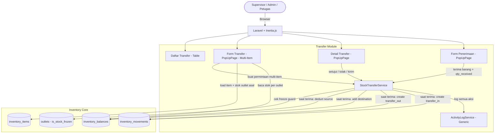
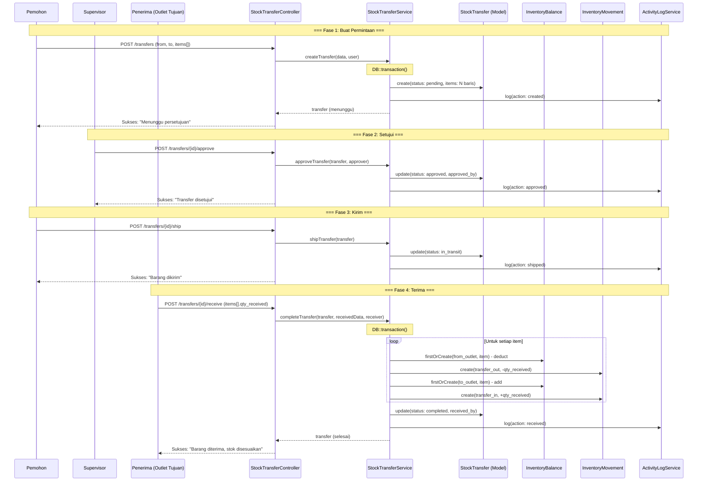
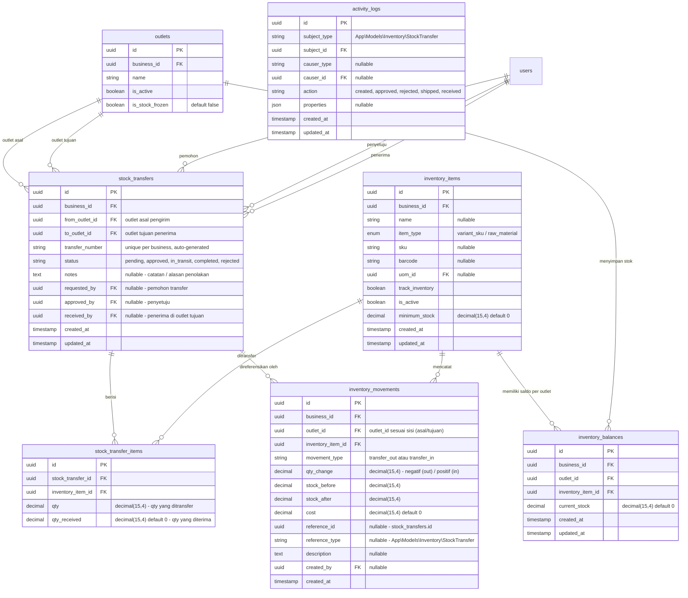

# PRD — Inventory - Transfer Stock (Transfer Stok Antar Outlet)

## 1. Overview

Modul Transfer Stock bertanggung jawab untuk mengelola proses **pemindahan stok barang dari satu outlet ke outlet lain** dalam satu bisnis yang sama. Transfer stok diperlukan ketika outlet tertentu mengalami kelebihan stok sementara outlet lain membutuhkan pasokan, atau untuk keperluan redistribusi persediaan antar cabang. Modul ini mendukung alur kerja **multi-tahap dengan approval** — permintaan transfer dibuat oleh pengguna, disetujui oleh Supervisor/Owner, barang dikirim (dalam perjalanan), lalu diterima oleh outlet tujuan. Saat penerimaan, stok outlet pengirim berkurang (`transfer_out`) dan stok outlet penerima bertambah (`transfer_in`), keduanya tercatat sebagai `inventory_movements`. Modul ini mendukung **penerimaan parsial** — outlet tujuan dapat menerima sebagian dari jumlah yang ditransfer. Seluruh tipe inventory item (`raw_material` maupun `variant_sku`) dapat ditransfer. Modul ini terintegrasi dengan fitur **Bekukan Stok (Freeze Stock)** — transfer tidak dapat diproses jika salah satu outlet yang terlibat sedang dibekukan.

---

## 2. Requirements

- **Inter-Outlet Transfer:** Transfer stok hanya berlaku antar outlet dalam satu bisnis yang sama. Outlet asal (`from_outlet_id`) dan outlet tujuan (`to_outlet_id`) wajib berbeda.
- **Transfer Document:** Sistem harus menyediakan dokumen header transfer (`stock_transfers`) dengan nomor unik (`transfer_number`) yang dihasilkan otomatis, format: `TF-{YYYYMM}-{sequence}`, contoh: `TF-202608-001`.
- **Multi-Item Input:** Satu dokumen transfer dapat berisi satu atau lebih item. Pengguna menambahkan item secara dinamis beserta jumlah yang akan ditransfer (`qty`). Jumlah item otomatis terhitung dari baris yang diinput.
- **All Inventory Item Types:** Seluruh tipe inventory item yang aktif (`is_active = true`) dapat ditransfer, baik `raw_material` maupun `variant_sku`. Tidak ada pembatasan berdasarkan `item_type`.
- **Status Flow:** Dokumen transfer mendukung alur status:
    - `Menunggu` (`pending`) — Permintaan transfer baru dibuat, menunggu persetujuan.
    - `Disetujui` (`approved`) — Supervisor/Owner menyetujui permintaan transfer.
    - `Dalam Perjalanan` (`in_transit`) — Barang sudah dikirim dari outlet asal, dalam perjalanan ke outlet tujuan.
    - `Selesai` (`completed`) — Barang diterima di outlet tujuan, stok sudah disesuaikan.
    - `Ditolak` (`rejected`) — Permintaan transfer ditolak, tidak ada perubahan stok.
- **Approval Workflow:** Permintaan transfer yang baru dibuat berstatus `Menunggu` dan **belum memengaruhi stok**. Transfer harus disetujui oleh user ber-permission `inventory.transfer.approve` sebelum dapat dikirim.
- **Pengiriman (Transit):** Setelah disetujui, user mengubah status ke `Dalam Perjalanan` yang menandakan barang sudah dikirim. Pada fase ini, stok outlet asal **belum berkurang** — stok hanya berubah saat penerimaan di outlet tujuan.
- **Penerimaan Barang:** Outlet tujuan menerima barang dan menginput jumlah yang benar-benar diterima (`qty_received`) per item. Saat penerimaan:
    - Stok outlet asal berkurang sebesar `qty_received` (movement `transfer_out`).
    - Stok outlet tujuan bertambah sebesar `qty_received` (movement `transfer_in`).
    - Kedua movement dibuat dalam satu transaksi atomic.
- **Penerimaan Parsial:** `qty_received` boleh kurang dari `qty` yang ditransfer. Selisih dianggap sebagai kehilangan/kerusakan selama perjalanan dan dicatat di catatan.
- **Stock Validation:** Saat penerimaan, sistem memvalidasi bahwa stok outlet asal mencukupi untuk dikurangi (`stock_after >= 0`).
- **Balance Auto-Create:** Jika `inventory_balances` untuk kombinasi `(outlet_id, inventory_item_id)` belum ada pada outlet asal atau tujuan, sistem harus otomatis membuatnya dengan `current_stock = 0` (`firstOrCreate`).
- **Atomic Transaction:** Seluruh proses penerimaan (deduct source + add destination + create movements) harus dibungkus dalam `DB::transaction()`.
- **Decimal Quantity:** Mendukung fractional quantity menggunakan `decimal(15,4)` pada semua kolom qty.
- **Auditability:** Seluruh transfer tercatat di `inventory_movements` dengan `created_by`, `reference_id` (mengarah ke `stock_transfers`), `reference_type`, dan `created_at`.
- **Activity Logging:** Setiap perubahan status dicatat oleh `ActivityLogService` ke tabel `activity_logs`.
- **Freeze Stock Guard:** Transfer tidak dapat diproses (approve, kirim, terima) jika outlet asal atau outlet tujuan sedang dalam status **Stok Dibekukan** (`is_stock_frozen = true`).
- **Edit Selama Pending:** Selama status `Menunggu`, data transfer (outlet, items, qty, catatan) masih dapat diubah. Setelah disetujui, data tidak dapat diubah lagi.
- **No Physical Delete:** Dokumen transfer tidak boleh dihapus permanen. Transfer `Menunggu` dapat ditolak. Transfer yang sudah `Selesai` bersifat final.
- **Catatan (Notes):** Dokumen transfer memiliki field catatan (`notes`) untuk mencatat informasi tambahan.

---

## 3. Core Features

- **Buat Permintaan Transfer (Multi-Item):** Pengguna membuat dokumen transfer dengan memilih outlet asal, outlet tujuan, lalu menambahkan item beserta qty. Dokumen disimpan berstatus `Menunggu`.
- **Setujui Transfer:** Supervisor/Owner menyetujui permintaan transfer. Status berubah ke `Disetujui`.
- **Tolak Transfer:** Supervisor/Owner menolak permintaan transfer dengan catatan alasan. Status berubah ke `Ditolak`, tidak ada perubahan stok.
- **Kirim Transfer (Transit):** Setelah disetujui, user menandai barang sudah dikirim. Status berubah ke `Dalam Perjalanan`.
- **Terima Barang:** Outlet tujuan menerima barang, menginput `qty_received` per item. Stok asal berkurang, stok tujuan bertambah. Status berubah ke `Selesai`.
- **Daftar Transfer:** Tabel seluruh transfer: nomor, tanggal, outlet asal → tujuan, jumlah item, status (bahasa Indonesia), pemohon, penyetuju, penerima.
- **Detail Transfer (PopUpPage):** Detail lengkap satu dokumen dalam PopUpPage — header, tabel item (qty dikirim, qty diterima, selisih), tombol aksi sesuai status.
- **Filter & Pencarian:** Pencarian berdasarkan nomor transfer. Filter berdasarkan: status, outlet asal, outlet tujuan, dan rentang tanggal.
- **Pencatatan Aktivitas:** Mencatat semua aksi menggunakan `ActivityLogService`.

---

## 4. User Flow

### **Membuat Permintaan Transfer**

1. User masuk ke menu **Inventori > Transfer Stok**.
2. Sistem menampilkan daftar transfer dengan kolom: No. Transfer, Tanggal, Dari Outlet, Ke Outlet, Jumlah Item, Status, Pemohon.
3. User klik **Buat Transfer Baru**.
4. Sistem menampilkan form PopUpPage:
    - **Dari Outlet** — Dropdown outlet aktif milik bisnis.
    - **Ke Outlet** — Dropdown outlet aktif milik bisnis (wajib berbeda dari outlet asal).
    - **Catatan** — Textarea (opsional).
    - **Daftar Item** — Tabel dinamis:
        - **Item** — Dropdown inventory item aktif (semua tipe). Menampilkan: `{nama} (Stok: {qty} {satuan})`. Stok yang ditampilkan adalah stok di outlet asal.
        - **Qty Transfer** — Input angka, minimal 0.01.
        - **Hapus** — Tombol hapus baris.
    - **Tombol + Tambah Item** — Menambahkan baris item baru.
    - **Jumlah Item** — Terhitung otomatis.
5. User mengisi form dan klik **Simpan Permintaan**.
6. Sistem melakukan validasi:
    - Outlet asal dan tujuan wajib diisi dan berbeda.
    - Minimal 1 item.
    - Setiap item: inventory_item_id dan qty wajib diisi, qty > 0.
    - Item tidak boleh duplikat dalam satu dokumen.
    - Outlet asal dan tujuan tidak boleh dalam status dibekukan.
7. Sistem dalam satu `DB::transaction()`:
   a. Buat record `stock_transfers` dengan status `pending`.
   b. Buat record `stock_transfer_items` per item.
   c. Catat ke `activity_logs` (action: `created`).
8. Sistem menampilkan pesan sukses: "Permintaan transfer berhasil disimpan. Menunggu persetujuan."

### **Menyetujui Transfer**

1. User (Supervisor/Owner) membuka Detail PopUpPage transfer berstatus `Menunggu`.
2. User mereview: outlet asal → tujuan, daftar item, qty.
3. User klik **Setujui**.
4. Sistem mengecek freeze guard pada kedua outlet.
5. Sistem update `stock_transfers.status = approved`, set `approved_by`.
6. Catat ke `activity_logs` (action: `approved`).
7. Pesan sukses: "Transfer disetujui."

### **Menolak Transfer**

1. User (Supervisor/Owner) membuka Detail PopUpPage transfer berstatus `Menunggu`.
2. User klik **Tolak**.
3. Sistem menampilkan dialog konfirmasi dengan input alasan penolakan.
4. User mengisi alasan dan konfirmasi.
5. Sistem update `stock_transfers.status = rejected`, simpan alasan ke `notes`.
6. Catat ke `activity_logs` (action: `rejected`).
7. Tidak ada perubahan stok.

### **Mengirim Transfer (Transit)**

1. User membuka Detail PopUpPage transfer berstatus `Disetujui`.
2. User klik **Kirim Barang**.
3. Sistem mengecek freeze guard pada outlet asal.
4. Sistem update `stock_transfers.status = in_transit`.
5. Catat ke `activity_logs` (action: `shipped`).
6. Pesan sukses: "Barang ditandai sudah dikirim."

### **Menerima Barang**

1. User (di outlet tujuan) membuka Detail PopUpPage transfer berstatus `Dalam Perjalanan`.
2. Sistem menampilkan form penerimaan:
    - Tabel item dengan kolom: Nama Item, Qty Dikirim, **Qty Diterima** (input angka), Selisih.
    - Qty Diterima default = Qty Dikirim. User dapat mengubah jika ada barang rusak/hilang selama perjalanan.
3. User menginput qty diterima per item dan klik **Terima Barang**.
4. Sistem melakukan validasi:
    - `qty_received >= 0` dan `qty_received <= qty` per item.
    - Stok outlet asal mencukupi untuk dikurangi.
    - Kedua outlet tidak dalam status dibekukan.
5. Sistem dalam satu `DB::transaction()`:
   a. Untuk setiap item dengan `qty_received > 0`:
    - **Outlet Asal (Transfer Out):**
        - Ambil atau buat `inventory_balances` (`firstOrCreate`).
        - `stock_before = current_stock`.
        - `stock_after = stock_before - qty_received`.
        - Update `inventory_balances.current_stock`.
        - Buat `inventory_movements` (type: `transfer_out`, qty_change: `-qty_received`).
    - **Outlet Tujuan (Transfer In):** - Ambil atau buat `inventory_balances` (`firstOrCreate`). - `stock_before = current_stock`. - `stock_after = stock_before + qty_received`. - Update `inventory_balances.current_stock`. - Buat `inventory_movements` (type: `transfer_in`, qty_change: `+qty_received`).
      b. Update `stock_transfer_items.qty_received` per item.
      c. Update `stock_transfers.status = completed`, set `received_by`.
      d. Catat ke `activity_logs` (action: `received`).
6. Sistem menampilkan pesan sukses: "Barang diterima, stok telah disesuaikan."

### **Melihat Detail Transfer (PopUpPage)**

1. User klik baris transfer di daftar.
2. Sistem membuka **PopUpPage** detail:
    - **Header:** No. Transfer, Dari Outlet → Ke Outlet, Status (badge warna, bahasa Indonesia), Catatan, Pemohon + tanggal, Penyetuju + tanggal, Penerima + tanggal.
    - **Tabel Item:** Nama Item, SKU, Satuan, Qty Dikirim, Qty Diterima (jika sudah selesai), Selisih.
    - **Ringkasan Footer:** Jumlah Item: {N}
    - **Footer Aksi:**
        - `Menunggu` → **Setujui** (btn-main) + **Tolak** (btn-danger)
        - `Disetujui` → **Kirim Barang** (btn-info)
        - `Dalam Perjalanan` → **Terima Barang** (btn-main, membuka form penerimaan)
        - `Selesai` / `Ditolak` → Tidak ada tombol aksi (read-only)

---

## 5. Architecture

Modul Transfer Stock mengikuti pendekatan **Modular Monolith** dengan pola Controller → Service → Model. Transfer memiliki status flow multi-tahap. Perubahan stok hanya terjadi saat penerimaan barang di outlet tujuan. Dua movement dibuat per item: `transfer_out` (outlet asal) dan `transfer_in` (outlet tujuan).

### Sequence Diagram — Buat, Setujui, Kirim & Terima Transfer

---

## 6. Database Schema

### Tabel yang Digunakan

**Tabel Existing:**

- `stock_transfers` — Header dokumen transfer dengan multi-tahap workflow.
- `stock_transfer_items` — Detail item per dokumen transfer (qty, qty_received).

**Tabel Existing yang Digunakan:**

- `inventory_movements` — Setiap penerimaan menghasilkan 2 movement per item: `transfer_out` (outlet asal) dan `transfer_in` (outlet tujuan).
- `inventory_balances` — Snapshot stok outlet asal (dikurangi) dan outlet tujuan (ditambah).
- `inventory_items` — Master data item untuk dropdown.
- `outlets` — Data outlet asal/tujuan, termasuk `is_stock_frozen`.
- `activity_logs` — Audit trail via `ActivityLogService`.

### Catatan Desain Penting

| Aspek                        | Detail                                                                                                                                                     |
| ---------------------------- | ---------------------------------------------------------------------------------------------------------------------------------------------------------- |
| **Alur status**              | `pending` → `approved` → `in_transit` → `completed`. Alternatif: `pending` → `rejected`                                                                    |
| **Stok berubah saat terima** | Stok **hanya berubah saat penerimaan** (`completed`), bukan saat approve atau transit. Ini menjaga akurasi — stok belum benar-benar pindah sampai diterima |
| **Dua movement per item**    | Setiap item yang diterima menghasilkan 2 record movement: `transfer_out` (outlet asal, qty negatif) dan `transfer_in` (outlet tujuan, qty positif)         |
| **Penerimaan parsial**       | `qty_received` boleh < `qty`. Selisih = barang hilang/rusak selama perjalanan                                                                              |
| **Freeze stock guard**       | Cek `is_stock_frozen` pada kedua outlet saat approve, kirim, dan terima                                                                                    |
| **Movement reference**       | Polymorphic: `reference_id` → `stock_transfers.id`, `reference_type` → `StockTransfer::class`                                                              |
| **Transfer number format**   | `TF-{YYYYMM}-{sequence}`, contoh: `TF-202608-001`. Sequence per bulan per bisnis                                                                           |
| **Semua tipe item**          | Semua inventory item aktif dapat ditransfer, tanpa filter `item_type`                                                                                      |
| **No timestamps pada items** | `stock_transfer_items` tidak memiliki timestamps                                                                                                           |
| **Decimal precision**        | Semua kolom qty: `decimal(15,4)`                                                                                                                           |

---

## 7. Tech Stack

- **Frontend:** Vue 3 (Composition API `<script setup>`) + Tailwind CSS v4 + Inertia.js. Form transfer (multi-item) dan detail transfer menggunakan `PopUpPage`. Form penerimaan menggunakan `PopUpPage` terpisah. Halaman daftar menggunakan pola `MainPage > MainPageHeader + Table + Pagination`. Komponen form: `DropdownField`, `TextField`, `TextareaField`. Daftar item dinamis menggunakan `v-for`.
- **Backend:** Laravel 11 (PHP 8.3). Arsitektur Controller → Service → Model.
- **Services:**
    - `StockTransferService` — Logika inti:
        - `createTransfer()`: Membuat dokumen transfer multi-item berstatus `pending`. Generate nomor. Dibungkus `DB::transaction()`.
        - `updateTransfer()`: Update items dan catatan. Validasi status harus `pending`.
        - `approveTransfer()`: Freeze guard check. Update status ke `approved`, set `approved_by`.
        - `rejectTransfer()`: Update status ke `rejected`, simpan catatan penolakan.
        - `shipTransfer()`: Freeze guard check (outlet asal). Update status ke `in_transit`.
        - `completeTransfer()`: Freeze guard check (kedua outlet). Untuk setiap item: deduct source balance → add destination balance → create 2 movements. Update status ke `completed`, set `received_by`. Dibungkus `DB::transaction()`.
    - `StockFreezeService` — Guard check `assertNotFrozen()` pada kedua outlet.
    - `ActivityLogService` (Generic) — Mencatat audit trail setiap aksi.
- **Request Validation:**
    - `StoreStockTransferRequest` — Validasi pembuatan:
        - `from_outlet_id` (required, uuid, exists)
        - `to_outlet_id` (required, uuid, exists, different:from_outlet_id)
        - `notes` (nullable, string)
        - `items` (required, array, min:1)
        - `items.*.inventory_item_id` (required, uuid, exists, distinct)
        - `items.*.qty` (required, numeric, min:0.01)
    - `UpdateStockTransferRequest` — Sama dengan store (status harus `pending`).
    - `ProcessStockTransferRequest` — Validasi penerimaan:
        - `items` (required, array, min:1)
        - `items.*.id` (required, uuid, exists:stock_transfer_items,id)
        - `items.*.qty_received` (required, numeric, min:0)
- **Enum (PHP):**
    - `TransferStatus` — `Pending = 'pending'`, `Approved = 'approved'`, `InTransit = 'in_transit'`, `Completed = 'completed'`, `Rejected = 'rejected'`. Method `label()`: Menunggu, Disetujui, Dalam Perjalanan, Selesai, Ditolak.
    - `InventoryMovementType::TransferOut`, `InventoryMovementType::TransferIn` — Existing enum values.
- **Model:** `StockTransfer` (existing), `StockTransferItem` (existing, timestamps: false), `InventoryBalance`, `InventoryMovement`.
- **Database:** PostgreSQL, UUID primary key, `decimal(15,4)` untuk quantity.
- **Authorization:** Spatie Laravel Permission.
- **Routes:**
    - `GET inventory/transfers` — daftar transfer (index)
    - `POST inventory/transfers` — buat permintaan (store)
    - `GET inventory/transfers/{id}` — detail (show)
    - `PUT inventory/transfers/{id}` — update permintaan (update, status pending only)
    - `POST inventory/transfers/{id}/approve` — setujui
    - `POST inventory/transfers/{id}/reject` — tolak
    - `POST inventory/transfers/{id}/ship` — kirim (transit)
    - `POST inventory/transfers/{id}/receive` — terima barang (complete)

---

## 8. Hak Akses (Authorization)

| Permission                   | Kasir | Supervisor | Owner / Admin |
| ---------------------------- | ----- | ---------- | ------------- |
| `inventory.transfer.read`    | Tidak | Ya         | Ya            |
| `inventory.transfer.create`  | Tidak | Ya         | Ya            |
| `inventory.transfer.update`  | Tidak | Ya         | Ya            |
| `inventory.transfer.approve` | Tidak | Ya         | Ya            |
| `inventory.transfer.ship`    | Tidak | Ya         | Ya            |
| `inventory.transfer.receive` | Tidak | Ya         | Ya            |

**Penjelasan:**

- **Kasir** tidak memiliki akses ke fitur transfer stok.
- **Supervisor** dapat membuat permintaan transfer, menyetujui/menolak transfer dari user lain, mengirim barang, dan menerima barang di outlet tanggung jawabnya. Supervisor **tidak bisa menyetujui transfer buatan sendiri** (segregation of duties).
- **Owner / Admin** memiliki akses penuh ke seluruh outlet, termasuk menyetujui transfer milik sendiri.

---

## 9. Validasi & Error Handling

| Skenario                            | Validasi                    | Pesan Error                                                                  |
| ----------------------------------- | --------------------------- | ---------------------------------------------------------------------------- |
| Outlet asal = tujuan                | `different:from_outlet_id`  | "Outlet tujuan harus berbeda dari outlet asal."                              |
| Item kosong                         | `required, array, min:1`    | "Minimal 1 item harus ditambahkan."                                          |
| Qty ≤ 0                             | `min:0.01`                  | "Jumlah transfer harus lebih dari 0."                                        |
| Item duplikat                       | `distinct`                  | "Item tidak boleh duplikat dalam satu dokumen."                              |
| Outlet tidak valid                  | `exists:outlets,id`         | "Outlet tidak ditemukan."                                                    |
| Item tidak valid                    | `exists:inventory_items,id` | "Item inventory tidak ditemukan."                                            |
| Qty received > qty                  | Custom validation           | "Jumlah diterima tidak boleh melebihi jumlah yang dikirim."                  |
| Stok asal tidak cukup (saat terima) | Custom validation           | "Stok outlet asal tidak mencukupi. Stok saat ini: {stok}, dikurangi: {qty}." |
| Setujui non-pending                 | Status check                | "Hanya transfer berstatus Menunggu yang dapat disetujui."                    |
| Tolak non-pending                   | Status check                | "Hanya transfer berstatus Menunggu yang dapat ditolak."                      |
| Kirim non-approved                  | Status check                | "Hanya transfer berstatus Disetujui yang dapat dikirim."                     |
| Terima non-in_transit               | Status check                | "Hanya transfer berstatus Dalam Perjalanan yang dapat diterima."             |
| Self-approve (Supervisor)           | Permission check            | "Anda tidak dapat menyetujui transfer yang Anda buat sendiri."               |
| Outlet asal dibekukan               | Freeze guard                | "Stok outlet asal sedang dibekukan. Hubungi admin."                          |
| Outlet tujuan dibekukan             | Freeze guard                | "Stok outlet tujuan sedang dibekukan. Hubungi admin."                        |

---

## 10. UI Components Reference

### Halaman Daftar Transfer

**Header:** "Transfer Stok" dengan tombol **Buat Transfer Baru** (btn-main) di kanan.

**Kolom Tabel:**

| Kolom        | Sumber Data                       | Keterangan                               |
| ------------ | --------------------------------- | ---------------------------------------- |
| No. Transfer | `stock_transfers.transfer_number` | Format: TF-YYYYMM-NNN                    |
| Tanggal      | `stock_transfers.created_at`      | Format: dd MMM yyyy HH:mm                |
| Dari Outlet  | `fromOutlet.name`                 | Via relasi                               |
| Ke Outlet    | `toOutlet.name`                   | Via relasi                               |
| Jumlah Item  | `stock_transfer_items_count`      | Auto-count via `withCount('items')`      |
| Status       | `stock_transfers.status`          | Badge bahasa Indonesia (lihat mapping)   |
| Pemohon      | `requester.name`                  | Via relasi requested_by                  |
| Aksi         | -                                 | Tombol: Lihat Detail (membuka PopUpPage) |

**Filter:**

- Pencarian: nomor transfer
- Status: dropdown (Semua, Menunggu, Disetujui, Dalam Perjalanan, Selesai, Ditolak)
- Outlet: dropdown (filter by outlet asal atau tujuan)

### Form Transfer (PopUpPage — Buat/Edit)

**Header Section:**

| Field       | Tipe     | Wajib | Keterangan                                                       |
| ----------- | -------- | ----- | ---------------------------------------------------------------- |
| Dari Outlet | Dropdown | Ya    | Outlet aktif (asal pengiriman). Menampilkan status freeze        |
| Ke Outlet   | Dropdown | Ya    | Outlet aktif (tujuan penerimaan). Wajib berbeda dari outlet asal |
| Catatan     | Textarea | Tidak | Catatan umum transfer                                            |

**Tabel Item Dinamis:**

| Kolom        | Tipe         | Wajib | Keterangan                                                                      |
| ------------ | ------------ | ----- | ------------------------------------------------------------------------------- |
| Item         | Dropdown     | Ya    | Semua item aktif. Tampil: `{nama} (Stok: {qty} {satuan})` — stok di outlet asal |
| Qty Transfer | Number input | Ya    | Minimal 0.01                                                                    |
| Hapus        | Tombol       | -     | Ikon trash, hapus baris item                                                    |

**Footer:**

- Kiri: **Jumlah Item: {N}** (auto-count)
- Kanan: **Batal** (btn-flat) + **Simpan Permintaan** (btn-main)
- Tombol **+ Tambah Item** di bawah tabel item

### Detail Transfer (PopUpPage — Lihat)

**Header Section:**

| Field        | Keterangan                                                               |
| ------------ | ------------------------------------------------------------------------ |
| No. Transfer | TF-202608-001                                                            |
| Dari Outlet  | Outlet A                                                                 |
| Ke Outlet    | Outlet B                                                                 |
| Status       | Badge warna: Menunggu / Disetujui / Dalam Perjalanan / Selesai / Ditolak |
| Catatan      | Catatan transfer atau alasan penolakan                                   |
| Pemohon      | Nama user + tanggal                                                      |
| Penyetuju    | Nama user + tanggal (jika sudah diproses)                                |
| Penerima     | Nama user + tanggal (jika sudah diterima)                                |

**Tabel Item:**

| Kolom        | Keterangan                                          |
| ------------ | --------------------------------------------------- |
| Nama Item    | Nama inventory item                                 |
| SKU          | Kode SKU                                            |
| Satuan       | UOM                                                 |
| Qty Dikirim  | Jumlah yang ditransfer                              |
| Qty Diterima | Jumlah yang diterima (tampil setelah selesai)       |
| Selisih      | Qty Dikirim - Qty Diterima (merah jika ada selisih) |

**Ringkasan Footer:** Jumlah Item: {N}

**Footer Aksi (sesuai status):**

- `Menunggu` → **Setujui** (btn-main) + **Tolak** (btn-danger)
- `Disetujui` → **Kirim Barang** (btn-info)
- `Dalam Perjalanan` → **Terima Barang** (btn-main, membuka form penerimaan)
- `Selesai` / `Ditolak` → Tidak ada tombol aksi (read-only)

### Form Penerimaan (PopUpPage — Terima Barang)

**Tabel Item Penerimaan:**

| Kolom        | Tipe            | Keterangan                                                  |
| ------------ | --------------- | ----------------------------------------------------------- |
| Nama Item    | Read-only       | Nama inventory item                                         |
| Satuan       | Read-only       | UOM                                                         |
| Qty Dikirim  | Read-only       | Jumlah yang ditransfer                                      |
| Qty Diterima | Number input    | Default = Qty Dikirim. User bisa kurangi jika ada kerusakan |
| Selisih      | Auto-calculated | Dikirim - Diterima. Merah jika ada selisih                  |

**Footer:** **Batal** (btn-flat) + **Terima Barang** (btn-main)

### Mapping Label Bahasa Indonesia

**Status:**

| Value (DB)   | Label (Tampilan) | Warna Badge |
| ------------ | ---------------- | ----------- |
| `pending`    | Menunggu         | Kuning      |
| `approved`   | Disetujui        | Biru        |
| `in_transit` | Dalam Perjalanan | Ungu        |
| `completed`  | Selesai          | Hijau       |
| `rejected`   | Ditolak          | Merah       |

### Contoh Data Tabel

| No. Transfer  | Tanggal           | Dari Outlet | Ke Outlet | Jumlah Item | Status           | Pemohon |
| ------------- | ----------------- | ----------- | --------- | ----------- | ---------------- | ------- |
| TF-202608-001 | 05 Agu 2026 14:30 | Outlet A    | Outlet B  | 5           | Menunggu         | Budi    |
| TF-202608-002 | 05 Agu 2026 10:00 | Outlet B    | Outlet A  | 3           | Dalam Perjalanan | Sari    |
| TF-202607-003 | 28 Jul 2026 09:00 | Outlet A    | Outlet C  | 8           | Selesai          | Andi    |
| TF-202607-002 | 15 Jul 2026 11:00 | Outlet C    | Outlet A  | 2           | Ditolak          | Dewi    |
